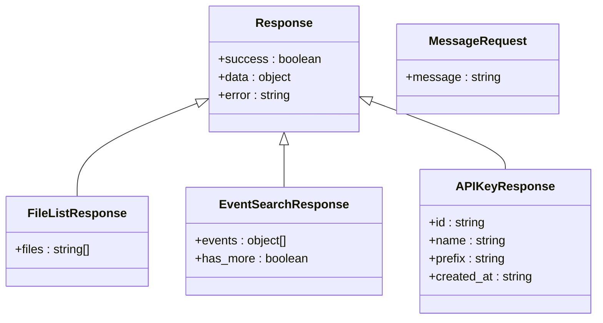
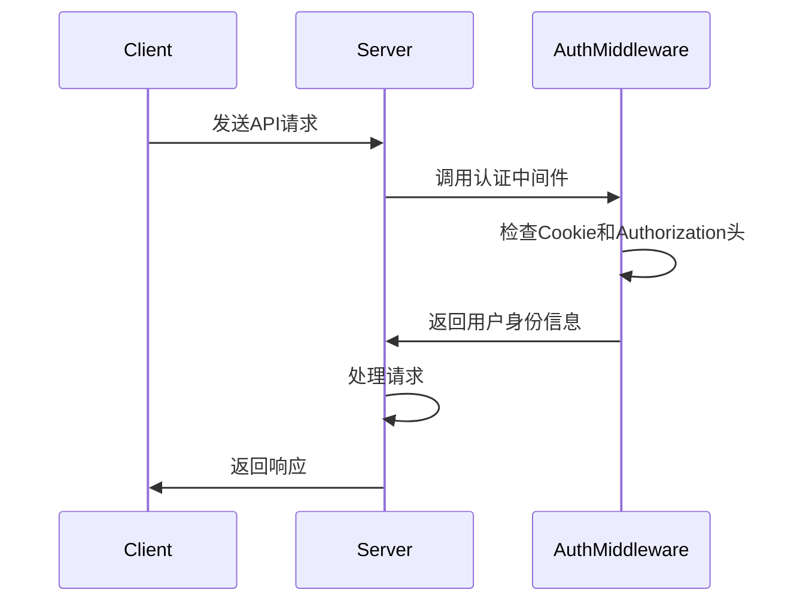
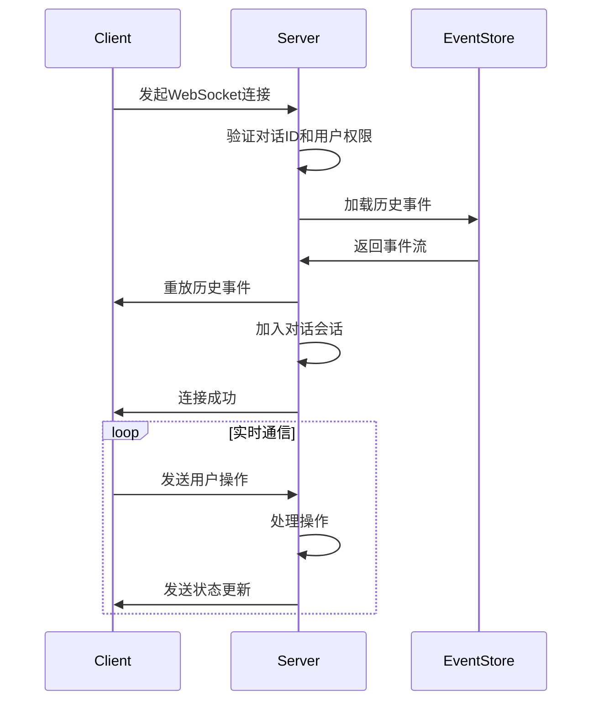
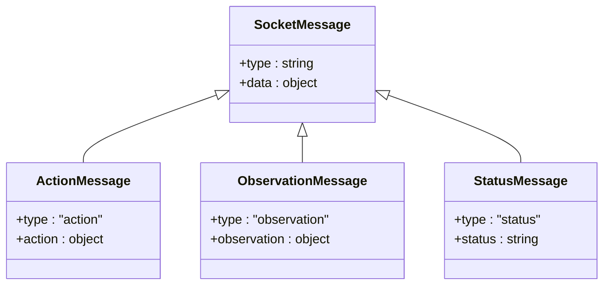
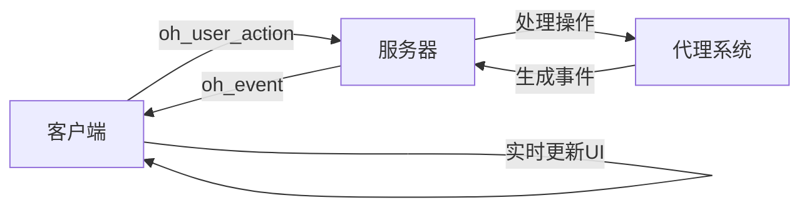
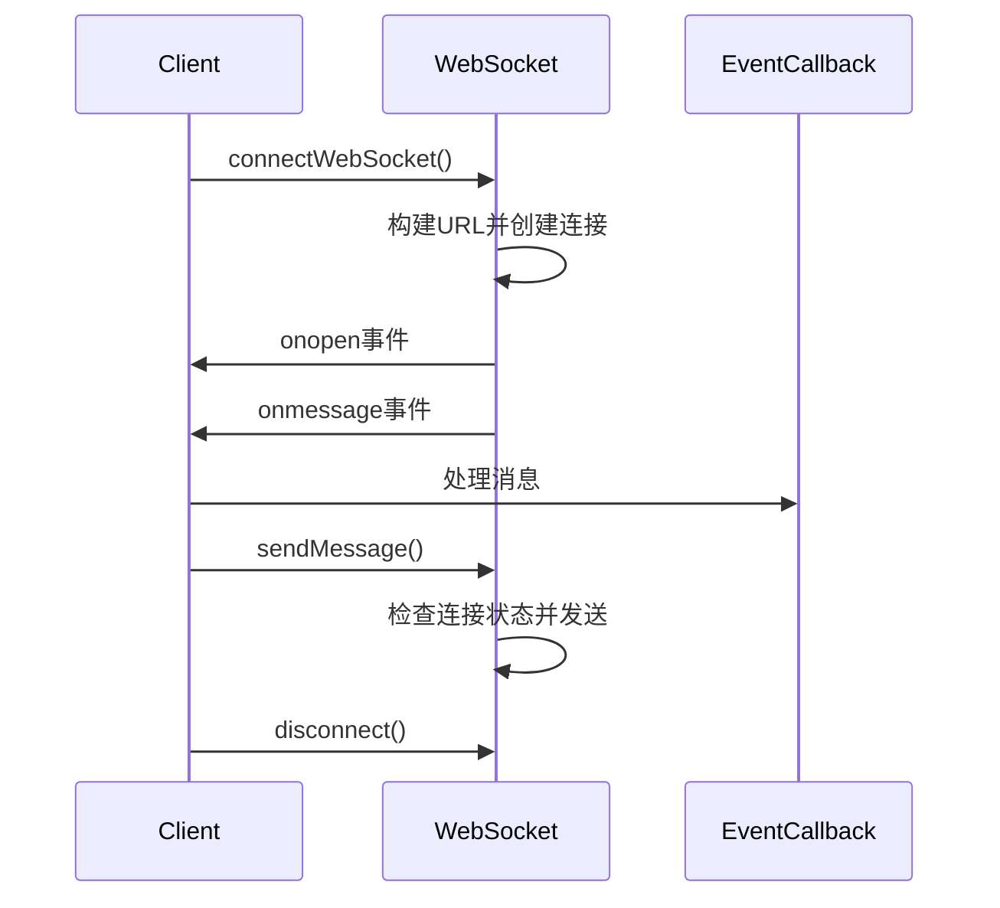
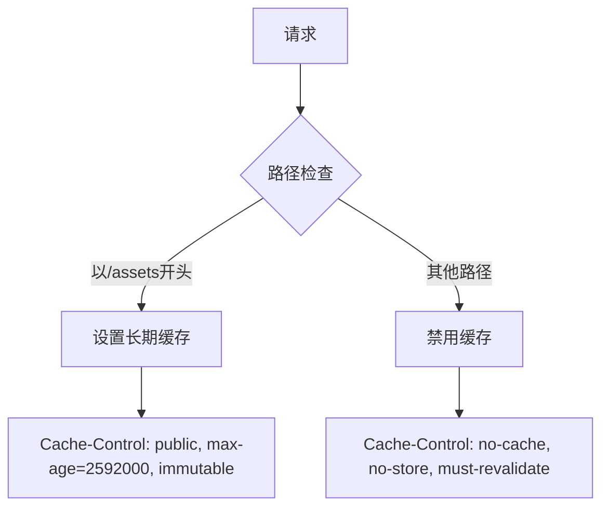
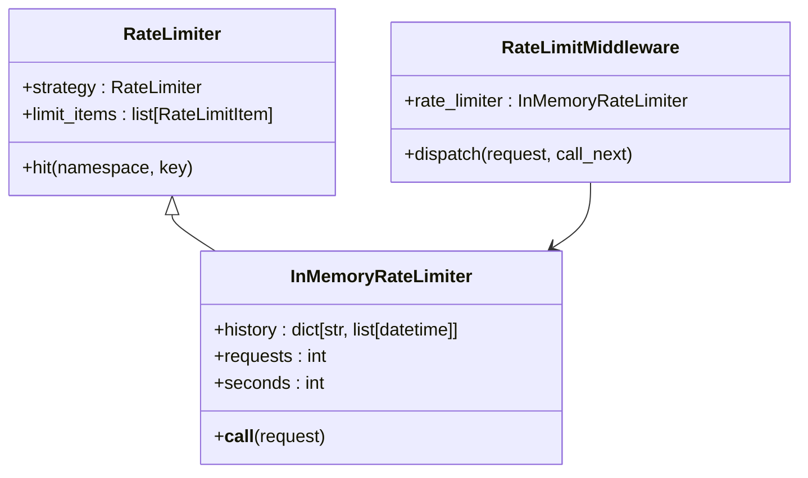

# API文档

<cite>
**本文档中引用的文件**   
- [saas_server.py](file://enterprise/saas_server.py)
- [app.py](file://openhands/server/app.py)
- [conversation.py](file://openhands/server/routes/conversation.py)
- [listen_socket.py](file://openhands/server/listen_socket.py)
- [public.py](file://openhands/server/routes/public.py)
- [files.py](file://openhands/server/routes/files.py)
- [secrets.py](file://openhands/server/routes/secrets.py)
- [settings.py](file://openhands/server/routes/settings.py)
- [open-hands-axios.ts](file://frontend/src/api/open-hands-axios.ts)
- [use-websocket.ts](file://frontend/src/hooks/use-websocket.ts)
- [middleware.py](file://openhands/server/middleware.py)
- [rate_limit.py](file://enterprise/server/rate_limit.py)
- [response-type.tsx](file://frontend/src/types/response-type.tsx)
- [api-keys.ts](file://frontend/src/api/api-keys.ts)
</cite>

## 目录
1. [简介](#简介)
2. [RESTful API](#restful-api)
3. [WebSocket API](#websocket-api)
4. [API版本控制策略](#api版本控制策略)
5. [客户端实现指南](#客户端实现指南)
6. [性能优化建议](#性能优化建议)
7. [调试工具与监控方法](#调试工具与监控方法)

## 简介

OpenHands提供了一套全面的API接口，支持RESTful和WebSocket两种通信方式，用于与智能代理系统进行交互。该API允许用户管理对话、文件、设置和密钥，并实时接收代理的响应和状态更新。

系统基于FastAPI框架构建，提供了清晰的路由结构和现代化的API设计。主要功能包括对话管理、文件操作、用户设置、密钥管理以及实时事件流处理。API设计遵循REST原则，同时通过WebSocket提供实时双向通信能力。

**Section sources**
- [app.py](file://openhands/server/app.py#L66-L96)
- [saas_server.py](file://enterprise/saas_server.py#L40-L78)

## RESTful API

### HTTP方法与URL模式

OpenHands的RESTful API使用标准的HTTP方法（GET、POST、PUT、DELETE）来执行相应的操作。所有API端点都以`/api`为前缀。

```mermaid
flowchart TD
A[客户端] --> |GET /api/options/models| B[获取支持的LLM模型]
A --> |GET /api/conversations/{id}/list-files| C[列出文件]
A --> |POST /api/conversations/{id}/message| D[发送消息]
A --> |GET /api/conversations/{id}/events| E[搜索事件]
A --> |POST /api/keys| F[创建API密钥]
A --> |GET /api/settings| G[获取用户设置]
```

**Diagram sources**
- [public.py](file://openhands/server/routes/public.py#L14-L29)
- [files.py](file://openhands/server/routes/files.py#L35-L46)
- [conversation.py](file://openhands/server/routes/conversation.py#L270-L276)
- [secrets.py](file://openhands/server/routes/secrets.py#L210-L214)
- [settings.py](file://openhands/server/routes/settings.py#L28-L36)

### 核心端点

#### 获取支持的模型
- **URL**: `/api/options/models`
- **方法**: GET
- **认证**: 需要有效的会话
- **描述**: 获取所有支持的大型语言模型（LLM）列表
- **返回值**: 字符串数组，包含支持的模型名称

#### 列出文件
- **URL**: `/api/conversations/{conversation_id}/list-files`
- **方法**: GET
- **参数**: 
  - `conversation_id` (路径参数): 对话ID
  - `path` (查询参数, 可选): 要列出文件的路径
- **返回值**: 字符串数组，包含文件路径列表

#### 发送消息
- **URL**: `/api/conversations/{conversation_id}/message`
- **方法**: POST
- **请求体**:
```json
{
  "message": "用户输入的消息内容"
}
```
- **返回值**: JSON响应，包含操作成功状态

#### 搜索事件
- **URL**: `/api/conversations/{conversation_id}/events`
- **方法**: GET
- **参数**:
  - `start_id`: 起始事件ID
  - `end_id`: 结束事件ID
  - `reverse`: 是否反向检索
  - `limit`: 返回事件的最大数量
- **返回值**: 包含事件列表和是否有更多事件的JSON对象

#### API密钥管理
- **URL**: `/api/keys`
- **方法**: GET, POST, DELETE
- **功能**: 获取、创建和删除API密钥
- **返回值**: 根据操作返回相应的密钥信息或状态

**Section sources**
- [conversation.py](file://openhands/server/routes/conversation.py#L107-L421)
- [files.py](file://openhands/server/routes/files.py#L35-L319)
- [public.py](file://openhands/server/routes/public.py#L14-L70)
- [secrets.py](file://openhands/server/routes/secrets.py#L101-L349)
- [settings.py](file://openhands/server/routes/settings.py#L28-L212)

### 请求/响应模式

API使用JSON格式进行请求和响应。所有响应都遵循一致的结构，包含成功状态、数据和错误信息。



**Diagram sources**
- [conversation.py](file://openhands/server/routes/conversation.py#L264-L267)
- [files.py](file://openhands/server/routes/files.py#L43-L46)
- [api-keys.ts](file://frontend/src/api/api-keys.ts#L3-L17)

### 认证方法

系统使用基于令牌的认证机制，支持多种认证方式：

1. **会话认证**: 通过Cookie中的会话信息进行认证
2. **Bearer令牌**: 在Authorization头中提供Bearer令牌
3. **API密钥**: 用于程序化访问的API密钥

认证流程通过中间件处理，确保只有经过验证的请求才能访问受保护的资源。



**Diagram sources**
- [listen_socket.py](file://openhands/server/listen_socket.py#L71-L73)
- [middleware.py](file://openhands/server/middleware.py#L16-L48)

### 参数说明、返回值和错误代码

#### 通用错误代码

| 状态码 | 错误类型 | 描述 |
|--------|---------|------|
| 400 | Bad Request | 请求格式不正确 |
| 401 | Unauthorized | 未授权访问 |
| 403 | Forbidden | 禁止访问 |
| 404 | Not Found | 资源未找到 |
| 429 | Too Many Requests | 请求过于频繁 |
| 500 | Internal Server Error | 服务器内部错误 |

#### 特定端点错误

- **对话相关端点**: 当对话ID无效或不存在时返回404错误
- **文件操作端点**: 当运行时未初始化时返回404错误
- **认证相关端点**: 当令牌无效或过期时返回401错误
- **速率限制**: 当请求频率超过限制时返回429错误

**Section sources**
- [conversation.py](file://openhands/server/routes/conversation.py#L130-L133)
- [files.py](file://openhands/server/routes/files.py#L68-L71)
- [secrets.py](file://openhands/server/routes/secrets.py#L114-L116)
- [rate_limit.py](file://enterprise/server/rate_limit.py#L123-L137)

## WebSocket API

### 连接处理

WebSocket连接通过`/sockets/events/{conversation_id}`端点建立，需要提供对话ID作为路径参数。连接时可以通过查询参数传递最新的事件ID，以便从指定位置开始接收事件。



**Diagram sources**
- [listen_socket.py](file://openhands/server/listen_socket.py#L35-L136)

### 消息格式与事件类型

WebSocket使用标准化的消息格式进行通信，所有消息都以JSON格式传输。

#### 消息类型

1. **oh_event**: 从服务器到客户端的事件通知
2. **oh_user_action**: 从客户端到服务器的用户操作
3. **oh_action**: 兼容旧版本的用户操作（已弃用）

#### 事件类型



**Diagram sources**
- [response-type.tsx](file://frontend/src/types/response-type.tsx#L1-L5)
- [listen_socket.py](file://openhands/server/listen_socket.py#L98-L114)

### 实时交互模式

系统通过WebSocket提供实时的双向通信能力，支持以下交互模式：

1. **事件流**: 服务器持续向客户端发送事件，包括代理状态变化、文件操作、命令执行等
2. **操作提交**: 客户端可以发送用户操作，如消息输入、文件编辑等
3. **状态同步**: 实时同步代理的运行状态和对话进度



**Diagram sources**
- [listen_socket.py](file://openhands/server/listen_socket.py#L143-L153)

## API版本控制策略

### 版本管理

系统采用基于配置的版本控制策略，通过`server_config.enable_v1`配置项来启用或禁用V1 API。

```python
if server_config.enable_v1:
    app.include_router(v1_router.router)
```

这种设计允许系统同时支持多个API版本，确保向后兼容性。

### 弃用政策

1. **逐步弃用**: 当引入新版本API时，旧版本API将继续支持一段时间
2. **通知机制**: 通过日志记录和文档更新通知用户即将弃用的API
3. **迁移路径**: 提供清晰的迁移指南和工具，帮助用户过渡到新版本

例如，`/api/reset-settings`端点已被弃用，调用时会返回410 Gone状态码：

```python
@app.post('/reset-settings')
async def reset_settings() -> JSONResponse:
    """Resets user settings. (Deprecated)"""
    logger.warning('Deprecated endpoint /api/reset-settings called by user')
    return JSONResponse(
        status_code=status.HTTP_410_GONE,
        content={'error': 'Reset settings functionality has been removed.'},
    )
```

**Section sources**
- [app.py](file://openhands/server/app.py#L93-L94)
- [settings.py](file://openhands/server/routes/settings.py#L90-L106)

## 客户端实现指南

### WebSocket连接实现

客户端使用标准的WebSocket API建立连接，并处理各种事件。



**Diagram sources**
- [use-websocket.ts](file://frontend/src/hooks/use-websocket.ts#L37-L192)

### 错误处理

客户端实现包含完善的错误处理机制：

1. **连接错误**: 处理连接失败、认证错误等情况
2. **重连机制**: 在连接断开时自动尝试重新连接
3. **状态管理**: 跟踪连接状态并相应地更新UI

### 实际使用示例

#### 创建API密钥

```typescript
import ApiKeysClient from './api-keys';

// 创建新的API密钥
const apiKey = await ApiKeysClient.createApiKey('我的应用密钥');
console.log('创建的API密钥:', apiKey.key);
```

#### 监听对话事件

```typescript
import { useWebSocket } from './use-websocket';

const { isConnected, sendMessage, messages } = useWebSocket(
  'ws://localhost:3000/sockets/events/conv-123'
);

// 发送消息
sendMessage(JSON.stringify({
  message: '你好，代理'
}));

// 处理收到的消息
messages.forEach(message => {
  const data = JSON.parse(message);
  if (data.type === 'observation') {
    console.log('收到观察:', data.observation);
  }
});
```

**Section sources**
- [api-keys.ts](file://frontend/src/api/api-keys.ts#L19-L48)
- [use-websocket.ts](file://frontend/src/hooks/use-websocket.ts#L158-L164)

## 性能优化建议

### 连接管理

1. **连接复用**: 尽可能复用现有的WebSocket连接，避免频繁建立和断开连接
2. **批量操作**: 将多个相关操作合并为单个请求，减少网络往返次数
3. **连接池**: 对于高并发场景，使用连接池管理多个WebSocket连接

### 数据传输优化

1. **事件过滤**: 使用事件过滤器只接收感兴趣类型的事件，减少数据传输量
2. **增量更新**: 只传输变化的数据，而不是完整的状态
3. **压缩**: 对于大量数据传输，考虑使用压缩算法减少带宽使用

### 缓存策略

系统内置了缓存控制中间件，根据不同类型的资源应用不同的缓存策略：



**Diagram sources**
- [middleware.py](file://openhands/server/middleware.py#L51-L67)

## 调试工具与监控方法

### 内置调试功能

系统提供了多种调试工具和监控方法：

1. **日志记录**: 详细的日志记录，便于追踪问题
2. **健康检查**: `/api/readiness`端点用于检查服务状态
3. **指标监控**: 内置的指标收集和监控功能

### 速率限制监控

系统实现了两级速率限制机制：

1. **内存速率限制**: 用于防止简单的暴力攻击
2. **Redis速率限制**: 用于分布式环境下的精确速率控制



**Diagram sources**
- [middleware.py](file://openhands/server/middleware.py#L70-L132)
- [rate_limit.py](file://enterprise/server/rate_limit.py#L50-L106)

### CORS配置

系统支持灵活的CORS（跨域资源共享）配置，允许来自指定源的请求：

```python
class LocalhostCORSMiddleware(CORSMiddleware):
    """允许来自localhost/127.0.0.1域的任何请求的自定义CORS中间件"""
    
    def is_allowed_origin(self, origin: str) -> bool:
        if origin and not self.allow_origins and not self.allow_origin_regex:
            parsed = urlparse(origin)
            hostname = parsed.hostname or ''
            
            # 允许任何localhost/127.0.0.1来源，无论端口如何
            if hostname in ['localhost', '127.0.0.1']:
                return True
```

**Section sources**
- [middleware.py](file://openhands/server/middleware.py#L16-L48)
- [rate_limit.py](file://enterprise/server/rate_limit.py#L25-L30)