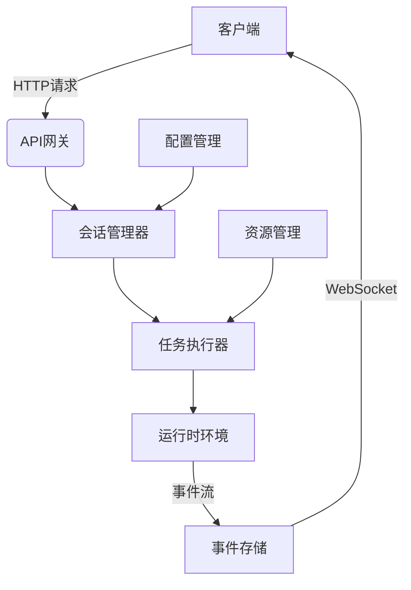
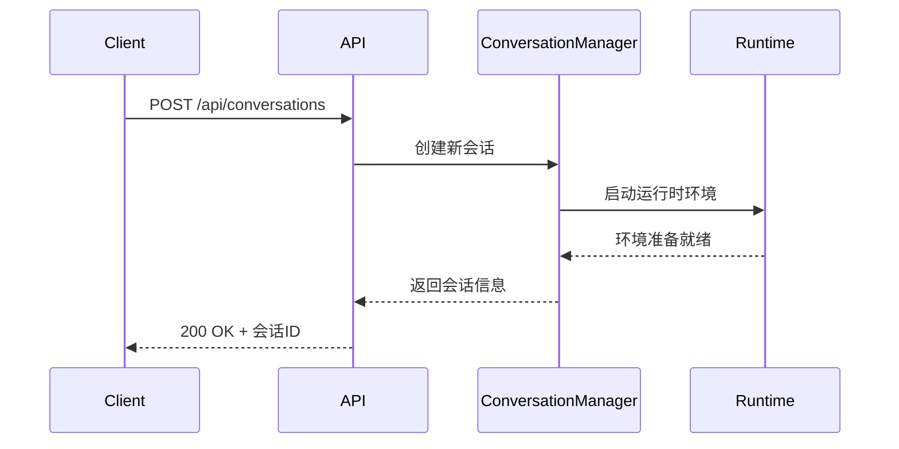
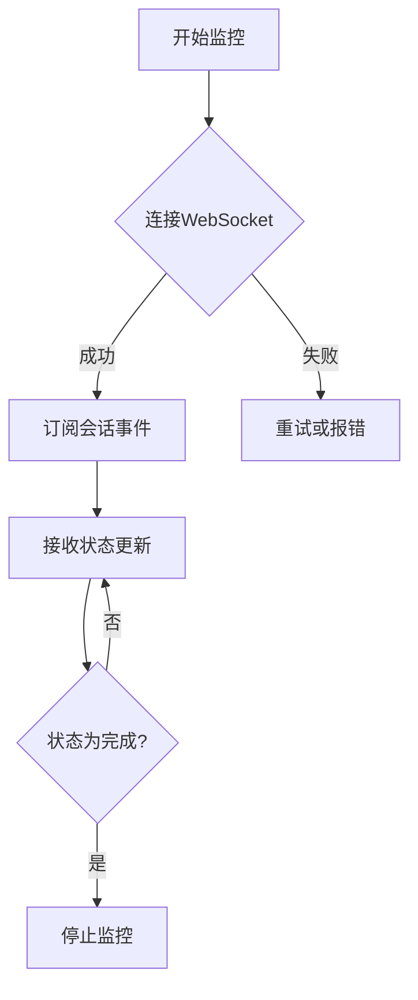
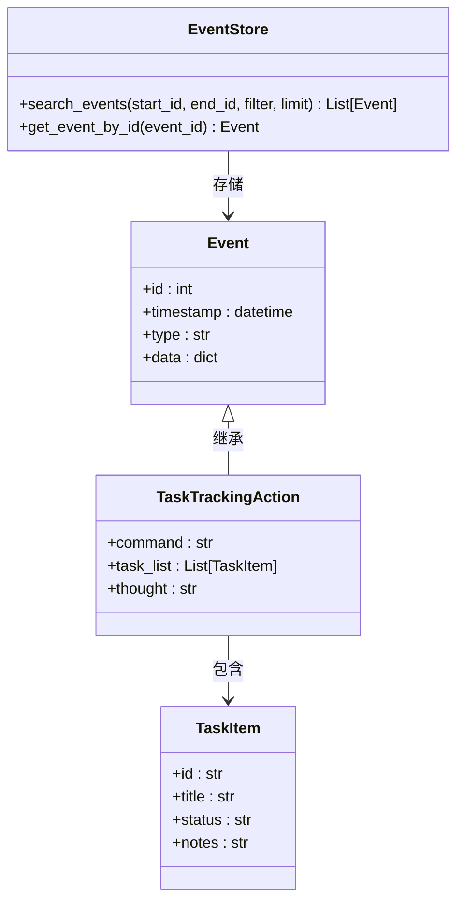
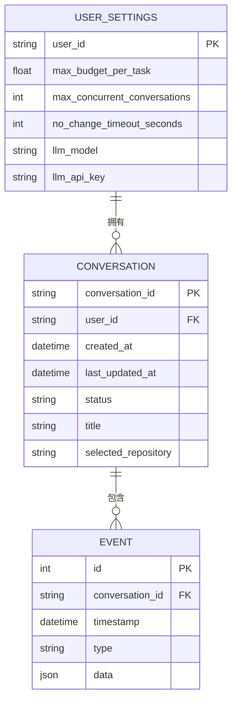
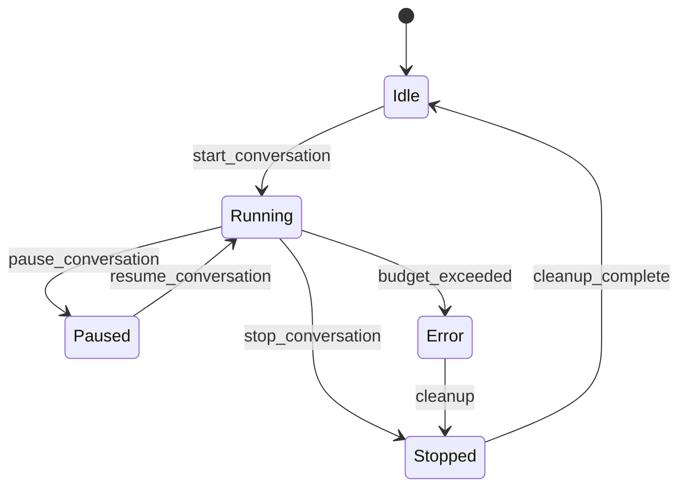

# 任务执行

<cite>
**本文档引用的文件**
- [conversation.py](file://openhands/server/routes/conversation.py)
- [manage_conversations.py](file://openhands/server/routes/manage_conversations.py)
- [task_tracker.py](file://openhands/agenthub/codeact_agent/tools/task_tracker.py)
- [agent.py](file://openhands/events/action/agent.py)
- [control_flags.py](file://openhands/controller/state/control_flags.py)
- [windows_bash.py](file://openhands/runtime/utils/windows_bash.py)
- [user_settings.py](file://enterprise/migrations/versions/048_add_max_budget_per_task_to_user_settings.py)
</cite>

## 目录
1. [简介](#简介)
2. [任务执行API概览](#任务执行api概览)
3. [任务提交](#任务提交)
4. [任务状态监控](#任务状态监控)
5. [结果获取](#结果获取)
6. [配置管理](#配置管理)
7. [并发控制与资源管理](#并发控制与资源管理)
8. [完整流程示例](#完整流程示例)
9. [故障排除](#故障排除)
10. [结论](#结论)

## 简介

任务执行API是OpenHands系统的核心功能之一，它允许用户通过API接口提交任务指令、监控任务执行进度、获取执行结果和日志。该API支持任务优先级设置、超时控制和资源限制等高级配置选项。系统通过WebSocket连接实现实时通信，确保任务状态的及时更新和反馈。

本文档详细介绍了任务执行API的各项功能，包括如何提交任务、监控任务状态、获取执行结果，以及如何配置任务的优先级、超时时间和资源限制。同时，文档还解释了系统的并发控制和资源管理机制，并提供了实际示例来展示任务执行的完整流程。

**Section sources**
- [conversation.py](file://openhands/server/routes/conversation.py#L1-L421)
- [manage_conversations.py](file://openhands/server/routes/manage_conversations.py#L1-L800)

## 任务执行API概览

任务执行API提供了一套完整的RESTful接口，用于管理任务的整个生命周期。API主要分为三个部分：任务提交、状态监控和结果获取。系统通过会话ID（conversation_id）来标识和跟踪每个任务，确保任务的独立性和可追溯性。

API采用分层架构设计，前端通过WebSocket与服务器建立持久连接，后端则通过事件驱动的方式处理任务请求。当用户提交任务时，系统会创建一个新的会话，并启动相应的执行环境。任务执行过程中产生的所有事件和状态变更都会通过WebSocket实时推送给客户端。



**Diagram sources**
- [conversation.py](file://openhands/server/routes/conversation.py#L1-L421)
- [manage_conversations.py](file://openhands/server/routes/manage_conversations.py#L1-L800)

**Section sources**
- [conversation.py](file://openhands/server/routes/conversation.py#L1-L421)
- [manage_conversations.py](file://openhands/server/routes/manage_conversations.py#L1-L800)

## 任务提交

任务提交通过POST请求到`/api/conversations`端点实现。用户需要在请求体中提供任务的相关信息，包括初始用户消息、代码仓库信息等。系统会为每个新任务生成唯一的会话ID，并返回给客户端。

提交任务时，用户可以通过`InitSessionRequest`对象指定各种参数：
- `initial_user_msg`: 初始用户消息，描述任务需求
- `repository`: 要操作的代码仓库URL
- `git_provider`: Git服务提供商类型
- `selected_branch`: 指定操作的分支
- `mcp_config`: MCP（多能力代理）配置



**Diagram sources**
- [manage_conversations.py](file://openhands/server/routes/manage_conversations.py#L212-L280)
- [conversation.py](file://openhands/server/routes/conversation.py#L270-L324)

**Section sources**
- [manage_conversations.py](file://openhands/server/routes/manage_conversations.py#L183-L280)
- [conversation.py](file://openhands/server/routes/conversation.py#L270-L324)

## 任务状态监控

任务状态监控是通过WebSocket连接实现的实时事件流。系统定义了多种状态类型来跟踪任务的执行情况，包括"todo"（待办）、"in_progress"（进行中）和"done"（已完成）。这些状态通过`TaskTrackingAction`对象在任务执行过程中动态更新。

客户端可以通过订阅特定会话的事件流来监控任务状态。系统会推送以下类型的事件：
- 任务状态变更事件
- 执行进度更新
- 错误和警告信息
- 资源使用情况



**Diagram sources**
- [conversation.py](file://openhands/server/routes/conversation.py#L204-L267)
- [windows_bash.py](file://openhands/runtime/utils/windows_bash.py#L481-L566)

**Section sources**
- [conversation.py](file://openhands/server/routes/conversation.py#L204-L267)
- [agent.py](file://openhands/events/action/agent.py#L205-L227)

## 结果获取

结果获取主要通过两种方式实现：实时事件流和历史记录查询。实时结果通过WebSocket连接推送，而历史结果则可以通过REST API查询获取。

系统提供了`search_events`端点，允许客户端根据时间范围、事件类型等条件查询历史事件。查询结果包含完整的事件序列，包括：
- 任务创建和初始化
- 执行过程中的各个步骤
- 最终结果和状态
- 相关的日志和错误信息



**Diagram sources**
- [conversation.py](file://openhands/server/routes/conversation.py#L204-L267)
- [agent.py](file://openhands/events/action/agent.py#L205-L227)

**Section sources**
- [conversation.py](file://openhands/server/routes/conversation.py#L204-L267)
- [agent.py](file://openhands/events/action/agent.py#L205-L227)

## 配置管理

任务执行支持多种配置选项，包括任务优先级、超时设置和资源限制。这些配置可以通过用户设置进行管理，系统会根据配置值自动调整任务的执行策略。

### 任务优先级

任务优先级通过会话管理器的并发控制机制实现。系统维护一个最大并发会话数限制（`max_concurrent_conversations`），当达到限制时，会自动关闭最旧的会话以腾出资源。

### 超时设置

超时设置分为软超时和硬超时两种：
- 软超时：在指定时间内没有活动则触发
- 硬超时：任务执行总时间限制

### 资源限制

资源限制主要通过预算控制实现。系统使用`BudgetControlFlag`来跟踪和管理任务的资源消耗，当达到预设的预算上限时会自动停止任务。



**Diagram sources**
- [user_settings.py](file://enterprise/migrations/versions/048_add_max_budget_per_task_to_user_settings.py#L1-L28)
- [control_flags.py](file://openhands/controller/state/control_flags.py#L68-L95)

**Section sources**
- [user_settings.py](file://enterprise/migrations/versions/048_add_max_budget_per_task_to_user_settings.py#L1-L28)
- [control_flags.py](file://openhands/controller/state/control_flags.py#L68-L95)

## 并发控制与资源管理

系统的并发控制和资源管理机制确保了多任务环境下的稳定性和公平性。核心组件包括会话管理器、预算控制标志和运行时资源限制。

会话管理器负责跟踪所有活动会话，并根据配置限制并发数量。当新会话创建时，如果已达到最大并发限制，系统会自动关闭最旧的会话。

预算控制通过`BudgetControlFlag`实现，它监控任务的资源消耗（主要是LLM调用成本），并在达到预设上限时终止任务。这种机制有效防止了资源滥用和意外的高额费用。



**Diagram sources**
- [manage_conversations.py](file://openhands/server/routes/manage_conversations.py#L645-L776)
- [control_flags.py](file://openhands/controller/state/control_flags.py#L68-L95)

**Section sources**
- [manage_conversations.py](file://openhands/server/routes/manage_conversations.py#L645-L776)
- [control_flags.py](file://openhands/controller/state/control_flags.py#L68-L95)

## 完整流程示例

以下是一个完整的任务执行流程示例，展示了从任务提交到结果获取的全过程：

1. **创建会话**：通过POST请求创建新会话
```http
POST /api/conversations
Content-Type: application/json

{
  "initial_user_msg": "实现用户登录功能",
  "repository": "https://github.com/example/project.git",
  "git_provider": "github"
}
```

2. **建立WebSocket连接**：使用返回的会话ID建立实时通信
```javascript
const socket = new WebSocket(`ws://localhost:3000/api/conversations/${conversation_id}/events`);
```

3. **发送任务指令**：通过WebSocket发送任务指令
```json
{
  "action": "message",
  "message": "请实现用户登录功能，包括前端表单和后端验证"
}
```

4. **监控任务状态**：接收并处理状态更新事件
```json
{
  "action": "task_tracking",
  "command": "plan",
  "task_list": [
    {
      "id": "task-1",
      "title": "创建登录表单",
      "status": "in_progress",
      "notes": "正在设计UI"
    }
  ]
}
```

5. **获取最终结果**：查询历史事件获取完整执行记录
```http
GET /api/conversations/{conversation_id}/events?limit=100
```

**Section sources**
- [manage_conversations.py](file://openhands/server/routes/manage_conversations.py#L212-L280)
- [conversation.py](file://openhands/server/routes/conversation.py#L270-L324)

## 故障排除

在使用任务执行API时可能会遇到一些常见问题，以下是相应的解决方案：

### 连接问题
- **WebSocket连接失败**：检查服务器地址和端口是否正确，确保防火墙允许相应端口的通信
- **会话超时**：增加`no_change_timeout_seconds`配置值，或定期发送心跳消息保持连接活跃

### 执行问题
- **任务卡住**：检查是否有未处理的确认请求，通过`add_message`端点发送确认指令
- **资源不足**：调整`max_budget_per_task`设置，或优化任务分解以减少资源消耗

### 配置问题
- **设置不生效**：确保配置值符合验证规则，如预算值必须大于等于1
- **权限不足**：检查用户认证信息是否正确，确保有足够的权限执行相应操作

**Section sources**
- [conversation.py](file://openhands/server/routes/conversation.py#L107-L139)
- [manage_conversations.py](file://openhands/server/routes/manage_conversations.py#L645-L776)

## 结论

任务执行API为OpenHands系统提供了强大而灵活的任务管理能力。通过RESTful接口和WebSocket实时通信的结合，系统实现了高效的任务提交、监控和结果获取功能。配置管理机制允许用户根据具体需求调整任务的优先级、超时设置和资源限制，而并发控制和资源管理机制则确保了系统的稳定性和可靠性。

该API的设计充分考虑了实际使用场景，提供了完整的错误处理和故障排除指南，使得开发者能够轻松集成和使用。未来可以通过增加任务依赖管理、更精细的资源配额控制等功能进一步增强系统的功能和性能。