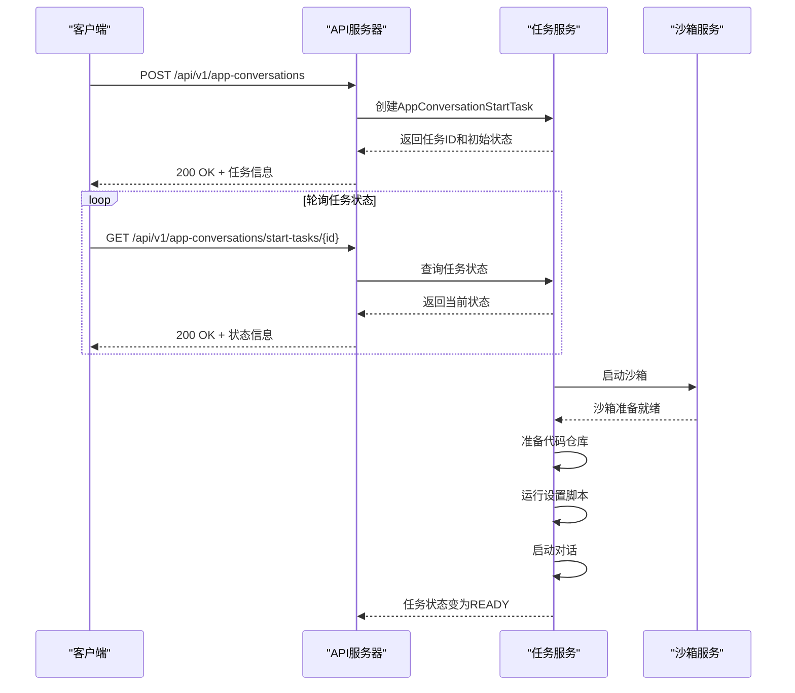

# 任务提交

<cite>
**本文档引用的文件**
- [v1_router.py](file://openhands/app_server/v1_router.py)
- [app_conversation_router.py](file://openhands/app_server/app_conversation/app_conversation_router.py)
- [app_conversation_models.py](file://openhands/app_server/app_conversation/app_conversation_models.py)
- [sql_app_conversation_start_task_service.py](file://openhands/app_server/app_conversation/sql_app_conversation_start_task_service.py)
- [live_status_app_conversation_service.py](file://openhands/app_server/app_conversation/live_status_app_conversation_service.py)
- [v1-conversation-service.api.ts](file://frontend/src/api/conversation-service/v1-conversation-service.api.ts)
- [use-create-conversation.ts](file://frontend/src/hooks/mutation/use-create-conversation.ts)
- [048_add_max_budget_per_task_to_user_settings.py](file://enterprise/migrations/versions/048_add_max_budget_per_task_to_user_settings.py)
</cite>

## 目录
1. [简介](#简介)
2. [任务提交API概览](#任务提交api概览)
3. [请求参数详解](#请求参数详解)
4. [响应格式](#响应格式)
5. [客户端使用示例](#客户端使用示例)
6. [可配置参数](#可配置参数)
7. [验证机制与错误处理](#验证机制与错误处理)
8. [结论](#结论)

## 简介
任务提交API是OpenHands系统的核心功能之一，允许用户通过REST API提交新的任务指令。该API采用异步处理模式，当用户提交任务后，系统会立即返回一个任务ID，用户可以通过轮询该任务的状态来获取最终结果。这种设计模式特别适用于需要长时间处理的任务，如启动沙箱环境、准备代码仓库等操作。

**Section sources**
- [v1_router.py](file://openhands/app_server/v1_router.py#L1-L19)
- [app_conversation_router.py](file://openhands/app_server/app_conversation/app_conversation_router.py#L1-L308)

## 任务提交API概览
任务提交API提供了创建新对话任务的功能，通过`/app-conversations`端点接收POST请求。该API的主要特点是异步处理，即立即返回任务ID，而不是等待任务完成。这种设计允许前端快速响应用户操作，同时在后台处理耗时的任务。

API的基本信息如下：
- **HTTP方法**: POST
- **URL路径**: `/api/v1/app-conversations`
- **认证方式**: Bearer Token或Session API Key
- **内容类型**: application/json

当用户提交任务时，系统会创建一个`AppConversationStartTask`对象，该对象包含了任务的初始状态和相关信息。任务的处理过程包括等待沙箱启动、准备代码仓库、运行设置脚本等多个阶段，每个阶段的状态都会被记录和更新。



**Diagram sources**
- [app_conversation_router.py](file://openhands/app_server/app_conversation/app_conversation_router.py#L169-L187)
- [live_status_app_conversation_service.py](file://openhands/app_server/app_conversation/live_status_app_conversation_service.py#L157-L276)

**Section sources**
- [app_conversation_router.py](file://openhands/app_server/app_conversation/app_conversation_router.py#L169-L187)
- [app_conversation_models.py](file://openhands/app_server/app_conversation/app_conversation_models.py#L121-L144)

## 请求参数详解
任务提交API的请求体是一个JSON对象，包含了启动对话所需的各种参数。以下是各个参数的详细说明：

### 基本参数
| 参数 | 类型 | 必需 | 描述 |
|------|------|------|------|
| `selected_repository` | string | 否 | 要克隆的代码仓库URL |
| `git_provider` | enum | 否 | Git服务提供商，如GITHUB、GITLAB等 |
| `selected_branch` | string | 否 | 要检出的分支名称 |
| `title` | string | 否 | 对话的标题或描述 |
| `trigger` | enum | 否 | 触发对话的原因，如REMOTE_API_KEY |

### 初始消息
`initial_message`参数允许在对话启动时发送一条初始消息，该消息的结构如下：
```json
{
  "role": "user",
  "content": [
    {
      "type": "text",
      "text": "初始消息内容"
    }
  ]
}
```

### 处理器
`processors`参数允许指定在对话过程中要使用的回调处理器，这些处理器可以处理特定类型的事件，如设置对话标题等。

**Section sources**
- [app_conversation_models.py](file://openhands/app_server/app_conversation/app_conversation_models.py#L81-L101)
- [v1-conversation-service.api.ts](file://frontend/src/api/conversation-service/v1-conversation-service.api.ts#L64-L83)

## 响应格式
任务提交API的响应格式是一个包含任务详细信息的JSON对象。成功响应的结构如下：

### 成功响应
```json
{
  "id": "任务唯一标识符",
  "created_by_user_id": "创建者用户ID",
  "status": "当前任务状态",
  "detail": "详细信息或错误消息",
  "app_conversation_id": "关联的对话ID（准备就绪后）",
  "sandbox_id": "沙箱ID（准备就绪后）",
  "agent_server_url": "代理服务器URL（准备就绪后）",
  "request": {
    "selected_repository": "请求的仓库",
    "git_provider": "Git提供商",
    "selected_branch": "请求的分支",
    "title": "请求的标题"
  },
  "created_at": "创建时间",
  "updated_at": "更新时间"
}
```

### 任务状态
任务状态是一个枚举类型，包含以下可能的值：
- `WORKING`: 任务正在处理中
- `WAITING_FOR_SANDBOX`: 等待沙箱启动
- `PREPARING_REPOSITORY`: 准备代码仓库
- `RUNNING_SETUP_SCRIPT`: 运行设置脚本
- `SETTING_UP_GIT_HOOKS`: 设置Git钩子
- `STARTING_CONVERSATION`: 启动对话
- `READY`: 任务准备就绪
- `ERROR`: 任务出错

### 错误响应
当请求失败时，API会返回相应的HTTP状态码和错误信息：
- `400 Bad Request`: 请求参数无效
- `401 Unauthorized`: 认证失败
- `403 Forbidden`: 权限不足
- `500 Internal Server Error`: 服务器内部错误

**Section sources**
- [app_conversation_models.py](file://openhands/app_server/app_conversation/app_conversation_models.py#L121-L144)
- [app_conversation_router.py](file://openhands/app_server/app_conversation/app_conversation_router.py#L170-L187)

## 客户端使用示例
以下是如何使用Python和JavaScript客户端提交任务的示例。

### Python客户端示例
```python
import requests
import json

def create_conversation():
    url = "http://localhost:3000/api/v1/app-conversations"
    headers = {
        "Content-Type": "application/json",
        "Authorization": "Bearer your-api-token"
    }
    
    payload = {
        "selected_repository": "https://github.com/user/repo.git",
        "git_provider": "GITHUB",
        "selected_branch": "main",
        "title": "修复登录问题",
        "initial_message": {
            "role": "user",
            "content": [
                {
                    "type": "text",
                    "text": "请修复用户登录时的认证问题"
                }
            ]
        }
    }
    
    response = requests.post(url, headers=headers, json=payload)
    
    if response.status_code == 200:
        task = response.json()
        print(f"任务已创建，ID: {task['id']}")
        print(f"当前状态: {task['status']}")
        return task['id']
    else:
        print(f"创建任务失败: {response.status_code}")
        print(response.text)
        return None

# 使用示例
task_id = create_conversation()
```

### JavaScript客户端示例
```javascript
async function createConversation() {
  const url = '/api/v1/app-conversations';
  const headers = {
    'Content-Type': 'application/json',
    'Authorization': 'Bearer your-api-token'
  };
  
  const body = {
    selected_repository: 'https://github.com/user/repo.git',
    git_provider: 'GITHUB',
    selected_branch: 'main',
    title: '修复登录问题',
    initial_message: {
      role: 'user',
      content: [
        {
          type: 'text',
          text: '请修复用户登录时的认证问题'
        }
      ]
    }
  };
  
  try {
    const response = await fetch(url, {
      method: 'POST',
      headers: headers,
      body: JSON.stringify(body)
    });
    
    if (response.ok) {
      const task = await response.json();
      console.log(`任务已创建，ID: ${task.id}`);
      console.log(`当前状态: ${task.status}`);
      return task.id;
    } else {
      console.error(`创建任务失败: ${response.status}`);
      const errorText = await response.text();
      console.error(errorText);
      return null;
    }
  } catch (error) {
    console.error('请求失败:', error);
    return null;
  }
}

// 使用示例
createConversation().then(taskId => {
  if (taskId) {
    console.log('开始轮询任务状态...');
    // 这里可以添加轮询逻辑
  }
});
```

**Section sources**
- [v1-conversation-service.api.ts](file://frontend/src/api/conversation-service/v1-conversation-service.api.ts#L56-L83)
- [use-create-conversation.ts](file://frontend/src/hooks/mutation/use-create-conversation.ts#L53-L71)

## 可配置参数
任务提交API支持多种可配置参数，允许用户根据需要调整任务的行为。

### 任务优先级
目前系统没有显式的优先级参数，但任务的处理顺序遵循先进先出的原则。用户可以通过控制提交任务的时间来间接影响任务的执行顺序。

### 超时设置
系统在多个层面设置了超时限制：
- **沙箱启动超时**: 默认120秒，可通过配置调整
- **HTTP请求超时**: 30秒，用于与代理服务器通信
- **轮询频率**: 每2秒检查一次沙箱状态

### 资源限制
用户可以通过用户设置来限制每个任务的最大预算：
```python
# 数据库迁移文件中的定义
op.add_column(
    'user_settings', sa.Column('max_budget_per_task', sa.Float(), nullable=True)
)
```
这个参数允许管理员或用户设置每个任务的最大预算，超出预算的任务将被拒绝或终止。

**Section sources**
- [048_add_max_budget_per_task_to_user_settings.py](file://enterprise/migrations/versions/048_add_max_budget_per_task_to_user_settings.py#L22-L24)
- [live_status_app_conversation_service.py](file://openhands/app_server/app_conversation/live_status_app_conversation_service.py#L660-L665)

## 验证机制与错误处理
任务提交API实现了多层次的验证机制和错误处理策略，确保系统的稳定性和安全性。

### 输入验证
系统对所有输入参数进行严格验证：
- **UUID验证**: 确保任务ID和对话ID是有效的UUID格式
- **路径遍历防护**: 拒绝包含`..`、`/`或`\`的对话ID，防止路径遍历攻击
- **控制字符检查**: 拒绝包含控制字符（ASCII < 32）的对话ID
- **长度限制**: 对话ID长度限制为100个字符

### 错误处理
系统采用优雅的错误处理机制：
- **异常捕获**: 在任务处理过程中捕获所有异常，并将任务状态设置为ERROR
- **详细错误信息**: 在`detail`字段中提供具体的错误消息，便于调试
- **资源清理**: 即使任务失败，也会尝试清理已创建的资源，如关闭数据库连接

### 常见错误及解决方案
| 错误类型 | 可能原因 | 解决方案 |
|---------|--------|--------|
| 沙箱启动失败 | 资源不足或配置错误 | 检查系统资源，确保Docker正常运行 |
| 仓库克隆失败 | 网络问题或权限不足 | 检查网络连接，确保有访问仓库的权限 |
| 认证失败 | Token过期或无效 | 重新获取有效的认证Token |
| 超时错误 | 网络延迟或服务器负载过高 | 增加超时时间，或在低峰期重试 |

**Section sources**
- [utils.py](file://openhands/server/utils.py#L43-L57)
- [live_status_app_conversation_service.py](file://openhands/app_server/app_conversation/live_status_app_conversation_service.py#L271-L276)

## 结论
任务提交API为OpenHands系统提供了强大而灵活的任务管理功能。通过异步处理模式，系统能够高效地处理耗时的任务，同时保持良好的用户体验。API设计考虑了安全性、可靠性和可扩展性，支持多种配置选项和详细的错误处理机制。

开发者在使用该API时，应充分理解其异步特性，合理设计客户端的轮询逻辑。同时，应注意配置适当的超时和重试策略，以应对网络波动和临时故障。通过合理使用可配置参数，可以优化资源利用，提高系统整体性能。