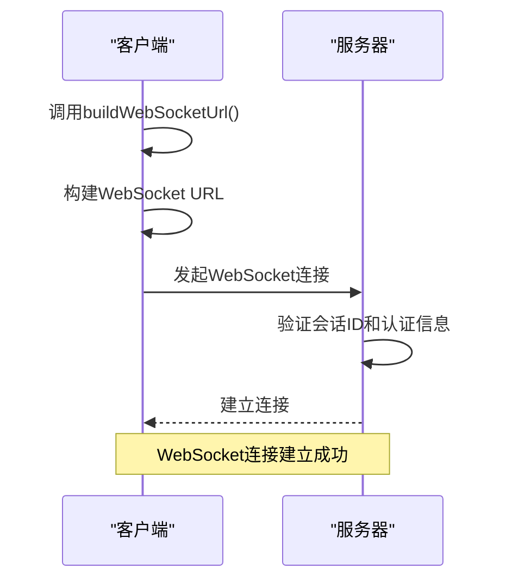
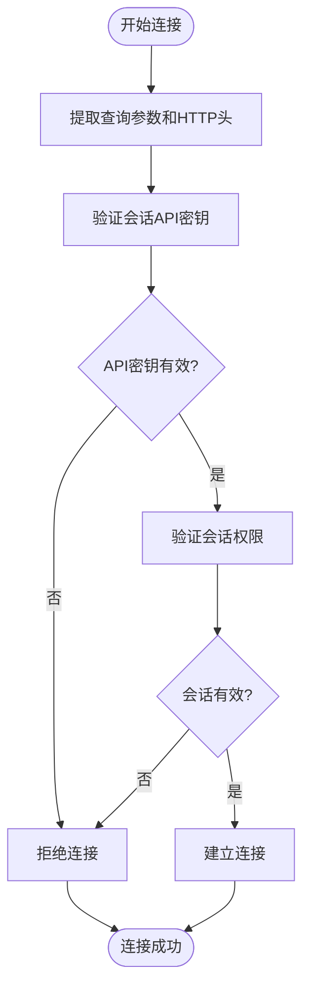
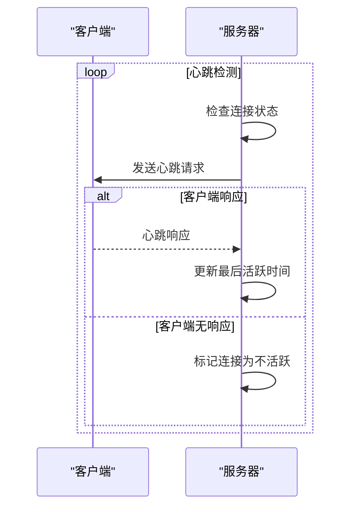
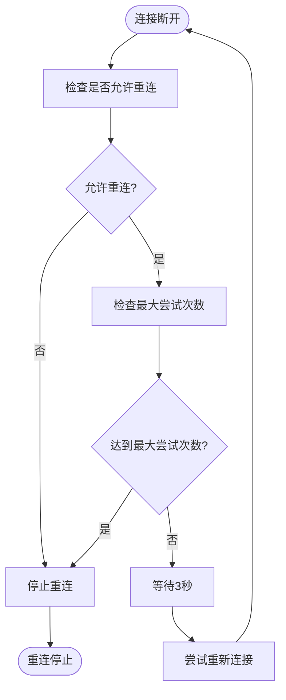
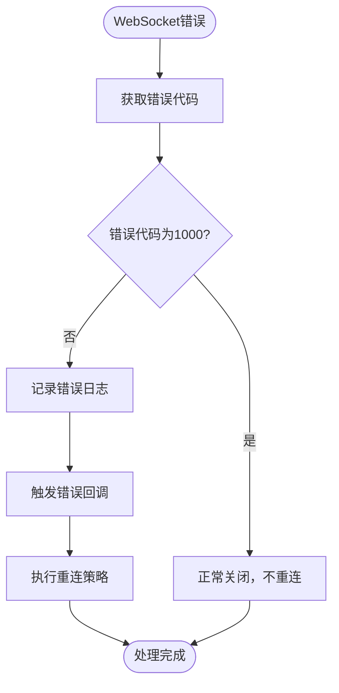

# WebSocket实时通信

<cite>
**本文档引用的文件**   
- [buildWebSocketUrl.ts](file://frontend/src/utils/websocket-url.ts)
- [useWebSocket.ts](file://frontend/src/hooks/use-websocket.ts)
- [listen_socket.py](file://openhands/server/listen_socket.py)
- [message.tsx](file://frontend/src/types/message.tsx)
- [conversation-subscriptions-provider.tsx](file://frontend/src/context/conversation-subscriptions-provider.tsx)
- [ws-client-provider.tsx](file://frontend/src/context/ws-client-provider.tsx)
</cite>

## 目录
1. [引言](#引言)
2. [WebSocket连接建立](#websocket连接建立)
3. [认证机制](#认证机制)
4. [消息协议](#消息协议)
5. [前端实现](#前端实现)
6. [心跳与连接恢复](#心跳与连接恢复)
7. [错误处理](#错误处理)
8. [性能优化](#性能优化)
9. [结论](#结论)

## 引言
WebSocket实时通信是OpenHands系统的核心功能，用于在客户端和服务器之间建立持久的双向通信通道，以实现实时任务状态更新、日志流、进度报告和错误通知等功能。本文档详细描述了WebSocket连接的建立、认证、消息协议、前端实现、心跳机制、连接恢复策略和错误处理。

**Section sources**
- [buildWebSocketUrl.ts](file://frontend/src/utils/websocket-url.ts#L33-L54)
- [listen_socket.py](file://openhands/server/listen_socket.py#L35-L169)

## WebSocket连接建立
WebSocket连接的建立遵循标准的WebSocket协议，客户端通过特定的URL格式与服务器建立连接。连接URL的构建遵循以下规则：

### URL格式
WebSocket连接URL的格式为：`ws://host:port/sockets/events/{conversationId}`，其中：
- `host` 和 `port` 从会话URL中提取
- `conversationId` 是会话的唯一标识符
- 协议根据页面协议自动选择`ws://`或`wss://`

### 连接流程
1. 客户端调用`buildWebSocketUrl`函数构建WebSocket URL
2. 使用构建的URL创建WebSocket连接
3. 服务器验证连接参数并建立会话



**Diagram sources**
- [buildWebSocketUrl.ts](file://frontend/src/utils/websocket-url.ts#L33-L54)
- [listen_socket.py](file://openhands/server/listen_socket.py#L35-L65)

**Section sources**
- [buildWebSocketUrl.ts](file://frontend/src/utils/websocket-url.ts#L33-L54)
- [listen_socket.py](file://openhands/server/listen_socket.py#L35-L65)

## 认证机制
WebSocket连接的认证通过查询参数和HTTP头实现，确保只有授权用户可以访问特定的会话。

### 认证参数
连接时需要提供以下认证信息：
- `conversation_id`: 会话ID，必需参数
- `session_api_key`: 会话API密钥，用于验证会话权限
- `providers_set`: 集成提供商集合
- `Authorization`头: 包含用户的认证令牌

### 认证流程
1. 客户端在连接URL中包含认证参数
2. 服务器解析查询参数和HTTP头
3. 验证会话API密钥（如果配置）
4. 验证用户身份和会话权限
5. 拒绝无效的连接请求



**Diagram sources**
- [listen_socket.py](file://openhands/server/listen_socket.py#L39-L77)
- [conversation-subscriptions-provider.tsx](file://frontend/src/context/conversation-subscriptions-provider.tsx#L208-L212)

**Section sources**
- [listen_socket.py](file://openhands/server/listen_socket.py#L39-L77)
- [conversation-subscriptions-provider.tsx](file://frontend/src/context/conversation-subscriptions-provider.tsx#L208-L212)

## 消息协议
WebSocket消息协议定义了客户端和服务器之间交换的数据格式，包括状态更新、日志流、进度报告和错误通知等。

### 消息类型
系统支持三种主要消息类型：

#### ActionMessage (操作消息)
表示代理或用户执行的操作。

```json
{
  "id": 123,
  "source": "agent",
  "action": "read_file",
  "args": {
    "path": "/src/main.py"
  },
  "message": "正在读取文件 /src/main.py",
  "timestamp": "2024-01-01T12:00:00Z"
}
```

#### ObservationMessage (观察消息)
表示系统观察到的事件或状态。

```json
{
  "observation": "error",
  "id": 124,
  "cause": 123,
  "content": "文件不存在",
  "extras": {
    "metadata": {},
    "error_id": "FILE_NOT_FOUND"
  },
  "message": "无法读取文件：文件不存在",
  "timestamp": "2024-01-01T12:00:01Z"
}
```

#### StatusMessage (状态消息)
表示系统状态更新。

```json
{
  "status_update": true,
  "type": "info",
  "id": "STATUS$STARTING_RUNTIME",
  "message": "正在启动运行时环境"
}
```

### 消息字段定义
| 字段 | 类型 | 描述 |
|------|------|------|
| id | number | 消息唯一标识符 |
| source | string | 消息来源 (agent/user) |
| action | string | 执行的操作类型 |
| args | object | 操作参数 |
| message | string | 友好的消息文本 |
| timestamp | string | 消息时间戳 |
| observation | string | 观察类型 |
| cause | number | 触发此观察的操作ID |
| content | string | 观察内容 |
| extras | object | 额外的元数据 |
| status_update | boolean | 是否为状态更新 |
| type | string | 状态类型 (info, error, success) |

**Section sources**
- [message.tsx](file://frontend/src/types/message.tsx#L5-L78)
- [listen_socket.py](file://openhands/server/listen_socket.py#L108-L114)

## 前端实现
前端通过React Hooks和Socket.IO客户端库实现WebSocket连接的管理和消息处理。

### 连接管理
使用`useWebSocket` Hook管理WebSocket连接的生命周期：

```mermaid
classDiagram
class UseWebSocketOptions {
+queryParams : Record<string, string | boolean>
+onOpen : (event : Event) => void
+onClose : (event : CloseEvent) => void
+onMessage : (event : MessageEvent) => void
+onError : (event : Event) => void
+reconnect : { enabled : boolean, maxAttempts : number }
}
class UseWebSocketResult {
+isConnected : boolean
+lastMessage : T | null
+messages : T[]
+error : Error | null
+socket : WebSocket | null
+sendMessage : (data : string | ArrayBufferLike | Blob | ArrayBufferView) => void
+isReconnecting : boolean
+attemptCount : number
+disconnect : () => void
}
UseWebSocketOptions <|-- useWebSocket : "作为参数"
useWebSocket --> UseWebSocketResult : "返回"
```

### 事件处理
前端实现以下事件处理逻辑：
- `onopen`: 连接成功时更新状态
- `onmessage`: 接收消息并更新状态
- `onclose`: 连接关闭时处理重连
- `onerror`: 处理连接错误

**Section sources**
- [useWebSocket.ts](file://frontend/src/hooks/use-websocket.ts#L1-L193)
- [ws-client-provider.tsx](file://frontend/src/context/ws-client-provider.tsx#L335-L405)

## 心跳与连接恢复
系统实现了完善的心跳机制和连接恢复策略，确保长连接的稳定性。

### 心跳机制
服务器定期检查WebSocket连接状态，确保客户端仍然活跃：



### 连接恢复策略
客户端实现智能重连机制：

1. 检测连接断开
2. 启动重连定时器（3秒延迟）
3. 尝试重新连接
4. 达到最大尝试次数后停止



**Diagram sources**
- [useWebSocket.ts](file://frontend/src/hooks/use-websocket.ts#L73-L113)
- [listen_socket.py](file://openhands/server/listen_socket.py#L389-L423)

**Section sources**
- [useWebSocket.ts](file://frontend/src/hooks/use-websocket.ts#L73-L113)
- [listen_socket.py](file://openhands/server/listen_socket.py#L389-L423)

## 错误处理
系统实现了全面的错误处理机制，确保连接中断时能够优雅地处理。

### 错误类型
| 错误代码 | 描述 | 处理方式 |
|---------|------|---------|
| 1000 | 正常关闭 | 不重连 |
| 1001 | 端点离开 | 尝试重连 |
| 1002 | 协议错误 | 不重连 |
| 1003 | 不可接受的数据 | 不重连 |
| 1006 | 异常关闭 | 尝试重连 |

### 错误处理流程
1. 捕获WebSocket错误事件
2. 根据错误代码判断是否需要重连
3. 记录错误日志
4. 触发错误回调
5. 执行重连策略



**Diagram sources**
- [useWebSocket.ts](file://frontend/src/hooks/use-websocket.ts#L78-L89)
- [listen_socket.py](file://openhands/server/listen_socket.py#L137-L140)

**Section sources**
- [useWebSocket.ts](file://frontend/src/hooks/use-websocket.ts#L78-L89)
- [listen_socket.py](file://openhands/server/listen_socket.py#L137-L140)

## 性能优化
系统实现了多项性能优化措施，提高WebSocket通信效率。

### 消息压缩
对于大型消息，系统自动启用压缩：
- 文本内容使用gzip压缩
- 二进制内容使用base64编码
- 设置消息大小限制

### 批量更新
对于频繁的小型更新，系统实现批量发送：
- 收集短时间内的多个更新
- 合并为单个消息发送
- 减少网络往返次数

### 连接池
服务器维护连接池以提高性能：
- 复用现有连接
- 限制并发连接数
- 自动清理空闲连接

**Section sources**
- [batched_web_hook.py](file://openhands/storage/batched_web_hook.py#L156-L184)
- [listen_socket.py](file://openhands/server/listen_socket.py#L78-L87)

## 结论
OpenHands的WebSocket实时通信系统提供了稳定、安全和高效的双向通信机制。通过标准化的URL格式、完善的认证机制、清晰的消息协议和智能的连接管理，系统能够可靠地传输任务状态更新、日志流、进度报告和错误通知。前端实现的重连策略和错误处理确保了长连接的稳定性，而性能优化措施则提高了通信效率。这套WebSocket系统为OpenHands的实时协作功能提供了坚实的基础。