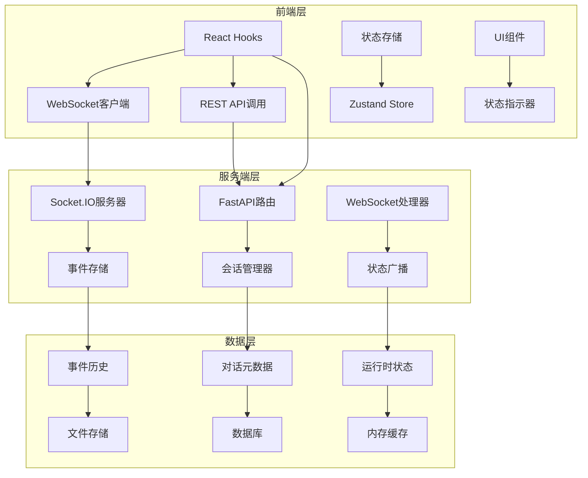
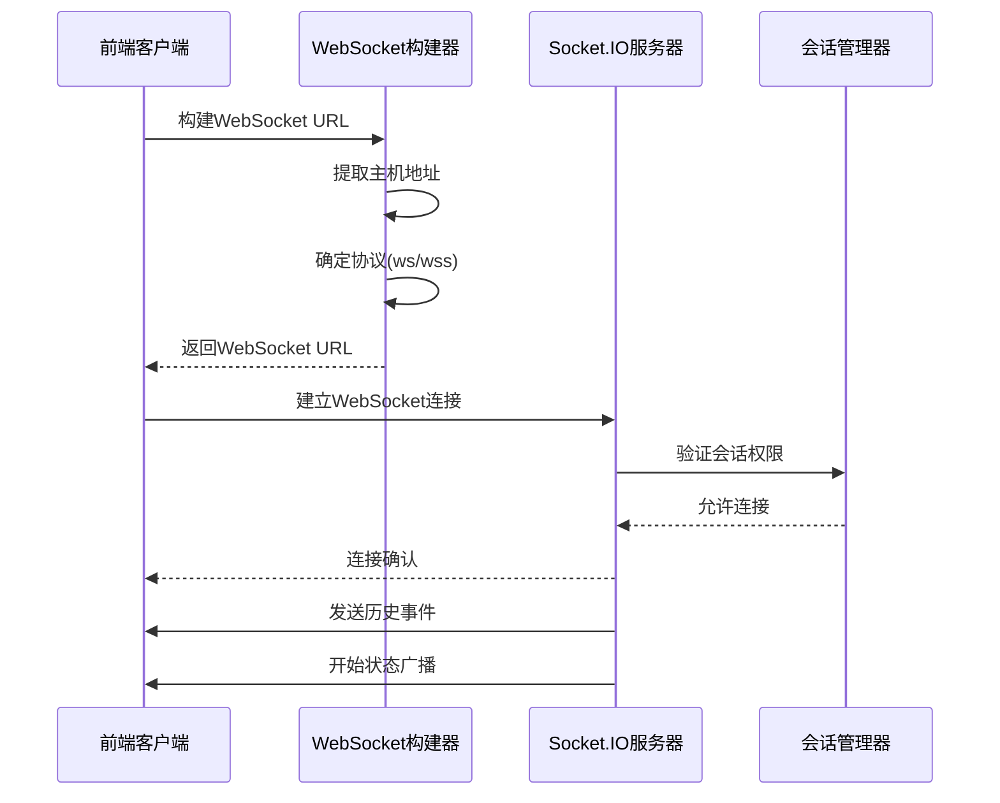
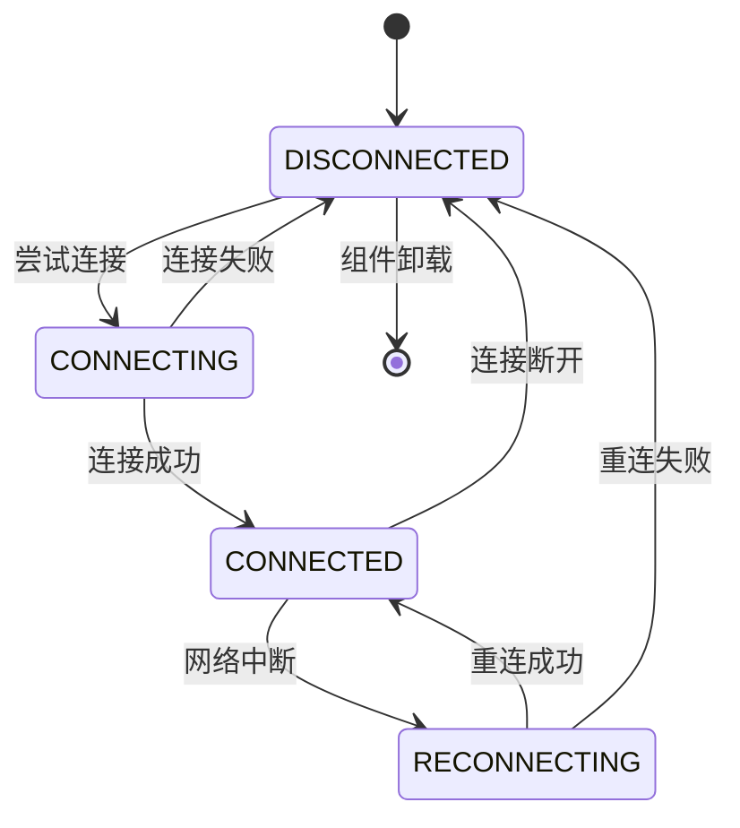
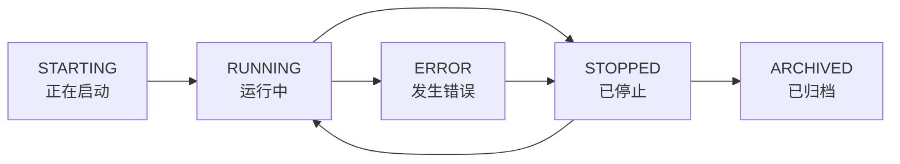
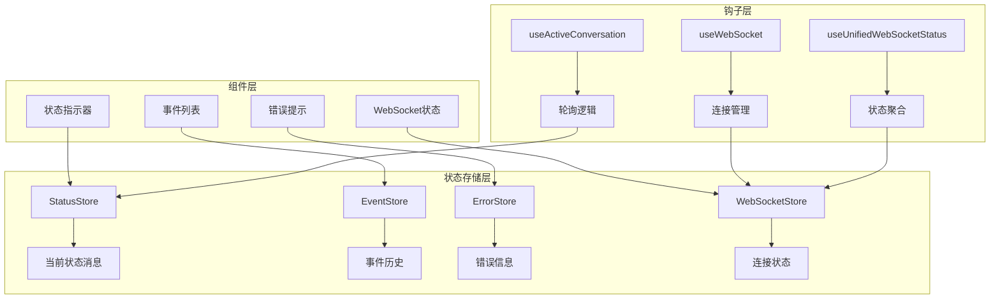
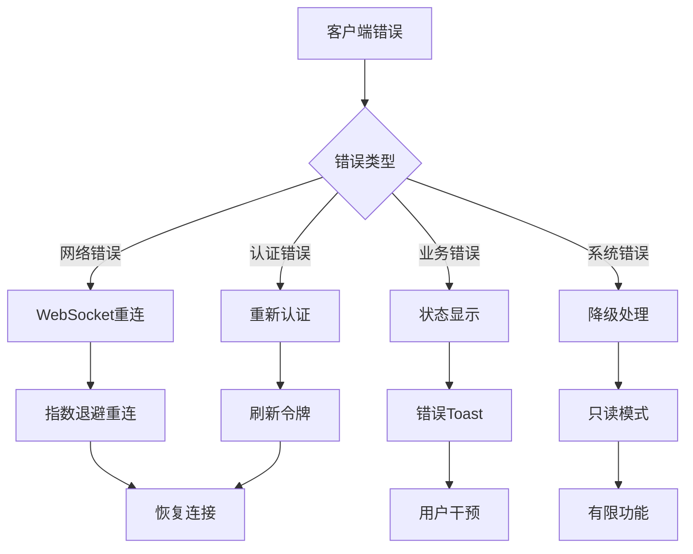

# 状态监控

<cite>
**本文档中引用的文件**
- [manage_conversations.py](file://openhands/server/routes/manage_conversations.py)
- [conversation-service.api.ts](file://frontend/src/api/conversation-service/conversation-service.api.ts)
- [use-active-conversation.ts](file://frontend/src/hooks/query/use-active-conversation.ts)
- [use-websocket.ts](file://frontend/src/hooks/use-websocket.ts)
- [ws-client-provider.tsx](file://frontend/src/context/ws-client-provider.tsx)
- [conversation-websocket-context.tsx](file://frontend/src/contexts/conversation-websocket-context.tsx)
- [websocket-url.ts](file://frontend/src/utils/websocket-url.ts)
- [listen_socket.py](file://openhands/server/listen_socket.py)
- [conversation-info.py](file://openhands/server/data_models/conversation_info.py)
- [conversation_status.py](file://openhands/storage/data_models/conversation_status.py)
- [conversation-status.ts](file://frontend/src/types/conversation-status.ts)
- [status-store.ts](file://frontend/src/state/status-store.ts)
- [task-tracking-observation-content.tsx](file://frontend/src/components/features/chat/task-tracking-observation-content.tsx)
- [task-item.tsx](file://frontend/src/components/features/chat/task-tracking/task-item.tsx)
</cite>

## 目录
1. [简介](#简介)
2. [项目架构概览](#项目架构概览)
3. [REST API端点](#rest-api端点)
4. [WebSocket实时通信](#websocket实时通信)
5. [状态数据模型](#状态数据模型)
6. [前端状态管理](#前端状态管理)
7. [错误处理机制](#错误处理机制)
8. [最佳实践与性能优化](#最佳实践与性能优化)
9. [实际应用示例](#实际应用示例)
10. [故障排除指南](#故障排除指南)

## 简介

OpenHands状态监控系统提供了全面的任务执行状态跟踪功能，支持通过REST API和WebSocket两种方式实时监控对话（Conversation）的生命周期状态。该系统能够准确反映任务从启动到完成的各个阶段，并为用户提供直观的状态更新和进度反馈。

系统采用双版本架构设计，同时支持传统V0和现代化V1对话模式，确保向后兼容性的同时提供更好的性能和用户体验。

## 项目架构概览

OpenHands状态监控系统采用分层架构设计，包含以下核心组件：



**图表来源**
- [manage_conversations.py](file://openhands/server/routes/manage_conversations.py#L98-L1436)
- [listen_socket.py](file://openhands/server/listen_socket.py#L1-L169)

## REST API端点

### GET /conversations/{id}

这是获取单个对话状态的核心端点，支持两种版本的对话：

#### 请求参数
- `conversation_id` (路径参数): 对话唯一标识符

#### 响应数据结构

```typescript
interface ConversationInfo {
  conversation_id: string;
  title: string;
  status: "STARTING" | "RUNNING" | "STOPPED" | "ARCHIVED" | "ERROR";
  runtime_status: RuntimeStatus | null;
  selected_repository: string | null;
  selected_branch: string | null;
  git_provider: ProviderType | null;
  trigger: ConversationTrigger | null;
  num_connections: number;
  url: string | null;
  session_api_key: string | null;
  created_at: DateTime;
  pr_number: number[];
  conversation_version: string;
}
```

#### 状态码说明

| 状态码 | 描述 | 场景 |
|--------|------|------|
| 200 | 成功 | 对话存在且可访问 |
| 404 | 未找到 | 对话不存在或已被删除 |
| 500 | 服务器错误 | 内部处理异常 |

#### 实际示例

```json
{
  "conversation_id": "conv-12345",
  "title": "代码审查任务",
  "status": "RUNNING",
  "runtime_status": "RUNNING",
  "selected_repository": "github.com/user/repo",
  "selected_branch": "feature/new-feature",
  "git_provider": "GITHUB",
  "trigger": "GUI",
  "num_connections": 2,
  "url": "http://localhost:8080/api/conversations/conv-12345",
  "session_api_key": "sk-abc123",
  "created_at": "2024-01-15T10:30:00Z",
  "pr_number": [123],
  "conversation_version": "V1"
}
```

**章节来源**
- [manage_conversations.py](file://openhands/server/routes/manage_conversations.py#L433-L466)
- [conversation-info.py](file://openhands/server/data_models/conversation_info.py#L10-L31)

## WebSocket实时通信

### 连接建立

WebSocket连接通过专门的URL构建函数建立：



**图表来源**
- [websocket-url.ts](file://frontend/src/utils/websocket-url.ts#L39-L54)
- [listen_socket.py](file://openhands/server/listen_socket.py#L35-L139)

### 消息格式

#### 标准事件格式

所有WebSocket消息都遵循统一的事件格式：

```typescript
interface OpenHandsEvent {
  type: string;
  id: string;
  timestamp: string;
  data: any;
}
```

#### 状态更新消息

当对话状态发生变化时，服务器会发送状态更新消息：

```json
{
  "type": "status_update",
  "id": "status-12345",
  "timestamp": "2024-01-15T10:30:00Z",
  "data": {
    "status": "RUNNING",
    "runtime_status": "RUNNING",
    "message": "任务正在执行中..."
  }
}
```

#### 任务进度消息

对于任务跟踪观察，系统提供详细的进度信息：

```json
{
  "type": "task_tracking",
  "id": "task-123",
  "timestamp": "2024-01-15T10:30:00Z",
  "data": {
    "command": "plan",
    "task_list": [
      {
        "id": "task-1",
        "title": "实现用户认证",
        "status": "todo",
        "notes": "需要处理OAuth流程"
      },
      {
        "id": "task-2", 
        "title": "创建API端点",
        "status": "in_progress",
        "notes": "正在开发中..."
      }
    ],
    "result": "计划已生成，开始执行第一个任务"
  }
}
```

### 连接状态管理

系统维护多种连接状态以确保可靠的通信：



**章节来源**
- [use-websocket.ts](file://frontend/src/hooks/use-websocket.ts#L37-L192)
- [ws-client-provider.tsx](file://frontend/src/context/ws-client-provider.tsx#L130-L200)

## 状态数据模型

### 对话状态枚举

系统定义了完整的对话状态生命周期：



**图表来源**
- [conversation_status.py](file://openhands/storage/data_models/conversation_status.py#L13-L24)

### 状态转换规则

| 当前状态 | 可能的操作 | 新状态 | 触发条件 |
|----------|------------|--------|----------|
| STOPPED | 启动 | STARTING | 调用/start端点 |
| STARTING | 启动成功 | RUNNING | 代理循环就绪 |
| RUNNING | 停止 | STOPPED | 调用/stop端点 |
| RUNNING | 错误 | ERROR | 运行时异常 |
| ERROR | 重置 | STOPPED | 手动重置 |
| STOPPED | 归档 | ARCHIVED | 删除操作 |

**章节来源**
- [conversation_status.py](file://openhands/storage/data_models/conversation_status.py#L1-L24)

## 前端状态管理

### 状态存储架构

前端使用Zustand进行全局状态管理：



**图表来源**
- [status-store.ts](file://frontend/src/state/status-store.ts#L1-L20)
- [use-active-conversation.ts](file://frontend/src/hooks/query/use-active-conversation.ts#L6-L36)

### 实时状态更新

系统实现了智能的状态轮询策略：

```typescript
// 智能轮询间隔配置
const pollingIntervals = {
  STARTING: 3000,      // 3秒（快速轮询）
  RUNNING: 30000,      // 30秒（常规轮询）
  STOPPED: 60000,      // 1分钟（低频轮询）
  ERROR: 10000,        // 10秒（错误恢复）
  ARCHIVED: false      // 不轮询已归档对话
};
```

**章节来源**
- [use-active-conversation.ts](file://frontend/src/hooks/query/use-active-conversation.ts#L17-L22)

## 错误处理机制

### 分层错误处理

系统采用多层错误处理策略：



### 错误恢复策略

| 错误类型 | 恢复策略 | 重试次数 | 退避时间 |
|----------|----------|----------|----------|
| 网络超时 | 自动重连 | 5次 | 1s, 2s, 4s, 8s, 16s |
| 认证失效 | 刷新令牌 | 1次 | 立即 |
| 连接断开 | 重建连接 | 无限 | 指数退避 |
| 服务器错误 | 降级处理 | 无限制 | 固定间隔 |

**章节来源**
- [ws-client-provider.tsx](file://frontend/src/context/ws-client-provider.tsx#L103-L128)

## 最佳实践与性能优化

### 轮询优化策略

1. **智能轮询间隔**
   - 启动阶段：3秒轮询
   - 运行阶段：30秒轮询  
   - 停止阶段：1分钟轮询
   - 错误阶段：10秒轮询

2. **条件轮询**
   ```typescript
   const pollingInterval = useMemo(() => {
     if (conversation?.status === "STARTING") {
       return 3000; // 快速轮询
     }
     return 30000; // 常规轮询
   }, [conversation?.status]);
   ```

3. **内存管理**
   - 使用React.memo避免不必要的重渲染
   - 实现事件去重机制
   - 定期清理过期事件

### WebSocket优化

1. **连接池管理**
   - 复用WebSocket连接
   - 实现连接保活机制
   - 支持多对话并发

2. **消息压缩**
   - 使用二进制格式传输大型事件
   - 实现消息合并策略
   - 减少网络带宽占用

**章节来源**
- [use-active-conversation.ts](file://frontend/src/hooks/query/use-active-conversation.ts#L17-L22)

## 实际应用示例

### 前端进度条实现

以下是实现实时进度条的关键代码模式：

```typescript
// 进度条组件示例
export function ConversationProgressBar() {
  const { data: conversation } = useActiveConversation();
  const [progress, setProgress] = useState(0);
  
  useEffect(() => {
    if (conversation?.status === "RUNNING") {
      // 设置定时器更新进度
      const interval = setInterval(() => {
        setProgress(prev => Math.min(prev + 5, 100));
      }, 1000);
      
      return () => clearInterval(interval);
    }
  }, [conversation?.status]);
  
  return (
    <div className="progress-bar">
      <div 
        className="progress-fill" 
        style={{ width: `${progress}%` }}
      />
    </div>
  );
}
```

### 任务状态监控

```typescript
// 任务状态监控示例
export function TaskStatusMonitor() {
  const { data: conversation } = useActiveConversation();
  const { events } = useEventStore();
  
  const runningTasks = useMemo(() => {
    return events.filter(event => 
      event.type === "task_tracking" && 
      event.data?.task_list?.some(task => task.status === "in_progress")
    );
  }, [events]);
  
  return (
    <div className="task-monitor">
      {runningTasks.map(task => (
        <TaskItem key={task.id} task={task.data} />
      ))}
    </div>
  );
}
```

**章节来源**
- [task-tracking-observation-content.tsx](file://frontend/src/components/features/chat/task-tracking-observation-content.tsx#L1-L26)
- [task-item.tsx](file://frontend/src/components/features/chat/task-tracking/task-item.tsx#L1-L43)

## 故障排除指南

### 常见问题诊断

1. **WebSocket连接失败**
   - 检查网络连接
   - 验证URL构建是否正确
   - 确认服务器端口开放

2. **状态更新延迟**
   - 检查轮询间隔设置
   - 验证事件过滤逻辑
   - 监控服务器负载

3. **任务进度不准确**
   - 确认事件序列完整性
   - 检查状态转换逻辑
   - 验证消息格式解析

### 调试工具

1. **浏览器开发者工具**
   - Network面板查看WebSocket连接
   - Console面板检查错误信息
   - Application面板查看存储状态

2. **服务器日志**
   - 启用详细日志记录
   - 监控连接建立过程
   - 跟踪事件处理流程

**章节来源**
- [listen_socket.py](file://openhands/server/listen_socket.py#L35-L139)