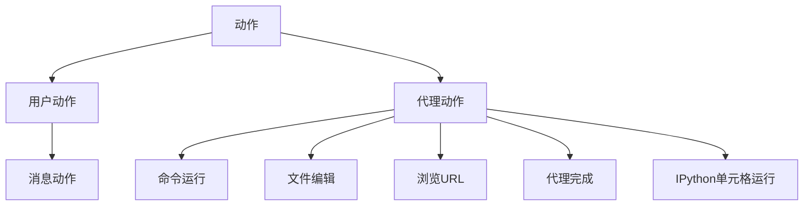
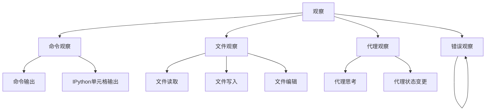

# 结果处理

<cite>
**本文档引用的文件**   
- [trajectory.py](file://openhands/server/routes/trajectory.py)
- [event_store.py](file://openhands/events/event_store.py)
- [event.py](file://openhands/events/serialization/event.py)
- [use-get-trajectory.ts](file://frontend/src/hooks/mutation/use-get-trajectory.ts)
- [conversation.py](file://openhands/server/routes/conversation.py)
- [action.py](file://openhands/events/action/__init__.py)
- [observation.py](file://openhands/events/observation/__init__.py)
</cite>

## 目录
1. [简介](#简介)
2. [轨迹端点使用方法](#轨迹端点使用方法)
3. [轨迹数据结构](#轨迹数据结构)
4. [代码示例](#代码示例)
5. [结果缓存策略](#结果缓存策略)
6. [数据保留期限](#数据保留期限)

## 简介
本文档详细描述了如何获取和解析任务执行的完整轨迹和最终结果。重点介绍了GET /conversations/{id}/trajectory端点的使用方法，包括请求参数、响应格式以及分页机制。文档还解释了轨迹数据的结构，包括动作类型、观察类型、时间戳和上下文信息，并提供了分析轨迹数据以评估任务完成情况、计算指标和生成报告的代码示例。

## 轨迹端点使用方法
GET /conversations/{id}/trajectory端点用于获取指定会话的完整执行轨迹。该端点返回一个包含所有操作、观察和决策的序列化事件列表。

### 请求参数
- **conversation_id**: 会话的唯一标识符（路径参数）

### 响应格式
成功响应返回HTTP 200状态码，响应体包含以下结构：
```json
{
  "trajectory": [
    {
      "id": 0,
      "timestamp": "2024-01-01T00:00:00",
      "source": "user",
      "action": "message",
      "message": "创建一个Python文件"
    },
    {
      "id": 1,
      "timestamp": "2024-01-01T00:00:01",
      "source": "agent",
      "action": "file_write",
      "path": "example.py",
      "content": "print('Hello World')"
    }
  ]
}
```

### 分页机制
该端点目前不支持分页，返回完整的轨迹数据。对于大型会话，建议客户端实现流式处理或分批获取策略。

**Section sources**
- [trajectory.py](file://openhands/server/routes/trajectory.py#L17-L51)
- [conversation.py](file://openhands/server/routes/conversation.py#L204-L267)

## 轨迹数据结构
轨迹数据由一系列事件组成，每个事件包含标准化的元数据和特定于类型的属性。

### 事件通用结构
每个事件都包含以下通用字段：
- **id**: 事件的唯一标识符（整数）
- **timestamp**: 事件发生的时间戳（ISO 8601格式）
- **source**: 事件来源（"user"或"agent"）
- **message**: 可选的描述性消息

### 动作类型
动作事件表示系统中的主动操作，主要类型包括：



**Diagram sources**
- [action.py](file://openhands/events/action/__init__.py#L1-L51)

### 观察类型
观察事件表示系统状态的被动记录，主要类型包括：



**Diagram sources**
- [observation.py](file://openhands/events/observation/__init__.py#L1-L56)

### 时间戳和上下文信息
所有事件都包含精确的时间戳信息，用于重建执行时间线。上下文信息通过"extras"字段提供，包含与特定事件类型相关的附加数据：

- **命令执行**: 包含进程ID、退出码和执行时间
- **文件操作**: 包含文件路径、大小和权限信息
- **浏览操作**: 包含URL、页面标题和DOM快照
- **代理决策**: 包含思考过程、工具调用和推理链

**Section sources**
- [event.py](file://openhands/events/serialization/event.py#L155-L164)
- [event_store.py](file://openhands/events/event_store.py#L43-L184)

## 代码示例
以下代码示例展示了如何分析轨迹数据以评估任务完成情况、计算指标和生成报告。

### 获取轨迹数据
```typescript
import { useMutation } from "@tanstack/react-query";
import ConversationService from "#/api/conversation-service/conversation-service.api";

export const useGetTrajectory = () =>
  useMutation({
    mutationFn: (cid: string) => ConversationService.getTrajectory(cid),
  });
```

### 分析任务完成情况
```python
def analyze_task_completion(trajectory):
    """分析任务完成情况"""
    # 检查是否存在代理完成动作
    finish_actions = [e for e in trajectory if e.get('action') == 'agent_finish']
    
    if not finish_actions:
        return {
            'completed': False,
            'status': 'incomplete',
            'reason': '没有找到代理完成动作'
        }
    
    last_finish = finish_actions[-1]
    return {
        'completed': True,
        'status': 'completed',
        'success': last_finish.get('success', False),
        'final_thought': last_finish.get('thought', ''),
        'completion_time': last_finish.get('timestamp')
    }
```

### 计算性能指标
```python
def calculate_metrics(trajectory):
    """计算任务执行指标"""
    metrics = {
        'total_events': len(trajectory),
        'user_actions': 0,
        'agent_actions': 0,
        'execution_time': 0,
        'command_count': 0,
        'file_operations': 0
    }
    
    # 统计各类事件
    for event in trajectory:
        if event.get('source') == 'user':
            metrics['user_actions'] += 1
        elif event.get('source') == 'agent':
            metrics['agent_actions'] += 1
            
        if event.get('action') == 'cmd_run':
            metrics['command_count'] += 1
        elif event.get('action') in ['file_read', 'file_write', 'file_edit']:
            metrics['file_operations'] += 1
    
    # 计算执行时间
    if len(trajectory) > 1:
        start_time = trajectory[0]['timestamp']
        end_time = trajectory[-1]['timestamp']
        metrics['execution_time'] = (end_time - start_time).total_seconds()
    
    return metrics
```

### 生成执行报告
```python
def generate_report(trajectory):
    """生成任务执行报告"""
    completion = analyze_task_completion(trajectory)
    metrics = calculate_metrics(trajectory)
    
    report = {
        'summary': {
            'task_completed': completion['completed'],
            'success_rate': completion['success'] if completion['completed'] else 0,
            'total_duration': metrics['execution_time'],
            'total_steps': metrics['total_events']
        },
        'detailed_metrics': metrics,
        'timeline': [
            {
                'timestamp': event['timestamp'],
                'type': event.get('action') or event.get('observation'),
                'source': event['source'],
                'description': event.get('message', event.get('content', ''))
            }
            for event in trajectory
        ],
        'recommendations': []
    }
    
    # 添加改进建议
    if metrics['command_count'] > 50:
        report['recommendations'].append('命令执行次数较多，建议优化工作流程')
    if metrics['file_operations'] > 20:
        report['recommendations'].append('文件操作频繁，建议批量处理')
    
    return report
```

**Section sources**
- [use-get-trajectory.ts](file://frontend/src/hooks/mutation/use-get-trajectory.ts#L1-L7)
- [event.py](file://openhands/events/serialization/event.py#L155-L164)

## 结果缓存策略
系统采用多层缓存策略来优化轨迹数据的访问性能。

### 缓存层级
1. **内存缓存**: 正在运行的会话事件直接存储在内存中，提供最快的访问速度
2. **文件缓存**: 使用分页机制将事件批量写入文件系统，减少I/O操作
3. **索引缓存**: 维护事件ID的索引，支持快速的随机访问查询

### 缓存实现
```python
@dataclass
class _CachePage:
    events: list[dict] | None
    start: int
    end: int
    
    def covers(self, global_index: int) -> bool:
        """检查页面是否覆盖指定索引"""
        return self.start <= global_index < self.end
    
    def get_event(self, global_index: int) -> Event | None:
        """从缓存页面获取事件"""
        if not self.events:
            return None
        local_index = global_index - self.start
        return event_from_dict(self.events[local_index])
```

缓存页面大小默认为25个事件，当页面填满时自动写入文件系统。这种设计平衡了内存使用和I/O性能，确保大规模轨迹数据的高效处理。

**Section sources**
- [event_store.py](file://openhands/events/event_store.py#L19-L41)
- [event_store.py](file://openhands/events/event_store.py#L161-L175)

## 数据保留期限
系统实施严格的数据保留策略，确保数据安全和存储效率。

### 保留策略
- **活动会话**: 数据永久保留，直到会话完成
- **已完成会话**: 默认保留30天，可根据配置调整
- **失败会话**: 保留7天，用于故障排查
- **调试数据**: 保留24小时，自动清理

### 数据清理机制
系统定期执行数据清理任务：
1. **每日清理**: 删除超过保留期限的会话数据
2. **空间监控**: 当存储空间达到阈值时，优先清理最旧的非重要数据
3. **事件压缩**: 对大型会话进行归档压缩，减少存储占用

数据保留期限可通过系统配置进行调整，满足不同环境的合规性要求。

**Section sources**
- [event_store.py](file://openhands/events/event_store.py#L65-L83)
- [event_store.py](file://openhands/events/event_store.py#L19-L41)