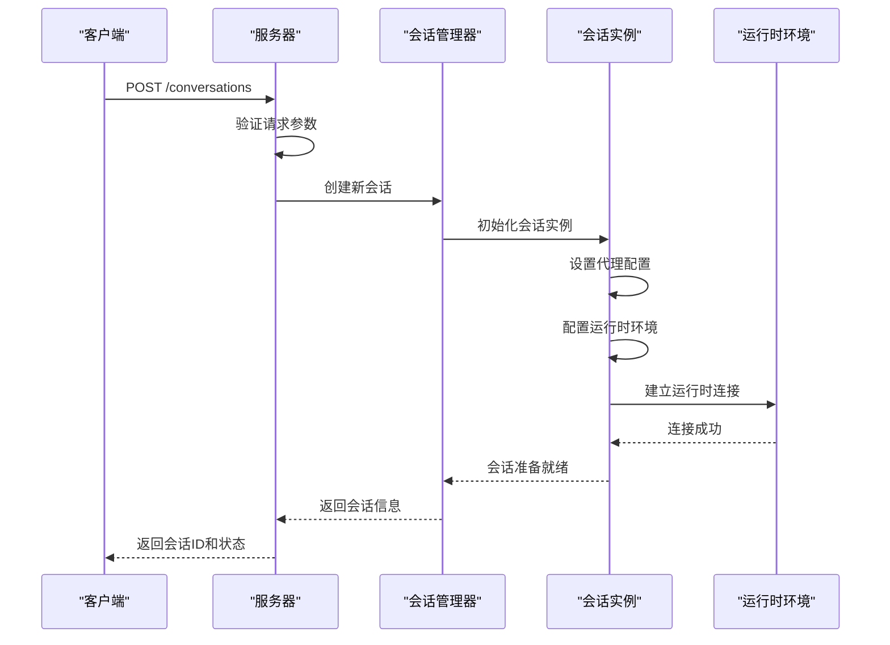
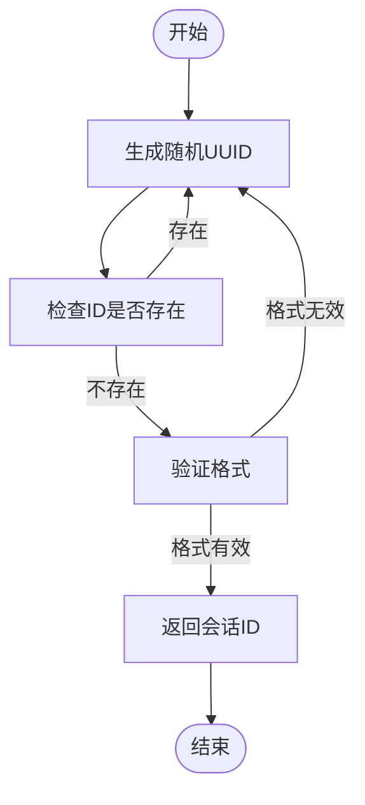
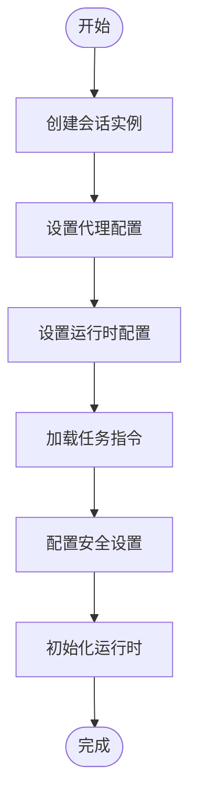
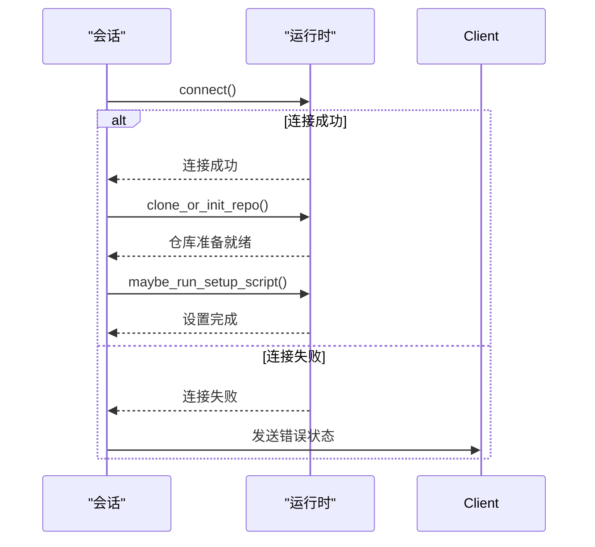

# 会话创建

<cite>
**本文档引用的文件**   
- [manage_conversations.py](file://openhands/server/routes/manage_conversations.py)
- [session.py](file://openhands/server/session/session.py)
- [standalone_conversation_manager.py](file://openhands/server/conversation_manager/standalone_conversation_manager.py)
- [conversation_init_data.py](file://openhands/server/session/conversation_init_data.py)
- [memory.py](file://openhands/memory/memory.py)
- [conversation.py](file://openhands/server/routes/conversation.py)
- [utils.py](file://openhands/server/utils.py)
</cite>

## 目录
1. [简介](#简介)
2. [会话创建流程](#会话创建流程)
3. [POST /conversations端点](#post-conversations端点)
4. [会话ID生成机制](#会话id生成机制)
5. [会话上下文初始化](#会话上下文初始化)
6. [运行时环境连接](#运行时环境连接)
7. [API使用示例](#api使用示例)
8. [验证规则与默认值](#验证规则与默认值)
9. [错误处理机制](#错误处理机制)

## 简介
会话创建功能是OpenHands系统的核心组件，负责初始化新的对话会话。该功能通过REST API端点POST /conversations实现，允许客户端创建新的会话并配置代理类型、运行时配置和任务指令等参数。会话创建过程包括会话ID生成、上下文初始化和运行时环境连接等关键步骤。

**Section sources**
- [manage_conversations.py](file://openhands/server/routes/manage_conversations.py#L212-L224)

## 会话创建流程
会话创建流程从客户端发送POST请求到/conversations端点开始。服务器接收到请求后，首先验证会话ID的有效性，然后创建新的会话实例。会话创建过程中，系统会初始化会话上下文，包括代理配置、运行时环境和任务指令等。最后，系统建立与运行时环境的连接，使会话进入可运行状态。



**Diagram sources**
- [manage_conversations.py](file://openhands/server/routes/manage_conversations.py#L212-L280)
- [session.py](file://openhands/server/session/session.py#L266-L282)
- [standalone_conversation_manager.py](file://openhands/server/conversation_manager/standalone_conversation_manager.py#L296-L367)

## POST /conversations端点
POST /conversations端点是创建新会话的主要接口。该端点接受JSON格式的请求体，包含会话初始化所需的各种参数。

### 请求参数
| 参数 | 类型 | 必需 | 描述 |
|------|------|------|------|
| repository | string | 否 | 要克隆的仓库URL |
| git_provider | enum | 否 | 代码托管服务提供商（如GitHub、GitLab） |
| selected_branch | string | 否 | 要检出的分支名称 |
| initial_user_msg | string | 否 | 初始用户消息 |
| image_urls | array | 否 | 图像URL数组 |
| replay_json | string | 否 | 重放JSON数据 |
| suggested_task | object | 否 | 建议任务 |
| create_microagent | object | 否 | 创建微代理 |
| conversation_instructions | string | 否 | 会话指令 |
| mcp_config | object | 否 | MCP配置 |

### 请求示例
```json
{
  "repository": "https://github.com/user/repo.git",
  "git_provider": "GITHUB",
  "selected_branch": "main",
  "initial_user_msg": "请帮我修复这个bug",
  "conversation_instructions": "专注于代码修复任务"
}
```

### 响应格式
成功创建会话后，服务器返回包含会话ID和状态的JSON响应：
```json
{
  "status": "ok",
  "conversation_id": "abc123def456",
  "conversation_status": "STARTING"
}
```

**Section sources**
- [manage_conversations.py](file://openhands/server/routes/manage_conversations.py#L183-L200)

## 会话ID生成机制
会话ID的生成遵循严格的规则以确保唯一性和安全性。系统使用UUID生成基础ID，并通过验证确保其唯一性。

### 生成流程
1. 生成随机UUID作为会话ID候选
2. 检查该ID是否已存在于会话存储中
3. 如果存在，则生成新的UUID并重复检查
4. 返回唯一的会话ID

### 验证规则
会话ID必须满足以下条件：
- 长度不超过100个字符
- 不包含路径遍历字符（如".."、"/"、"\\"）
- 不包含控制字符（ASCII值小于32的字符）
- 不能与现有会话ID重复



**Diagram sources**
- [utils.py](file://openhands/server/utils.py#L72-L78)
- [manage_conversations.py](file://openhands/server/routes/manage_conversations.py#L258-L259)

## 会话上下文初始化
会话上下文初始化是会话创建过程中的关键步骤，负责设置会话的运行环境和配置。

### 初始化内容
1. **代理配置**：设置代理类型、最大迭代次数和预算限制
2. **运行时配置**：配置沙箱环境、容器镜像和资源限制
3. **任务指令**：加载会话指令和上下文信息
4. **安全设置**：配置确认模式和安全分析器

### 初始化流程


**Section sources**
- [session.py](file://openhands/server/session/session.py#L132-L307)
- [conversation_init_data.py](file://openhands/server/session/conversation_init_data.py#L8-L22)

## 运行时环境连接
运行时环境连接是会话创建的最后一步，负责建立与沙箱环境的通信通道。

### 连接建立过程
1. 创建运行时实例
2. 连接到运行时环境
3. 克隆或初始化代码仓库
4. 执行设置脚本（如果存在）
5. 配置Git钩子（如果需要）

### 连接状态
会话的运行时状态通过以下方式确定：
- 如果运行时已初始化，则状态为"RUNNING"
- 否则状态为"STARTING"



**Diagram sources**
- [session.py](file://openhands/server/session/session.py#L266-L282)
- [agent_session.py](file://openhands/server/session/agent_session.py#L365-L384)

## API使用示例
以下是使用API创建会话的代码示例，展示最小化配置和完整配置两种场景。

### 最小化配置示例
```python
import requests
import json

# 最小化配置：仅指定仓库
response = requests.post(
    "http://localhost:3000/api/conversations",
    json={
        "repository": "https://github.com/user/repo.git"
    }
)

if response.status_code == 200:
    data = response.json()
    print(f"会话创建成功: {data['conversation_id']}")
else:
    print(f"创建失败: {response.status_code}")
```

### 完整配置示例
```python
import requests
import json

# 完整配置：包含所有可选参数
response = requests.post(
    "http://localhost:3000/api/conversations",
    json={
        "repository": "https://github.com/user/repo.git",
        "git_provider": "GITHUB",
        "selected_branch": "develop",
        "initial_user_msg": "请帮我实现这个新功能",
        "image_urls": ["https://example.com/screenshot.png"],
        "conversation_instructions": "这是一个高优先级任务，请尽快完成",
        "mcp_config": {
            "shttp_servers": [
                {
                    "name": "default-mcp-server",
                    "url": "http://localhost:8080"
                }
            ]
        }
    }
)

if response.status_code == 200:
    data = response.json()
    print(f"会话创建成功: {data['conversation_id']}")
    print(f"状态: {data['conversation_status']}")
else:
    print(f"创建失败: {response.status_code}")
    print(f"错误信息: {response.json()}")
```

**Section sources**
- [manage_conversations.py](file://openhands/server/routes/manage_conversations.py#L212-L280)

## 验证规则与默认值
系统在会话创建过程中实施严格的验证规则，并为未指定的参数提供合理的默认值。

### 验证规则
- **会话ID**：必须是有效的字符串，不包含特殊字符
- **仓库URL**：必须是有效的Git仓库URL
- **分支名称**：必须符合Git分支命名规范
- **最大并发会话**：用户不能超过配置的并发会话限制

### 默认值设置
| 参数 | 默认值 | 说明 |
|------|--------|------|
| agent | CodeActAgent | 默认代理类型 |
| max_iterations | 100 | 最大迭代次数 |
| confirmation_mode | false | 确认模式默认关闭 |
| sandbox_base_container_image | ghcr.io/all-hands-ai/runtime:latest | 基础容器镜像 |
| runtime | docker | 默认运行时类型 |

当用户未提供特定参数时，系统会使用这些默认值进行配置。

**Section sources**
- [session.py](file://openhands/server/session/session.py#L142-L181)
- [standalone_conversation_manager.py](file://openhands/server/conversation_manager/standalone_conversation_manager.py#L306-L315)

## 错误处理机制
系统实现了全面的错误处理机制，确保会话创建过程中的各种异常情况都能得到妥善处理。

### 重复会话ID处理
当尝试创建具有重复ID的会话时，系统会生成新的唯一ID，而不是返回错误。这是通过在会话存储中检查ID是否存在来实现的：

```python
async def generate_unique_conversation_id(conversation_store):
    conversation_id = uuid.uuid4().hex
    while await conversation_store.exists(conversation_id):
        conversation_id = uuid.uuid4().hex
    return conversation_id
```

### 无效代理类型响应
当请求中包含无效的代理类型时，系统会返回400错误响应：

```json
{
  "status": "error",
  "message": "Agent specification not found",
  "msg_id": "CONFIGURATION$SETTINGS_NOT_FOUND"
}
```

### 其他常见错误
| 错误类型 | HTTP状态码 | 响应消息ID |
|---------|-----------|-----------|
| LLM认证失败 | 400 | ERROR_LLM_AUTHENTICATION |
| 会话ID无效 | 400 | 会话ID包含无效路径字符 |
| 仓库验证失败 | 400 | 无法验证仓库访问权限 |
| 内部服务器错误 | 500 | Failed to start conversation |

系统还实现了最大并发会话限制，当用户达到会话数量上限时，最旧的非活动会话将被自动关闭。

**Section sources**
- [manage_conversations.py](file://openhands/server/routes/manage_conversations.py#L280-L298)
- [utils.py](file://openhands/server/utils.py#L43-L55)