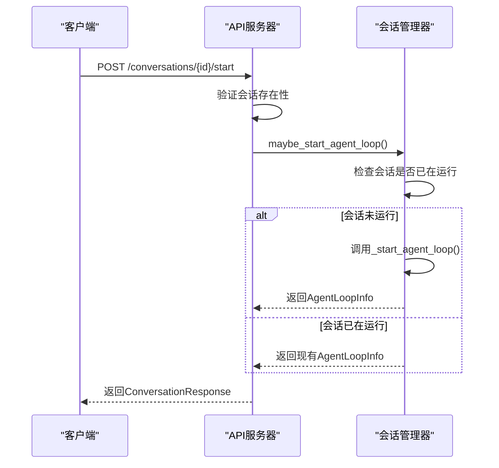
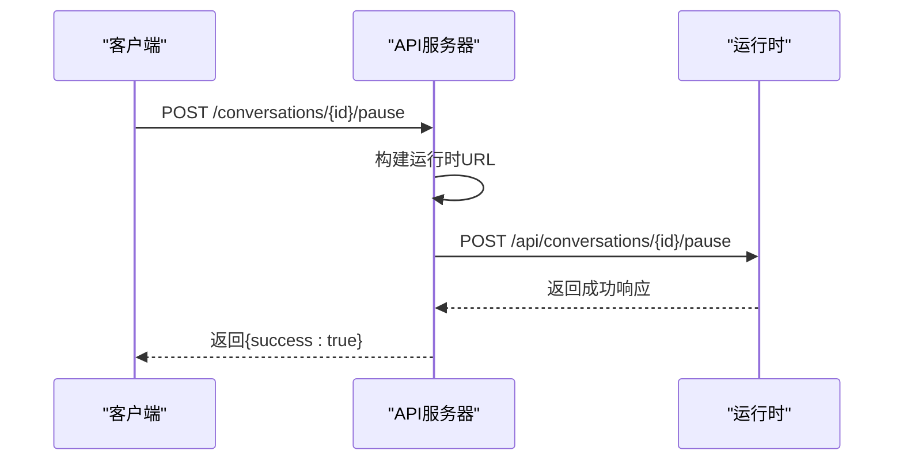
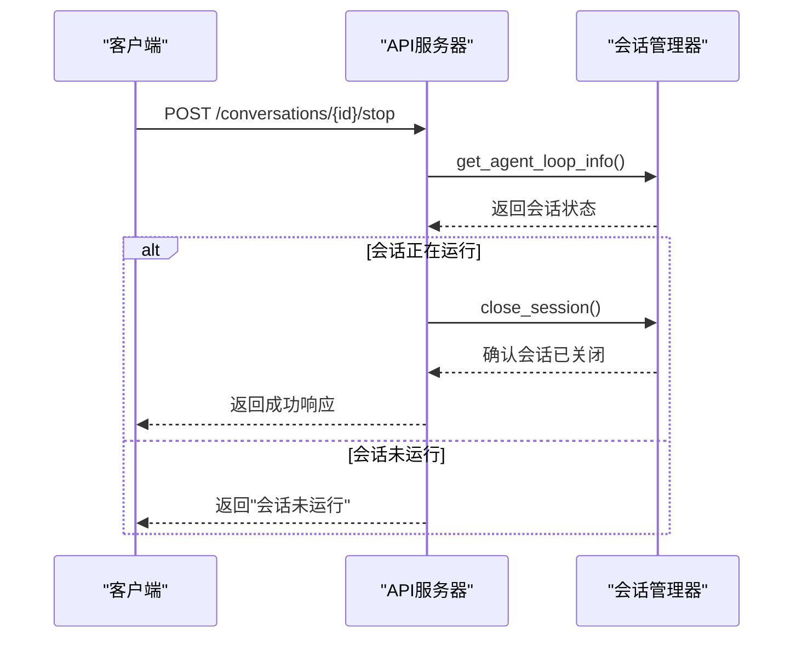
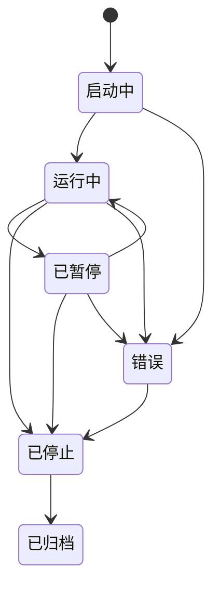
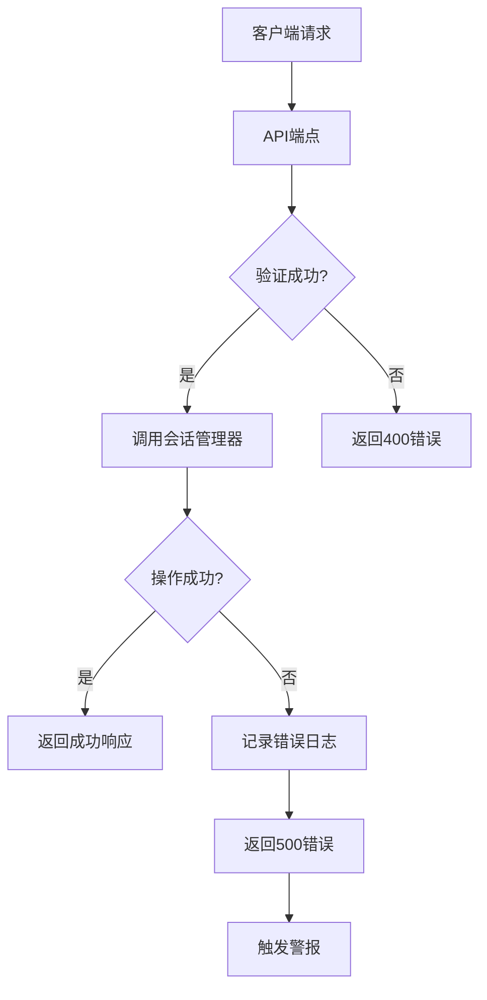
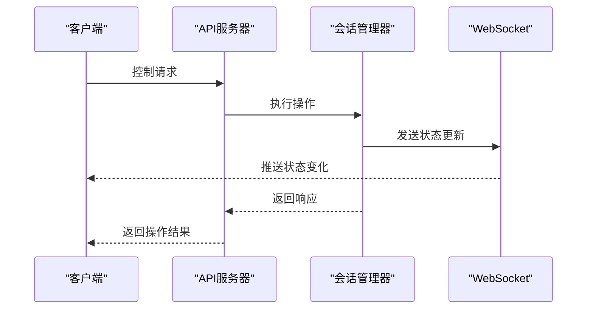

# 会话控制

<cite>
**本文档中引用的文件**   
- [manage_conversations.py](file://openhands/server/routes/manage_conversations.py)
- [conversation_status.py](file://openhands/storage/data_models/conversation_status.py)
- [v1-conversation-service.api.ts](file://frontend/src/api/conversation-service/v1-conversation-service.api.ts)
- [conversation-service.api.ts](file://frontend/src/api/conversation-service/conversation-service.api.ts)
- [use-stop-conversation.ts](file://frontend/src/hooks/mutation/use-stop-conversation.ts)
- [use-unified-stop-conversation.ts](file://frontend/src/hooks/mutation/use-unified-stop-conversation.ts)
- [conversation-mutation-utils.ts](file://frontend/src/hooks/mutation/conversation-mutation-utils.ts)
- [conversation-panel.tsx](file://frontend/src/components/features/conversation-panel/conversation-panel.tsx)
- [docker_nested_conversation_manager.py](file://openhands/server/conversation_manager/docker_nested_conversation_manager.py)
- [standalone_conversation_manager.py](file://openhands/server/conversation_manager/standalone_conversation_manager.py)
- [saas_nested_conversation_manager.py](file://enterprise/server/saas_nested_conversation_manager.py)
- [conversation_status.ts](file://frontend/src/types/conversation-status.ts)
- [use-agent-state.ts](file://frontend/src/hooks/use-agent-state.ts)
</cite>

## 目录
1. [简介](#简介)
2. [会话控制操作](#会话控制操作)
3. [会话状态转换机制](#会话状态转换机制)
4. [API控制示例](#api控制示例)
5. [错误处理与超时机制](#错误处理与超时机制)
6. [状态同步解决方案](#状态同步解决方案)

## 简介
会话控制功能是OpenHands系统的核心组件，负责管理会话的整个生命周期，包括启动、暂停、恢复和终止操作。该功能通过REST API端点提供对会话的全面控制，允许用户和系统根据需要动态管理会话状态。会话控制机制设计为支持V0和V1两种会话版本，确保向后兼容性同时提供现代化的控制接口。

会话控制功能主要通过`manage_conversations.py`文件中的路由定义实现，这些路由与`conversation_manager`组件协同工作，处理会话的生命周期管理。系统支持多种会话管理策略，包括独立模式、Docker嵌套模式和SaaS嵌套模式，以适应不同的部署场景和需求。

**Section sources**
- [manage_conversations.py](file://openhands/server/routes/manage_conversations.py#L1-L100)
- [conversation_manager.py](file://openhands/server/conversation_manager/conversation_manager.py#L1-L50)

## 会话控制操作
会话控制功能提供了一组标准化的HTTP端点，用于执行会话的生命周期操作。这些操作通过POST请求实现，每个操作都有明确的语义和预期行为。

### 启动会话
启动会话操作通过`POST /conversations/{id}/start`端点实现，用于初始化或恢复一个会话的执行。该操作会触发会话管理器的`maybe_start_agent_loop`方法，该方法负责启动代理循环。



**Diagram sources**
- [manage_conversations.py](file://openhands/server/routes/manage_conversations.py#L645-L718)
- [docker_nested_conversation_manager.py](file://openhands/server/conversation_manager/docker_nested_conversation_manager.py#L118-L148)

### 暂停会话
暂停会话操作通过`POST /conversations/{id}/pause`端点实现，用于临时停止会话的执行。对于V1会话，暂停操作会通过嵌套URL向运行时发送暂停请求。



**Diagram sources**
- [v1-conversation-service.api.ts](file://frontend/src/api/conversation-service/v1-conversation-service.api.ts#L159-L185)
- [conversation-mutation-utils.ts](file://frontend/src/hooks/mutation/conversation-mutation-utils.ts#L50-L53)

### 恢复会话
恢复会话操作与启动会话使用相同的端点`POST /conversations/{id}/start`。系统通过会话管理器的`maybe_start_agent_loop`方法智能地处理恢复逻辑，如果会话已在运行则返回现有信息，否则启动新的代理循环。

### 终止会话
终止会话操作通过`POST /conversations/{id}/stop`端点实现，用于完全停止会话的执行。该操作会调用会话管理器的`close_session`方法，确保会话被正确清理。



**Diagram sources**
- [manage_conversations.py](file://openhands/server/routes/manage_conversations.py#L722-L775)
- [use-stop-conversation.ts](file://frontend/src/hooks/mutation/use-stop-conversation.ts#L1-L50)

**Section sources**
- [manage_conversations.py](file://openhands/server/routes/manage_conversations.py#L645-L775)
- [v1-conversation-service.api.ts](file://frontend/src/api/conversation-service/v1-conversation-service.api.ts#L159-L185)
- [conversation-service.api.ts](file://frontend/src/api/conversation-service/conversation-service.api.ts#L277-L297)

## 会话状态转换机制
会话状态转换机制是会话控制功能的核心，它定义了会话在其生命周期中可能经历的各种状态以及状态之间的转换条件。

### 会话状态定义
系统定义了五种主要的会话状态，这些状态在`conversation_status.py`文件中通过枚举类型实现：



**Diagram sources**
- [conversation_status.py](file://openhands/storage/data_models/conversation_status.py#L12-L22)
- [conversation_status.ts](file://frontend/src/types/conversation-status.ts#L1-L6)

#### 状态详细说明
- **启动中(STARTING)**：会话正在初始化，资源正在分配和配置
- **运行中(RUNNING)**：会话处于活动状态，代理正在执行任务
- **已暂停(STOPPED)**：会话被临时停止，但可以恢复
- **已归档(ARCHIVED)**：会话已永久结束，无法重新启动
- **错误(ERROR)**：会话遇到不可恢复的错误

### 状态转换条件
状态转换由特定的操作和条件触发，确保会话状态的一致性和可预测性。

```mermaid
flowchart TD
A[启动会话] --> B{会话存在?}
B --> |是| C[检查当前状态]
B --> |否| D[创建新会话]
C --> E{状态为STOPPED或ARCHIVED?}
E --> |是| F[返回错误]
E --> |否| G[保持当前状态]
H[暂停会话] --> I{状态为RUNNING?}
I --> |是| J[转换为PAUSED]
I --> |否| K[返回错误]
L[恢复会话] --> M{状态为PAUSED?}
M --> |是| N[转换为RUNNING]
M --> |否| O[返回错误]
P[终止会话] --> Q{状态为RUNNING或STARTING?}
Q --> |是| R[转换为STOPPED]
Q --> |否| S[返回"会话未运行"]
```

**Diagram sources**
- [manage_conversations.py](file://openhands/server/routes/manage_conversations.py#L736-L756)
- [docker_nested_conversation_manager.py](file://openhands/server/conversation_manager/docker_nested_conversation_manager.py#L118-L148)

**Section sources**
- [conversation_status.py](file://openhands/storage/data_models/conversation_status.py#L12-L22)
- [manage_conversations.py](file://openhands/server/routes/manage_conversations.py#L736-L756)

## API控制示例
以下示例展示了如何通过API控制会话的生命周期，包括正常终止和强制终止的区别。

### 正常终止示例
正常终止会话是一个优雅的过程，允许系统正确清理资源并保存状态。

```typescript
// 停止V0会话
await ConversationService.stopConversation(conversationId);

// 停止V1会话（通过暂停沙箱）
const { sandboxId } = await fetchV1ConversationData(conversationId);
await SandboxService.pauseSandbox(sandboxId);
```

**Section sources**
- [conversation-mutation-utils.ts](file://frontend/src/hooks/mutation/conversation-mutation-utils.ts#L71-L72)
- [use-unified-stop-conversation.ts](file://frontend/src/hooks/mutation/use-unified-stop-conversation.ts#L46-L50)

### 强制终止示例
强制终止会话用于紧急情况，会立即中断会话执行而不进行优雅清理。

```python
# 在会话管理器中强制关闭会话
await conversation_manager.close_session(conversation_id, force=True)
```

**Section sources**
- [manage_conversations.py](file://openhands/server/routes/manage_conversations.py#L755-L756)

## 错误处理与超时机制
会话控制功能包含完善的错误处理和超时机制，确保系统的稳定性和可靠性。

### 错误处理策略
系统采用分层错误处理策略，捕获和处理不同级别的异常。



**Diagram sources**
- [manage_conversations.py](file://openhands/server/routes/manage_conversations.py#L764-L775)
- [manage_conversations.py](file://openhands/server/routes/manage_conversations.py#L708-L718)

### 超时机制
系统实现了多种超时机制，防止会话无限期挂起。

```python
# 在启动会话时设置超时
response = await self.httpx_client.post(
    f'{agent_server_url}/api/conversations',
    timeout=self.sandbox_startup_timeout,
)
```

**Section sources**
- [live_status_app_conversation_service.py](file://openhands/app_server/app_conversation/live_status_app_conversation_service.py#L270-L274)

## 状态同步解决方案
会话控制功能通过多种机制确保状态在客户端和服务器之间的同步。

### 状态同步机制
系统采用事件驱动的架构，通过WebSocket连接实时同步状态变化。



**Diagram sources**
- [manage_conversations.py](file://openhands/server/routes/manage_conversations.py#L732-L733)
- [use-agent-state.ts](file://frontend/src/hooks/use-agent-state.ts#L11-L34)

### 客户端状态管理
前端使用Zustand状态管理库维护会话状态，确保UI与后端状态一致。

```typescript
// V1会话状态存储
export const useV1ConversationStateStore = create<V1ConversationStateStore>(
  (set) => ({
    execution_status: null,
    setExecutionStatus: (execution_status: V1ExecutionStatus) =>
      set({ execution_status }),
    reset: () => set({ execution_status: null }),
  }),
);
```

**Section sources**
- [useV1ConversationStateStore](file://frontend/src/stores/v1-conversation-state-store.ts#L1-L27)
- [use-agent-state.ts](file://frontend/src/hooks/use-agent-state.ts#L11-L34)