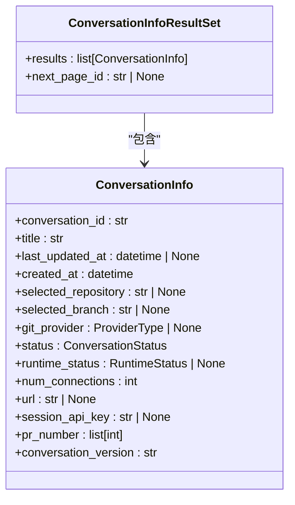
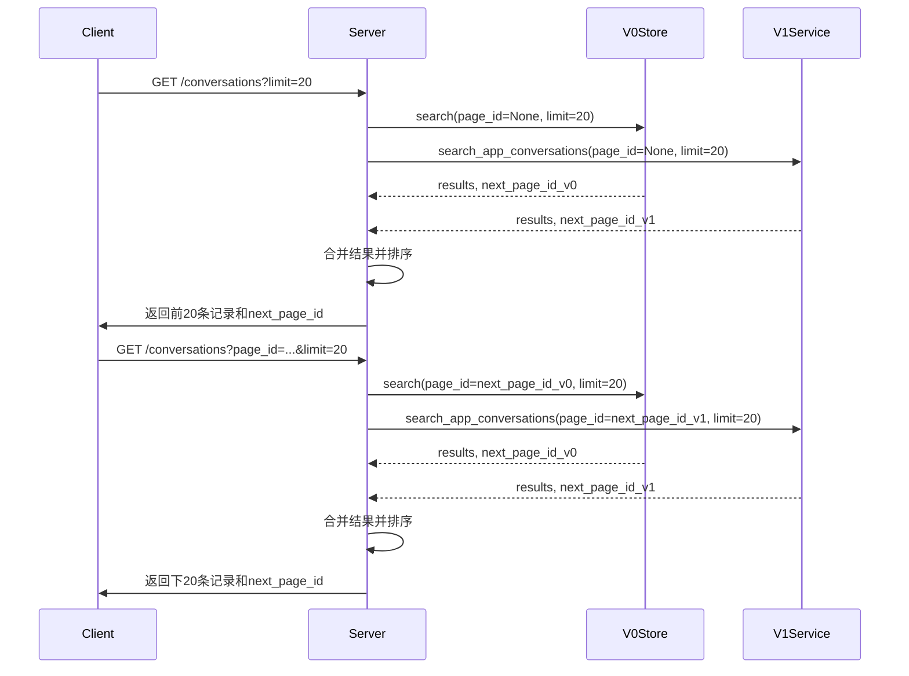
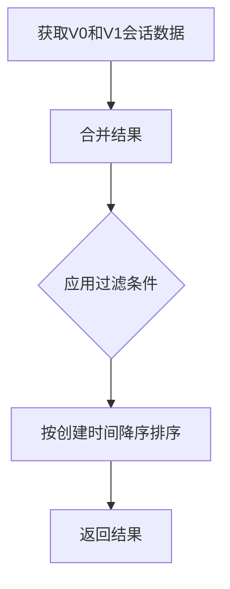
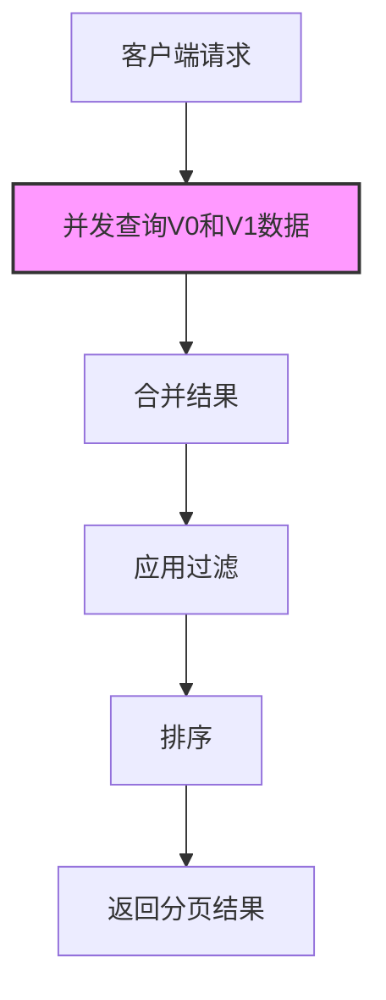
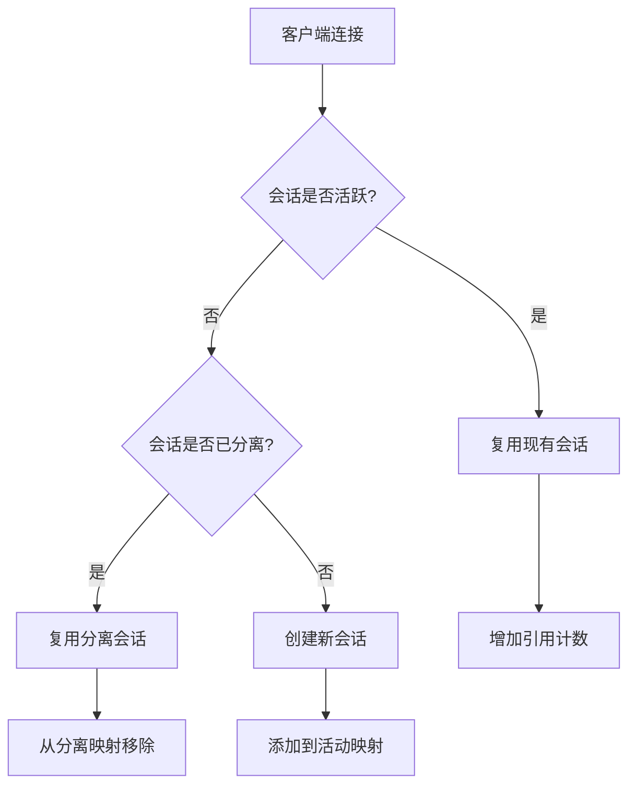
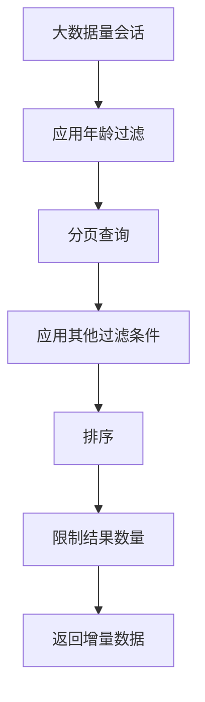

# 会话查询

<cite>
**本文档引用的文件**
- [manage_conversations.py](file://openhands/server/routes/manage_conversations.py)
- [conversation_info.py](file://openhands/server/data_models/conversation_info.py)
- [conversation_info_result_set.py](file://openhands/server/data_models/conversation_info_result_set.py)
- [conversation_metadata.py](file://openhands/storage/data_models/conversation_metadata.py)
- [conversation_status.py](file://openhands/storage/data_models/conversation_status.py)
- [agent_loop_info.py](file://openhands/server/data_models/agent_loop_info.py)
- [standalone_conversation_manager.py](file://openhands/server/conversation_manager/standalone_conversation_manager.py)
- [conversation-service.api.ts](file://frontend/src/api/conversation-service/conversation-service.api.ts)
- [use-search-conversations.ts](file://frontend/src/hooks/query/use-search-conversations.ts)
- [use-batch-app-conversations.ts](file://frontend/src/hooks/query/use-batch-app-conversations.ts)
- [conversation-status.ts](file://frontend/src/types/conversation-status.ts)
</cite>

## 目录
1. [简介](#简介)
2. [会话查询端点](#会话查询端点)
3. [响应格式](#响应格式)
4. [分页查询](#分页查询)
5. [过滤和排序](#过滤和排序)
6. [性能优化策略](#性能优化策略)
7. [缓存机制](#缓存机制)
8. [大数据量处理](#大数据量处理)
9. [使用示例](#使用示例)
10. [结论](#结论)

## 简介

会话查询功能是系统的核心组件之一，用于获取会话信息和状态。该功能支持通过REST API端点查询单个会话或会话列表，提供详细的会话元数据、当前状态、执行进度等信息。系统实现了分页查询、过滤和排序功能，以支持大规模会话数据的高效检索。前端通过React Query等工具实现了数据缓存和状态管理，提升了用户体验。

**Section sources**
- [manage_conversations.py](file://openhands/server/routes/manage_conversations.py#L1-L1436)
- [conversation-service.api.ts](file://frontend/src/api/conversation-service/conversation-service.api.ts#L1-L398)

## 会话查询端点

系统提供了两个主要的会话查询端点：`GET /conversations/{id}`用于获取单个会话的详细信息，`GET /conversations`用于获取会话列表。

`GET /conversations/{id}`端点根据会话ID查询特定会话的详细信息。该端点首先尝试查询V1版本的会话（基于UUID），如果失败则查询V0版本的会话。查询结果包含会话的元数据、当前状态、连接数等信息。

`GET /conversations`端点用于查询会话列表，支持分页、过滤和排序功能。该端点同时查询V0和V1版本的会话数据，然后合并结果并按创建时间降序排列。查询参数包括`page_id`（分页标识符）、`limit`（返回结果数量）、`selected_repository`（仓库过滤）和`conversation_trigger`（触发方式过滤）。

```mermaid
flowchart TD
A[客户端请求] --> B{请求类型}
B --> |GET /conversations/{id}| C[查询单个会话]
B --> |GET /conversations| D[查询会话列表]
C --> E[尝试查询V1会话]
E --> F{查询成功?}
F --> |是| G[返回V1会话信息]
F --> |否| H[查询V0会话]
H --> I[返回V0会话信息]
D --> J[查询V0会话分页数据]
D --> K[查询V1会话分页数据]
J --> L[合并V0和V1结果]
K --> L
L --> M[应用过滤条件]
M --> N[按创建时间排序]
N --> O[返回分页结果]
```

**Diagram sources**
- [manage_conversations.py](file://openhands/server/routes/manage_conversations.py#L433-L464)
- [manage_conversations.py](file://openhands/server/routes/manage_conversations.py#L301-L431)

## 响应格式

会话查询的响应格式基于`ConversationInfo`数据类，包含会话的元数据、状态和执行进度等信息。

### 单个会话响应

`GET /conversations/{id}`端点返回`ConversationInfo`对象，主要字段包括：

- `conversation_id`: 会话唯一标识符
- `title`: 会话标题
- `last_updated_at`: 最后更新时间
- `created_at`: 创建时间
- `selected_repository`: 选中的仓库
- `selected_branch`: 选中的分支
- `git_provider`: Git提供商
- `status`: 会话状态
- `runtime_status`: 运行时状态
- `num_connections`: 连接数
- `url`: 会话URL
- `session_api_key`: 会话API密钥
- `pr_number`: 关联的PR编号列表
- `conversation_version`: 会话版本

### 会话列表响应

`GET /conversations`端点返回`ConversationInfoResultSet`对象，包含以下字段：

- `results`: 会话信息列表，每个元素为`ConversationInfo`对象
- `next_page_id`: 下一页的分页标识符，用于获取后续页面的数据



**Diagram sources**
- [conversation_info.py](file://openhands/server/data_models/conversation_info.py#L10-L31)
- [conversation_info_result_set.py](file://openhands/server/data_models/conversation_info_result_set.py#L6-L10)

## 分页查询

系统实现了高效的分页查询机制，支持大规模会话数据的分批加载。分页查询通过`page_id`参数实现，该参数是一个Base64编码的JSON字符串，包含V0和V1版本会话的分页信息。

### 分页机制

分页查询的核心逻辑在`search_conversations`函数中实现。该函数首先解析`page_id`参数，提取V0和V1版本的分页标识符。然后分别查询两个版本的会话数据，合并结果后返回指定数量的记录。

对于V0版本的会话，分页基于`conversation_store.search`方法，该方法返回`ConversationInfoResultSet`对象，包含结果列表和下一页标识符。对于V1版本的会话，分页基于`app_conversation_service.search_app_conversations`方法，返回`AppConversationPage`对象。

### 分页标识符

分页标识符`page_id`是一个Base64编码的JSON字符串，结构如下：
```json
{
  "v0": "v0_page_id",
  "v1": "v1_page_id"
}
```

当客户端首次查询时，`page_id`为`null`。服务器返回结果时，会生成包含V0和V1版本下一页标识符的`next_page_id`。客户端在查询下一页时，将`next_page_id`作为`page_id`参数传递。



**Diagram sources**
- [manage_conversations.py](file://openhands/server/routes/manage_conversations.py#L301-L431)
- [manage_conversations.py](file://openhands/server/routes/manage_conversations.py#L314-L323)

## 过滤和排序

系统支持多种过滤和排序功能，帮助用户快速定位特定的会话。

### 过滤功能

会话查询支持以下过滤条件：

- `selected_repository`: 按选中的仓库过滤
- `conversation_trigger`: 按触发方式过滤

过滤操作在服务端完成。系统首先从V0和V1存储中获取分页数据，然后在内存中应用过滤条件。对于仓库过滤，系统比较`selected_repository`字段；对于触发方式过滤，系统比较`trigger`字段。

```python
def apply_filters(conversations: list[ConversationInfo]) -> list[ConversationInfo]:
    filtered = []
    for conversation in conversations:
        # 应用仓库过滤
        if (selected_repository is not None and 
            conversation.selected_repository != selected_repository):
            continue
            
        # 应用触发方式过滤
        if (conversation_trigger is not None and 
            conversation.trigger != conversation_trigger):
            continue
            
        filtered.append(conversation)
    return filtered
```

### 排序功能

会话列表默认按创建时间降序排列（最新会话优先）。排序操作在合并V0和V1结果后执行：

```python
all_conversations.sort(
    key=lambda x: x.created_at or datetime.min.replace(tzinfo=timezone.utc),
    reverse=True,
)
```

此外，V1版本的会话服务支持多种排序方式，包括：
- 按创建时间升序/降序
- 按更新时间升序/降序
- 按标题升序/降序



**Section sources**
- [manage_conversations.py](file://openhands/server/routes/manage_conversations.py#L378-L401)
- [sql_app_conversation_info_service.py](file://openhands/app_server/app_conversation/sql_app_conversation_info_service.py#L126-L138)

## 性能优化策略

系统采用了多种性能优化策略，确保会话查询在大规模数据下的高效性。

### 异步并发查询

系统使用异步编程模型，能够并发查询V0和V1版本的会话数据。通过`wait_all`函数，系统可以同时等待多个异步操作完成，减少了总的查询时间。

```python
result = ConversationInfoResultSet(
    results=await wait_all(
        _get_conversation_info(
            conversation=conversation,
            num_connections=...,
            agent_loop_info=...
        )
        for conversation in filtered_conversations
    ),
    next_page_id=next_page_id,
)
```

### 批量操作

系统支持批量获取会话信息，减少网络请求次数。前端通过`useBatchAppConversations`钩子实现批量查询：

```typescript
export const useBatchAppConversations = (ids: string[]) =>
  useQuery({
    queryKey: ["v1-batch-get-app-conversations", ids],
    queryFn: () => V1ConversationService.batchGetAppConversations(ids),
    enabled: ids.length > 0,
    staleTime: 1000 * 60 * 5, // 5 minutes
    gcTime: 1000 * 60 * 15, // 15 minutes
  });
```

### 数据库查询优化

V1版本的会话服务在数据库层面实现了查询优化。通过SQL查询的`ORDER BY`和`LIMIT`子句，数据库可以直接返回排序后的分页数据，避免了在应用层进行大规模数据排序。

```python
if sort_order == AppConversationSortOrder.CREATED_AT:
    query = query.order_by(StoredConversationMetadata.created_at)
elif sort_order == AppConversationSortOrder.CREATED_AT_DESC:
    query = query.order_by(StoredConversationMetadata.created_at.desc())
```



**Section sources**
- [manage_conversations.py](file://openhands/server/routes/manage_conversations.py#L135-L180)
- [use-batch-app-conversations.ts](file://frontend/src/hooks/query/use-batch-app-conversations.ts#L1-L11)

## 缓存机制

系统实现了多层次的缓存机制，提升查询性能和用户体验。

### 前端缓存

前端使用React Query实现数据缓存。`useQuery`钩子自动缓存查询结果，并在指定时间内保持数据新鲜。缓存策略包括：

- `staleTime`: 数据新鲜时间（5分钟）
- `gcTime`: 数据垃圾回收时间（15分钟）
- `enabled`: 查询启用条件

```typescript
export const useSearchConversations = (
  selectedRepository?: string,
  conversationTrigger?: string,
  limit: number = 100,
  cacheDisabled: boolean = false,
) =>
  useQuery({
    queryKey: [
      "conversations",
      "search",
      selectedRepository,
      conversationTrigger,
      limit,
    ],
    queryFn: () =>
      ConversationService.searchConversations(
        selectedRepository,
        conversationTrigger,
        limit,
      ),
    enabled: true,
    staleTime: cacheDisabled ? 0 : 1000 * 60 * 5,
    gcTime: cacheDisabled ? 0 : 1000 * 60 * 15,
  });
```

### 服务端缓存

服务端通过连接管理和会话复用实现缓存。`StandaloneConversationManager`维护活动会话的映射，避免重复创建会话实例。

```python
class StandaloneConversationManager(ConversationManager):
    _active_conversations: dict[str, tuple[ServerConversation, int]] = field(
        default_factory=dict
    )
    _detached_conversations: dict[str, tuple[ServerConversation, float]] = field(
        default_factory=dict
    )
```

当客户端连接到会话时，系统首先检查是否有活动的会话实例可以复用。如果没有，则创建新的会话实例并添加到活动会话映射中。



**Section sources**
- [use-search-conversations.ts](file://frontend/src/hooks/query/use-search-conversations.ts#L1-L27)
- [standalone_conversation_manager.py](file://openhands/server/conversation_manager/standalone_conversation_manager.py#L52-L77)

## 大数据量处理

系统针对大数据量场景进行了专门优化，确保在海量会话数据下的查询性能。

### 年龄过滤

系统支持会话年龄过滤，通过`conversation_max_age_seconds`配置项限制返回会话的最大年龄。这有助于减少查询结果集的大小，提高查询效率。

```python
def _filter_conversations_by_age(
    conversations: list[ConversationMetadata], max_age_seconds: int
) -> list:
    now = datetime.now(timezone.utc)
    filtered_results = []

    for conversation in conversations:
        if not hasattr(conversation, 'created_at'):
            continue

        age_seconds = (
            now - conversation.created_at.replace(tzinfo=timezone.utc)
        ).total_seconds()
        if age_seconds > max_age_seconds:
            continue

        filtered_results.append(conversation)

    return filtered_results
```

### 限制结果数量

系统通过`limit`参数限制返回结果的数量，默认值为20。这防止了一次性返回过多数据，导致网络传输和内存消耗过大。

```python
# 限制到请求的结果数量
final_results = all_conversations[:limit]
```

### 增量加载

系统采用增量加载策略，客户端通过分页标识符`page_id`逐步加载更多数据。这种策略避免了一次性加载所有数据，降低了内存压力。

### 数据库索引

V1版本的会话服务在数据库层面创建了适当的索引，加速查询操作。例如，在`created_at`、`last_updated_at`和`title`字段上创建索引，支持高效的排序和过滤操作。



**Section sources**
- [manage_conversations.py](file://openhands/server/routes/manage_conversations.py#L104-L132)
- [manage_conversations.py](file://openhands/server/routes/manage_conversations.py#L411-L412)

## 使用示例

以下是一些常见的会话查询使用示例。

### 查询特定状态的会话列表

要查询特定状态的会话列表，可以结合前端过滤功能和后端查询接口：

```typescript
// 查询运行中的会话
const runningConversations = useSearchConversations(
  undefined, // 不过滤仓库
  undefined, // 不过滤触发方式
  100, // 限制结果数量
  false // 启用缓存
);

// 在组件中使用
const runningItems = runningConversations.data?.results.filter(
  conv => conv.status === 'RUNNING'
);
```

### 获取会话详细信息

获取单个会话的详细信息：

```typescript
// 使用React Query获取会话信息
const { data: conversation } = useQuery({
  queryKey: ['conversation', conversationId],
  queryFn: () => ConversationService.getConversation(conversationId),
});

// 直接调用API
const conversation = await ConversationService.getConversation(conversationId);
```

### 监控会话执行进度

监控会话执行进度，包括状态变化和执行进度：

```typescript
// 获取会话状态
function getConversationStatusLabel(status: ConversationStatus): string {
  switch (status) {
    case "STOPPED":
      return "已停止";
    case "RUNNING":
      return "运行中";
    case "STARTING":
      return "启动中";
    case "ERROR":
      return "错误";
    case "ARCHIVED":
      return "已归档";
    default:
      return "未知";
  }
}

// 监控状态变化
const statusLabel = getConversationStatusLabel(conversation?.status);
const progress = conversation?.runtime_status 
  ? getRuntimeStatusLabel(conversation.runtime_status) 
  : '未知';
```

### 分页查询会话列表

实现分页查询会话列表：

```typescript
// 自定义分页钩子
function usePagedConversations(limit = 20) {
  const [pageId, setPageId] = useState<string | null>(null);
  const [hasMore, setHasMore] = useState(true);
  const [allConversations, setAllConversations] = useState<ConversationInfo[]>([]);

  const query = useSearchConversations(
    undefined,
    undefined,
    limit,
    false
  );

  // 处理分页逻辑
  useEffect(() => {
    if (query.data) {
      if (pageId === null) {
        // 首次加载
        setAllConversations(query.data.results);
      } else {
        // 追加新页面
        setAllConversations(prev => [...prev, ...query.data!.results]);
      }
      setHasMore(!!query.data.next_page_id);
    }
  }, [query.data, pageId]);

  const loadNextPage = () => {
    if (query.data?.next_page_id) {
      setPageId(query.data.next_page_id);
    }
  };

  return {
    conversations: allConversations,
    hasMore,
    loadNextPage,
    isLoading: query.isLoading,
  };
}
```

**Section sources**
- [conversation-status.ts](file://frontend/src/types/conversation-status.ts#L1-L6)
- [conversation-service.api.ts](file://frontend/src/api/conversation-service/conversation-service.api.ts#L197-L200)
- [use-search-conversations.ts](file://frontend/src/hooks/query/use-search-conversations.ts#L1-L27)

## 结论

会话查询功能提供了全面的API接口，支持获取会话信息和状态。系统实现了`GET /conversations/{id}`和`GET /conversations`端点，返回详细的会话元数据、当前状态和执行进度信息。分页查询通过`page_id`参数实现，支持大规模数据的增量加载。过滤功能支持按仓库和触发方式筛选会话，排序功能默认按创建时间降序排列。性能优化策略包括异步并发查询、批量操作和数据库查询优化。缓存机制在前端和后端都得到了实现，提升了查询效率。大数据量处理通过年龄过滤、结果数量限制和增量加载等策略确保系统稳定性。这些功能共同构成了一个高效、可扩展的会话查询系统。