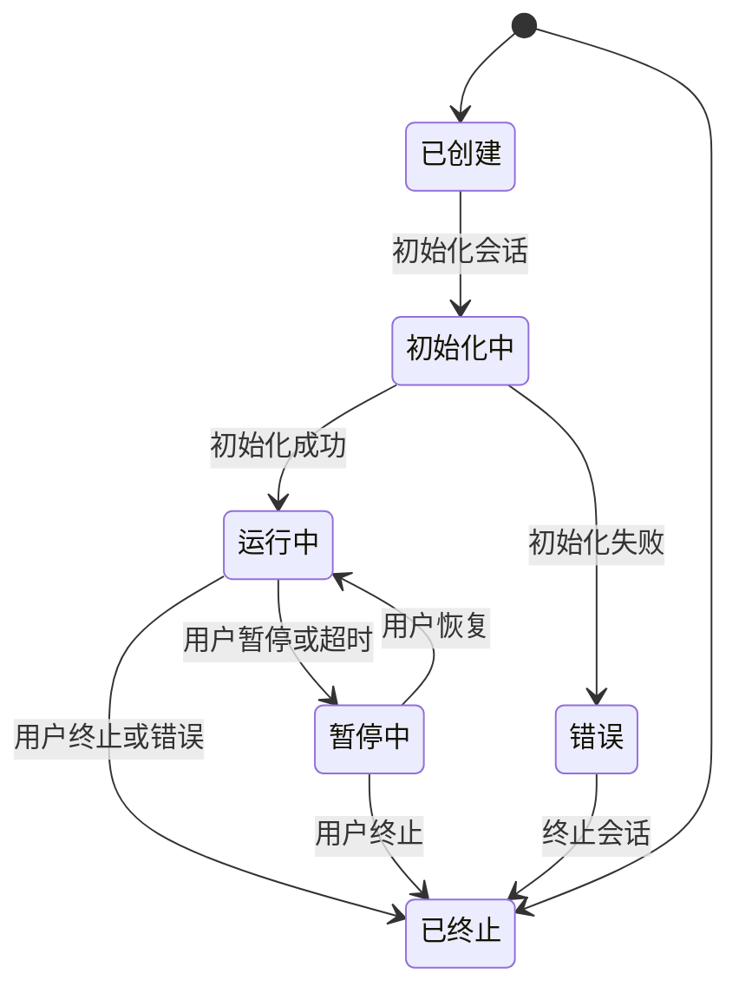
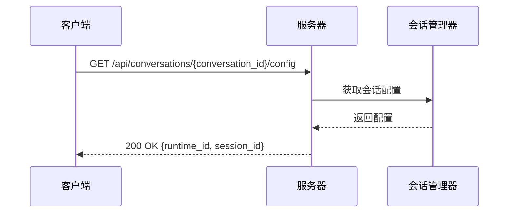
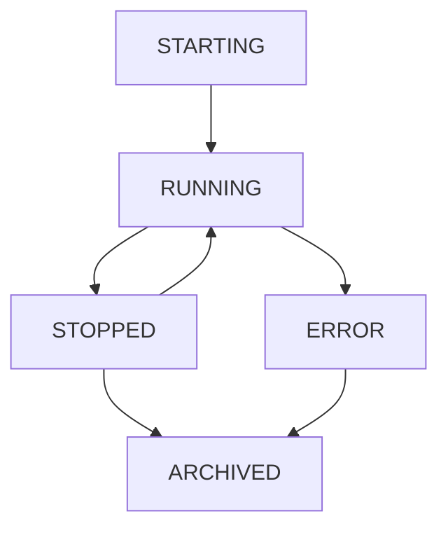
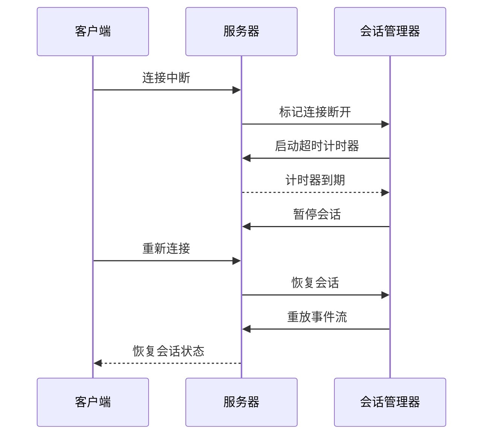
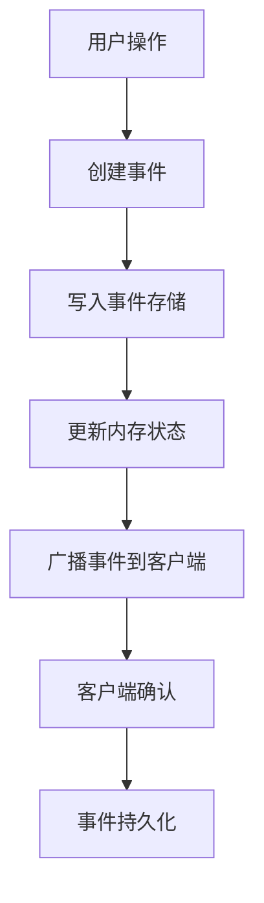

# 会话管理

<cite>
**本文档引用的文件**   
- [session.py](file://openhands/server/session/session.py#L1-L470)
- [agent_session.py](file://openhands/server/session/agent_session.py#L1-L514)
- [conversation.py](file://openhands/server/session/conversation.py#L1-L67)
- [conversation.py](file://openhands/server/routes/conversation.py#L1-L421)
- [listen_socket.py](file://openhands/server/listen_socket.py#L1-L169)
- [README.md](file://openhands/server/session/README.md#L1-L20)
- [WebSession](file://frontend/src/types/conversation-status.ts#L1-L6)
</cite>

## 目录
1. [简介](#简介)
2. [会话生命周期管理](#会话生命周期管理)
3. [API端点详细说明](#api端点详细说明)
4. [会话状态管理](#会话状态管理)
5. [超时处理与错误恢复](#超时处理与错误恢复)
6. [会话数据持久化策略](#会话数据持久化策略)
7. [安全性考虑](#安全性考虑)
8. [常见错误代码及解决方案](#常见错误代码及解决方案)

## 简介

会话管理API是OpenHands系统的核心组件，负责管理用户与AI代理之间的交互会话。该API基于Socket.IO协议实现，支持WebSocket和HTTP长轮询等多种通信方式。会话管理器负责创建、维护和终止会话，确保用户与代理之间的实时通信。

会话管理API的主要功能包括会话的创建、启动、暂停、恢复和终止。每个会话都有一个唯一的会话ID（sid），用于标识和跟踪会话状态。系统通过事件驱动架构实现客户端与服务器之间的通信，支持在连接中断后恢复会话。

**Section sources**
- [README.md](file://openhands/server/session/README.md#L1-L20)

## 会话生命周期管理

会话生命周期管理是会话管理API的核心功能，涵盖了会话从创建到终止的完整过程。会话生命周期包括创建、初始化、运行、暂停、恢复和终止等阶段。

会话的创建通过客户端连接到服务器时触发。当客户端建立连接时，服务器会创建一个新的会话实例，并分配唯一的会话ID。会话初始化阶段包括配置代理、设置运行时环境和加载会话状态等操作。

会话运行期间，系统会持续监控会话状态和用户活动。当会话处于非活动状态超过预设时间（由`config.sandbox.close_delay`配置）时，会话和运行时将被暂停（passivated），需要重新激活才能继续。



**Diagram sources**
- [session.py](file://openhands/server/session/session.py#L1-L470)
- [agent_session.py](file://openhands/server/session/agent_session.py#L1-L514)

**Section sources**
- [session.py](file://openhands/server/session/session.py#L1-L470)
- [agent_session.py](file://openhands/server/session/agent_session.py#L1-L514)

## API端点详细说明

会话管理API提供了一系列RESTful端点，用于管理会话的各个方面。这些端点遵循标准的HTTP方法和URL路径约定，支持JSON格式的请求和响应。

### 会话配置获取


**Diagram sources**
- [conversation.py](file://openhands/server/routes/conversation.py#L107-L139)

#### 获取会话配置
- **HTTP方法**: GET
- **URL路径**: `/api/conversations/{conversation_id}/config`
- **请求参数**: 
  - `conversation_id` (路径参数): 会话ID
- **响应格式**:
```json
{
  "runtime_id": "string",
  "session_id": "string"
}
```
- **成功状态码**: 200 OK
- **错误状态码**: 404 Not Found (会话不存在)

#### 获取VSCode URL
- **HTTP方法**: GET
- **URL路径**: `/api/conversations/{conversation_id}/vscode-url`
- **请求参数**: 
  - `conversation_id` (路径参数): 会话ID
- **响应格式**:
```json
{
  "vscode_url": "string"
}
```
- **成功状态码**: 200 OK
- **错误状态码**: 500 Internal Server Error (获取URL失败)

#### 获取运行时主机
- **HTTP方法**: GET
- **URL路径**: `/api/conversations/{conversation_id}/web-hosts`
- **请求参数**: 
  - `conversation_id` (路径参数): 会话ID
- **响应格式**:
```json
{
  "hosts": ["string"]
}
```
- **成功状态码**: 200 OK
- **错误状态码**: 500 Internal Server Error (获取主机失败)

#### 搜索事件
- **HTTP方法**: GET
- **URL路径**: `/api/conversations/{conversation_id}/events`
- **请求参数**: 
  - `conversation_id` (路径参数): 会话ID
  - `start_id` (查询参数, 可选): 起始事件ID，默认为0
  - `end_id` (查询参数, 可选): 结束事件ID
  - `reverse` (查询参数, 可选): 是否反向检索，默认为false
  - `filter` (查询参数, 可选): 事件过滤器
  - `limit` (查询参数, 可选): 返回事件数量限制，默认为20，最大100
- **响应格式**:
```json
{
  "events": [{}],
  "has_more": boolean
}
```
- **成功状态码**: 200 OK
- **错误状态码**: 400 Bad Request (参数无效), 404 Not Found (会话不存在)

#### 添加事件
- **HTTP方法**: POST
- **URL路径**: `/api/conversations/{conversation_id}/events`
- **请求参数**: 
  - `conversation_id` (路径参数): 会话ID
  - 请求体: 事件数据（JSON格式）
- **响应格式**:
```json
{
  "success": true
}
```
- **成功状态码**: 200 OK
- **错误状态码**: 500 Internal Server Error (添加事件失败)

#### 添加消息
- **HTTP方法**: POST
- **URL路径**: `/api/conversations/{conversation_id}/message`
- **请求参数**: 
  - `conversation_id` (路径参数): 会话ID
  - 请求体: 
```json
{
  "message": "string"
}
```
- **响应格式**:
```json
{
  "success": true
}
```
- **成功状态码**: 200 OK
- **错误状态码**: 500 Internal Server Error (添加消息失败)

#### 获取微代理
- **HTTP方法**: GET
- **URL路径**: `/api/conversations/{conversation_id}/microagents`
- **请求参数**: 
  - `conversation_id` (路径参数): 会话ID
- **响应格式**:
```json
{
  "microagents": [
    {
      "name": "string",
      "type": "string",
      "content": "string",
      "triggers": ["string"],
      "inputs": [{}],
      "tools": ["string"]
    }
  ]
}
```
- **成功状态码**: 200 OK
- **错误状态码**: 404 Not Found (会话或内存未找到), 500 Internal Server Error (获取微代理失败)

**Section sources**
- [conversation.py](file://openhands/server/routes/conversation.py#L1-L421)

## 会话状态管理

会话状态管理是确保会话正确运行的关键机制。系统定义了多种会话状态，用于跟踪会话的当前情况。会话状态包括启动中、运行中、已停止、已归档和错误等。

会话状态通过`ConversationStatus`枚举类型定义，具体包括：
- **STARTING**: 会话正在启动和初始化
- **RUNNING**: 会话正在运行，代理正在处理任务
- **STOPPED**: 会话已停止，等待用户输入
- **ARCHIVED**: 会话已归档，不再活跃
- **ERROR**: 会话发生错误

状态转换由会话管理器控制，根据用户操作和系统事件触发状态变更。例如，当用户发送新消息时，会话状态从STOPPED变为RUNNING；当代理完成任务时，状态从RUNNING变为STOPPED。



**Diagram sources**
- [WebSession](file://frontend/src/types/conversation-status.ts#L1-L6)

**Section sources**
- [WebSession](file://frontend/src/types/conversation-status.ts#L1-L6)

## 超时处理与错误恢复

超时处理和错误恢复机制确保会话系统的稳定性和可靠性。系统通过多种机制处理连接超时、会话超时和各种错误情况。

### 连接超时处理
当客户端与服务器的连接中断时，系统会尝试恢复连接。Socket.IO协议支持连接恢复功能，允许客户端在短暂中断后重新连接到同一会话。如果连接中断时间超过`config.sandbox.close_delay`配置的时间，会话将被暂停。

### 会话超时处理
会话超时由`config.sandbox.close_delay`参数控制。当会话在指定时间内没有活动时，系统会自动暂停会话和运行时。暂停的会话可以被重新激活，而无需重新创建。

### 错误恢复机制
系统实现了多层次的错误恢复机制：
1. **连接级恢复**: 使用Socket.IO的连接恢复功能
2. **会话级恢复**: 通过事件流重放恢复会话状态
3. **代理级恢复**: 代理状态持久化，支持在错误后恢复

当发生错误时，系统会记录详细的错误信息，并向客户端发送错误通知。客户端可以根据错误类型采取相应的恢复措施。



**Diagram sources**
- [listen_socket.py](file://openhands/server/listen_socket.py#L35-L159)

**Section sources**
- [listen_socket.py](file://openhands/server/listen_socket.py#L35-L159)

## 会话数据持久化策略

会话数据持久化策略确保会话状态和历史记录在系统重启或会话暂停后能够恢复。系统采用事件溯源（Event Sourcing）模式来持久化会话数据。

### 事件存储
每个会话都有一个独立的事件存储，记录会话中的所有事件。事件包括用户操作、代理响应、系统状态变更等。事件按时间顺序存储，并分配唯一的事件ID。

### 状态恢复
会话状态通过重放事件流来恢复。当会话被重新激活时，系统会从事件存储中读取所有事件，并按顺序应用到会话状态机，从而恢复到最新的状态。

### 数据存储
会话数据存储在文件存储系统中，每个会话对应一个独立的目录。目录结构如下：
```
/conversations
  /{conversation_id}
    /events.jsonl
    /state.json
    /files/
```

### 持久化流程


**Section sources**
- [session.py](file://openhands/server/session/session.py#L1-L470)
- [conversation.py](file://openhands/server/session/conversation.py#L1-L67)

## 安全性考虑

会话管理API实施了多层次的安全措施，确保会话的安全性和数据的机密性。

### 认证与授权
系统使用会话API密钥进行认证。客户端在连接时必须提供有效的会话API密钥，服务器会验证密钥的有效性。环境变量`SESSION_API_KEY`用于配置会话API密钥。

### 数据加密
敏感数据在存储时进行加密。系统使用Fernet对称加密算法，基于JWT密钥生成加密密钥。加密密钥通过SHA-256哈希JWT密钥生成，确保密钥的安全性。

### 安全分析
系统集成了安全分析器，对代理执行的操作进行安全检查。安全分析器可以检测潜在的安全风险，如文件系统操作、网络请求等，并在必要时阻止危险操作。

### 错误处理
错误处理遵循安全最佳实践，避免泄露敏感信息。错误消息经过过滤，只包含必要的信息，防止信息泄露。

**Section sources**
- [session.py](file://openhands/server/session/session.py#L1-L470)
- [saas_secrets_store.py](file://enterprise/storage/saas_secrets_store.py#L113-L129)

## 常见错误代码及解决方案

以下是会话管理API中常见的错误代码及其解决方案：

### 400 Bad Request
- **原因**: 请求参数无效或格式不正确
- **解决方案**: 检查请求参数是否符合API文档要求，确保JSON格式正确

### 401 Unauthorized
- **原因**: 会话API密钥无效或缺失
- **解决方案**: 检查`SESSION_API_KEY`环境变量配置，确保客户端提供正确的密钥

### 404 Not Found
- **原因**: 指定的会话ID不存在
- **解决方案**: 检查会话ID是否正确，确认会话是否已被删除或过期

### 429 Too Many Requests
- **原因**: 请求频率超过限制
- **解决方案**: 降低请求频率，实现请求重试机制

### 500 Internal Server Error
- **原因**: 服务器内部错误
- **解决方案**: 检查服务器日志，联系技术支持

### 连接错误
- **SESSION$SOCKET_NOT_INITIALIZED_ERROR_MESSAGE**: 套接字未初始化
  - **解决方案**: 检查服务器配置，确保Socket.IO正确初始化
- **SESSION$TIMEOUT_MESSAGE**: 会话超时
  - **解决方案**: 延长`config.sandbox.close_delay`配置时间，或实现会话保持活动机制

**Section sources**
- [i18n/translation.json](file://frontend/src/i18n/translation.json#L3913-L3946)