# WebSocket通信

<cite>
**本文档引用的文件**   
- [buildWebSocketUrl.ts](file://frontend/src/utils/websocket-url.ts)
- [use-websocket.ts](file://frontend/src/hooks/use-websocket.ts)
- [conversation-websocket-context.tsx](file://frontend/src/contexts/conversation-websocket-context.tsx)
- [listen_socket.py](file://openhands/server/listen_socket.py)
- [session.py](file://openhands/server/session/session.py)
- [shared.py](file://openhands/server/shared.py)
- [listen.py](file://openhands/server/listen.py)
- [app.py](file://openhands/server/app.py)
</cite>

## 目录
1. [引言](#引言)
2. [连接建立过程](#连接建立过程)
3. [消息帧格式](#消息帧格式)
4. [会话管理](#会话管理)
5. [连接生命周期](#连接生命周期)
6. [事件流与实时状态更新](#事件流与实时状态更新)
7. [前端代码示例](#前端代码示例)
8. [后端代码示例](#后端代码示例)
9. [异常处理](#异常处理)
10. [心跳机制与超时设置](#心跳机制与超时设置)
11. [连接恢复策略](#连接恢复策略)
12. [高并发场景下的性能优化](#高并发场景下的性能优化)
13. [结论](#结论)

## 引言

WebSocket通信在OpenHands项目中扮演着核心角色，用于实现实时的双向通信。该系统支持事件流传输和实时状态更新，为用户提供流畅的交互体验。WebSocket连接通过特定的握手协议建立，并支持子协议选择和连接升级机制。

**Section sources**
- [buildWebSocketUrl.ts](file://frontend/src/utils/websocket-url.ts#L33-L54)
- [listen_socket.py](file://openhands/server/listen_socket.py#L35-L169)

## 连接建立过程

WebSocket连接的建立过程包括前端URL构建和后端连接处理两个主要部分。

在前端，`buildWebSocketUrl`函数负责构建WebSocket连接URL。该函数接收会话ID和会话URL作为参数，根据当前页面协议（http或https）自动选择ws或wss协议，并构造最终的WebSocket连接地址。URL路径遵循`/sockets/events/{conversationId}`的模式。

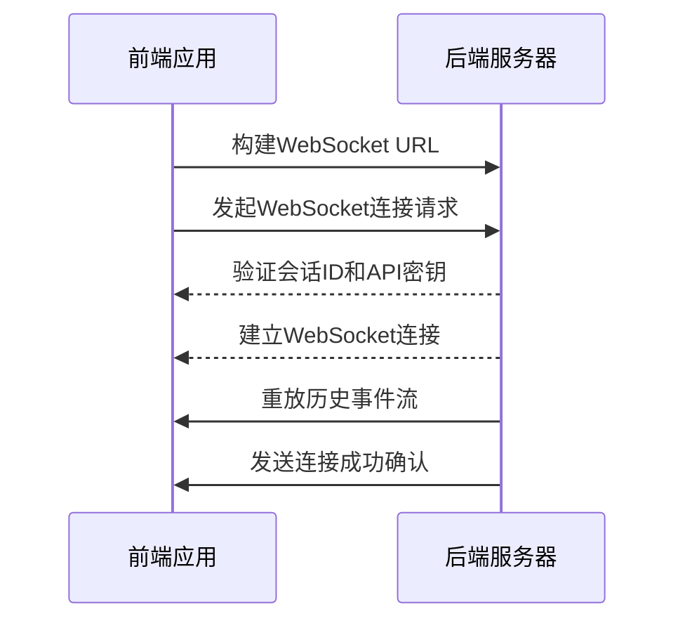

**Diagram sources**
- [buildWebSocketUrl.ts](file://frontend/src/utils/websocket-url.ts#L33-L54)
- [listen_socket.py](file://openhands/server/listen_socket.py#L35-L64)

**Section sources**
- [buildWebSocketUrl.ts](file://frontend/src/utils/websocket-url.ts#L33-L54)
- [listen_socket.py](file://openhands/server/listen_socket.py#L35-L64)

## 消息帧格式

WebSocket消息帧格式遵循标准的WebSocket协议规范。消息以JSON格式传输，包含事件类型、数据负载和元数据。

前端通过`useWebSocket`钩子处理消息收发。当接收到消息时，`onmessage`事件处理器会解析JSON数据并更新状态。消息发送时，数据会被序列化为JSON字符串并通过WebSocket连接发送。

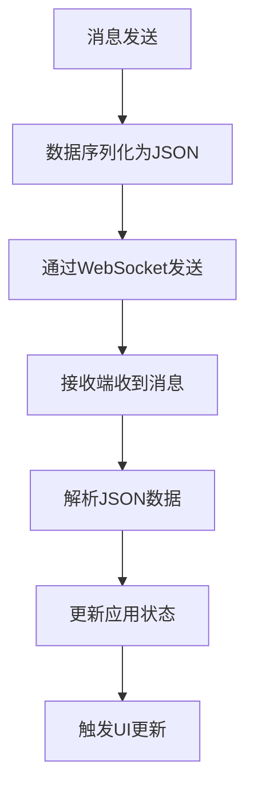

**Diagram sources**
- [use-websocket.ts](file://frontend/src/hooks/use-websocket.ts#L67-L71)
- [listen_socket.py](file://openhands/server/listen_socket.py#L108-L114)

**Section sources**
- [use-websocket.ts](file://frontend/src/hooks/use-websocket.ts#L67-L71)
- [listen_socket.py](file://openhands/server/listen_socket.py#L108-L114)

## 会话管理

会话管理通过会话ID（sid）和用户ID进行。每个WebSocket连接与特定的会话相关联，服务器使用会话ID来路由消息。

在服务器端，`WebSession`类管理会话状态，包括连接状态、最后活动时间戳和是否存活等属性。会话与`AgentSession`关联，后者协调运行时和LLM的交互。

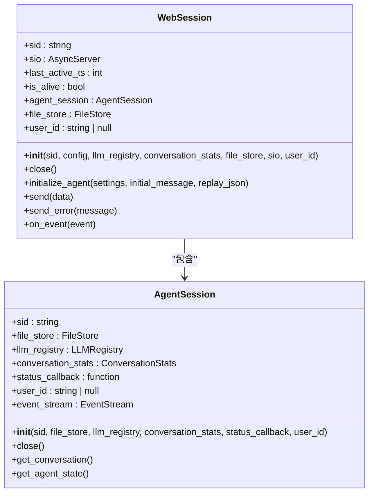

**Diagram sources**
- [session.py](file://openhands/server/session/session.py#L40-L200)
- [conversation-websocket-context.tsx](file://frontend/src/contexts/conversation-websocket-context.tsx#L40-L327)

**Section sources**
- [session.py](file://openhands/server/session/session.py#L40-L200)
- [conversation-websocket-context.tsx](file://frontend/src/contexts/conversation-websocket-context.tsx#L40-L327)

## 连接生命周期

WebSocket连接的生命周期包括连接建立、消息传输和连接关闭三个阶段。

连接建立时，服务器会验证会话ID和API密钥，然后重放历史事件流。消息传输阶段，服务器和客户端可以双向发送消息。连接关闭时，会清理相关资源并通知其他组件。

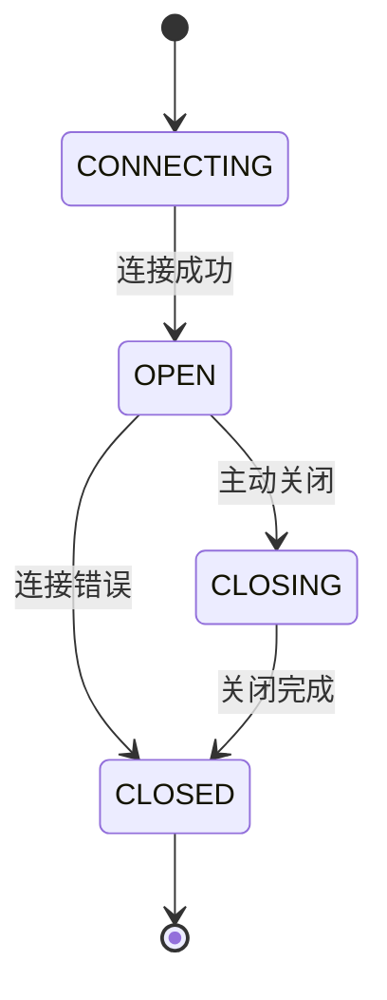

**Diagram sources**
- [listen_socket.py](file://openhands/server/listen_socket.py#L35-L159)
- [use-websocket.ts](file://frontend/src/hooks/use-websocket.ts#L59-L118)

**Section sources**
- [listen_socket.py](file://openhands/server/listen_socket.py#L35-L159)
- [use-websocket.ts](file://frontend/src/hooks/use-websocket.ts#L59-L118)

## 事件流与实时状态更新

事件流通过`oh_event`事件传输，包含各种操作和观察结果。服务器在处理完事件后，会将其广播给所有订阅该会话的客户端。

实时状态更新通过`AgentStateChangedObservation`实现，当代理状态发生变化时，服务器会发送状态更新事件。客户端根据这些事件更新UI状态。

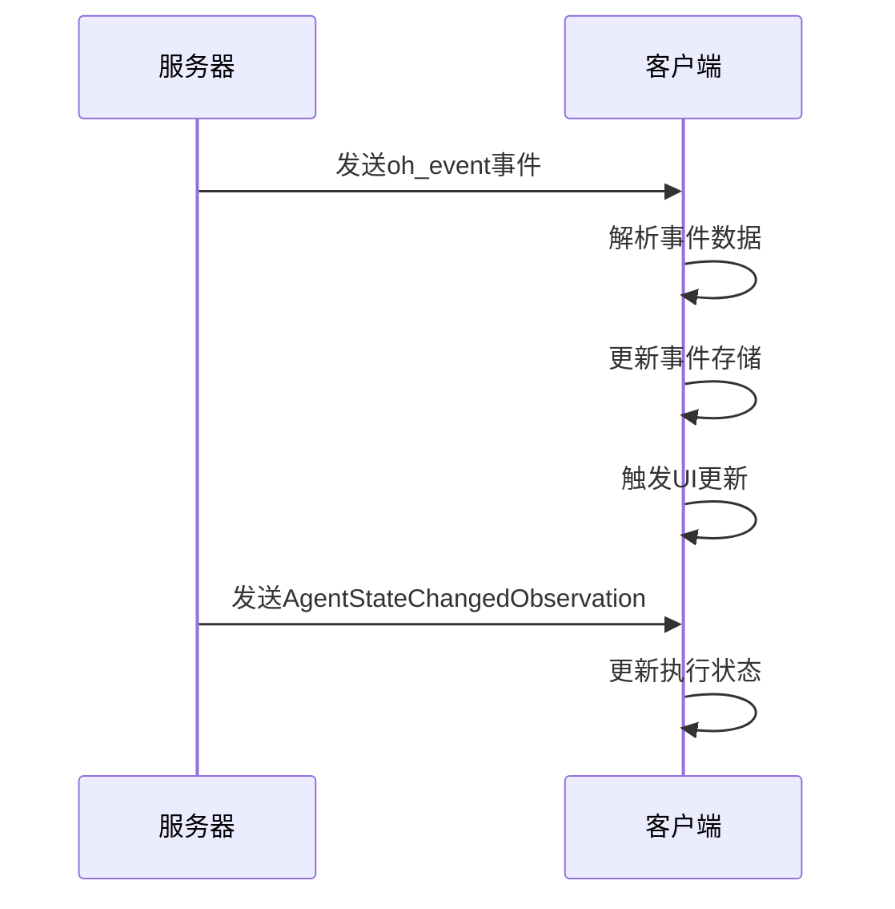

**Diagram sources**
- [listen_socket.py](file://openhands/server/listen_socket.py#L108-L114)
- [conversation-websocket-context.tsx](file://frontend/src/contexts/conversation-websocket-context.tsx#L110-L172)

**Section sources**
- [listen_socket.py](file://openhands/server/listen_socket.py#L108-L114)
- [conversation-websocket-context.tsx](file://frontend/src/contexts/conversation-websocket-context.tsx#L110-L172)

## 前端代码示例

前端使用React Hooks实现WebSocket通信。`useWebSocket`钩子封装了WebSocket的连接、消息处理和重连逻辑。

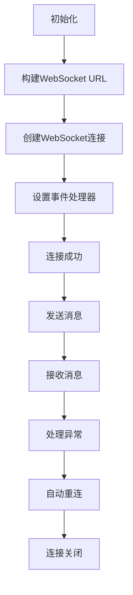

**Diagram sources**
- [use-websocket.ts](file://frontend/src/hooks/use-websocket.ts#L1-L192)
- [conversation-websocket-context.tsx](file://frontend/src/contexts/conversation-websocket-context.tsx#L80-L327)

**Section sources**
- [use-websocket.ts](file://frontend/src/hooks/use-websocket.ts#L1-L192)
- [conversation-websocket-context.tsx](file://frontend/src/contexts/conversation-websocket-context.tsx#L80-L327)

## 后端代码示例

后端使用Socket.IO实现WebSocket服务器。服务器监听连接、断开和自定义事件。

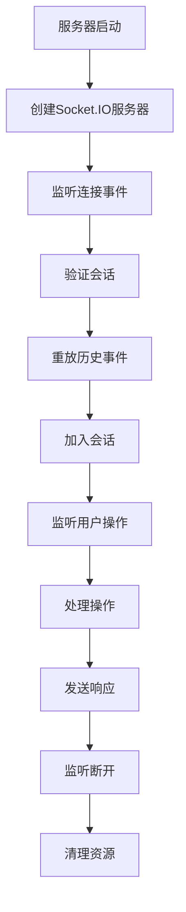

**Diagram sources**
- [listen.py](file://openhands/server/listen.py#L1-L27)
- [listen_socket.py](file://openhands/server/listen_socket.py#L35-L159)

**Section sources**
- [listen.py](file://openhands/server/listen.py#L1-L27)
- [listen_socket.py](file://openhands/server/listen_socket.py#L35-L159)

## 异常处理

异常处理机制包括连接错误、消息解析错误和业务逻辑错误的处理。

前端`useWebSocket`钩子捕获连接错误和消息错误，并提供错误回调。后端在连接验证失败时拒绝连接，并在发送数据时捕获运行时错误。

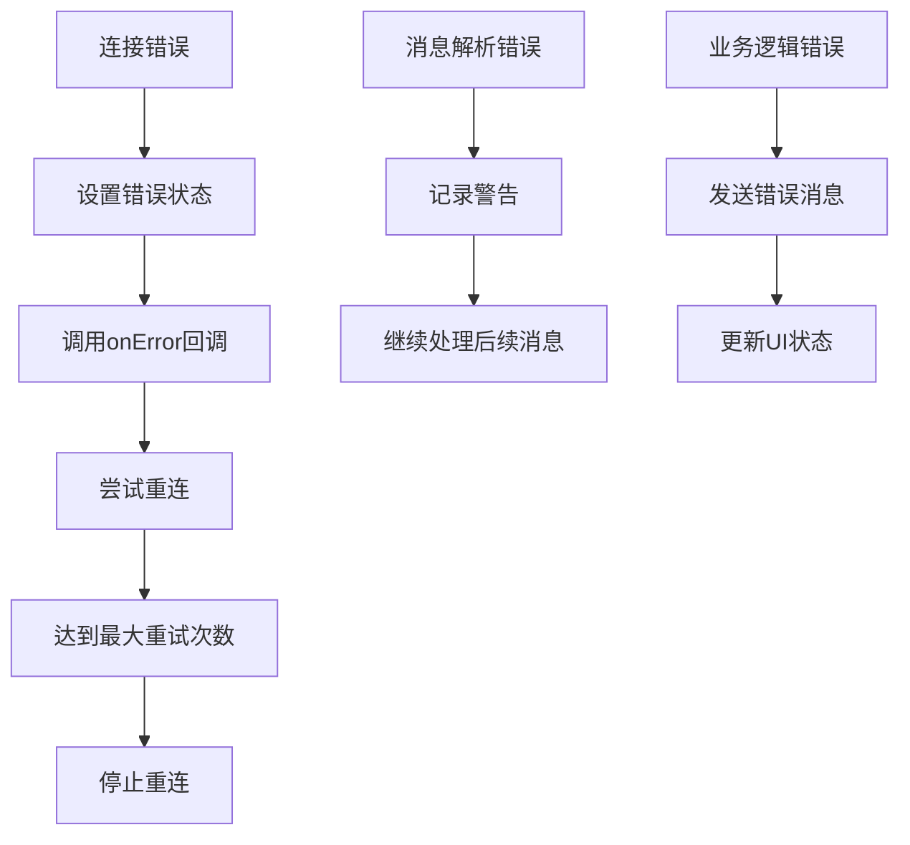

**Diagram sources**
- [use-websocket.ts](file://frontend/src/hooks/use-websocket.ts#L73-L112)
- [listen_socket.py](file://openhands/server/listen_socket.py#L137-L140)

**Section sources**
- [use-websocket.ts](file://frontend/src/hooks/use-websocket.ts#L73-L112)
- [listen_socket.py](file://openhands/server/listen_socket.py#L137-L140)

## 心跳机制与超时设置

系统通过定期发送心跳消息和设置超时来维护连接的活跃状态。

服务器配置了客户端等待超时，当没有监听客户端时会等待指定时间。前端实现连接超时检测，当连接长时间无响应时会触发重连。

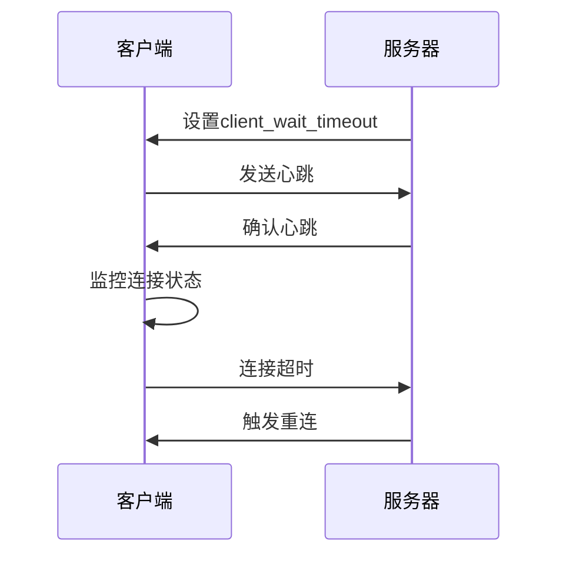

**Diagram sources**
- [session.py](file://openhands/server/session/session.py#L389-L421)
- [use-websocket.ts](file://frontend/src/hooks/use-websocket.ts#L94-L110)

**Section sources**
- [session.py](file://openhands/server/session/session.py#L389-L421)
- [use-websocket.ts](file://frontend/src/hooks/use-websocket.ts#L94-L110)

## 连接恢复策略

连接恢复策略包括自动重连和会话状态恢复。

前端`useWebSocket`钩子实现自动重连功能，当连接断开时会根据配置尝试重新连接。服务器在客户端重新连接时会重放未接收的事件，确保状态同步。

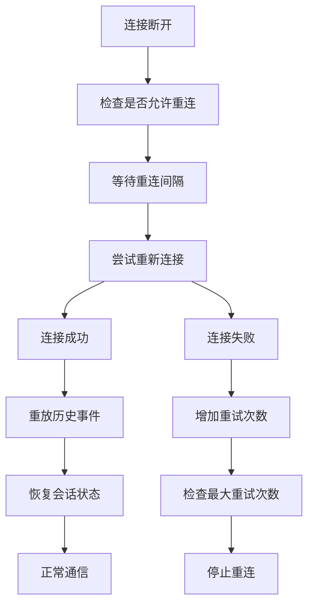

**Diagram sources**
- [use-websocket.ts](file://frontend/src/hooks/use-websocket.ts#L93-L112)
- [listen_socket.py](file://openhands/server/listen_socket.py#L94-L114)

**Section sources**
- [use-websocket.ts](file://frontend/src/hooks/use-websocket.ts#L93-L112)
- [listen_socket.py](file://openhands/server/listen_socket.py#L94-L114)

## 高并发场景下的性能优化

在高并发场景下，系统通过多种机制优化性能。

服务器使用Redis管理器处理分布式会话，支持多实例部署。配置了消息缓冲区大小，提高大文件传输性能。实现了事件流的异步处理，避免阻塞主线程。

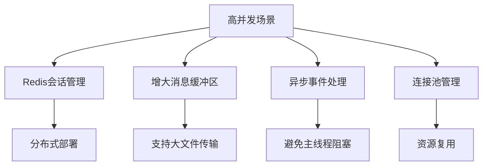

**Diagram sources**
- [shared.py](file://openhands/server/shared.py#L37-L52)
- [listen.py](file://openhands/server/listen.py#L1-L27)

**Section sources**
- [shared.py](file://openhands/server/shared.py#L37-L52)
- [listen.py](file://openhands/server/listen.py#L1-L27)

## 结论

OpenHands项目的WebSocket通信系统实现了完整的实时双向通信功能。通过精心设计的连接建立、消息传输和会话管理机制，系统能够高效地处理事件流和实时状态更新。前端和后端的协同工作确保了用户体验的流畅性，而完善的异常处理和连接恢复策略提高了系统的可靠性。在高并发场景下，通过分布式会话管理和性能优化措施，系统能够稳定运行。