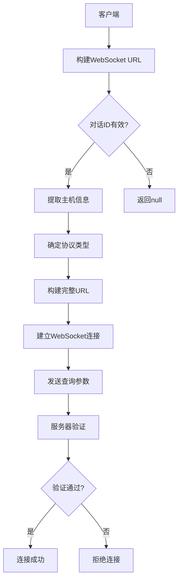
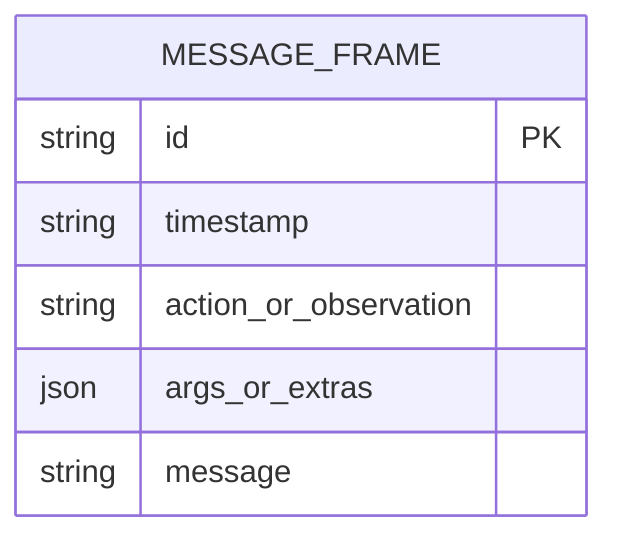
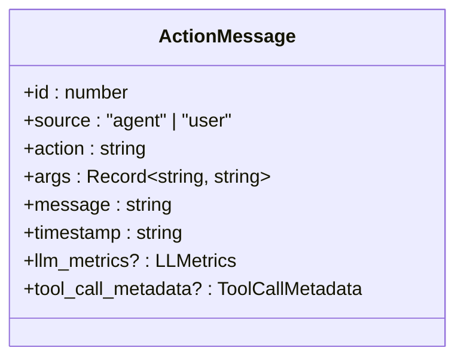
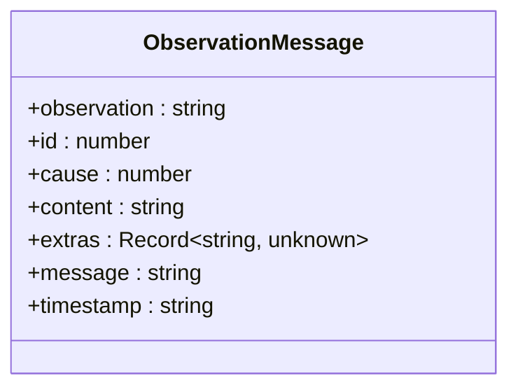
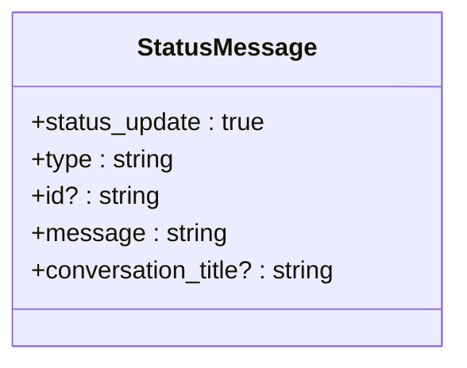
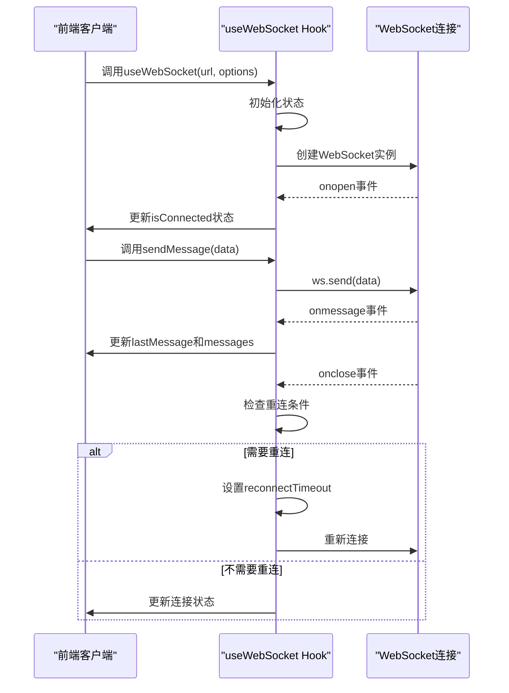
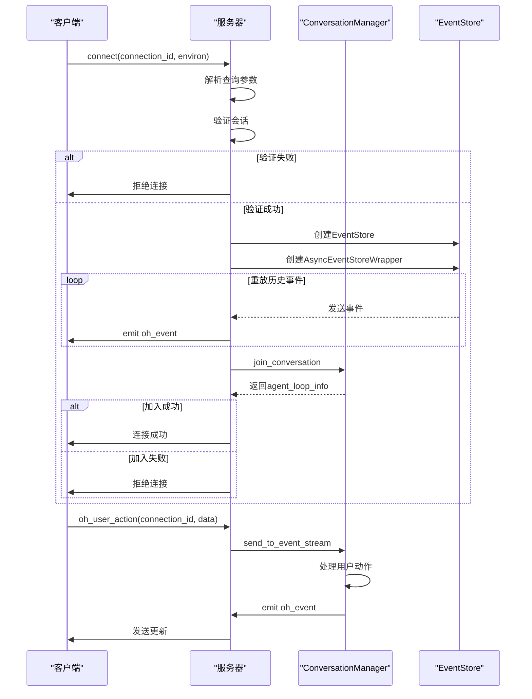
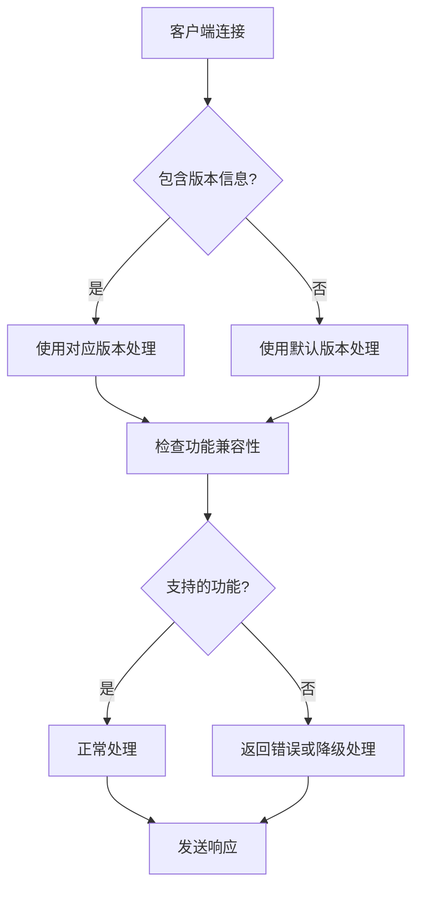
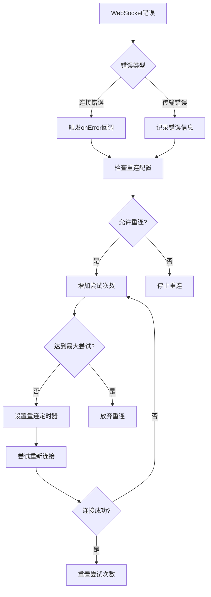
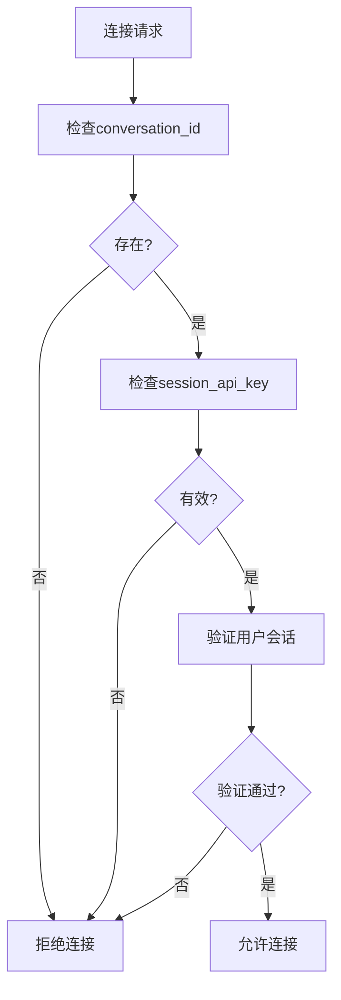

# 消息协议

<cite>
**本文档中引用的文件**  
- [listen_socket.py](file://openhands/server/listen_socket.py)
- [json.py](file://openhands/io/json.py)
- [event.py](file://openhands/events/event.py)
- [event.py](file://openhands/events/serialization/event.py)
- [message.tsx](file://frontend/src/types/message.tsx)
- [use-websocket.ts](file://frontend/src/hooks/use-websocket.ts)
- [websocket-url.ts](file://frontend/src/utils/websocket-url.ts)
</cite>

## 目录
1. [引言](#引言)
2. [WebSocket连接建立](#websocket连接建立)
3. [消息帧结构](#消息帧结构)
4. [事件序列化机制](#事件序列化机制)
5. [消息类型](#消息类型)
6. [前端消息处理](#前端消息处理)
7. [后端消息路由](#后端消息路由)
8. [协议版本管理](#协议版本管理)
9. [错误处理与重连机制](#错误处理与重连机制)
10. [安全考虑](#安全考虑)

## 引言

OpenHands系统使用WebSocket协议在客户端和服务器之间实时传输事件流。该协议支持多种类型的消息，包括动作、观察和状态更新，用于在用户界面和后端服务之间同步对话状态。本协议设计为可扩展且向后兼容，确保不同版本的客户端和服务器能够有效通信。

## WebSocket连接建立

WebSocket连接通过特定的URL模式建立，该模式遵循V1 API约定。连接URL的构建基于对话ID和服务器主机信息，使用安全的WebSocket协议（wss://）或非安全协议（ws://）取决于客户端的访问协议。



**Diagram sources**
- [websocket-url.ts](file://frontend/src/utils/websocket-url.ts)
- [listen_socket.py](file://openhands/server/listen_socket.py)

**Section sources**
- [websocket-url.ts](file://frontend/src/utils/websocket-url.ts)
- [listen_socket.py](file://openhands/server/listen_socket.py)

## 消息帧结构

WebSocket消息帧采用JSON格式进行序列化，包含标准化的字段结构。每个消息帧都遵循统一的模式，确保前后端能够正确解析和处理。

消息帧的基本结构包括：
- id: 消息的唯一标识符
- timestamp: ISO 8601格式的时间戳
- action/observation: 消息类型标识
- args/extras: 消息的参数或附加数据
- message: 可读的消息内容



**Diagram sources**
- [event.py](file://openhands/events/serialization/event.py)
- [message.tsx](file://frontend/src/types/message.tsx)

**Section sources**
- [event.py](file://openhands/events/serialization/event.py)
- [message.tsx](file://frontend/src/types/message.tsx)

## 事件序列化机制

事件序列化采用自定义的JSON编码器，能够处理特殊类型的数据，如日期时间对象和事件对象。序列化过程将复杂的Python对象转换为JSON兼容的字典结构。

```mermaid
flowchart TD
A[原始事件对象] --> B{对象类型}
B --> |datetime| C[转换为ISO格式字符串]
B --> |Event| D[调用event_to_dict]
B --> |Metrics| E[调用get()方法]
B --> |ModelResponse| F[调用model_dump()]
B --> |CmdOutputMetadata| G[调用model_dump()]
B --> |其他| H[使用默认序列化]
C --> I[序列化结果]
D --> I
E --> I
F --> I
G --> I
H --> I
```

**Diagram sources**
- [json.py](file://openhands/io/json.py)
- [event.py](file://openhands/events/serialization/event.py)

**Section sources**
- [json.py](file://openhands/io/json.py)
- [event.py](file://openhands/events/serialization/event.py)

## 消息类型

系统支持多种消息类型，每种类型都有特定的结构和用途。主要消息类型包括动作消息、观察消息和状态消息。

### 动作消息

动作消息表示用户或代理执行的操作，包含操作类型和相关参数。



**Diagram sources**
- [message.tsx](file://frontend/src/types/message.tsx)

### 观察消息

观察消息表示系统对环境的观察结果，如命令执行输出或文件系统变化。



**Diagram sources**
- [message.tsx](file://frontend/src/types/message.tsx)

### 状态消息

状态消息用于传递系统状态更新，如对话状态变化或连接状态。



**Diagram sources**
- [message.tsx](file://frontend/src/types/message.tsx)

**Section sources**
- [message.tsx](file://frontend/src/types/message.tsx)

## 前端消息处理

前端使用自定义的WebSocket Hook来管理连接和消息处理。该Hook提供了连接状态管理、消息接收和发送功能。



**Diagram sources**
- [use-websocket.ts](file://frontend/src/hooks/use-websocket.ts)

**Section sources**
- [use-websocket.ts](file://frontend/src/hooks/use-websocket.ts)

## 后端消息路由

后端使用Socket.IO框架处理WebSocket连接和消息路由。连接建立时，服务器会验证会话并重放历史事件流。



**Diagram sources**
- [listen_socket.py](file://openhands/server/listen_socket.py)

**Section sources**
- [listen_socket.py](file://openhands/server/listen_socket.py)

## 协议版本管理

系统通过查询参数和向后兼容的设计来管理协议版本。旧版本的客户端可以继续使用已弃用的接口，同时新功能在新版本中引入。



**Section sources**
- [listen_socket.py](file://openhands/server/listen_socket.py)

## 错误处理与重连机制

系统实现了健壮的错误处理和自动重连机制，确保在网络不稳定的情况下仍能保持连接。



**Diagram sources**
- [use-websocket.ts](file://frontend/src/hooks/use-websocket.ts)

**Section sources**
- [use-websocket.ts](file://frontend/src/hooks/use-websocket.ts)

## 安全考虑

协议实现包含多项安全措施，包括会话验证、API密钥检查和连接授权。



**Section sources**
- [listen_socket.py](file://openhands/server/listen_socket.py)