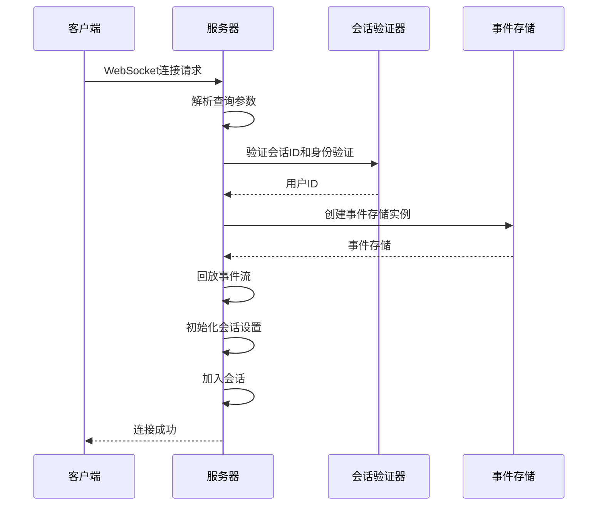
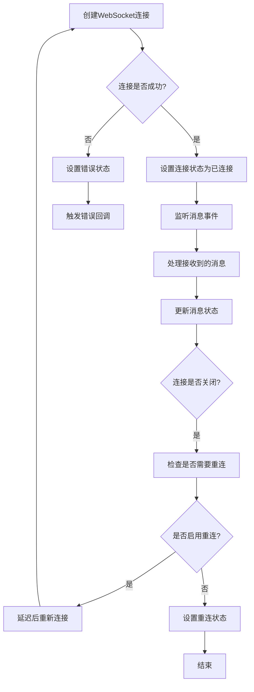
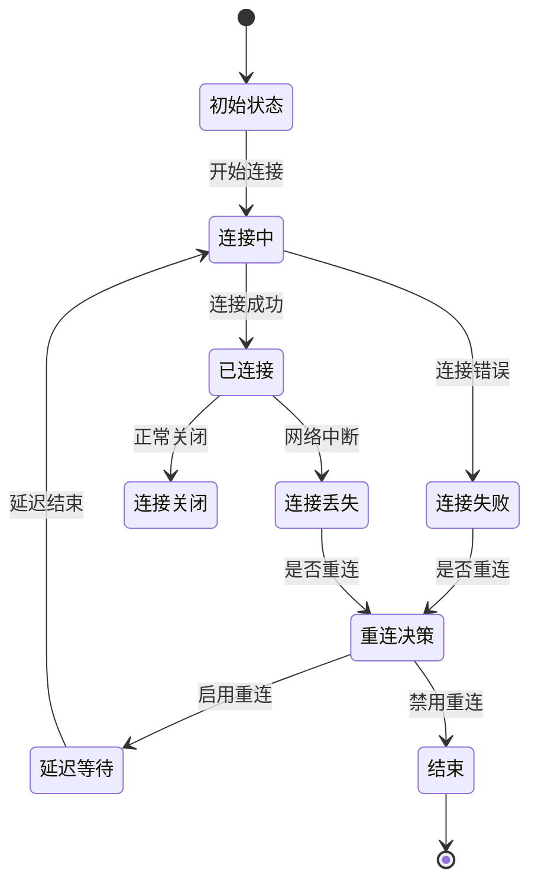
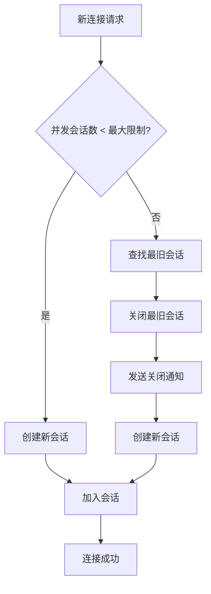

# 连接管理

<cite>
**本文档中引用的文件**  
- [listen_socket.py](file://openhands/server/listen_socket.py)
- [session.py](file://openhands/server/session/session.py)
- [event-service.api.ts](file://frontend/src/api/event-service/event-service.api.ts)
- [use-websocket.ts](file://frontend/src/hooks/use-websocket.ts)
- [websocket-url.ts](file://frontend/src/utils/websocket-url.ts)
- [shared.py](file://openhands/server/shared.py)
</cite>

## 目录
1. [连接生命周期管理](#连接生命周期管理)
2. [后端WebSocket路由处理](#后端websocket路由处理)
3. [前端连接管理](#前端连接管理)
4. [连接超时与心跳检测](#连接超时与心跳检测)
5. [异常断开恢复策略](#异常断开恢复策略)
6. [高并发连接池优化](#高并发连接池优化)

## 连接生命周期管理

WebSocket连接的生命周期包括连接建立、会话维护和连接终止三个阶段。系统通过Socket.IO协议实现客户端与服务器的双向通信，确保即使在短暂的连接中断后也能恢复。

连接建立时，客户端通过WebSocket URL连接到服务器，服务器验证会话参数和身份验证信息。会话维护期间，服务器通过事件流与客户端保持通信，传输代理状态和操作观察结果。连接终止时，系统会清理相关资源，并在无活动连接一段时间后停用会话。

**Section sources**
- [listen_socket.py](file://openhands/server/listen_socket.py#L35-L169)
- [session.py](file://openhands/server/session/session.py#L40-L470)

## 后端WebSocket路由处理

后端使用FastAPI框架处理WebSocket握手请求，通过Socket.IO事件处理器管理连接生命周期。`connect`事件处理器负责处理新的连接请求，验证会话参数和身份验证信息。



**Diagram sources**
- [listen_socket.py](file://openhands/server/listen_socket.py#L35-L169)

**Section sources**
- [listen_socket.py](file://openhands/server/listen_socket.py#L35-L169)
- [shared.py](file://openhands/server/shared.py#L46-L52)

## 前端连接管理

前端通过`event-service.api.ts`和`use-websocket.ts`文件建立和管理WebSocket连接。`use-websocket`钩子封装了WebSocket连接的创建、消息处理和连接状态监控。



**Diagram sources**
- [use-websocket.ts](file://frontend/src/hooks/use-websocket.ts#L1-L193)

**Section sources**
- [event-service.api.ts](file://frontend/src/api/event-service/event-service.api.ts#L1-L51)
- [use-websocket.ts](file://frontend/src/hooks/use-websocket.ts#L1-L193)
- [websocket-url.ts](file://frontend/src/utils/websocket-url.ts#L1-L55)

## 连接超时与心跳检测

系统实现了连接超时机制和心跳检测来确保连接的稳定性。后端配置了客户端等待超时时间，前端实现了连接状态监控。

后端在`session.py`中配置了客户端等待超时：
```python
client_wait_timeout = self.config.client_wait_timeout
```

前端通过WebSocket的`onopen`、`onmessage`和`onclose`事件处理程序监控连接状态，并在连接断开时根据配置决定是否重连。

**Section sources**
- [session.py](file://openhands/server/session/session.py#L389-L411)
- [use-websocket.ts](file://frontend/src/hooks/use-websocket.ts#L73-L113)

## 异常断开恢复策略

系统实现了完善的异常断开恢复策略，包括自动重连机制和会话状态恢复。当连接异常断开时，前端会根据配置尝试重新连接。

前端重连机制的关键配置：
- 重连启用标志
- 最大重试次数
- 重连延迟时间（默认3秒）

后端在会话管理中保持会话状态，即使连接断开，会话数据仍然保留，重新连接时可以恢复之前的会话状态。



**Diagram sources**
- [use-websocket.ts](file://frontend/src/hooks/use-websocket.ts#L73-L113)

**Section sources**
- [use-websocket.ts](file://frontend/src/hooks/use-websocket.ts#L73-L113)
- [session.py](file://openhands/server/session/session.py#L119-L131)

## 高并发连接池优化

系统通过会话管理和连接池优化来处理高并发场景。后端配置了最大并发会话数，当达到上限时会关闭最旧的会话。



系统还使用Redis作为Socket.IO的客户端管理器，支持分布式部署和会话共享：
```python
client_manager = socketio.AsyncRedisManager(
    f'redis://{redis_host}',
    redis_options={'password': os.environ.get('REDIS_PASSWORD')},
)
```

**Diagram sources**
- [standalone_conversation_manager.py](file://openhands/server/conversation_manager/standalone_conversation_manager.py#L317-L338)

**Section sources**
- [standalone_conversation_manager.py](file://openhands/server/conversation_manager/standalone_conversation_manager.py#L317-L338)
- [shared.py](file://openhands/server/shared.py#L37-L43)