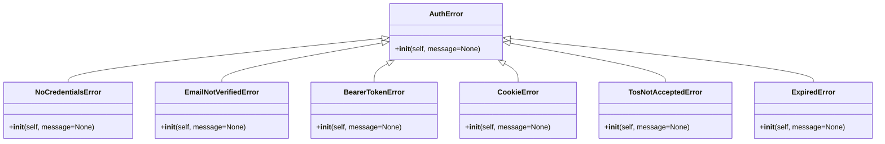

# 错误处理

<cite>
**本文档引用的文件**
- [use-websocket.ts](file://frontend/src/hooks/use-websocket.ts)
- [session.py](file://openhands/server/session/session.py)
- [listen_socket.py](file://openhands/server/listen_socket.py)
- [ws-client-provider.tsx](file://frontend/src/context/ws-client-provider.tsx)
- [use-handle-ws-events.ts](file://frontend/src/hooks/use-handle-ws-events.ts)
- [use-v0-handle-ws-events.ts](file://frontend/src/hooks/use-v0-handle-ws-events.ts)
- [event-logger.ts](file://frontend/src/utils/event-logger.ts)
- [auth_error.py](file://enterprise/server/auth/auth_error.py)
</cite>

## 目录
1. [引言](#引言)
2. [WebSocket连接异常处理](#websocket连接异常处理)
3. [消息传输错误处理](#消息传输错误处理)
4. [协议违规处理](#协议违规处理)
5. [后端异常捕获与分类](#后端异常捕获与分类)
6. [前端错误处理流程](#前端错误处理流程)
7. [错误日志记录与监控告警](#错误日志记录与监控告警)
8. [分布式环境下的错误追踪](#分布式环境下的错误追踪)
9. [结论](#结论)

## 引言
本文档详细描述了OpenHands项目中WebSocket通信的错误处理机制。文档重点分析了连接异常、消息传输错误和协议违规的处理方式，涵盖了后端如何捕获和分类各类异常，以及前端如何进行错误处理、用户提示和自动恢复。同时，文档还介绍了错误日志记录、监控告警和故障诊断工具的集成方法，以及在分布式环境下的错误追踪策略。

## WebSocket连接异常处理

WebSocket连接异常处理机制在前端和后端都有详细的实现。前端通过`useWebSocket` Hook管理连接状态和错误处理，而后端通过Socket.IO事件处理器处理连接和认证问题。

前端的`useWebSocket` Hook实现了自动重连机制，当连接关闭且状态码不是1000（正常关闭）时，会设置错误状态并尝试重新连接。重连尝试次数和延迟时间可以通过配置进行控制。

**Diagram sources**
- [use-websocket.ts](file://frontend/src/hooks/use-websocket.ts#L37-L156)

**Section sources**
- [use-websocket.ts](file://frontend/src/hooks/use-websocket.ts#L1-L193)

## 消息传输错误处理

消息传输错误处理主要在后端实现，当向WebSocket客户端发送数据时发生错误，系统会记录错误日志并标记会话为非活动状态。

后端在`session.py`文件中的`send`方法实现了消息发送功能，当发送数据时捕获到`RuntimeError`异常，会记录错误日志并将会话标记为非活动状态。

**Diagram sources**
- [session.py](file://openhands/server/session/session.py#L413-L430)

**Section sources**
- [session.py](file://openhands/server/session/session.py#L413-L434)

## 协议违规处理

协议违规处理主要在后端的Socket.IO连接事件处理器中实现。当客户端尝试连接时，系统会验证查询参数、API密钥和用户身份验证信息，如果任何一项验证失败，连接将被拒绝。

后端在`listen_socket.py`文件中的`connect`事件处理器实现了协议违规处理，包括验证会话API密钥、用户身份验证和会话ID等。

**Diagram sources**
- [listen_socket.py](file://openhands/server/listen_socket.py#L35-L169)

**Section sources**
- [listen_socket.py](file://openhands/server/listen_socket.py#L1-L169)

## 后端异常捕获与分类

后端异常捕获与分类机制主要通过自定义异常类和错误处理函数实现。系统定义了多种认证相关的异常类型，并在连接处理过程中捕获和分类这些异常。

在`auth_error.py`文件中，系统定义了多个继承自`AuthError`的异常类，用于表示不同类型的认证错误。

**Diagram sources**
- [auth_error.py](file://enterprise/server/auth/auth_error.py#L1-L40)

**Section sources**
- [auth_error.py](file://enterprise/server/auth/auth_error.py#L1-L40)

## 前端错误处理流程

前端错误处理流程通过多个组件和Hook协同工作，实现了错误状态管理、用户提示和自动恢复功能。

前端使用`useWebSocket` Hook管理WebSocket连接状态和错误，`useHandleWSEvents` Hook处理来自WebSocket的错误事件，并根据错误类型显示相应的用户提示。

**Diagram sources**
- [use-websocket.ts](file://frontend/src/hooks/use-websocket.ts#L73-L113)
- [use-handle-ws-events.ts](file://frontend/src/hooks/use-handle-ws-events.ts#L1-L48)
- [use-v0-handle-ws-events.ts](file://frontend/src/hooks/use-v0-handle-ws-events.ts#L1-L48)

**Section sources**
- [use-websocket.ts](file://frontend/src/hooks/use-websocket.ts#L1-L193)
- [use-handle-ws-events.ts](file://frontend/src/hooks/use-handle-ws-events.ts#L1-L48)
- [use-v0-handle-ws-events.ts](file://frontend/src/hooks/use-v0-handle-ws-events.ts#L1-L48)

## 错误日志记录与监控告警

错误日志记录与监控告警机制通过前端和后端的日志记录功能实现。前端在开发模式下记录WebSocket事件和错误，后端使用标准日志记录器记录错误信息。

前端的`EventLogger`类实现了开发模式下的事件和错误记录功能，而后端使用`openhands.core.logger`记录错误信息。

**Diagram sources**
- [event-logger.ts](file://frontend/src/utils/event-logger.ts#L1-L51)
- [session.py](file://openhands/server/session/session.py#L427-L430)
- [listen_socket.py](file://openhands/server/listen_socket.py#L137-L140)

**Section sources**
- [event-logger.ts](file://frontend/src/utils/event-logger.ts#L1-L51)
- [session.py](file://openhands/server/session/session.py#L427-L430)
- [listen_socket.py](file://openhands/server/listen_socket.py#L137-L140)

## 分布式环境下的错误追踪

分布式环境下的错误追踪策略通过会话ID、事件ID和日志记录实现。每个WebSocket会话都有唯一的会话ID，每个事件都有唯一的事件ID，这些ID用于在分布式环境中追踪错误。

系统在连接时验证会话ID，并在事件流中使用事件ID进行同步，确保在分布式环境中能够准确追踪和诊断错误。

**Diagram sources**
- [listen_socket.py](file://openhands/server/listen_socket.py#L39-L48)
- [session.py](file://openhands/server/session/session.py#L389-L422)

**Section sources**
- [listen_socket.py](file://openhands/server/listen_socket.py#L35-L169)
- [session.py](file://openhands/server/session/session.py#L389-L434)

## 结论
OpenHands项目的WebSocket错误处理机制全面而细致，涵盖了连接异常、消息传输错误和协议违规等各种情况。后端通过自定义异常类和详细的错误处理逻辑捕获和分类各类异常，前端通过自动重连、错误状态管理和用户提示提供良好的用户体验。系统还实现了完善的错误日志记录和监控告警机制，以及在分布式环境下的错误追踪策略，确保能够及时发现、诊断和解决WebSocket通信中的各种问题。