# 事件分发系统详细文档

<cite>
**本文档中引用的文件**
- [stream.py](file://openhands/events/stream.py)
- [async_event_store_wrapper.py](file://openhands/events/async_event_store_wrapper.py)
- [event_store.py](file://openhands/events/event_store.py)
- [event_filter.py](file://openhands/events/event_filter.py)
- [listen_socket.py](file://openhands/server/listen_socket.py)
- [use-websocket.ts](file://frontend/src/hooks/use-websocket.ts)
- [conversation-subscriptions-provider.tsx](file://frontend/src/context/conversation-subscriptions-provider.tsx)
- [websocket-url.ts](file://frontend/src/utils/websocket-url.ts)
- [test_event_stream.py](file://tests/unit/events/test_event_stream.py)
</cite>

## 目录
1. [简介](#简介)
2. [系统架构概览](#系统架构概览)
3. [核心组件分析](#核心组件分析)
4. [事件流生命周期](#事件流生命周期)
5. [发布-订阅模式实现](#发布-订阅模式实现)
6. [同步与异步事件处理](#同步与异步事件处理)
7. [背压控制机制](#背压控制机制)
8. [错误处理策略](#错误处理策略)
9. [可靠性保证](#可靠性保证)
10. [前端后端集成](#前端后端集成)
11. [最佳实践指南](#最佳实践指南)
12. [故障排除](#故障排除)

## 简介

OpenHands事件分发系统是一个高性能的实时事件处理框架，实现了完整的发布-订阅模式，支持同步和异步事件传递。该系统负责管理从用户交互到系统状态变化的所有事件，确保事件能够及时、可靠地传播到所有感兴趣的订阅者。

系统的核心设计理念是：
- **实时性**：事件产生后立即传播给所有订阅者
- **可靠性**：确保事件不丢失，支持重连和恢复机制
- **可扩展性**：支持大量并发订阅者和高吞吐量事件
- **灵活性**：提供多种过滤和订阅选项

## 系统架构概览

事件分发系统采用分层架构设计，包含以下主要层次：

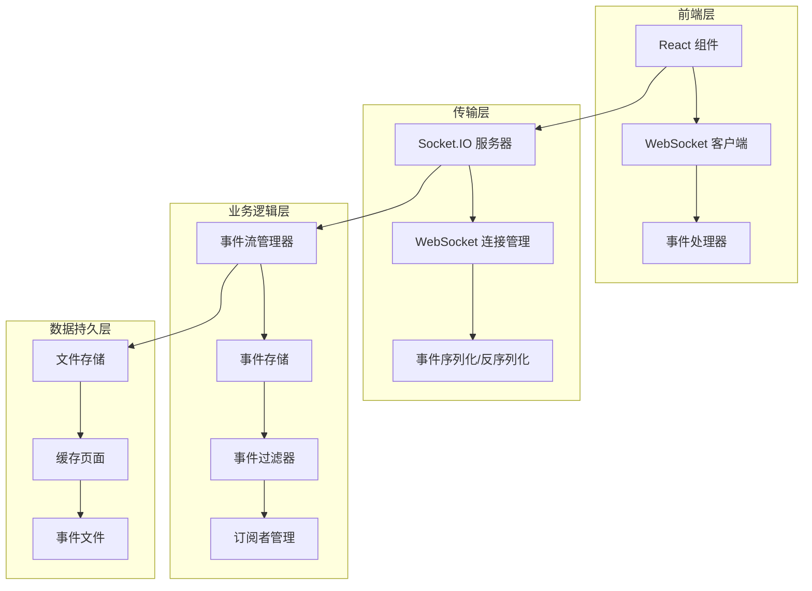

**图表来源**
- [stream.py](file://openhands/events/stream.py#L43-L292)
- [listen_socket.py](file://openhands/server/listen_socket.py#L35-L169)

## 核心组件分析

### EventStream 类

EventStream 是事件分发系统的核心类，继承自 EventStore，提供了完整的事件流管理功能。

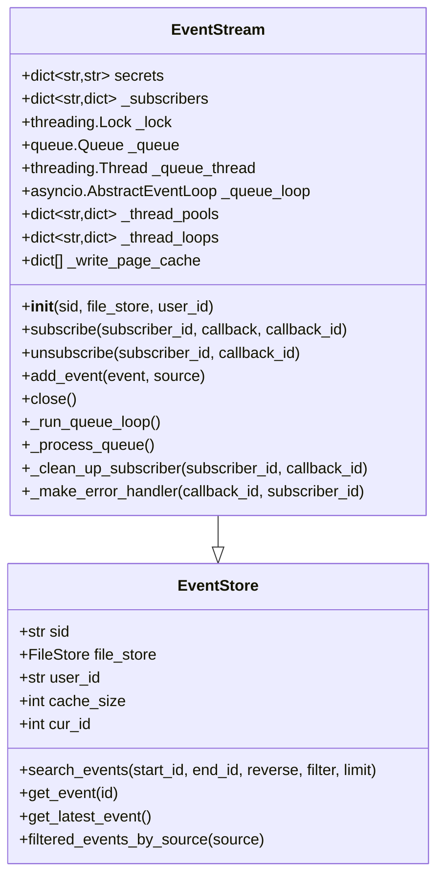

**图表来源**
- [stream.py](file://openhands/events/stream.py#L43-L292)
- [event_store.py](file://openhands/events/event_store.py#L43-L184)

**章节来源**
- [stream.py](file://openhands/events/stream.py#L43-L292)

### AsyncEventStoreWrapper 类

AsyncEventStoreWrapper 提供了同步 EventStore 到异步迭代器的桥接功能，使得传统的同步事件存储可以被异步代码使用。

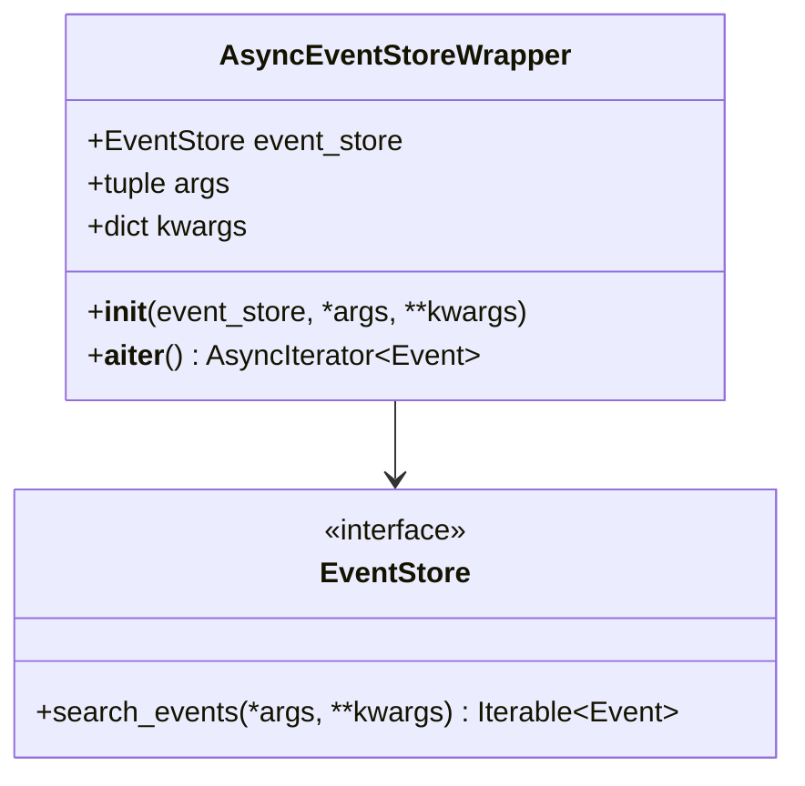

**图表来源**
- [async_event_store_wrapper.py](file://openhands/events/async_event_store_wrapper.py#L8-L24)

**章节来源**
- [async_event_store_wrapper.py](file://openhands/events/async_event_store_wrapper.py#L8-L24)

### 事件过滤器系统

EventFilter 提供了灵活的事件过滤功能，支持按类型、源、时间范围等多种条件过滤事件。

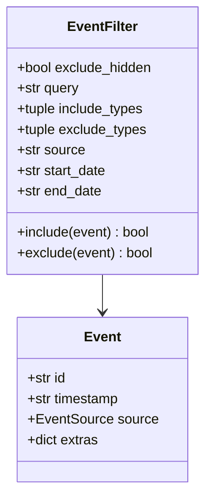

**图表来源**
- [event_filter.py](file://openhands/events/event_filter.py#L8-L99)

**章节来源**
- [event_filter.py](file://openhands/events/event_filter.py#L8-L99)

## 事件流生命周期

事件从产生到消费的完整生命周期包括以下阶段：

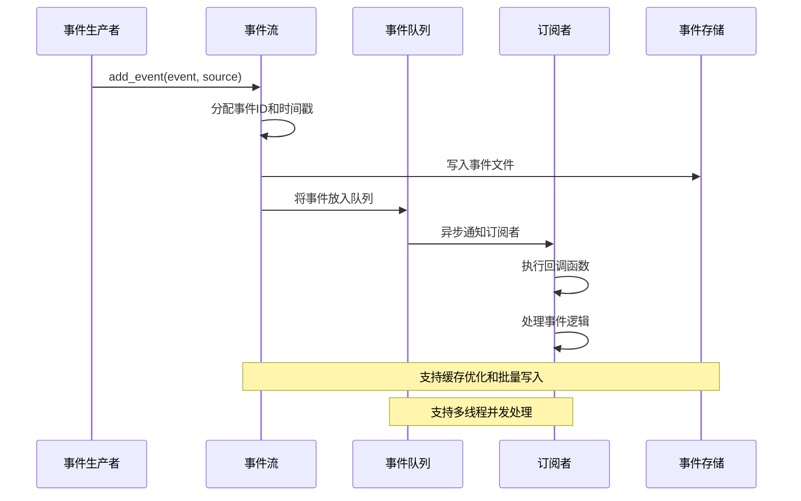

**图表来源**
- [stream.py](file://openhands/events/stream.py#L163-L203)

### 事件产生阶段

事件产生时，EventStream 执行以下操作：
1. **验证事件完整性**：检查事件是否已分配ID，防止循环事件
2. **设置元数据**：添加时间戳和事件源信息
3. **分配唯一ID**：为事件分配全局唯一的递增ID
4. **写入存储**：将事件持久化到文件系统
5. **加入队列**：将事件放入处理队列等待分发

**章节来源**
- [stream.py](file://openhands/events/stream.py#L163-L203)

### 事件分发阶段

事件分发采用异步多线程模型：

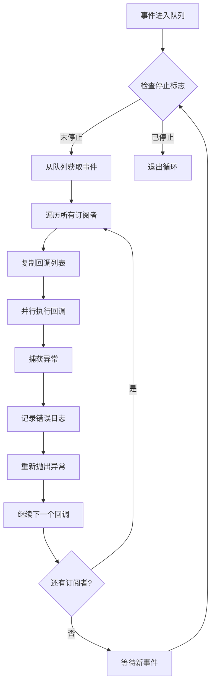

**图表来源**
- [stream.py](file://openhands/events/stream.py#L254-L292)

**章节来源**
- [stream.py](file://openhands/events/stream.py#L254-L292)

## 发布-订阅模式实现

### 订阅管理

EventStream 使用分层的订阅管理系统：

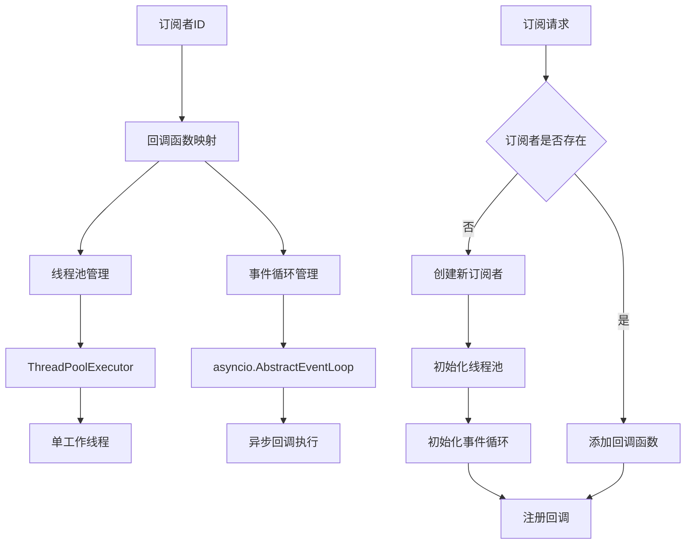

**图表来源**
- [stream.py](file://openhands/events/stream.py#L130-L148)

### 多线程并发处理

系统为每个订阅者维护独立的线程池和事件循环：

- **线程池隔离**：每个订阅者有自己的 ThreadPoolExecutor，避免相互影响
- **事件循环隔离**：每个订阅者有自己的 asyncio 事件循环
- **回调并行执行**：同一订阅者的多个回调可以并行执行
- **资源清理**：支持优雅关闭和资源回收

**章节来源**
- [stream.py](file://openhands/events/stream.py#L130-L148)

### 订阅者生命周期管理

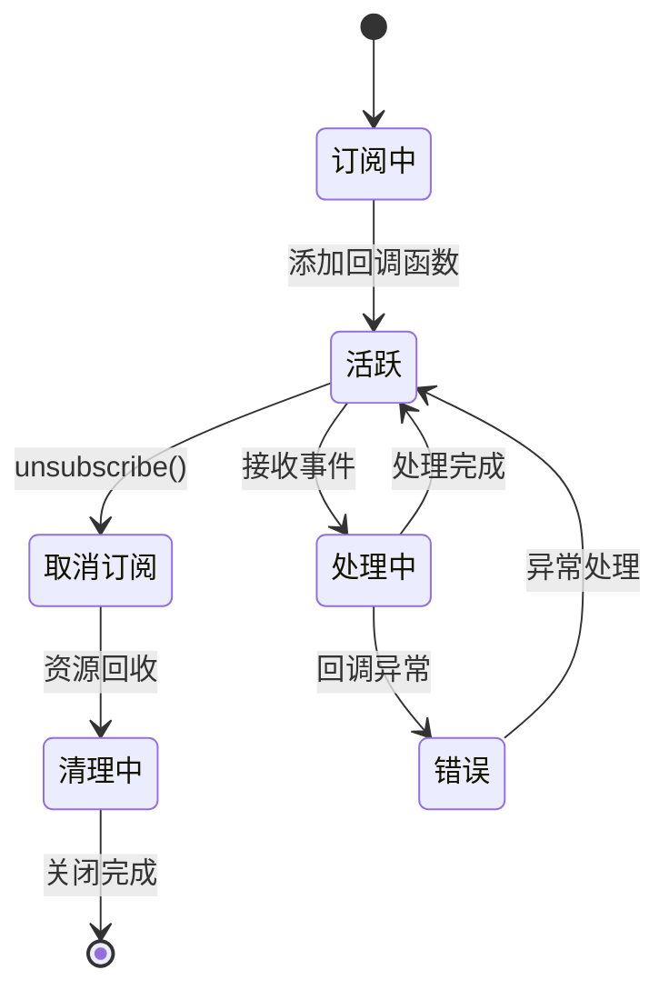

**图表来源**
- [stream.py](file://openhands/events/stream.py#L120-L129)

**章节来源**
- [stream.py](file://openhands/events/stream.py#L120-L129)

## 同步与异步事件处理

### AsyncEventStoreWrapper 实现

AsyncEventStoreWrapper 提供了同步代码库到异步世界的桥梁：

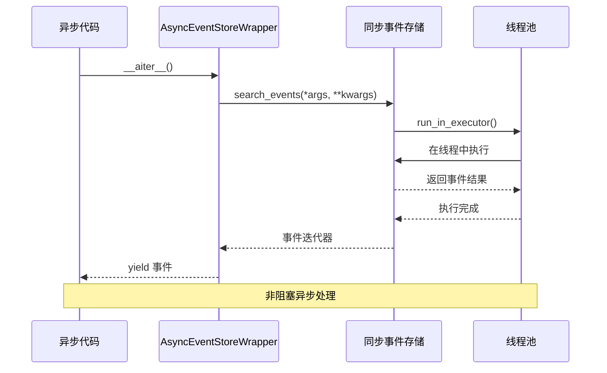

**图表来源**
- [async_event_store_wrapper.py](file://openhands/events/async_event_store_wrapper.py#L14-L23)

### 线程安全机制

系统采用多层次的线程安全保护：

1. **全局锁保护**：EventStream 使用 threading.Lock 保护关键数据结构
2. **回调隔离**：每个订阅者的回调在独立的线程中执行
3. **队列安全**：使用 Python 的 Queue.Queue 确保线程间通信安全
4. **事件循环隔离**：每个订阅者有自己的事件循环，避免冲突

**章节来源**
- [async_event_store_wrapper.py](file://openhands/events/async_event_store_wrapper.py#L14-L23)

## 背压控制机制

### 队列管理策略

EventStream 实现了多层次的背压控制：

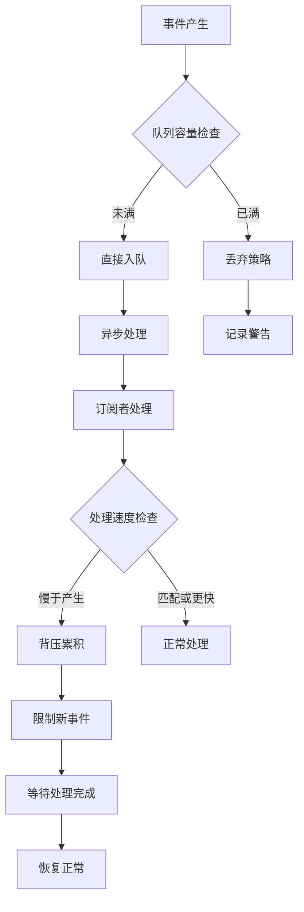

**图表来源**
- [stream.py](file://openhands/events/stream.py#L255-L275)

### 缓存优化机制

系统使用分页缓存来优化大规模事件处理：

- **写入缓存**：将事件先写入内存缓存，批量写入磁盘
- **读取缓存**：预加载常用事件到内存，减少磁盘IO
- **LRU 替换**：最近最少使用的缓存页面会被替换
- **大小控制**：通过 cache_size 参数控制缓存大小

**章节来源**
- [stream.py](file://openhands/events/stream.py#L205-L214)

### 流量控制

系统实现了多种流量控制机制：

1. **事件大小限制**：超过1MB的事件会记录警告
2. **连接超时控制**：WebSocket 连接有超时保护
3. **重连策略**：客户端自动重连，指数退避算法
4. **资源限制**：限制同时活跃的订阅者数量

## 错误处理策略

### 异常分类处理

系统对不同类型的异常采用不同的处理策略：

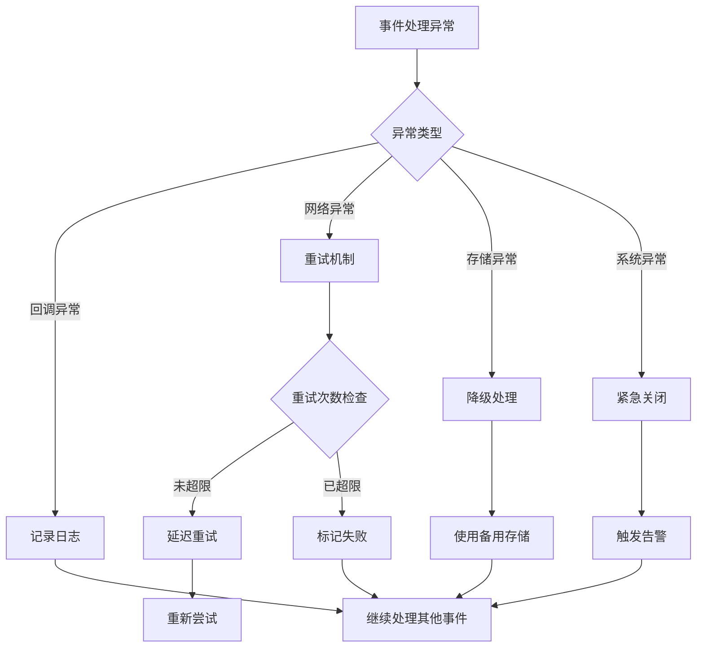

**图表来源**
- [stream.py](file://openhands/events/stream.py#L277-L291)

### 错误恢复机制

系统提供了多层次的错误恢复能力：

1. **回调异常隔离**：单个回调的异常不会影响其他回调
2. **连接自动重连**：WebSocket 连接断开后自动重连
3. **事件重放**：支持从指定事件ID开始重放事件流
4. **状态恢复**：系统重启后能恢复到最近的状态

**章节来源**
- [stream.py](file://openhands/events/stream.py#L277-L291)

### 日志记录策略

系统采用分级日志记录：

- **DEBUG**：详细的调试信息，如事件处理过程
- **INFO**：重要的系统事件，如连接建立、订阅变更
- **WARNING**：潜在问题，如大事件、性能瓶颈
- **ERROR**：严重错误，如回调异常、存储失败

## 可靠性保证

### 数据持久化

事件数据采用多重备份策略：

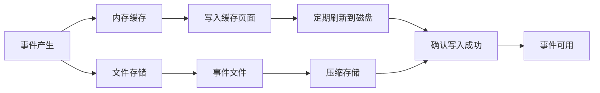

**图表来源**
- [stream.py](file://openhands/events/stream.py#L185-L203)

### 一致性保证

系统通过以下机制保证数据一致性：

1. **原子写入**：事件写入采用原子操作，防止部分写入
2. **事务性更新**：事件ID分配和文件写入在同一事务中完成
3. **校验和验证**：重要数据包含校验和，防止数据损坏
4. **版本控制**：支持事件版本追踪和回滚

**章节来源**
- [stream.py](file://openhands/events/stream.py#L185-L203)

### 故障检测

系统实现了全面的故障检测机制：

- **心跳检测**：定期检查各组件运行状态
- **超时监控**：监控长时间未响应的操作
- **资源监控**：跟踪内存、CPU、磁盘使用情况
- **连接健康检查**：WebSocket 连接状态监控

## 前端后端集成

### WebSocket 连接管理

前端使用专门的 WebSocket 客户端管理连接：

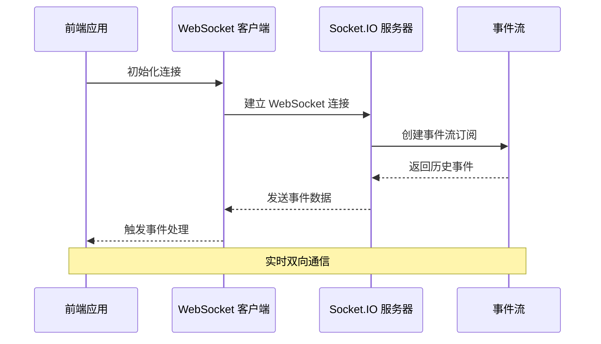

**图表来源**
- [use-websocket.ts](file://frontend/src/hooks/use-websocket.ts#L37-L192)
- [listen_socket.py](file://openhands/server/listen_socket.py#L35-L169)

### 事件监听器优雅关闭

系统提供了完整的资源清理机制：

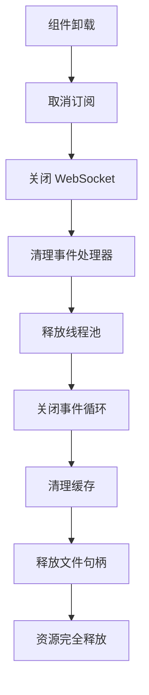

**图表来源**
- [conversation-subscriptions-provider.tsx](file://frontend/src/context/conversation-subscriptions-provider.tsx#L83-L126)

**章节来源**
- [conversation-subscriptions-provider.tsx](file://frontend/src/context/conversation-subscriptions-provider.tsx#L83-L126)

### 前端事件处理示例

前端可以通过以下方式订阅事件流：

```typescript
// 基本事件订阅
const { isConnected, lastMessage, messages, error, sendMessage } = useWebSocket({
  url: buildWebSocketUrl(conversationId, conversationUrl),
  queryParams: { latest_event_id: lastEventId },
  reconnect: { enabled: true, maxAttempts: 5 },
  onMessage: (event) => {
    // 处理接收到的事件
    handleIncomingEvent(JSON.parse(event.data));
  }
});

// 事件监听器优雅关闭
useEffect(() => {
  return () => {
    // 自动清理资源
    disconnect();
  };
}, []);
```

**章节来源**
- [use-websocket.ts](file://frontend/src/hooks/use-websocket.ts#L37-L192)

### 后端事件处理示例

后端通过 Socket.IO 处理事件：

```python
@sio.event
async def connect(connection_id: str, environ: dict) -> None:
    # 验证连接参数
    conversation_id = parse_qs(environ.get('QUERY_STRING', '')).get('conversation_id', [None])[0]
    
    # 创建事件存储
    event_store = EventStore(conversation_id, conversation_manager.file_store, user_id)
    
    # 创建异步包装器
    async_store = AsyncEventStoreWrapper(event_store, latest_event_id + 1)
    
    # 重放历史事件
    async for event in async_store:
        await sio.emit('oh_event', event_to_dict(event), to=connection_id)
```

**章节来源**
- [listen_socket.py](file://openhands/server/listen_socket.py#L35-L169)

## 最佳实践指南

### 性能优化建议

1. **合理设置缓存大小**
   - 根据事件频率调整 `cache_size` 参数
   - 平衡内存使用和磁盘IO性能

2. **优化订阅策略**
   - 避免过多的细粒度订阅
   - 使用事件过滤器减少不必要的事件传输

3. **连接管理**
   - 及时清理不再需要的订阅
   - 实现适当的重连策略

### 安全考虑

1. **事件内容过滤**
   - 使用 `EventFilter` 过滤敏感信息
   - 实施内容审核机制

2. **访问控制**
   - 验证 WebSocket 连接身份
   - 限制事件查询权限

3. **资源保护**
   - 设置合理的连接数限制
   - 监控异常的事件产生速率

### 监控和调试

1. **关键指标监控**
   - 事件产生速率
   - 处理延迟
   - 错误率统计
   - 连接状态

2. **调试工具**
   - 事件追踪
   - 性能分析
   - 日志聚合

## 故障排除

### 常见问题及解决方案

1. **事件丢失**
   - 检查事件存储配置
   - 验证文件权限设置
   - 确认网络连接稳定性

2. **性能问题**
   - 分析事件处理瓶颈
   - 优化订阅策略
   - 调整缓存参数

3. **连接问题**
   - 检查防火墙设置
   - 验证证书配置
   - 确认服务端口开放

### 调试技巧

1. **启用详细日志**
   ```python
   import logging
   logging.getLogger('openhands.events').setLevel(logging.DEBUG)
   ```

2. **监控系统资源**
   - 使用系统监控工具
   - 跟踪内存使用情况
   - 分析CPU占用

3. **测试环境验证**
   - 在开发环境中重现问题
   - 使用单元测试验证功能
   - 进行压力测试

**章节来源**
- [test_event_stream.py](file://tests/unit/events/test_event_stream.py#L1-L200)