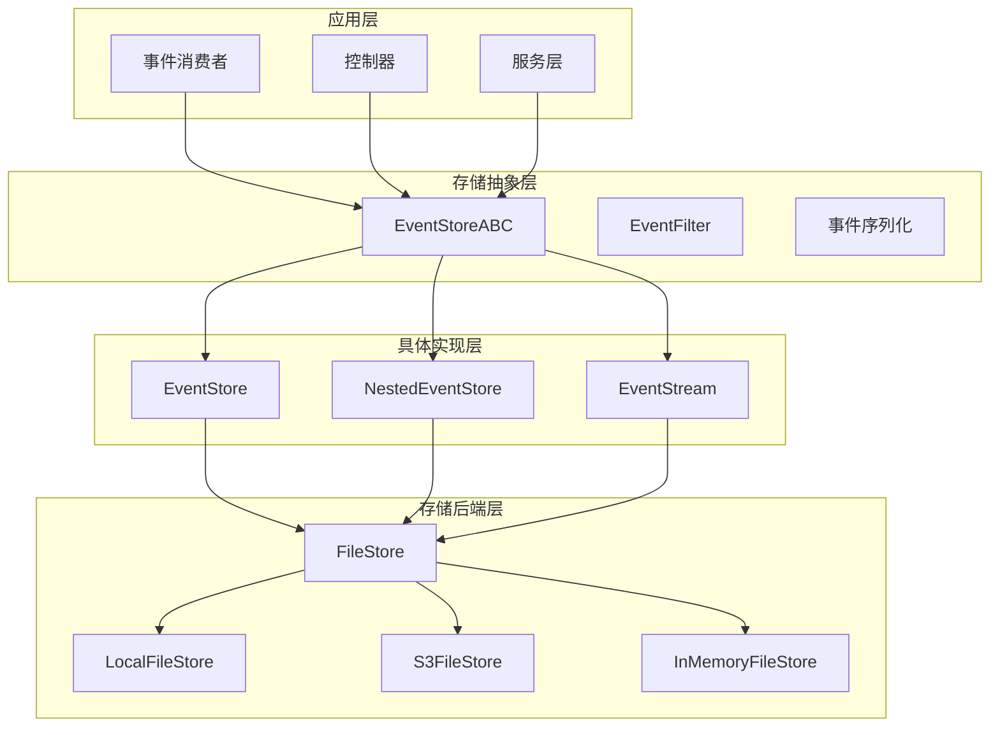
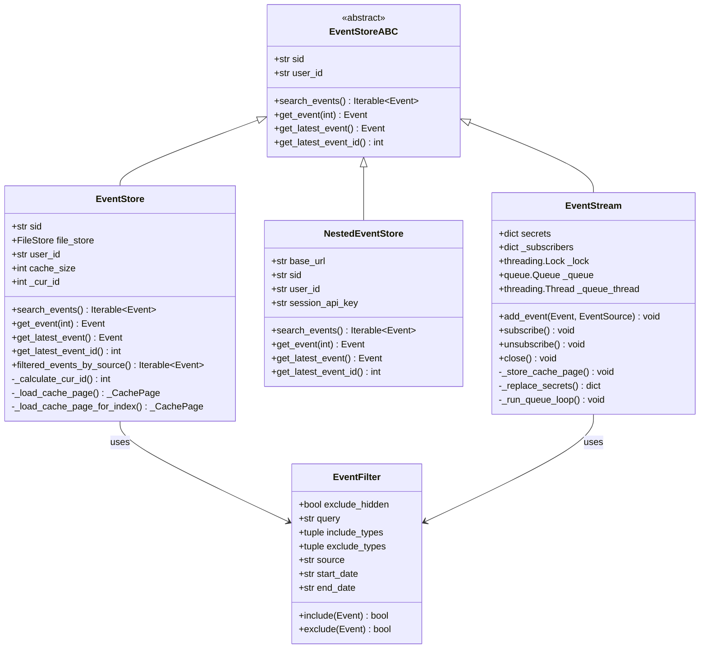
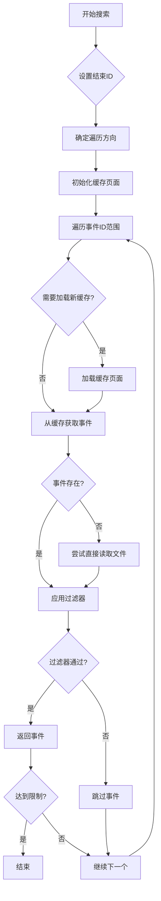
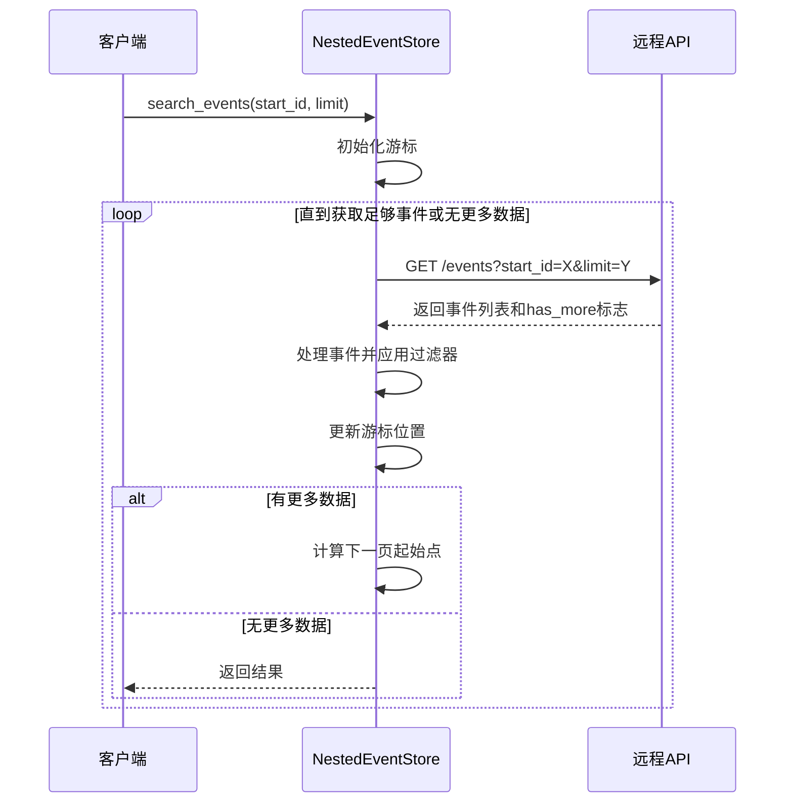
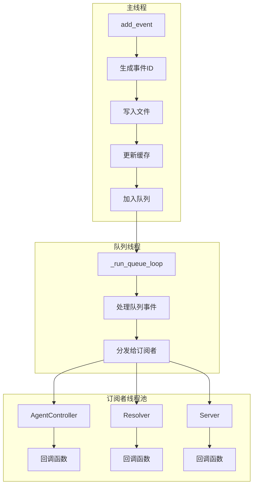
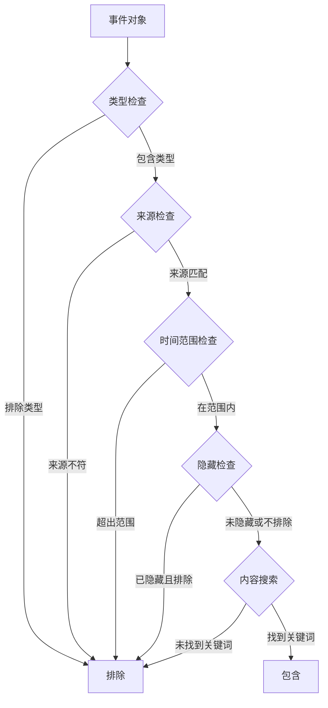
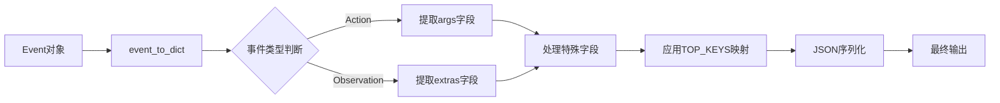
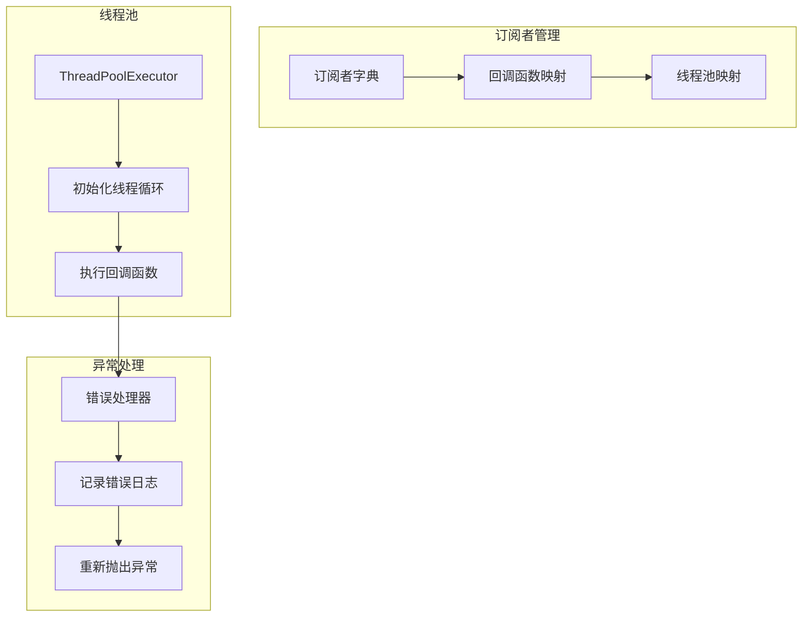
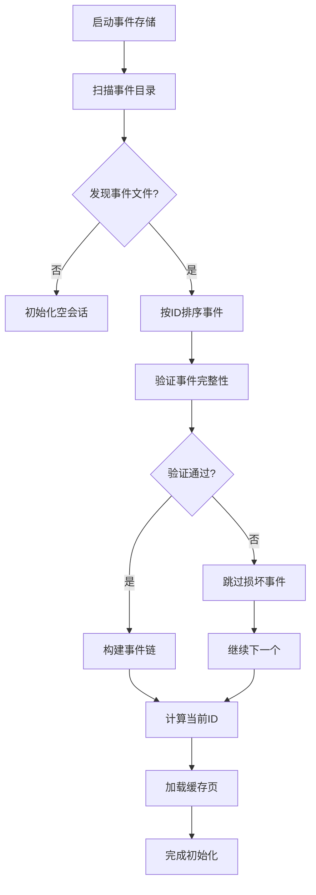

# 事件存储系统详细文档

<cite>
**本文档中引用的文件**
- [event_store.py](file://openhands/events/event_store.py)
- [nested_event_store.py](file://openhands/events/nested_event_store.py)
- [stream.py](file://openhands/events/stream.py)
- [event_store_abc.py](file://openhands/events/event_store_abc.py)
- [event_filter.py](file://openhands/events/event_filter.py)
- [serialization/event.py](file://openhands/events/serialization/event.py)
- [files.py](file://openhands/storage/files.py)
- [memory.py](file://openhands/storage/memory.py)
- [test_nested_event_store.py](file://tests/unit/events/test_nested_event_store.py)
</cite>

## 目录
1. [简介](#简介)
2. [系统架构概览](#系统架构概览)
3. [核心组件分析](#核心组件分析)
4. [EventStore类详解](#eventstore类详解)
5. [NestedEventStore类详解](#nestedeventstore类详解)
6. [EventStream类详解](#eventstream类详解)
7. [事件过滤与搜索](#事件过滤与搜索)
8. [序列化与反序列化](#序列化与反序列化)
9. [线程安全机制](#线程安全机制)
10. [内存管理与性能优化](#内存管理与性能优化)
11. [故障恢复与状态重建](#故障恢复与状态重建)
12. [使用示例](#使用示例)
13. [总结](#总结)

## 简介

OpenHands事件存储系统是一个高度模块化和可扩展的事件驱动架构，专门设计用于管理对话会话中的事件流。该系统提供了多种存储后端支持，包括本地文件系统、分布式存储和远程API调用，并实现了强大的事件过滤、缓存机制和线程安全保障。

系统的核心设计理念是将事件作为不可变的数据单元进行存储和管理，通过事件溯源模式确保数据的完整性和可追溯性。无论是本地会话还是分布式环境下的远程会话，都能通过统一的接口进行访问和操作。

## 系统架构概览

事件存储系统采用分层架构设计，从上到下包含以下层次：



**图表来源**
- [event_store_abc.py](file://openhands/events/event_store_abc.py#L10-L110)
- [event_store.py](file://openhands/events/event_store.py#L42-L182)
- [nested_event_store.py](file://openhands/events/nested_event_store.py#L14-L100)
- [stream.py](file://openhands/events/stream.py#L43-L292)

## 核心组件分析

### 组件关系图



**图表来源**
- [event_store_abc.py](file://openhands/events/event_store_abc.py#L10-L110)
- [event_store.py](file://openhands/events/event_store.py#L42-L182)
- [nested_event_store.py](file://openhands/events/nested_event_store.py#L14-L100)
- [stream.py](file://openhands/events/stream.py#L43-L292)
- [event_filter.py](file://openhands/events/event_filter.py#L8-L99)

## EventStore类详解

EventStore是基于本地文件系统的事件存储实现，提供了完整的事件持久化和检索功能。

### 核心特性

1. **事件ID管理**: 自动计算和维护事件ID序列
2. **缓存机制**: 实现了多级缓存以提高读取性能
3. **懒加载**: 延迟计算当前事件ID，减少不必要的文件系统访问
4. **文件组织**: 按会话和事件ID组织文件结构

### 关键方法分析

#### 事件搜索机制



**图表来源**
- [event_store.py](file://openhands/events/event_store.py#L85-L137)

#### 缓存策略

EventStore实现了智能缓存机制，将连续的事件批量存储为缓存页：

- **缓存大小**: 默认25个事件为一页
- **缓存格式**: JSON格式存储事件数组
- **缓存位置**: `conversation_dir/event_cache/start-end.json`
- **缓存命中**: 优先从缓存中读取，减少文件I/O

**节来源**
- [event_store.py](file://openhands/events/event_store.py#L42-L182)

## NestedEventStore类详解

NestedEventStore专门用于处理远程API调用场景，支持分布式事件存储和检索。

### 架构特点

1. **远程API集成**: 通过HTTP API与远程服务通信
2. **分页检索**: 支持大数据集的分页浏览
3. **认证机制**: 支持API密钥认证
4. **灵活查询**: 提供丰富的查询参数

### 分页算法



**图表来源**
- [nested_event_store.py](file://openhands/events/nested_event_store.py#L23-L85)

### 查询参数处理

NestedEventStore支持以下查询参数：
- `start_id`: 起始事件ID
- `end_id`: 结束事件ID（可选）
- `reverse`: 是否反向排序
- `limit`: 最大返回数量（默认100）

**节来源**
- [nested_event_store.py](file://openhands/events/nested_event_store.py#L14-L100)

## EventStream类详解

EventStream是最复杂的组件，实现了事件流的实时处理和发布订阅模式。

### 核心功能

1. **事件队列**: 异步事件处理队列
2. **发布订阅**: 支持多个订阅者监听事件
3. **线程池管理**: 为每个订阅者分配独立的线程池
4. **秘密替换**: 自动隐藏敏感信息

### 线程模型



**图表来源**
- [stream.py](file://openhands/events/stream.py#L43-L292)

### 秘密管理系统

EventStream提供了强大的秘密管理功能：

- **自动检测**: 在事件内容中自动识别敏感信息
- **动态替换**: 将秘密值替换为`<secret_hidden>`
- **保护字段**: 系统元数据字段不参与秘密替换
- **实时更新**: 支持运行时更新秘密列表

**节来源**
- [stream.py](file://openhands/events/stream.py#L43-L292)

## 事件过滤与搜索

### EventFilter类设计

EventFilter提供了灵活的事件过滤机制，支持多种过滤条件：

| 过滤类型 | 属性 | 描述 |
|---------|------|------|
| 类型过滤 | include_types/exclude_types | 包含或排除特定类型的事件 |
| 来源过滤 | source | 按事件来源过滤（user、agent等） |
| 内容过滤 | query | 按内容文本搜索 |
| 时间过滤 | start_date/end_date | 按时间范围过滤 |
| 隐藏过滤 | exclude_hidden | 排除标记为隐藏的事件 |

### 过滤器组合逻辑



**图表来源**
- [event_filter.py](file://openhands/events/event_filter.py#L38-L86)

**节来源**
- [event_filter.py](file://openhands/events/event_filter.py#L8-L99)

## 序列化与反序列化

### 序列化流程

事件序列化采用分层设计，确保数据的完整性和兼容性：



**图表来源**
- [serialization/event.py](file://openhands/events/serialization/event.py#L100-L152)

### 字段处理规则

1. **顶级字段**: 使用TOP_KEYS定义的优先字段
2. **特殊处理**: 时间戳转换为ISO格式，枚举值转换为字符串
3. **嵌套对象**: 使用Pydantic模型的model_dump方法
4. **轨迹优化**: 根据include_screenshots移除敏感字段

### 反序列化过程

反序列化负责将JSON数据还原为Event对象：

- **类型推断**: 根据'data'字段判断事件类型
- **字段映射**: 将JSON字段映射到对象属性
- **类型转换**: 自动转换时间戳、枚举值等
- **验证**: 确保必需字段的存在和有效性

**节来源**
- [serialization/event.py](file://openhands/events/serialization/event.py#L1-L179)

## 线程安全机制

### 锁机制

EventStream使用多层锁机制确保线程安全：

1. **全局锁**: `_lock`保护事件ID生成和缓存更新
2. **订阅者锁**: 保护订阅者注册和注销操作
3. **队列锁**: 保护事件队列的并发访问

### 线程池管理



**图表来源**
- [stream.py](file://openhands/events/stream.py#L130-L292)

### 并发控制策略

- **事件添加**: 使用互斥锁保护关键路径
- **订阅管理**: 原子操作确保订阅者状态一致性
- **资源清理**: 主动关闭线程池和事件循环

**节来源**
- [stream.py](file://openhands/events/stream.py#L43-L292)

## 内存管理与性能优化

### 缓存策略

系统实现了多层次的缓存机制：

1. **写入缓存**: 将最近的事件暂存在内存中
2. **读取缓存**: 批量加载事件到内存缓存页
3. **LRU淘汰**: 基于访问频率的缓存淘汰策略

### 性能优化技术

| 优化技术 | 实现方式 | 效果 |
|---------|----------|------|
| 批量写入 | 25个事件为一页 | 减少文件I/O次数 |
| 增量更新 | 只更新变化的部分 | 降低CPU开销 |
| 异步处理 | 非阻塞事件处理 | 提高响应速度 |
| 连接池 | HTTP客户端复用 | 减少连接建立开销 |
| 压缩存储 | JSON压缩 | 减少磁盘空间占用 |

### 内存泄漏防护

- **资源监控**: 定期检查内存使用情况
- **超大文件警告**: 对大于1MB的事件发出警告
- **优雅关闭**: 确保所有资源正确释放

**节来源**
- [stream.py](file://openhands/events/stream.py#L43-L292)

## 故障恢复与状态重建

### 恢复机制

系统提供了多种故障恢复机制：

1. **文件损坏检测**: 自动检测和跳过损坏的事件文件
2. **部分恢复**: 即使某些事件丢失，仍能恢复可用状态
3. **状态验证**: 验证事件序列的完整性

### 状态重建流程



**图表来源**
- [event_store.py](file://openhands/events/event_store.py#L65-L84)

### 数据一致性保证

- **原子操作**: 确保事件写入的原子性
- **版本控制**: 支持事件版本管理和冲突解决
- **校验和**: 可选的事件内容校验机制

**节来源**
- [event_store.py](file://openhands/events/event_store.py#L65-L84)

## 使用示例

### 基本事件操作

以下是常见的事件存储操作示例：

#### 创建EventStore实例
```python
# 基于本地文件系统的事件存储
file_store = LocalFileStore("/path/to/events")
event_store = EventStore(sid="session123", file_store=file_store, user_id="user456")
```

#### 添加事件
```python
# 创建消息事件
message = MessageAction(content="Hello, world!")
event_store.add_event(message, EventSource.USER)
```

#### 查询事件
```python
# 获取最新事件
latest_event = event_store.get_latest_event()

# 搜索特定范围的事件
for event in event_store.search_events(start_id=10, end_id=20):
    print(f"Event {event.id}: {event}")
```

#### 使用过滤器
```python
# 创建过滤器
event_filter = EventFilter(
    source="user",
    start_date="2024-01-01",
    query="important"
)

# 应用过滤器搜索
for event in event_store.search_events(filter=event_filter):
    print(f"Filtered event: {event}")
```

### EventStream高级用法

#### 订阅事件
```python
def event_handler(event):
    print(f"Received event: {event.id} from {event.source}")

# 注册订阅者
event_stream.subscribe(
    subscriber_id=EventStreamSubscriber.AGENT_CONTROLLER,
    callback=event_handler,
    callback_id="my_callback"
)
```

#### 动态秘密管理
```python
# 设置初始秘密
secrets = {"password": "secret123", "token": "abcd1234"}
event_stream.set_secrets(secrets)

# 更新秘密
new_secrets = {"password": "newsecret456"}
event_stream.update_secrets(new_secrets)
```

### NestedEventStore使用

#### 远程事件检索
```python
# 创建远程事件存储
remote_store = NestedEventStore(
    base_url="https://api.example.com",
    sid="session123",
    user_id="user456",
    session_api_key="your-api-key"
)

# 检索事件
for event in remote_store.search_events(limit=50):
    print(f"Remote event: {event}")
```

**节来源**
- [test_nested_event_store.py](file://tests/unit/events/test_nested_event_store.py#L46-L397)

## 总结

OpenHands事件存储系统是一个设计精良、功能完备的事件驱动架构。它通过以下关键特性实现了高性能、高可靠性的事件管理：

### 核心优势

1. **模块化设计**: 清晰的抽象层次和接口分离
2. **多后端支持**: 本地文件、远程API等多种存储方案
3. **高性能优化**: 智能缓存、批量操作、异步处理
4. **强一致性**: 事件溯源和原子操作保证数据完整性
5. **线程安全**: 完善的并发控制和资源管理

### 技术创新

- **嵌套事件结构**: 支持复杂事件关系的建模
- **动态秘密管理**: 实时敏感信息保护
- **智能缓存策略**: 基于访问模式的自适应缓存
- **优雅降级**: 部分故障不影响整体服务

### 应用价值

该系统不仅满足了OpenHands平台的业务需求，其设计理念和实现技术也为其他事件驱动系统提供了宝贵的参考。通过合理的抽象和优化，成功平衡了功能完整性、性能要求和开发复杂度，展现了优秀的软件工程实践。