# 事件订阅系统详细文档

<cite>
**本文档中引用的文件**
- [openhands/events/__init__.py](file://openhands/events/__init__.py)
- [openhands/events/event.py](file://openhands/events/event.py)
- [openhands/events/stream.py](file://openhands/events/stream.py)
- [openhands/events/event_store.py](file://openhands/events/event_store.py)
- [openhands/events/event_filter.py](file://openhands/events/event_filter.py)
- [openhands/events/nested_event_store.py](file://openhands/events/nested_event_store.py)
- [openhands/events/async_event_store_wrapper.py](file://openhands/events/async_event_store_wrapper.py)
- [openhands/events/serialization/event.py](file://openhands/events/serialization/event.py)
- [openhands/events/tool.py](file://openhands/events/tool.py)
- [tests/unit/events/test_event_stream.py](file://tests/unit/events/test_event_stream.py)
- [tests/unit/events/test_contextual_events.py](file://tests/unit/events/test_contextual_events.py)
- [openhands/app_server/event_callback/sql_event_callback_service.py](file://openhands/app_server/event_callback/sql_event_callback_service.py)
- [openhands/app_server/event_callback/event_callback_service.py](file://openhands/app_server/event_callback/event_callback_service.py)
</cite>

## 目录
1. [简介](#简介)
2. [系统架构概览](#系统架构概览)
3. [核心组件分析](#核心组件分析)
4. [事件发布-订阅模式实现](#事件发布-订阅模式实现)
5. [事件存储与检索](#事件存储与检索)
6. [事件过滤与分发](#事件过滤与分发)
7. [同步与异步事件处理](#同步与异步事件处理)
8. [事件回调管理](#事件回调管理)
9. [高级特性](#高级特性)
10. [分布式环境挑战与解决方案](#分布式环境挑战与解决方案)
11. [性能优化策略](#性能优化策略)
12. [故障排除指南](#故障排除指南)
13. [总结](#总结)

## 简介

OpenHands事件订阅系统是一个高度可扩展的事件驱动架构，实现了完整的发布-订阅模式。该系统支持实时事件流处理、多级事件过滤、异步回调执行以及分布式环境下的事件同步。系统设计注重性能、可靠性和可扩展性，能够处理大规模并发事件处理场景。

## 系统架构概览

事件订阅系统采用分层架构设计，包含以下主要层次：

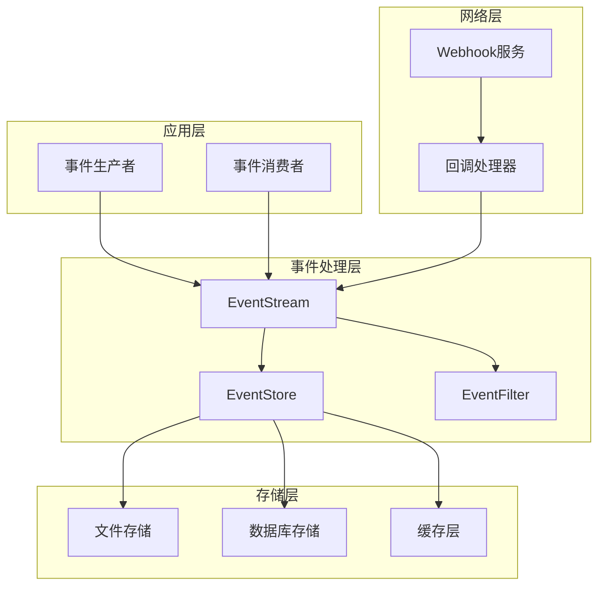

**图表来源**
- [openhands/events/stream.py](file://openhands/events/stream.py#L43-L292)
- [openhands/events/event_store.py](file://openhands/events/event_store.py#L43-L184)

## 核心组件分析

### Event类 - 事件基础模型

Event类是整个事件系统的核心数据结构，定义了所有事件的基本属性和行为：

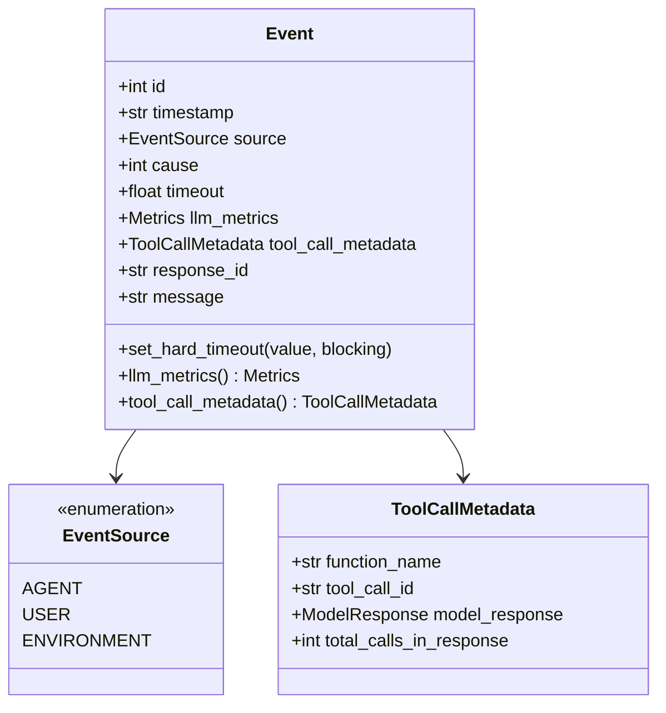

**图表来源**
- [openhands/events/event.py](file://openhands/events/event.py#L35-L132)
- [openhands/events/tool.py](file://openhands/events/tool.py#L5-L12)

### EventStream - 事件流管理器

EventStream是事件系统的核心组件，负责事件的发布、订阅和分发：

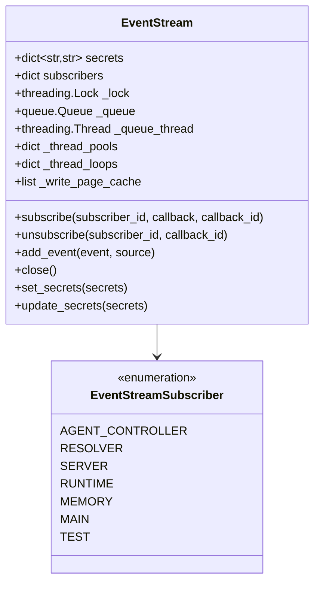

**图表来源**
- [openhands/events/stream.py](file://openhands/events/stream.py#L43-L292)

**章节来源**
- [openhands/events/stream.py](file://openhands/events/stream.py#L43-L292)
- [openhands/events/event.py](file://openhands/events/event.py#L35-L132)

## 事件发布-订阅模式实现

### 订阅机制

事件订阅系统通过以下步骤实现发布-订阅模式：

1. **订阅注册**：消费者向EventStream注册回调函数
2. **事件发布**：生产者将事件添加到EventStream
3. **事件分发**：EventStream将事件分发给所有注册的回调
4. **异步处理**：每个回调在独立的线程池中执行

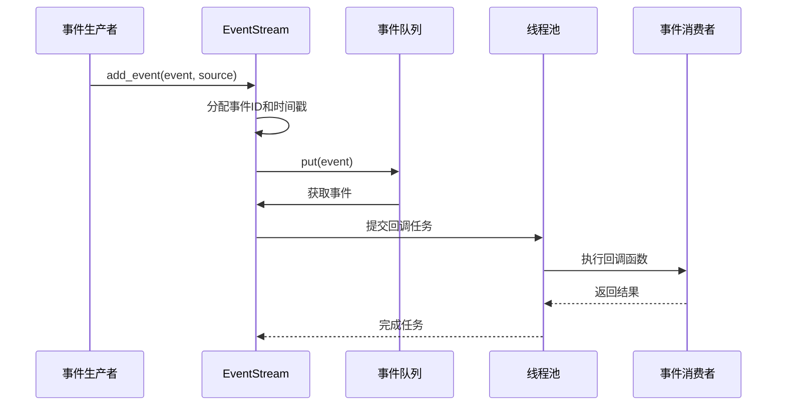

**图表来源**
- [openhands/events/stream.py](file://openhands/events/stream.py#L163-L203)
- [openhands/events/stream.py](file://openhands/events/stream.py#L254-L276)

### 回调管理

系统提供了完善的回调生命周期管理：

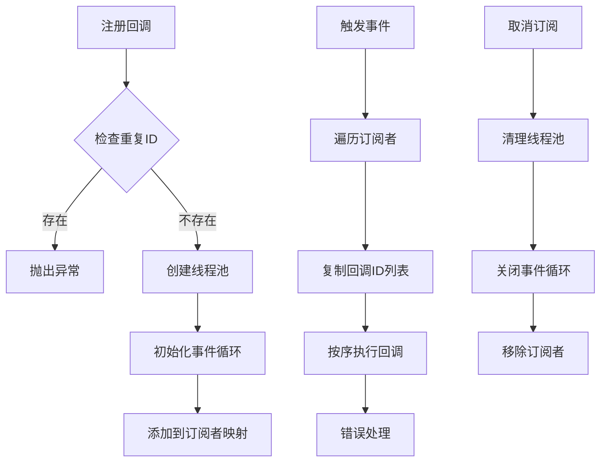

**图表来源**
- [openhands/events/stream.py](file://openhands/events/stream.py#L130-L162)

**章节来源**
- [openhands/events/stream.py](file://openhands/events/stream.py#L130-L162)
- [openhands/events/stream.py](file://openhands/events/stream.py#L254-L291)

## 事件存储与检索

### 存储架构

事件存储系统采用多层缓存架构，支持多种存储后端：

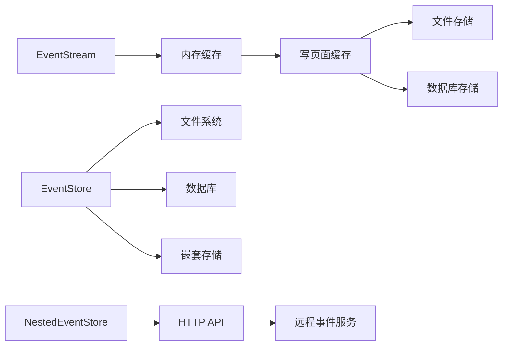

**图表来源**
- [openhands/events/event_store.py](file://openhands/events/event_store.py#L43-L184)
- [openhands/events/nested_event_store.py](file://openhands/events/nested_event_store.py#L14-L102)

### 缓存机制

系统实现了智能缓存机制以提高性能：

| 缓存层级 | 大小限制 | 生命周期 | 用途 |
|---------|---------|---------|------|
| 写页面缓存 | 可配置 | 单次写入周期 | 批量写入优化 |
| 文件缓存页 | 25事件 | 永久保存 | 快速随机访问 |
| 内存缓存 | 动态 | 进程生命周期 | 频繁访问优化 |

**章节来源**
- [openhands/events/event_store.py](file://openhands/events/event_store.py#L43-L184)
- [openhands/events/stream.py](file://openhands/events/stream.py#L183-L202)

## 事件过滤与分发

### EventFilter - 过滤器系统

EventFilter提供了灵活的事件过滤功能：

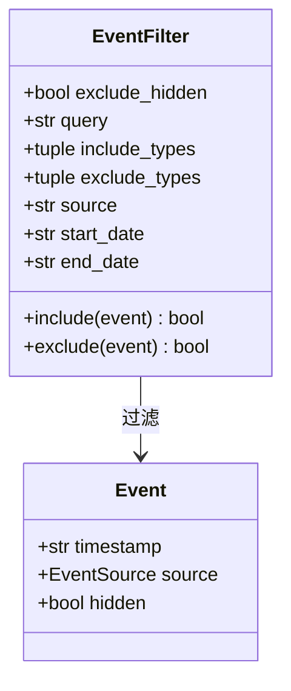

**图表来源**
- [openhands/events/event_filter.py](file://openhands/events/event_filter.py#L8-L99)

### 过滤条件详解

| 过滤类型 | 描述 | 示例用法 |
|---------|------|----------|
| include_types | 包含指定类型的事件 | `(NullAction, MessageAction)` |
| exclude_types | 排除指定类型的事件 | `(NullObservation, ChangeAgentStateAction)` |
| source | 按事件源过滤 | `'agent'`, `'user'`, `'environment'` |
| query | 文本内容搜索 | `'error'`, `'completed'` |
| start_date/end_date | 时间范围过滤 | ISO格式日期字符串 |
| exclude_hidden | 排除隐藏事件 | `True/False` |

**章节来源**
- [openhands/events/event_filter.py](file://openhands/events/event_filter.py#L8-L99)

## 同步与异步事件处理

### 异步处理架构

系统支持完全异步的事件处理模式：

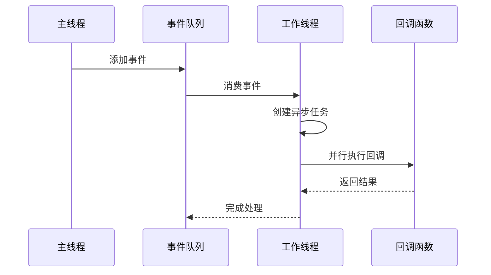

**图表来源**
- [openhands/events/stream.py](file://openhands/events/stream.py#L254-L276)
- [openhands/events/async_event_store_wrapper.py](file://openhands/events/async_event_store_wrapper.py#L14-L24)

### 线程池管理

系统为每个订阅者维护独立的线程池：

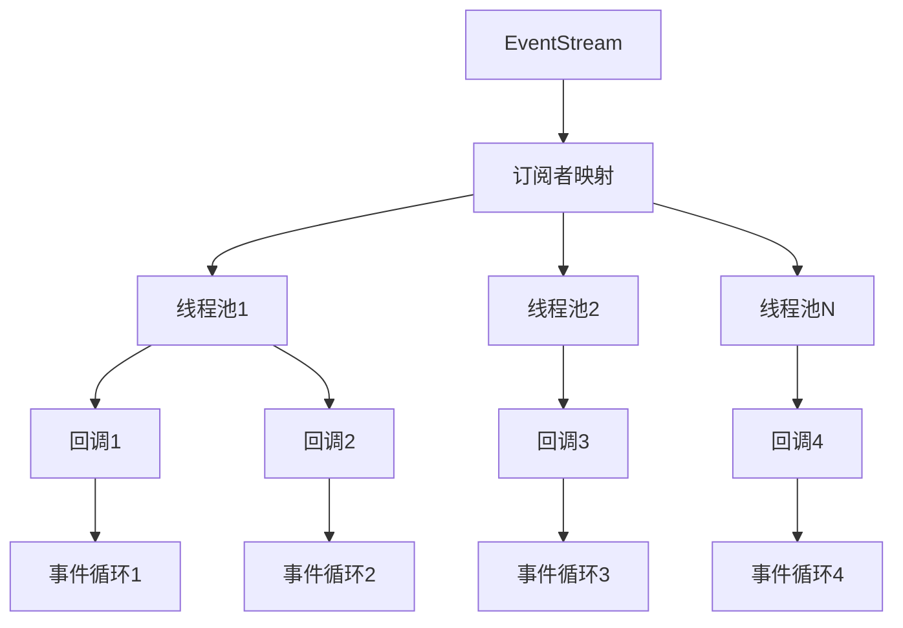

**图表来源**
- [openhands/events/stream.py](file://openhands/events/stream.py#L71-L77)

**章节来源**
- [openhands/events/stream.py](file://openhands/events/stream.py#L254-L291)
- [openhands/events/async_event_store_wrapper.py](file://openhands/events/async_event_store_wrapper.py#L14-L24)

## 事件回调管理

### 回调服务架构

事件回调系统提供了企业级的回调管理功能：

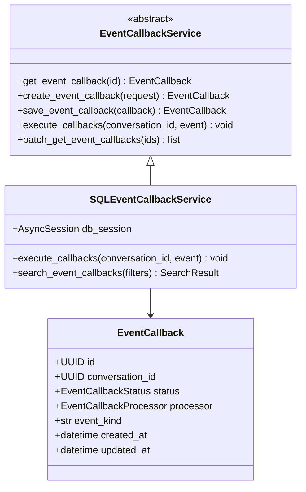

**图表来源**
- [openhands/app_server/event_callback/event_callback_service.py](file://openhands/app_server/event_callback/event_callback_service.py#L44-L68)
- [openhands/app_server/event_callback/sql_event_callback_service.py](file://openhands/app_server/event_callback/sql_event_callback_service.py#L71-L212)

### 回调执行流程

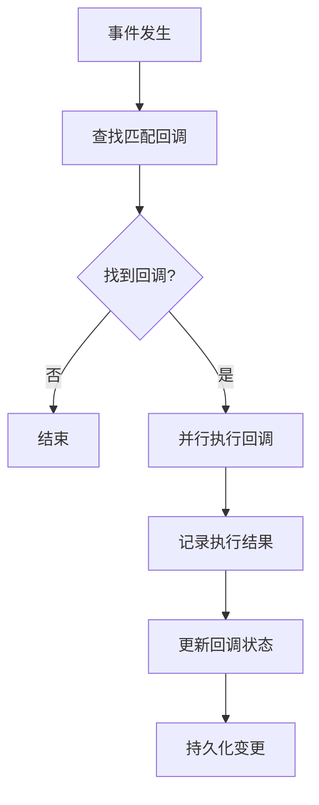

**图表来源**
- [openhands/app_server/event_callback/sql_event_callback_service.py](file://openhands/app_server/event_callback/sql_event_callback_service.py#L185-L212)

**章节来源**
- [openhands/app_server/event_callback/sql_event_callback_service.py](file://openhands/app_server/event_callback/sql_event_callback_service.py#L71-L212)
- [openhands/app_server/event_callback/event_callback_service.py](file://openhands/app_server/event_callback/event_callback_service.py#L44-L68)

## 高级特性

### 事件序列化与反序列化

系统提供了完整的事件序列化机制：

**图表来源**
- [openhands/events/serialization/event.py](file://openhands/events/serialization/event.py#L100-L152)

### 秘密信息保护

系统实现了智能的秘密信息替换机制：

| 保护级别 | 字段范围 | 处理方式 |
|---------|---------|----------|
| 完全保护 | 系统元数据字段 | 不进行秘密替换 |
| 部分保护 | 用户内容字段 | 替换匹配的秘密值 |
| 敏感保护 | 屏幕截图等敏感数据 | 完全移除 |

### 事件去重与顺序保证

系统通过以下机制确保事件处理的正确性：

1. **唯一ID生成**：每个事件都有唯一的递增ID
2. **时间戳保证**：事件按时间顺序处理
3. **幂等性检查**：防止重复处理相同事件
4. **因果关系维护**：保持事件间的因果关系

**章节来源**
- [openhands/events/serialization/event.py](file://openhands/events/serialization/event.py#L100-L152)
- [openhands/events/stream.py](file://openhands/events/stream.py#L221-L244)

## 分布式环境挑战与解决方案

### 背压处理

系统实现了多层次的背压处理机制：

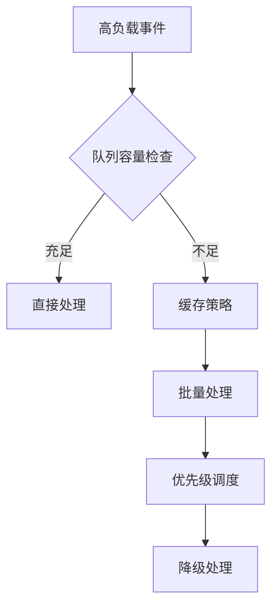

### 数据一致性保证

在分布式环境中，系统通过以下方式保证数据一致性：

1. **事务性操作**：关键操作使用数据库事务
2. **补偿机制**：失败操作的回滚和补偿
3. **最终一致性**：异步处理的最终一致性保证
4. **冲突解决**：并发操作的冲突检测和解决

### 负载均衡

系统支持水平扩展和负载均衡：

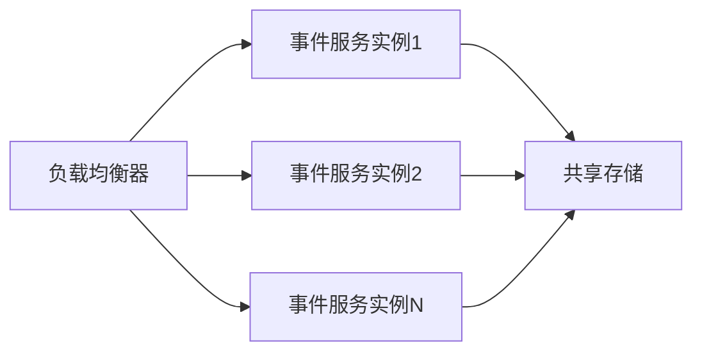

## 性能优化策略

### 缓存优化

系统采用了多层缓存策略：

| 缓存类型 | 命中率目标 | 清理策略 | 适用场景 |
|---------|-----------|---------|----------|
| 写页面缓存 | >95% | LRU | 批量写入优化 |
| 文件缓存页 | >90% | 基于访问频率 | 随机访问优化 |
| 内存缓存 | >85% | 基于TTL | 频繁访问优化 |

### 并发优化

系统通过以下方式优化并发性能：

1. **无锁设计**：关键路径使用无锁算法
2. **细粒度锁**：减少锁竞争
3. **异步I/O**：非阻塞IO操作
4. **连接池**：数据库连接复用

### 内存管理

系统实现了智能的内存管理：

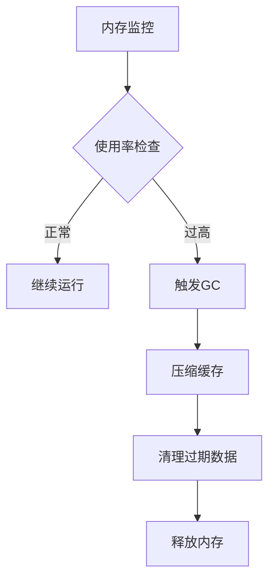

## 故障排除指南

### 常见问题诊断

| 问题类型 | 症状 | 可能原因 | 解决方案 |
|---------|------|---------|----------|
| 内存泄漏 | 内存使用持续增长 | 回调未正确清理 | 检查订阅生命周期 |
| 性能下降 | 事件处理延迟增加 | 缓存失效或队列积压 | 优化缓存策略 |
| 数据丢失 | 事件未被正确存储 | 存储后端故障 | 检查存储配置 |
| 死锁 | 系统无响应 | 锁竞争 | 重构锁逻辑 |

### 监控指标

系统提供了全面的监控指标：

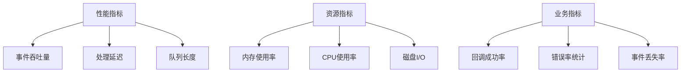

### 日志分析

系统提供了详细的日志记录：

1. **结构化日志**：JSON格式的日志输出
2. **链路追踪**：事件处理的完整链路跟踪
3. **性能分析**：关键操作的性能指标
4. **错误诊断**：详细的错误堆栈和上下文信息

**章节来源**
- [tests/unit/events/test_event_stream.py](file://tests/unit/events/test_event_stream.py#L604-L635)

## 总结

OpenHands事件订阅系统是一个功能完善、性能优异的事件驱动架构。系统通过以下特点实现了高效的事件处理：

1. **模块化设计**：清晰的分层架构便于维护和扩展
2. **高性能处理**：多层缓存和异步处理确保高吞吐量
3. **可靠性保证**：完善的错误处理和恢复机制
4. **可扩展性**：支持水平扩展和分布式部署
5. **易用性**：简洁的API和丰富的配置选项

该系统为构建大规模事件驱动应用提供了坚实的基础，能够满足从简单事件处理到复杂分布式系统的各种需求。通过合理的架构设计和性能优化，系统能够在高并发场景下保持稳定的性能表现。