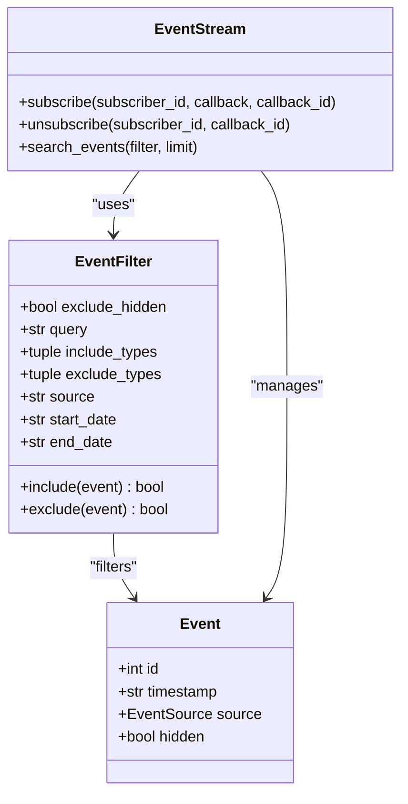
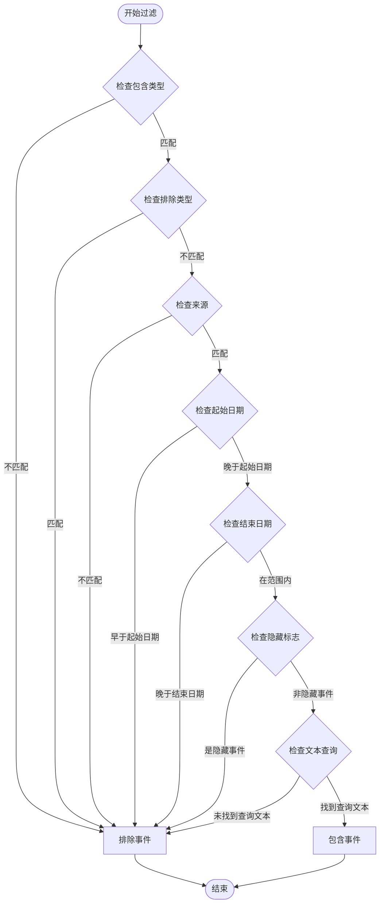
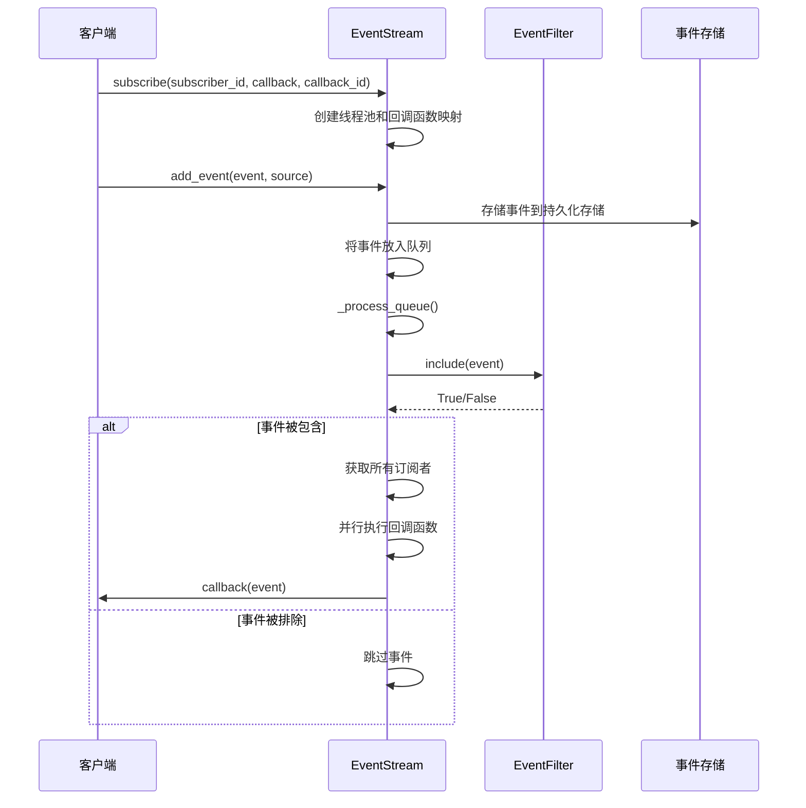
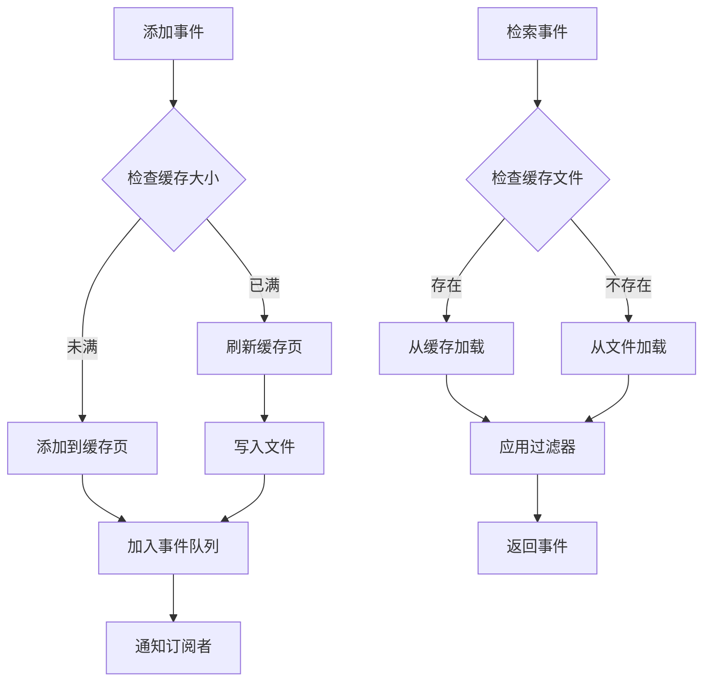

# 事件过滤

<cite>
**本文档中引用的文件**
- [event_filter.py](file://openhands/events/event_filter.py)
- [stream.py](file://openhands/events/stream.py)
- [nested_event_store.py](file://openhands/events/nested_event_store.py)
- [event_store_abc.py](file://openhands/events/event_store_abc.py)
- [test_nested_event_store.py](file://tests/unit/events/test_nested_event_store.py)
- [test_event_stream.py](file://tests/unit/events/test_event_stream.py)
- [test_contextual_events.py](file://tests/unit/events/test_contextual_events.py)
</cite>

## 目录
1. [简介](#简介)
2. [EventFilter类概述](#eventfilter类概述)
3. [过滤器核心功能](#过滤器核心功能)
4. [过滤规则语法与配置](#过滤规则语法与配置)
5. [事件流订阅机制](#事件流订阅机制)
6. [实际应用示例](#实际应用示例)
7. [性能优化策略](#性能优化策略)
8. [故障排除指南](#故障排除指南)
9. [总结](#总结)

## 简介

OpenHands事件过滤机制是一个强大而灵活的系统，用于基于多种条件筛选和过滤事件流中的事件。该系统通过`EventFilter`类提供了全面的过滤能力，支持按事件类型、来源、时间范围、内容查询等多种方式进行精确控制。

事件过滤机制的核心价值在于：
- **精确控制**：能够根据业务需求精确筛选事件
- **性能优化**：通过早期过滤减少不必要的数据处理
- **实时响应**：支持动态修改过滤规则并立即生效
- **可扩展性**：支持复杂的复合条件过滤

## EventFilter类概述

`EventFilter`是事件过滤系统的核心组件，采用数据类设计，提供了直观且强大的过滤功能。



**图表来源**
- [event_filter.py](file://openhands/events/event_filter.py#L8-L97)
- [stream.py](file://openhands/events/stream.py#L43-L292)

**节来源**
- [event_filter.py](file://openhands/events/event_filter.py#L8-L97)

## 过滤器核心功能

### 基本过滤条件

EventFilter支持以下核心过滤条件：

| 条件类型 | 属性名 | 描述 | 默认值 |
|---------|--------|------|--------|
| 隐藏事件过滤 | `exclude_hidden` | 是否排除标记为隐藏的事件 | `False` |
| 文本查询 | `query` | 在事件内容中搜索的文本字符串 | `None` |
| 包含类型过滤 | `include_types` | 只包含指定类型的事件 | `None` |
| 排除类型过滤 | `exclude_types` | 排除指定类型的事件 | `None` |
| 源过滤 | `source` | 按事件来源过滤（agent、user、environment等） | `None` |
| 时间范围过滤 | `start_date` | 起始日期（ISO格式） | `None` |
| 时间范围过滤 | `end_date` | 结束日期（ISO格式） | `None` |

### 过滤逻辑流程



**图表来源**
- [event_filter.py](file://openhands/events/event_filter.py#L38-L85)

**节来源**
- [event_filter.py](file://openhands/events/event_filter.py#L38-L85)

## 过滤规则语法与配置

### 基本配置模式

EventFilter支持多种配置组合方式：

#### 1. 类型过滤配置
```python
# 只包含MessageAction事件
filter = EventFilter(include_types=(MessageAction,))

# 排除特定类型的事件
filter = EventFilter(exclude_types=(NullAction, NullObservation))

# 同时使用包含和排除类型
filter = EventFilter(
    include_types=(MessageAction, CmdRunAction),
    exclude_types=(AgentStateChangedObservation,)
)
```

#### 2. 来源过滤配置
```python
# 只获取用户相关的事件
filter = EventFilter(source='user')

# 只获取代理产生的事件
filter = EventFilter(source='agent')
```

#### 3. 时间范围过滤
```python
# 获取2024年之后的事件
filter = EventFilter(start_date='2024-01-01T00:00:00')

# 获取2024年之前的事件  
filter = EventFilter(end_date='2024-12-31T23:59:59')

# 获取特定时间段内的事件
filter = EventFilter(
    start_date='2024-01-01T00:00:00',
    end_date='2024-12-31T23:59:59'
)
```

#### 4. 组合过滤配置
```python
# 复杂的组合过滤
filter = EventFilter(
    source='user',
    include_types=(MessageAction, FileWriteAction),
    start_date='2024-01-01T00:00:00',
    exclude_hidden=True,
    query='error OR exception'
)
```

### 动态修改过滤规则

虽然EventFilter本身是不可变对象，但可以通过重新创建实例来实现动态修改：

```python
# 初始过滤器
initial_filter = EventFilter(source='user', exclude_hidden=True)

# 动态修改过滤规则
def update_filter(filter, **kwargs):
    return EventFilter(
        exclude_hidden=kwargs.get('exclude_hidden', filter.exclude_hidden),
        query=kwargs.get('query', filter.query),
        include_types=kwargs.get('include_types', filter.include_types),
        exclude_types=kwargs.get('exclude_types', filter.exclude_types),
        source=kwargs.get('source', filter.source),
        start_date=kwargs.get('start_date', filter.start_date),
        end_date=kwargs.get('end_date', filter.end_date)
    )

# 更新过滤器
updated_filter = update_filter(initial_filter, query='important')
```

**节来源**
- [test_nested_event_store.py](file://tests/unit/events/test_nested_event_store.py#L213-L373)

## 事件流订阅机制

### 订阅流程

事件流订阅机制允许客户端实时接收符合特定过滤条件的事件：



**图表来源**
- [stream.py](file://openhands/events/stream.py#L130-L292)

### 订阅管理

EventStream提供了完整的订阅生命周期管理：

#### 订阅操作
```python
# 订阅事件流
def subscribe_example():
    def event_callback(event):
        print(f"Received event: {event}")
    
    # 订阅到特定的订阅者ID
    event_stream.subscribe(
        subscriber_id=EventStreamSubscriber.SERVER,
        callback=event_callback,
        callback_id="unique_callback_id"
    )
```

#### 取消订阅
```python
# 取消订阅
def unsubscribe_example():
    event_stream.unsubscribe(
        subscriber_id=EventStreamSubscriber.SERVER,
        callback_id="unique_callback_id"
    )
```

#### 多重订阅支持
```python
# 支持同一订阅者注册多个回调
def multiple_subscriptions_example():
    def callback1(event):
        # 处理第一种类型的事件
        pass
    
    def callback2(event):
        # 处理第二种类型的事件
        pass
    
    event_stream.subscribe(
        subscriber_id=EventStreamSubscriber.SERVER,
        callback=callback1,
        callback_id="callback_1"
    )
    
    event_stream.subscribe(
        subscriber_id=EventStreamSubscriber.SERVER,
        callback=callback2,
        callback_id="callback_2"
    )
```

**节来源**
- [stream.py](file://openhands/events/stream.py#L130-L162)

## 实际应用示例

### 示例1：仅接收文件系统事件

```python
# 创建专门的文件系统事件过滤器
filesystem_filter = EventFilter(
    include_types=(
        FileReadAction, 
        FileWriteAction, 
        FileMoveAction,
        FileDeleteAction
    ),
    exclude_hidden=True
)

# 订阅文件系统事件
def filesystem_event_handler(event):
    if isinstance(event, FileReadAction):
        logger.info(f"文件读取: {event.path}")
    elif isinstance(event, FileWriteAction):
        logger.info(f"文件写入: {event.path}")

event_stream.subscribe(
    subscriber_id=EventStreamSubscriber.SERVER,
    callback=filesystem_event_handler,
    callback_id="filesystem_monitor"
)
```

### 示例2：错误事件监控

```python
# 错误事件过滤器
error_filter = EventFilter(
    query='error OR exception OR failed OR timeout',
    exclude_types=(MessageAction,),
    exclude_hidden=True
)

# 错误事件处理器
def error_event_handler(event):
    error_info = extract_error_details(event)
    notify_admin(error_info)

# 设置错误监控
event_stream.subscribe(
    subscriber_id=EventStreamSubscriber.SERVER,
    callback=error_event_handler,
    callback_id="error_monitor"
)
```

### 示例3：上下文事件检索

```python
# 上下文事件过滤器（排除内部事件）
context_filter = EventFilter(
    exclude_types=(
        NullAction,
        NullObservation,
        ChangeAgentStateAction,
        AgentStateChangedObservation
    ),
    exclude_hidden=True
)

# 获取指定事件的上下文
def get_event_context(event_stream, target_event_id, context_size=4):
    # 获取目标事件前的事件
    before_events = list(event_stream.search_events(
        start_id=target_event_id,
        reverse=True,
        limit=context_size,
        filter=context_filter
    ))
    
    # 获取目标事件后的事件
    after_events = list(event_stream.search_events(
        start_id=target_event_id + 1,
        limit=context_size + 1,  # 额外一个用于边界检查
        filter=context_filter
    ))
    
    # 合并并排序事件
    all_events = before_events[::-1] + after_events
    return all_events
```

### 示例4：分页事件检索

```python
# 分页事件检索
def get_paginated_events(event_stream, page_size=100, max_pages=10):
    all_events = []
    has_more = True
    start_id = 0
    
    while has_more and len(all_events) < page_size * max_pages:
        # 应用过滤器
        filter = EventFilter(
            source='user',
            start_date='2024-01-01T00:00:00'
        )
        
        # 检索事件
        events = list(event_stream.search_events(
            start_id=start_id,
            limit=min(page_size, 100),  # 最大限制为100
            filter=filter
        ))
        
        if not events:
            break
            
        all_events.extend(events)
        start_id = events[-1].id + 1
        
        # 检查是否有更多事件
        has_more = len(events) == page_size
        
    return all_events[:page_size * max_pages]
```

**节来源**
- [test_contextual_events.py](file://tests/unit/events/test_contextual_events.py#L196-L540)
- [test_nested_event_store.py](file://tests/unit/events/test_nested_event_store.py#L213-L373)

## 性能优化策略

### 缓存机制

EventStream实现了多层缓存机制来提升性能：



**图表来源**
- [stream.py](file://openhands/events/stream.py#L185-L214)

### 性能优化技术

#### 1. 事件缓存
```python
# 配置缓存大小
event_stream.cache_size = 100  # 每个缓存页包含100个事件

# 自动刷新缓存
def add_event_with_cache(self, event, source):
    # 添加到内存缓存
    self._write_page_cache.append(event_to_dict(event))
    
    # 如果缓存满，自动刷新到磁盘
    if len(self._write_page_cache) >= self.cache_size:
        self._store_cache_page(self._write_page_cache)
        self._write_page_cache = []
```

#### 2. 分页检索优化
```python
# 智能分页检索
def search_events_optimized(self, filter=None, limit=100):
    # 使用HTTP GET请求进行远程检索
    search_params = {
        'start_id': start_id,
        'reverse': reverse,
        'limit': min(100, limit)  # 服务器最大限制为100
    }
    
    # 应用过滤器
    if filter:
        # 将过滤器参数转换为查询字符串
        if filter.source:
            search_params['source'] = filter.source
        if filter.start_date:
            search_params['start_date'] = filter.start_date
        if filter.end_date:
            search_params['end_date'] = filter.end_date
    
    # 执行检索
    response = httpx.get(url, params=search_params)
    return response.json()['events']
```

#### 3. 异步处理
```python
# 异步事件处理
async def process_events_async(self, events):
    # 使用异步线程池处理大量事件
    with ThreadPoolExecutor(max_workers=4) as executor:
        futures = []
        for event in events:
            future = executor.submit(self.process_single_event, event)
            futures.append(future)
        
        # 收集结果
        results = []
        for future in futures:
            try:
                result = future.result(timeout=30)
                if result:
                    results.append(result)
            except TimeoutError:
                logger.warning(f"事件处理超时: {event.id}")
    
    return results
```

### 内存管理

#### 1. 流式处理
```python
# 流式事件处理避免内存溢出
def stream_process_events(self, event_stream, filter=None):
    for event in event_stream.search_events(filter=filter):
        # 处理单个事件，立即释放内存
        processed_event = self.process_event(event)
        yield processed_event
        
        # 清理临时资源
        del event
```

#### 2. 对象池化
```python
# 事件对象池
class EventPool:
    def __init__(self):
        self.pool = deque(maxlen=1000)
    
    def get_event(self):
        if self.pool:
            return self.pool.pop()
        return Event()
    
    def release_event(self, event):
        # 清理事件状态
        event.clear()
        self.pool.append(event)
```

**节来源**
- [stream.py](file://openhands/events/stream.py#L185-L214)
- [test_nested_event_store.py](file://tests/unit/events/test_nested_event_store.py#L376-L438)

## 故障排除指南

### 常见问题及解决方案

#### 1. 过滤器不生效

**问题症状**：设置过滤器后仍然收到不符合条件的事件

**可能原因**：
- 过滤器配置错误
- 事件类型判断失败
- 字符串比较问题

**解决方案**：
```python
# 调试过滤器配置
def debug_filter(filter, event):
    print(f"事件ID: {event.id}")
    print(f"事件类型: {type(event).__name__}")
    print(f"事件来源: {getattr(event, 'source', None)}")
    print(f"事件时间戳: {getattr(event, 'timestamp', None)}")
    
    # 检查每个过滤条件
    if filter.include_types:
        print(f"包含类型检查: {isinstance(event, filter.include_types)}")
    if filter.exclude_types:
        print(f"排除类型检查: {not isinstance(event, filter.exclude_types)}")
    if filter.source:
        event_source = getattr(event, 'source', None)
        print(f"来源检查: {event_source and event_source.value == filter.source}")
    
    return filter.include(event)
```

#### 2. 性能问题

**问题症状**：事件检索速度慢，内存占用高

**诊断步骤**：
```python
# 性能监控
import time
import psutil

def monitor_performance(event_stream, filter=None):
    start_time = time.time()
    start_memory = psutil.Process().memory_info().rss / 1024 / 1024
    
    events = list(event_stream.search_events(filter=filter))
    
    end_time = time.time()
    end_memory = psutil.Process().memory_info().rss / 1024 / 1024
    
    print(f"处理 {len(events)} 个事件")
    print(f"耗时: {end_time - start_time:.2f} 秒")
    print(f"内存变化: {end_memory - start_memory:.2f} MB")
    
    return events
```

**优化建议**：
- 减少过滤器复杂度
- 使用更具体的类型过滤
- 实施适当的分页
- 启用缓存机制

#### 3. 订阅丢失

**问题症状**：事件订阅后不再接收新事件

**排查方法**：
```python
# 订阅状态检查
def check_subscription_status(event_stream, subscriber_id):
    if subscriber_id in event_stream._subscribers:
        callbacks = event_stream._subscribers[subscriber_id]
        print(f"订阅者 {subscriber_id} 有 {len(callbacks)} 个回调")
        
        for callback_id, callback in callbacks.items():
            print(f"  回调ID: {callback_id}")
    else:
        print(f"订阅者 {subscriber_id} 未找到")
```

#### 4. 内存泄漏

**问题症状**：长时间运行后内存持续增长

**预防措施**：
```python
# 内存清理
def cleanup_subscriptions(event_stream):
    # 清理已完成的任务
    for subscriber_id, callbacks in event_stream._subscribers.items():
        for callback_id in list(callbacks.keys()):
            try:
                event_stream.unsubscribe(subscriber_id, callback_id)
            except Exception as e:
                logger.warning(f"清理订阅失败: {e}")
    
    # 清理线程池
    for subscriber_id, pools in event_stream._thread_pools.items():
        for callback_id, pool in pools.items():
            pool.shutdown(wait=True)
    
    # 清理事件队列
    while not event_stream._queue.empty():
        event_stream._queue.get()
```

**节来源**
- [stream.py](file://openhands/events/stream.py#L83-L128)
- [test_event_stream.py](file://tests/unit/events/test_event_stream.py#L604-L635)

## 总结

OpenHands事件过滤机制提供了一个完整、高效且易于使用的事件筛选解决方案。通过EventFilter类的强大功能，开发者可以：

### 核心优势
- **灵活性**：支持多种过滤条件的组合使用
- **性能**：通过缓存和分页机制优化检索性能
- **实时性**：支持动态修改过滤规则并立即生效
- **可扩展性**：模块化设计便于功能扩展

### 最佳实践
1. **合理使用过滤器**：优先使用具体类型过滤而非通用查询
2. **实施分页策略**：避免一次性检索大量事件
3. **监控性能指标**：定期检查内存使用和处理时间
4. **优雅处理异常**：确保过滤器错误不会影响整体系统稳定性

### 发展方向
随着系统规模的增长，事件过滤机制将继续演进，可能的发展方向包括：
- 更智能的缓存策略
- 分布式过滤能力
- 实时机器学习驱动的过滤
- 更丰富的查询语法支持

通过深入理解和正确使用事件过滤机制，开发者可以构建更加高效和响应迅速的应用程序，为用户提供优质的事件处理体验。