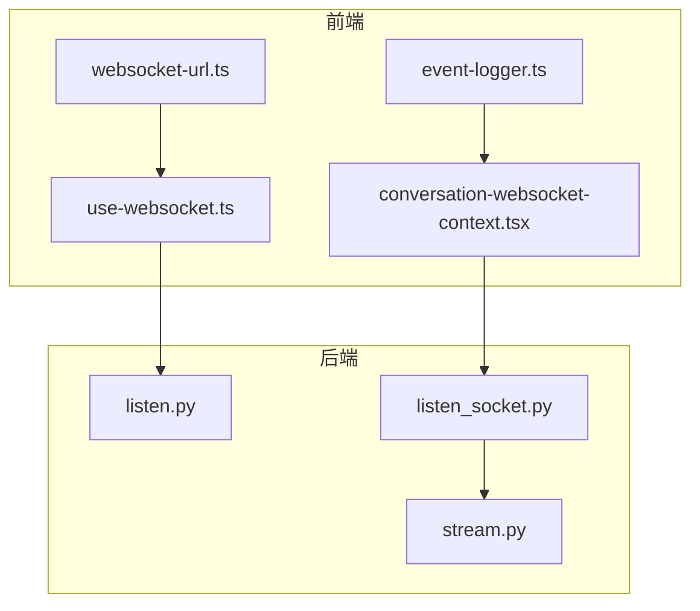
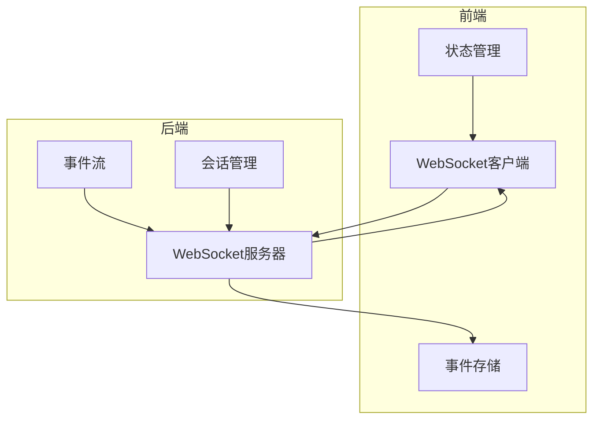
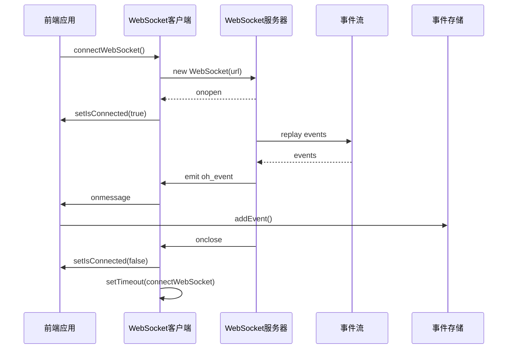
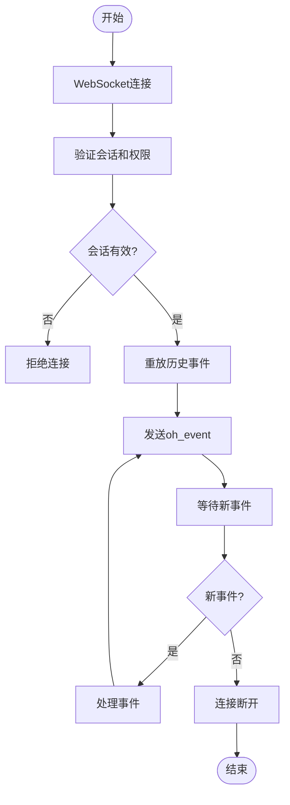
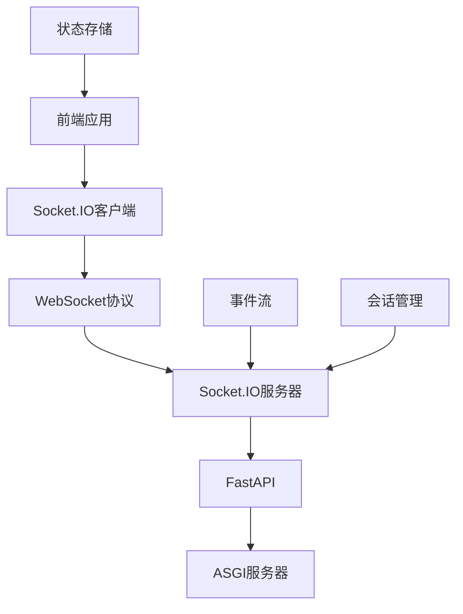

# 实时通信

<cite>
**本文档中引用的文件**   
- [use-websocket.ts](file://frontend/src/hooks/use-websocket.ts)
- [conversation-websocket-context.tsx](file://frontend/src/contexts/conversation-websocket-context.tsx)
- [websocket-url.ts](file://frontend/src/utils/websocket-url.ts)
- [listen_socket.py](file://openhands/server/listen_socket.py)
- [listen.py](file://openhands/server/listen.py)
- [event-logger.ts](file://frontend/src/utils/event-logger.ts)
- [event-service.api.ts](file://frontend/src/api/event-service/event-service.api.ts)
- [use-event-store.ts](file://frontend/src/stores/use-event-store.ts)
- [stream.py](file://openhands/events/stream.py)
</cite>

## 目录
1. [介绍](#介绍)
2. [项目结构](#项目结构)
3. [核心组件](#核心组件)
4. [架构概述](#架构概述)
5. [详细组件分析](#详细组件分析)
6. [依赖分析](#依赖分析)
7. [性能考虑](#性能考虑)
8. [故障排除指南](#故障排除指南)
9. [结论](#结论)

## 介绍
本项目提供了一个实时通信API，支持WebSocket连接、事件流和实时状态更新。系统实现了完整的连接生命周期管理，包括连接建立、心跳检测、连接恢复和消息确认机制。前端使用React和TypeScript构建，后端使用Python和Socket.IO实现，通过WebSocket协议提供低延迟的实时通信能力。系统设计注重可扩展性和可靠性，支持大规模连接管理和性能优化。

## 项目结构
项目采用分层架构，前端和后端分离，通过WebSocket协议进行实时通信。前端位于`frontend`目录，使用React框架和TypeScript语言，包含hooks、contexts和stores等现代前端架构模式。后端位于`openhands`目录，使用Python语言和FastAPI框架，通过Socket.IO实现WebSocket通信。实时通信功能主要集中在前端的`hooks`和`contexts`目录以及后端的`server`目录中。

**图表来源**
- [use-websocket.ts](file://frontend/src/hooks/use-websocket.ts)
- [listen.py](file://openhands/server/listen.py)
- [listen_socket.py](file://openhands/server/listen_socket.py)

**章节来源**
- [use-websocket.ts](file://frontend/src/hooks/use-websocket.ts)
- [listen.py](file://openhands/server/listen.py)

## 核心组件
实时通信系统的核心组件包括WebSocket连接管理、事件流处理和状态更新机制。前端通过`useWebSocket` Hook管理WebSocket连接的生命周期，包括连接、断开、重连和错误处理。后端通过Socket.IO服务器处理WebSocket连接，实现事件的广播和单播。事件流通过`EventStream`类管理，支持事件的存储、检索和实时分发。系统还实现了连接恢复机制，通过`latest_event_id`参数确保客户端不会丢失任何事件。

**章节来源**
- [use-websocket.ts](file://frontend/src/hooks/use-websocket.ts)
- [listen_socket.py](file://openhands/server/listen_socket.py)
- [stream.py](file://openhands/events/stream.py)

## 架构概述
系统采用客户端-服务器架构，通过WebSocket协议实现全双工通信。前端作为客户端，通过WebSocket连接到后端服务器，订阅事件流并发送用户操作。后端作为服务器，管理所有WebSocket连接，处理事件流，并将事件广播给订阅的客户端。系统使用事件驱动架构，当有新事件产生时，通过`EventStream`通知所有订阅者。连接认证通过查询参数中的`session_api_key`实现，确保只有授权用户才能访问特定会话。

**图表来源**
- [listen_socket.py](file://openhands/server/listen_socket.py)
- [conversation-websocket-context.tsx](file://frontend/src/contexts/conversation-websocket-context.tsx)

## 详细组件分析

### WebSocket连接管理分析
WebSocket连接管理是实时通信系统的核心，负责建立、维护和恢复WebSocket连接。系统实现了健壮的连接生命周期管理，包括自动重连、错误处理和连接状态跟踪。

#### 对于API/服务组件：

**图表来源**
- [use-websocket.ts](file://frontend/src/hooks/use-websocket.ts)
- [listen_socket.py](file://openhands/server/listen_socket.py)

### 事件流处理分析
事件流处理系统负责管理、存储和分发所有实时事件。系统使用`EventStream`类作为中心枢纽，所有事件都通过这个流进行处理。事件流支持订阅/发布模式，允许多个组件订阅感兴趣的事件类型。

#### 对于复杂逻辑组件：

**图表来源**
- [listen_socket.py](file://openhands/server/listen_socket.py)
- [stream.py](file://openhands/events/stream.py)

**章节来源**
- [listen_socket.py](file://openhands/server/listen_socket.py)
- [stream.py](file://openhands/events/stream.py)

## 依赖分析
实时通信系统依赖于多个关键组件和库。前端依赖React、Socket.IO客户端和Zustand状态管理库。后端依赖FastAPI、Socket.IO服务器和异步I/O库。系统通过清晰的依赖关系实现了关注点分离，前端专注于UI和用户体验，后端专注于事件处理和会话管理。WebSocket连接通过`socketio.ASGIApp`集成到ASGI应用中，确保与现有Web服务器的无缝集成。

**图表来源**
- [listen.py](file://openhands/server/listen.py)
- [listen_socket.py](file://openhands/server/listen_socket.py)

**章节来源**
- [listen.py](file://openhands/server/listen.py)
- [listen_socket.py](file://openhands/server/listen_socket.py)

## 性能考虑
系统在设计时考虑了大规模连接管理的性能需求。后端使用异步I/O和事件循环，能够高效处理大量并发连接。事件流使用缓冲和批处理技术，减少I/O操作的频率。前端实现了事件去重和状态合并，避免不必要的UI更新。连接恢复机制通过`latest_event_id`参数实现增量同步，避免重新传输大量历史事件。系统还支持水平扩展，可以通过负载均衡器分发连接到多个服务器实例。

## 故障排除指南
当遇到WebSocket连接问题时，首先检查网络连接和服务器状态。如果连接频繁断开，检查服务器日志中的错误信息。对于事件丢失问题，验证`latest_event_id`参数是否正确传递。如果遇到性能问题，监控服务器的CPU和内存使用情况，考虑增加服务器资源或优化事件处理逻辑。开发模式下可以启用`EventLogger`来调试事件流。

**章节来源**
- [event-logger.ts](file://frontend/src/utils/event-logger.ts)
- [use-websocket.ts](file://frontend/src/hooks/use-websocket.ts)

## 结论
本实时通信API提供了完整的WebSocket连接、事件流和状态更新功能。系统设计注重可靠性、性能和可扩展性，支持大规模连接管理和高效的事件分发。通过清晰的架构分离和健壮的错误处理机制，系统能够提供稳定可靠的实时通信服务。未来可以进一步优化连接复用和消息压缩，以提高性能和降低带宽消耗。