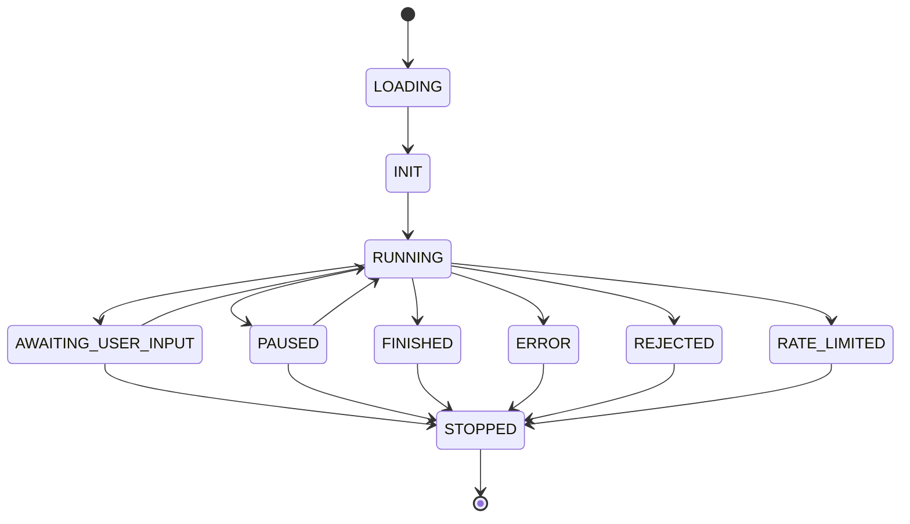

# 代理状态模型

<cite>
**本文档引用的文件**
- [agent.py](file://openhands/core/schema/agent.py#L3-L50)
- [agent-state.tsx](file://frontend/src/types/agent-state.tsx#L1-L14)
- [agent-store.ts](file://frontend/src/stores/agent-store.ts#L3-L5)
- [agent-state-service.ts](file://frontend/src/services/agent-state-service.ts#L4-L6)
- [use-agent-state.ts](file://frontend/src/hooks/use-agent-state.ts#L11-L32)
- [session.py](file://openhands/server/session/session.py#L124-L125)
- [test_utils.py](file://enterprise/tests/unit/integrations/test_utils.py#L9-L158)
- [test_conversation_callback_utils.py](file://enterprise/tests/unit/server/test_conversation_callback_utils.py#L36-L69)
</cite>

## 目录
1. [简介](#简介)
2. [代理状态枚举](#代理状态枚举)
3. [前后端实现](#前后端实现)
4. [状态生命周期与转换规则](#状态生命周期与转换规则)
5. [状态流转图](#状态流转图)
6. [状态与用户界面映射](#状态与用户界面映射)
7. [代码示例](#代码示例)

## 简介
代理状态模型是OpenHands系统中的核心状态管理机制，用于跟踪和表示代理（Agent）在执行任务过程中的各种状态。该模型定义了代理从初始化到完成或失败的完整生命周期，为系统提供了清晰的状态管理和用户反馈机制。本文档详细解释了系统中定义的各个代理状态及其业务含义，描述了状态枚举在前后端的实现方式，说明了状态变更的触发条件和生命周期转换规则，并提供了状态流转图和用户界面映射关系。

## 代理状态枚举
代理状态模型定义了多个状态值，每个状态代表了代理在执行过程中的特定阶段或条件。这些状态在系统中以枚举形式存在，确保了状态值的一致性和可维护性。

### 后端Python实现
在后端，代理状态通过Python的Enum类实现，定义在`openhands/core/schema/agent.py`文件中。`AgentState`类继承自`str`和`Enum`，使得状态值既是字符串又是枚举实例，便于序列化和比较。

```python
class AgentState(str, Enum):
    LOADING = 'loading'
    RUNNING = 'running'
    AWAITING_USER_INPUT = 'awaiting_user_input'
    PAUSED = 'paused'
    STOPPED = 'stopped'
    FINISHED = 'finished'
    REJECTED = 'rejected'
    ERROR = 'error'
    AWAITING_USER_CONFIRMATION = 'awaiting_user_confirmation'
    USER_CONFIRMED = 'user_confirmed'
    USER_REJECTED = 'user_rejected'
    RATE_LIMITED = 'rate_limited'
```

### 前端TypeScript实现
在前端，代理状态通过TypeScript的枚举实现，定义在`frontend/src/types/agent-state.tsx`文件中。前端实现与后端保持一致，确保了状态值的统一。

```typescript
export enum AgentState {
  LOADING = "loading",
  INIT = "init",
  RUNNING = "running",
  AWAITING_USER_INPUT = "awaiting_user_input",
  PAUSED = "paused",
  STOPPED = "stopped",
  FINISHED = "finished",
  REJECTED = "rejected",
  ERROR = "error",
  RATE_LIMITED = "rate_limited",
  AWAITING_USER_CONFIRMATION = "awaiting_user_confirmation",
  USER_CONFIRMED = "user_confirmed",
  USER_REJECTED = "user_rejected",
}
```

**Section sources**
- [agent.py](file://openhands/core/schema/agent.py#L3-L50)
- [agent-state.tsx](file://frontend/src/types/agent-state.tsx#L1-L14)

## 前后端实现
代理状态模型在前后端之间通过WebSocket通信进行同步，确保用户界面能够实时反映代理的当前状态。

### 后端状态管理
后端通过`AgentStateChangedObservation`类来表示状态变更事件，该类继承自`Observation`基类，包含`agent_state`属性来存储当前状态值。

```python
@dataclass
class AgentStateChangedObservation(Observation):
    agent_state: str
    reason: str = ''
    observation: str = ObservationType.AGENT_STATE_CHANGED
```

当代理状态发生变化时，后端会创建一个`AgentStateChangedObservation`实例，并通过事件流发送给前端。例如，在会话关闭时，后端会发送一个状态为`STOPPED`的事件：

```python
await self.sio.emit(
    'oh_event',
    event_to_dict(
        AgentStateChangedObservation('', AgentState.STOPPED.value)
    ),
    to=ROOM_KEY.format(sid=self.sid),
)
```

### 前端状态管理
前端使用Zustand状态管理库来维护代理状态。`useAgentStore`钩子提供了对当前代理状态的访问和更新功能。

```typescript
interface AgentStateData {
  curAgentState: AgentState;
}

export const useAgentStore = create<AgentStore>((set) => ({
  curAgentState: AgentState.LOADING,
  setCurrentAgentState: (state: AgentState) => set({ curAgentState: state }),
  reset: () => set(initialState),
}));
```

前端还提供了`useAgentState`钩子，用于统一处理V0和V1版本的代理状态。对于V1版本，该钩子会将`V1ExecutionStatus`映射到对应的`AgentState`：

```typescript
function mapV1StatusToV0State(status: V1ExecutionStatus | null): AgentState {
  if (!status) {
    return AgentState.LOADING;
  }

  switch (status) {
    case V1ExecutionStatus.IDLE:
      return AgentState.AWAITING_USER_INPUT;
    case V1ExecutionStatus.RUNNING:
      return AgentState.RUNNING;
    case V1ExecutionStatus.PAUSED:
      return AgentState.PAUSED;
    // ... 其他映射
    default:
      return AgentState.LOADING;
  }
}
```

**Section sources**
- [agent.py](file://openhands/core/schema/agent.py#L7-L17)
- [session.py](file://openhands/server/session/session.py#L124-L125)
- [agent-store.ts](file://frontend/src/stores/agent-store.ts#L3-L5)
- [use-agent-state.ts](file://frontend/src/hooks/use-agent-state.ts#L11-L32)

## 状态生命周期与转换规则
代理状态模型定义了代理从创建到终止的完整生命周期，以及状态之间的转换规则。理解这些规则对于正确使用和调试系统至关重要。

### 状态定义与业务含义
- **LOADING**: 代理正在加载，通常在会话初始化阶段使用。
- **INIT**: 代理已初始化，准备开始执行任务。
- **RUNNING**: 代理正在运行，积极执行任务。
- **AWAITING_USER_INPUT**: 代理正在等待用户输入，通常在需要用户确认或提供额外信息时出现。
- **PAUSED**: 代理已暂停，可能由于达到最大迭代次数或其他暂停条件。
- **STOPPED**: 代理已停止，会话已结束。
- **FINISHED**: 代理已完成当前任务，成功结束。
- **REJECTED**: 代理拒绝了任务，通常因为任务不可行或不符合要求。
- **ERROR**: 任务执行过程中发生错误。
- **AWAITING_USER_CONFIRMATION**: 代理正在等待用户确认某个操作。
- **USER_CONFIRMED**: 用户已确认代理的操作。
- **USER_REJECTED**: 用户已拒绝代理的操作。
- **RATE_LIMITED**: 代理因速率限制而无法继续执行。

### 状态转换触发条件
状态转换由系统内部事件或用户交互触发：
- **RUNNING → AWAITING_USER_INPUT**: 当代理需要用户输入时。
- **RUNNING → PAUSED**: 当代理达到最大迭代次数或遇到暂停条件时。
- **RUNNING → FINISHED**: 当代理成功完成任务时。
- **RUNNING → ERROR**: 当任务执行过程中发生错误时。
- **AWAITING_USER_INPUT → RUNNING**: 当用户提供输入并继续任务时。
- **PAUSED → RUNNING**: 当用户恢复暂停的代理时。
- **任何状态 → STOPPED**: 当会话被显式关闭或终止时。

**Section sources**
- [agent.py](file://openhands/core/schema/agent.py#L3-L50)
- [test_conversation_callback_utils.py](file://enterprise/tests/unit/server/test_conversation_callback_utils.py#L36-L69)

## 状态流转图
以下Mermaid图展示了代理状态之间的主要转换关系：



**Diagram sources**
- [agent.py](file://openhands/core/schema/agent.py#L3-L50)
- [test_conversation_callback_utils.py](file://enterprise/tests/unit/server/test_conversation_callback_utils.py#L36-L69)

## 状态与用户界面映射
代理状态直接影响用户界面的显示和交互，为用户提供清晰的反馈和操作指引。

### 状态与UI元素映射
- **LOADING**: 显示加载指示器，表示系统正在初始化。
- **RUNNING**: 显示运行中状态，可能伴有进度指示。
- **AWAITING_USER_INPUT**: 显示输入框或确认对话框，等待用户响应。
- **PAUSED**: 显示暂停状态，提供恢复按钮。
- **FINISHED**: 显示成功完成状态，可能伴有结果摘要。
- **ERROR**: 显示错误消息，提供重试或诊断选项。
- **RATE_LIMITED**: 显示速率限制警告，建议稍后重试。

### 运行时活动状态判断
前端使用`RUNTIME_INACTIVE_STATES`常量来判断运行时是否处于非活动状态：

```typescript
export const RUNTIME_INACTIVE_STATES = [
  AgentState.INIT,
  AgentState.LOADING,
  AgentState.ERROR,
];
```

`useHandleRuntimeActive`钩子基于此常量判断运行时是否活跃：

```typescript
export const useHandleRuntimeActive = () => {
  const { curAgentState } = useAgentState();
  const runtimeActive = !RUNTIME_INACTIVE_STATES.includes(curAgentState);
  return { runtimeActive };
};
```

**Section sources**
- [agent-state.tsx](file://frontend/src/types/agent-state.tsx#L17-L22)
- [use-handle-runtime-active.ts](file://frontend/src/hooks/use-handle-runtime-active.ts#L4-L7)

## 代码示例
以下代码示例展示了代理状态的定义、初始化和基本操作。

### 状态定义
```python
# backend: openhands/core/schema/agent.py
class AgentState(str, Enum):
    LOADING = 'loading'
    RUNNING = 'running'
    AWAITING_USER_INPUT = 'awaiting_user_input'
    # ... 其他状态
```

```typescript
// frontend: frontend/src/types/agent-state.tsx
export enum AgentState {
  LOADING = "loading",
  RUNNING = "running",
  AWAITING_USER_INPUT = "awaiting_user_input",
  // ... 其他状态
}
```

### 状态变更事件生成
```typescript
// frontend: frontend/src/services/agent-state-service.ts
export const generateAgentStateChangeEvent = (state: AgentState) => ({
  action: ActionType.CHANGE_AGENT_STATE,
  args: { agent_state: state },
});
```

### 状态变更处理
```python
# backend: enterprise/tests/unit/integrations/test_utils.py
def test_handled_agent_states(self, state, expected_text, includes_link):
    observation = AgentStateChangedObservation(
        content=f'Agent state: {state.value}', agent_state=state
    )
    result = get_summary_for_agent_state([observation], self.conversation_link)
    assert expected_text in result.lower()
```

**Section sources**
- [agent.py](file://openhands/core/schema/agent.py#L3-L50)
- [agent-state.tsx](file://frontend/src/types/agent-state.tsx#L1-L14)
- [agent-state-service.ts](file://frontend/src/services/agent-state-service.ts#L4-L6)
- [test_utils.py](file://enterprise/tests/unit/integrations/test_utils.py#L9-L158)