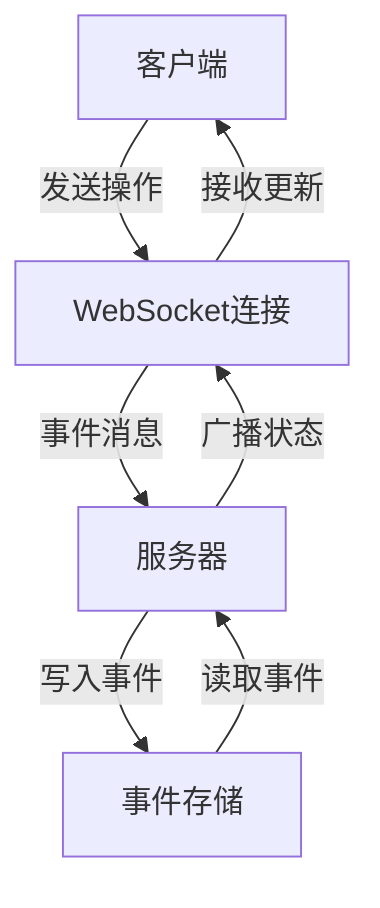
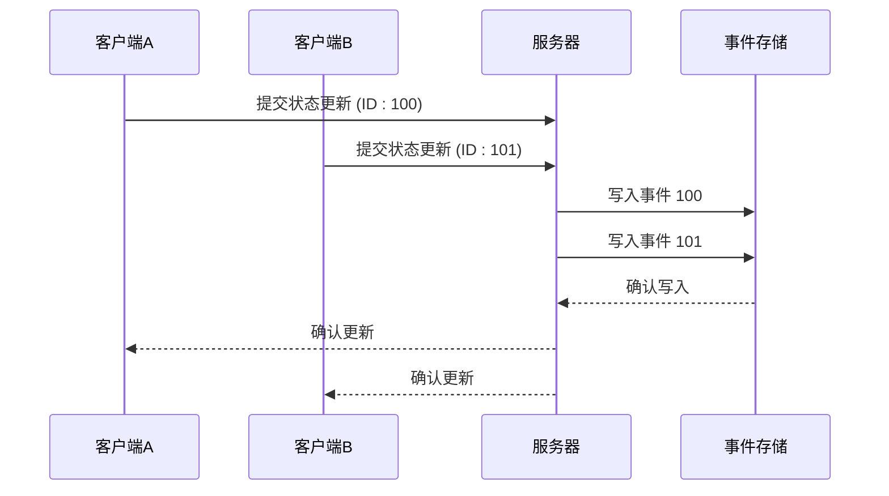
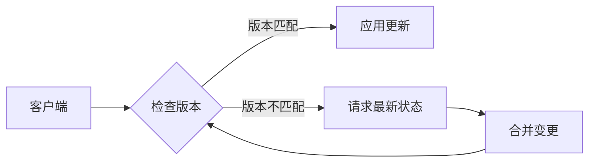
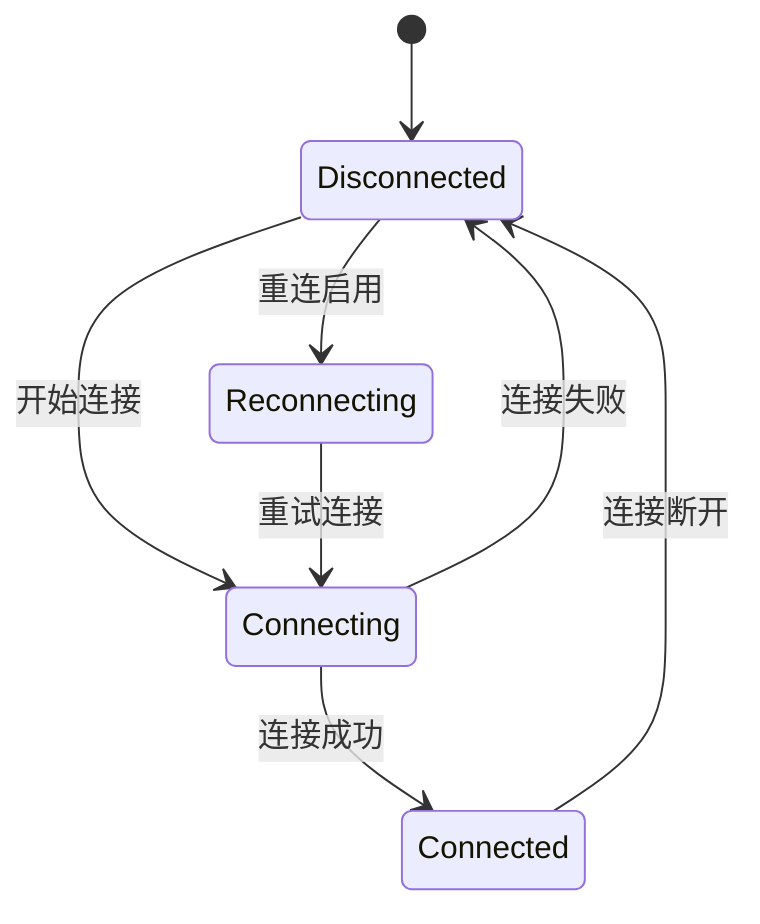
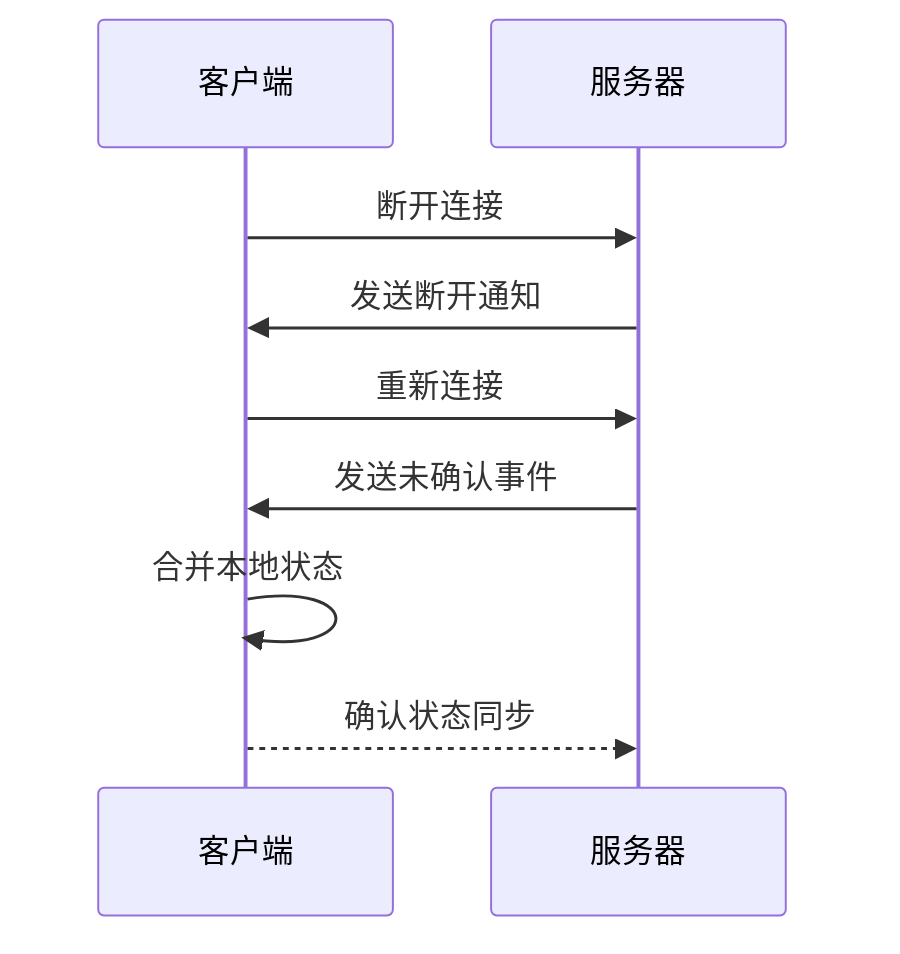
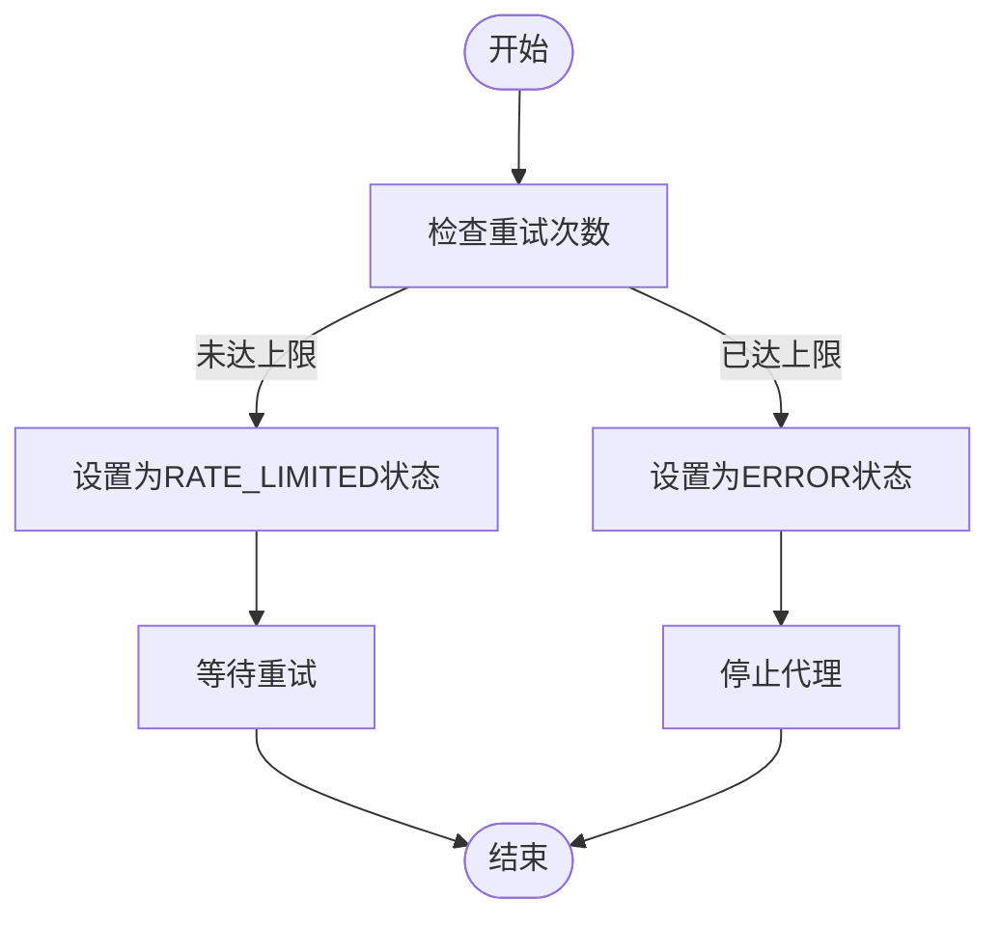
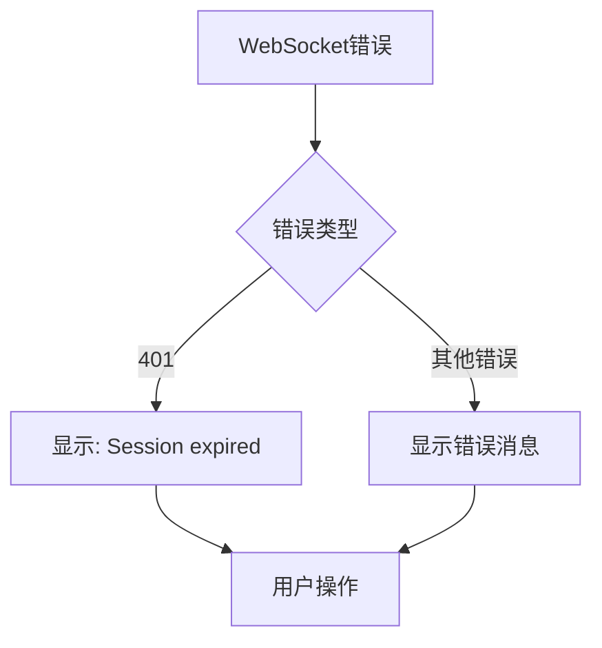
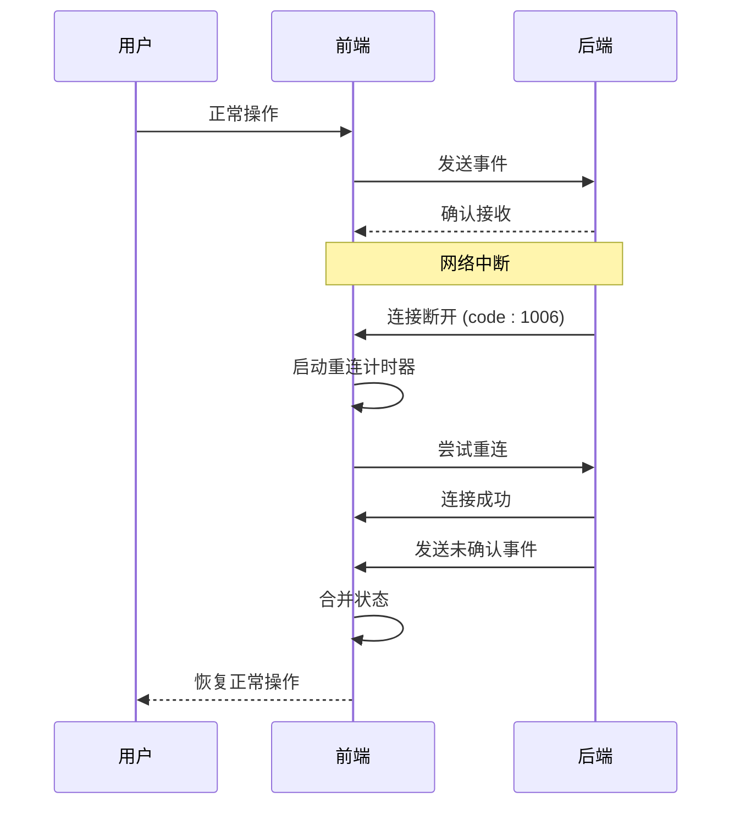

# 冲突解决

<cite>
**本文档引用的文件**
- [standalone_conversation_manager.py](file://openhands/server/conversation_manager/standalone_conversation_manager.py)
- [agent_controller.py](file://openhands/controller/agent_controller.py)
- [event_store.py](file://openhands/events/event_store.py)
- [use-websocket.ts](file://frontend/src/hooks/use-websocket.ts)
- [conversation-subscriptions-provider.tsx](file://frontend/src/context/conversation-subscriptions-provider.tsx)
- [rate_limit.py](file://enterprise/server/rate_limit.py)
- [agent-store.ts](file://frontend/src/stores/agent-store.ts)
- [use-event-store.ts](file://frontend/src/stores/use-event-store.ts)
- [use-v0-handle-ws-events.ts](file://frontend/src/hooks/use-v0-handle-ws-events.ts)
</cite>

## 目录
1. [引言](#引言)
2. [状态同步机制](#状态同步机制)
3. [并发更新与冲突解决](#并发更新与冲突解决)
4. [网络异常处理](#网络异常处理)
5. [错误状态处理](#错误状态处理)
6. [实际场景示例](#实际场景示例)
7. [最佳实践建议](#最佳实践建议)
8. [结论](#结论)

## 引言

在OpenHands系统中，状态同步冲突解决机制是确保多用户、多设备环境下数据一致性的关键。当多个客户端同时访问同一会话，或在网络不稳定的情况下，系统需要处理并发状态更新、网络延迟和连接中断等异常情况。本文档详细描述了系统的处理策略，包括前端状态管理（如agent-store）如何处理冲突，状态覆盖策略和版本控制机制，以及错误状态的特殊处理逻辑和用户提示机制。

**本文档引用的文件**
- [standalone_conversation_manager.py](file://openhands/server/conversation_manager/standalone_conversation_manager.py)
- [agent_controller.py](file://openhands/controller/agent_controller.py)
- [event_store.py](file://openhands/events/event_store.py)

## 状态同步机制

OpenHands系统采用基于事件流（event stream）的状态同步机制。每个会话都有一个唯一的事件存储（EventStore），所有状态变更都以事件的形式记录和传播。事件存储通过文件系统持久化，确保数据的可靠性和可恢复性。

**图表来源**
- [event_store.py](file://openhands/events/event_store.py#L43-L184)
- [standalone_conversation_manager.py](file://openhands/server/conversation_manager/standalone_conversation_manager.py#L53-L753)

事件存储的核心是`EventStore`类，它维护一个会话ID（sid）和文件存储（FileStore）的引用。事件按ID顺序存储在文件系统中，通过`cur_id`属性跟踪当前事件ID。系统使用缓存页（_CachePage）优化大量事件的读取性能，减少文件I/O操作。

**本文档引用的文件**
- [event_store.py](file://openhands/events/event_store.py)
- [use-websocket.ts](file://frontend/src/hooks/use-websocket.ts)

## 并发更新与冲突解决

### 状态覆盖策略

系统采用"最后写入获胜"（Last Write Wins）的冲突解决策略。当多个客户端同时提交状态更新时，服务器按接收顺序处理事件，后到达的更新会覆盖先前的状态。这种策略简单高效，适用于大多数场景。

**图表来源**
- [standalone_conversation_manager.py](file://openhands/server/conversation_manager/standalone_conversation_manager.py#L369-L381)
- [event_store.py](file://openhands/events/event_store.py#L138-L142)

### 版本控制机制

系统通过事件ID实现版本控制。每个事件都有唯一的递增ID，客户端在提交更新时可以指定期望的基线版本。如果服务器上的当前版本与期望版本不匹配，更新将被拒绝，客户端需要先同步最新状态再重试。

**图表来源**
- [event_store.py](file://openhands/events/event_store.py#L85-L137)
- [use-event-store.ts](file://frontend/src/stores/use-event-store.ts#L17-L39)

## 网络异常处理

### 连接中断与重连

前端使用`useWebSocket`钩子管理WebSocket连接，实现了自动重连机制。当连接断开时，系统会根据配置的重连策略尝试重新连接，最多尝试指定次数，每次重试间隔3秒。

**图表来源**
- [use-websocket.ts](file://frontend/src/hooks/use-websocket.ts#L37-L156)
- [conversation-subscriptions-provider.tsx](file://frontend/src/context/conversation-subscriptions-provider.tsx#L242-L260)

### 状态同步恢复

当网络断开重连后，系统会自动恢复状态同步。客户端通过事件ID检查机制确保不会丢失任何更新。服务器在连接建立后，会发送所有未确认的事件，客户端根据事件ID进行去重和排序，确保状态的一致性。

**图表来源**
- [conversation-subscriptions-provider.tsx](file://frontend/src/context/conversation-subscriptions-provider.tsx#L242-L289)
- [use-websocket.ts](file://frontend/src/hooks/use-websocket.ts#L73-L113)

## 错误状态处理

### RATE_LIMITED状态处理

当系统达到速率限制时，会进入`RATE_LIMITED`状态。控制器会根据重试次数决定是暂时等待还是永久停止。如果重试次数未达到上限，代理状态设置为`RATE_LIMITED`，等待重试；如果重试次数耗尽，则设置为`ERROR`状态。

**图表来源**
- [agent_controller.py](file://openhands/controller/agent_controller.py#L346-L363)
- [rate_limit.py](file://enterprise/server/rate_limit.py#L1-L137)

### ERROR状态处理

当发生不可恢复的错误时，系统进入`ERROR`状态。前端通过`useV0HandleWSEvents`钩子监听WebSocket事件，根据错误类型显示相应的用户提示。对于会话过期错误（401），显示"Session expired"提示；对于其他错误，显示具体的错误消息。

**图表来源**
- [use-v0-handle-ws-events.ts](file://frontend/src/hooks/use-v0-handle-ws-events.ts#L16-L48)
- [agent-store.ts](file://frontend/src/stores/agent-store.ts#L1-L22)

## 实际场景示例

### 网络断开重连后的状态同步恢复

当用户在网络不稳定的情况下使用OpenHands时，可能会遇到连接中断的情况。系统通过以下步骤确保状态同步的恢复：

1. **连接断开检测**：WebSocket的`onclose`事件被触发，系统记录断开原因。
2. **自动重连**：根据配置的重连策略，系统尝试重新建立连接。
3. **状态同步**：连接成功后，服务器发送所有未确认的事件。
4. **本地状态合并**：客户端根据事件ID合并本地状态，确保数据一致性。

**图表来源**
- [use-websocket.ts](file://frontend/src/hooks/use-websocket.ts#L73-L113)
- [conversation-subscriptions-provider.tsx](file://frontend/src/context/conversation-subscriptions-provider.tsx#L242-L289)

## 最佳实践建议

1. **合理设置重连策略**：根据应用场景设置合适的重连间隔和最大尝试次数，避免过于频繁的重连请求。
2. **优化事件处理**：前端应高效处理事件流，避免在事件处理中执行耗时操作，确保UI响应性。
3. **状态一致性检查**：在关键操作前，检查本地状态与服务器状态的一致性，必要时主动同步最新状态。
4. **用户友好的错误提示**：为不同类型的错误提供清晰、具体的用户提示，帮助用户理解问题并采取相应措施。
5. **监控和日志**：启用详细的日志记录，监控连接状态和错误事件，便于问题排查和系统优化。

**本文档引用的文件**
- [use-websocket.ts](file://frontend/src/hooks/use-websocket.ts)
- [use-v0-handle-ws-events.ts](file://frontend/src/hooks/use-v0-handle-ws-events.ts)

## 结论

OpenHands系统的状态同步冲突解决机制通过事件流、版本控制和自动重连等技术，有效处理了并发更新、网络延迟和连接中断等异常情况。前端状态管理（如agent-store）与后端事件存储协同工作，确保了数据的一致性和用户体验的流畅性。通过合理的错误状态处理和用户提示机制，系统能够在各种异常情况下保持稳定运行，为用户提供可靠的开发辅助服务。