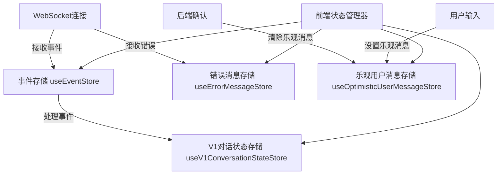
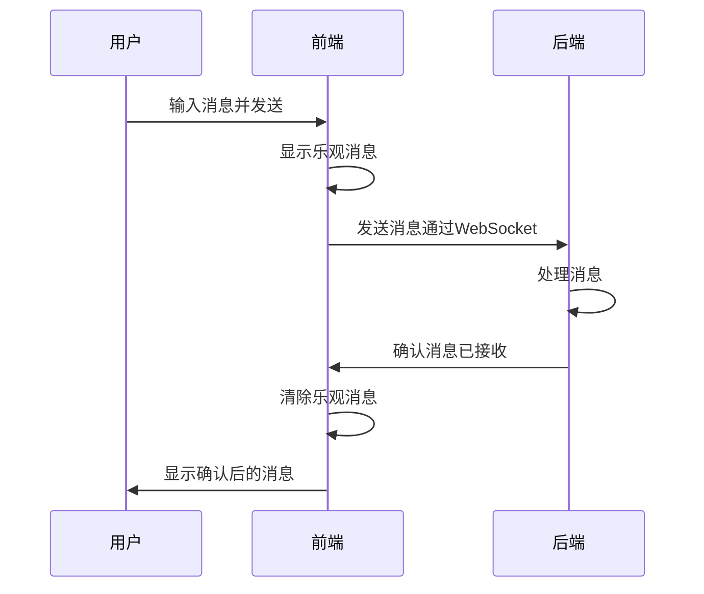
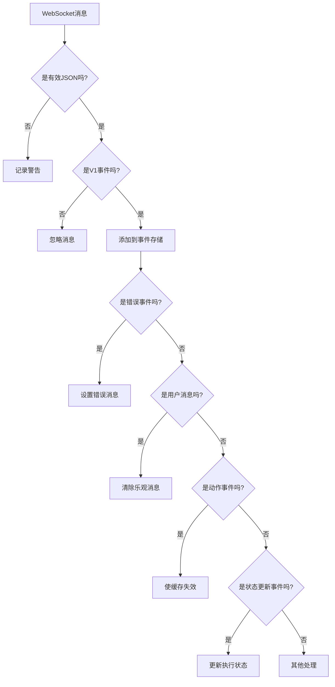
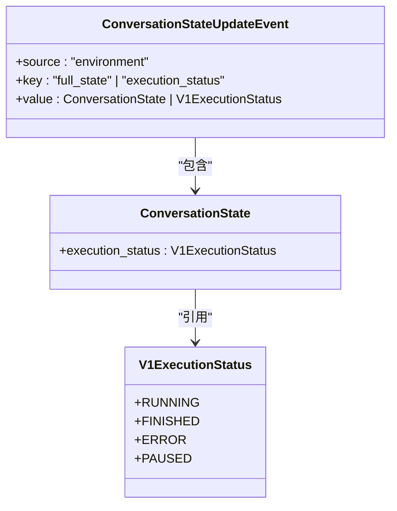
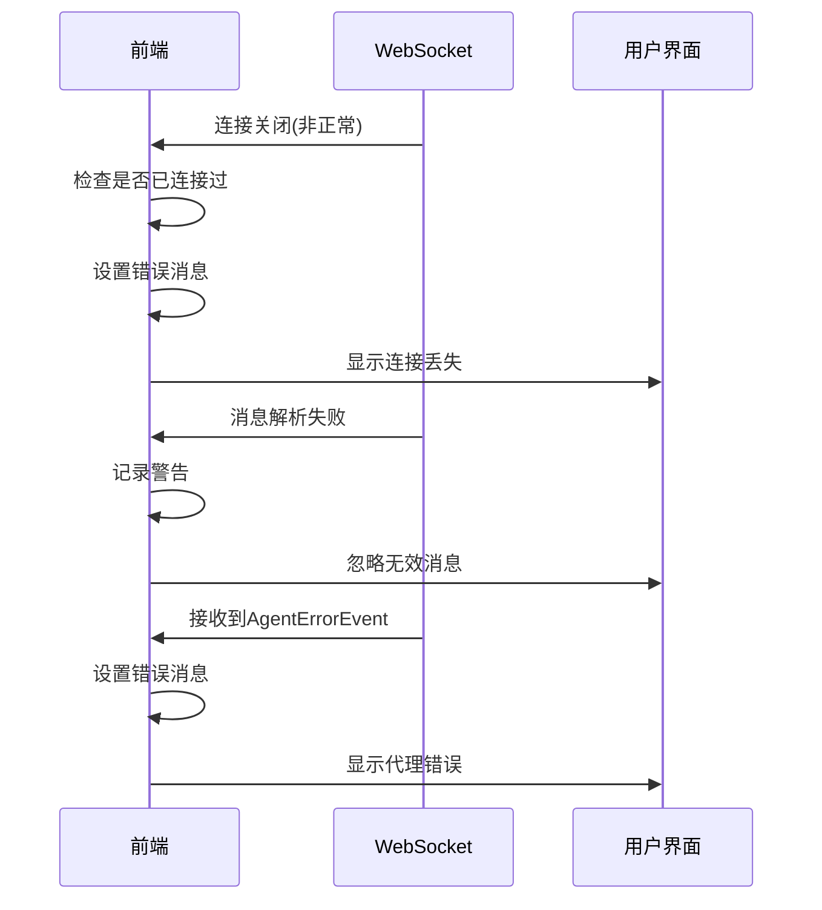
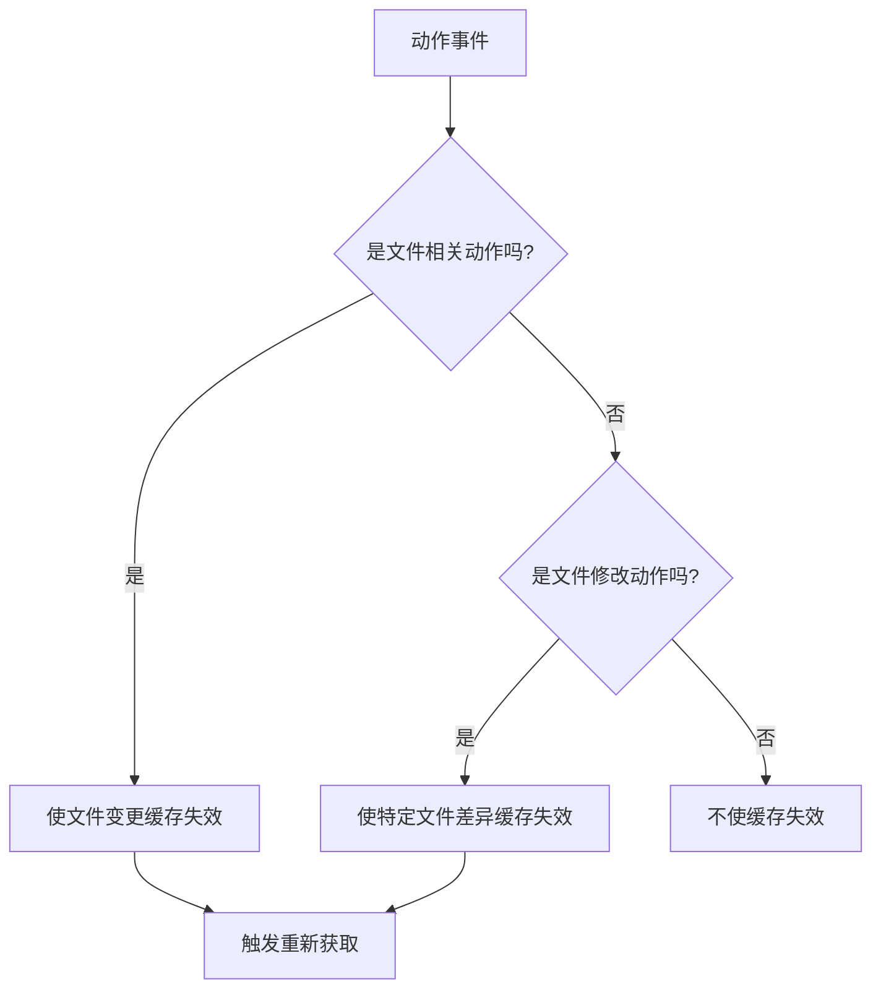
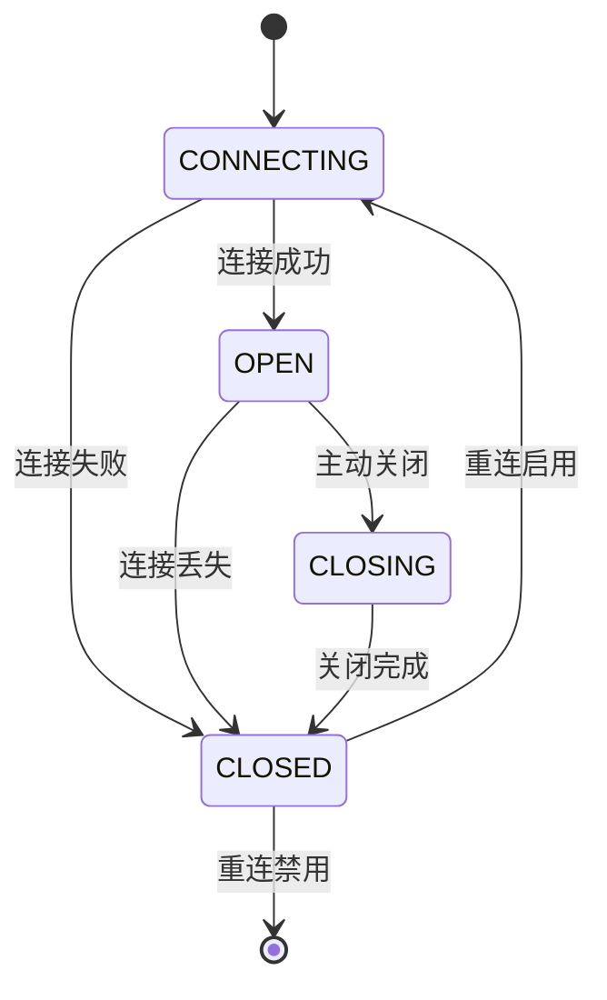

# 状态合并机制

<cite>
**本文档引用的文件**
- [conversation-websocket-context.tsx](file://frontend/src/contexts/conversation-websocket-context.tsx)
- [optimistic-user-message-store.ts](file://frontend/src/stores/optimistic-user-message-store.ts)
- [error-message-store.ts](file://frontend/src/stores/error-message-store.ts)
- [v1-conversation-state-store.ts](file://frontend/src/stores/v1-conversation-state-store.ts)
- [use-event-store.ts](file://frontend/src/stores/use-event-store.ts)
- [handle-event-for-ui.ts](file://frontend/src/utils/handle-event-for-ui.ts)
- [cache-utils.ts](file://frontend/src/utils/cache-utils.ts)
- [event-service.api.ts](file://frontend/src/api/event-service/event-service.api.ts)
- [conversation-state-event.ts](file://frontend/src/types/v1/core/events/conversation-state-event.ts)
- [type-guards.ts](file://frontend/src/types/v1/type-guards.ts)
- [use-websocket.ts](file://frontend/src/hooks/use-websocket.ts)
</cite>

## 目录
1. [简介](#简介)
2. [状态管理架构](#状态管理架构)
3. [乐观更新机制](#乐观更新机制)
4. [后端状态更新处理](#后端状态更新处理)
5. [并发更新与冲突检测](#并发更新与冲突检测)
6. [错误处理与恢复机制](#错误处理与恢复机制)
7. [缓存管理策略](#缓存管理策略)
8. [WebSocket连接管理](#websocket连接管理)
9. [结论](#结论)

## 简介

OpenHands项目实现了一套完整的状态合并机制，用于管理前端与后端之间的状态同步。该机制通过WebSocket实时通信，结合乐观更新、冲突检测和错误恢复策略，确保用户界面与系统状态保持一致。本文档详细描述了状态合并的实现细节，包括状态存储、事件处理、并发控制和错误处理等关键组件。

**状态合并机制的核心目标**是解决前后端状态不一致的问题，特别是在网络延迟、连接中断或并发操作等异常情况下，确保用户体验的流畅性和数据的一致性。系统采用了乐观更新策略，允许用户立即看到操作反馈，同时通过后端确认机制确保最终一致性。

## 状态管理架构

OpenHands前端采用Zustand状态管理库来维护应用状态，通过多个专用的状态存储来管理不同类型的状态数据。这种模块化的状态管理架构提高了代码的可维护性和可测试性。

**架构来源**
- [conversation-websocket-context.tsx](file://frontend/src/contexts/conversation-websocket-context.tsx#L61-L72)
- [use-event-store.ts](file://frontend/src/stores/use-event-store.ts#L17-L38)
- [error-message-store.ts](file://frontend/src/stores/error-message-store.ts#L18-L30)
- [optimistic-user-message-store.ts](file://frontend/src/stores/optimistic-user-message-store.ts#L20-L35)
- [v1-conversation-state-store.ts](file://frontend/src/stores/v1-conversation-state-store.ts#L18-L27)

**状态来源**
- [conversation-websocket-context.tsx](file://frontend/src/contexts/conversation-websocket-context.tsx#L67-L71)
- [use-event-store.ts](file://frontend/src/stores/use-event-store.ts#L17-L38)

## 乐观更新机制

乐观更新是OpenHands状态管理的核心策略，它允许用户在发送请求后立即看到操作结果，而无需等待后端确认。这种机制显著提升了用户体验，特别是在网络延迟较高的情况下。

**乐观更新来源**
- [optimistic-user-message-store.ts](file://frontend/src/stores/optimistic-user-message-store.ts#L3-L35)
- [conversation-websocket-context.tsx](file://frontend/src/contexts/conversation-websocket-context.tsx#L138-L140)

乐观更新机制通过`useOptimisticUserMessageStore`实现，该存储管理用户发送但尚未被后端确认的消息。当用户发送消息时，系统立即在界面显示该消息（乐观显示），同时通过WebSocket发送到后端。一旦收到后端的确认，系统会清除乐观消息，完成状态合并。

## 后端状态更新处理

前端通过WebSocket连接接收后端的状态更新，并根据事件类型进行相应的状态合并操作。系统实现了类型安全的事件处理机制，确保只有符合预期结构的事件才会被处理。

**后端状态更新来源**
- [conversation-websocket-context.tsx](file://frontend/src/contexts/conversation-websocket-context.tsx#L129-L162)
- [type-guards.ts](file://frontend/src/types/v1/type-guards.ts#L152-L158)

当WebSocket接收到消息时，系统首先解析JSON，然后使用类型守卫`isV1Event`验证事件结构。验证通过后，根据事件类型进行相应的处理：错误事件更新错误消息存储，用户消息事件清除乐观消息，动作事件使相关缓存失效，状态更新事件更新对话执行状态。

## 并发更新与冲突检测

系统通过事件序列和状态版本控制来处理并发更新，确保状态合并的正确性。虽然当前实现主要依赖后端的单线程处理来避免并发冲突，但前端也实现了相应的冲突检测和处理机制。

**并发更新来源**
- [conversation-state-event.ts](file://frontend/src/types/v1/core/events/conversation-state-event.ts#L12-L47)
- [type-guards.ts](file://frontend/src/types/v1/type-guards.ts#L127-L139)

系统通过`ConversationStateUpdateEvent`事件来传递状态更新，其中包含`execution_status`字段表示对话的执行状态。前端通过监听这些事件来更新本地状态，确保与后端保持同步。类型守卫函数`isConversationStateUpdateEvent`、`isFullStateConversationStateUpdateEvent`和`isAgentStatusConversationStateUpdateEvent`用于安全地处理不同类型的状态更新事件。

## 错误处理与恢复机制

系统实现了全面的错误处理机制，包括连接错误、消息解析错误和业务逻辑错误的处理。错误信息通过专门的存储进行管理，并在用户界面中显示。

**错误处理来源**
- [conversation-websocket-context.tsx](file://frontend/src/contexts/conversation-websocket-context.tsx#L227-L243)
- [error-message-store.ts](file://frontend/src/stores/error-message-store.ts#L18-L30)
- [conversation-websocket-context.tsx](file://frontend/src/contexts/conversation-websocket-context.tsx#L133-L135)

错误处理机制的关键特点是区分临时错误和永久错误。对于WebSocket连接，系统只在成功连接后出现断开时才显示错误消息，避免在初始连接阶段显示不必要的错误。对于AgentErrorEvent，系统直接将错误信息传递给错误消息存储，以便在用户界面中显示。

## 缓存管理策略

系统实现了智能的缓存管理策略，通过监听特定事件来使相关缓存失效，确保数据的一致性。这种策略平衡了性能和数据新鲜度，避免了不必要的API调用。

**缓存管理来源**
- [cache-utils.ts](file://frontend/src/utils/cache-utils.ts#L17-L49)
- [conversation-websocket-context.tsx](file://frontend/src/contexts/conversation-websocket-context.tsx#L143-L151)

缓存管理通过`handleActionEventCacheInvalidation`函数实现，该函数监听动作事件并根据事件类型使相关缓存失效。对于文件编辑、文件写入和执行Bash命令等可能改变文件状态的动作，系统会使`file_changes`缓存失效。对于特定文件的修改，系统还会使该文件的差异缓存失效，确保用户看到最新的文件内容。

## WebSocket连接管理

WebSocket连接管理是状态合并机制的基础，系统实现了可靠的连接、重连和状态同步机制，确保前后端通信的稳定性。

**WebSocket管理来源**
- [use-websocket.ts](file://frontend/src/hooks/use-websocket.ts#L19-L192)
- [conversation-websocket-context.tsx](file://frontend/src/contexts/conversation-websocket-context.tsx#L286-L302)

WebSocket连接管理实现了自动重连机制，当连接意外断开时，系统会尝试重新连接。为了防止无限重连，系统限制了重连尝试次数，并在每次重连前等待一段时间。连接状态通过`connectionState`变量在组件间共享，确保UI能正确反映连接状态。

## 结论

OpenHands的状态合并机制通过乐观更新、事件驱动的架构和智能缓存管理，实现了前后端状态的高效同步。系统在用户体验和数据一致性之间取得了良好平衡，即使在网络不稳定的情况下也能提供流畅的交互体验。

关键优势包括：
- **即时反馈**：通过乐观更新，用户操作后立即看到结果
- **最终一致性**：通过后端确认机制确保数据最终一致
- **错误弹性**：完善的错误处理和恢复机制提高系统可靠性
- **性能优化**：智能缓存管理减少不必要的API调用

未来可以进一步增强的方面包括：
- 实现更精细的冲突解决策略
- 增加离线模式支持
- 优化大规模事件流的处理性能
- 增强状态合并的可观察性和调试能力

这套状态合并机制为复杂的实时协作应用提供了坚实的基础，确保了用户界面与系统状态的高度一致性。