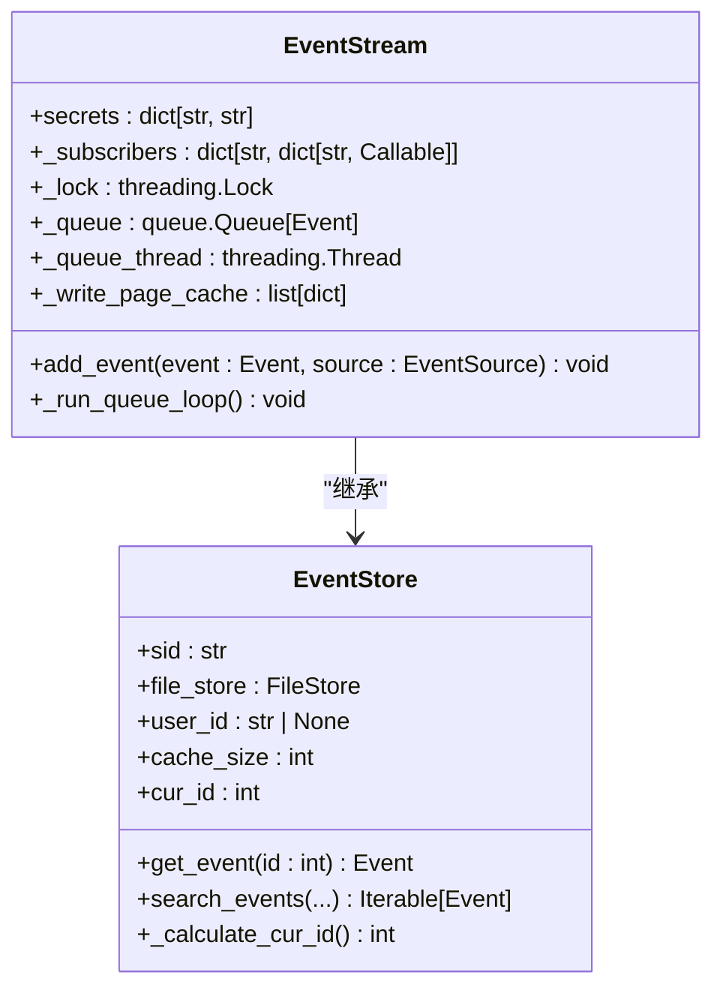
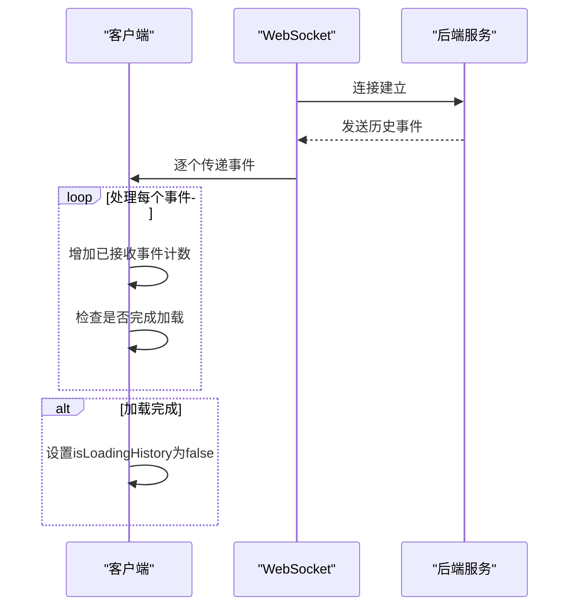
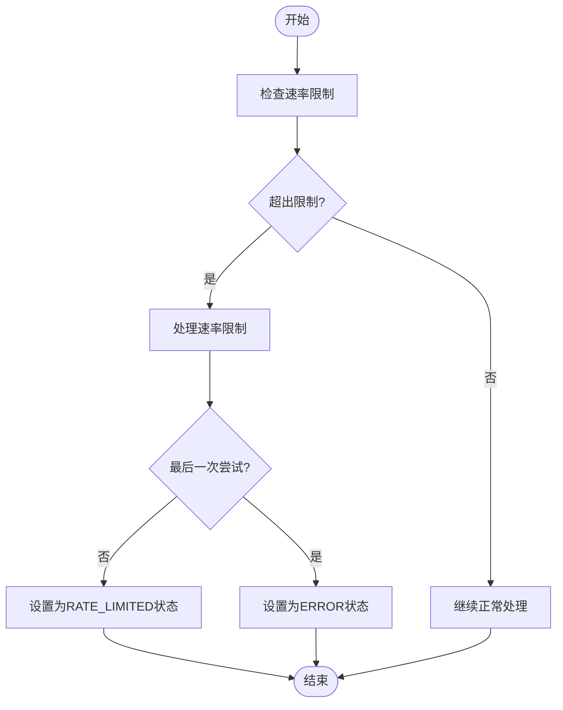

# 网络恢复策略

<cite>
**本文档引用的文件**
- [use-websocket.ts](file://frontend/src/hooks/use-websocket.ts)
- [conversation-websocket-context.tsx](file://frontend/src/contexts/conversation-websocket-context.tsx)
- [websocket-url.ts](file://frontend/src/utils/websocket-url.ts)
- [event_store.py](file://openhands/events/event_store.py)
- [stream.py](file://openhands/events/stream.py)
- [error-handler.ts](file://frontend/src/utils/error-handler.ts)
- [rate_limit.py](file://enterprise/server/rate_limit.py)
- [agent_controller.py](file://openhands/controller/agent_controller.py)
- [request.py](file://openhands/runtime/utils/request.py)
</cite>

## 目录
1. [引言](#引言)
2. [WebSocket自动重连机制](#websocket自动重连机制)
3. [指数退避算法实现](#指数退避算法实现)
4. [离线消息缓存与状态同步](#离线消息缓存与状态同步)
5. [错误处理与用户提示](#错误处理与用户提示)
6. [最佳实践](#最佳实践)

## 引言
本网络恢复策略文档详细描述了OpenHands系统中WebSocket连接断开后的自动重连机制。系统通过精心设计的重连策略、消息缓存机制和状态同步流程，确保在网络不稳定或临时中断的情况下，用户能够获得无缝的体验。文档将深入解析重连间隔的指数退避算法实现，说明如何通过事件队列缓存离线期间的消息，以及连接恢复后如何进行状态同步。同时，文档还将介绍错误处理机制，包括连续重连失败时的用户提示和手动重试选项。

## WebSocket自动重连机制
OpenHands系统通过前端的`useWebSocket`自定义Hook实现了WebSocket的自动重连机制。该机制在连接意外断开时能够自动尝试重新建立连接，确保通信的连续性。

当WebSocket连接关闭时，系统会检查关闭事件的代码。如果代码不是1000（表示正常关闭），则视为错误关闭，并触发重连逻辑。重连机制通过`reconnect`选项进行配置，包括是否启用重连和最大重连次数。系统使用`WeakSet`数据结构来跟踪允许重连的WebSocket实例，确保只有有效的连接实例才能尝试重连。

重连过程在`onclose`事件处理程序中启动。系统首先检查重连是否启用、当前实例是否允许重连、是否应该重连以及重连次数是否未超过限制。如果所有条件都满足，系统将设置`isReconnecting`状态为`true`，增加重连尝试计数，并设置一个定时器来延迟执行重连操作。

**Section sources**
- [use-websocket.ts](file://frontend/src/hooks/use-websocket.ts#L73-L112)

## 指数退避算法实现
虽然当前代码实现中使用了固定的3秒延迟进行重连，但系统架构为实现指数退避算法提供了良好的基础。指数退避算法是一种网络策略，其中重试之间的延迟随每次失败的尝试而增加，通常以指数方式增长。

在`useWebSocket` Hook中，重连延迟是通过`setTimeout`函数实现的，当前硬编码为3000毫秒。要实现指数退避，可以修改此逻辑，使延迟时间随着`attemptCountRef.current`的增加而指数增长。例如，可以使用公式`delay = baseDelay * 2^n`，其中`n`是尝试次数。

这种算法有助于减轻服务器压力，避免在网络拥塞时产生更多的连接请求。它还为网络问题提供了时间来解决，从而提高了后续重连成功的可能性。虽然当前实现使用固定延迟，但其设计允许轻松升级到更复杂的指数退避策略。

**Section sources**
- [use-websocket.ts](file://frontend/src/hooks/use-websocket.ts#L107-L109)

## 离线消息缓存与状态同步
OpenHands系统通过事件流（EventStream）和事件存储（EventStore）机制实现了离线消息的缓存和状态同步。当WebSocket连接断开时，系统能够缓存离线期间的消息，并在连接恢复后进行状态同步。

### 事件流与存储机制
`EventStream`类继承自`EventStore`，负责管理事件的队列和分发。它使用一个线程安全的队列来存储待处理的事件，并通过`_write_page_cache`属性缓存待写入的事件数据。当事件被添加到流中时，它首先被序列化并添加到当前写页面缓存中。当缓存页面满时，会创建一个新的空页面供后续事件使用。

**Diagram sources**
- [stream.py](file://openhands/events/stream.py#L43-L184)
- [event_store.py](file://openhands/events/event_store.py#L43-L184)

### 状态同步流程
当WebSocket连接恢复后，系统会从后端获取最新的状态以进行同步。在`ConversationWebSocketProvider`中，当连接打开时，系统会调用`EventService.getEventCount`获取预期的事件数量，并将其设置为`expectedEventCount`。同时，系统会跟踪已接收的事件数量。

通过比较已接收事件数量和预期事件数量，系统能够确定历史消息加载是否完成。当已接收事件数量大于或等于预期事件数量时，系统将`isLoadingHistory`状态设置为`false`，表示状态同步已完成。

**Diagram sources**
- [conversation-websocket-context.tsx](file://frontend/src/contexts/conversation-websocket-context.tsx#L100-L107)
- [conversation-websocket-context.tsx](file://frontend/src/contexts/conversation-websocket-context.tsx#L212-L215)

## 错误处理与用户提示
OpenHands系统实现了全面的错误处理机制，包括错误跟踪、用户提示和重试策略。

### 前端错误处理
前端通过`error-handler.ts`文件中的函数处理错误。`trackError`函数使用PostHog服务捕获异常，并附加错误源和元数据。`showErrorToast`和`showChatError`函数在显示错误提示的同时调用`trackError`进行错误跟踪。

当WebSocket连接失败时，系统会根据是否已成功连接过来决定是否显示错误消息。如果之前已成功连接，则在连接丢失时显示"Connection lost"消息；否则，显示"Failed to connect to server"消息。这种策略避免了在初始连接尝试期间显示不必要的错误。

### 后端速率限制处理
后端实现了基于Redis的速率限制机制。`RateLimiter`类使用固定窗口策略来限制请求频率。当速率限制被触发时，系统会抛出`RateLimitException`，并在响应头中包含`X-RateLimit-Limit`、`X-RateLimit-Remaining`、`X-RateLimit-Reset`和`Retry-After`等信息。

在代理控制器中，当遇到`RateLimitError`时，系统会检查是否是最后一次重试尝试。如果不是最后一次尝试，代理状态将设置为`RATE_LIMITED`；如果是最后一次尝试，状态将设置为`ERROR`，并显示相应的错误消息。

**Diagram sources**
- [rate_limit.py](file://enterprise/server/rate_limit.py#L50-L80)
- [agent_controller.py](file://openhands/controller/agent_controller.py#L347-L362)

**Section sources**
- [error-handler.ts](file://frontend/src/utils/error-handler.ts#L1-L42)
- [rate_limit.py](file://enterprise/server/rate_limit.py#L1-L137)
- [agent_controller.py](file://openhands/controller/agent_controller.py#L346-L363)

## 最佳实践
基于对OpenHands系统网络恢复策略的分析，以下是实施类似功能的最佳实践：

1. **优雅的重连机制**：实现自动重连时，应考虑使用指数退避算法，避免在网络拥塞时产生过多的连接请求。同时，应设置最大重连次数，防止无限重试。

2. **状态同步**：在连接恢复后，应从服务器获取最新的状态信息，确保客户端状态与服务器状态一致。可以通过比较事件ID或时间戳来确定需要同步的数据范围。

3. **错误分类处理**：应对不同类型的错误进行分类处理。对于临时性错误（如网络中断），应自动重试；对于永久性错误（如认证失败），应及时通知用户并停止重试。

4. **用户体验**：在显示错误消息时，应考虑用户的上下文。例如，在首次连接尝试时避免显示错误消息，只在成功连接后再次断开时显示，以提供更好的用户体验。

5. **监控与日志**：应记录所有网络相关的错误和重连尝试，便于问题排查和性能分析。使用像PostHog这样的分析工具可以帮助理解错误的发生模式。

6. **资源清理**：在断开连接或组件卸载时，应及时清理定时器和事件监听器，防止内存泄漏。

7. **配置灵活性**：重连策略的相关参数（如重连间隔、最大重连次数等）应可配置，以便根据不同环境和需求进行调整。