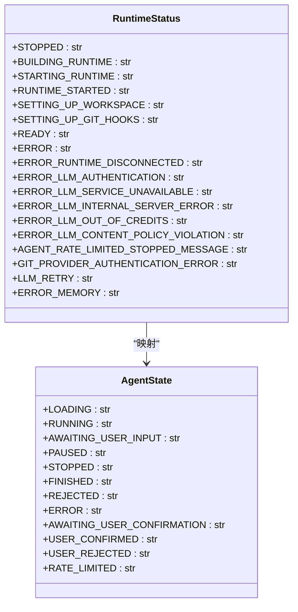
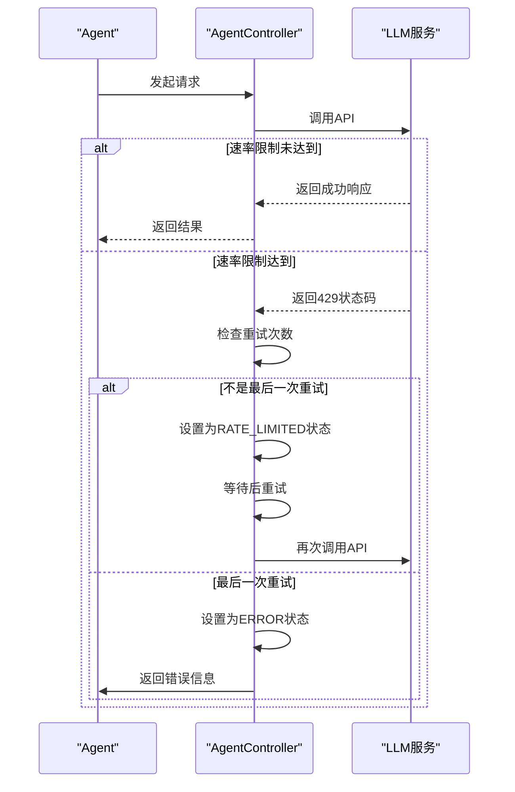
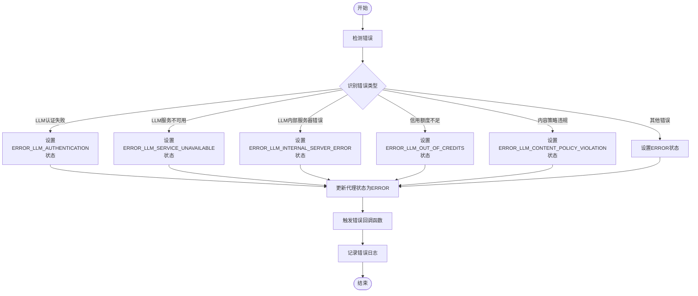
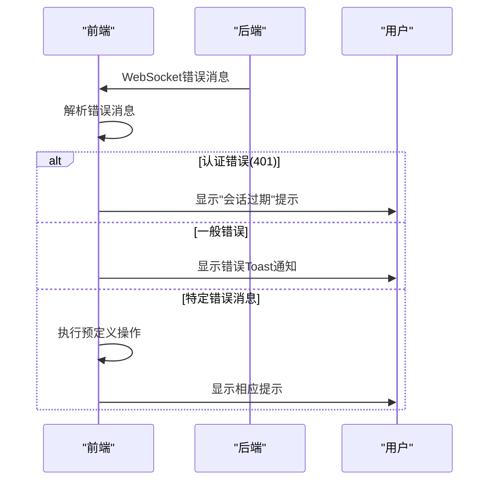
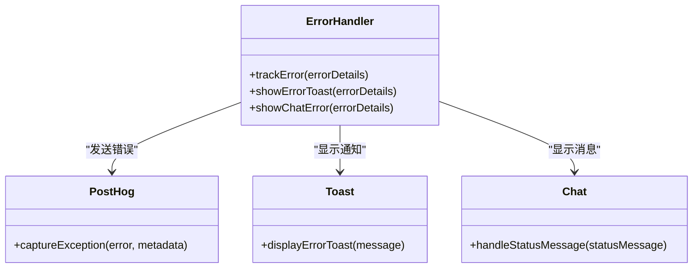
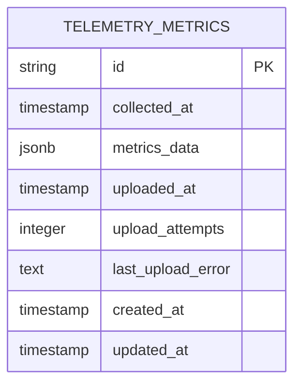
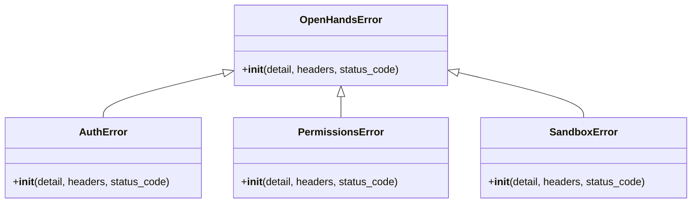
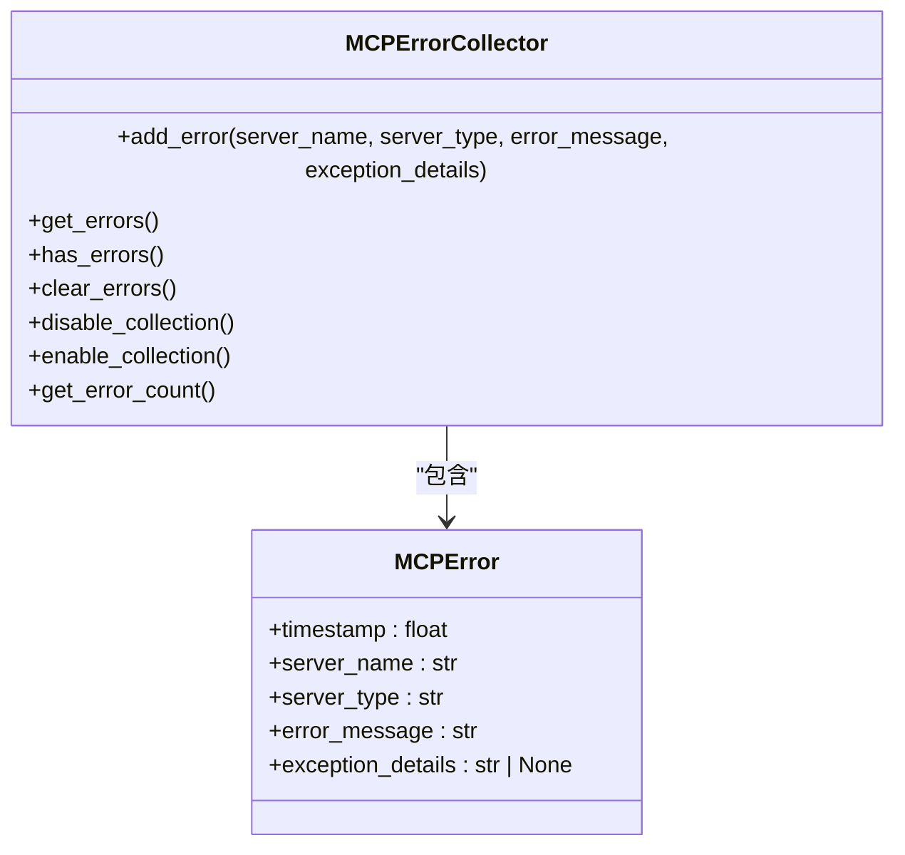
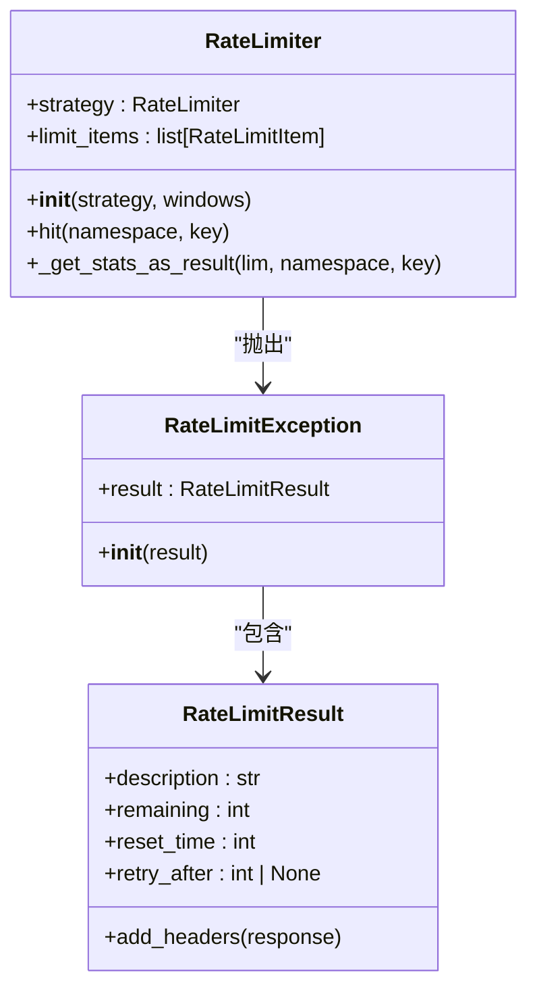

# 错误状态处理

<cite>
**本文档引用的文件**   
- [agent_controller.py](file://openhands/controller/agent_controller.py)
- [runtime_status.py](file://openhands/runtime/runtime_status.py)
- [errors.py](file://openhands/app_server/errors.py)
- [exceptions.py](file://openhands/core/exceptions.py)
- [rate_limit.py](file://enterprise/server/rate_limit.py)
- [error-handler.ts](file://frontend/src/utils/error-handler.ts)
- [use-v0-handle-ws-events.ts](file://frontend/src/hooks/use-v0-handle-ws-events.ts)
- [telemetry_metrics.py](file://enterprise/storage/telemetry_metrics.py)
- [feedback.py](file://enterprise/server/routes/feedback.py)
- [error_collector.py](file://openhands/mcp/error_collector.py)
</cite>

## 目录
1. [引言](#引言)
2. [错误状态分类与严重程度分级](#错误状态分类与严重程度分级)
3. [RATE_LIMITED状态处理流程](#rate_limited状态处理流程)
4. [ERROR状态处理流程](#error状态处理流程)
5. [用户界面反馈机制](#用户界面反馈机制)
6. [错误信息收集与上报策略](#错误信息收集与上报策略)
7. [本地存储策略](#本地存储策略)
8. [常见错误排查指南](#常见错误排查指南)
9. [代码实现示例](#代码实现示例)
10. [结论](#结论)

## 引言
本文档系统阐述OpenHands项目中RATE_LIMITED、ERROR等特殊状态的处理流程。文档详细描述了错误状态的分类体系和严重程度分级，以及对应的用户界面反馈机制。同时，说明了错误信息的收集、上报和本地存储策略，包括如何生成错误报告和提供用户反馈渠道。最后，提供常见错误的排查指南和解决方案，并给出相应的代码实现示例。

## 错误状态分类与严重程度分级
OpenHands项目中的错误状态主要分为两大类：RATE_LIMITED（速率限制）和ERROR（错误）。这些状态通过枚举类型进行定义和管理。

### 错误状态分类体系
错误状态主要分为以下几类：

1. **运行时错误**：包括运行时断开连接、内存错误等
2. **LLM相关错误**：包括LLM认证失败、服务不可用、内部服务器错误、信用额度不足、内容策略违规等
3. **速率限制错误**：当API调用频率超过限制时触发
4. **Git提供商认证错误**：与Git提供商的认证相关错误



**Diagram sources**
- [runtime_status.py](file://openhands/runtime/runtime_status.py#L4-L25)
- [agent.py](file://openhands/core/schema/agent.py#L3-L50)

### 严重程度分级
根据错误的严重程度，可以分为以下几个级别：

1. **严重（Critical）**：导致系统无法正常运行的错误，如ERROR_LLM_INTERNAL_SERVER_ERROR、ERROR_RUNTIME_DISCONNECTED
2. **高（High）**：影响主要功能的错误，如ERROR_LLM_AUTHENTICATION、ERROR_LLM_SERVICE_UNAVAILABLE
3. **中（Medium）**：影响部分功能的错误，如ERROR_LLM_OUT_OF_CREDITS、ERROR_LLM_CONTENT_POLICY_VIOLATION
4. **低（Low）**：暂时性或可恢复的错误，如RATE_LIMITED

**Section sources**
- [runtime_status.py](file://openhands/runtime/runtime_status.py#L4-L25)
- [agent.py](file://openhands/core/schema/agent.py#L3-L50)

## RATE_LIMITED状态处理流程
RATE_LIMITED状态表示系统或服务的API调用频率已达到限制。该状态的处理流程包括检测、重试和最终处理三个阶段。

### 处理流程
当系统检测到速率限制时，会按照以下流程进行处理：

1. 检测到速率限制错误（RateLimitError）
2. 检查是否为最后一次重试尝试
3. 如果不是最后一次重试，则设置为RATE_LIMITED状态并进行重试
4. 如果是最后一次重试，则设置为ERROR状态并停止



**Diagram sources**
- [agent_controller.py](file://openhands/controller/agent_controller.py#L346-L363)
- [rate_limit.py](file://enterprise/server/rate_limit.py#L123-L137)

### 重试机制
系统实现了智能重试机制，包括：

1. 指数退避等待：每次重试的等待时间呈指数增长
2. 重试次数限制：可配置最大重试次数
3. 温度参数调整：对于LLMNoResponseError，会自动调整temperature参数

**Section sources**
- [agent_controller.py](file://openhands/controller/agent_controller.py#L346-L363)
- [retry_mixin.py](file://openhands/llm/retry_mixin.py#L1-L101)

## ERROR状态处理流程
ERROR状态表示系统发生了不可恢复的错误。该状态的处理流程包括错误检测、状态更新和错误报告三个阶段。

### 处理流程
当系统检测到错误时，会按照以下流程进行处理：

1. 捕获异常并识别错误类型
2. 根据错误类型设置相应的运行时状态
3. 更新代理状态为ERROR
4. 触发错误回调函数
5. 记录错误日志



**Diagram sources**
- [agent_controller.py](file://openhands/controller/agent_controller.py#L346-L363)
- [runtime_status.py](file://openhands/runtime/runtime_status.py#L4-L25)

### 错误类型处理
不同类型的错误有不同的处理方式：

1. **LLM认证失败**：提示用户检查API密钥配置
2. **LLM服务不可用**：建议用户稍后重试
3. **LLM内部服务器错误**：记录错误并建议用户联系支持
4. **信用额度不足**：提示用户充值或更换LLM服务
5. **内容策略违规**：提示用户修改请求内容

**Section sources**
- [agent_controller.py](file://openhands/controller/agent_controller.py#L346-L363)
- [runtime_status.py](file://openhands/runtime/runtime_status.py#L4-L25)

## 用户界面反馈机制
系统通过多种方式向用户反馈错误状态，确保用户能够及时了解系统状态并采取相应措施。

### 前端错误处理
前端通过WebSocket接收错误消息，并根据消息类型进行相应处理：

1. 对于认证错误（401），显示会话过期提示
2. 对于一般错误，显示错误Toast通知
3. 对于特定错误消息，执行相应操作



**Diagram sources**
- [use-v0-handle-ws-events.ts](file://frontend/src/hooks/use-v0-handle-ws-events.ts#L1-L48)
- [error-handler.ts](file://frontend/src/utils/error-handler.ts#L1-L42)

### 错误消息显示
系统使用PostHog进行错误跟踪和分析：

1. `trackError`：将错误信息发送到PostHog进行分析
2. `showErrorToast`：显示错误Toast通知
3. `showChatError`：在聊天界面显示错误消息



**Diagram sources**
- [error-handler.ts](file://frontend/src/utils/error-handler.ts#L1-L42)
- [actions.test.ts](file://frontend/src/services/__tests__/actions.test.ts#L54-L105)

**Section sources**
- [error-handler.ts](file://frontend/src/utils/error-handler.ts#L1-L42)
- [use-v0-handle-ws-events.ts](file://frontend/src/hooks/use-v0-handle-ws-events.ts#L1-L48)

## 错误信息收集与上报策略
系统实现了完善的错误信息收集和上报机制，用于监控系统健康状况和改进服务质量。

### 收集策略
错误信息收集主要包括以下内容：

1. **错误基本信息**：错误消息、错误源、时间戳
2. **上下文信息**：会话ID、用户ID、操作上下文
3. **技术细节**：堆栈跟踪、请求参数、响应数据

### 上报机制
错误信息通过以下方式上报：

1. **实时上报**：通过PostHog实时发送错误信息
2. **批量上报**：定期收集系统指标并批量上报
3. **手动上报**：用户可以通过反馈渠道手动提交错误报告

```mermaid
flowchart TD
Start([错误发生]) --> CollectInfo["收集错误信息"]
CollectInfo --> AddContext["添加上下文信息"]
AddContext --> StoreLocally["本地存储"]
StoreLocally --> alt 实时上报
SendToPostHog["发送到PostHog"]
else 批量上报
AddToBatch["添加到批量队列"]
CheckBatchSize{"批次大小达到阈值?"}
CheckBatchSize --> |是| SendBatch["批量发送"]
CheckBatchSize --> |否| WaitMore["等待更多数据"]
end
SendToPostHog --> End([完成])
SendBatch --> End
```

**Diagram sources**
- [telemetry_metrics.py](file://enterprise/storage/telemetry_metrics.py#L1-L156)
- [feedback.py](file://enterprise/server/routes/feedback.py#L1-L150)

### 反馈渠道
系统提供了多种用户反馈渠道：

1. **对话内反馈**：在每个对话事件旁提供反馈按钮
2. **评分系统**：1-5分的Likert量表评分
3. **原因说明**：用户可以输入反馈原因
4. **批量反馈**：获取对话中所有事件的反馈状态

**Section sources**
- [telemetry_metrics.py](file://enterprise/storage/telemetry_metrics.py#L1-L156)
- [feedback.py](file://enterprise/server/routes/feedback.py#L1-L150)

## 本地存储策略
系统实现了完善的本地存储策略，确保错误信息在各种情况下都能被妥善保存。

### 存储结构
错误信息存储在数据库中，主要包含以下字段：

1. **id**：唯一标识符（UUID）
2. **collected_at**：收集时间
3. **metrics_data**：指标数据（JSONB格式）
4. **uploaded_at**：上传时间
5. **upload_attempts**：上传尝试次数
6. **last_upload_error**：最后一次上传错误
7. **created_at**：创建时间
8. **updated_at**：更新时间



**Diagram sources**
- [078_create_telemetry_tables.py](file://enterprise/migrations/versions/078_create_telemetry_tables.py#L1-L71)
- [telemetry_metrics.py](file://enterprise/storage/telemetry_metrics.py#L1-L156)

### 存储策略
本地存储策略包括：

1. **持久化存储**：所有指标数据都持久化存储在数据库中
2. **上传状态跟踪**：记录每个指标的上传状态和尝试次数
3. **重试机制**：最多尝试3次上传，失败后不再重试
4. **时间戳管理**：精确记录各个时间点，便于问题排查

**Section sources**
- [telemetry_metrics.py](file://enterprise/storage/telemetry_metrics.py#L1-L156)
- [078_create_telemetry_tables.py](file://enterprise/migrations/versions/078_create_telemetry_tables.py#L1-L71)

## 常见错误排查指南
本节提供常见错误的排查指南和解决方案。

### API调用频率限制
**问题描述**：API调用频率超过限制，返回429状态码。

**排查步骤**：
1. 检查当前的API调用频率
2. 查看速率限制配置
3. 检查是否有异常的高频调用
4. 确认是否为预期的重试行为

**解决方案**：
1. 增加速率限制窗口
2. 优化调用频率，避免短时间内大量调用
3. 实现更智能的重试策略
4. 考虑使用缓存减少重复调用

### 认证失效
**问题描述**：LLM服务认证失败，无法访问服务。

**排查步骤**：
1. 检查API密钥是否正确配置
2. 确认API密钥是否过期
3. 验证API密钥是否有足够的权限
4. 检查网络连接是否正常

**解决方案**：
1. 更新API密钥配置
2. 重新生成API密钥
3. 检查服务提供商的认证文档
4. 确保环境变量正确设置

### 资源不足
**问题描述**：系统资源不足，如信用额度耗尽或内存不足。

**排查步骤**：
1. 检查当前资源使用情况
2. 查看资源配额限制
3. 分析资源消耗模式
4. 确认是否有资源泄漏

**解决方案**：
1. 增加资源配额
2. 优化资源使用效率
3. 实现资源使用监控和告警
4. 考虑使用更高效的算法或模型

**Section sources**
- [agent_controller.py](file://openhands/controller/agent_controller.py#L346-L363)
- [runtime_status.py](file://openhands/runtime/runtime_status.py#L4-L25)
- [rate_limit.py](file://enterprise/server/rate_limit.py#L50-L137)

## 代码实现示例
本节提供错误处理的代码实现示例。

### 错误处理类


**Diagram sources**
- [errors.py](file://openhands/app_server/errors.py#L1-L44)

### MCP错误收集器


**Diagram sources**
- [error_collector.py](file://openhands/mcp/error_collector.py#L1-L78)

### 速率限制器


**Diagram sources**
- [rate_limit.py](file://enterprise/server/rate_limit.py#L50-L137)

**Section sources**
- [errors.py](file://openhands/app_server/errors.py#L1-L44)
- [error_collector.py](file://openhands/mcp/error_collector.py#L1-L78)
- [rate_limit.py](file://enterprise/server/rate_limit.py#L50-L137)

## 结论
本文档系统阐述了OpenHands项目中RATE_LIMITED、ERROR等特殊状态的处理流程。通过详细的分类体系和严重程度分级，结合完善的用户界面反馈机制，实现了对各种错误状态的有效管理。错误信息的收集、上报和本地存储策略确保了问题的可追溯性和系统的可维护性。提供的常见错误排查指南和代码实现示例为开发者和用户提供了实用的参考。整体错误处理机制设计合理，能够有效提升系统的稳定性和用户体验。