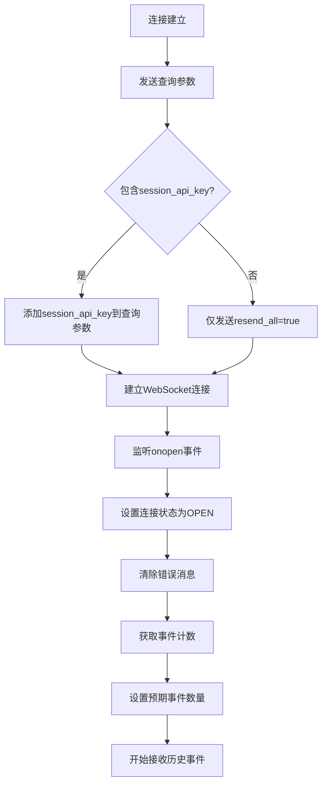
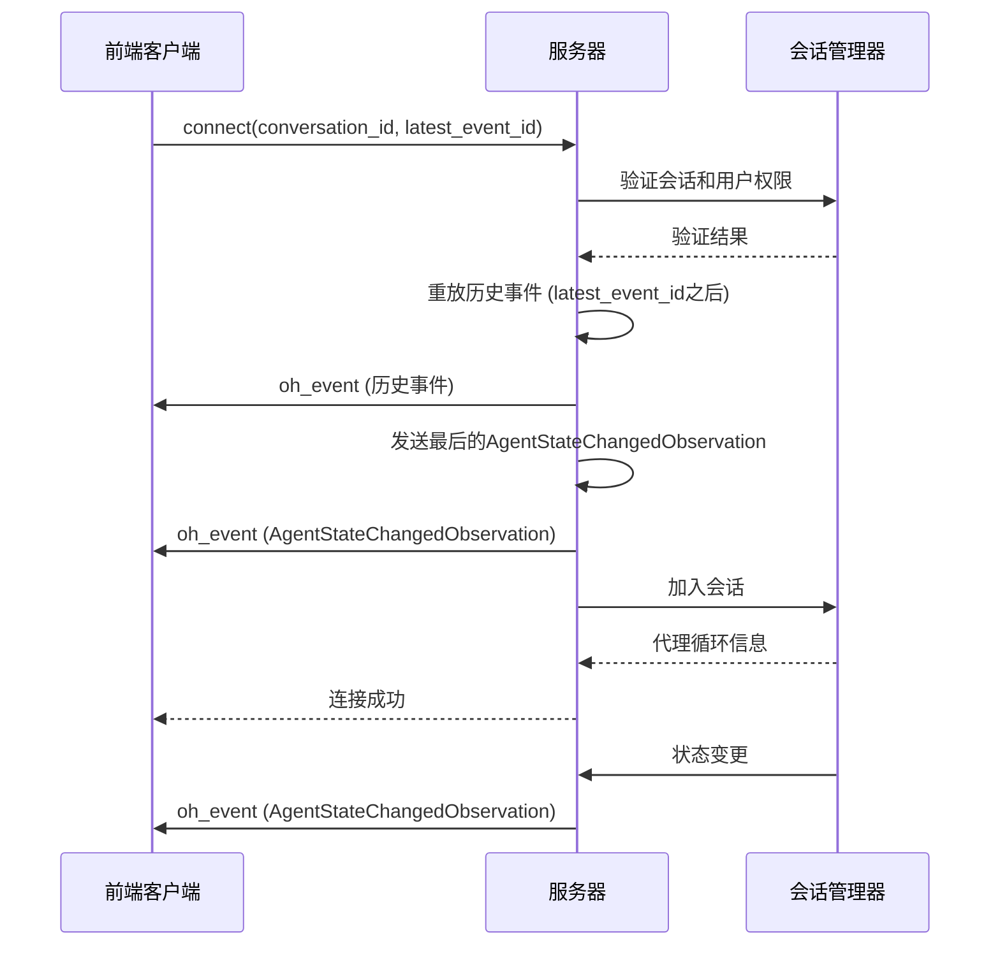
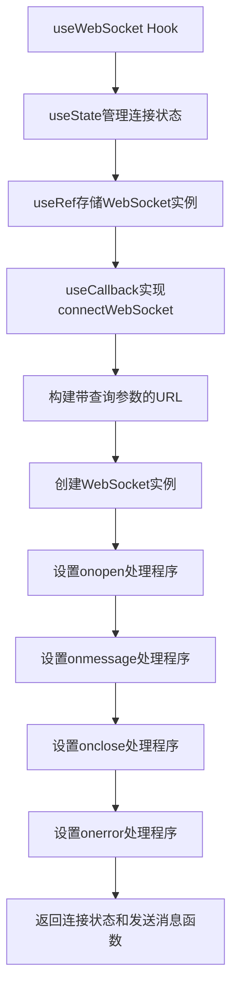
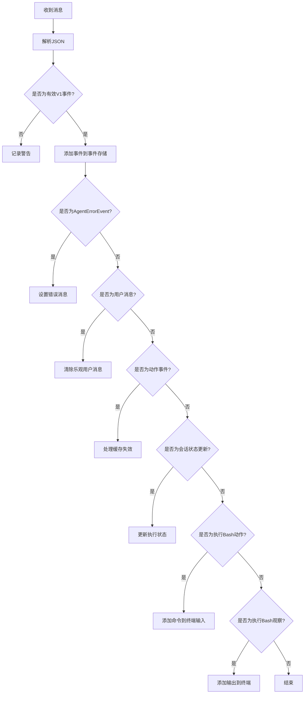
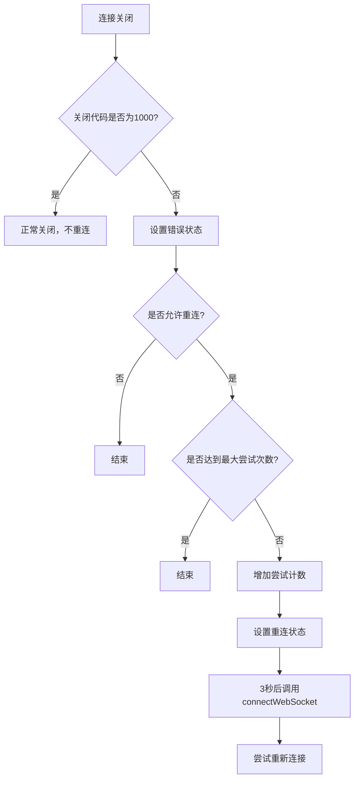
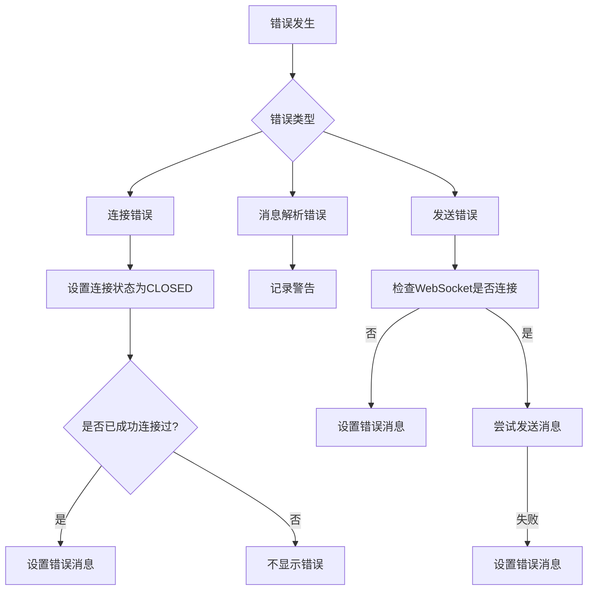
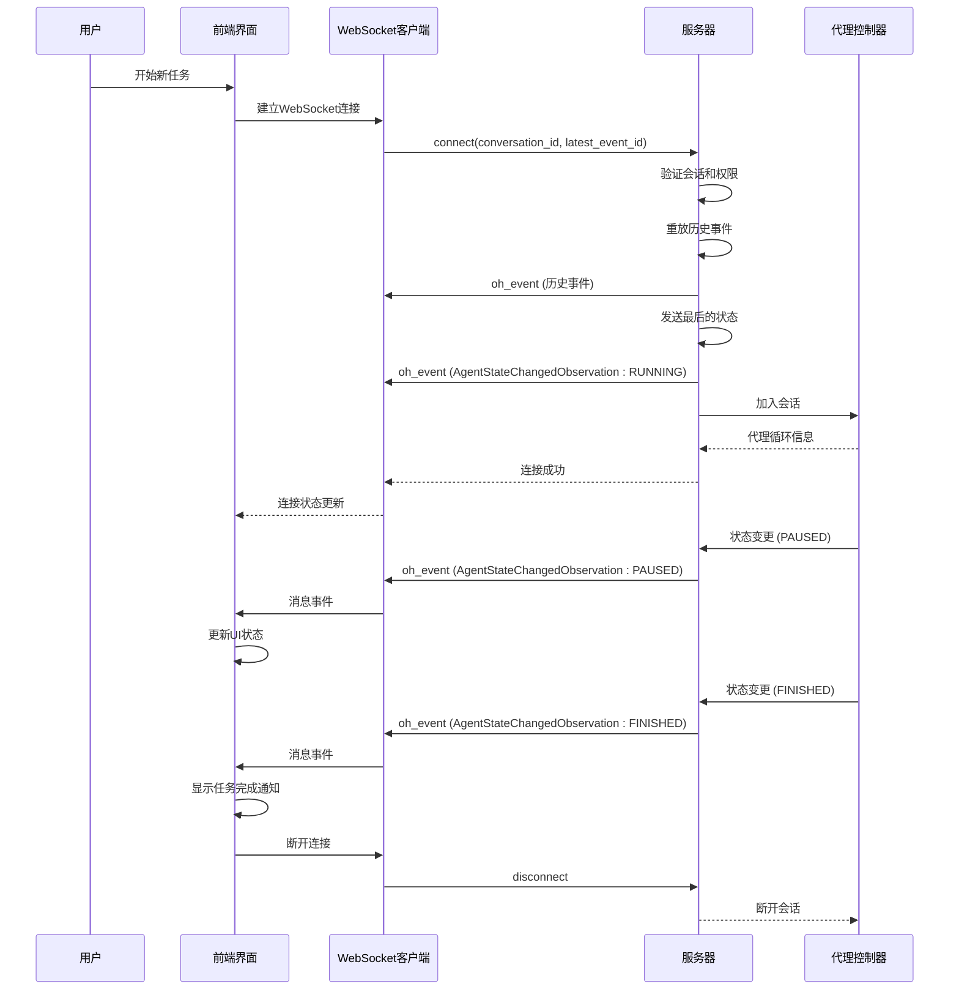
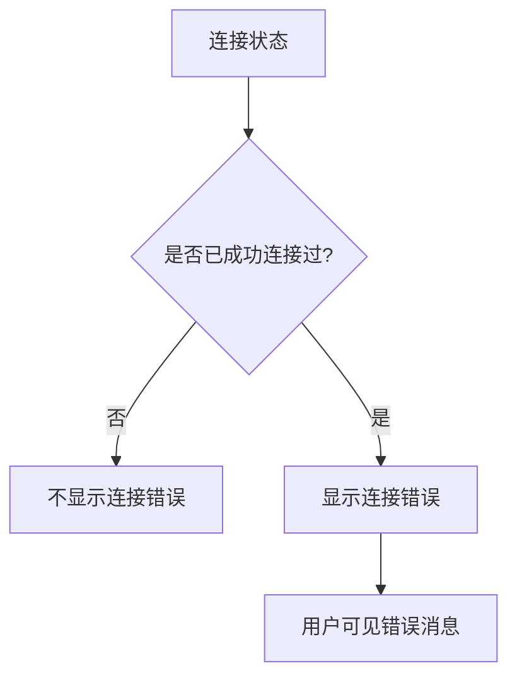
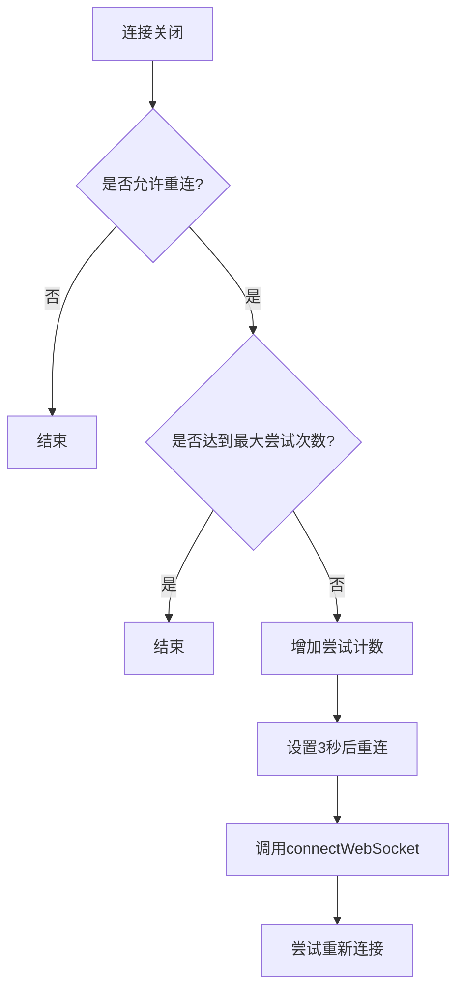

# 同步协议

<cite>
**本文档引用的文件**
- [use-websocket.ts](file://frontend/src/hooks/use-websocket.ts)
- [conversation-websocket-context.tsx](file://frontend/src/contexts/conversation-websocket-context.tsx)
- [listen_socket.py](file://openhands/server/listen_socket.py)
- [agent.py](file://openhands/events/action/agent.py)
- [agent.py](file://openhands/events/observation/agent.py)
- [websocket-url.ts](file://frontend/src/utils/websocket-url.ts)
</cite>

## 目录
1. [引言](#引言)
2. [WebSocket连接管理](#websocket连接管理)
3. [状态变更事件](#状态变更事件)
4. [前端WebSocket客户端实现](#前端websocket客户端实现)
5. [协议交互时序图](#协议交互时序图)
6. [关键代码实现](#关键代码实现)
7. [错误处理与重连机制](#错误处理与重连机制)
8. [结论](#结论)

## 引言
OpenHands项目通过WebSocket协议实现前后端之间的实时状态同步，确保用户界面能够及时反映代理（Agent）的状态变化。本协议详细描述了WebSocket连接的建立、维护和关闭过程，以及代理状态变更事件（ChangeAgentStateAction）和状态变更观察（AgentStateChangedObservation）的消息格式与传输机制。前端通过WebSocket客户端实现连接管理、消息监听、重连机制和错误处理，确保通信的可靠性和稳定性。

## WebSocket连接管理

### 连接建立
WebSocket连接的建立始于前端构建正确的WebSocket URL。前端通过`buildWebSocketUrl`函数根据会话ID和会话URL生成WebSocket连接地址，协议根据当前页面的协议（http或https）自动选择ws或wss。

```mermaid
flowchart TD
A[开始] --> B{会话ID和会话URL是否有效?}
B --> |否| C[返回null，不建立连接]
B --> |是| D[提取主机和端口信息]
D --> E[根据页面协议选择ws或wss]
E --> F[构建WebSocket URL: ws://host:port/sockets/events/{conversationId}]
F --> G[返回完整的WebSocket URL]
G --> H[结束]
```

**Diagram sources**
- [websocket-url.ts](file://frontend/src/utils/websocket-url.ts#L39-L54)

**Section sources**
- [websocket-url.ts](file://frontend/src/utils/websocket-url.ts#L33-L54)

### 连接维护
WebSocket连接的维护由`useWebSocket` Hook负责，它封装了WebSocket的连接、消息处理、错误处理和重连机制。连接建立时，会发送查询参数，包括`resend_all=true`和`session_api_key`（如果可用）。



**Diagram sources**
- [conversation-websocket-context.tsx](file://frontend/src/contexts/conversation-websocket-context.tsx#L193-L226)

**Section sources**
- [conversation-websocket-context.tsx](file://frontend/src/contexts/conversation-websocket-context.tsx#L193-L226)

### 连接关闭
WebSocket连接的关闭由`disconnect`函数处理，它会清除重连标志、取消任何待处理的重连超时，并关闭WebSocket连接。

```mermaid
flowchart TD
A[调用disconnect] --> B[设置shouldReconnectRef为false]
B --> C[清除重连超时]
C --> D{WebSocket是否存在?}
D --> |是| E[从允许重连列表中移除]
D --> |否| F[结束]
E --> G{WebSocket状态是否为CONNECTING或OPEN?}
G --> |是| H[调用close()方法]
G --> |否| I[结束]
H --> J[设置WebSocket引用为null]
J --> K[结束]
```

**Diagram sources**
- [use-websocket.ts](file://frontend/src/hooks/use-websocket.ts#L167-L179)

**Section sources**
- [use-websocket.ts](file://frontend/src/hooks/use-websocket.ts#L167-L179)

## 状态变更事件

### ChangeAgentStateAction消息格式
`ChangeAgentStateAction`是一个特殊的动作，用于通知客户端代理状态已更改。它包含代理的新状态和可选的思考内容。

```typescript
interface ChangeAgentStateAction {
  action: 'change_agent_state';
  agent_state: string;
  thought: string;
}
```

**Section sources**
- [agent.py](file://openhands/events/action/agent.py#L8-L18)

### AgentStateChangedObservation消息格式
`AgentStateChangedObservation`是服务器端发送的状态变更观察，它包含代理的当前状态和原因。

```typescript
interface AgentStateChangedObservation {
  observation: 'agent_state_changed';
  agent_state: string;
  reason: string;
}
```

**Section sources**
- [agent.py](file://openhands/events/observation/agent.py#L7-L17)

### 消息传输机制
状态变更消息通过WebSocket的`oh_event`事件进行传输。服务器在连接建立时会重放所有历史事件，并在状态变更时发送新的`AgentStateChangedObservation`。



**Diagram sources**
- [listen_socket.py](file://openhands/server/listen_socket.py#L35-L139)
- [agent.py](file://openhands/events/observation/agent.py#L7-L17)

**Section sources**
- [listen_socket.py](file://openhands/server/listen_socket.py#L35-L139)

## 前端WebSocket客户端实现

### 连接管理
前端使用`useWebSocket` Hook管理WebSocket连接，它处理连接的建立、关闭和状态更新。



**Section sources**
- [use-websocket.ts](file://frontend/src/hooks/use-websocket.ts#L1-L193)

### 消息监听
消息监听通过`onmessage`事件处理程序实现，它解析接收到的JSON消息并根据消息类型进行相应处理。



**Section sources**
- [conversation-websocket-context.tsx](file://frontend/src/contexts/conversation-websocket-context.tsx#L110-L173)

### 重连机制
重连机制通过`onclose`事件处理程序实现，当连接意外关闭时会自动尝试重新连接。



**Section sources**
- [use-websocket.ts](file://frontend/src/hooks/use-websocket.ts#L73-L113)

### 错误处理
错误处理包括连接错误、消息解析错误和发送错误的处理。



**Section sources**
- [use-websocket.ts](file://frontend/src/hooks/use-websocket.ts#L115-L118)
- [conversation-websocket-context.tsx](file://frontend/src/contexts/conversation-websocket-context.tsx#L237-L243)

## 协议交互时序图



**Diagram sources**
- [listen_socket.py](file://openhands/server/listen_socket.py#L35-L159)
- [use-websocket.ts](file://frontend/src/hooks/use-websocket.ts#L37-L193)
- [conversation-websocket-context.tsx](file://frontend/src/contexts/conversation-websocket-context.tsx#L110-L173)

## 关键代码实现

### WebSocket连接选项
WebSocket连接选项包括查询参数、重连配置和事件处理程序。

```typescript
const websocketOptions: WebSocketHookOptions = {
  queryParams: {
    resend_all: true,
    session_api_key: sessionApiKey || undefined
  },
  reconnect: { enabled: true },
  onOpen: () => {
    setConnectionState("OPEN");
    hasConnectedRef.current = true;
    removeErrorMessage();
  },
  onClose: (event) => {
    setConnectionState("CLOSED");
    if (event.code !== 1000 && hasConnectedRef.current) {
      setErrorMessage(`Connection lost: ${event.reason || "Unexpected disconnect"}`);
    }
  },
  onError: () => {
    setConnectionState("CLOSED");
    if (hasConnectedRef.current) {
      setErrorMessage("Failed to connect to server");
    }
  },
  onMessage: handleMessage
};
```

**Section sources**
- [conversation-websocket-context.tsx](file://frontend/src/contexts/conversation-websocket-context.tsx#L193-L246)

### 状态变更事件生成
状态变更事件由代理控制器生成并发送到事件流。

```python
class ChangeAgentStateAction(Action):
    """Fake action, just to notify the client that a task state has changed."""
    agent_state: str
    thought: str = ''
    action: str = ActionType.CHANGE_AGENT_STATE
    
    @property
    def message(self) -> str:
        return f'Agent state changed to {self.agent_state}'
```

**Section sources**
- [agent.py](file://openhands/events/action/agent.py#L8-L18)

### 消息处理函数
消息处理函数解析接收到的消息并更新相应的状态。

```typescript
const handleMessage = useCallback((messageEvent: MessageEvent) => {
  try {
    const event = JSON.parse(messageEvent.data);
    
    if (isV1Event(event)) {
      addEvent(event);
      
      if (isAgentErrorEvent(event)) {
        setErrorMessage(event.error);
      }
      
      if (isUserMessageEvent(event)) {
        removeOptimisticUserMessage();
      }
      
      if (isActionEvent(event)) {
        handleActionEventCacheInvalidation(event, conversationId, queryClient);
      }
      
      if (isConversationStateUpdateEvent(event)) {
        if (isFullStateConversationStateUpdateEvent(event)) {
          setExecutionStatus(event.value.execution_status);
        }
        if (isAgentStatusConversationStateUpdateEvent(event)) {
          setExecutionStatus(event.value);
        }
      }
    }
  } catch (error) {
    console.warn("Failed to parse WebSocket message as JSON:", error);
  }
}, [addEvent, setErrorMessage, removeOptimisticUserMessage, handleActionEventCacheInvalidation, setExecutionStatus]);
```

**Section sources**
- [conversation-websocket-context.tsx](file://frontend/src/contexts/conversation-websocket-context.tsx#L110-L178)

## 错误处理与重连机制

### 错误状态管理
错误状态管理通过`hasConnectedRef`引用实现，确保只在成功连接后才显示错误消息。



**Section sources**
- [conversation-websocket-context.tsx](file://frontend/src/contexts/conversation-websocket-context.tsx#L65-L66)

### 重连策略
重连策略包括最大尝试次数限制和指数退避（当前为固定3秒延迟）。



**Section sources**
- [use-websocket.ts](file://frontend/src/hooks/use-websocket.ts#L94-L110)

## 结论
OpenHands的状态同步协议通过WebSocket实现了高效、可靠的状态同步机制。协议设计考虑了连接的建立、维护和关闭的完整生命周期，确保了前后端状态的一致性。前端通过精心设计的Hook和上下文管理WebSocket连接，实现了自动重连、错误处理和状态更新。状态变更事件的设计简洁明了，通过`ChangeAgentStateAction`和`AgentStateChangedObservation`两种消息类型实现了双向状态同步。整个协议具有良好的可扩展性和稳定性，为用户提供流畅的交互体验。