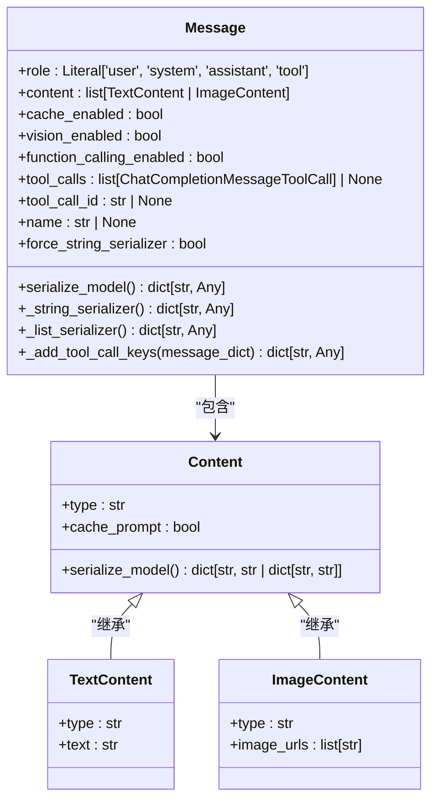
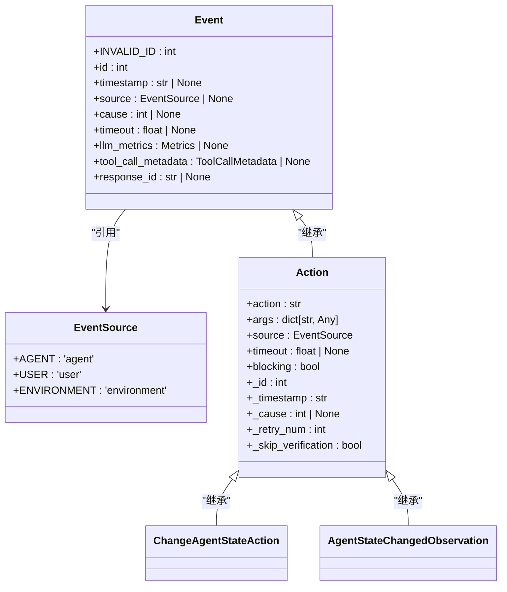
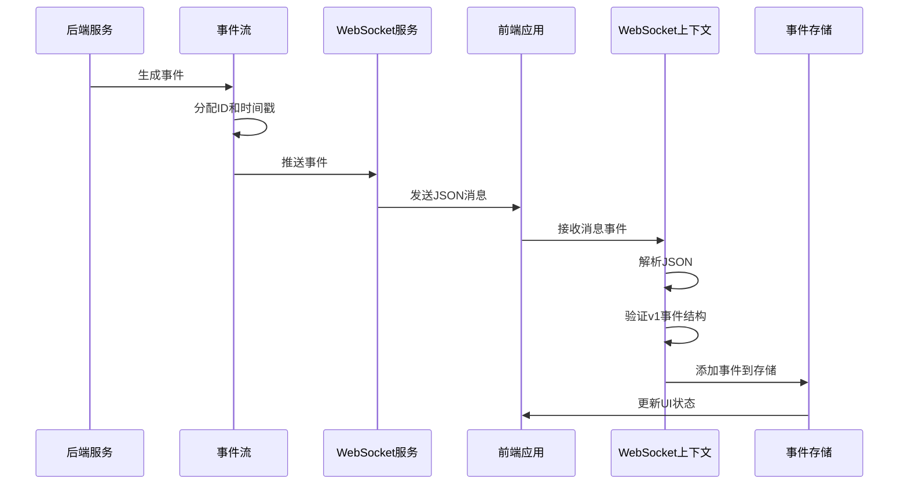
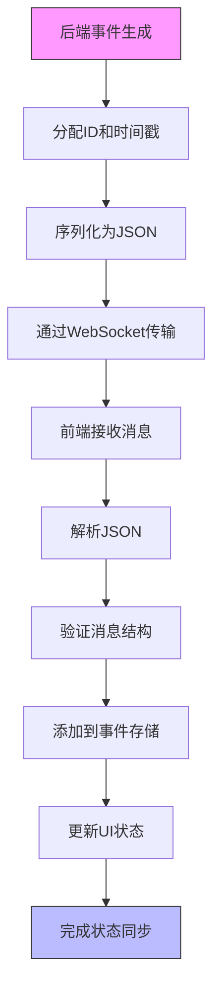
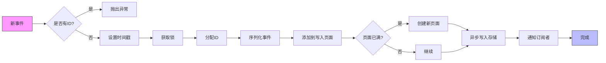

# 消息处理

<cite>
**本文档中引用的文件**  
- [message.py](file://openhands/core/message.py)
- [event.py](file://openhands/events/event.py)
- [stream.py](file://openhands/events/stream.py)
- [message.tsx](file://frontend/src/types/message.tsx)
- [conversation-websocket-context.tsx](file://frontend/src/contexts/conversation-websocket-context.tsx)
- [agent-state-service.ts](file://frontend/src/services/agent-state-service.ts)
</cite>

## 目录
1. [引言](#引言)
2. [消息结构与序列化](#消息结构与序列化)
3. [状态变更消息](#状态变更消息)
4. [消息传输流程](#消息传输流程)
5. [消息处理流程图](#消息处理流程图)
6. [消息分发与一致性保证](#消息分发与一致性保证)
7. [实际消息示例](#实际消息示例)
8. [结论](#结论)

## 引言
本文档详细描述OpenHands系统中状态同步协议的消息处理机制。重点分析代理状态变更事件（ChangeAgentStateAction）和状态变更观察（AgentStateChangedObservation）的消息结构、序列化格式和传输流程。文档将解释消息类型识别、解析和分发的实现方式，以及如何保证消息的有序性和一致性。通过消息处理流程图和实际消息示例，展示从后端事件生成到前端状态更新的完整链路。

## 消息结构与序列化
OpenHands系统中的消息处理基于Pydantic模型实现，确保了类型安全和数据完整性。消息结构设计支持丰富的内容类型，包括文本和图像。

消息序列化采用两种策略：字符串序列化和列表序列化。当消息需要支持缓存、视觉功能或函数调用时，系统使用列表序列化；否则使用字符串序列化。这种设计确保了与不同LLM提供商的兼容性。



**Diagram sources**
- [message.py](file://openhands/core/message.py#L53-L159)

**Section sources**
- [message.py](file://openhands/core/message.py#L1-L159)

## 状态变更消息
状态变更消息是OpenHands系统中实现状态同步的核心机制。系统通过ChangeAgentStateAction和AgentStateChangedObservation两种消息类型来实现代理状态的变更和观察。

ChangeAgentStateAction消息用于触发代理状态的变更，包含状态变更的目标状态和相关参数。AgentStateChangedObservation消息则用于通知系统中其他组件代理状态已经变更。



**Diagram sources**
- [event.py](file://openhands/events/event.py#L35-L132)

**Section sources**
- [event.py](file://openhands/events/event.py#L1-L132)

## 消息传输流程
消息传输流程从后端事件生成开始，通过WebSocket连接传输到前端，最终更新前端状态。整个流程确保了消息的实时性和可靠性。

后端使用EventStream类管理事件流，将事件添加到队列中并通知所有订阅者。前端通过WebSocket连接接收消息，并使用类型守卫验证消息结构，确保消息的完整性和正确性。



**Diagram sources**
- [stream.py](file://openhands/events/stream.py#L43-L184)
- [conversation-websocket-context.tsx](file://frontend/src/contexts/conversation-websocket-context.tsx#L1-L328)

**Section sources**
- [stream.py](file://openhands/events/stream.py#L43-L184)
- [conversation-websocket-context.tsx](file://frontend/src/contexts/conversation-websocket-context.tsx#L1-L328)

## 消息处理流程图
消息处理流程图展示了从事件生成到前端状态更新的完整链路。流程包括事件生成、序列化、传输、反序列化和状态更新等关键步骤。



**Diagram sources**
- [stream.py](file://openhands/events/stream.py#L163-L184)
- [conversation-websocket-context.tsx](file://frontend/src/contexts/conversation-websocket-context.tsx#L110-L173)

## 消息分发与一致性保证
消息分发机制通过EventStream类实现，确保消息能够可靠地分发到所有订阅者。系统使用线程锁和队列机制保证消息处理的有序性和一致性。

EventStream维护一个订阅者映射，每个订阅者ID对应一组回调函数。当新事件到达时，系统遍历所有订阅者并调用相应的回调函数。这种设计支持多个监听器同时处理同一事件流。

为了保证消息的一致性，系统在添加事件时使用线程锁确保原子操作。事件在分配ID后立即写入缓存页面，当页面满时创建新页面。这种批量写入策略提高了I/O效率。



**Diagram sources**
- [stream.py](file://openhands/events/stream.py#L163-L184)

**Section sources**
- [stream.py](file://openhands/events/stream.py#L43-L184)

## 实际消息示例
以下是一个实际的状态变更消息示例，展示了从后端到前端的完整消息结构：

```json
{
  "id": "valid-event-123",
  "timestamp": "2023-06-15T10:30:00Z",
  "source": "agent",
  "action": "change_agent_state",
  "args": {
    "agent_state": "RUNNING"
  },
  "message": "代理状态已更改为运行中",
  "llm_message": {
    "role": "assistant",
    "content": [
      { 
        "type": "text", 
        "text": "正在执行任务..." 
      }
    ]
  },
  "activated_microagents": [],
  "extended_content": []
}
```

前端通过agent-state-service生成状态变更事件：

```typescript
export const generateAgentStateChangeEvent = (state: AgentState) => ({
  action: ActionType.CHANGE_AGENT_STATE,
  args: { agent_state: state },
});
```

**Section sources**
- [agent-state-service.ts](file://frontend/src/services/agent-state-service.ts#L4-L7)
- [conversation-websocket-context.tsx](file://frontend/src/contexts/conversation-websocket-context.tsx#L159-L174)

## 结论
OpenHands系统通过精心设计的消息处理机制实现了高效的状态同步。系统采用Pydantic模型确保消息结构的类型安全，通过WebSocket实现实时消息传输，并利用事件流机制保证消息的有序性和一致性。

消息处理流程从后端事件生成开始，经过序列化、传输、反序列化，最终在前端更新状态。整个流程设计考虑了性能、可靠性和可扩展性，支持多个监听器同时处理事件流。

通过ChangeAgentStateAction和AgentStateChangedObservation消息类型，系统实现了代理状态的变更和观察，为复杂的代理交互提供了坚实的基础。未来可以进一步优化消息压缩和传输效率，以支持更大规模的分布式部署。