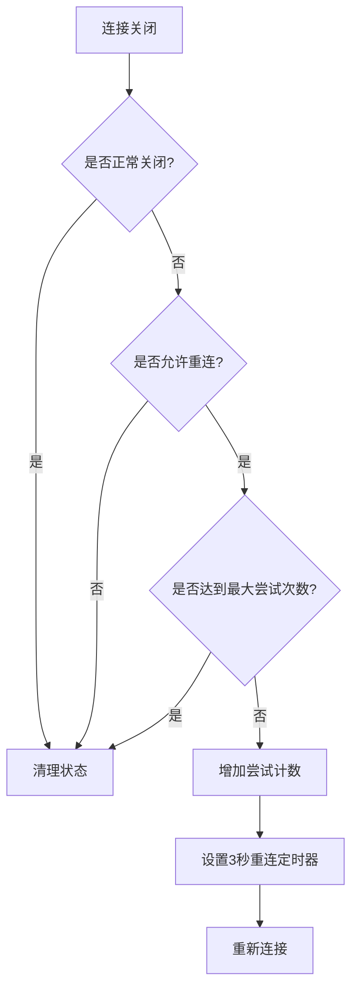
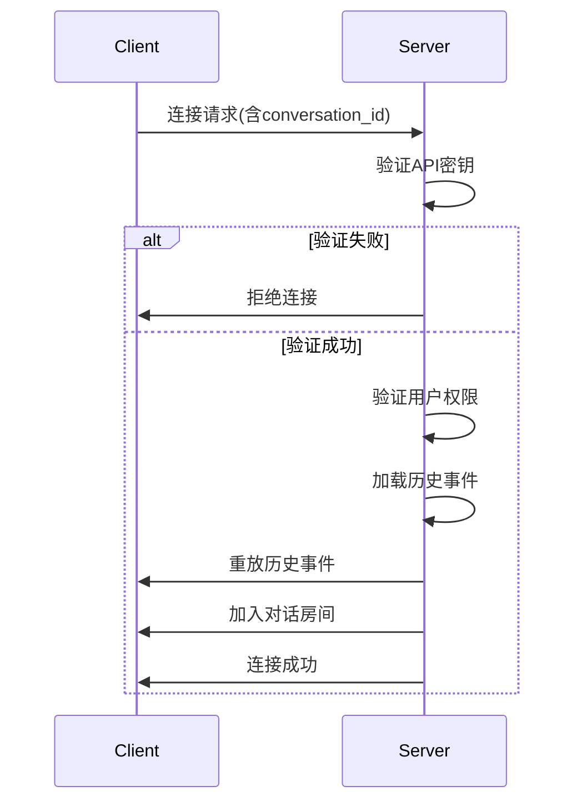
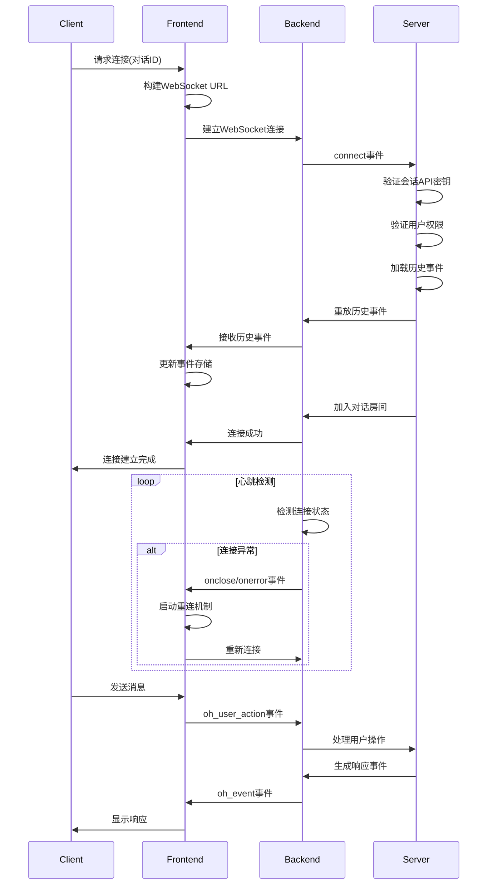

# 连接管理

<cite>
**本文档中引用的文件**  
- [use-websocket.ts](file://frontend/src/hooks/use-websocket.ts)
- [websocket-url.ts](file://frontend/src/utils/websocket-url.ts)
- [conversation-websocket-context.tsx](file://frontend/src/contexts/conversation-websocket-context.tsx)
- [ws-client-provider.tsx](file://frontend/src/context/ws-client-provider.tsx)
- [listen_socket.py](file://openhands/server/listen_socket.py)
- [session.py](file://openhands/server/session/session.py)
</cite>

## 目录
1. [WebSocket连接生命周期](#websocket连接生命周期)
2. [前端WebSocket客户端实现](#前端websocket客户端实现)
3. [连接状态管理](#连接状态管理)
4. [认证流程](#认证流程)
5. [心跳与自动重连机制](#心跳与自动重连机制)
6. [错误处理](#错误处理)
7. [后端连接管理](#后端连接管理)
8. [连接时序图](#连接时序图)

## WebSocket连接生命周期

WebSocket连接的生命周期包括建立、维护和关闭三个主要阶段。在OpenHands系统中，WebSocket连接用于实现实时通信，支持客户端与服务器之间的双向消息传递。

**Section sources**
- [use-websocket.ts](file://frontend/src/hooks/use-websocket.ts#L1-L193)
- [listen_socket.py](file://openhands/server/listen_socket.py#L1-L169)

## 前端WebSocket客户端实现

前端WebSocket客户端通过`useWebSocket` Hook实现，提供了连接初始化、消息收发和连接管理功能。该实现基于原生WebSocket API，并封装了重连、错误处理等高级功能。

`useWebSocket` Hook接受URL和配置选项作为参数，返回连接状态、消息列表和发送消息的方法。配置选项包括查询参数、连接/关闭/消息/错误事件的回调函数，以及重连配置。

WebSocket URL的构建遵循特定模式：`ws://host:port/sockets/events/{conversationId}`，其中协议根据页面协议自动选择（http对应ws，https对应wss）。

**Section sources**
- [use-websocket.ts](file://frontend/src/hooks/use-websocket.ts#L1-L193)
- [websocket-url.ts](file://frontend/src/utils/websocket-url.ts#L1-L55)

## 连接状态管理

连接状态管理通过多个状态变量实现，包括：
- `isConnected`: 表示当前是否已建立连接
- `isReconnecting`: 表示是否正在进行重连
- `error`: 存储连接错误信息
- `messages`: 存储接收到的消息列表

状态管理采用React的useState Hook实现，确保UI能够响应连接状态的变化。连接状态的变化会触发相应的回调函数，允许上层组件对状态变化做出响应。

对于V1对话，系统使用`ConversationWebSocketProvider`组件管理连接状态，提供"CONNECTING"、"OPEN"、"CLOSED"和"CLOSING"四种状态，这些状态直接映射到WebSocket的readyState。

**Section sources**
- [use-websocket.ts](file://frontend/src/hooks/use-websocket.ts#L19-L23)
- [conversation-websocket-context.tsx](file://frontend/src/contexts/conversation-websocket-context.tsx#L34-L38)

## 认证流程

WebSocket连接的认证通过查询参数实现。客户端在建立连接时，将认证信息作为查询参数附加到WebSocket URL上。主要认证参数包括：
- `session_api_key`: 会话API密钥，用于验证客户端身份
- `resend_all`: 布尔值，指示是否重新发送所有事件

服务器端在`connect`事件处理程序中验证这些参数。如果`SESSION_API_KEY`环境变量已设置，则必须提供匹配的`session_api_key`查询参数，否则连接将被拒绝。

认证验证在`listen_socket.py`文件的`_invalid_session_api_key`函数中实现，该函数检查查询参数中的API密钥是否与环境变量中的密钥匹配。

**Section sources**
- [conversation-websocket-context.tsx](file://frontend/src/contexts/conversation-websocket-context.tsx#L194-L202)
- [listen_socket.py](file://openhands/server/listen_socket.py#L161-L168)

## 心跳与自动重连机制

系统实现了健壮的自动重连机制，确保在网络中断或服务器重启后能够恢复连接。重连机制的主要特性包括：

1. **可配置的重连**: 支持启用/禁用重连，以及设置最大重连尝试次数
2. **指数退避**: 重连间隔为固定的3秒，避免过于频繁的重连尝试
3. **重连控制**: 通过`shouldReconnectRef`引用控制是否允许重连，组件卸载时自动禁用重连
4. **实例级重连跟踪**: 使用WeakSet跟踪允许重连的WebSocket实例，防止已关闭实例的重连

重连逻辑在`onclose`事件处理程序中实现。当连接关闭且不是正常关闭（代码1000）时，如果重连已启用且未超过最大尝试次数，则设置重连标志并启动3秒后的重连定时器。

**Diagram sources**
- [use-websocket.ts](file://frontend/src/hooks/use-websocket.ts#L73-L113)

**Section sources**
- [use-websocket.ts](file://frontend/src/hooks/use-websocket.ts#L94-L110)

## 错误处理

错误处理机制全面覆盖了连接过程中的各种异常情况。系统区分了连接错误和消息错误，并提供相应的处理策略。

连接错误主要在`onclose`和`onerror`事件中处理：
- `onclose`: 当连接关闭时触发，根据关闭代码判断是否为错误关闭
- `onerror`: 当连接发生错误时触发，立即设置错误状态

错误信息通过`setError`状态更新函数存储，并通过`onError`回调通知上层组件。对于V1对话，错误信息还会通过`useErrorMessageStore`存储，用于在UI中显示错误消息。

特别地，系统实现了"首次连接成功后才显示错误"的策略，避免在初始连接尝试期间显示错误消息，改善用户体验。

**Section sources**
- [use-websocket.ts](file://frontend/src/hooks/use-websocket.ts#L77-L89)
- [conversation-websocket-context.tsx](file://frontend/src/contexts/conversation-websocket-context.tsx#L231-L235)

## 后端连接管理

后端使用Socket.IO作为WebSocket的底层协议，提供了更高级的连接管理功能。主要的服务器端事件处理程序包括：

- `connect`: 当新连接建立时触发
- `oh_user_action`: 当客户端发送用户操作时触发
- `disconnect`: 当客户端断开连接时触发

`connect`事件处理程序执行以下操作：
1. 解析查询参数，包括`conversation_id`和`latest_event_id`
2. 验证会话API密钥
3. 验证用户对对话的访问权限
4. 重放事件流，将历史事件发送给新连接的客户端
5. 将连接加入对话房间

服务器端还实现了客户端等待超时机制，通过`client_wait_timeout`配置项（默认30秒）控制等待客户端连接完成的时间，避免事件推送失败。

**Diagram sources**
- [listen_socket.py](file://openhands/server/listen_socket.py#L35-L136)

**Section sources**
- [listen_socket.py](file://openhands/server/listen_socket.py#L35-L136)
- [session.py](file://openhands/server/session/session.py#L389-L411)

## 连接时序图

以下是WebSocket连接建立的完整时序图，展示了客户端和服务器之间的交互过程：

**Diagram sources**
- [use-websocket.ts](file://frontend/src/hooks/use-websocket.ts#L37-L156)
- [listen_socket.py](file://openhands/server/listen_socket.py#L35-L136)

**Section sources**
- [use-websocket.ts](file://frontend/src/hooks/use-websocket.ts#L37-L156)
- [listen_socket.py](file://openhands/server/listen_socket.py#L35-L136)