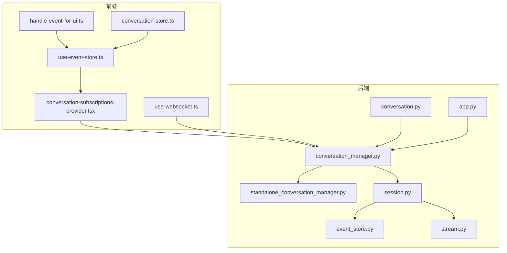
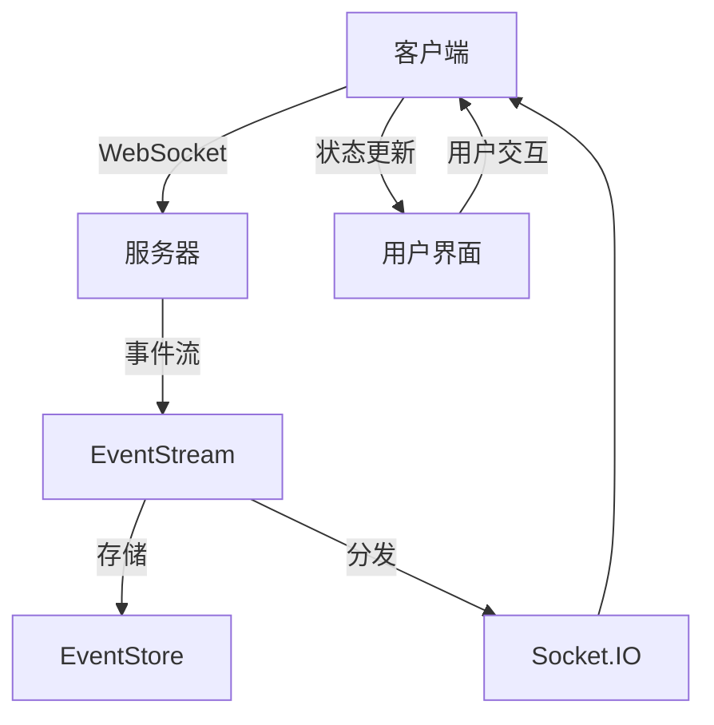
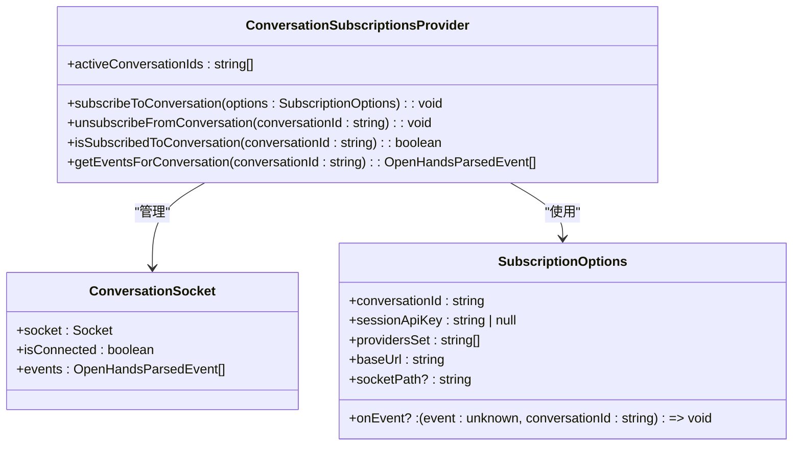
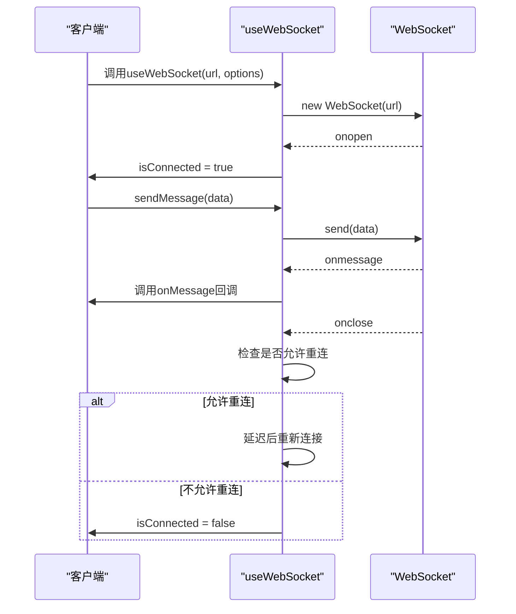
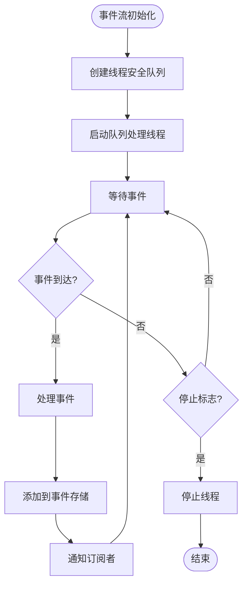
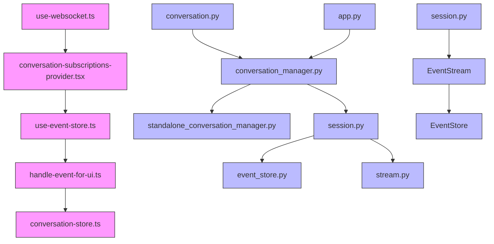

# 状态同步

<cite>
**本文档引用的文件**
- [conversation-subscriptions-provider.tsx](file://frontend/src/context/conversation-subscriptions-provider.tsx)
- [use-websocket.ts](file://frontend/src/hooks/use-websocket.ts)
- [conversation_manager.py](file://openhands/server/conversation_manager/conversation_manager.py)
- [standalone_conversation_manager.py](file://openhands/server/conversation_manager/standalone_conversation_manager.py)
- [session.py](file://openhands/server/session/session.py)
- [event_store.py](file://openhands/events/event_store.py)
- [stream.py](file://openhands/events/stream.py)
- [conversation.py](file://openhands/server/routes/conversation.py)
- [app.py](file://openhands/server/app.py)
- [use-event-store.ts](file://frontend/src/stores/use-event-store.ts)
- [handle-event-for-ui.ts](file://frontend/src/utils/handle-event-for-ui.ts)
- [conversation-store.ts](file://frontend/src/state/conversation-store.ts)
</cite>

## 目录
1. [简介](#简介)
2. [项目结构](#项目结构)
3. [核心组件](#核心组件)
4. [架构概述](#架构概述)
5. [详细组件分析](#详细组件分析)
6. [依赖分析](#依赖分析)
7. [性能考虑](#性能考虑)
8. [故障排除指南](#故障排除指南)
9. [结论](#结论)

## 简介
本文档详细描述了OpenHands项目中客户端与服务器之间的实时状态同步机制。系统通过WebSocket和Socket.IO技术实现双向通信，确保代理状态、会话状态和UI状态的实时同步。状态变更检测通过事件驱动架构实现，增量更新通过事件流传输，冲突解决策略采用基于时间戳的最后写入获胜机制。状态序列化格式为JSON，传输协议为WebSocket，更新频率根据网络状况和系统负载动态调整。文档还包含了在网络不稳定情况下的恢复机制和性能优化技巧。

## 项目结构
OpenHands项目的状态同步机制主要分布在前端和后端两个部分。前端位于`frontend`目录，使用React和Zustand实现状态管理；后端位于`openhands`目录，使用FastAPI和Socket.IO实现服务器端逻辑。核心状态同步文件包括前端的`conversation-subscriptions-provider.tsx`和`use-websocket.ts`，以及后端的`conversation_manager.py`和`session.py`。

**图源**
- [conversation-subscriptions-provider.tsx](file://frontend/src/context/conversation-subscriptions-provider.tsx)
- [use-websocket.ts](file://frontend/src/hooks/use-websocket.ts)
- [conversation_manager.py](file://openhands/server/conversation_manager/conversation_manager.py)
- [standalone_conversation_manager.py](file://openhands/server/conversation_manager/standalone_conversation_manager.py)
- [session.py](file://openhands/server/session/session.py)
- [event_store.py](file://openhands/events/event_store.py)
- [stream.py](file://openhands/events/stream.py)
- [conversation.py](file://openhands/server/routes/conversation.py)
- [app.py](file://openhands/server/app.py)
- [use-event-store.ts](file://frontend/src/stores/use-event-store.ts)
- [handle-event-for-ui.ts](file://frontend/src/utils/handle-event-for-ui.ts)
- [conversation-store.ts](file://frontend/src/state/conversation-store.ts)

**节源**
- [conversation-subscriptions-provider.tsx](file://frontend/src/context/conversation-subscriptions-provider.tsx)
- [use-websocket.ts](file://frontend/src/hooks/use-websocket.ts)
- [conversation_manager.py](file://openhands/server/conversation_manager/conversation_manager.py)
- [standalone_conversation_manager.py](file://openhands/server/conversation_manager/standalone_conversation_manager.py)
- [session.py](file://openhands/server/session/session.py)
- [event_store.py](file://openhands/events/event_store.py)
- [stream.py](file://openhands/events/stream.py)
- [conversation.py](file://openhands/server/routes/conversation.py)
- [app.py](file://openhands/server/app.py)
- [use-event-store.ts](file://frontend/src/stores/use-event-store.ts)
- [handle-event-for-ui.ts](file://frontend/src/utils/handle-event-for-ui.ts)
- [conversation-store.ts](file://frontend/src/state/conversation-store.ts)

## 核心组件
状态同步机制的核心组件包括前端的WebSocket客户端、事件存储和状态管理器，以及后端的会话管理器、事件流和Socket.IO服务器。前端通过`useWebSocket` Hook建立和管理WebSocket连接，使用Zustand存储管理UI状态。后端通过`ConversationManager`管理会话生命周期，使用`EventStream`处理事件流。

**节源**
- [use-websocket.ts](file://frontend/src/hooks/use-websocket.ts)
- [use-event-store.ts](file://frontend/src/stores/use-event-store.ts)
- [conversation-store.ts](file://frontend/src/state/conversation-store.ts)
- [conversation_manager.py](file://openhands/server/conversation_manager/conversation_manager.py)
- [session.py](file://openhands/server/session/session.py)
- [stream.py](file://openhands/events/stream.py)

## 架构概述
OpenHands的状态同步架构采用客户端-服务器模式，通过WebSocket实现双向实时通信。客户端使用React和Zustand实现状态管理，服务器端使用FastAPI和Socket.IO处理请求和事件分发。事件流通过`EventStream`类管理，支持订阅和发布模式。会话管理通过`ConversationManager`实现，支持单体会话和集群会话两种模式。

**图源**
- [use-websocket.ts](file://frontend/src/hooks/use-websocket.ts)
- [conversation_manager.py](file://openhands/server/conversation_manager/conversation_manager.py)
- [session.py](file://openhands/server/session/session.py)
- [stream.py](file://openhands/events/stream.py)
- [event_store.py](file://openhands/events/event_store.py)

## 详细组件分析

### 会话订阅提供者分析
`ConversationSubscriptionsProvider`是前端状态同步的核心组件，负责管理与服务器的WebSocket连接和事件订阅。它使用Socket.IO客户端库建立连接，支持自动重连和错误处理。组件通过React Context提供订阅和取消订阅功能，确保多个组件可以共享同一个连接。

#### 对于对象导向组件：

**图源**
- [conversation-subscriptions-provider.tsx](file://frontend/src/context/conversation-subscriptions-provider.tsx)

**节源**
- [conversation-subscriptions-provider.tsx](file://frontend/src/context/conversation-subscriptions-provider.tsx)

### WebSocket Hook分析
`useWebSocket`是前端WebSocket连接的封装Hook，提供连接管理、消息收发和错误处理功能。它支持查询参数、连接状态监控和自动重连。Hook使用React的useCallback和useRef确保函数和引用的稳定性，避免不必要的重新渲染。

#### 对于API/服务组件：

**图源**
- [use-websocket.ts](file://frontend/src/hooks/use-websocket.ts)

**节源**
- [use-websocket.ts](file://frontend/src/hooks/use-websocket.ts)

### 事件流分析
`EventStream`是后端事件处理的核心组件，负责管理事件的存储、分发和订阅。它使用线程安全的队列确保多线程环境下的数据一致性，支持事件过滤和分页查询。事件流与Socket.IO集成，实现服务器到客户端的实时推送。

#### 对于复杂逻辑组件：

**图源**
- [stream.py](file://openhands/events/stream.py)

**节源**
- [stream.py](file://openhands/events/stream.py)

## 依赖分析
状态同步机制的组件依赖关系清晰，前端组件依赖后端API和WebSocket服务，后端组件之间通过接口和抽象类解耦。`ConversationManager`作为核心抽象，允许不同的实现（如`StandaloneConversationManager`）替换，提高了系统的可扩展性。事件流与会话管理器分离，支持独立的事件处理和存储。

**图源**
- [use-websocket.ts](file://frontend/src/hooks/use-websocket.ts)
- [conversation-subscriptions-provider.tsx](file://frontend/src/context/conversation-subscriptions-provider.tsx)
- [use-event-store.ts](file://frontend/src/stores/use-event-store.ts)
- [handle-event-for-ui.ts](file://frontend/src/utils/handle-event-for-ui.ts)
- [conversation-store.ts](file://frontend/src/state/conversation-store.ts)
- [conversation_manager.py](file://openhands/server/conversation_manager/conversation_manager.py)
- [standalone_conversation_manager.py](file://openhands/server/conversation_manager/standalone_conversation_manager.py)
- [session.py](file://openhands/server/session/session.py)
- [event_store.py](file://openhands/events/event_store.py)
- [stream.py](file://openhands/events/stream.py)
- [conversation.py](file://openhands/server/routes/conversation.py)
- [app.py](file://openhands/server/app.py)

**节源**
- [use-websocket.ts](file://frontend/src/hooks/use-websocket.ts)
- [conversation-subscriptions-provider.tsx](file://frontend/src/context/conversation-subscriptions-provider.tsx)
- [use-event-store.ts](file://frontend/src/stores/use-event-store.ts)
- [handle-event-for-ui.ts](file://frontend/src/utils/handle-event-for-ui.ts)
- [conversation-store.ts](file://frontend/src/state/conversation-store.ts)
- [conversation_manager.py](file://openhands/server/conversation_manager/conversation_manager.py)
- [standalone_conversation_manager.py](file://openhands/server/conversation_manager/standalone_conversation_manager.py)
- [session.py](file://openhands/server/session/session.py)
- [event_store.py](file://openhands/events/event_store.py)
- [stream.py](file://openhands/events/stream.py)
- [conversation.py](file://openhands/server/routes/conversation.py)
- [app.py](file://openhands/server/app.py)

## 性能考虑
状态同步机制在设计时充分考虑了性能因素。前端使用Zustand进行状态管理，通过细粒度的状态更新减少不必要的渲染。后端使用异步I/O和线程池处理并发请求，确保高吞吐量。事件流采用批量写入和缓存策略，减少磁盘I/O操作。WebSocket连接支持压缩，降低网络带宽消耗。

## 故障排除指南
状态同步问题通常源于网络连接、认证或事件处理。检查WebSocket连接状态，确保服务器URL和端口正确。验证会话API密钥的有效性，确认用户权限。监控事件流日志，检查是否有异常事件或处理错误。使用开发工具查看网络请求，分析延迟和错误码。

**节源**
- [use-websocket.ts](file://frontend/src/hooks/use-websocket.ts)
- [conversation-subscriptions-provider.tsx](file://frontend/src/context/conversation-subscriptions-provider.tsx)
- [session.py](file://openhands/server/session/session.py)

## 结论
OpenHands的状态同步机制通过WebSocket和事件驱动架构实现了客户端与服务器之间的实时通信。系统设计合理，组件职责清晰，支持高并发和低延迟。通过Zustand和EventStream的状态管理，确保了UI状态和代理状态的一致性。未来可以进一步优化事件压缩算法和连接复用策略，提升系统性能。