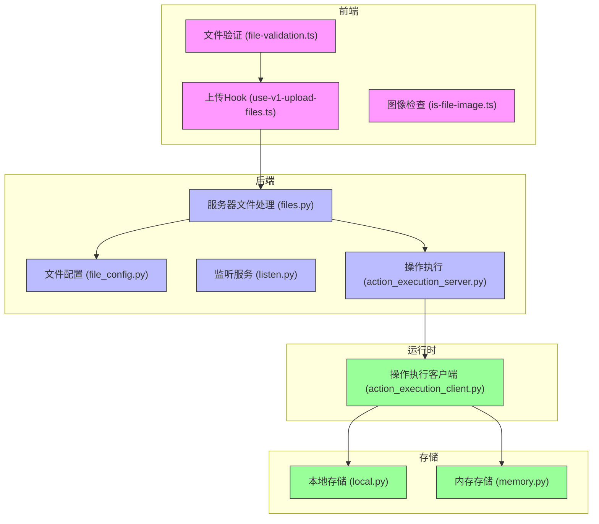
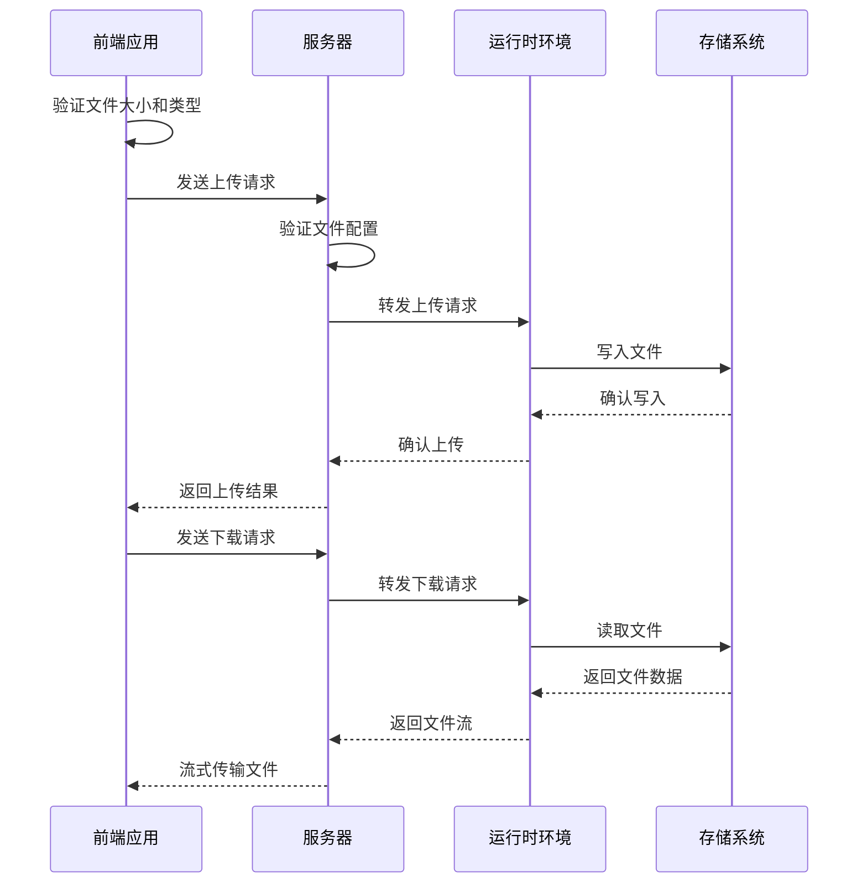
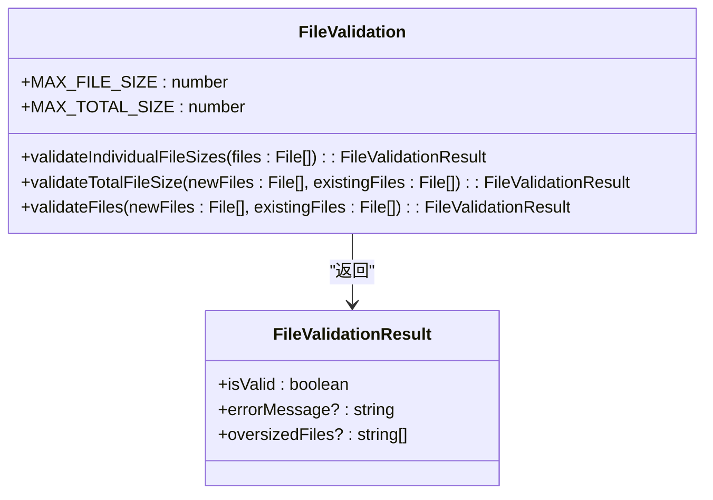
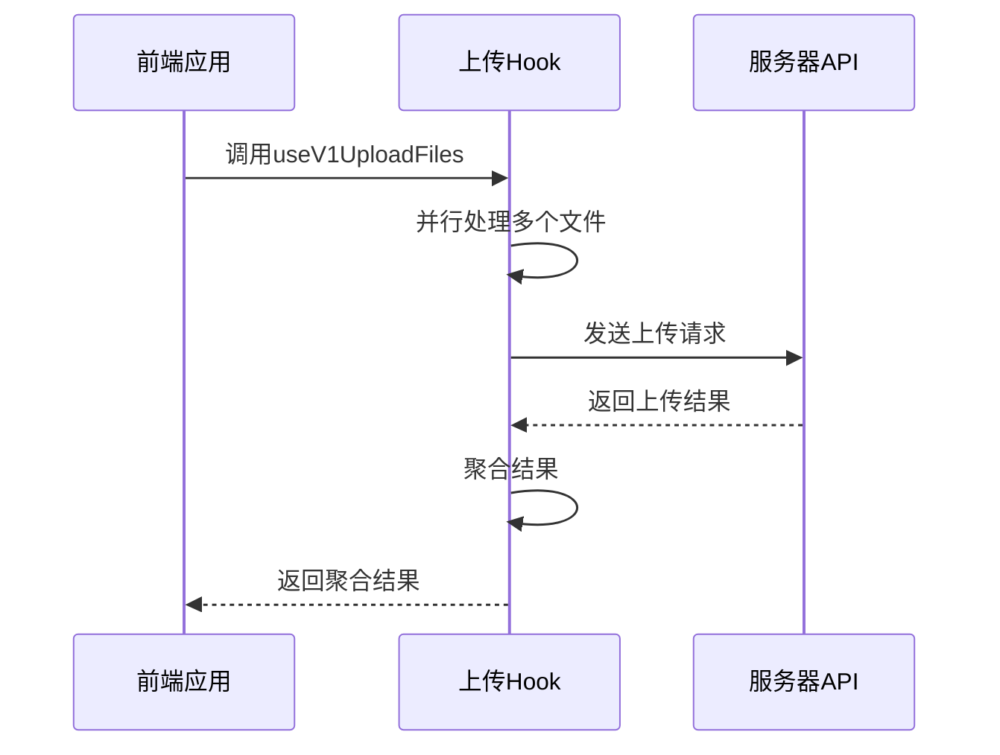
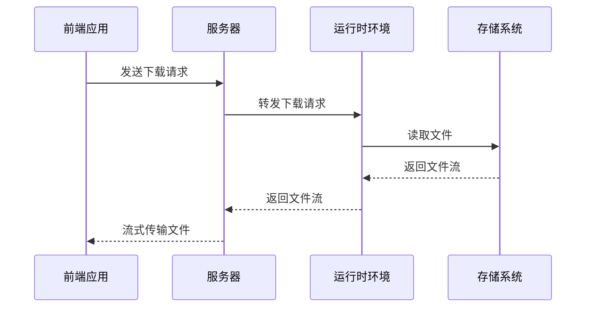
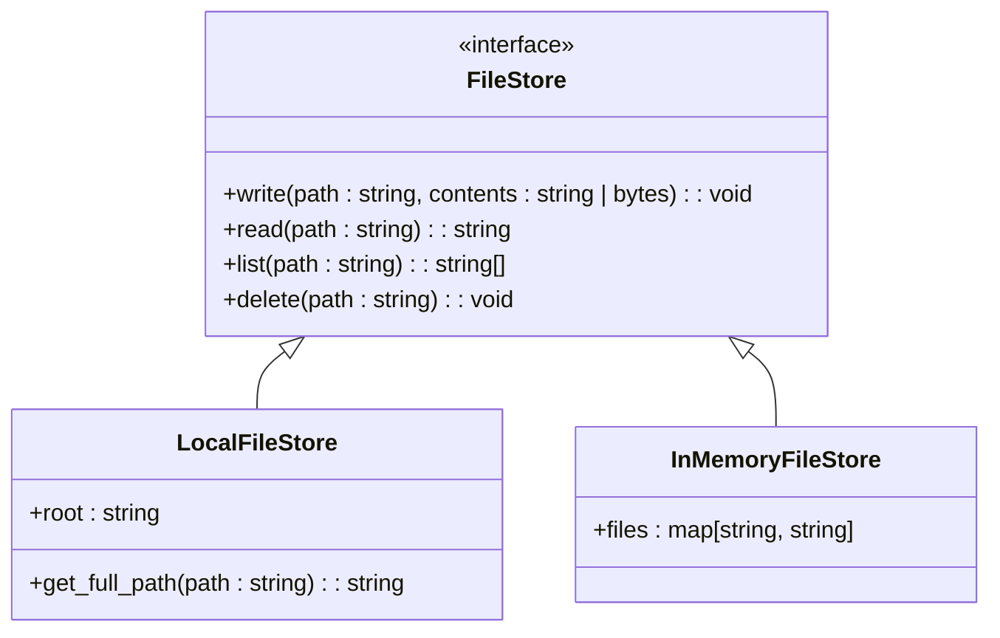
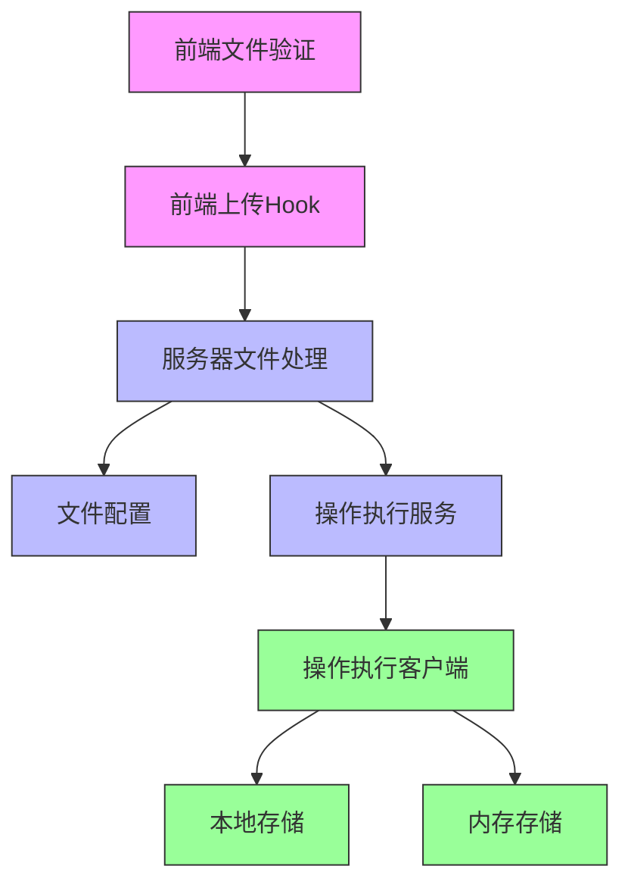

# 文件传输与上传

<cite>
**本文档引用的文件**
- [file_validation.ts](file://frontend/src/utils/file-validation.ts)
- [use-v1-upload-files.ts](file://frontend/src/hooks/mutation/use-v1-upload-files.ts)
- [files.py](file://openhands/server/files.py)
- [file_config.py](file://openhands/server/file_config.py)
- [listen.py](file://openhands/server/listen.py)
- [action_execution_client.py](file://openhands/runtime/impl/action_execution/action_execution_client.py)
- [action_execution_server.py](file://openhands/runtime/action_execution_server.py)
- [local.py](file://openhands/storage/local.py)
- [memory.py](file://openhands/storage/memory.py)
- [is-file-image.ts](file://frontend/src/utils/is-file-image.ts)
</cite>

## 目录
1. [介绍](#介绍)
2. [项目结构](#项目结构)
3. [核心组件](#核心组件)
4. [架构概述](#架构概述)
5. [详细组件分析](#详细组件分析)
6. [依赖分析](#依赖分析)
7. [性能考虑](#性能考虑)
8. [故障排除指南](#故障排除指南)
9. [结论](#结论)

## 介绍
本文件详细描述了OpenHands项目中的文件传输功能，重点介绍文件上传和下载的实现机制。文档涵盖了MIME类型支持、大小限制、分块传输策略、进度报告、流式传输机制、大文件处理方式、错误处理、断点续传支持、网络中断恢复机制、加密保护和临时存储管理策略。

## 项目结构
文件传输功能分布在前端和后端多个组件中，主要涉及以下目录：
- `frontend/src/utils/` - 前端文件验证和处理工具
- `frontend/src/hooks/` - 前端上传文件的React Hook
- `openhands/server/` - 服务器端文件处理和API路由
- `openhands/runtime/` - 运行时文件操作
- `openhands/storage/` - 存储抽象层

**图示来源**
- [file_validation.ts](file://frontend/src/utils/file-validation.ts)
- [use-v1-upload-files.ts](file://frontend/src/hooks/mutation/use-v1-upload-files.ts)
- [files.py](file://openhands/server/files.py)
- [file_config.py](file://openhands/server/file_config.py)
- [listen.py](file://openhands/server/listen.py)
- [action_execution_server.py](file://openhands/runtime/action_execution_server.py)
- [action_execution_client.py](file://openhands/runtime/impl/action_execution/action_execution_client.py)
- [local.py](file://openhands/storage/local.py)
- [memory.py](file://openhands/storage/memory.py)

**本节来源**
- [file_validation.ts](file://frontend/src/utils/file-validation.ts)
- [use-v1-upload-files.ts](file://frontend/src/hooks/mutation/use-v1-upload-files.ts)
- [files.py](file://openhands/server/files.py)
- [file_config.py](file://openhands/server/file_config.py)
- [listen.py](file://openhands/server/listen.py)
- [action_execution_server.py](file://openhands/runtime/action_execution_server.py)
- [action_execution_client.py](file://openhands/runtime/impl/action_execution/action_execution_client.py)
- [local.py](file://openhands/storage/local.py)
- [memory.py](file://openhands/storage/memory.py)

## 核心组件
文件传输功能的核心组件包括前端文件验证、上传Hook、服务器端文件处理、运行时操作执行和存储抽象层。这些组件协同工作，实现了完整的文件上传下载功能。

**本节来源**
- [file_validation.ts](file://frontend/src/utils/file-validation.ts)
- [use-v1-upload-files.ts](file://frontend/src/hooks/mutation/use-v1-upload-files.ts)
- [files.py](file://openhands/server/files.py)
- [file_config.py](file://openhands/server/file_config.py)
- [action_execution_server.py](file://openhands/runtime/action_execution_server.py)
- [action_execution_client.py](file://openhands/runtime/impl/action_execution/action_execution_client.py)

## 架构概述
文件传输架构采用分层设计，从前端到后端再到运行时环境，实现了安全、高效的文件传输。架构包括文件验证、配置管理、API路由、操作执行和存储管理等关键组件。

**图示来源**
- [file_validation.ts](file://frontend/src/utils/file-validation.ts)
- [use-v1-upload-files.ts](file://frontend/src/hooks/mutation/use-v1-upload-files.ts)
- [files.py](file://openhands/server/files.py)
- [file_config.py](file://openhands/server/file_config.py)
- [action_execution_server.py](file://openhands/runtime/action_execution_server.py)
- [action_execution_client.py](file://openhands/runtime/impl/action_execution/action_execution_client.py)
- [local.py](file://openhands/storage/local.py)
- [memory.py](file://openhands/storage/memory.py)

## 详细组件分析

### 文件上传机制分析
文件上传机制包括前端验证、服务器处理和运行时执行三个主要阶段。前端首先验证文件大小和类型，然后通过API发送到服务器，服务器再转发到运行时环境进行实际的文件写入操作。

#### 文件验证组件

**图示来源**
- [file_validation.ts](file://frontend/src/utils/file-validation.ts)

**本节来源**
- [file_validation.ts](file://frontend/src/utils/file-validation.ts)

#### 上传处理组件

**图示来源**
- [use-v1-upload-files.ts](file://frontend/src/hooks/mutation/use-v1-upload-files.ts)

**本节来源**
- [use-v1-upload-files.ts](file://frontend/src/hooks/mutation/use-v1-upload-files.ts)

### 文件下载机制分析
文件下载机制采用流式传输方式，服务器从运行时环境获取文件流并直接传输给前端，避免了大文件在服务器内存中的完全加载。

#### 下载处理组件

**图示来源**
- [action_execution_client.py](file://openhands/runtime/impl/action_execution/action_execution_client.py)
- [action_execution_server.py](file://openhands/runtime/action_execution_server.py)

**本节来源**
- [action_execution_client.py](file://openhands/runtime/impl/action_execution/action_execution_client.py)
- [action_execution_server.py](file://openhands/runtime/action_execution_server.py)

### 存储管理分析
存储管理组件提供了抽象的文件存储接口，支持多种存储后端，包括本地文件系统、内存存储和云存储。

#### 存储抽象组件

**图示来源**
- [local.py](file://openhands/storage/local.py)
- [memory.py](file://openhands/storage/memory.py)
- [files.py](file://openhands/storage/files.py)

**本节来源**
- [local.py](file://openhands/storage/local.py)
- [memory.py](file://openhands/storage/memory.py)
- [files.py](file://openhands/storage/files.py)

## 依赖分析
文件传输功能的组件之间存在明确的依赖关系，从前端到后端再到运行时环境，形成了清晰的调用链。

**图示来源**
- [file_validation.ts](file://frontend/src/utils/file-validation.ts)
- [use-v1-upload-files.ts](file://frontend/src/hooks/mutation/use-v1-upload-files.ts)
- [files.py](file://openhands/server/files.py)
- [file_config.py](file://openhands/server/file_config.py)
- [action_execution_server.py](file://openhands/runtime/action_execution_server.py)
- [action_execution_client.py](file://openhands/runtime/impl/action_execution/action_execution_client.py)
- [local.py](file://openhands/storage/local.py)
- [memory.py](file://openhands/storage/memory.py)

**本节来源**
- [file_validation.ts](file://frontend/src/utils/file-validation.ts)
- [use-v1-upload-files.ts](file://frontend/src/hooks/mutation/use-v1-upload-files.ts)
- [files.py](file://openhands/server/files.py)
- [file_config.py](file://openhands/server/file_config.py)
- [action_execution_server.py](file://openhands/runtime/action_execution_server.py)
- [action_execution_client.py](file://openhands/runtime/impl/action_execution/action_execution_client.py)
- [local.py](file://openhands/storage/local.py)
- [memory.py](file://openhands/storage/memory.py)

## 性能考虑
文件传输功能在设计时考虑了多项性能优化措施：
1. 前端并行上传多个文件，提高上传效率
2. 流式传输大文件，避免内存溢出
3. 批量处理文件操作，减少网络往返
4. 缓存文件元数据，提高访问速度
5. 异步处理文件操作，避免阻塞主线程

## 故障排除指南
### 常见问题及解决方案
1. **文件上传失败**
   - 检查文件大小是否超过3MB限制
   - 验证文件类型是否在允许的扩展名列表中
   - 确认网络连接是否稳定

2. **文件下载缓慢**
   - 检查网络带宽
   - 验证服务器性能
   - 确认文件大小是否过大

3. **文件验证错误**
   - 检查文件扩展名是否正确
   - 验证文件是否损坏
   - 确认文件路径是否合法

**本节来源**
- [file_validation.ts](file://frontend/src/utils/file-validation.ts)
- [file_config.py](file://openhands/server/file_config.py)
- [action_execution_client.py](file://openhands/runtime/impl/action_execution/action_execution_client.py)

## 结论
OpenHands项目的文件传输功能通过分层架构设计，实现了安全、高效的文件上传下载机制。系统支持MIME类型验证、大小限制、流式传输和多种存储后端，为用户提供可靠的文件传输体验。通过前端验证、服务器处理和运行时执行的协同工作，系统能够有效处理各种文件传输场景，包括大文件和网络不稳定情况下的传输需求。