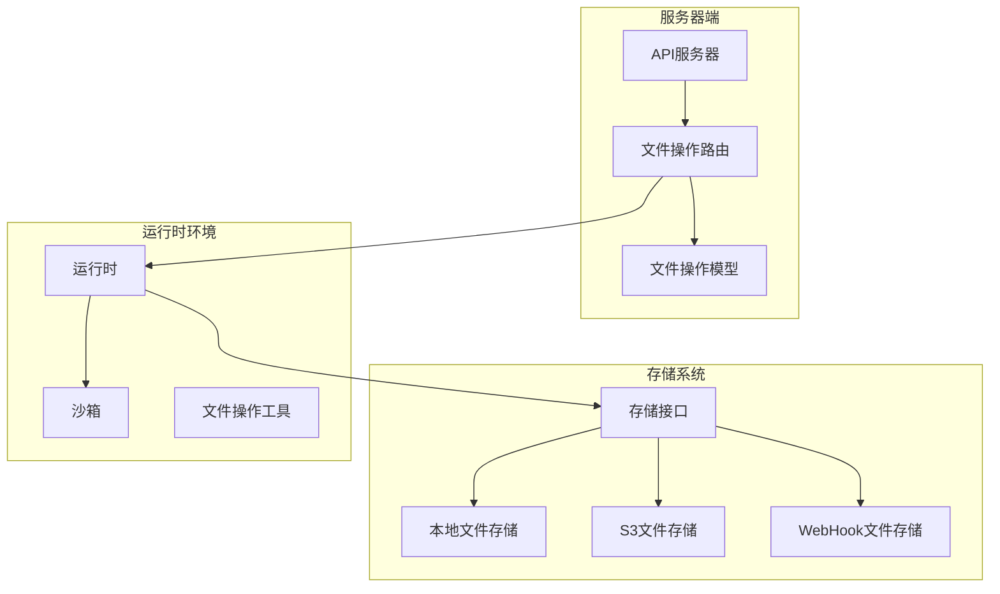
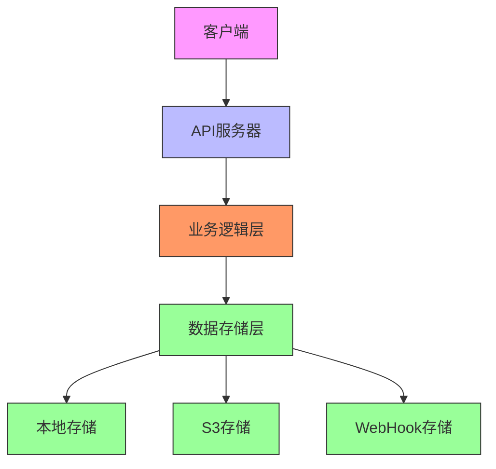
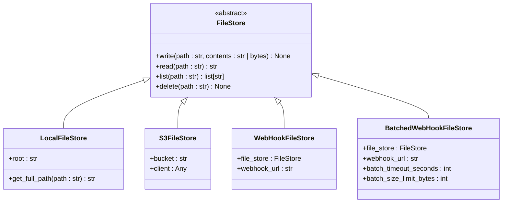
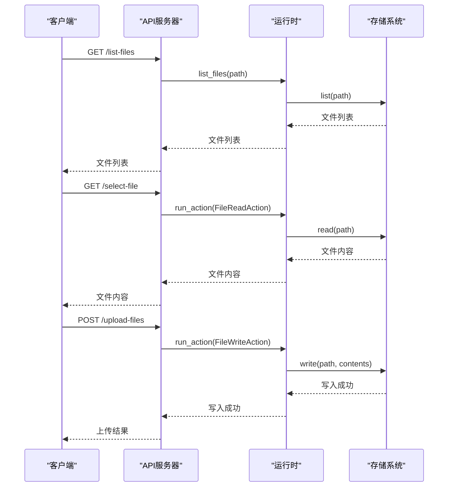
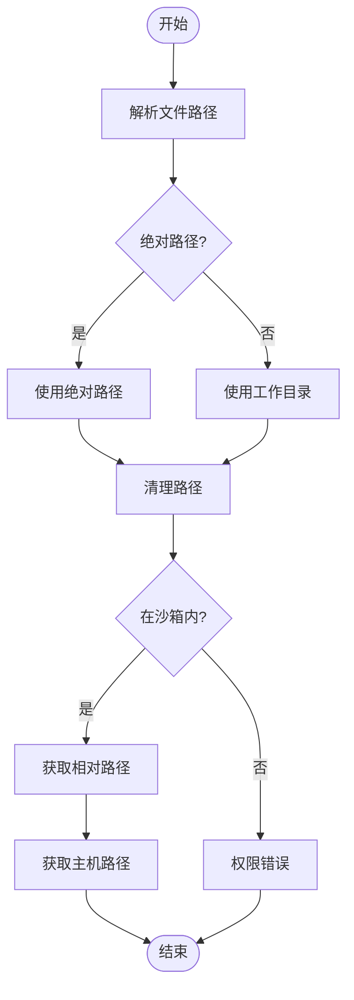
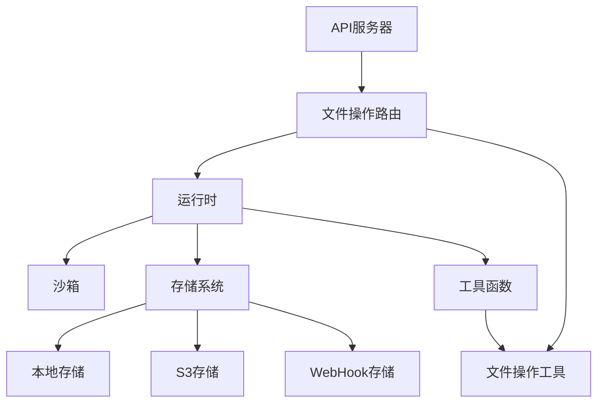

# 文件操作

<cite>
**本文档引用的文件**
- [files.py](file://openhands/server/files.py)
- [routes/files.py](file://openhands/server/routes/files.py)
- [files.py](file://openhands/storage/files.py)
- [local.py](file://openhands/storage/local.py)
- [s3.py](file://openhands/storage/s3.py)
- [file_config.py](file://openhands/server/file_config.py)
- [files.py](file://openhands/runtime/utils/files.py)
- [batched_web_hook.py](file://openhands/storage/batched_web_hook.py)
- [web_hook.py](file://openhands/storage/web_hook.py)
- [action_execution_server.py](file://openhands/runtime/action_execution_server.py)
- [file_ops/__init__.py](file://openhands/runtime/plugins/agent_skills/file_ops/__init__.py)
</cite>

## 目录
1. [简介](#简介)
2. [项目结构](#项目结构)
3. [核心组件](#核心组件)
4. [架构概述](#架构概述)
5. [详细组件分析](#详细组件分析)
6. [依赖分析](#依赖分析)
7. [性能考虑](#性能考虑)
8. [故障排除指南](#故障排除指南)
9. [结论](#结论)
10. [附录](#附录)（如有必要）

## 简介
本文档详细介绍了OpenHands平台的文件操作API，包括文件读取、写入、删除和目录浏览等功能。文档详细描述了每个端点的请求/响应模式，包括文件路径参数、内容编码和权限控制。同时提供了代码示例，展示如何在会话中进行文件操作，解释了文件操作的安全限制和沙箱环境中的文件系统隔离机制，并记录了大文件处理的最佳实践和性能优化建议。

## 项目结构
OpenHands平台的文件操作功能分布在多个模块中，主要涉及服务器端API、存储系统和运行时环境。文件操作API通过REST端点暴露，支持文件的读取、写入、删除和目录浏览等基本操作。存储系统提供了多种后端实现，包括本地文件系统和S3存储。运行时环境负责在沙箱中执行文件操作，并提供文件系统隔离。

**图表来源**
- [files.py](file://openhands/server/files.py)
- [routes/files.py](file://openhands/server/routes/files.py)
- [files.py](file://openhands/storage/files.py)
- [local.py](file://openhands/storage/local.py)
- [s3.py](file://openhands/storage/s3.py)
- [action_execution_server.py](file://openhands/runtime/action_execution_server.py)

**章节来源**
- [files.py](file://openhands/server/files.py#L1-L11)
- [routes/files.py](file://openhands/server/routes/files.py#L1-L319)
- [files.py](file://openhands/storage/files.py#L1-L20)

## 核心组件
文件操作API的核心组件包括文件存储接口、文件操作路由和运行时环境。文件存储接口定义了文件读取、写入、删除和目录浏览的基本操作。文件操作路由将这些操作暴露为REST端点。运行时环境负责在沙箱中执行文件操作，并提供文件系统隔离。

**章节来源**
- [files.py](file://openhands/storage/files.py#L1-L20)
- [routes/files.py](file://openhands/server/routes/files.py#L30-L319)
- [action_execution_server.py](file://openhands/runtime/action_execution_server.py#L1019-L1047)

## 架构概述
OpenHands平台的文件操作架构采用分层设计，将API接口、业务逻辑和数据存储分离。API层通过REST端点暴露文件操作功能。业务逻辑层处理文件操作的权限控制、路径解析和错误处理。数据存储层提供多种后端实现，包括本地文件系统和S3存储。

**图表来源**
- [routes/files.py](file://openhands/server/routes/files.py#L30-L319)
- [files.py](file://openhands/storage/files.py#L1-L20)
- [local.py](file://openhands/storage/local.py#L1-L54)
- [s3.py](file://openhands/storage/s3.py#L1-L166)

## 详细组件分析

### 文件存储接口分析
文件存储接口定义了文件操作的基本契约，包括读取、写入、删除和目录浏览等操作。该接口采用抽象基类实现，允许不同的后端存储实现。

**图表来源**
- [files.py](file://openhands/storage/files.py#L4-L20)
- [local.py](file://openhands/storage/local.py#L8-L54)
- [s3.py](file://openhands/storage/s3.py#L22-L166)
- [web_hook.py](file://openhands/storage/web_hook.py#L41-L89)
- [batched_web_hook.py](file://openhands/storage/batched_web_hook.py#L86-L119)

**章节来源**
- [files.py](file://openhands/storage/files.py#L1-L20)
- [local.py](file://openhands/storage/local.py#L1-L54)
- [s3.py](file://openhands/storage/s3.py#L1-L166)

### 文件操作API分析
文件操作API通过REST端点暴露文件操作功能，支持文件的读取、写入、删除和目录浏览等操作。API端点包括文件列表、文件读取、文件上传和工作区压缩等。

**图表来源**
- [routes/files.py](file://openhands/server/routes/files.py#L35-L319)
- [action_execution_server.py](file://openhands/runtime/action_execution_server.py#L1019-L1047)
- [files.py](file://openhands/storage/files.py#L6-L20)

**章节来源**
- [routes/files.py](file://openhands/server/routes/files.py#L35-L319)
- [action_execution_server.py](file://openhands/runtime/action_execution_server.py#L1019-L1047)

### 文件系统隔离机制分析
OpenHands平台通过沙箱环境实现文件系统隔离，确保文件操作的安全性。文件路径解析函数负责将沙箱内的路径映射到主机文件系统，并验证路径的合法性。

**图表来源**
- [files.py](file://openhands/runtime/utils/files.py#L12-L51)
- [action_execution_server.py](file://openhands/runtime/action_execution_server.py#L1020-L1033)

**章节来源**
- [files.py](file://openhands/runtime/utils/files.py#L12-L51)

## 依赖分析
文件操作功能依赖于多个组件，包括存储系统、运行时环境和API服务器。存储系统提供文件读取、写入、删除和目录浏览的基本操作。运行时环境负责在沙箱中执行文件操作。API服务器将这些操作暴露为REST端点。

**图表来源**
- [routes/files.py](file://openhands/server/routes/files.py#L30-L319)
- [action_execution_server.py](file://openhands/runtime/action_execution_server.py#L1019-L1047)
- [files.py](file://openhands/storage/files.py#L1-L20)
- [files.py](file://openhands/runtime/utils/files.py#L1-L151)

**章节来源**
- [routes/files.py](file://openhands/server/routes/files.py#L30-L319)
- [action_execution_server.py](file://openhands/runtime/action_execution_server.py#L1019-L1047)
- [files.py](file://openhands/storage/files.py#L1-L20)

## 性能考虑
文件操作的性能优化主要集中在大文件处理和批量操作上。对于大文件，建议使用分块读取和写入，避免一次性加载整个文件到内存中。对于批量操作，可以使用批处理WebHook来减少网络请求次数。

### 大文件处理最佳实践
1. 使用分块读取和写入，避免一次性加载整个文件到内存中
2. 对于二进制文件，使用Base64编码进行传输
3. 设置合理的超时时间，避免长时间等待
4. 使用流式传输，减少内存占用

### 批量操作优化
1. 使用批处理WebHook，将多个文件操作合并为一个请求
2. 设置合理的批处理超时时间和大小限制
3. 对于同一文件的多次写入操作，只保留最后一次
4. 使用异步处理，提高响应速度

**章节来源**
- [batched_web_hook.py](file://openhands/storage/batched_web_hook.py#L72-L119)
- [test_batched_web_hook.py](file://openhands/tests/unit/storage/test_batched_web_hook.py#L52-L235)
- [frontend/src/utils/file-processing.ts](file://frontend/src/utils/file-processing.ts#L1-L51)

## 故障排除指南
### 常见问题及解决方案
1. **文件路径错误**：确保文件路径正确，避免路径遍历攻击
2. **权限不足**：检查用户权限，确保有足够的权限访问文件
3. **文件不存在**：在读取文件前检查文件是否存在
4. **网络超时**：增加超时时间，或使用异步处理
5. **存储空间不足**：检查存储空间，清理不必要的文件

### 错误处理
文件操作API使用标准的HTTP状态码来表示错误：
- 400 Bad Request：请求参数错误
- 403 Forbidden：权限不足
- 404 Not Found：文件不存在
- 415 Unsupported Media Type：不支持的媒体类型
- 500 Internal Server Error：服务器内部错误

**章节来源**
- [routes/files.py](file://openhands/server/routes/files.py#L35-L319)
- [files.py](file://openhands/runtime/utils/files.py#L71-L150)
- [action_execution_server.py](file://openhands/runtime/action_execution_server.py#L548-L576)

## 结论
OpenHands平台的文件操作API提供了完整的文件管理功能，包括文件读取、写入、删除和目录浏览等操作。通过分层架构设计，实现了API接口、业务逻辑和数据存储的分离。沙箱环境提供了文件系统隔离，确保了文件操作的安全性。批处理WebHook和分块读取写入等机制优化了大文件处理性能。建议在实际使用中遵循最佳实践，合理配置参数，确保系统的稳定性和安全性。

## 附录

### 文件操作端点参考
| 端点 | 方法 | 描述 | 请求参数 | 响应 |
| --- | --- | --- | --- | --- |
| /list-files | GET | 列出目录中的文件 | path: 目录路径 | 文件路径列表 |
| /select-file | GET | 读取文件内容 | file: 文件路径 | 文件内容 |
| /zip-directory | GET | 压缩工作区 | 无 | ZIP文件 |
| /upload-files | POST | 上传文件 | files: 文件列表 | 上传结果 |

### 配置选项
| 配置项 | 默认值 | 描述 |
| --- | --- | --- |
| file_uploads_max_file_size_mb | 0 | 最大文件大小（MB），0表示无限制 |
| file_uploads_restrict_file_types | False | 是否限制文件类型 |
| file_uploads_allowed_extensions | ['.*'] | 允许的文件扩展名 |

**章节来源**
- [routes/files.py](file://openhands/server/routes/files.py#L35-L319)
- [file_config.py](file://openhands/server/file_config.py#L8-L140)