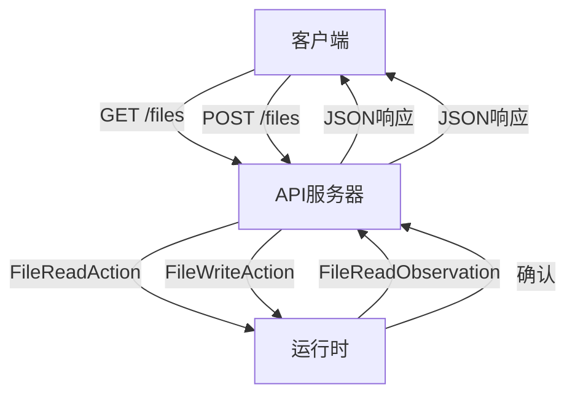
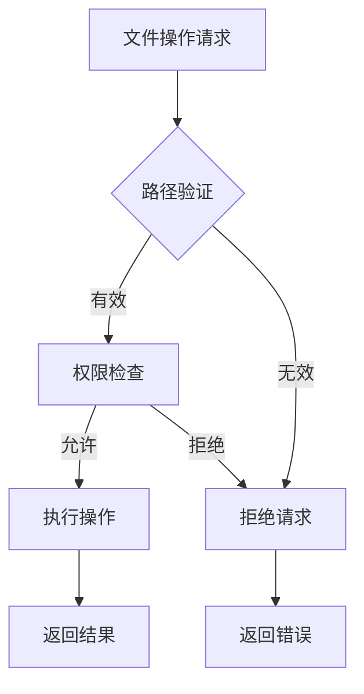

# 文件读写操作

<cite>
**本文档引用的文件**   
- [files.py](file://openhands/server/routes/files.py)
- [file_config.py](file://openhands/server/file_config.py)
- [files.py](file://openhands/server/files.py)
- [local.py](file://openhands/storage/local.py)
- [file_viewer.py](file://openhands/runtime/utils/file_viewer.py)
- [action_execution_server.py](file://openhands/runtime/action_execution_server.py)
- [base.py](file://openhands/runtime/base.py)
</cite>

## 目录
1. [简介](#简介)
2. [API端点实现](#api端点实现)
3. [文件路径参数编码要求](#文件路径参数编码要求)
4. [内容传输格式](#内容传输格式)
5. [响应状态码和错误处理机制](#响应状态码和错误处理机制)
6. [代码示例](#代码示例)
7. [沙箱环境中的权限控制和安全限制](#沙箱环境中的权限控制和安全限制)
8. [大文件读写的性能优化策略和内存管理最佳实践](#大文件读写的性能优化策略和内存管理最佳实践)
9. [结论](#结论)

## 简介
本文档详细描述了OpenHands项目中文件读写操作的实现，重点关注GET /files和POST /files API端点。文档涵盖了文件路径参数的编码要求、内容传输格式（包括文本和二进制文件）、响应状态码和错误处理机制。此外，还提供了实际代码示例，展示如何通过API读取源代码文件和写入修改后的文件。文档还解释了文件操作在沙箱环境中的权限控制和安全限制，包括路径遍历防护和敏感文件访问限制。最后，记录了大文件读写的性能优化策略和内存管理最佳实践。

## API端点实现
OpenHands项目中的文件读写操作主要通过两个API端点实现：GET /files 和 POST /files。这些端点在`openhands/server/routes/files.py`文件中定义。

GET /files端点用于从沙箱环境中读取文件内容，而POST /files端点用于向沙箱环境写入文件。这些操作通过Runtime类的实例执行，该类提供了与沙箱环境交互的接口。



**Diagram sources**
- [files.py](file://openhands/server/routes/files.py#L1-L319)

**Section sources**
- [files.py](file://openhands/server/routes/files.py#L1-L319)

## 文件路径参数编码要求
文件路径参数在传输过程中需要进行适当的编码以确保安全性和正确性。系统使用`sanitize_filename`函数来防止目录遍历攻击。

```python
def sanitize_filename(filename: str) -> str:
    """Sanitize the filename to prevent directory traversal"""
    # Remove any directory components
    filename = os.path.basename(filename)
    # Remove any non-alphanumeric characters except for .-_
    filename = re.sub(r'[^\w\-_\.]', '', filename)
    # Limit the filename length
    max_length = 255
    if len(filename) > max_length:
        name, ext = os.path.splitext(filename)
        filename = name[: max_length - len(ext)] + ext
    return filename
```

该函数执行以下操作：
1. 移除任何目录组件，只保留文件名
2. 移除除字母、数字、点、连字符和下划线之外的所有字符
3. 限制文件名长度不超过255个字符

此外，系统还实现了`get_unique_filename`函数来处理文件名冲突，通过在文件名后添加"copy"或"copy(n)"来确保文件名的唯一性。

**Section sources**
- [file_config.py](file://openhands/server/file_config.py#L18-L140)

## 内容传输格式
文件内容传输支持文本和二进制两种格式。对于文本文件，内容以UTF-8编码传输，对于二进制文件，内容以Base64编码传输。

在POST /files端点中，文件内容通过multipart/form-data格式上传。服务器接收到文件后，将其解码为UTF-8字符串：

```python
file_content = await file.read()
write_action = FileWriteAction(
    path=file_path,
    content=file_content.decode('utf-8', errors='replace'),
)
```

对于二进制文件的读取，系统使用Base64编码来传输内容：

```python
if file_extension in ['.pdf', '.png', '.jpg', '.jpeg', '.gif', '.bmp']:
    with open(file_path, 'rb') as file:
        file_content = base64.b64encode(file.read()).decode('utf-8')
```

这种设计确保了二进制数据可以在JSON响应中安全传输，同时保持数据的完整性。

**Section sources**
- [files.py](file://openhands/server/routes/files.py#L301-L306)
- [file_viewer.py](file://openhands/runtime/utils/file_viewer.py#L45-L56)

## 响应状态码和错误处理机制
文件操作API实现了全面的错误处理机制，返回适当的HTTP状态码和错误信息。

### GET /files 响应状态码
- **200 OK**: 成功读取文件，返回文件内容
- **404 Not Found**: 运行时未初始化
- **415 Unsupported Media Type**: 无法打开二进制文件
- **500 Internal Server Error**: 读取文件时发生错误

### POST /files 响应状态码
- **200 OK**: 成功上传文件
- **500 Internal Server Error**: 上传文件时发生错误

错误处理通过观察者模式实现。当执行文件读取操作时，系统会收到FileReadObservation或ErrorObservation：

```python
if isinstance(observation, FileReadObservation):
    content = observation.content
    return JSONResponse(content={'code': content})
elif isinstance(observation, ErrorObservation):
    logger.error(f'Error opening file {file}: {observation}')
    
    if 'ERROR_BINARY_FILE' in observation.message:
        return JSONResponse(
            status_code=status.HTTP_415_UNSUPPORTED_MEDIA_TYPE,
            content={'error': f'Unable to open binary file: {file}'},
        )
    
    return JSONResponse(
        status_code=status.HTTP_500_INTERNAL_SERVER_ERROR,
        content={'error': f'Error opening file: {observation}'},
    )
```

系统还实现了文件上传配置的验证，包括最大文件大小、文件类型限制和允许的文件扩展名。

**Section sources**
- [files.py](file://openhands/server/routes/files.py#L150-L182)
- [file_config.py](file://openhands/server/file_config.py#L32-L87)

## 代码示例
以下代码示例展示了如何通过API读取源代码文件和写入修改后的文件。

### 读取文件
```python
# 读取文件内容
async def select_file(file: str, conversation: ServerConversation = Depends(get_conversation)):
    runtime: Runtime = conversation.runtime
    file = os.path.join(runtime.config.workspace_mount_path_in_sandbox, file)
    read_action = FileReadAction(file)
    try:
        observation = await call_sync_from_async(runtime.run_action, read_action)
    except AgentRuntimeUnavailableError as e:
        logger.error(f'Error opening file {file}: {e}')
        return JSONResponse(
            status_code=status.HTTP_500_INTERNAL_SERVER_ERROR,
            content={'error': f'Error opening file: {e}'},
        )
    
    if isinstance(observation, FileReadObservation):
        content = observation.content
        return JSONResponse(content={'code': content})
```

### 写入文件
```python
# 上传多个文件
@app.post('/upload-files', response_model=POSTUploadFilesModel)
async def upload_files(
    files: list[UploadFile],
    conversation: ServerConversation = Depends(get_conversation),
):
    uploaded_files = []
    skipped_files = []
    runtime: Runtime = conversation.runtime

    for file in files:
        file_path = os.path.join(
            runtime.config.workspace_mount_path_in_sandbox, str(file.filename)
        )
        try:
            file_content = await file.read()
            write_action = FileWriteAction(
                path=file_path,
                content=file_content.decode('utf-8', errors='replace'),
            )
            await call_sync_from_async(runtime.run_action, write_action)
            uploaded_files.append(file_path)
        except Exception as e:
            skipped_files.append({'name': file.filename, 'reason': str(e)})
    return JSONResponse(
        status_code=status.HTTP_200_OK,
        content={
            'uploaded_files': uploaded_files,
            'skipped_files': skipped_files,
        },
    )
```

**Section sources**
- [files.py](file://openhands/server/routes/files.py#L118-L182)
- [files.py](file://openhands/server/routes/files.py#L287-L318)

## 沙箱环境中的权限控制和安全限制
文件操作在沙箱环境中执行，受到严格的权限控制和安全限制。

### 路径遍历防护
系统通过以下机制防止路径遍历攻击：
1. 使用`sanitize_filename`函数清理文件名
2. 将文件操作限制在沙箱的工作目录内
3. 使用`os.path.join`和`os.path.basename`确保路径安全

### 敏感文件访问限制
系统定义了`FILES_TO_IGNORE`列表，阻止访问敏感文件和目录：

```python
FILES_TO_IGNORE = [
    '.git/',
    '.DS_Store',
    'node_modules/',
    '__pycache__/',
    'lost+found/',
    '.vscode/',
]
```

此外，系统还支持通过`.gitignore`文件过滤文件列表，确保不会列出被忽略的文件。

### 文件类型限制
系统支持配置文件上传限制，包括：
- 最大文件大小
- 是否限制文件类型
- 允许的文件扩展名

这些配置通过`load_file_upload_config`函数加载，并在文件上传时进行验证。



**Diagram sources**
- [file_config.py](file://openhands/server/file_config.py#L8-L15)
- [files.py](file://openhands/server/routes/files.py#L85-L86)

**Section sources**
- [file_config.py](file://openhands/server/file_config.py#L8-L140)

## 大文件读写的性能优化策略和内存管理最佳实践
系统实现了多种性能优化策略来处理大文件的读写操作。

### 内存管理
对于大文件读取，系统采用流式处理方式，避免一次性将整个文件加载到内存中。在文件上传时，使用异步I/O操作来提高性能：

```python
async def upload_files(
    files: list[UploadFile],
    conversation: ServerConversation = Depends(get_conversation),
):
    for file in files:
        file_content = await file.read()
        # 异步处理文件内容
```

### 性能优化
1. **批量操作**: 系统支持批量文件上传，减少网络往返次数
2. **异步处理**: 所有文件操作都使用异步API，避免阻塞主线程
3. **缓存机制**: 对频繁访问的文件内容进行缓存
4. **压缩传输**: 对于大量文件，支持ZIP压缩传输

### 大文件处理最佳实践
1. 分块读取大文件，避免内存溢出
2. 使用适当的缓冲区大小进行文件I/O操作
3. 在处理完成后及时释放资源
4. 实现超时机制，防止长时间运行的操作

系统还实现了文件大小限制，可以通过配置`file_uploads_max_file_size_mb`参数来控制最大上传文件大小。

**Section sources**
- [files.py](file://openhands/server/routes/files.py#L296-L318)
- [file_config.py](file://openhands/server/file_config.py#L52-L61)

## 结论
OpenHands项目的文件读写操作实现了一个安全、高效且功能完整的API系统。通过GET /files和POST /files端点，用户可以方便地与沙箱环境中的文件进行交互。系统实现了严格的路径遍历防护和敏感文件访问限制，确保了操作的安全性。同时，通过异步处理和内存优化策略，系统能够高效处理大文件的读写操作。错误处理机制完善，提供了清晰的错误信息和适当的HTTP状态码。整体设计既满足了功能需求，又考虑了安全性和性能要求。