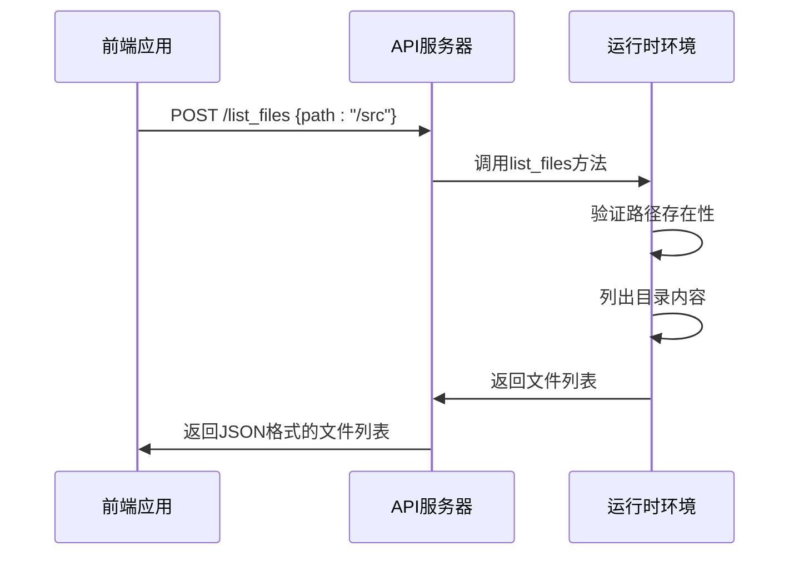
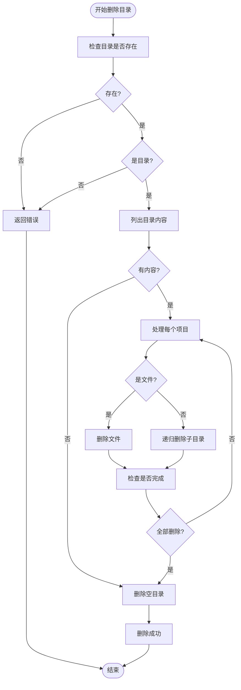

# 目录操作

<cite>
**本文档引用的文件**   
- [action_execution_server.py](file://openhands/runtime/action_execution_server.py)
- [files.py](file://openhands/server/routes/files.py)
- [file_viewer_server.py](file://openhands/runtime/file_viewer_server.py)
- [FileStore.py](file://openhands/storage/files.py)
- [runtime_init.py](file://openhands/runtime/utils/runtime_init.py)
- [test_storage.py](file://tests/unit/storage/test_storage.py)
</cite>

## 目录

1. [简介](#简介)
2. [目录浏览功能](#目录浏览功能)
3. [目录创建与删除](#目录创建与删除)
4. [响应数据格式](#响应数据格式)
5. [权限控制与安全机制](#权限控制与安全机制)
6. [性能优化与分页策略](#性能优化与分页策略)
7. [代码示例](#代码示例)
8. [多租户环境隔离](#多租户环境隔离)
9. [结论](#结论)

## 简介

OpenHands平台提供了一套完整的目录操作功能，支持用户通过API进行目录浏览、创建和删除等操作。系统通过安全的沙箱环境执行这些操作，确保了文件系统的完整性和用户数据的安全性。目录操作功能是平台核心功能之一，为用户提供了一个直观的文件管理界面，支持在多租户环境中进行安全的文件操作。

**Section sources**
- [action_execution_server.py](file://openhands/runtime/action_execution_server.py#L1-L1079)
- [files.py](file://openhands/server/routes/files.py#L1-L319)

## 目录浏览功能

### 获取目录结构树

OpenHands平台通过`/list_files` API端点提供目录结构树的获取功能。该功能允许用户列出指定路径下的所有文件和子目录。API接收一个可选的`path`参数，用于指定要列出内容的目录路径。如果未提供路径参数，则默认列出工作目录的内容。



**Diagram sources**
- [action_execution_server.py](file://openhands/runtime/action_execution_server.py#L995-L1078)
- [files.py](file://openhands/server/routes/files.py#L35-L110)

### 列出目录内容

目录内容的列出功能通过以下步骤实现：
1. 验证请求路径的有效性
2. 检查目录是否存在
3. 使用`os.listdir()`获取目录内容
4. 分离目录和文件条目
5. 对结果进行排序并返回

系统会自动过滤掉某些系统和隐藏文件/目录，如`.git`、`__pycache__`等。此外，系统还会读取`.gitignore`文件，并根据其中的规则过滤文件列表，确保用户不会看到被忽略的文件。

**Section sources**
- [action_execution_server.py](file://openhands/runtime/action_execution_server.py#L1019-L1078)
- [files.py](file://openhands/server/routes/files.py#L87-L103)

## 目录创建与删除

### 创建新目录

虽然直接的目录创建API未在代码中明确实现，但系统通过文件写入操作间接支持目录创建。当用户尝试写入一个不存在的目录中的文件时，系统会自动创建所需的目录结构。

```python
# 系统自动处理目录创建
if not os.path.exists(os.path.dirname(filepath)):
    os.makedirs(os.path.dirname(filepath))
```

这种设计简化了API接口，同时确保了文件操作的原子性。用户无需显式创建目录，只需指定完整的文件路径，系统会自动处理目录结构的创建。

### 删除目录

目录删除功能通过`delete`方法实现。系统支持递归删除目录及其内容。当删除一个目录时，系统会遍历目录中的所有文件和子目录，并逐个删除。对于非空目录，系统会先删除其内容，然后再删除目录本身。



**Diagram sources**
- [test_storage.py](file://tests/unit/storage/test_storage.py#L80-L97)
- [files.py](file://openhands/storage/files.py#L18-L19)

## 响应数据格式

### 文件/目录类型标识

目录操作的响应数据采用JSON格式，其中文件和目录通过特定的标识进行区分。目录条目在名称末尾添加斜杠(`/`)，而文件条目则不包含斜杠。这种简单的约定使得前端可以轻松地区分文件和目录。

```json
[
  "src/",
  "tests/",
  "README.md",
  "config.json"
]
```

### 大小和修改时间戳

虽然基本的目录列表API不直接返回文件大小和修改时间戳，但这些信息可以通过其他API获取。系统使用标准的文件系统元数据来存储这些信息，包括：

- **大小**: 文件的字节大小
- **修改时间戳**: 文件最后修改的Unix时间戳
- **创建时间戳**: 文件创建的Unix时间戳
- **权限**: 文件的访问权限

这些元数据在文件操作过程中被维护，并可以通过特定的API端点查询。

**Section sources**
- [action_execution_server.py](file://openhands/runtime/action_execution_server.py#L1043-L1057)
- [files.py](file://openhands/server/routes/files.py#L110)

## 权限控制与安全机制

### 用户权限管理

OpenHands平台实施严格的权限控制机制，确保用户只能访问其授权的文件和目录。系统通过以下方式实现权限控制：

1. **用户隔离**: 每个用户在沙箱环境中运行，拥有独立的文件系统视图
2. **文件所有权**: 创建的文件归用户所有，其他用户无法访问
3. **权限设置**: 新创建的文件设置适当的权限(664)，确保安全性

```python
# 设置文件权限和所有权
if file_exists:
    os.chmod(filepath, file_stat.st_mode)
    os.chown(filepath, file_stat.st_uid, file_stat.st_gid)
else:
    os.chmod(filepath, 0o664)
    os.chown(filepath, self.user_id, self.user_id)
```

### 安全限制

系统实施多项安全限制，防止潜在的安全风险：

- **路径遍历防护**: 验证所有路径，防止`../`等路径遍历攻击
- **绝对路径限制**: 限制用户只能访问其工作目录内的文件
- **二进制文件保护**: 防止读取和修改二进制文件
- **大文件处理**: 限制单个文件的大小，防止资源耗尽

**Section sources**
- [action_execution_server.py](file://openhands/runtime/action_execution_server.py#L548-L563)
- [runtime_init.py](file://openhands/runtime/utils/runtime_init.py#L117-L124)

## 性能优化与分页策略

### 大型目录列表处理

对于大型目录列表，系统采用以下优化策略：

1. **异步处理**: 使用异步I/O操作，避免阻塞主线程
2. **内存优化**: 分批处理大型目录，减少内存占用
3. **缓存机制**: 缓存频繁访问的目录列表，提高响应速度

虽然当前实现中没有明确的分页机制，但系统通过以下方式处理大型目录：

- **排序优化**: 使用高效的排序算法对文件列表进行排序
- **过滤优化**: 在列出文件后立即应用过滤规则，减少数据传输量
- **并发处理**: 支持并发的目录操作请求

### 性能建议

为了优化目录操作的性能，建议：

1. **避免深层目录结构**: 尽量保持目录结构扁平化
2. **合理使用.gitignore**: 正确配置.gitignore文件，减少不必要的文件扫描
3. **批量操作**: 尽可能使用批量操作API，减少网络往返次数
4. **缓存策略**: 在客户端实现适当的缓存策略，减少重复请求

**Section sources**
- [action_execution_server.py](file://openhands/runtime/action_execution_server.py#L1061-L1067)
- [files.py](file://openhands/server/routes/files.py#L85-L86)

## 代码示例

### 浏览目录内容

```bash
# 列出根目录内容
curl -X POST -d '{"path": "/"}' http://localhost:3000/list_files

# 列出src目录内容
curl -X POST -d '{"path": "/src"}' http://localhost:3000/list_files

# 列出当前工作目录内容
curl -X POST http://localhost:3000/list_files
```

### 创建和管理文件

```python
# 通过API创建文件(自动创建目录)
import requests

url = "http://localhost:3000/api/conversations/{conversation_id}/upload-files"
files = {'file': ('new_file.txt', 'Hello, World!')}
response = requests.post(url, files=files)
```

### 处理文件操作响应

```javascript
// 前端处理目录列表响应
async function listDirectory(path) {
    const response = await fetch('/list_files', {
        method: 'POST',
        headers: {'Content-Type': 'application/json'},
        body: JSON.stringify({path: path})
    });
    
    const fileList = await response.json();
    const directories = fileList.filter(item => item.endsWith('/'));
    const files = fileList.filter(item => !item.endsWith('/'));
    
    return {directories, files};
}
```

**Section sources**
- [action_execution_server.py](file://openhands/runtime/action_execution_server.py#L995-L1078)
- [files.py](file://openhands/server/routes/files.py#L287-L318)

## 多租户环境隔离

### 用户隔离机制

在多租户环境中，OpenHands平台通过以下机制实现用户隔离：

1. **独立沙箱**: 每个用户会话在独立的沙箱环境中运行
2. **文件系统隔离**: 用户只能访问其工作目录内的文件
3. **用户ID映射**: 每个用户有唯一的用户ID，用于文件所有权管理

### 数据隔离策略

系统实施严格的数据隔离策略，确保不同用户之间的数据完全隔离：

- **目录结构**: 每个用户的文件存储在独立的目录中
- **权限控制**: 文件权限设置确保其他用户无法访问
- **会话管理**: 每个会话有独立的运行时环境

这种隔离机制不仅保护了用户数据的隐私，还防止了跨用户的安全攻击。

**Section sources**
- [runtime_init.py](file://openhands/runtime/utils/runtime_init.py#L47-L127)
- [action_execution_server.py](file://openhands/runtime/action_execution_server.py#L181-L188)

## 结论

OpenHands平台的目录操作功能提供了一套完整、安全且高效的文件管理解决方案。通过精心设计的API接口和严格的权限控制机制，系统能够在多租户环境中安全地执行目录浏览、创建和删除等操作。响应数据格式简洁明了，便于前端解析和展示。虽然当前实现中缺少明确的分页机制，但通过异步处理和内存优化，系统能够有效处理大型目录列表。未来可以考虑添加分页支持和更详细的文件元数据返回，以进一步提升用户体验和性能。