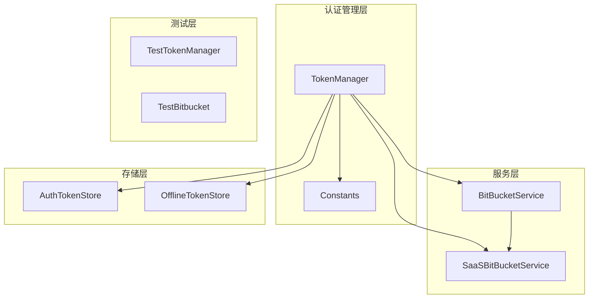
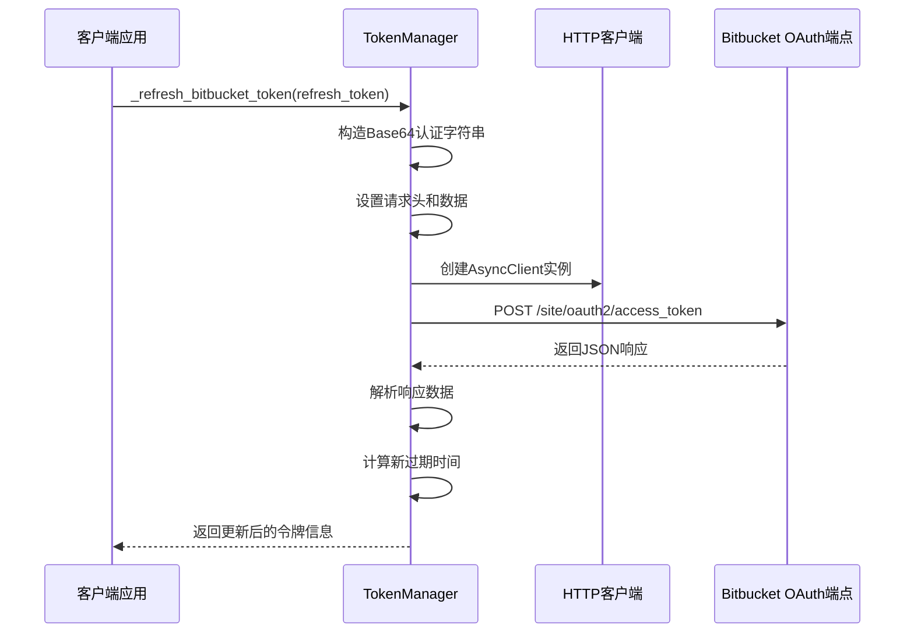
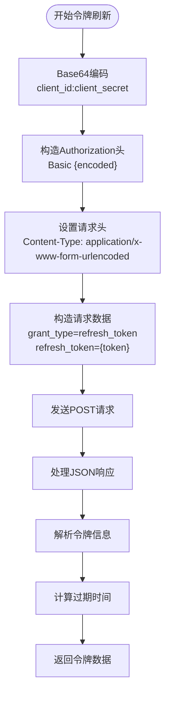
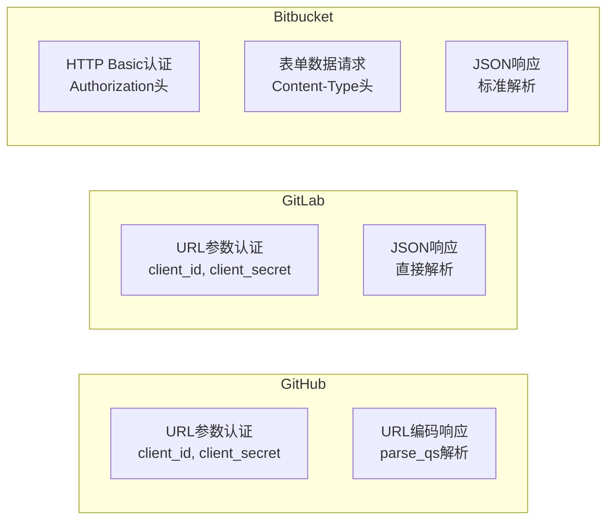
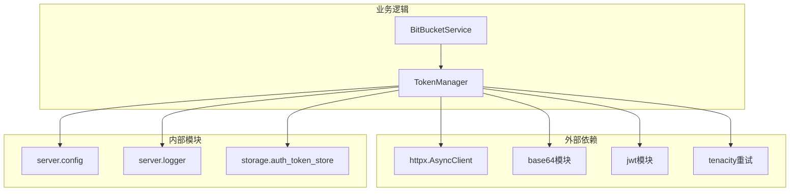

# Bitbucket令牌刷新机制详细文档

<cite>
**本文档引用的文件**
- [token_manager.py](file://enterprise/server/auth/token_manager.py)
- [constants.py](file://enterprise/server/auth/constants.py)
- [bitbucket_service.py](file://enterprise/integrations/bitbucket/bitbucket_service.py)
- [test_bitbucket.py](file://tests/unit/integrations/bitbucket/test_bitbucket.py)
- [test_token_manager.py](file://enterprise/tests/unit/test_token_manager.py)
</cite>

## 目录
1. [简介](#简介)
2. [项目结构概览](#项目结构概览)
3. [核心组件分析](#核心组件分析)
4. [架构概览](#架构概览)
5. [详细组件分析](#详细组件分析)
6. [依赖关系分析](#依赖关系分析)
7. [性能考虑](#性能考虑)
8. [故障排除指南](#故障排除指南)
9. [结论](#结论)

## 简介

Bitbucket令牌刷新机制是OpenHands系统中用于管理Bitbucket OAuth令牌生命周期的核心功能。该机制通过`_refresh_bitbucket_token`方法实现了基于OAuth 2.0标准的令牌刷新流程，支持使用Base64编码的客户端凭据进行HTTP Basic认证，并能够自动处理令牌过期和重新获取新令牌的过程。

本文档详细分析了该方法的实现原理、认证机制、错误处理策略以及与其他Git平台（GitHub、GitLab）的差异。

## 项目结构概览

Bitbucket令牌刷新功能主要分布在以下关键模块中：

**图表来源**
- [token_manager.py](file://enterprise/server/auth/token_manager.py#L78-L442)
- [bitbucket_service.py](file://enterprise/integrations/bitbucket/bitbucket_service.py#L9-L70)

**章节来源**
- [token_manager.py](file://enterprise/server/auth/token_manager.py#L1-L672)
- [constants.py](file://enterprise/server/auth/constants.py#L1-L33)

## 核心组件分析

### TokenManager类

`TokenManager`类是整个令牌管理系统的核心，负责协调不同身份提供商的令牌操作。该类提供了统一的接口来处理GitHub、GitLab和Bitbucket的令牌刷新。

### BITBUCKET_APP_CLIENT_ID和BITBUCKET_APP_CLIENT_SECRET

这些环境变量定义了Bitbucket应用程序的客户端标识符和密钥，用于OAuth认证流程中的身份验证。

**章节来源**
- [token_manager.py](file://enterprise/server/auth/token_manager.py#L78-L87)
- [constants.py](file://enterprise/server/auth/constants.py#L17-L18)

## 架构概览

Bitbucket令牌刷新机制采用分层架构设计，确保了良好的可维护性和扩展性：

**图表来源**
- [token_manager.py](file://enterprise/server/auth/token_manager.py#L388-L414)

## 详细组件分析

### _refresh_bitbucket_token方法实现

#### 方法签名和入口点

该方法作为TokenManager类的一部分，接收刷新令牌作为输入参数，返回包含新访问令牌和刷新令牌的字典。

#### Base64认证机制

方法的核心在于使用Base64编码的客户端凭据进行HTTP Basic认证：

**图表来源**
- [token_manager.py](file://enterprise/server/auth/token_manager.py#L394-L406)

#### 请求构建过程

1. **URL配置**: 使用Bitbucket官方OAuth端点 `https://bitbucket.org/site/oauth2/access_token`
2. **认证头构建**: 通过Base64编码组合客户端ID和密钥
3. **内容类型设置**: 指定表单数据格式
4. **请求体构造**: 包含授权类型和刷新令牌

#### 响应处理流程

方法调用`_parse_refresh_response`方法来处理Bitbucket的JSON响应，该方法负责：
- 验证必需的令牌字段
- 提取过期时间信息
- 计算新的过期时间戳
- 记录详细的日志信息

**章节来源**
- [token_manager.py](file://enterprise/server/auth/token_manager.py#L388-L414)

### 与其他Git平台的认证差异

#### GitHub认证方式
- 使用客户端ID和密钥作为查询参数
- 响应格式为URL编码字符串，需要额外解析

#### GitLab认证方式  
- 使用客户端ID和密钥作为查询参数
- 响应直接为JSON格式

#### Bitbucket认证方式
- 使用HTTP Basic认证头
- 请求体为表单数据格式
- 响应为标准JSON格式

**图表来源**
- [token_manager.py](file://enterprise/server/auth/token_manager.py#L344-L368)
- [token_manager.py](file://enterprise/server/auth/token_manager.py#L370-L386)

### 错误处理和重试策略

#### 异常处理机制

TokenManager类实现了多层次的异常处理：

1. **网络连接异常**: 使用tenacity库实现重试机制
2. **HTTP状态码异常**: 自动检测并报告失败
3. **令牌格式异常**: 验证响应数据的完整性

#### 日志记录实践

方法实现了详细的日志记录：
- 刷新开始时记录URL和参数
- 成功刷新后记录新令牌信息
- 失败时记录详细错误信息

**章节来源**
- [token_manager.py](file://enterprise/server/auth/token_manager.py#L444-L447)
- [token_manager.py](file://enterprise/server/auth/token_manager.py#L334-L342)

## 依赖关系分析

### 核心依赖关系

**图表来源**
- [token_manager.py](file://enterprise/server/auth/token_manager.py#L1-L10)
- [bitbucket_service.py](file://enterprise/integrations/bitbucket/bitbucket_service.py#L1-L3)

### 环境变量依赖

系统依赖以下环境变量：
- `BITBUCKET_APP_CLIENT_ID`: Bitbucket应用程序客户端ID
- `BITBUCKET_APP_CLIENT_SECRET`: Bitbucket应用程序客户端密钥

**章节来源**
- [constants.py](file://enterprise/server/auth/constants.py#L17-L18)

## 性能考虑

### 并发处理能力

TokenManager使用异步HTTP客户端，支持高并发的令牌刷新请求。

### 缓存策略

系统实现了令牌过期检查机制，在访问令牌即将过期时自动触发刷新。

### 资源管理

使用上下文管理器确保HTTP连接的正确关闭和资源释放。

## 故障排除指南

### 常见问题及解决方案

#### 认证失败
- 检查客户端凭据是否正确配置
- 验证Bitbucket应用程序权限设置

#### 网络连接问题
- 检查防火墙设置
- 验证网络连通性

#### 令牌格式错误
- 确认刷新令牌的有效性
- 检查响应数据的完整性

**章节来源**
- [token_manager.py](file://enterprise/server/auth/token_manager.py#L276-L287)

## 结论

Bitbucket令牌刷新机制展现了现代OAuth 2.0令牌管理的最佳实践。通过使用HTTP Basic认证、标准化的JSON响应格式以及完善的错误处理机制，该实现确保了安全可靠的令牌生命周期管理。

该机制的成功实施体现了以下设计原则：
- **安全性**: 使用Base64编码保护客户端凭据
- **标准化**: 遵循OAuth 2.0标准规范
- **可靠性**: 实现重试机制和详细日志记录
- **可维护性**: 清晰的代码结构和注释

对于开发者而言，理解这一机制有助于更好地集成Bitbucket服务，并为其他Git平台的令牌管理提供参考。