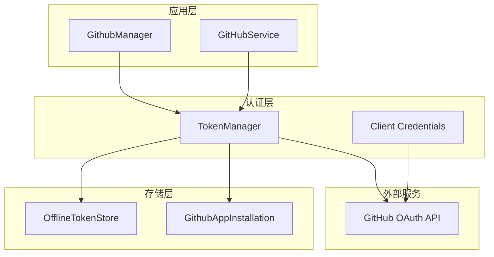
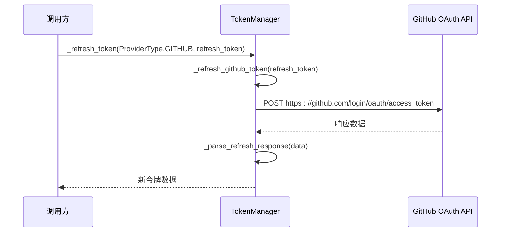
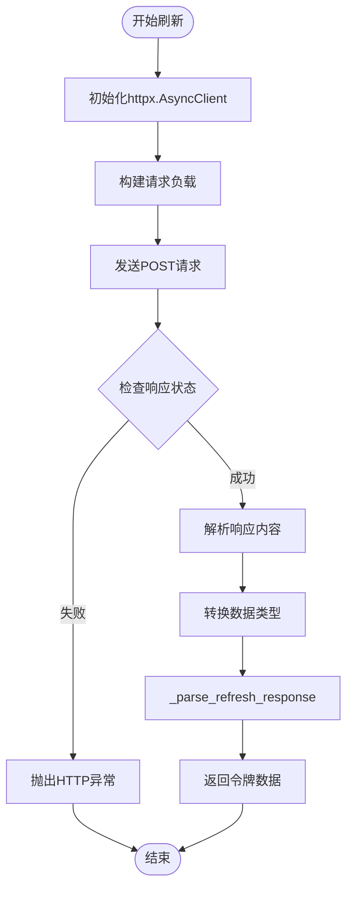
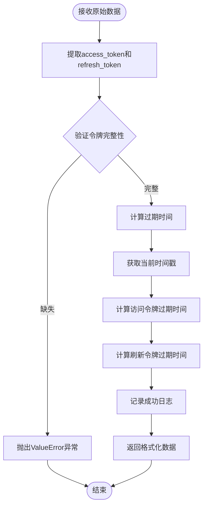
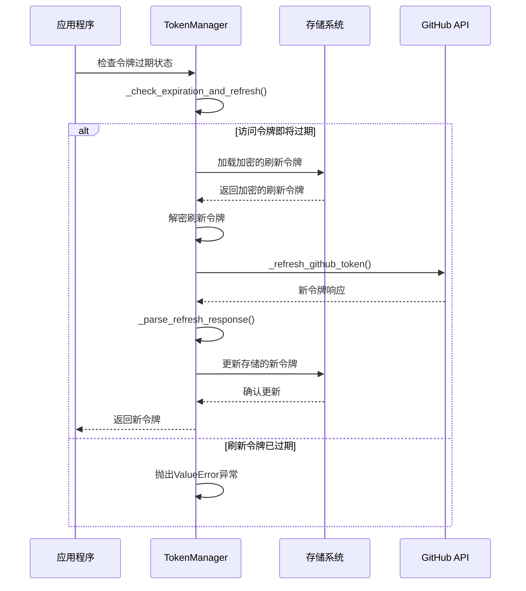
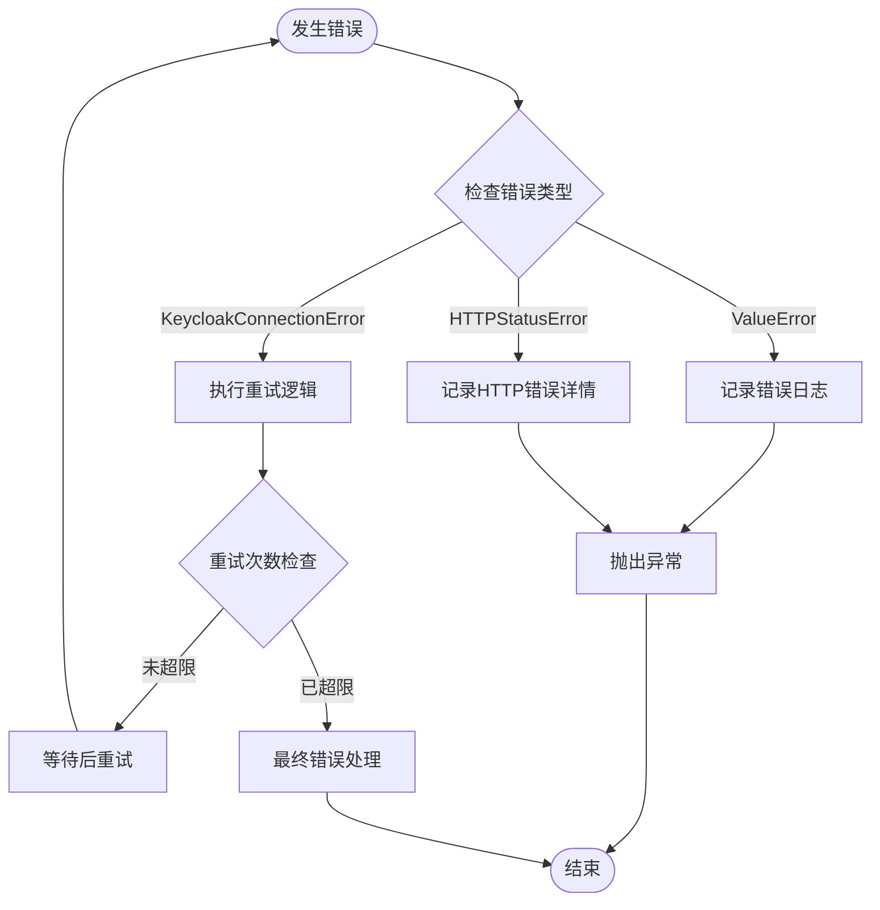

# GitHub令牌刷新机制详细文档

<cite>
**本文档引用的文件**
- [token_manager.py](file://enterprise/server/auth/token_manager.py)
- [constants.py](file://enterprise/server/auth/constants.py)
- [github_manager.py](file://enterprise/integrations/github/github_manager.py)
- [github_app_installation.py](file://enterprise/storage/github_app_installation.py)
- [test_token_manager.py](file://enterprise/tests/unit/test_token_manager.py)
</cite>

## 目录
1. [简介](#简介)
2. [系统架构概览](#系统架构概览)
3. [核心组件分析](#核心组件分析)
4. [_refresh_github_token方法详解](#_refresh_github_token方法详解)
5. [_parse_refresh_response方法详解](#_parse_refresh_response方法详解)
6. [令牌刷新流程](#令牌刷新流程)
7. [错误处理机制](#错误处理机制)
8. [重试机制与日志记录](#重试机制与日志记录)
9. [实际代码示例](#实际代码示例)
10. [性能考虑](#性能考虑)
11. [故障排除指南](#故障排除指南)
12. [总结](#总结)

## 简介

GitHub令牌刷新机制是OpenHands企业版系统中用于自动管理GitHub OAuth访问令牌的核心功能。该机制通过定期刷新过期的访问令牌，确保系统能够持续访问GitHub API，为用户提供无缝的服务体验。

本文档将深入分析`_refresh_github_token`方法的实现细节，包括其与GitHub OAuth端点的交互过程、请求负载结构、响应处理逻辑以及错误处理机制。

## 系统架构概览

GitHub令牌刷新机制在整体系统架构中扮演着关键角色，主要涉及以下组件：



**图表来源**
- [token_manager.py](file://enterprise/server/auth/token_manager.py#L78-L672)
- [github_manager.py](file://enterprise/integrations/github/github_manager.py#L38-L345)

## 核心组件分析

### TokenManager类

`TokenManager`类是整个令牌管理系统的核心，负责：
- 管理不同身份提供商的令牌刷新
- 处理令牌加密和解密
- 协调各种令牌存储操作

### 客户端凭据配置

系统通过环境变量配置GitHub应用程序的客户端凭据：

| 配置项 | 描述 | 来源 |
|--------|------|------|
| `GITHUB_APP_CLIENT_ID` | GitHub应用程序客户端ID | 环境变量 |
| `GITHUB_APP_CLIENT_SECRET` | GitHub应用程序客户端密钥 | 环境变量 |
| `GITHUB_APP_PRIVATE_KEY` | GitHub应用程序私钥 | 环境变量 |

**节来源**
- [constants.py](file://enterprise/server/auth/constants.py#L1-L24)

## _refresh_github_token方法详解

### 方法签名与入口点



**图表来源**
- [token_manager.py](file://enterprise/server/auth/token_manager.py#L331-L368)

### 请求负载结构

`_refresh_github_token`方法构建的请求负载包含以下关键字段：

| 字段名 | 类型 | 描述 | 必需性 |
|--------|------|------|--------|
| `client_id` | string | GitHub应用程序客户端ID | 必需 |
| `client_secret` | string | GitHub应用程序客户端密钥 | 必需 |
| `refresh_token` | string | 用于刷新的旧刷新令牌 | 必需 |
| `grant_type` | string | 授权类型，固定为"refresh_token" | 必需 |

### HTTP POST请求执行过程

方法执行的HTTP请求流程如下：



**图表来源**
- [token_manager.py](file://enterprise/server/auth/token_manager.py#L344-L368)

**节来源**
- [token_manager.py](file://enterprise/server/auth/token_manager.py#L344-L368)

## _parse_refresh_response方法详解

### 响应数据解析逻辑

`_parse_refresh_response`方法负责解析来自GitHub OAuth API的响应数据：



**图表来源**
- [token_manager.py](file://enterprise/server/auth/token_manager.py#L416-L442)

### 过期时间计算机制

方法通过以下公式计算令牌过期时间：

- **访问令牌过期时间**：`current_time + expires_in`
- **刷新令牌过期时间**：`current_time + refresh_expires_in`

其中，如果`expires_in`或`refresh_expires_in`为0，则表示令牌永不过期。

**节来源**
- [token_manager.py](file://enterprise/server/auth/token_manager.py#L416-L442)

## 令牌刷新流程

### 完整刷新流程图



**图表来源**
- [token_manager.py](file://enterprise/server/auth/token_manager.py#L289-L329)

### 令牌过期检测机制

系统采用双重过期检测策略：

1. **访问令牌检测**：提前4小时（14400秒）检测即将过期的访问令牌
2. **刷新令牌检测**：实时检测刷新令牌是否已过期

**节来源**
- [token_manager.py](file://enterprise/server/auth/token_manager.py#L289-L329)

## 错误处理机制

### 异常类型与处理策略

| 异常类型 | 触发条件 | 处理策略 |
|----------|----------|----------|
| `ValueError` | 响应中缺少access_token或refresh_token | 记录错误日志并终止操作 |
| `httpx.HTTPStatusError` | HTTP请求失败 | 记录详细错误信息并重新抛出 |
| `KeycloakConnectionError` | Keycloak连接失败 | 使用重试机制进行恢复 |

### 错误处理流程



**图表来源**
- [token_manager.py](file://enterprise/server/auth/token_manager.py#L276-L287)

**节来源**
- [token_manager.py](file://enterprise/server/auth/token_manager.py#L276-L287)

## 重试机制与日志记录

### 重试配置

系统使用`tenacity`库实现智能重试机制：

```python
@retry(
    stop=stop_after_attempt(2),
    retry=retry_if_exception_type(KeycloakConnectionError),
    before_sleep=_before_sleep_callback,
)
```

### 日志记录策略

系统采用分级日志记录：

| 日志级别 | 记录内容 | 触发条件 |
|----------|----------|----------|
| INFO | 令牌刷新开始和成功 | 每次令牌刷新操作 |
| DEBUG | 令牌响应详情 | 开发环境调试 |
| ERROR | 令牌刷新失败 | 所有异常情况 |

**节来源**
- [token_manager.py](file://enterprise/server/auth/token_manager.py#L43-L45)
- [token_manager.py](file://enterprise/server/auth/token_manager.py#L147-L151)

## 实际代码示例

### 基本使用示例

以下是使用GitHub令牌刷新机制的基本代码模式：

```python
# 初始化TokenManager
token_manager = TokenManager()

# 获取用户IDP令牌（会自动处理刷新）
access_token = await token_manager.get_idp_token(
    access_token=existing_access_token,
    idp=ProviderType.GITHUB
)
```

### GitHub应用程序令牌管理示例

```python
# 存储GitHub应用程序安装令牌
token_manager.store_org_token(
    installation_id=12345,
    installation_token=new_installation_token
)

# 加载GitHub应用程序安装令牌
installation_token = token_manager.load_org_token(
    installation_id=12345
)
```

**节来源**
- [token_manager.py](file://enterprise/server/auth/token_manager.py#L530-L583)

## 性能考虑

### 并发处理能力

系统支持异步并发处理多个令牌刷新请求，通过`asyncio`实现非阻塞操作。

### 内存优化策略

- 使用加密存储保护敏感令牌数据
- 实现令牌缓存机制减少重复刷新
- 采用流式处理避免大文件内存占用

### 网络优化

- 使用连接池复用HTTP连接
- 实现请求超时控制
- 支持SSL证书验证

## 故障排除指南

### 常见问题与解决方案

| 问题症状 | 可能原因 | 解决方案 |
|----------|----------|----------|
| 令牌刷新失败 | 缺少client_id或client_secret | 检查环境变量配置 |
| 访问被拒绝 | 客户端凭据无效 | 验证GitHub应用程序设置 |
| 刷新令牌过期 | 用户撤销了应用程序权限 | 引导用户重新授权 |
| 网络连接超时 | 网络不稳定或防火墙阻止 | 检查网络连接和代理设置 |

### 调试技巧

1. **启用详细日志**：设置日志级别为DEBUG以获取详细信息
2. **检查环境变量**：确认所有必需的环境变量已正确设置
3. **验证网络连通性**：测试到GitHub API的网络连接
4. **监控令牌状态**：定期检查令牌的有效性和过期时间

**节来源**
- [token_manager.py](file://enterprise/server/auth/token_manager.py#L334-L342)

## 总结

GitHub令牌刷新机制是OpenHands企业版系统中不可或缺的核心功能，通过自动化的方式确保系统的持续可用性。该机制具有以下特点：

1. **安全性**：采用加密存储和HTTPS传输保护令牌安全
2. **可靠性**：实现完善的错误处理和重试机制
3. **可扩展性**：支持多种身份提供商和令牌类型
4. **可观测性**：提供详细的日志记录和监控指标

通过深入理解`_refresh_github_token`方法的实现细节，开发者可以更好地维护和优化系统性能，同时为未来的功能扩展奠定坚实基础。