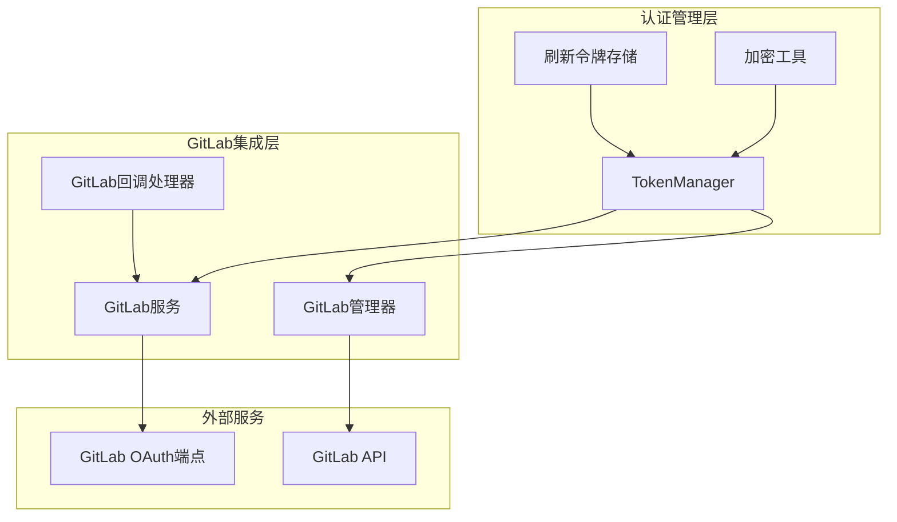
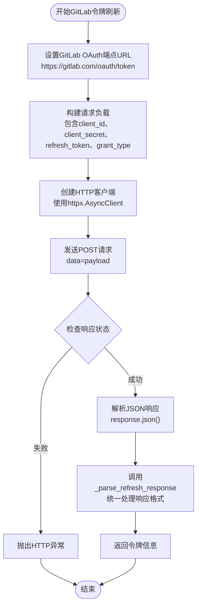
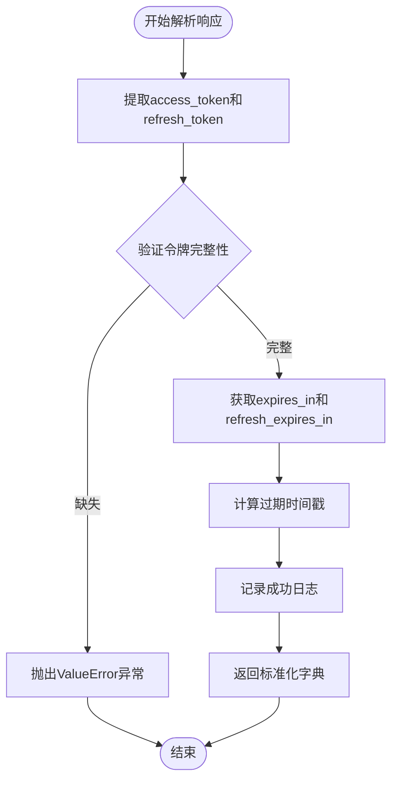
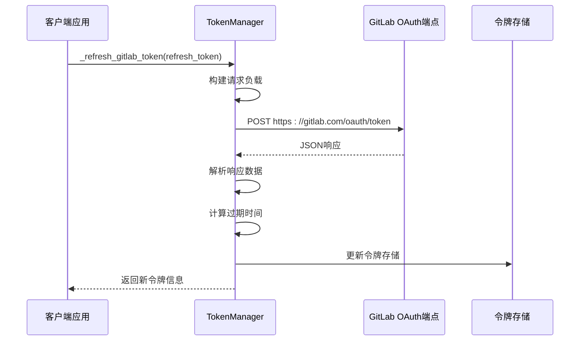
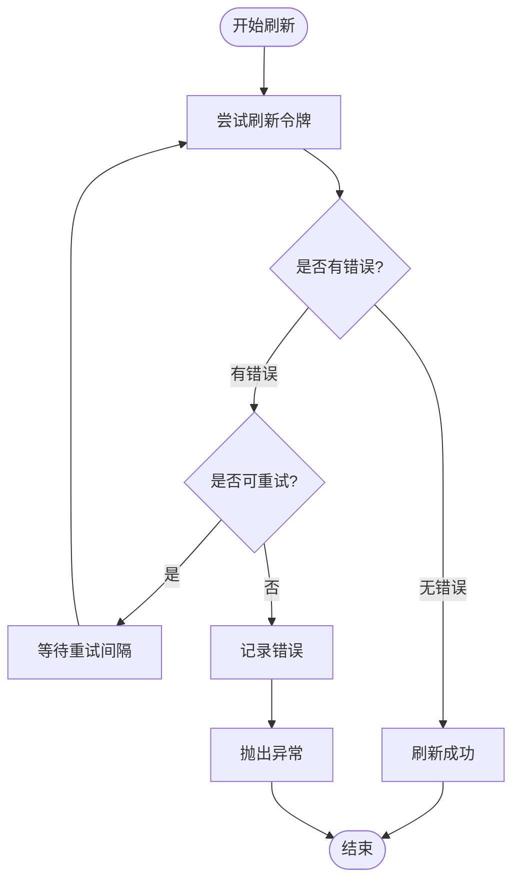

# GitLab令牌刷新机制详细文档

<cite>
**本文档引用的文件**
- [_token_manager.py](file://enterprise/server/auth/token_manager.py)
- [gitlab_service.py](file://enterprise/integrations/gitlab/gitlab_service.py)
- [gitlab_callback_processor.py](file://enterprise/server/conversation_callback_processor/gitlab_callback_processor.py)
- [install_gitlab_webhooks.py](file://enterprise/sync/install_gitlab_webhooks.py)
</cite>

## 目录
1. [简介](#简介)
2. [系统架构概览](#系统架构概览)
3. [_refresh_gitlab_token方法详解](#_refresh_gitlab_token方法详解)
4. [请求负载结构](#请求负载结构)
5. [HTTP POST请求执行过程](#http-post请求执行过程)
6. [响应处理逻辑](#响应处理逻辑)
7. [_parse_refresh_response方法](#_parse_refresh_response方法)
8. [错误处理与重试机制](#错误处理与重试机制)
9. [完整刷新流程示例](#完整刷新流程示例)
10. [性能考虑](#性能考虑)
11. [故障排除指南](#故障排除指南)
12. [总结](#总结)

## 简介

GitLab令牌刷新机制是OpenHands系统中用于维护GitLab集成连接的核心功能。当GitLab访问令牌过期时，系统需要通过OAuth 2.0刷新令牌流程获取新的访问令牌，确保持续的GitLab API调用能力。本文档详细描述了`_refresh_gitlab_token`方法的实现原理、请求处理流程以及与GitHub令牌刷新机制的差异。

## 系统架构概览

GitLab令牌刷新机制在整体认证架构中占据重要位置，与Keycloak身份管理、OAuth流程和各种集成服务紧密协作。



**图表来源**
- [_token_manager.py](file://enterprise/server/auth/token_manager.py#L77-L670)
- [gitlab_service.py](file://enterprise/integrations/gitlab/gitlab_service.py#L47-L81)

## _refresh_gitlab_token方法详解

`_refresh_gitlab_token`方法是GitLab令牌刷新的核心实现，位于`TokenManager`类中。该方法专门处理GitLab OAuth 2.0刷新令牌流程。

### 方法签名与基本结构

```python
async def _refresh_gitlab_token(self, refresh_token: str) -> dict[str, str | int]:
```

该方法接收一个刷新令牌作为输入参数，返回包含新令牌信息的字典，其中包含：
- `access_token`: 新的访问令牌
- `refresh_token`: 可能更新的刷新令牌
- `access_token_expires_at`: 访问令牌过期时间戳
- `refresh_token_expires_at`: 刷新令牌过期时间戳

### 核心实现流程



**图表来源**
- [_token_manager.py](file://enterprise/server/auth/token_manager.py#L369-L385)

**章节来源**
- [_token_manager.py](file://enterprise/server/auth/token_manager.py#L369-L385)

## 请求负载结构

GitLab令牌刷新请求遵循OAuth 2.0标准，使用表单数据格式传递必要的认证信息。

### 负载字段详解

| 字段名 | 类型 | 描述 | 来源 |
|--------|------|------|------|
| `client_id` | string | GitLab应用客户端ID | `GITLAB_APP_CLIENT_ID`配置 |
| `client_secret` | string | GitLab应用客户端密钥 | `GITLAB_APP_CLIENT_SECRET`配置 |
| `refresh_token` | string | 当前有效的刷新令牌 | 用户提供的刷新令牌 |
| `grant_type` | string | 授权类型标识符 | 固定值：`refresh_token` |

### 请求负载示例

```json
{
    "client_id": "your_client_id",
    "client_secret": "your_client_secret", 
    "refresh_token": "current_refresh_token",
    "grant_type": "refresh_token"
}
```

**章节来源**
- [_token_manager.py](file://enterprise/server/auth/token_manager.py#L374-L378)

## HTTP POST请求执行过程

### 客户端配置

系统使用`httpx.AsyncClient`进行异步HTTP通信，确保非阻塞的令牌刷新操作。

### 请求头设置

GitLab OAuth端点不需要特殊的请求头，使用默认的表单数据格式即可。

### 错误处理机制

系统实现了多层次的错误处理：

1. **HTTP状态码验证**: 使用`response.raise_for_status()`自动检测HTTP错误
2. **异常捕获**: 捕获并记录详细的错误信息
3. **日志记录**: 记录请求和响应的详细信息用于调试

**章节来源**
- [_token_manager.py](file://enterprise/server/auth/token_manager.py#L380-L382)

## 响应处理逻辑

### GitLab与GitHub的响应格式差异

GitLab和GitHub在OAuth 2.0令牌刷新响应格式上存在显著差异：

#### GitHub响应格式
- **URL编码格式**: `access_token=xxx&token_type=bearer&expires_in=3600`
- **解析方式**: 使用`parse_qs`函数解析查询字符串
- **数据类型转换**: 需要手动将字符串转换为整数

#### GitLab响应格式  
- **JSON格式**: `{ "access_token": "xxx", "token_type": "bearer", "expires_in": 3600 }`
- **解析方式**: 直接使用`response.json()`解析
- **数据类型**: 已经是正确的Python数据类型

### GitLab响应示例

```json
{
    "access_token": "glpat-xxxxxxxxxxxxxx",
    "token_type": "bearer", 
    "expires_in": 21600,
    "refresh_token": "glrt_yyyyyyyyyyyyyy",
    "scope": "api read_repository write_repository",
    "created_at": 1640995200
}
```

**章节来源**
- [_token_manager.py](file://enterprise/server/auth/token_manager.py#L384-L386)

## _parse_refresh_response方法

`_parse_refresh_response`方法负责统一处理来自不同身份提供商的令牌刷新响应，确保返回一致的数据格式。

### 处理流程



**图表来源**
- [_token_manager.py](file://enterprise/server/auth/token_manager.py#L415-L441)

### 关键计算逻辑

系统使用当前时间戳计算令牌的有效期：

```python
current_time = int(time.time())
access_token_expires_at = 0 if expires_in == 0 else current_time + expires_in
refresh_token_expires_at = 0 if refresh_expires_in == 0 else current_time + refresh_expires_in
```

这种计算方式确保：
- 过期时间为绝对时间戳
- 支持永不过期的令牌（expires_in为0）
- 时间计算的准确性

**章节来源**
- [_token_manager.py](file://enterprise/server/auth/token_manager.py#L415-L441)

## 错误处理与重试机制

### @retry装饰器配置

GitLab令牌刷新方法使用`@retry`装饰器实现智能重试机制：

```python
@retry(
    stop=stop_after_attempt(2),
    retry=retry_if_exception_type(KeycloakConnectionError),
    before_sleep=_before_sleep_callback,
)
```

### 重试策略详解

| 参数 | 值 | 说明 |
|------|-----|------|
| `stop` | `stop_after_attempt(2)` | 最多重试2次 |
| `retry` | `retry_if_exception_type(KeycloakConnectionError)` | 仅对Keycloak连接错误重试 |
| `before_sleep` | `_before_sleep_callback` | 重试前的日志回调 |

### 日志记录机制

```python
def _before_sleep_callback(retry_state: RetryCallState) -> None:
    logger.info(f'Retry attempt {retry_state.attempt_number} for Keycloak operation')
```

该回调函数在每次重试前记录尝试次数，便于监控和调试。

**章节来源**
- [_token_manager.py](file://enterprise/server/auth/token_manager.py#L43-L45)
- [_token_manager.py](file://enterprise/server/auth/token_manager.py#L444-L448)

## 完整刷新流程示例

### 典型使用场景

以下是GitLab令牌刷新的典型使用流程：



**图表来源**
- [_token_manager.py](file://enterprise/server/auth/token_manager.py#L369-L385)

### 错误处理流程



**图表来源**
- [_token_manager.py](file://enterprise/server/auth/token_manager.py#L444-L448)

**章节来源**
- [_token_manager.py](file://enterprise/server/auth/token_manager.py#L369-L385)

## 性能考虑

### 异步处理优势

- **非阻塞操作**: 使用`asyncio`实现并发令牌刷新
- **资源利用率**: 避免线程阻塞，提高系统吞吐量
- **响应速度**: 减少等待时间，提升用户体验

### 缓存策略

- **令牌预加载**: 在令牌过期前提前刷新
- **批量处理**: 同时处理多个令牌刷新请求
- **内存缓存**: 将活跃令牌缓存在内存中

### 网络优化

- **连接池**: 复用HTTP连接减少建立开销
- **超时控制**: 设置合理的请求超时时间
- **压缩传输**: 启用HTTP压缩减少带宽使用

## 故障排除指南

### 常见问题及解决方案

#### 1. 刷新令牌无效
**症状**: `400 Bad Request`或`invalid_grant`错误
**原因**: 刷新令牌已过期或被撤销
**解决方案**: 
- 检查刷新令牌的有效性
- 重新进行OAuth授权流程
- 验证客户端凭据正确性

#### 2. 网络连接问题
**症状**: `ConnectionError`或超时异常
**原因**: 网络不稳定或GitLab服务不可用
**解决方案**:
- 实施指数退避重试策略
- 添加网络监控告警
- 提供降级处理方案

#### 3. 响应格式不匹配
**症状**: JSON解析错误或字段缺失
**原因**: GitLab API版本变更或响应格式异常
**解决方案**:
- 实现向后兼容的解析逻辑
- 添加响应验证机制
- 记录详细错误信息

### 调试技巧

1. **启用详细日志**: 设置日志级别为DEBUG查看完整请求响应
2. **监控指标**: 跟踪刷新成功率和响应时间
3. **单元测试**: 编写针对各种异常情况的测试用例
4. **压力测试**: 验证高并发场景下的系统稳定性

**章节来源**
- [_token_manager.py](file://enterprise/server/auth/token_manager.py#L380-L382)

## 总结

GitLab令牌刷新机制是OpenHands系统中确保GitLab集成长期稳定运行的关键组件。通过`_refresh_gitlab_token`方法的精心设计，系统能够：

1. **标准化处理**: 统一处理GitLab OAuth 2.0刷新令牌流程
2. **错误恢复**: 实现智能重试和异常处理机制
3. **性能优化**: 采用异步处理和缓存策略
4. **安全可靠**: 通过加密存储和验证确保令牌安全

该机制不仅支持当前的功能需求，还具备良好的扩展性和维护性，为未来的功能增强奠定了坚实基础。开发者在使用和维护该机制时，应当关注错误处理、性能监控和安全防护等方面，确保系统的稳定可靠运行。