# 令牌刷新机制深入文档

<cite>
**本文档中引用的文件**
- [token_manager.py](file://enterprise/server/auth/token_manager.py)
- [constants.py](file://enterprise/server/auth/constants.py)
- [auth_utils.py](file://enterprise/server/auth/auth_utils.py)
- [github_service.py](file://enterprise/integrations/github/github_service.py)
- [gitlab_service.py](file://enterprise/integrations/gitlab/gitlab_service.py)
- [bitbucket_service.py](file://enterprise/integrations/bitbucket/bitbucket_service.py)
- [auth_token_store.py](file://enterprise/storage/auth_token_store.py)
</cite>

## 目录
1. [简介](#简介)
2. [系统架构概览](#系统架构概览)
3. [_refresh_token核心方法](#_refresh_token核心方法)
4. [令牌过期检查机制](#令牌过期检查机制)
5. [不同IDP的令牌刷新实现](#不同idp的令牌刷新实现)
6. [重试机制与日志记录](#重试机制与日志记录)
7. [令牌存储与管理](#令牌存储与管理)
8. [集成服务中的令牌使用](#集成服务中的令牌使用)
9. [故障排除指南](#故障排除指南)
10. [总结](#总结)

## 简介

OpenHands项目的令牌刷新机制是一个复杂而精密的系统，专门设计用于处理多个身份提供者（IDP）的OAuth令牌生命周期管理。该系统支持GitHub、GitLab和Bitbucket三大主流代码托管平台，通过统一的接口管理令牌的获取、验证、刷新和存储。

核心特性包括：
- **多IDP支持**：统一处理GitHub、GitLab和BitBucket的令牌刷新
- **智能过期检测**：基于时间戳的令牌有效性检查
- **自动刷新机制**：透明的令牌续期过程
- **重试容错**：内置的失败重试和错误处理机制
- **安全存储**：加密的令牌存储和传输

## 系统架构概览

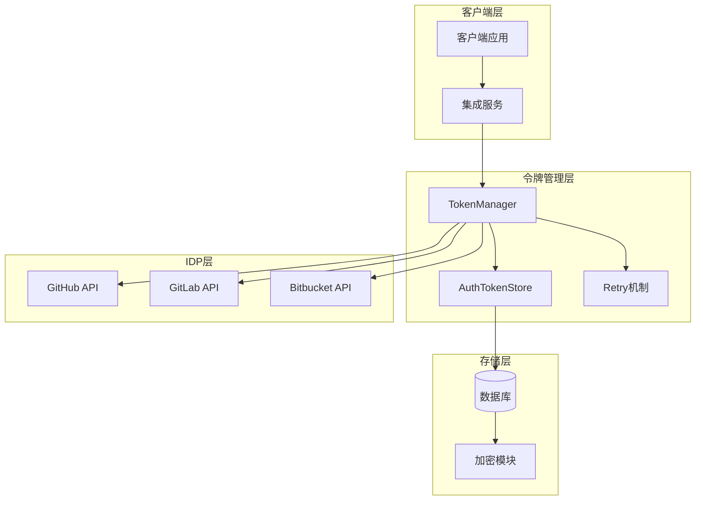

**图表来源**
- [token_manager.py](file://enterprise/server/auth/token_manager.py#L78-L672)
- [auth_token_store.py](file://enterprise/storage/auth_token_store.py#L16-L209)

**章节来源**
- [token_manager.py](file://enterprise/server/auth/token_manager.py#L78-L100)
- [auth_token_store.py](file://enterprise/storage/auth_token_store.py#L16-L50)

## _refresh_token核心方法

`_refresh_token`方法是整个令牌刷新系统的核心入口点，负责根据不同的身份提供者调用相应的刷新逻辑。

### 方法签名与流程

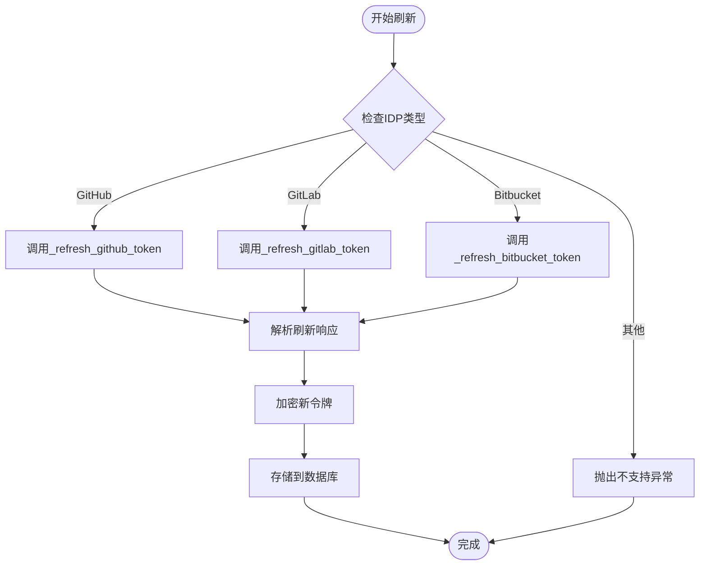

**图表来源**
- [token_manager.py](file://enterprise/server/auth/token_manager.py#L330-L341)

### 核心实现特点

1. **统一接口设计**：所有IDP都通过相同的接口进行刷新
2. **类型安全**：使用ProviderType枚举确保IDP类型的正确性
3. **异步处理**：完全基于async/await模式
4. **错误传播**：支持异常向上传播以便上层处理

**章节来源**
- [token_manager.py](file://enterprise/server/auth/token_manager.py#L330-L341)

## 令牌过期检查机制

`_check_expiration_and_refresh`方法实现了智能的令牌过期检测和自动刷新逻辑。

### 过期检测算法

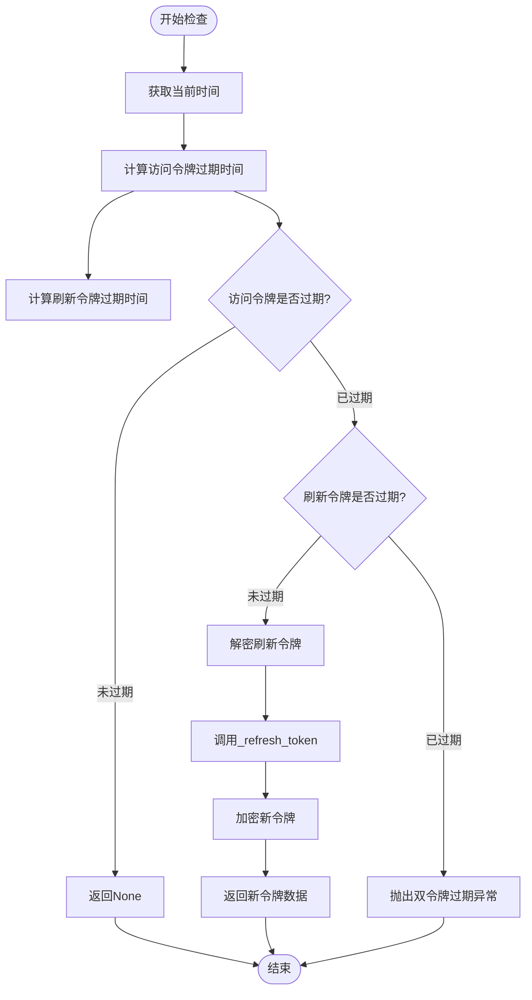

**图表来源**
- [token_manager.py](file://enterprise/server/auth/token_manager.py#L288-L328)

### 关键配置参数

| 参数 | 值 | 说明 |
|------|-----|------|
| 访问令牌缓冲时间 | 14400秒 (4小时) | 在实际过期前4小时开始刷新 |
| 刷新令牌缓冲时间 | 0秒 | 立即检测刷新令牌过期 |
| 时间精度 | 秒级 | 使用Unix时间戳 |

### 过期检测逻辑详解

系统采用以下策略确保令牌的有效性：

1. **访问令牌检查**：在实际过期前4小时启动刷新流程
2. **刷新令牌检查**：立即检测刷新令牌的有效性
3. **双重保护**：如果两个令牌都过期，则认为认证失效
4. **透明刷新**：对上层服务完全透明

**章节来源**
- [token_manager.py](file://enterprise/server/auth/token_manager.py#L288-L328)

## 不同IDP的令牌刷新实现

每个IDP都有其特定的API端点、认证方式和响应格式，系统为每个IDP提供了专门的刷新实现。

### GitHub令牌刷新

GitHub使用标准的OAuth 2.0刷新流程，通过POST请求发送表单数据。

#### API端点与参数

| 组件 | 值 | 说明 |
|------|-----|------|
| 端点URL | `https://github.com/login/oauth/access_token` | GitHub OAuth令牌刷新端点 |
| 客户端ID | `GITHUB_APP_CLIENT_ID` | 环境变量配置 |
| 客户端密钥 | `GITHUB_APP_CLIENT_SECRET` | 环境变量配置 |
| 授权类型 | `refresh_token` | 固定值 |
| 请求方法 | POST | 表单数据提交 |

#### 响应处理

GitHub的响应格式比较特殊，需要使用`parse_qs`解析查询字符串：

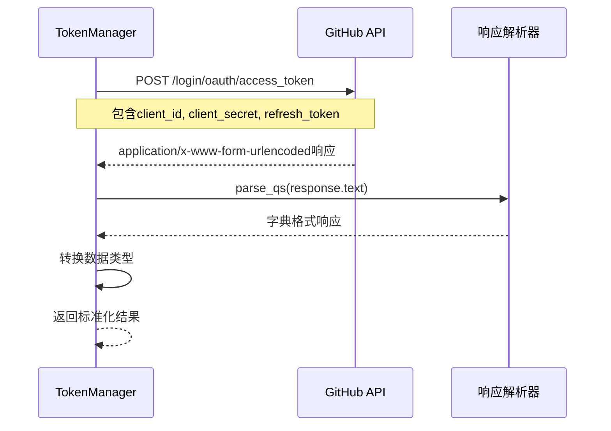

**图表来源**
- [token_manager.py](file://enterprise/server/auth/token_manager.py#L343-L367)

### GitLab令牌刷新

GitLab遵循标准的OAuth 2.0规范，使用JSON格式的响应。

#### API端点与参数

| 组件 | 值 | 说明 |
|------|-----|------|
| 端点URL | `https://gitlab.com/oauth/token` | GitLab OAuth令牌刷新端点 |
| 客户端ID | `GITLAB_APP_CLIENT_ID` | 环境变量配置 |
| 客户端密钥 | `GITLAB_APP_CLIENT_SECRET` | 环境变量配置 |
| 授权类型 | `refresh_token` | 固定值 |
| 内容类型 | `application/json` | JSON格式请求 |

#### 响应处理

GitLab直接返回JSON格式的响应，处理更加简洁：

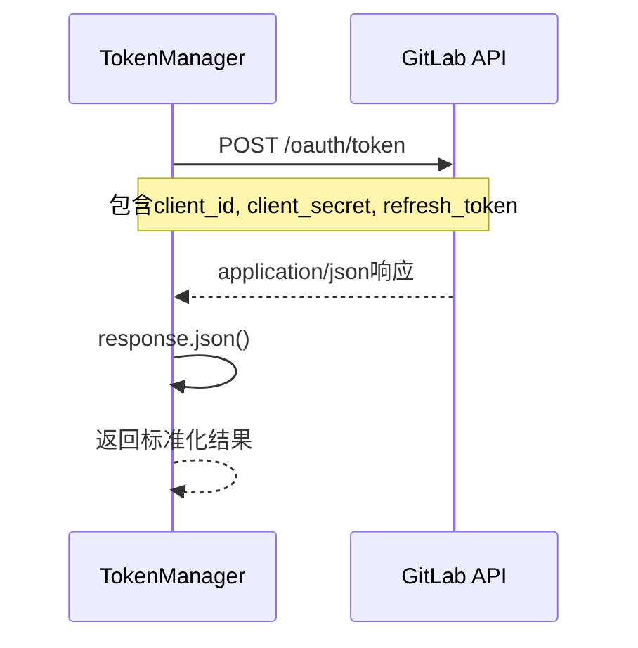

**图表来源**
- [token_manager.py](file://enterprise/server/auth/token_manager.py#L369-L385)

### Bitbucket令牌刷新

Bitbucket使用HTTP基本认证，并且有独特的响应格式。

#### API端点与参数

| 组件 | 值 | 说明 |
|------|-----|------|
| 端点URL | `https://bitbucket.org/site/oauth2/access_token` | Bitbucket OAuth令牌刷新端点 |
| 认证方式 | Basic Auth | Base64编码的客户端凭据 |
| 客户端ID | `BITBUCKET_APP_CLIENT_ID` | 环境变量配置 |
| 客户端密钥 | `BITBUCKET_APP_CLIENT_SECRET` | 环境变量配置 |
| 授权类型 | `refresh_token` | 固定值 |
| 内容类型 | `application/x-www-form-urlencoded` | 表单数据格式 |

#### 认证处理

Bitbucket要求特殊的认证头：

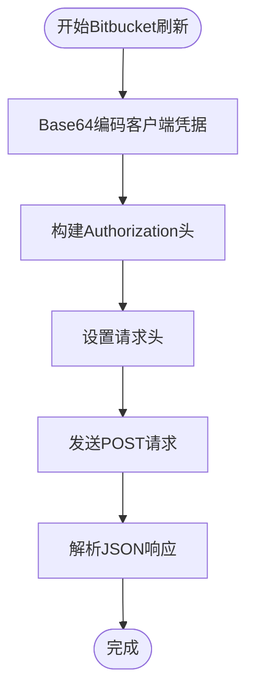

**图表来源**
- [token_manager.py](file://enterprise/server/auth/token_manager.py#L387-L413)

### 各IDP实现差异对比

| 特性 | GitHub | GitLab | Bitbucket |
|------|--------|--------|-----------|
| 端点URL | `github.com/login/oauth/access_token` | `gitlab.com/oauth/token` | `bitbucket.org/site/oauth2/access_token` |
| 认证方式 | 表单数据 | 表单数据 | HTTP基本认证 |
| 响应格式 | 查询字符串 | JSON | JSON |
| 数据转换 | `parse_qs()` | `.json()` | `.json()` |
| 错误处理 | 标准HTTP状态码 | 标准HTTP状态码 | 标准HTTP状态码 |

**章节来源**
- [token_manager.py](file://enterprise/server/auth/token_manager.py#L343-L413)

## 重试机制与日志记录

系统实现了多层次的重试机制和详细的日志记录功能，确保令牌刷新的可靠性。

### 重试装饰器配置

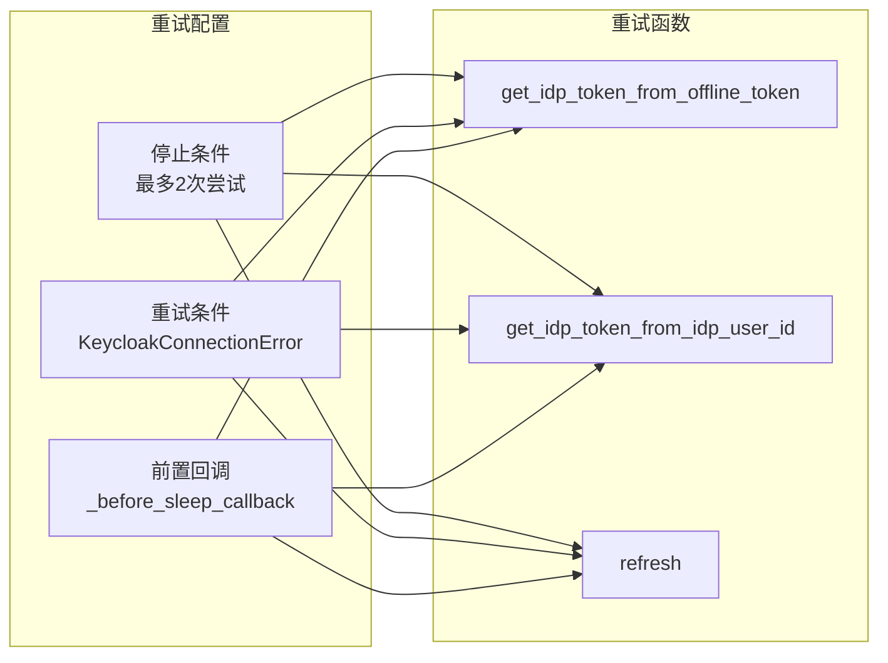

**图表来源**
- [token_manager.py](file://enterprise/server/auth/token_manager.py#L444-L448)
- [token_manager.py](file://enterprise/server/auth/token_manager.py#L463-L467)
- [token_manager.py](file://enterprise/server/auth/token_manager.py#L591-L595)

### _before_sleep_callback函数

这个函数提供了详细的重试日志记录功能：

#### 日志记录内容

| 日志级别 | 内容 | 用途 |
|----------|------|------|
| INFO | `Retry attempt {attempt_number} for Keycloak operation` | 记录重试次数 |
| DEBUG | 异常详情 | 开发调试 |
| WARNING | 失败原因 | 运行时监控 |
| ERROR | 最终失败 | 故障诊断 |

#### 实现特点

1. **简洁明了**：只记录关键的重试信息
2. **上下文丰富**：包含尝试次数等上下文信息
3. **性能友好**：避免过度日志输出
4. **可扩展性**：可以轻松添加更多日志字段

### 重试策略详解

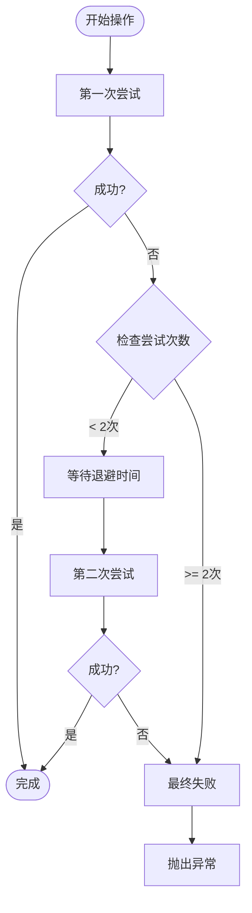

**图表来源**
- [token_manager.py](file://enterprise/server/auth/token_manager.py#L444-L448)

**章节来源**
- [token_manager.py](file://enterprise/server/auth/token_manager.py#L42-L50)
- [token_manager.py](file://enterprise/server/auth/token_manager.py#L444-L448)

## 令牌存储与管理

`AuthTokenStore`类提供了安全、可靠的令牌存储和检索机制。

### 存储架构

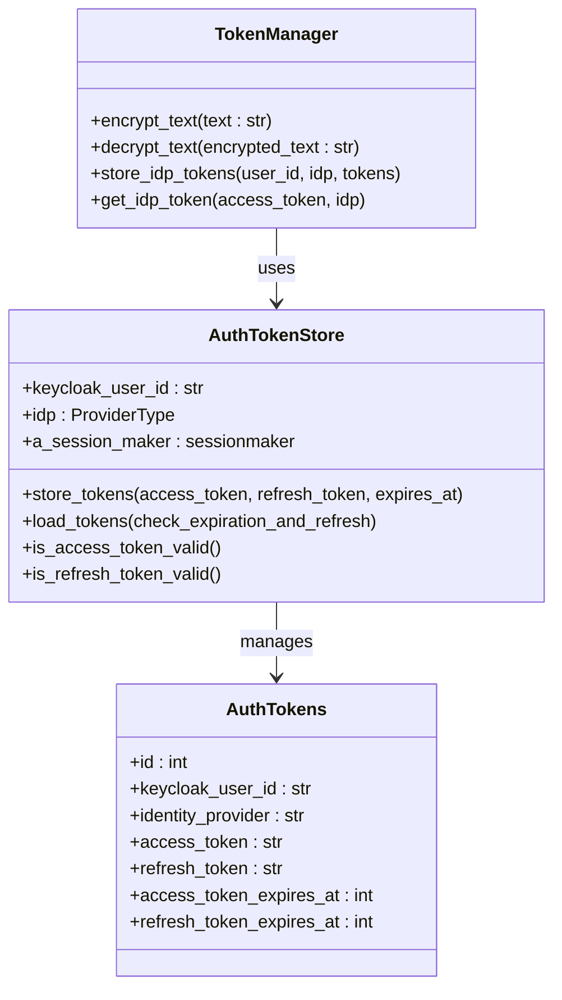

**图表来源**
- [auth_token_store.py](file://enterprise/storage/auth_token_store.py#L16-L209)
- [token_manager.py](file://enterprise/server/auth/token_manager.py#L78-L100)

### 存储流程

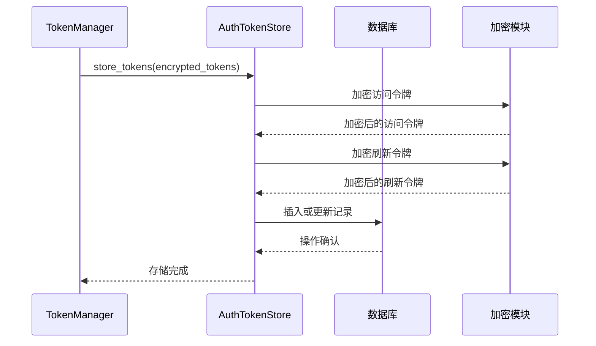

**图表来源**
- [auth_token_store.py](file://enterprise/storage/auth_token_store.py#L26-L68)

### 安全特性

1. **透明加密**：对称加密确保令牌安全存储
2. **事务保证**：数据库事务确保数据一致性
3. **行级锁定**：防止并发刷新冲突
4. **时间戳验证**：精确的过期时间管理

### 验证机制

| 方法 | 功能 | 时间缓冲 |
|------|------|----------|
| `is_access_token_valid()` | 验证访问令牌有效性 | 30秒 |
| `is_refresh_token_valid()` | 验证刷新令牌有效性 | 30秒 |

**章节来源**
- [auth_token_store.py](file://enterprise/storage/auth_token_store.py#L16-L209)

## 集成服务中的令牌使用

各个集成服务通过统一的接口使用令牌管理系统。

### GitHub服务集成

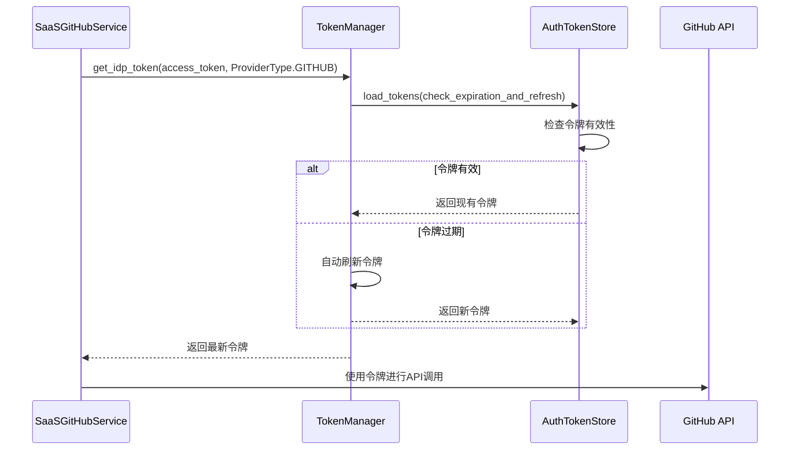

**图表来源**
- [github_service.py](file://enterprise/integrations/github/github_service.py#L39-L73)

### GitLab服务集成

GitLab服务的令牌获取流程与GitHub类似，但使用不同的IDP标识：

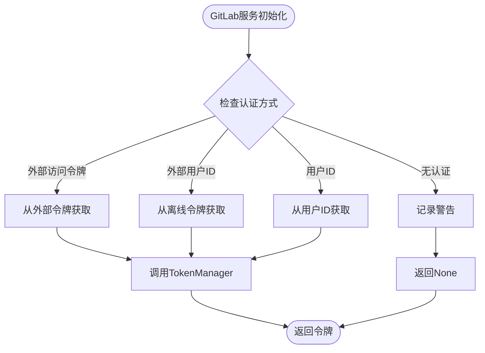

**图表来源**
- [gitlab_service.py](file://enterprise/integrations/gitlab/gitlab_service.py#L47-L81)

### Bitbucket服务集成

Bitbucket服务采用了类似的模式，但继承自基础服务类：

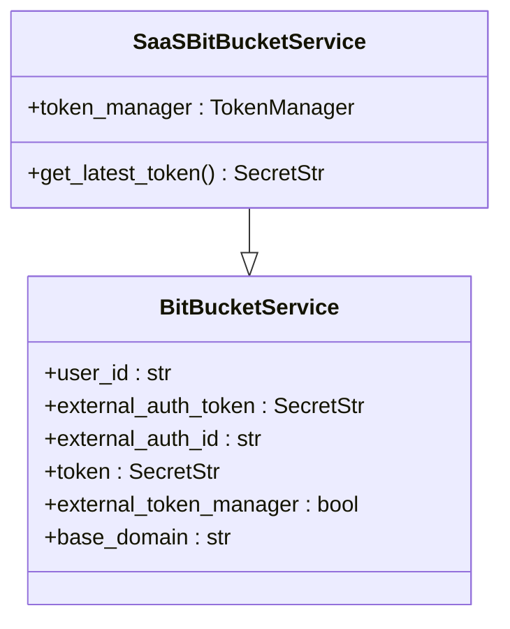

**图表来源**
- [bitbucket_service.py](file://enterprise/integrations/bitbucket/bitbucket_service.py#L9-L71)

### 通用使用模式

所有集成服务都遵循以下通用模式：

1. **令牌获取**：通过TokenManager获取最新令牌
2. **自动刷新**：透明的令牌刷新机制
3. **异常处理**：完善的错误处理和重试
4. **性能优化**：缓存和批量操作

**章节来源**
- [github_service.py](file://enterprise/integrations/github/github_service.py#L39-L73)
- [gitlab_service.py](file://enterprise/integrations/gitlab/gitlab_service.py#L47-L81)
- [bitbucket_service.py](file://enterprise/integrations/bitbucket/bitbucket_service.py#L35-L71)

## 故障排除指南

### 常见问题与解决方案

#### 1. 令牌刷新失败

**症状**：`KeycloakConnectionError`异常
**原因**：网络连接问题或Keycloak服务器不可用
**解决方案**：
- 检查网络连接
- 验证Keycloak服务器状态
- 查看重试日志了解具体失败原因

#### 2. IDP令牌无效

**症状**：`ValueError: Both Access and Refresh Tokens expired`
**原因**：所有令牌都已过期
**解决方案**：
- 用户需要重新授权
- 检查IDP应用配置
- 验证客户端凭据

#### 3. 解析错误

**症状**：`ValueError: Failed to refresh token: missing access_token or refresh_token in response`
**原因**：IDP返回格式不符合预期
**解决方案**：
- 检查IDP API版本兼容性
- 验证请求参数完整性
- 查看原始API响应

#### 4. 并发刷新冲突

**症状**：重复的刷新请求
**原因**：多个请求同时检测到令牌过期
**解决方案**：
- 数据库行级锁机制
- 事务隔离级别配置
- 适当的并发控制

### 调试技巧

#### 启用详细日志

```python
import logging
logging.getLogger('openhands').setLevel(logging.DEBUG)
```

#### 监控令牌状态

```python
# 检查令牌有效性
valid = await token_store.is_access_token_valid()
print(f"Access token valid: {valid}")

# 获取令牌过期时间
tokens = await token_store.load_tokens()
if tokens:
    print(f"Expires at: {tokens['access_token_expires_at']}")
```

#### 性能监控

| 指标 | 监控方法 | 正常范围 |
|------|----------|----------|
| 刷新成功率 | 计算成功/总尝试比例 | > 95% |
| 刷新延迟 | 测量刷新耗时 | < 5秒 |
| 错误率 | 监控异常日志 | < 1% |
| 并发冲突 | 检查锁等待时间 | < 1秒 |

### 最佳实践

1. **定期监控**：建立令牌健康检查机制
2. **备份策略**：维护离线令牌作为备用
3. **容量规划**：根据并发需求调整重试参数
4. **安全审计**：定期审查令牌存储和传输安全性
5. **文档维护**：保持故障排除文档的时效性

## 总结

OpenHands项目的令牌刷新机制展现了现代身份认证系统的最佳实践。通过统一的接口设计、智能的过期检测、灵活的重试机制和安全的存储方案，该系统能够可靠地管理多个IDP的OAuth令牌生命周期。

### 核心优势

1. **统一抽象**：为不同IDP提供一致的编程接口
2. **智能管理**：自动化的令牌过期检测和刷新
3. **高可用性**：多重重试和错误恢复机制
4. **安全性**：透明的加密存储和传输
5. **可观测性**：详细的日志记录和监控支持

### 技术亮点

- **异步架构**：完全基于async/await的非阻塞设计
- **类型安全**：强类型的ProviderType枚举
- **并发控制**：数据库级别的行级锁定
- **错误处理**：分层的异常处理和恢复策略
- **可扩展性**：易于添加新的IDP支持

该令牌刷新机制不仅满足了当前的功能需求，还为未来的扩展和优化奠定了坚实的基础。通过持续的监控和改进，该系统将继续为OpenHands平台提供稳定可靠的身份认证服务。