# 令牌加密机制

<cite>
**本文档中引用的文件**
- [token_manager.py](file://enterprise/server/auth/token_manager.py)
- [jwt_service.py](file://openhands/app_server/services/jwt_service.py)
- [saas_secrets_store.py](file://enterprise/storage/saas_secrets_store.py)
- [encryption_key.py](file://openhands/app_server/utils/encryption_key.py)
- [config.py](file://enterprise/server/config.py)
- [test_token_manager_extended.py](file://enterprise/tests/unit/test_token_manager_extended.py)
- [test_jwt_service.py](file://tests/unit/app_server/test_jwt_service.py)
- [test_saas_secrets_store.py](file://enterprise/tests/unit/test_saas_secrets_store.py)
</cite>

## 目录
1. [简介](#简介)
2. [系统架构概览](#系统架构概览)
3. [核心加密组件](#核心加密组件)
4. [Fernet对称加密实现](#fernet对称加密实现)
5. [JWT密钥转换机制](#jwt密钥转换机制)
6. [加密解密函数详解](#加密解密函数详解)
7. [JSON数据处理流程](#json数据处理流程)
8. [密钥管理最佳实践](#密钥管理最佳实践)
9. [安全优势分析](#安全优势分析)
10. [使用场景和调用时机](#使用场景和调用时机)
11. [故障排除指南](#故障排除指南)
12. [总结](#总结)

## 简介

OpenHands项目采用了一套完整的令牌加密机制，基于Fernet对称加密算法和JWT密钥管理系统，为敏感数据提供强大的安全保障。该机制通过将JWT密钥转换为Fernet兼容的32字节密钥，实现了高效的数据加密和解密功能，广泛应用于令牌存储、用户认证和敏感信息保护等场景。

## 系统架构概览

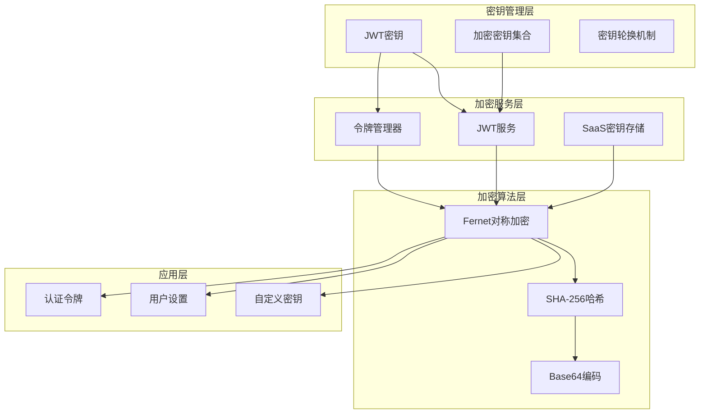

**图表来源**
- [token_manager.py](file://enterprise/server/auth/token_manager.py#L78-L87)
- [jwt_service.py](file://openhands/app_server/services/jwt_service.py#L21-L47)
- [saas_secrets_store.py](file://enterprise/storage/saas_secrets_store.py#L18-L23)

## 核心加密组件

### TokenManager类

TokenManager是企业版的核心加密管理器，负责处理各种类型的令牌加密需求。它通过继承自create_encryption_utility函数创建的加密工具来实现数据保护。

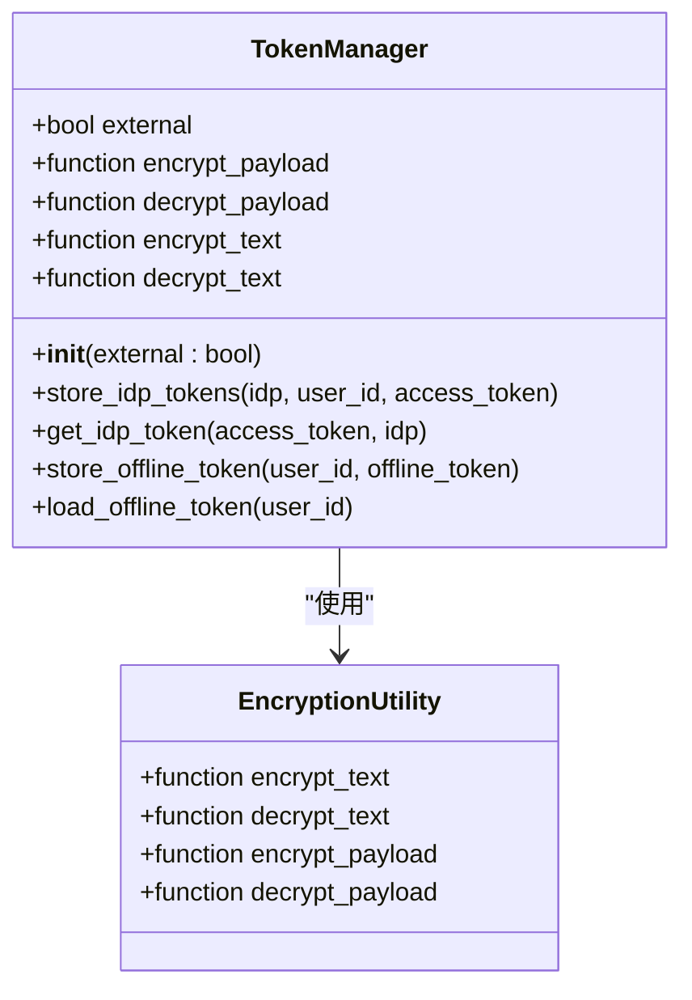

**图表来源**
- [token_manager.py](file://enterprise/server/auth/token_manager.py#L78-L87)

### JwtService类

JwtService提供了JWT签名和加密功能，支持JWS（JSON Web Signature）和JWE（JSON Web Encryption）两种模式。

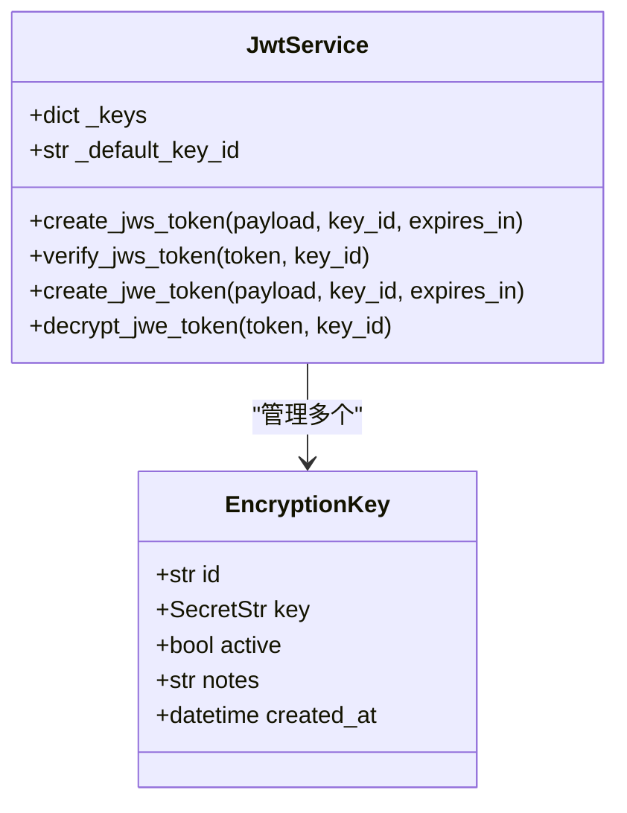

**图表来源**
- [jwt_service.py](file://openhands/app_server/services/jwt_service.py#L21-L47)
- [encryption_key.py](file://openhands/app_server/utils/encryption_key.py#L12-L26)

**章节来源**
- [token_manager.py](file://enterprise/server/auth/token_manager.py#L78-L87)
- [jwt_service.py](file://openhands/app_server/services/jwt_service.py#L21-L47)

## Fernet对称加密实现

### create_encryption_utility函数

create_encryption_utility函数是整个加密机制的核心，它将32字节的JWT密钥转换为Fernet兼容的密钥格式。

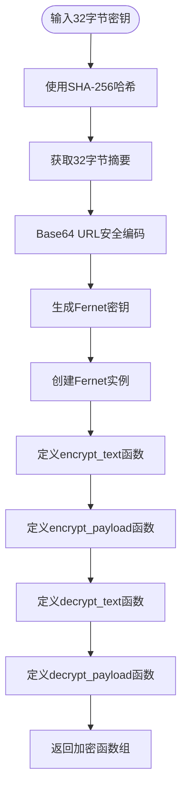

**图表来源**
- [token_manager.py](file://enterprise/server/auth/token_manager.py#L47-L75)

### 密钥转换过程

密钥转换过程确保了JWT密钥能够被Fernet算法正确使用：

| 步骤 | 操作 | 输入 | 输出 |
|------|------|------|------|
| 1 | 哈希计算 | 32字节原始密钥 | 32字节SHA-256摘要 |
| 2 | Base64编码 | SHA-256摘要 | URL安全Base64字符串 |
| 3 | Fernet初始化 | 编码后的密钥 | Fernet实例 |
| 4 | 函数生成 | Fernet实例 | 加密解密函数 |

**章节来源**
- [token_manager.py](file://enterprise/server/auth/token_manager.py#L47-L75)

## JWT密钥转换机制

### 密钥来源和验证

系统支持多种密钥来源，优先级从高到低为：环境变量JWT_SECRET > 配置文件 > 自动生成密钥。

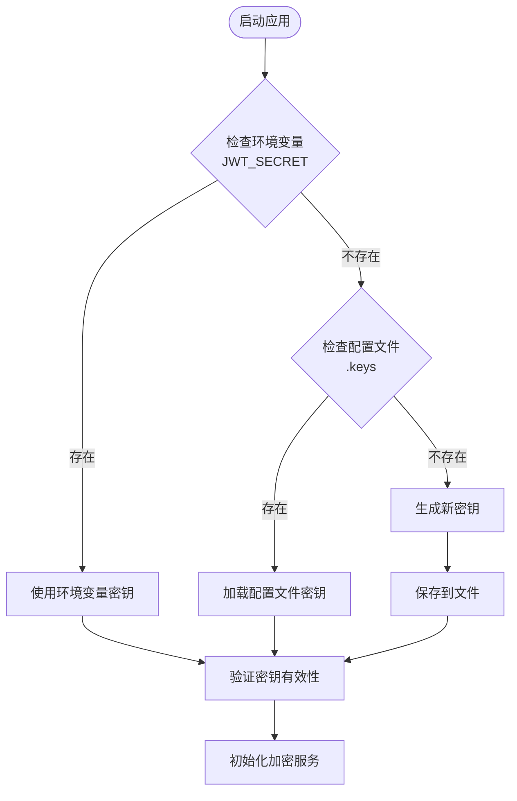

**图表来源**
- [encryption_key.py](file://openhands/app_server/utils/encryption_key.py#L29-L58)

### 密钥结构和属性

每个加密密钥包含以下关键属性：

| 属性 | 类型 | 描述 | 默认值 |
|------|------|------|--------|
| id | str | 唯一标识符（Base62编码） | 自动生成 |
| key | SecretStr | 实际加密密钥 | 随机生成 |
| active | bool | 是否激活状态 | True |
| notes | str | 备注信息 | None |
| created_at | datetime | 创建时间 | 当前时间 |

**章节来源**
- [encryption_key.py](file://openhands/app_server/utils/encryption_key.py#L12-L26)

## 加密解密函数详解

### 文本加密函数

encrypt_text函数负责对单个文本进行加密：

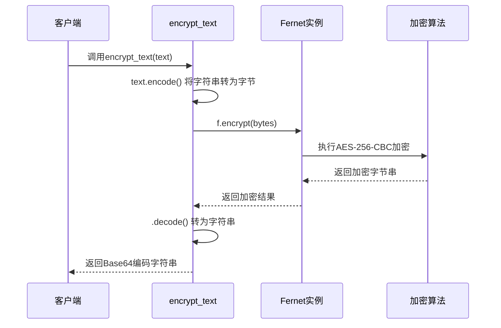

**图表来源**
- [token_manager.py](file://enterprise/server/auth/token_manager.py#L59-L61)

### 负载加密函数

encrypt_payload函数专门处理JSON对象的加密：

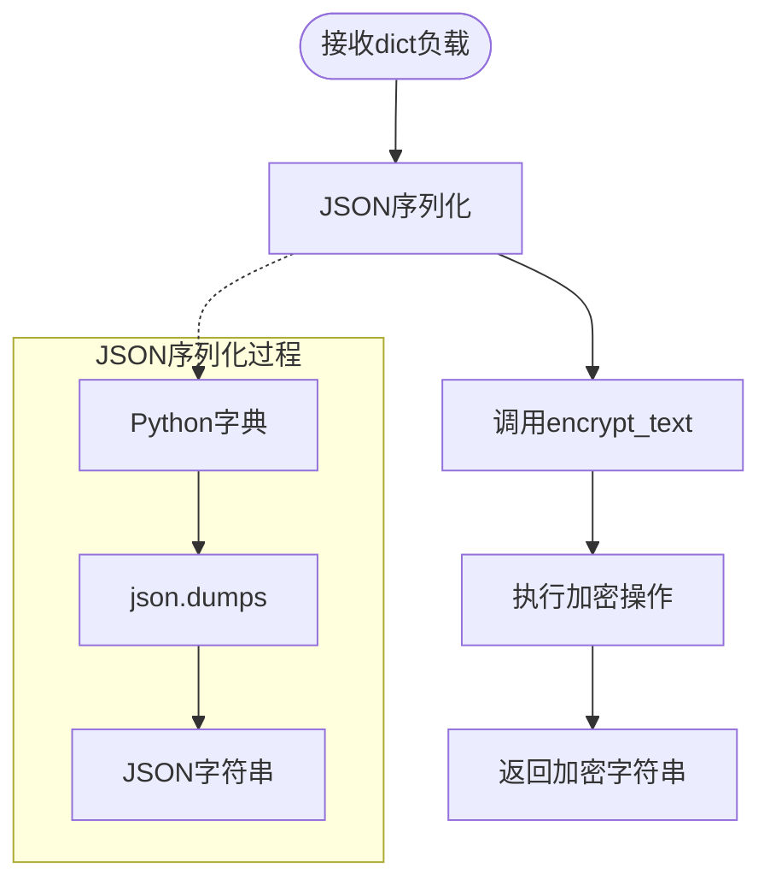

**图表来源**
- [token_manager.py](file://enterprise/server/auth/token_manager.py#L62-L65)

### 解密函数实现

解密过程与加密过程相反，确保数据的完整性和安全性：

| 函数 | 功能 | 输入类型 | 输出类型 |
|------|------|----------|----------|
| decrypt_text | 解密单个文本 | Base64字符串 | UTF-8字符串 |
| decrypt_payload | 解密JSON负载 | Base64字符串 | Python字典 |

**章节来源**
- [token_manager.py](file://enterprise/server/auth/token_manager.py#L67-L74)

## JSON数据处理流程

### 数据序列化和反序列化

系统在处理JSON数据时遵循严格的序列化和反序列化流程：

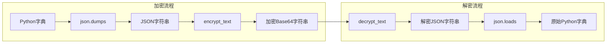

**图表来源**
- [token_manager.py](file://enterprise/server/auth/token_manager.py#L62-L74)

### 复杂数据结构处理

系统能够处理嵌套的复杂数据结构，包括多层嵌套的对象和数组：

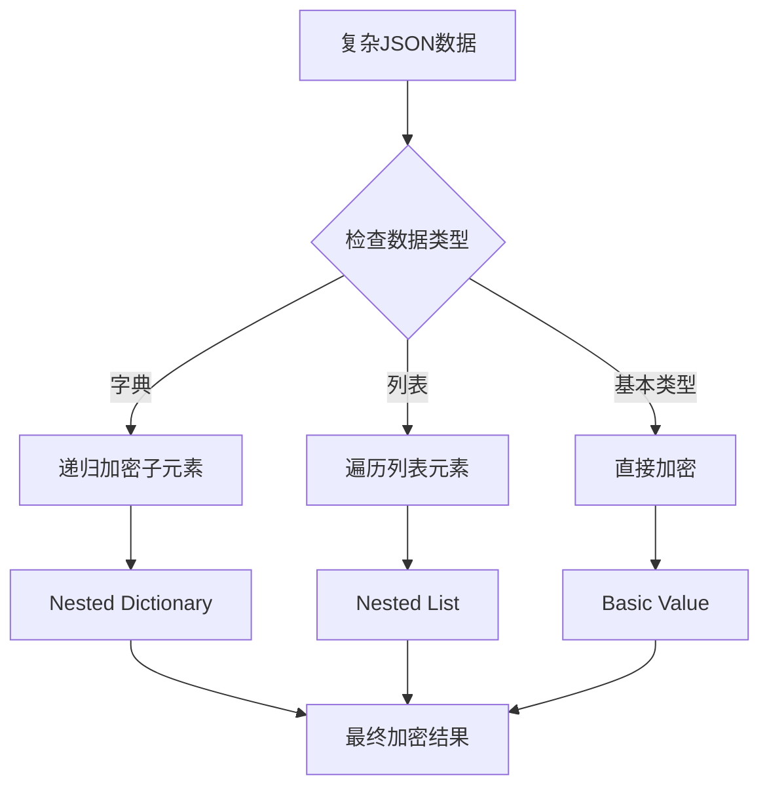

**章节来源**
- [test_saas_secrets_store.py](file://enterprise/tests/unit/test_saas_secrets_store.py#L115-L146)

## 密钥管理最佳实践

### 密钥轮换策略

系统支持多密钥并存和密钥轮换机制：

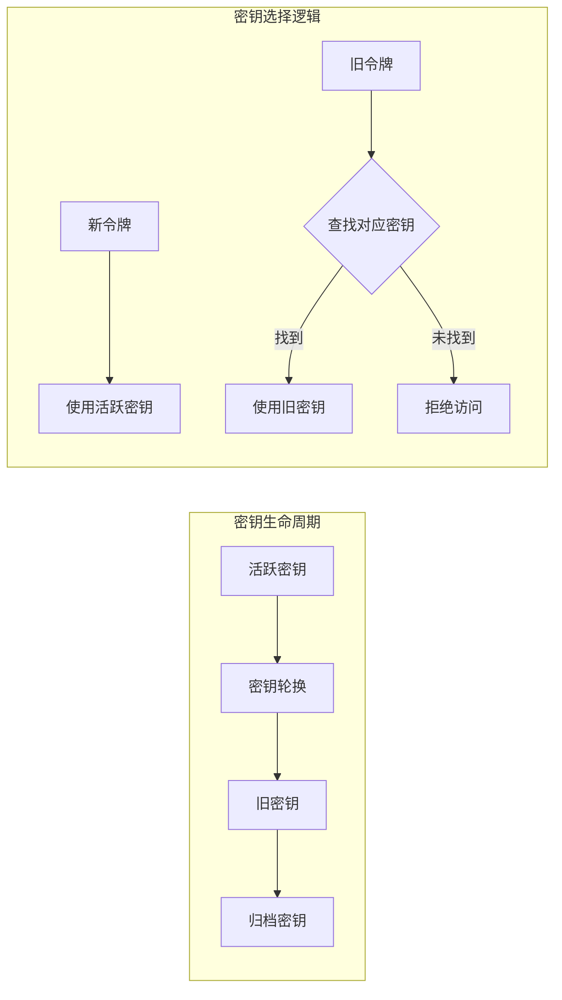

**图表来源**
- [jwt_service.py](file://openhands/app_server/services/jwt_service.py#L40-L47)

### 密钥安全存储

密钥的安全存储采用了多层次的保护措施：

| 存储层级 | 保护方式 | 适用场景 |
|----------|----------|----------|
| 内存中 | SecretStr包装 | 运行时访问 |
| 文件系统 | 权限控制 | 持久化存储 |
| 环境变量 | 系统级保护 | 生产部署 |
| 数据库 | 加密存储 | 用户特定密钥 |

### 密钥验证机制

系统实现了严格的密钥验证流程：

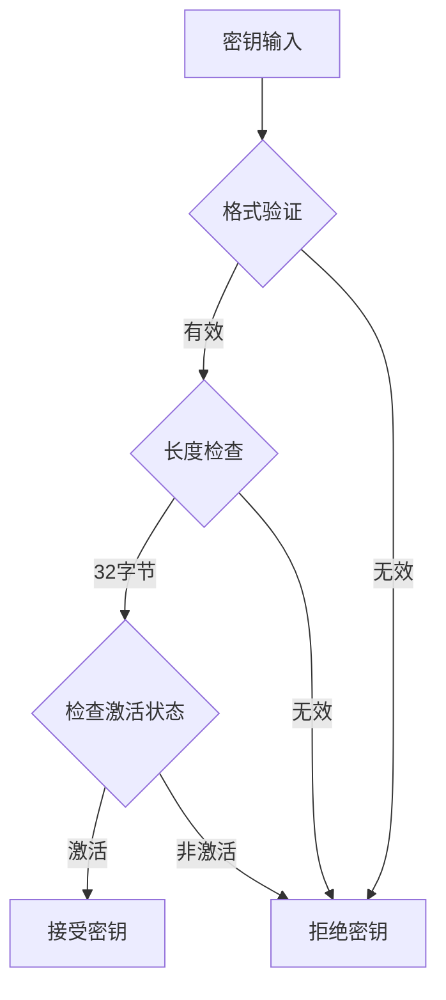

**章节来源**
- [encryption_key.py](file://openhands/app_server/utils/encryption_key.py#L29-L58)

## 安全优势分析

### 基于JWT密钥的安全性

使用JWT密钥作为加密基础具有以下安全优势：

1. **统一密钥管理**：避免了单独维护加密密钥的复杂性
2. **密钥强度保证**：JWT密钥通常具有足够的熵值
3. **审计跟踪**：所有密钥变更都有记录可查
4. **自动轮换**：支持密钥定期更新

### Fernet加密的安全特性

Fernet对称加密提供了以下安全保障：

| 安全特性 | 实现方式 | 保护内容 |
|----------|----------|----------|
| 数据完整性 | HMAC-SHA256 | 防止篡改 |
| 机密性 | AES-256-CBC | 防止泄露 |
| 时间戳 | 自动添加 | 防止重放攻击 |
| 版本控制 | 格式标识 | 兼容性保证 |

### 多层防护机制

系统采用了多层防护策略：

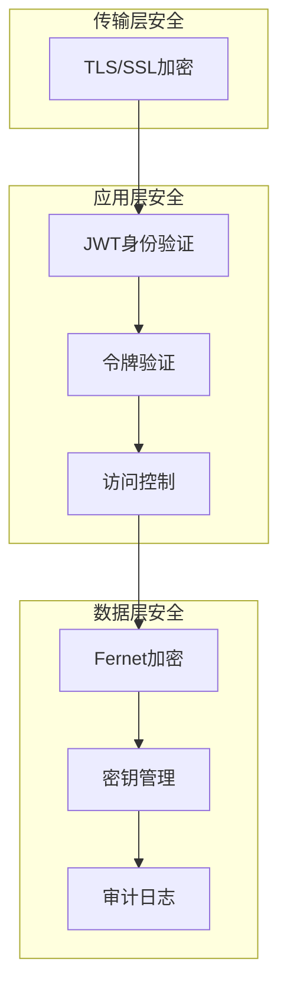

**章节来源**
- [token_manager.py](file://enterprise/server/auth/token_manager.py#L47-L75)
- [jwt_service.py](file://openhands/app_server/services/jwt_service.py#L129-L230)

## 使用场景和调用时机

### 令牌存储场景

在用户认证过程中，系统会在不同阶段调用加密功能：

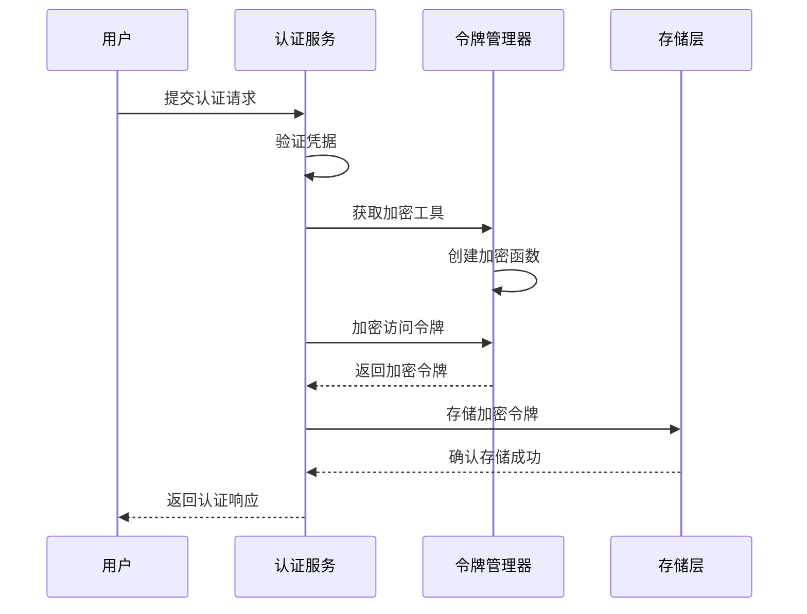

**图表来源**
- [token_manager.py](file://enterprise/server/auth/token_manager.py#L170-L188)

### 敏感数据保护

系统在处理用户敏感数据时的应用场景：

| 场景 | 加密时机 | 数据类型 | 保护目标 |
|------|----------|----------|----------|
| 用户设置 | 存储前 | 配置参数 | 隐私保护 |
| 自定义密钥 | 存储前 | API密钥 | 机密性 |
| 会话数据 | 存储前 | 临时信息 | 完整性 |
| 离线令牌 | 存储前 | 刷新令牌 | 安全性 |

### 调用上下文分析

不同的调用上下文决定了加密的具体实现：

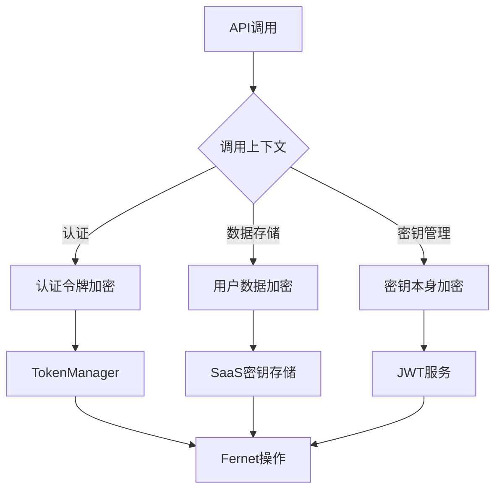

**章节来源**
- [token_manager.py](file://enterprise/server/auth/token_manager.py#L170-L188)
- [saas_secrets_store.py](file://enterprise/storage/saas_secrets_store.py#L325-L349)

## 故障排除指南

### 常见问题诊断

系统提供了完善的错误处理和诊断机制：

| 错误类型 | 可能原因 | 解决方案 |
|----------|----------|----------|
| 密钥无效 | 密钥格式错误或损坏 | 检查密钥格式，重新生成 |
| 解密失败 | 密钥不匹配或数据损坏 | 验证密钥一致性，检查数据完整性 |
| 权限错误 | 文件权限不足 | 设置正确的文件权限 |
| 密钥过期 | 密钥轮换未完成 | 更新密钥配置 |

### 调试和监控

系统内置了调试和监控功能：

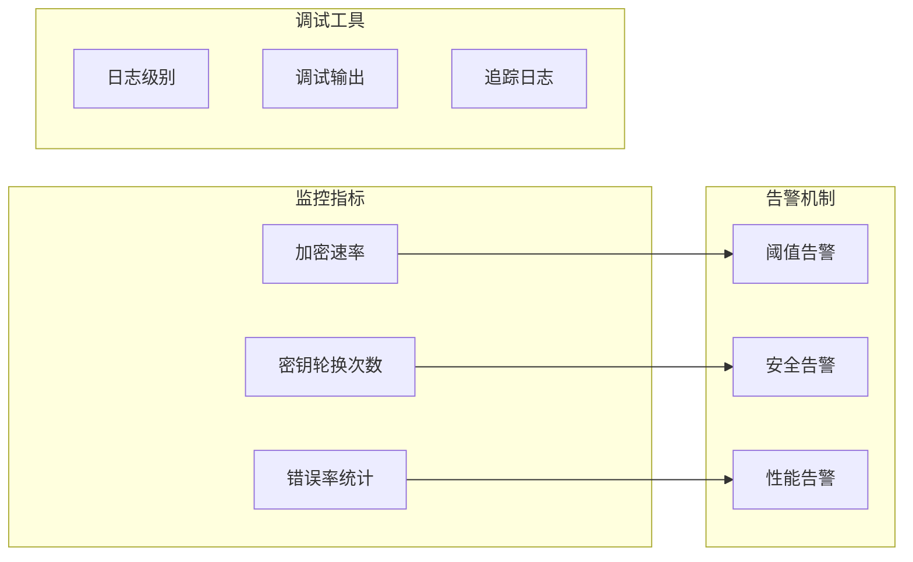

### 性能优化建议

为了获得最佳性能，建议采用以下优化策略：

1. **密钥缓存**：避免重复的密钥解析操作
2. **批量处理**：对大量数据进行批量加密/解密
3. **异步处理**：在I/O密集型操作中使用异步模式
4. **内存管理**：及时释放不再使用的加密实例

**章节来源**
- [test_token_manager_extended.py](file://enterprise/tests/unit/test_token_manager_extended.py#L17-L36)
- [test_jwt_service.py](file://tests/unit/app_server/test_jwt_service.py#L23-L372)

## 总结

OpenHands项目的令牌加密机制通过精心设计的架构和实现，提供了强大而灵活的数据保护能力。该机制的核心优势包括：

1. **统一密钥管理**：基于JWT密钥的加密方案简化了密钥管理复杂度
2. **高效加密算法**：Fernet对称加密提供了高性能和强安全性的平衡
3. **灵活的应用场景**：支持多种数据类型和使用场景
4. **完善的安全保障**：多层防护和严格验证确保数据安全
5. **良好的扩展性**：模块化设计便于功能扩展和维护

通过合理使用这套加密机制，开发者可以构建出既安全又高效的用户认证和数据保护系统，为用户提供可靠的服务保障。