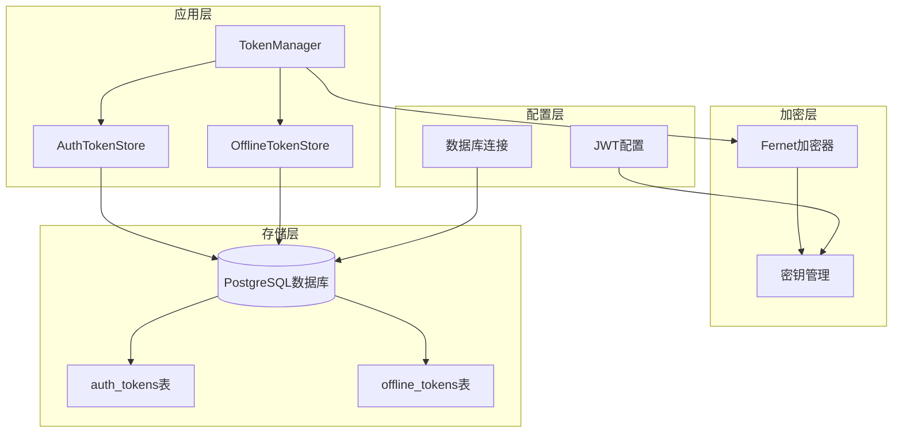
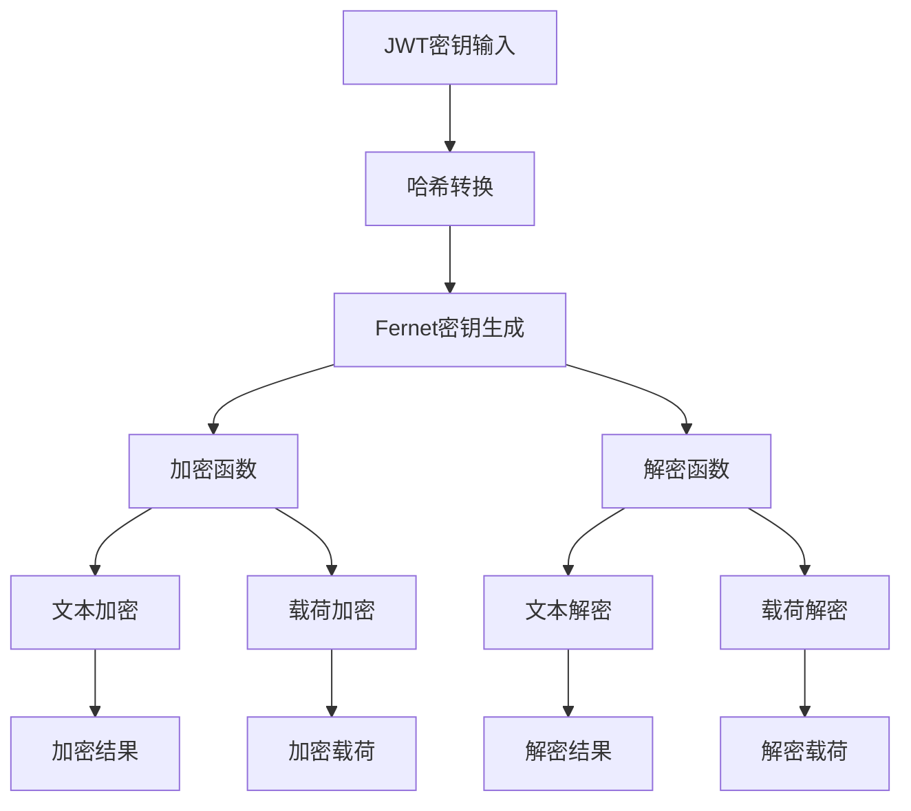
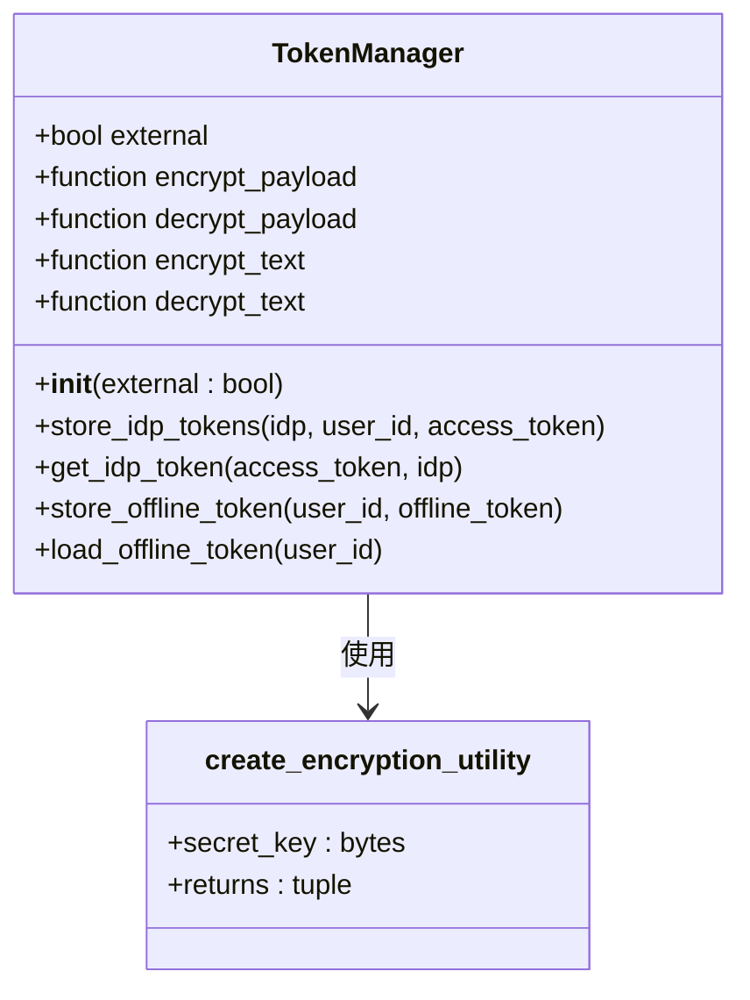
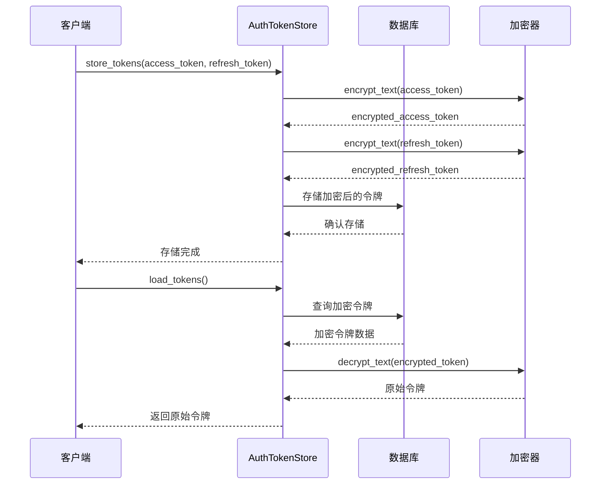
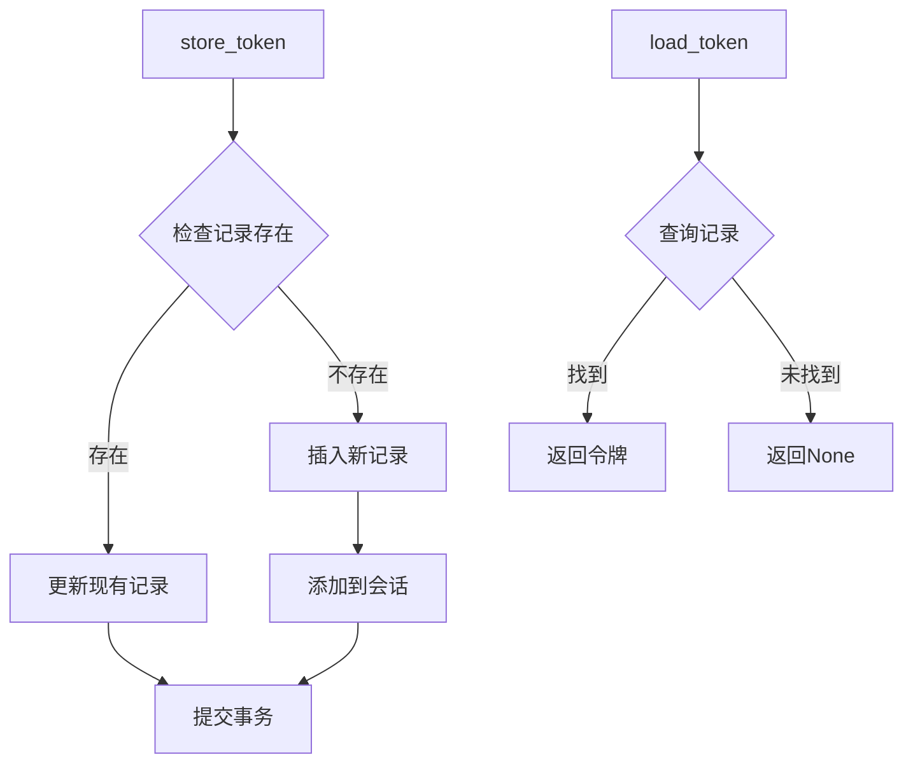
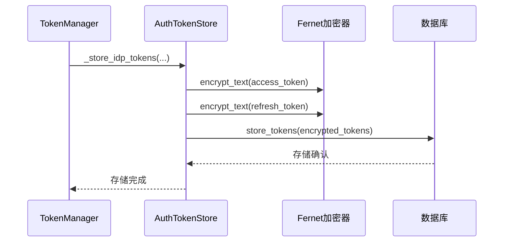
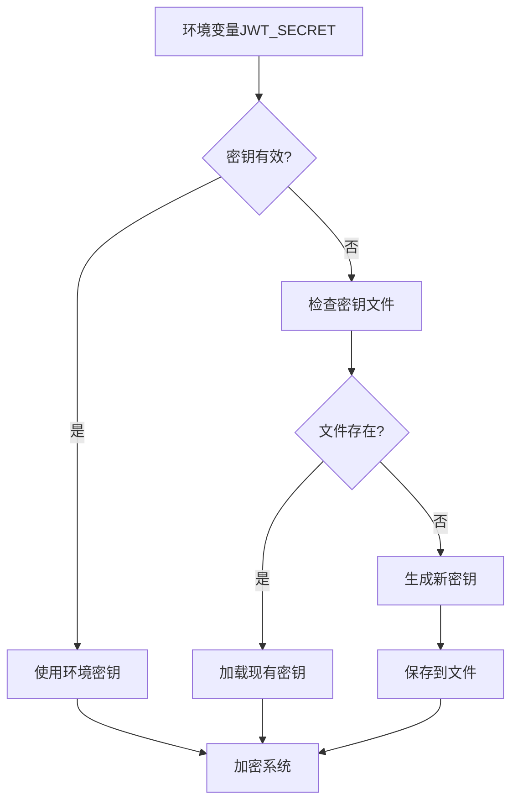
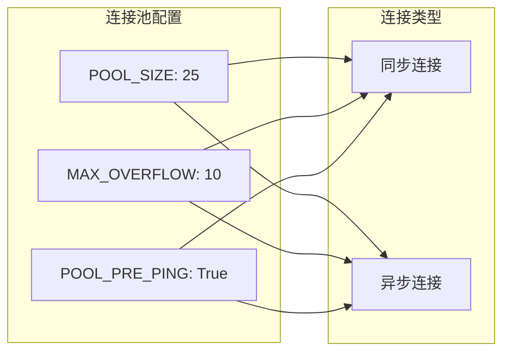

# 令牌存储系统完整文档

<cite>
**本文档中引用的文件**
- [token_manager.py](file://enterprise/server/auth/token_manager.py)
- [auth_token_store.py](file://enterprise/storage/auth_token_store.py)
- [offline_token_store.py](file://enterprise/storage/offline_token_store.py)
- [stored_offline_token.py](file://enterprise/storage/stored_offline_token.py)
- [auth_tokens.py](file://enterprise/storage/auth_tokens.py)
- [database.py](file://enterprise/storage/database.py)
- [base.py](file://enterprise/storage/base.py)
- [021_create_auth_tokens_table.py](file://enterprise/migrations/versions/021_create_auth_tokens_table.py)
- [010_create_offline_tokens_table.py](file://enterprise/migrations/versions/010_create_offline_tokens_table.py)
</cite>

## 目录
1. [简介](#简介)
2. [系统架构概览](#系统架构概览)
3. [Fernet加密系统](#fernet加密系统)
4. [核心存储组件](#核心存储组件)
5. [数据库设计](#数据库设计)
6. [加密密钥管理](#加密密钥管理)
7. [事务处理机制](#事务处理机制)
8. [最佳实践](#最佳实践)
9. [故障排除指南](#故障排除指南)
10. [总结](#总结)

## 简介

OpenHands令牌存储系统是一个基于Fernet对称加密算法的安全令牌管理系统，专门用于保护用户身份验证令牌的安全存储。该系统通过多层加密机制确保令牌数据在传输和存储过程中的安全性，同时提供了高效的数据库存储和检索功能。

系统主要包含两个核心存储组件：`AuthTokenStore`用于存储认证令牌（访问令牌和刷新令牌），`OfflineTokenStore`用于存储离线令牌。所有敏感令牌数据都经过Fernet加密后才存储到数据库中。

## 系统架构概览



**图表来源**
- [token_manager.py](file://enterprise/server/auth/token_manager.py#L78-L87)
- [auth_token_store.py](file://enterprise/storage/auth_token_store.py#L16-L21)
- [offline_token_store.py](file://enterprise/storage/offline_token_store.py#L13-L18)

**章节来源**
- [token_manager.py](file://enterprise/server/auth/token_manager.py#L47-L87)
- [auth_token_store.py](file://enterprise/storage/auth_token_store.py#L16-L21)
- [offline_token_store.py](file://enterprise/storage/offline_token_store.py#L13-L18)

## Fernet加密系统

### create_encryption_utility函数详解

`create_encryption_utility`函数是整个加密系统的核心，它基于JWT密钥生成一个完整的加密工具集：



**图表来源**
- [token_manager.py](file://enterprise/server/auth/token_manager.py#L47-L75)

#### 加密工具生成流程

1. **密钥转换**：将32字节的JWT密钥通过SHA-256哈希转换为适合Fernet的格式
2. **Fernet实例化**：使用转换后的密钥创建Fernet加密器实例
3. **函数封装**：生成四个核心加密解密函数

#### 核心加密方法

- **encrypt_text**: 对单个字符串进行加密
- **encrypt_payload**: 对JSON对象进行序列化和加密
- **decrypt_text**: 对加密字符串进行解密
- **decrypt_payload**: 对加密载荷进行解密和反序列化

**章节来源**
- [token_manager.py](file://enterprise/server/auth/token_manager.py#L47-L75)

### TokenManager类集成

`TokenManager`类集成了Fernet加密功能，作为整个令牌管理系统的入口点：



**图表来源**
- [token_manager.py](file://enterprise/server/auth/token_manager.py#L78-L87)
- [token_manager.py](file://enterprise/server/auth/token_manager.py#L47-L75)

**章节来源**
- [token_manager.py](file://enterprise/server/auth/token_manager.py#L78-L87)

## 核心存储组件

### AuthTokenStore - 认证令牌存储

`AuthTokenStore`负责存储和管理用户的认证令牌，包括访问令牌和刷新令牌：



**图表来源**
- [auth_token_store.py](file://enterprise/storage/auth_token_store.py#L26-L67)
- [auth_token_store.py](file://enterprise/storage/auth_token_store.py#L69-L156)

#### 主要功能特性

1. **事务性存储**：使用数据库事务确保数据一致性
2. **行级锁定**：防止并发刷新操作冲突
3. **自动刷新**：支持令牌过期检测和自动刷新
4. **索引优化**：为查询性能优化建立复合索引

**章节来源**
- [auth_token_store.py](file://enterprise/storage/auth_token_store.py#L26-L156)

### OfflineTokenStore - 离线令牌存储

`OfflineTokenStore`专门用于存储用户的离线访问令牌：



**图表来源**
- [offline_token_store.py](file://enterprise/storage/offline_token_store.py#L19-L49)

#### 存储流程特点

1. **简单直接**：相比认证令牌存储，离线令牌存储更加简洁
2. **无刷新逻辑**：不涉及令牌刷新机制
3. **键值映射**：以用户ID为主键的简单键值存储

**章节来源**
- [offline_token_store.py](file://enterprise/storage/offline_token_store.py#L19-L49)

### _store_idp_tokens方法详解

这是系统中最重要的加密存储方法之一：



**图表来源**
- [token_manager.py](file://enterprise/server/auth/token_manager.py#L169-L188)

**章节来源**
- [token_manager.py](file://enterprise/server/auth/token_manager.py#L169-L188)

## 数据库设计

### 表结构设计

#### auth_tokens表

| 列名 | 类型 | 约束 | 描述 |
|------|------|------|------|
| id | Integer | PRIMARY KEY, AUTO_INCREMENT | 主键标识符 |
| keycloak_user_id | String | NOT NULL, INDEX | Keycloak用户ID |
| identity_provider | String | NOT NULL | 身份提供商类型 |
| access_token | String | NOT NULL | 加密后的访问令牌 |
| refresh_token | String | NOT NULL | 加密后的刷新令牌 |
| access_token_expires_at | BigInteger | NOT NULL | 访问令牌过期时间戳 |
| refresh_token_expires_at | BigInteger | NOT NULL | 刷新令牌过期时间戳 |

#### offline_tokens表

| 列名 | 类型 | 约束 | 描述 |
|------|------|------|------|
| user_id | String(255) | PRIMARY KEY | 用户唯一标识 |
| offline_token | String | NOT NULL | 加密后的离线令牌 |
| created_at | DateTime | DEFAULT CURRENT_TIMESTAMP | 记录创建时间 |
| updated_at | DateTime | DEFAULT CURRENT_TIMESTAMP ON UPDATE | 记录更新时间 |

### 索引策略

```mermaid
erDiagram
AUTH_TOKENS {
int id PK
string keycloak_user_id IDX
string identity_provider
string access_token
string refresh_token
bigint access_token_expires_at
bigint refresh_token_expires_at
}
OFFLINE_TOKENS {
string user_id PK
string offline_token
datetime created_at
datetime updated_at
}
AUTH_TOKENS ||--o{ OFFLINE_TOKENS : "用户关联"
```

**图表来源**
- [auth_tokens.py](file://enterprise/storage/auth_tokens.py#L5-L26)
- [stored_offline_token.py](file://enterprise/storage/stored_offline_token.py#L5-L18)

**章节来源**
- [auth_tokens.py](file://enterprise/storage/auth_tokens.py#L5-L26)
- [stored_offline_token.py](file://enterprise/storage/stored_offline_token.py#L5-L18)

## 加密密钥管理

### 密钥生成和存储

系统采用多层次的密钥管理策略：



**图表来源**
- [encryption_key.py](file://openhands/app_server/utils/encryption_key.py#L29-L58)

### 密钥轮换机制

系统支持多个活跃密钥的同时存在，便于密钥轮换：

1. **多密钥支持**：允许同时存在多个加密密钥
2. **版本控制**：每个密钥都有唯一的标识符和创建时间
3. **透明解密**：系统能够自动识别并使用正确的密钥解密数据

**章节来源**
- [encryption_key.py](file://openhands/app_server/utils/encryption_key.py#L29-L58)

## 事务处理机制

### 数据库连接池配置

系统采用异步数据库连接池来处理高并发请求：



**图表来源**
- [database.py](file://enterprise/storage/database.py#L20-L22)

### 事务隔离级别

系统在关键操作中使用数据库事务来保证数据一致性：

1. **认证令牌存储**：使用显式事务块确保原子性
2. **并发控制**：通过行级锁防止并发刷新冲突
3. **自动提交**：在事务完成后自动提交更改

**章节来源**
- [database.py](file://enterprise/storage/database.py#L20-L115)

## 最佳实践

### 安全最佳实践

1. **密钥强度**：使用至少32字节的随机密钥
2. **密钥轮换**：定期更换加密密钥
3. **访问控制**：限制对密钥文件的访问权限
4. **审计日志**：记录所有加密操作

### 性能优化建议

1. **连接池调优**：根据负载调整连接池大小
2. **索引优化**：为频繁查询的字段建立索引
3. **缓存策略**：对频繁访问的令牌实施缓存
4. **批量操作**：对于大量令牌操作使用批量处理

### 监控和维护

1. **健康检查**：定期检查数据库连接状态
2. **性能监控**：监控查询响应时间和连接池使用率
3. **备份策略**：定期备份加密密钥和数据库
4. **错误处理**：实现完善的异常处理和恢复机制

## 故障排除指南

### 常见问题及解决方案

#### 加密失败问题

**症状**：令牌无法正确加密或解密
**原因**：密钥不匹配或密钥损坏
**解决方案**：
1. 检查JWT_SECRET环境变量设置
2. 验证密钥文件完整性
3. 重新生成新的加密密钥

#### 数据库连接问题

**症状**：存储操作超时或连接失败
**原因**：连接池耗尽或网络问题
**解决方案**：
1. 检查数据库连接参数
2. 调整连接池配置
3. 验证网络连通性

#### 事务冲突问题

**症状**：并发操作导致数据不一致
**原因**：缺乏适当的锁定机制
**解决方案**：
1. 实施行级锁定
2. 使用乐观锁策略
3. 重试机制处理冲突

**章节来源**
- [database.py](file://enterprise/storage/database.py#L10-L115)

## 总结

OpenHands令牌存储系统通过以下关键特性确保了令牌的安全性和可靠性：

1. **强加密保障**：基于Fernet的对称加密算法提供强大的数据保护
2. **双重存储**：分别处理认证令牌和离线令牌的不同需求
3. **事务一致性**：通过数据库事务确保数据完整性
4. **灵活配置**：支持多种部署环境和配置选项
5. **性能优化**：采用连接池和索引优化提升系统性能

该系统为现代应用程序提供了企业级的令牌安全管理解决方案，适用于需要高安全性和高性能的生产环境。通过遵循本文档中的最佳实践和指导原则，开发团队可以构建稳定可靠的令牌存储基础设施。