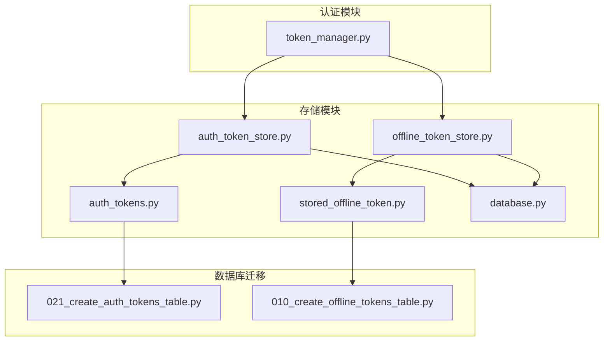
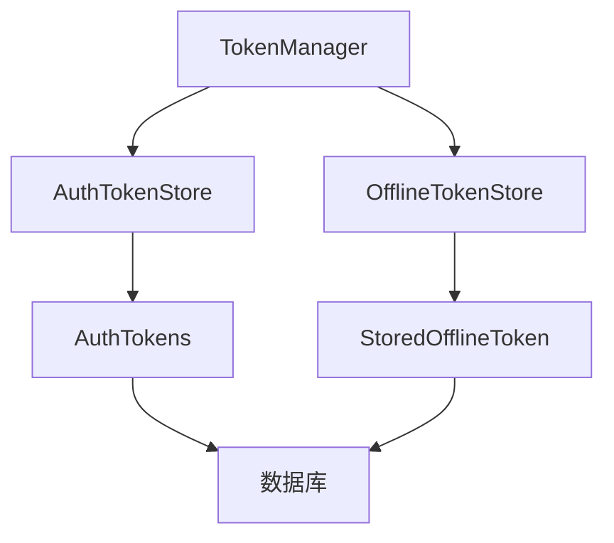
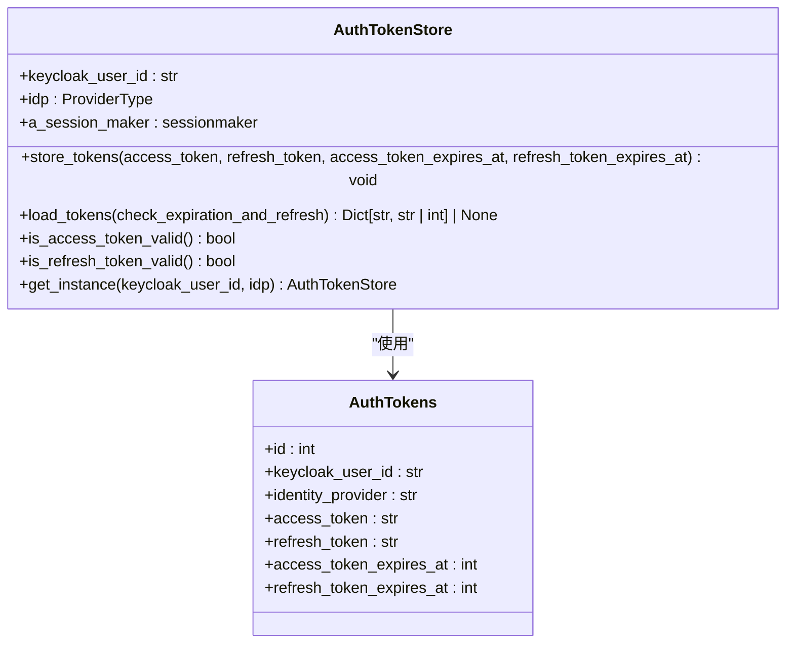
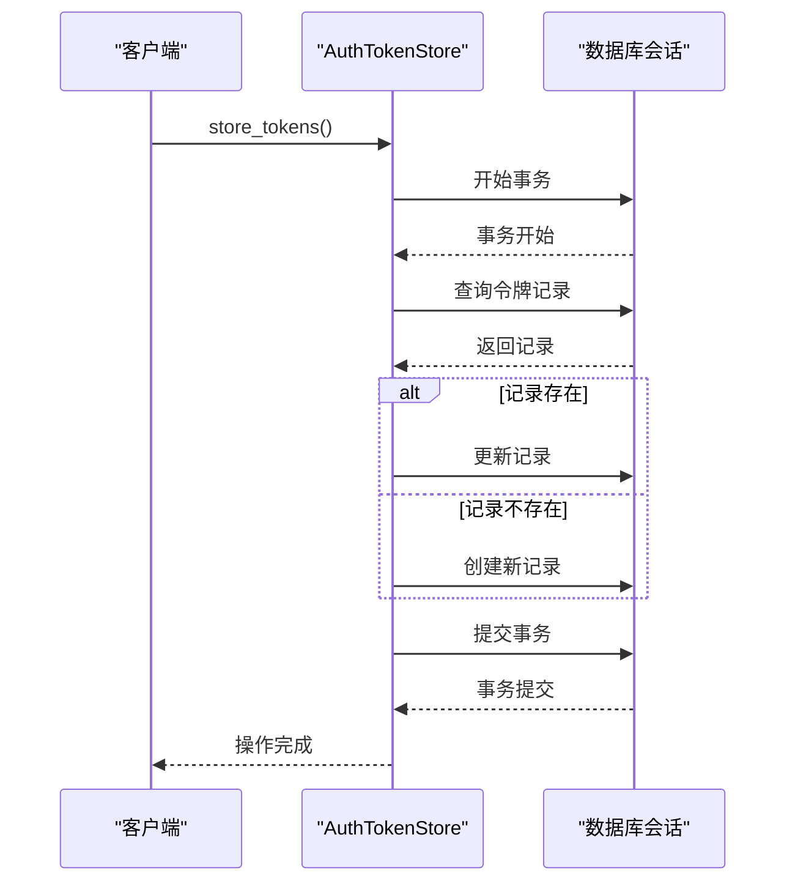
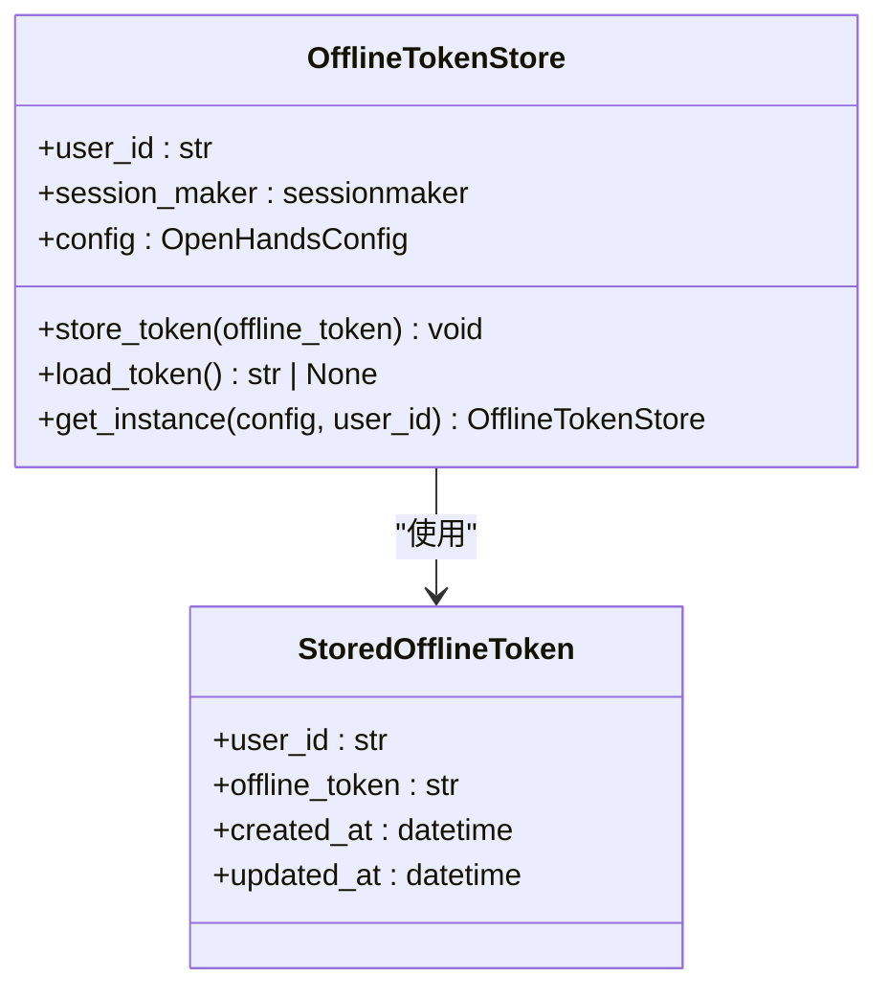
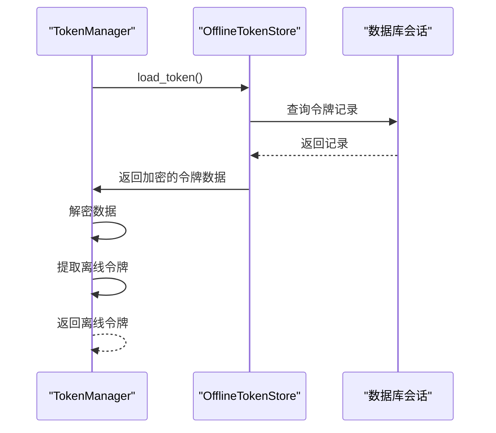
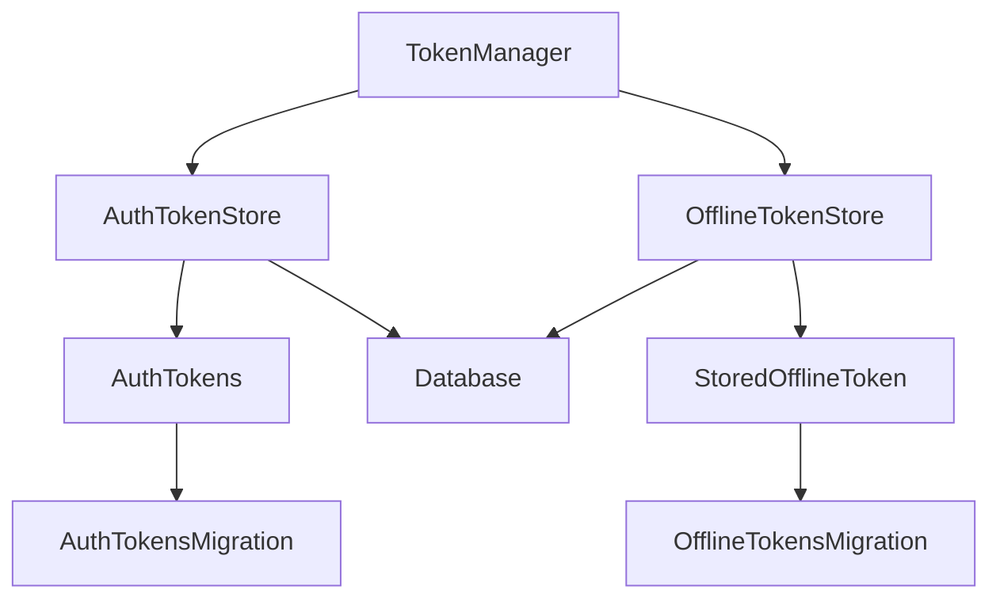

# 令牌存储机制

<cite>
**本文档引用的文件**
- [auth_token_store.py](file://enterprise/storage/auth_token_store.py)
- [offline_token_store.py](file://enterprise/storage/offline_token_store.py)
- [token_manager.py](file://enterprise/server/auth/token_manager.py)
- [auth_tokens.py](file://enterprise/storage/auth_tokens.py)
- [stored_offline_token.py](file://enterprise/storage/stored_offline_token.py)
- [database.py](file://enterprise/storage/database.py)
- [021_create_auth_tokens_table.py](file://enterprise/migrations/versions/021_create_auth_tokens_table.py)
- [010_create_offline_tokens_table.py](file://enterprise/migrations/versions/010_create_offline_tokens_table.py)
</cite>

## 目录
1. [介绍](#介绍)
2. [项目结构](#项目结构)
3. [核心组件](#核心组件)
4. [架构概述](#架构概述)
5. [详细组件分析](#详细组件分析)
6. [依赖分析](#依赖分析)
7. [性能考虑](#性能考虑)
8. [故障排除指南](#故障排除指南)
9. [结论](#结论)

## 介绍
本文档详细说明了OpenHands项目中的令牌存储机制，重点关注`AuthTokenStore`和`OfflineTokenStore`两个存储类的实现和使用。文档解释了`AuthTokenStore`如何为不同身份提供商（GitHub、GitLab、Bitbucket）存储用户令牌，包括`_store_idp_tokens`方法的事务处理流程和数据库交互细节。同时描述了`OfflineTokenStore`如何安全存储用户的离线令牌，以及`load_offline_token`方法的解密和数据提取过程。文档还说明了两个存储类与`TokenManager`的协作关系，包括`get_instance`工厂方法的使用和会话管理，并提供了数据库表结构设计和存储策略的最佳实践。

## 项目结构
令牌存储机制的实现主要分布在`enterprise`目录下的`storage`和`server/auth`子目录中。`storage`目录包含了数据模型和存储类的实现，而`server/auth`目录包含了`TokenManager`类，负责协调不同存储类的使用。

**图表来源**
- [auth_token_store.py](file://enterprise/storage/auth_token_store.py)
- [offline_token_store.py](file://enterprise/storage/offline_token_store.py)
- [token_manager.py](file://enterprise/server/auth/token_manager.py)
- [auth_tokens.py](file://enterprise/storage/auth_tokens.py)
- [stored_offline_token.py](file://enterprise/storage/stored_offline_token.py)
- [database.py](file://enterprise/storage/database.py)
- [021_create_auth_tokens_table.py](file://enterprise/migrations/versions/021_create_auth_tokens_table.py)
- [010_create_offline_tokens_table.py](file://enterprise/migrations/versions/010_create_offline_tokens_table.py)

**章节来源**
- [auth_token_store.py](file://enterprise/storage/auth_token_store.py)
- [offline_token_store.py](file://enterprise/storage/offline_token_store.py)
- [token_manager.py](file://enterprise/server/auth/token_manager.py)

## 核心组件
令牌存储机制的核心组件包括`AuthTokenStore`、`OfflineTokenStore`和`TokenManager`。`AuthTokenStore`负责存储和管理用户的身份提供商令牌，`OfflineTokenStore`负责存储和管理用户的离线令牌，而`TokenManager`则作为协调者，负责调用这两个存储类的方法来完成具体的令牌管理任务。

**章节来源**
- [auth_token_store.py](file://enterprise/storage/auth_token_store.py)
- [offline_token_store.py](file://enterprise/storage/offline_token_store.py)
- [token_manager.py](file://enterprise/server/auth/token_manager.py)

## 架构概述
令牌存储机制的架构设计遵循了分层和职责分离的原则。`TokenManager`位于最高层，负责处理业务逻辑和协调不同存储类的使用。`AuthTokenStore`和`OfflineTokenStore`位于中间层，负责具体的令牌存储和检索操作。最底层是数据库和数据模型，负责持久化存储令牌数据。

**图表来源**
- [auth_token_store.py](file://enterprise/storage/auth_token_store.py)
- [offline_token_store.py](file://enterprise/storage/offline_token_store.py)
- [token_manager.py](file://enterprise/server/auth/token_manager.py)
- [auth_tokens.py](file://enterprise/storage/auth_tokens.py)
- [stored_offline_token.py](file://enterprise/storage/stored_offline_token.py)

## 详细组件分析

### AuthTokenStore 分析
`AuthTokenStore`类负责存储和管理用户的身份提供商令牌。它通过`store_tokens`方法将令牌存储到数据库中，并通过`load_tokens`方法从数据库中加载令牌。`store_tokens`方法使用了事务处理来确保数据的一致性。

**图表来源**
- [auth_token_store.py](file://enterprise/storage/auth_token_store.py#L1-L209)
- [auth_tokens.py](file://enterprise/storage/auth_tokens.py#L1-L27)

#### 事务处理流程
`store_tokens`方法的事务处理流程如下：
1. 开始一个数据库事务。
2. 查询是否存在已有的令牌记录。
3. 如果存在，则更新记录；如果不存在，则创建新记录。
4. 提交事务。

**图表来源**
- [auth_token_store.py](file://enterprise/storage/auth_token_store.py#L41-L67)

### OfflineTokenStore 分析
`OfflineTokenStore`类负责存储和管理用户的离线令牌。它通过`store_token`方法将令牌存储到数据库中，并通过`load_token`方法从数据库中加载令牌。

**图表来源**
- [offline_token_store.py](file://enterprise/storage/offline_token_store.py#L1-L60)
- [stored_offline_token.py](file://enterprise/storage/stored_offline_token.py#L1-L19)

#### 解密和数据提取过程
`load_offline_token`方法的解密和数据提取过程如下：
1. 从`OfflineTokenStore`中加载加密的令牌数据。
2. 解密数据并提取出离线令牌。

**图表来源**
- [token_manager.py](file://enterprise/server/auth/token_manager.py#L654-L662)

## 依赖分析
令牌存储机制的依赖关系如下图所示：

**图表来源**
- [auth_token_store.py](file://enterprise/storage/auth_token_store.py)
- [offline_token_store.py](file://enterprise/storage/offline_token_store.py)
- [token_manager.py](file://enterprise/server/auth/token_manager.py)
- [auth_tokens.py](file://enterprise/storage/auth_tokens.py)
- [stored_offline_token.py](file://enterprise/storage/stored_offline_token.py)
- [database.py](file://enterprise/storage/database.py)
- [021_create_auth_tokens_table.py](file://enterprise/migrations/versions/021_create_auth_tokens_table.py)
- [010_create_offline_tokens_table.py](file://enterprise/migrations/versions/010_create_offline_tokens_table.py)

**章节来源**
- [auth_token_store.py](file://enterprise/storage/auth_token_store.py)
- [offline_token_store.py](file://enterprise/storage/offline_token_store.py)
- [token_manager.py](file://enterprise/server/auth/token_manager.py)

## 性能考虑
在设计令牌存储机制时，考虑了以下性能因素：
1. 使用异步数据库操作以提高并发性能。
2. 使用连接池来减少数据库连接的开销。
3. 使用索引来加速数据库查询。

## 故障排除指南
在使用令牌存储机制时，可能会遇到以下问题：
1. 令牌过期：检查令牌的过期时间，并在必要时刷新令牌。
2. 数据库连接失败：检查数据库配置和网络连接。
3. 令牌解密失败：检查加密密钥是否正确。

**章节来源**
- [auth_token_store.py](file://enterprise/storage/auth_token_store.py)
- [offline_token_store.py](file://enterprise/storage/offline_token_store.py)
- [token_manager.py](file://enterprise/server/auth/token_manager.py)

## 结论
本文档详细说明了OpenHands项目中的令牌存储机制，包括`AuthTokenStore`和`OfflineTokenStore`两个存储类的实现和使用。通过分层和职责分离的设计，该机制能够高效、安全地管理用户的令牌数据。未来可以考虑进一步优化数据库查询性能和增加更多的错误处理机制。