# 令牌生成机制详细文档

<cite>
**本文档引用的文件**
- [token_manager.py](file://enterprise/server/auth/token_manager.py)
- [saas_user_auth.py](file://enterprise/server/auth/saas_user_auth.py)
- [auth.py](file://enterprise/server/routes/auth.py)
- [generate-auth-url.ts](file://frontend/src/utils/generate-auth-url.ts)
- [auth_token_store.py](file://enterprise/storage/auth_token_store.py)
- [auth_routes.py](file://enterprise/tests/unit/test_auth_routes.py)
- [token_manager_extended.py](file://enterprise/tests/unit/test_token_manager_extended.py)
</cite>

## 目录
1. [简介](#简介)
2. [系统架构概览](#系统架构概览)
3. [OAuth授权码流程](#oauth授权码流程)
4. [Keycloak集成机制](#keycloak集成机制)
5. [TokenManager核心功能](#tokenmanager核心功能)
6. [JWT令牌结构与签名](#jwt令牌结构与签名)
7. [令牌存储与加密](#令牌存储与加密)
8. [安全传输机制](#安全传输机制)
9. [前端认证流程](#前端认证流程)
10. [错误处理与重试机制](#错误处理与重试机制)
11. [最佳实践与安全建议](#最佳实践与安全建议)

## 简介

OpenHands系统采用基于Keycloak的OAuth 2.0授权码流程实现用户身份验证和令牌管理。该系统提供了完整的令牌生命周期管理，包括授权码获取、访问令牌和刷新令牌的生成、存储、轮换和安全传输。

本文档详细阐述了从前端发起认证请求到后端TokenManager处理令牌生成的完整流程，涵盖了JWT令牌结构、加密机制、安全传输策略以及异常处理机制。

## 系统架构概览

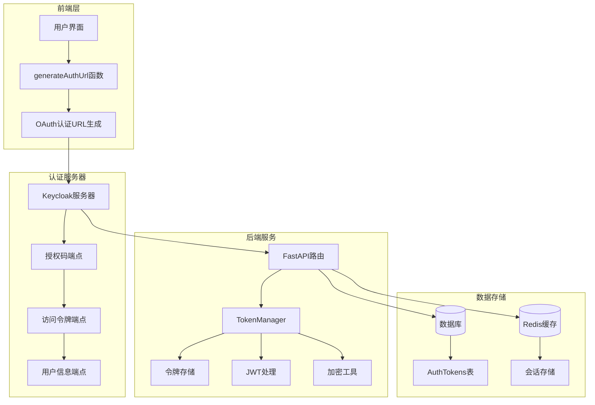

**图表来源**
- [generate-auth-url.ts](file://frontend/src/utils/generate-auth-url.ts#L1-L45)
- [auth.py](file://enterprise/server/routes/auth.py#L1-L435)
- [token_manager.py](file://enterprise/server/auth/token_manager.py#L1-L672)

## OAuth授权码流程

### 授权码交换过程

系统采用标准的OAuth 2.0授权码流程，通过以下步骤完成令牌获取：

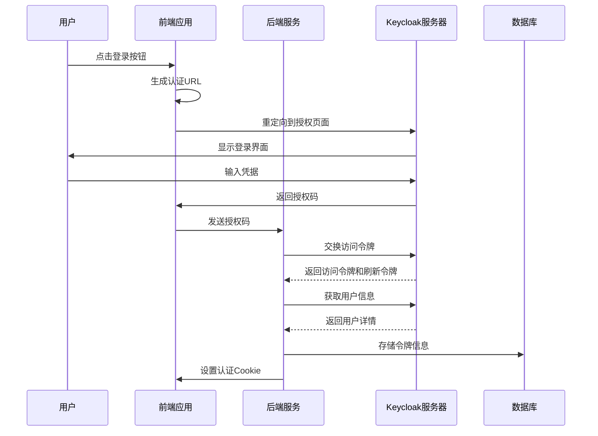

**图表来源**
- [auth.py](file://enterprise/server/routes/auth.py#L123-L153)
- [token_manager.py](file://enterprise/server/auth/token_manager.py#L89-L109)

### 重定向URI处理

系统严格验证重定向URI以防止开放重定向攻击：

| 组件 | 功能 | 安全措施 |
|------|------|----------|
| 前端生成 | 构建回调URL | 协议检查（localhost使用HTTP） |
| 路由验证 | 验证回调参数 | 参数完整性检查 |
| 令牌交换 | 使用回调URI | URI匹配验证 |
| Cookie设置 | 安全Cookie配置 | HttpOnly、Secure标志 |

**段落来源**
- [auth.py](file://enterprise/server/routes/auth.py#L119-L120)
- [generate-auth-url.ts](file://frontend/src/utils/generate-auth-url.ts#L12-L16)

## Keycloak集成机制

### 认证流程实现

TokenManager类负责与Keycloak服务器的所有交互：

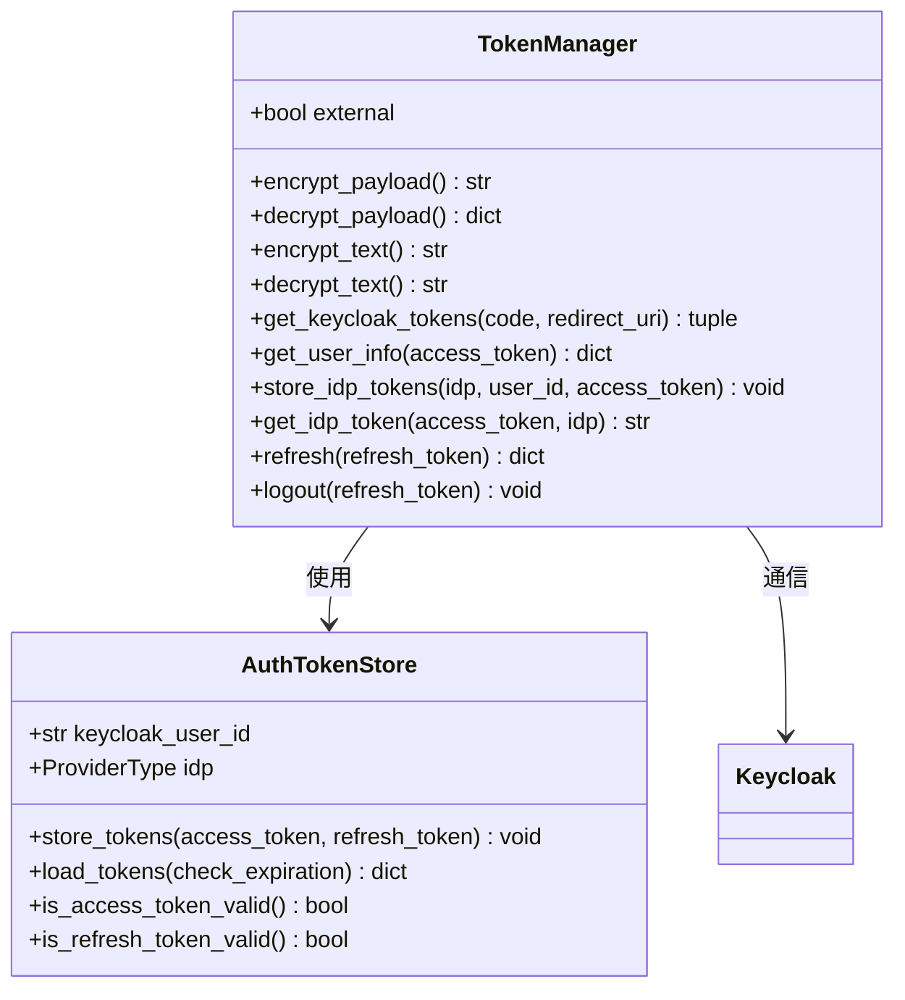

**图表来源**
- [token_manager.py](file://enterprise/server/auth/token_manager.py#L78-L672)
- [auth_token_store.py](file://enterprise/storage/auth_token_store.py#L16-L209)

### 令牌响应解析

系统支持多种令牌响应格式的解析：

| 格式类型 | 解析方式 | 处理逻辑 |
|----------|----------|----------|
| JSON响应 | 直接解析 | 标准JSON解析器 |
| URL编码 | 查询字符串解析 | parse_qs处理 |
| 过期时间计算 | 时间戳转换 | 当前时间+过期间隔 |

**段落来源**
- [token_manager.py](file://enterprise/server/auth/token_manager.py#L190-L243)

## TokenManager核心功能

### get_keycloak_tokens方法详解

这是令牌生成的核心方法，实现了授权码到访问令牌的转换：

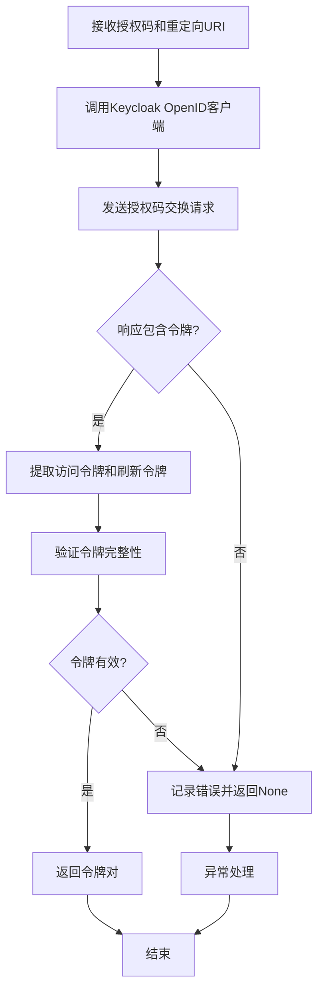

**图表来源**
- [token_manager.py](file://enterprise/server/auth/token_manager.py#L89-L109)

### 令牌存储机制

系统采用分层存储策略：

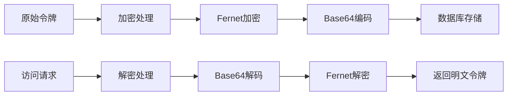

**图表来源**
- [token_manager.py](file://enterprise/server/auth/token_manager.py#L47-L75)
- [auth_token_store.py](file://enterprise/storage/auth_token_store.py#L26-L68)

**段落来源**
- [token_manager.py](file://enterprise/server/auth/token_manager.py#L170-L188)

## JWT令牌结构与签名

### 令牌结构设计

系统使用JWT（JSON Web Token）作为内部令牌格式：

| 部分 | 内容 | 示例值 |
|------|------|--------|
| Header | 算法标识 | {"alg": "HS256", "typ": "JWT"} |
| Payload | 用户信息 | {"sub": "user123", "exp": 1234567890} |
| Signature | 签名验证 | HMAC SHA256(header + "." + payload + secret) |

### 签名验证机制

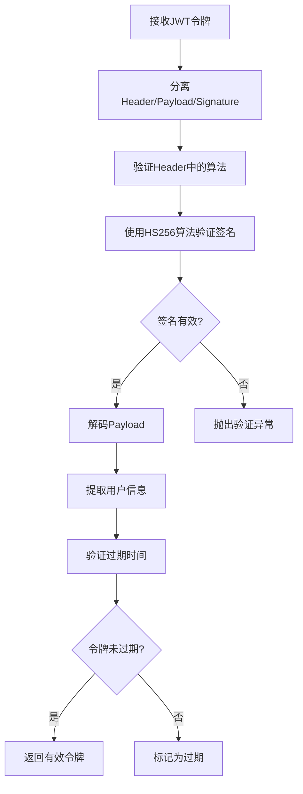

**图表来源**
- [saas_user_auth.py](file://enterprise/server/auth/saas_user_auth.py#L295-L311)

**段落来源**
- [saas_user_auth.py](file://enterprise/server/auth/saas_user_auth.py#L295-L311)

## 令牌存储与加密

### 加密工具实现

系统使用Fernet对称加密确保令牌安全：

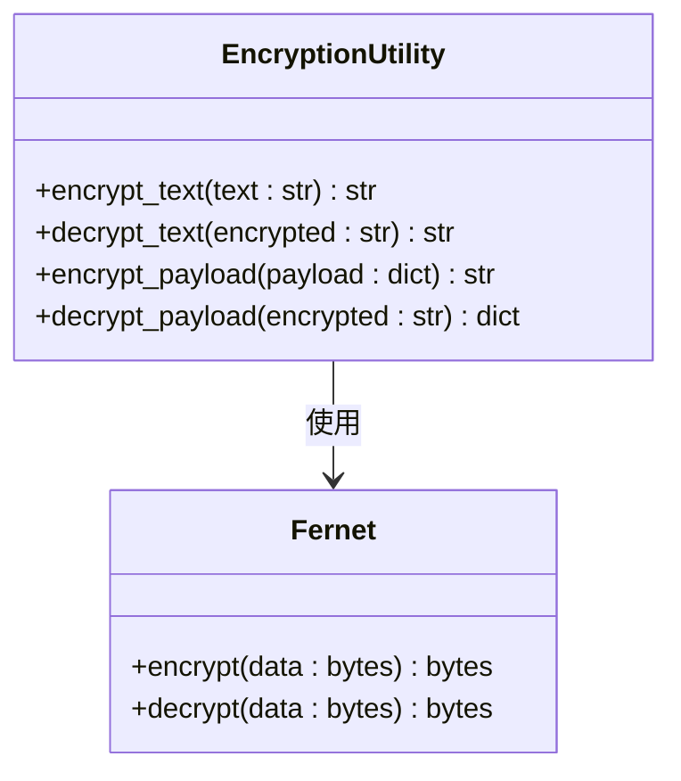

**图表来源**
- [token_manager.py](file://enterprise/server/auth/token_manager.py#L47-L75)

### 数据库存储结构

| 字段名 | 类型 | 描述 | 约束 |
|--------|------|------|------|
| id | UUID | 主键标识 | PRIMARY KEY |
| keycloak_user_id | VARCHAR | Keycloak用户ID | NOT NULL |
| identity_provider | VARCHAR | 身份提供商 | NOT NULL |
| access_token | TEXT | 加密的访问令牌 | NOT NULL |
| refresh_token | TEXT | 加密的刷新令牌 | NOT NULL |
| access_token_expires_at | INTEGER | 访问令牌过期时间 | NOT NULL |
| refresh_token_expires_at | INTEGER | 刷新令牌过期时间 | NOT NULL |

**段落来源**
- [auth_token_store.py](file://enterprise/storage/auth_token_store.py#L51-L68)

## 安全传输机制

### Cookie安全配置

系统采用多层安全措施保护认证Cookie：

| 安全属性 | 配置值 | 作用 |
|----------|--------|------|
| HttpOnly | True | 防止JavaScript访问 |
| Secure | True/False | 仅HTTPS传输 |
| SameSite | Strict/Lax | 防止CSRF攻击 |
| Domain | 动态计算 | 限制域名范围 |

### 传输层安全

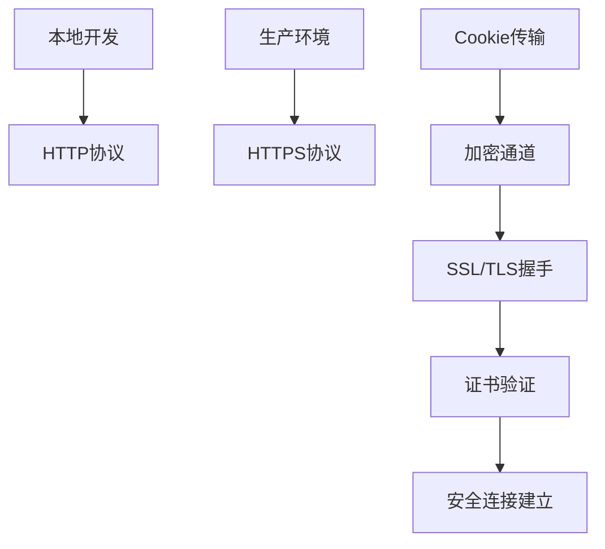

**图表来源**
- [auth.py](file://enterprise/server/routes/auth.py#L43-L78)

**段落来源**
- [auth.py](file://enterprise/server/routes/auth.py#L43-L78)

## 前端认证流程

### 认证URL生成

前端通过generateAuthUrl函数构建OAuth认证URL：

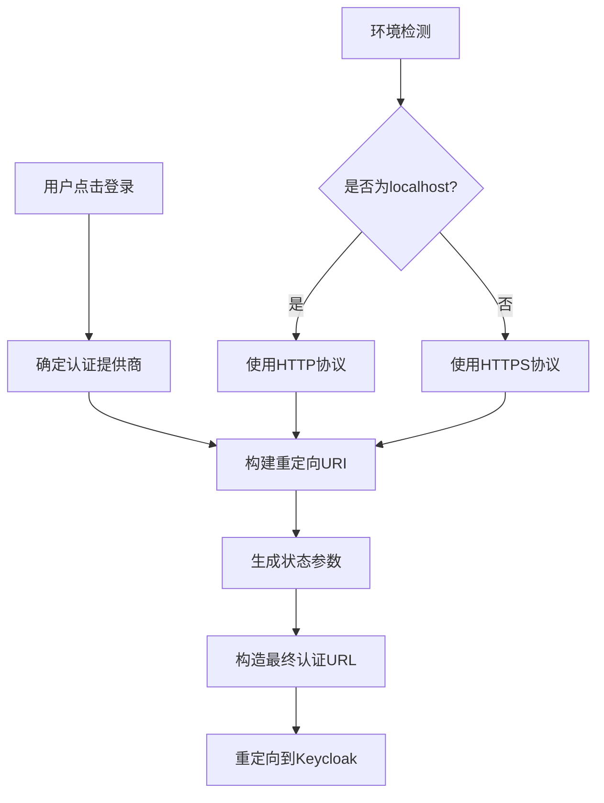

**图表来源**
- [generate-auth-url.ts](file://frontend/src/utils/generate-auth-url.ts#L1-L45)

### 前端代码示例

以下是前端发起认证请求的关键代码路径：

**段落来源**
- [generate-auth-url.ts](file://frontend/src/utils/generate-auth-url.ts#L1-L45)

## 错误处理与重试机制

### 异常处理策略

系统实现了多层次的错误处理机制：

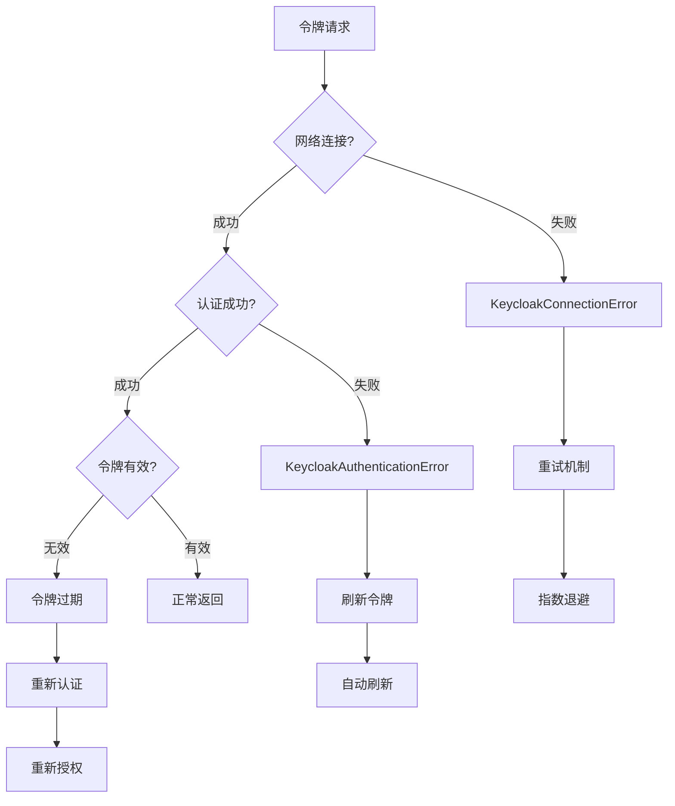

**图表来源**
- [token_manager.py](file://enterprise/server/auth/token_manager.py#L147-L151)
- [token_manager.py](file://enterprise/server/auth/token_manager.py#L245-L249)

### 重试配置

| 指标 | 值 | 说明 |
|------|-----|------|
| 最大重试次数 | 2次 | 防止无限重试 |
| 重试条件 | KeycloakConnectionError | 网络连接异常 |
| 退避策略 | 默认 | 指数退避算法 |

**段落来源**
- [token_manager.py](file://enterprise/server/auth/token_manager.py#L147-L151)

## 最佳实践与安全建议

### 令牌管理最佳实践

1. **令牌轮换策略**
   - 访问令牌有效期：4小时
   - 刷新令牌有效期：长期有效
   - 自动刷新机制：基于过期时间

2. **安全存储**
   - 所有令牌加密存储
   - 敏感信息不记录日志
   - 定期清理过期令牌

3. **传输安全**
   - HTTPS强制使用
   - Cookie安全标志
   - CSRF防护

### 监控与审计

系统提供了完整的审计跟踪：

| 监控指标 | 实现方式 | 用途 |
|----------|----------|------|
| 登录事件 | PostHog集成 | 用户行为分析 |
| 令牌刷新 | 日志记录 | 安全监控 |
| 认证失败 | 异常捕获 | 攻击检测 |
| 性能指标 | 中间件统计 | 系统优化 |

**段落来源**
- [auth.py](file://enterprise/server/routes/auth.py#L172-L204)

### 故障恢复机制

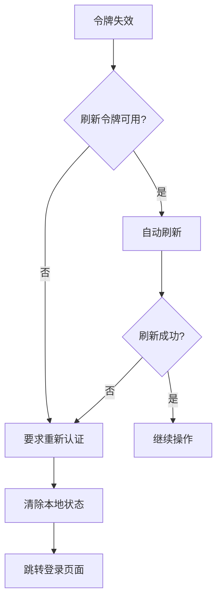

**图表来源**
- [token_manager.py](file://enterprise/server/auth/token_manager.py#L289-L322)

## 结论

OpenHands系统的令牌生成机制提供了完整的OAuth 2.0实现，具备以下特点：

1. **安全性**：采用JWT签名、Fernet加密和HTTPS传输
2. **可靠性**：完善的错误处理和重试机制
3. **可扩展性**：支持多种身份提供商和令牌类型
4. **合规性**：符合OAuth 2.0和OpenID Connect标准

该系统为现代Web应用提供了企业级的身份认证和令牌管理解决方案，确保用户数据的安全性和系统的稳定性。