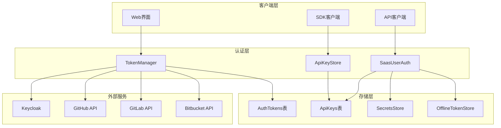
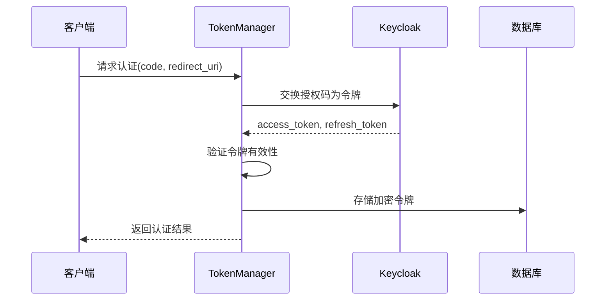
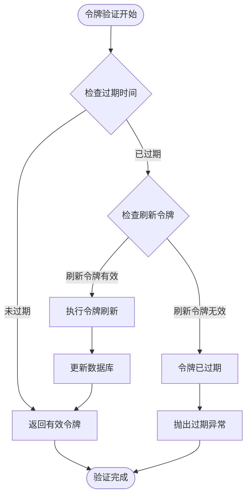
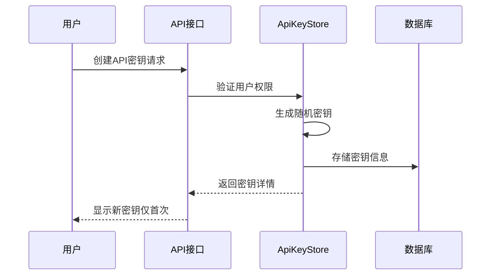
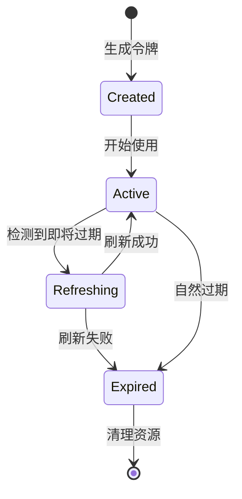
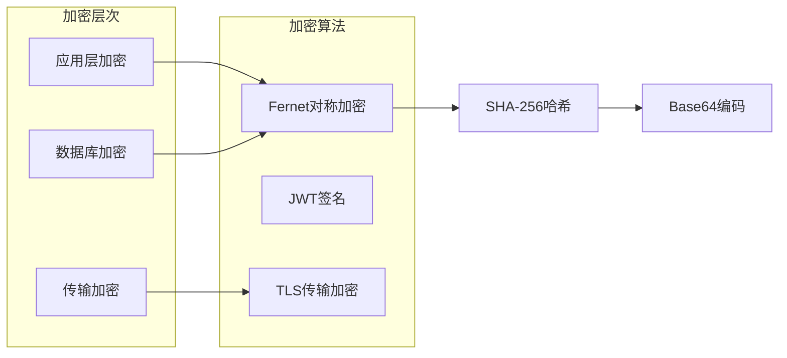
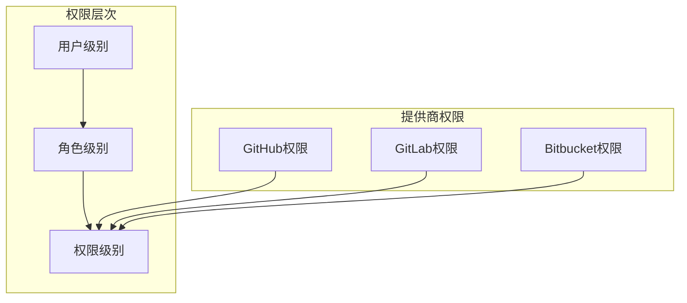
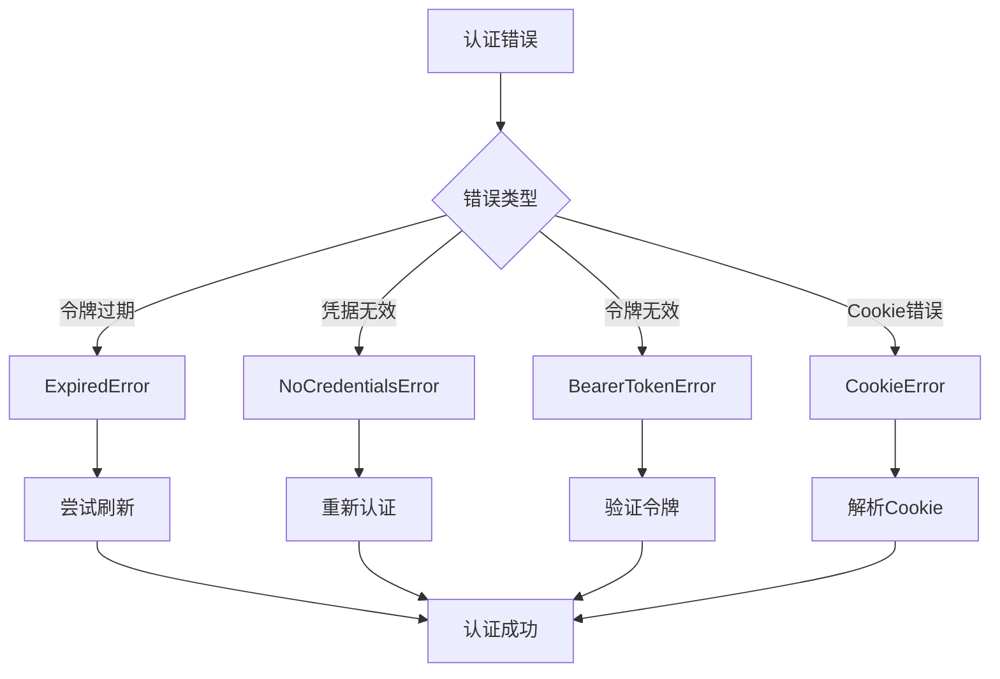

# 令牌管理系统

<cite>
**本文档中引用的文件**
- [token_manager.py](file://enterprise/server/auth/token_manager.py)
- [saas_user_auth.py](file://enterprise/server/auth/saas_user_auth.py)
- [api_key_store.py](file://enterprise/storage/api_key_store.py)
- [api_keys.py](file://enterprise/server/routes/api_keys.py)
- [auth_tokens.py](file://enterprise/storage/auth_tokens.py)
- [api_key.py](file://enterprise/storage/api_key.py)
- [constants.py](file://enterprise/server/auth/constants.py)
- [auth_tokens.py](file://enterprise/storage/auth_tokens.py)
- [saas_secrets_store.py](file://enterprise/storage/saas_secrets_store.py)
- [saas_settings_store.py](file://enterprise/storage/saas_settings_store.py)
</cite>

## 目录
1. [简介](#简介)
2. [系统架构概览](#系统架构概览)
3. [JWT令牌管理](#jwt令牌管理)
4. [API密钥管理](#api密钥管理)
5. [令牌生命周期管理](#令牌生命周期管理)
6. [安全存储机制](#安全存储机制)
7. [权限范围与访问控制](#权限范围与访问控制)
8. [错误处理与故障排除](#错误处理与故障排除)
9. [最佳实践建议](#最佳实践建议)
10. [总结](#总结)

## 简介

OpenHands令牌管理系统是一个企业级的身份认证和授权解决方案，提供了完整的JWT令牌、API密钥和第三方服务令牌的管理功能。该系统支持多种身份提供商（GitHub、GitLab、Bitbucket等），实现了安全的令牌生成、验证、刷新和撤销机制。

### 核心特性

- **多身份提供商支持**：集成GitHub、GitLab、Bitbucket等主流平台
- **双重令牌机制**：支持访问令牌和刷新令牌的完整生命周期管理
- **安全加密存储**：采用Fernet对称加密算法保护敏感令牌数据
- **灵活的API密钥管理**：支持用户自定义名称、过期时间和权限控制
- **实时令牌刷新**：自动检测令牌过期并执行透明刷新
- **细粒度权限控制**：基于角色和资源的访问权限管理

## 系统架构概览

**图表来源**
- [token_manager.py](file://enterprise/server/auth/token_manager.py#L78-L87)
- [saas_user_auth.py](file://enterprise/server/auth/saas_user_auth.py#L43-L57)
- [api_key_store.py](file://enterprise/storage/api_key_store.py#L16-L19)

## JWT令牌管理

### 令牌结构与生成

JWT令牌在系统中扮演核心认证角色，包含用户身份信息和权限声明：

**图表来源**
- [token_manager.py](file://enterprise/server/auth/token_manager.py#L89-L111)

### 令牌验证机制

系统实现了多层次的令牌验证策略：

1. **签名验证**：使用HS256算法验证JWT签名
2. **过期时间检查**：自动检测令牌是否过期
3. **用户身份验证**：确认令牌与当前用户匹配
4. **权限范围验证**：检查令牌包含的权限范围

### 刷新机制

**图表来源**
- [token_manager.py](file://enterprise/server/auth/token_manager.py#L289-L322)

**章节来源**
- [token_manager.py](file://enterprise/server/auth/token_manager.py#L289-L322)
- [saas_user_auth.py](file://enterprise/server/auth/saas_user_auth.py#L131-L140)

## API密钥管理

### API密钥创建流程

API密钥为程序化访问提供安全的替代方案：

**图表来源**
- [api_keys.py](file://enterprise/server/routes/api_keys.py#L181-L204)
- [api_key_store.py](file://enterprise/storage/api_key_store.py#L25-L47)

### 密钥验证与使用

API密钥验证过程确保安全性和审计追踪：

| 验证步骤 | 描述 | 安全措施 |
|---------|------|----------|
| 格式检查 | 验证密钥格式和长度 | 防止恶意输入 |
| 存在性验证 | 检查密钥是否存在于数据库 | 防止无效密钥 |
| 过期检查 | 验证密钥是否已过期 | 自动失效机制 |
| 使用记录 | 更新最后使用时间戳 | 审计和监控 |
| 权限验证 | 检查用户权限 | 基于角色的访问控制 |

### 密钥轮换策略

系统支持主动和被动两种密钥轮换方式：

- **主动轮换**：用户定期手动更换密钥
- **被动轮换**：基于使用频率和安全事件触发
- **批量操作**：支持一次性重置多个密钥

**章节来源**
- [api_keys.py](file://enterprise/server/routes/api_keys.py#L181-L204)
- [api_key_store.py](file://enterprise/storage/api_key_store.py#L49-L72)

## 令牌生命周期管理

### 访问令牌生命周期

访问令牌具有较短的有效期，确保安全性：

**图表来源**
- [token_manager.py](file://enterprise/server/auth/token_manager.py#L296-L308)

### 刷新令牌管理

刷新令牌具有较长有效期，用于获取新的访问令牌：

- **默认有效期**：7天（可配置）
- **自动刷新**：访问令牌过期前自动刷新
- **安全存储**：使用Fernet加密存储
- **失效处理**：刷新令牌过期时需要重新认证

### 过期策略配置

| 令牌类型 | 默认有效期 | 刷新阈值 | 最大刷新次数 |
|---------|-----------|----------|-------------|
| 访问令牌 | 1小时 | 4小时提前 | 无限制 |
| 刷新令牌 | 7天 | 0秒（立即） | 无限制 |
| API密钥 | 可配置 | 无 | 可配置 |
| 离线令牌 | 30天 | 无 | 可配置 |

**章节来源**
- [token_manager.py](file://enterprise/server/auth/token_manager.py#L296-L322)
- [auth_tokens.py](file://enterprise/storage/auth_tokens.py#L12-L17)

## 安全存储机制

### 加密算法选择

系统采用多层加密保护敏感数据：

**图表来源**
- [token_manager.py](file://enterprise/server/auth/token_manager.py#L47-L75)

### 密钥管理

系统使用统一的密钥管理策略：

- **密钥生成**：基于JWT密钥派生Fernet密钥
- **密钥轮换**：通过配置文件更新主密钥
- **密钥分发**：所有组件共享同一密钥
- **密钥备份**：定期备份加密密钥

### 敏感数据保护

| 数据类型 | 加密算法 | 存储位置 | 访问控制 |
|---------|----------|----------|----------|
| 访问令牌 | Fernet | 数据库字段 | 用户隔离 |
| 刷新令牌 | Fernet | 数据库字段 | 用户隔离 |
| API密钥 | 不加密（哈希存储） | 数据库字段 | 用户隔离 |
| 用户凭据 | Fernet | 密钥存储 | 管理员访问 |

**章节来源**
- [token_manager.py](file://enterprise/server/auth/token_manager.py#L47-L75)
- [saas_secrets_store.py](file://enterprise/storage/saas_secrets_store.py#L113-L118)

## 权限范围与访问控制

### 身份提供商权限

系统支持不同身份提供商的权限映射：

**图表来源**
- [token_manager.py](file://enterprise/server/auth/token_manager.py#L190-L243)

### API密钥权限控制

API密钥支持细粒度的权限控制：

- **读取权限**：只读访问资源
- **写入权限**：修改和创建资源
- **管理权限**：完全访问和管理权限
- **自定义权限**：基于业务需求的权限组合

### 访问控制矩阵

| 操作类型 | API密钥 | JWT令牌 | 离线令牌 | 管理员令牌 |
|---------|---------|---------|----------|-----------|
| 用户认证 | ✅ | ✅ | ✅ | ✅ |
| 资源访问 | ✅ | ✅ | ✅ | ✅ |
| 设置修改 | ❌ | ✅ | ✅ | ✅ |
| 用户管理 | ❌ | ❌ | ❌ | ✅ |
| 系统配置 | ❌ | ❌ | ❌ | ✅ |

**章节来源**
- [saas_user_auth.py](file://enterprise/server/auth/saas_user_auth.py#L142-L195)

## 错误处理与故障排除

### 常见错误类型

系统定义了完整的错误处理机制：

**图表来源**
- [saas_user_auth.py](file://enterprise/server/auth/saas_user_auth.py#L9-L15)

### 故障排除指南

| 错误症状 | 可能原因 | 解决方案 |
|---------|----------|----------|
| 令牌过期 | 访问令牌自然过期 | 系统自动刷新 |
| 刷新失败 | 刷新令牌无效 | 重新登录 |
| API密钥无效 | 密钥被删除或过期 | 生成新密钥 |
| 权限不足 | 用户权限不够 | 检查用户角色 |
| 连接超时 | 网络问题或服务不可用 | 检查网络和服务状态 |

### 监控与日志

系统提供详细的监控和日志功能：

- **认证日志**：记录所有认证尝试
- **令牌活动**：跟踪令牌使用情况
- **错误统计**：分析常见错误模式
- **性能指标**：监控认证响应时间

**章节来源**
- [saas_user_auth.py](file://enterprise/server/auth/saas_user_auth.py#L9-L15)
- [token_manager.py](file://enterprise/server/auth/token_manager.py#L664-L671)

## 最佳实践建议

### 令牌安全配置

1. **密钥强度**：
   - 使用至少32字节的随机密钥
   - 定期轮换JWT密钥
   - 保护密钥存储环境

2. **令牌策略**：
   - 设置合理的过期时间
   - 实施自动刷新机制
   - 监控异常使用模式

3. **存储安全**：
   - 使用强加密算法
   - 实施访问控制
   - 定期备份和测试恢复

### API密钥管理

1. **密钥生成**：
   - 使用密码学安全的随机数生成器
   - 设置适当的密钥长度
   - 避免使用可预测的命名模式

2. **密钥轮换**：
   - 建立定期轮换策略
   - 提供自动化轮换工具
   - 确保向后兼容性

3. **使用监控**：
   - 记录密钥使用情况
   - 设置异常使用警报
   - 定期审查密钥权限

### 性能优化

1. **缓存策略**：
   - 缓存频繁访问的令牌
   - 实施智能缓存失效
   - 监控缓存命中率

2. **并发处理**：
   - 使用连接池管理数据库连接
   - 实施请求限流
   - 优化数据库查询

3. **扩展性考虑**：
   - 支持水平扩展
   - 实施负载均衡
   - 监控系统资源使用

## 总结

OpenHands令牌管理系统提供了企业级的安全认证和授权解决方案。通过JWT令牌、API密钥和第三方服务令牌的综合管理，系统实现了：

- **全面的身份认证**：支持多种身份提供商和认证方式
- **安全的令牌管理**：采用先进的加密技术和安全存储
- **灵活的权限控制**：基于角色和资源的细粒度访问控制
- **可靠的生命周期管理**：自动化的令牌生成、刷新和撤销
- **完善的监控体系**：实时监控和故障诊断能力

该系统的设计遵循了现代安全最佳实践，为OpenHands平台提供了坚实的身份认证基础。通过持续的监控、维护和优化，系统能够适应不断变化的安全需求和业务场景。