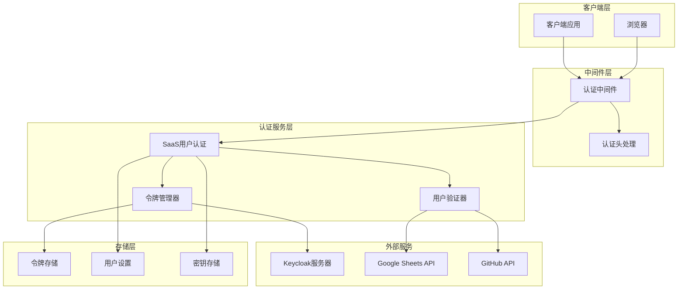
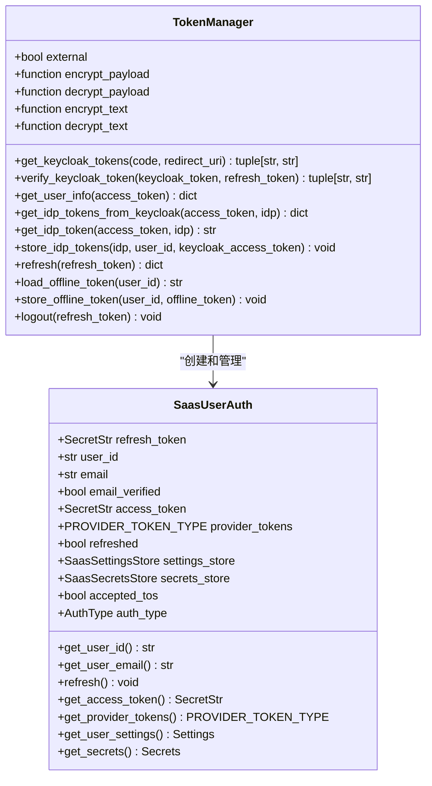
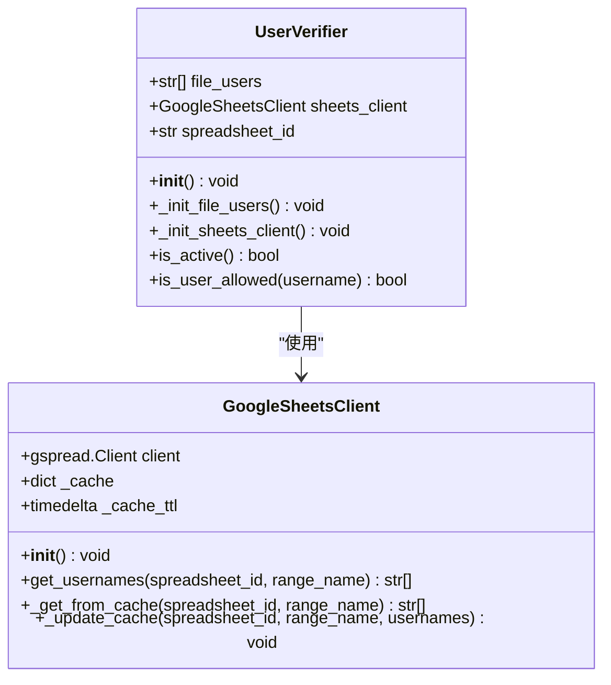
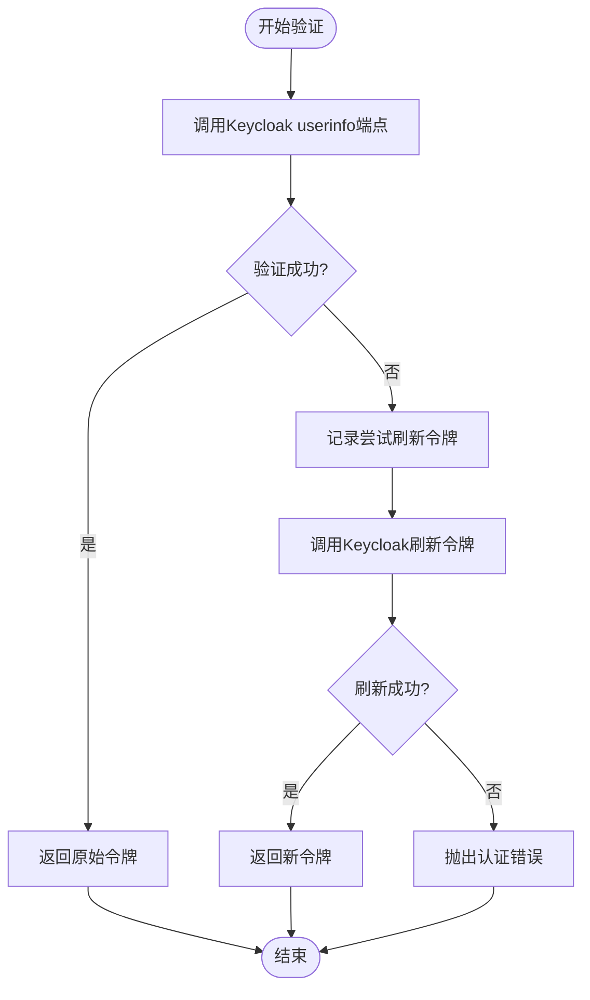
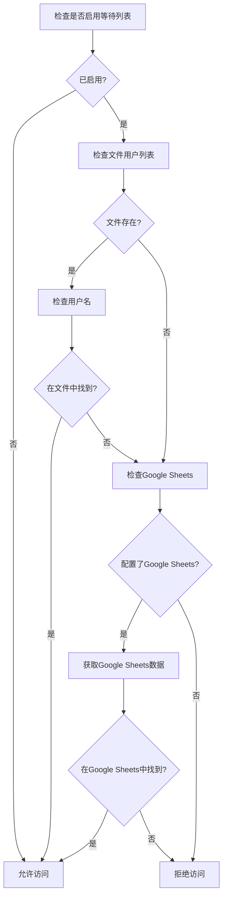
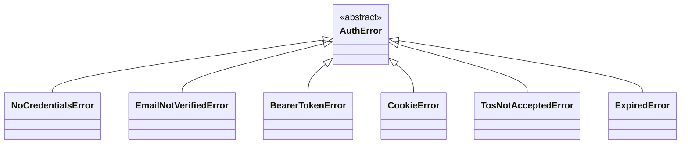
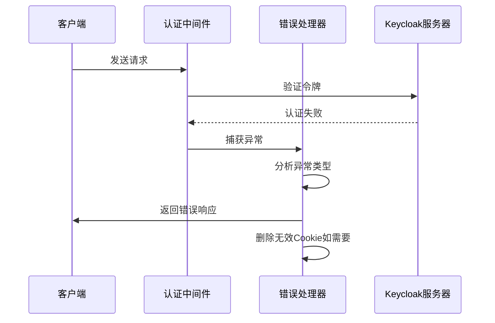
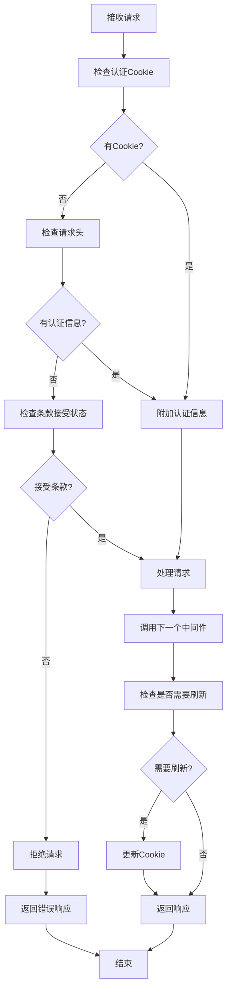

# 令牌验证系统

<cite>
**本文档中引用的文件**
- [token_manager.py](file://enterprise/server/auth/token_manager.py)
- [auth_utils.py](file://enterprise/server/auth/auth_utils.py)
- [github_utils.py](file://enterprise/server/auth/github_utils.py)
- [sheets_client.py](file://enterprise/server/auth/sheets_client.py)
- [middleware.py](file://enterprise/server/middleware.py)
- [saas_user_auth.py](file://enterprise/server/auth/saas_user_auth.py)
- [auth_error.py](file://enterprise/server/auth/auth_error.py)
- [user.py](file://enterprise/server/routes/user.py)
- [auth.py](file://enterprise/server/routes/auth.py)
</cite>

## 目录
1. [简介](#简介)
2. [系统架构概览](#系统架构概览)
3. [核心组件分析](#核心组件分析)
4. [verify_keycloak_token方法详解](#verify_keycloak_token方法详解)
5. [UserVerifier类与访问控制](#userverifier类与访问控制)
6. [异常处理机制](#异常处理机制)
7. [认证中间件流程](#认证中间件流程)
8. [性能考虑](#性能考虑)
9. [故障排除指南](#故障排除指南)
10. [总结](#总结)

## 简介

OpenHands企业版的令牌验证系统是一个复杂而强大的认证框架，负责管理用户身份验证、令牌刷新和访问控制。该系统主要围绕Keycloak身份提供商构建，支持多种认证方式，包括Cookie认证、Bearer令牌认证和API密钥认证。

系统的核心功能包括：
- 通过Keycloak的userinfo端点验证访问令牌的有效性
- 在令牌过期时自动使用刷新令牌获取新的访问令牌
- 结合文件和Google Sheets实现用户访问控制列表
- 验证GitHub用户名的权限
- 提供完善的异常处理机制

## 系统架构概览

**图表来源**
- [middleware.py](file://enterprise/server/middleware.py#L26-L175)
- [saas_user_auth.py](file://enterprise/server/auth/saas_user_auth.py#L43-L324)
- [token_manager.py](file://enterprise/server/auth/token_manager.py#L78-L672)

## 核心组件分析

### TokenManager类

TokenManager是整个令牌验证系统的核心组件，负责管理与Keycloak的交互和令牌的生命周期。

**图表来源**
- [token_manager.py](file://enterprise/server/auth/token_manager.py#L78-L672)
- [saas_user_auth.py](file://enterprise/server/auth/saas_user_auth.py#L43-L324)

**章节来源**
- [token_manager.py](file://enterprise/server/auth/token_manager.py#L78-L672)
- [saas_user_auth.py](file://enterprise/server/auth/saas_user_auth.py#L43-L324)

### UserVerifier类

UserVerifier类实现了基于文件和Google Sheets的用户访问控制系统。

**图表来源**
- [auth_utils.py](file://enterprise/server/auth/auth_utils.py#L8-L80)
- [github_utils.py](file://enterprise/server/auth/github_utils.py#L11-L82)
- [sheets_client.py](file://enterprise/server/auth/sheets_client.py#L10-L112)

**章节来源**
- [auth_utils.py](file://enterprise/server/auth/auth_utils.py#L8-L80)
- [github_utils.py](file://enterprise/server/auth/github_utils.py#L11-L82)
- [sheets_client.py](file://enterprise/server/auth/sheets_client.py#L10-L112)

## verify_keycloak_token方法详解

verify_keycloak_token方法是令牌验证系统的核心功能，负责验证Keycloak访问令牌的有效性并在必要时刷新令牌。

### 方法工作流程

**图表来源**
- [token_manager.py](file://enterprise/server/auth/token_manager.py#L113-L128)

### 详细实现逻辑

verify_keycloak_token方法的实现包含以下关键步骤：

1. **令牌验证阶段**：直接调用Keycloak的userinfo端点验证访问令牌
2. **异常捕获**：捕获KeycloakAuthenticationError异常
3. **令牌刷新**：使用刷新令牌获取新的访问令牌
4. **日志记录**：记录验证和刷新过程的关键信息

该方法利用Keycloak提供的异步接口，确保验证过程不会阻塞主线程。当访问令牌过期时，系统会自动使用刷新令牌获取新的访问令牌，这个过程对客户端完全透明。

**章节来源**
- [token_manager.py](file://enterprise/server/auth/token_manager.py#L113-L128)

## UserVerifier类与访问控制

### 访问控制机制

UserVerifier类提供了双重的用户访问控制机制：

#### 文件访问控制
通过配置环境变量`GITHUB_USER_LIST_FILE`指定包含允许用户的文本文件路径。文件中的每个用户名都会被转换为小写进行比较。

#### Google Sheets访问控制
通过配置环境变量`GITHUB_USERS_SHEET_ID`启用Google Sheets集成。系统会从指定的Google Sheet中获取用户名列表，并使用缓存机制提高性能。

**图表来源**
- [auth_utils.py](file://enterprise/server/auth/auth_utils.py#L51-L79)
- [github_utils.py](file://enterprise/server/auth/github_utils.py#L54-L79)

### is_user_allowed方法

is_user_allowed方法实现了具体的权限验证逻辑：

1. **状态检查**：首先检查等待列表是否启用
2. **文件检查**：如果配置了文件用户列表，则检查用户名是否在其中
3. **Google Sheets检查**：如果配置了Google Sheets，则获取最新数据并检查用户名
4. **结果返回**：只有当用户名在任一列表中时才允许访问

**章节来源**
- [auth_utils.py](file://enterprise/server/auth/auth_utils.py#L57-L79)
- [github_utils.py](file://enterprise/server/auth/github_utils.py#L60-L79)

## 异常处理机制

### 异常层次结构

**图表来源**
- [auth_error.py](file://enterprise/server/auth/auth_error.py#L1-L40)

### 异常处理策略

#### 认证错误处理
- **NoCredentialsError**：未提供认证凭据时抛出
- **CookieError**：Cookie解码失败时抛出
- **BearerTokenError**：Bearer令牌无效时抛出
- **ExpiredError**：令牌过期时抛出

#### 连接错误处理
- **KeycloakConnectionError**：Keycloak连接失败时重试
- **HTTPStatusError**：HTTP状态错误时处理
- **APIError**：Google Sheets API错误时处理

#### 中间件异常处理流程

**图表来源**
- [middleware.py](file://enterprise/server/middleware.py#L69-L97)

**章节来源**
- [auth_error.py](file://enterprise/server/auth/auth_error.py#L1-L40)
- [middleware.py](file://enterprise/server/middleware.py#L69-L97)

## 认证中间件流程

### 中间件执行流程

认证中间件是整个认证系统的第一道防线，负责拦截请求并进行初步的身份验证。

**图表来源**
- [middleware.py](file://enterprise/server/middleware.py#L32-L97)

### 关键处理逻辑

1. **Cookie验证**：检查是否存在有效的认证Cookie
2. **头部验证**：检查Authorization头或X-Session-API-Key
3. **TOS检查**：验证用户是否接受了服务条款
4. **令牌刷新**：如果令牌即将过期，自动刷新
5. **错误处理**：统一处理各种认证异常

**章节来源**
- [middleware.py](file://enterprise/server/middleware.py#L32-L97)

## 性能考虑

### 缓存策略

系统采用了多层缓存策略来优化性能：

1. **Google Sheets缓存**：Google Sheets客户端使用15秒TTL的内存缓存
2. **令牌缓存**：令牌管理器缓存解析后的令牌信息
3. **用户信息缓存**：用户认证信息在会话期间缓存

### 异步处理

所有网络操作都采用异步模式，避免阻塞主线程：
- Keycloak API调用使用异步HTTP客户端
- Google Sheets API调用使用异步模式
- 数据库操作使用异步ORM

### 重试机制

对于关键操作，系统实现了智能重试机制：
- Keycloak连接错误重试最多2次
- 令牌刷新操作重试最多3次
- 指数退避策略减少服务器负载

## 故障排除指南

### 常见问题及解决方案

#### 令牌验证失败
**症状**：用户收到401未授权错误
**可能原因**：
- 访问令牌已过期
- 刷新令牌无效
- Keycloak服务器不可达

**解决步骤**：
1. 检查Keycloak服务器状态
2. 验证令牌格式和签名
3. 尝试重新登录获取新令牌

#### Google Sheets访问失败
**症状**：无法从Google Sheets获取用户列表
**可能原因**：
- Google Sheets API凭证无效
- 网络连接问题
- 权限不足

**解决步骤**：
1. 验证Google Cloud项目配置
2. 检查API凭证有效性
3. 确认Google Sheets访问权限

#### 用户权限验证失败
**症状**：合法用户被拒绝访问
**可能原因**：
- 用户名大小写不匹配
- 文件路径配置错误
- Google SheetsID配置错误

**解决步骤**：
1. 检查用户名格式一致性
2. 验证文件路径和权限
3. 确认Google SheetsID正确性

**章节来源**
- [auth_utils.py](file://enterprise/server/auth/auth_utils.py#L26-L38)
- [sheets_client.py](file://enterprise/server/auth/sheets_client.py#L16-L28)

## 总结

OpenHands企业版的令牌验证系统是一个设计精良、功能完备的认证框架。它通过以下特点确保了系统的安全性和可靠性：

1. **多层次验证**：结合多种认证方式和访问控制机制
2. **自动化令牌管理**：自动处理令牌刷新和过期问题
3. **灵活的访问控制**：支持文件和云端数据源的用户列表
4. **完善的异常处理**：提供详细的错误信息和恢复机制
5. **高性能设计**：采用异步处理和智能缓存策略

该系统不仅满足了企业级应用的安全需求，还为开发者提供了清晰的扩展点和良好的开发体验。通过合理的架构设计和完善的异常处理机制，确保了系统的稳定性和可维护性。