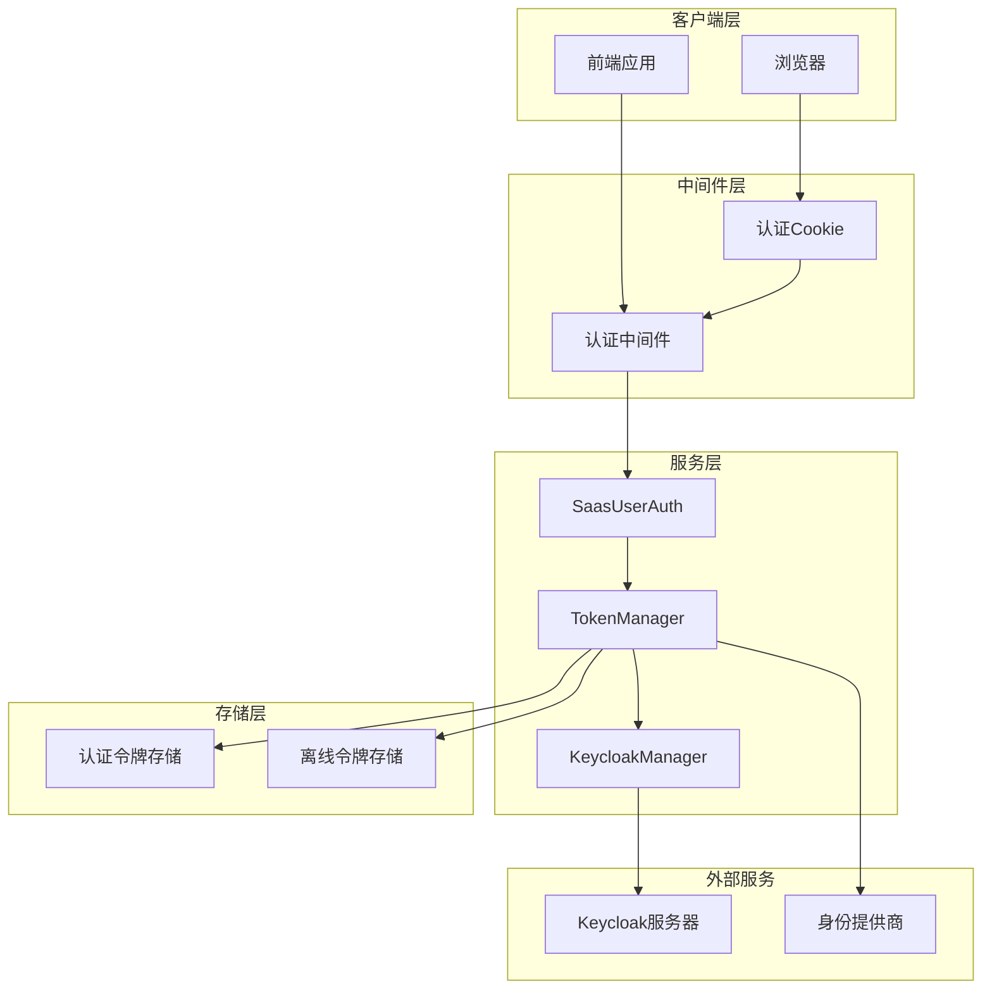
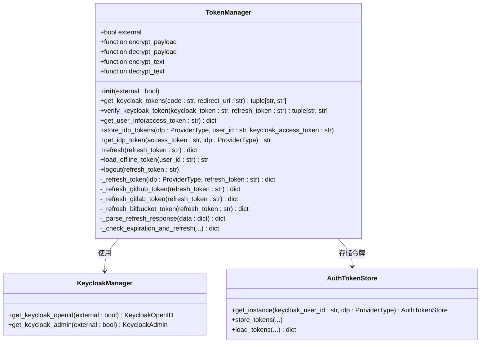
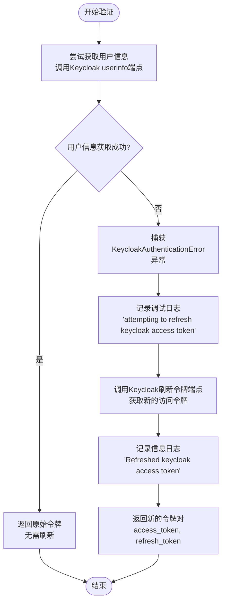
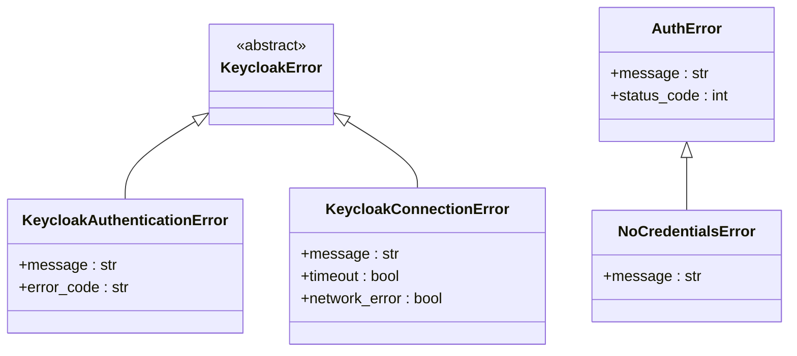
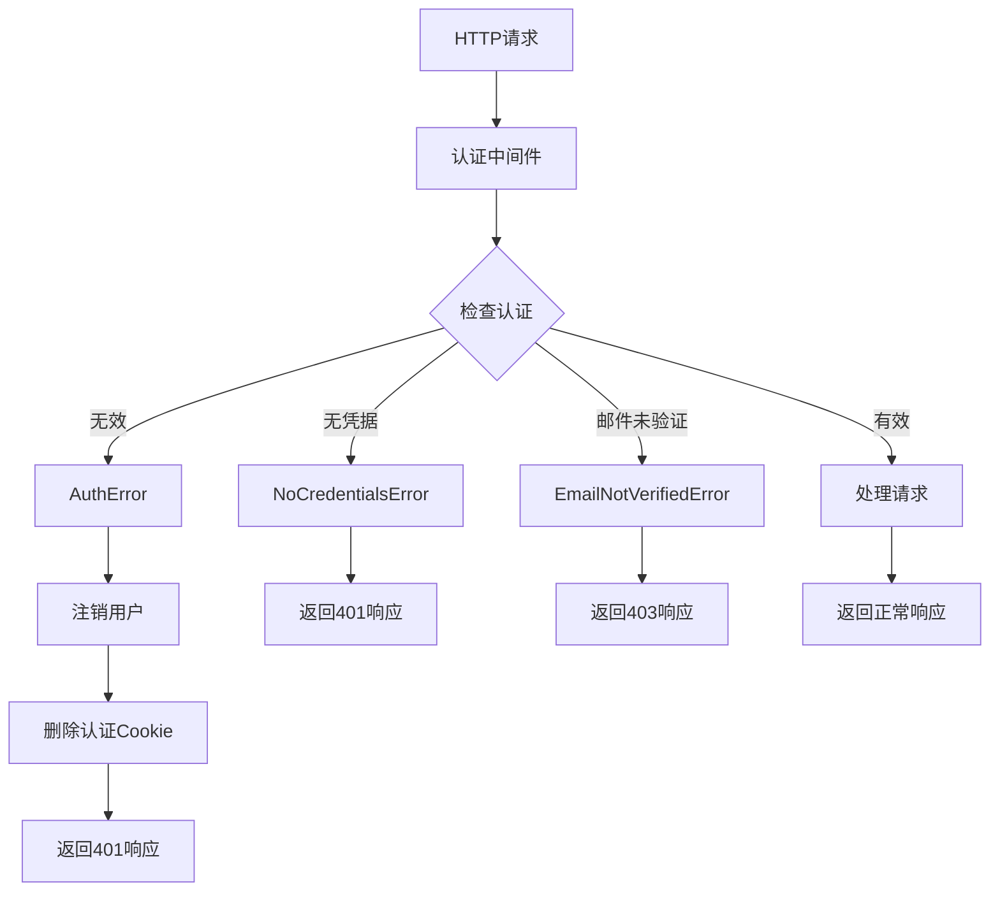
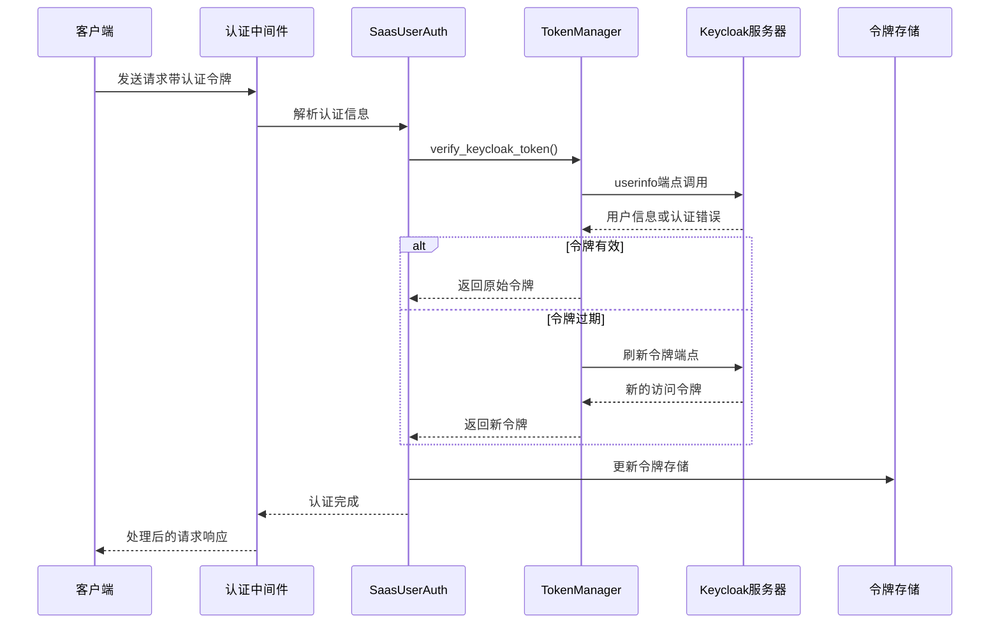
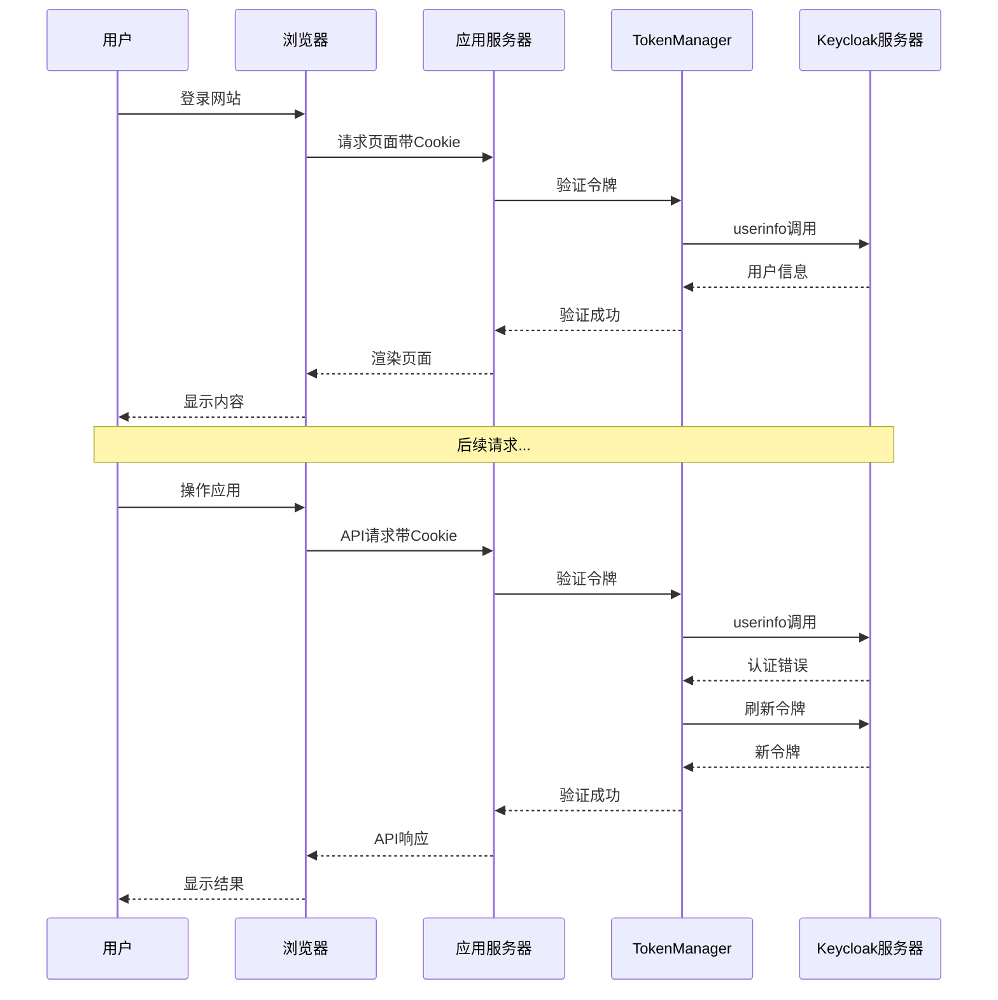
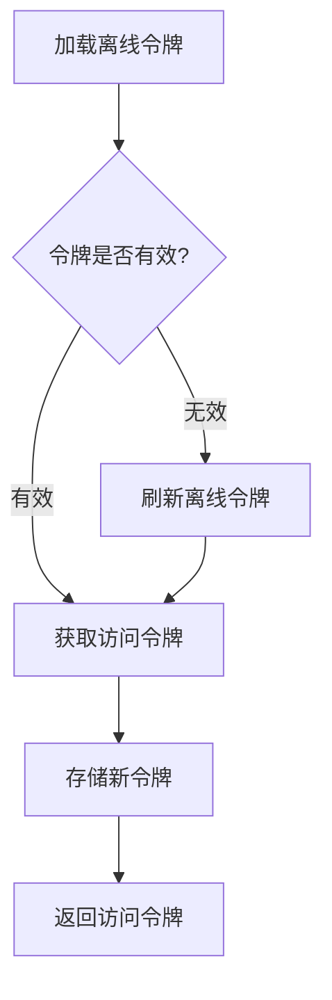
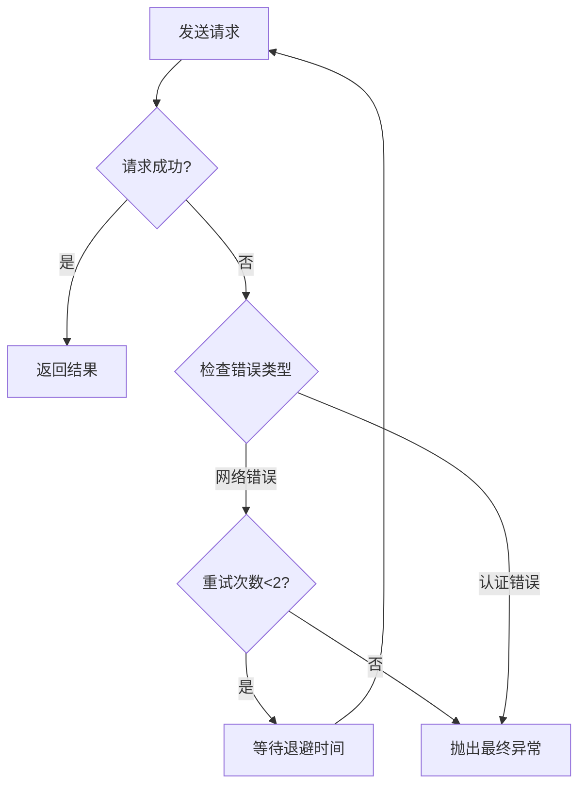

# 令牌验证流程

<cite>
**本文档引用的文件**
- [token_manager.py](file://enterprise/server/auth/token_manager.py)
- [keycloak_manager.py](file://enterprise/server/auth/keycloak_manager.py)
- [saas_user_auth.py](file://enterprise/server/auth/saas_user_auth.py)
- [middleware.py](file://enterprise/server/middleware.py)
- [test_token_manager_extended.py](file://enterprise/tests/unit/test_token_manager_extended.py)
</cite>

## 目录
1. [简介](#简介)
2. [系统架构概览](#系统架构概览)
3. [TokenManager类详解](#tokenmanager类详解)
4. [verify_keycloak_token方法深度解析](#verify_keycloak_token方法深度解析)
5. [异常处理机制](#异常处理机制)
6. [令牌验证流程](#令牌验证流程)
7. [实际应用场景](#实际应用场景)
8. [性能考虑](#性能考虑)
9. [故障排除指南](#故障排除指南)
10. [总结](#总结)

## 简介

OpenHands项目采用基于Keycloak的身份认证系统，通过TokenManager类实现令牌验证和管理功能。verify_keycloak_token方法是整个认证流程的核心组件，负责验证访问令牌的有效性，并在必要时自动刷新令牌以确保用户会话的连续性。

该系统设计遵循OAuth 2.0和OpenID Connect标准，支持多种身份提供商（GitHub、GitLab、Bitbucket等），并提供了完善的异常处理和重试机制。

## 系统架构概览



**图表来源**
- [middleware.py](file://enterprise/server/middleware.py#L26-L175)
- [token_manager.py](file://enterprise/server/auth/token_manager.py#L78-L672)
- [saas_user_auth.py](file://enterprise/server/auth/saas_user_auth.py#L43-L323)

## TokenManager类详解

TokenManager类是OpenHands认证系统的核心组件，负责管理所有与令牌相关的操作。该类提供了完整的令牌生命周期管理功能，包括获取、验证、刷新和存储。

### 类结构概览



**图表来源**
- [token_manager.py](file://enterprise/server/auth/token_manager.py#L78-L672)
- [keycloak_manager.py](file://enterprise/server/auth/keycloak_manager.py#L21-L51)

**章节来源**
- [token_manager.py](file://enterprise/server/auth/token_manager.py#L78-L111)

## verify_keycloak_token方法深度解析

verify_keycloak_token方法是令牌验证流程的核心，它实现了以下关键功能：

### 方法签名和参数

该方法接受两个参数：
- `keycloak_token: str`：当前的访问令牌
- `refresh_token: str`：用于刷新访问令牌的刷新令牌

返回值为包含新访问令牌和刷新令牌的元组。

### 验证流程



**图表来源**
- [token_manager.py](file://enterprise/server/auth/token_manager.py#L113-L128)

### 核心实现逻辑

verify_keycloak_token方法的实现非常简洁但功能强大：

1. **直接验证阶段**：首先尝试通过调用Keycloak的userinfo端点验证访问令牌
2. **异常捕获**：如果userinfo调用失败抛出KeycloakAuthenticationError异常
3. **自动刷新**：捕获异常后自动使用刷新令牌获取新的访问令牌
4. **返回结果**：返回新的令牌对或保持原有令牌不变

**章节来源**
- [token_manager.py](file://enterprise/server/auth/token_manager.py#L113-L128)

## 异常处理机制

OpenHands系统实现了多层次的异常处理机制，确保系统的稳定性和用户体验。

### 主要异常类型



**图表来源**
- [token_manager.py](file://enterprise/server/auth/token_manager.py#L12-L16)
- [middleware.py](file://enterprise/server/middleware.py#L8-L12)

### 异常处理策略

#### KeycloakAuthenticationError处理

当访问令牌无效时，系统会：
1. 记录调试级别日志
2. 自动使用刷新令牌获取新的访问令牌
3. 返回新的令牌对

#### KeycloakConnectionError处理

对于连接相关错误，系统采用重试机制：
1. 使用tenacity库实现指数退避重试
2. 最多重试2次
3. 在每次重试前记录重试尝试次数

#### 中间件异常处理

中间件层提供了更高级别的异常处理：



**图表来源**
- [middleware.py](file://enterprise/server/middleware.py#L69-L97)

**章节来源**
- [token_manager.py](file://enterprise/server/auth/token_manager.py#L119-L128)
- [middleware.py](file://enterprise/server/middleware.py#L69-L97)

## 令牌验证流程

### 完整验证流程



**图表来源**
- [middleware.py](file://enterprise/server/middleware.py#L32-L68)
- [saas_user_auth.py](file://enterprise/server/auth/saas_user_auth.py#L43-L323)
- [token_manager.py](file://enterprise/server/auth/token_manager.py#L113-L128)

### 成功验证场景

当访问令牌有效时，验证流程如下：

1. **中间件拦截**：认证中间件检测到有效的认证Cookie
2. **令牌解码**：提取访问令牌和刷新令牌
3. **直接验证**：verify_keycloak_token方法直接调用userinfo端点
4. **快速返回**：由于令牌有效，直接返回原始令牌对
5. **更新响应**：中间件可能更新认证Cookie（如果令牌已刷新）

### 需要刷新令牌的场景

当访问令牌过期时，验证流程包含额外的刷新步骤：

1. **初始验证失败**：userinfo调用抛出KeycloakAuthenticationError
2. **触发刷新**：系统自动使用刷新令牌获取新令牌
3. **新令牌验证**：使用新令牌重新验证用户身份
4. **持久化更新**：将新令牌对保存到存储中
5. **响应返回**：向客户端返回更新后的认证状态

**章节来源**
- [test_token_manager_extended.py](file://enterprise/tests/unit/test_token_manager_extended.py#L99-L144)

## 实际应用场景

### Web应用认证流程

在典型的Web应用中，令牌验证流程如下：



**图表来源**
- [middleware.py](file://enterprise/server/middleware.py#L32-L68)
- [token_manager.py](file://enterprise/server/auth/token_manager.py#L113-L128)

### API认证流程

对于API调用，认证流程略有不同：

1. **Bearer Token验证**：检查Authorization头中的Bearer令牌
2. **直接令牌验证**：绕过Cookie验证，直接使用令牌
3. **权限检查**：验证用户是否有权访问特定资源
4. **审计记录**：记录API调用的审计信息

### 离线令牌处理

系统还支持离线令牌（Offline Token）的处理：



**图表来源**
- [token_manager.py](file://enterprise/server/auth/token_manager.py#L654-L662)

**章节来源**
- [saas_user_auth.py](file://enterprise/server/auth/saas_user_auth.py#L255-L267)
- [token_manager.py](file://enterprise/server/auth/token_manager.py#L654-L662)

## 性能考虑

### 缓存策略

为了提高性能，系统实现了多层缓存机制：

1. **内存缓存**：Keycloak实例使用单例模式减少重复初始化
2. **令牌缓存**：本地缓存用户信息和令牌状态
3. **连接池**：HTTP客户端使用连接池复用TCP连接

### 异步处理

所有令牌操作都采用异步模式：

- **非阻塞I/O**：使用async/await模式避免线程阻塞
- **并发处理**：多个令牌验证可以并发执行
- **超时控制**：设置合理的网络超时时间

### 重试机制

系统实现了智能重试机制：



**图表来源**
- [token_manager.py](file://enterprise/server/auth/token_manager.py#L43-L45)

**章节来源**
- [token_manager.py](file://enterprise/server/auth/token_manager.py#L21-L30)
- [token_manager.py](file://enterprise/server/auth/token_manager.py#L43-L45)

## 故障排除指南

### 常见问题及解决方案

#### 1. 令牌验证失败

**症状**：用户收到401未授权错误
**原因**：访问令牌过期或无效
**解决方案**：
- 检查令牌是否正确传递
- 验证Keycloak服务器连接
- 查看中间件日志了解具体错误

#### 2. 刷新令牌失效

**症状**：令牌自动刷新失败
**原因**：刷新令牌过期或被撤销
**解决方案**：
- 引导用户重新登录
- 检查Keycloak配置
- 验证客户端凭据

#### 3. 网络连接问题

**症状**：频繁出现连接超时错误
**原因**：网络不稳定或Keycloak服务器不可达
**解决方案**：
- 检查网络连接
- 配置适当的超时时间
- 实施重试机制

### 调试技巧

#### 日志分析

系统提供了详细的日志记录：

```python
# 关键日志点
logger.debug('attempting to refresh keycloak access token')
logger.info('Refreshed keycloak access token')
logger.error('Missing either access or refresh token in response')
```

#### 监控指标

建议监控以下关键指标：
- 令牌验证成功率
- 平均验证延迟
- 刷新令牌使用频率
- 错误率分布

**章节来源**
- [token_manager.py](file://enterprise/server/auth/token_manager.py#L119-L128)
- [middleware.py](file://enterprise/server/middleware.py#L69-L97)

## 总结

OpenHands项目的令牌验证流程是一个设计精良、功能完备的认证系统。verify_keycloak_token方法作为核心组件，实现了以下关键特性：

### 主要优势

1. **自动化令牌管理**：系统能够自动检测令牌过期并进行刷新
2. **健壮的异常处理**：多层次的异常处理确保系统稳定性
3. **高性能设计**：异步处理和缓存机制保证良好的性能
4. **灵活的扩展性**：支持多种身份提供商和认证方式

### 技术亮点

- **OAuth 2.0兼容**：完全遵循标准协议
- **JWT集成**：使用JSON Web Tokens进行安全通信
- **重试机制**：智能的网络错误重试策略
- **审计追踪**：完整的操作日志记录

### 最佳实践建议

1. **定期监控**：建立完善的监控体系
2. **安全配置**：确保HTTPS和适当的密钥管理
3. **性能优化**：根据负载调整缓存和连接池配置
4. **故障准备**：制定详细的故障恢复计划

这个令牌验证系统为OpenHands项目提供了可靠、高效的身份认证基础设施，支撑着整个应用的安全运行。