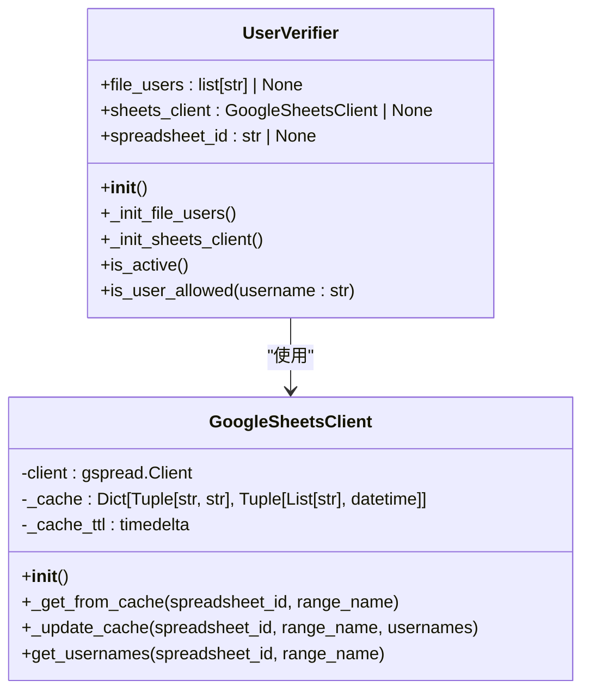
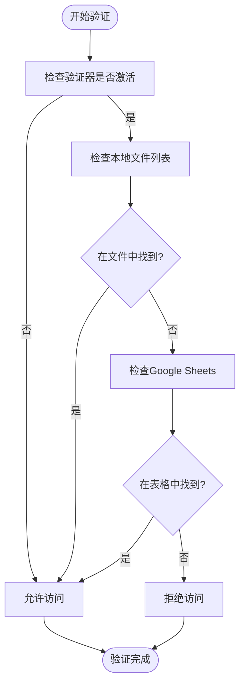
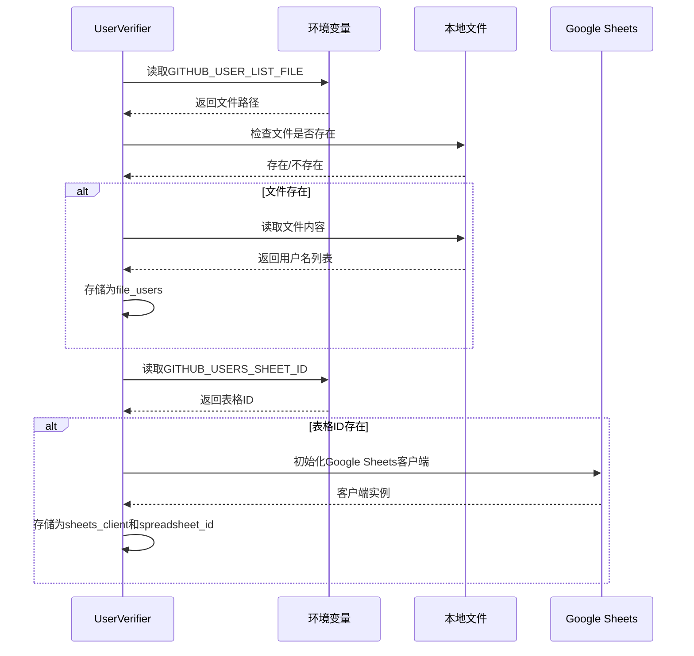
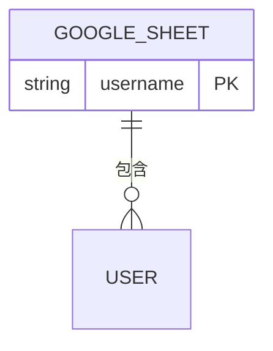

# 用户权限验证

<cite>
**本文档中引用的文件**  
- [github_utils.py](file://enterprise/server/auth/github_utils.py)
- [auth_utils.py](file://enterprise/server/auth/auth_utils.py)
- [sheets_client.py](file://enterprise/server/auth/sheets_client.py)
</cite>

## 目录
1. [介绍](#介绍)
2. [核心组件](#核心组件)
3. [用户验证流程](#用户验证流程)
4. [配置与最佳实践](#配置与最佳实践)
5. [故障排除](#故障排除)
6. [结论](#结论)

## 介绍
用户权限验证系统是OpenHands企业版中的关键安全组件，负责管理用户对系统的访问控制。该系统通过UserVerifier类实现，支持从本地文件和Google Sheets两种来源加载允许的用户列表。系统通过环境变量进行配置，提供了灵活的访问控制机制，可以轻松管理用户访问权限。

**Section sources**
- [github_utils.py](file://enterprise/server/auth/github_utils.py#L1-L126)

## 核心组件

用户权限验证系统由多个核心组件构成，这些组件协同工作以实现完整的用户访问控制功能。主要组件包括UserVerifier类、Google Sheets客户端和相关的辅助函数。

**Diagram sources**
- [github_utils.py](file://enterprise/server/auth/github_utils.py#L11-L78)
- [auth_utils.py](file://enterprise/server/auth/auth_utils.py#L8-L75)
- [sheets_client.py](file://enterprise/server/auth/sheets_client.py#L10-L112)

**Section sources**
- [github_utils.py](file://enterprise/server/auth/github_utils.py#L1-L126)
- [auth_utils.py](file://enterprise/server/auth/auth_utils.py#L1-L80)
- [sheets_client.py](file://enterprise/server/auth/sheets_client.py#L1-L112)

## 用户验证流程

用户验证流程是系统的核心功能，它决定了用户是否具有访问系统的权限。该流程通过is_user_allowed方法实现，支持多种验证方式。

### 验证机制
系统通过UserVerifier类的is_user_allowed方法验证用户权限。该方法首先检查用户是否在本地文件列表中，如果未找到则检查Google Sheets列表。验证过程不区分大小写，确保用户名匹配的灵活性。

**Diagram sources**
- [github_utils.py](file://enterprise/server/auth/github_utils.py#L57-L78)
- [auth_utils.py](file://enterprise/server/auth/auth_utils.py#L57-L76)

### 初始化流程
UserVerifier类在初始化时会自动从环境变量中读取配置，并加载相应的用户数据源。初始化过程包括两个主要步骤：从文件加载用户列表和初始化Google Sheets客户端。

**Diagram sources**
- [github_utils.py](file://enterprise/server/auth/github_utils.py#L19-L20)
- [auth_utils.py](file://enterprise/server/auth/auth_utils.py#L16-L17)

**Section sources**
- [github_utils.py](file://enterprise/server/auth/github_utils.py#L1-L126)
- [auth_utils.py](file://enterprise/server/auth/auth_utils.py#L1-L80)

## 配置与最佳实践

### 环境变量配置
系统通过环境变量进行配置，支持灵活的部署和管理。以下是主要的配置选项：

| 环境变量 | 描述 | 示例 |
|---------|------|------|
| GITHUB_USER_LIST_FILE | 本地用户列表文件路径 | /etc/users/allowlist.txt |
| GITHUB_USERS_SHEET_ID | Google Sheets表格ID | 1aBcDeFgHiJkLmNoPqRsTuVwXyZ |
| DISABLE_WAITLIST | 是否禁用等待列表 | true/false |

**Section sources**
- [github_utils.py](file://enterprise/server/auth/github_utils.py#L24-L25)
- [auth_utils.py](file://enterprise/server/auth/auth_utils.py#L21-L22)

### Google Sheets配置
使用Google Sheets作为用户数据源时，需要正确配置工作表格式。系统默认读取第一张工作表的A列数据作为用户名列表。

**Diagram sources**
- [sheets_client.py](file://enterprise/server/auth/sheets_client.py#L67-L75)

### 最佳实践
1. **安全存储**: 将用户列表文件存储在安全位置，限制文件访问权限
2. **定期更新**: 定期更新用户列表，及时移除不再需要访问权限的用户
3. **备份机制**: 为Google Sheets数据源配置备份机制，防止数据丢失
4. **监控日志**: 监控系统日志，及时发现和处理验证失败的情况

**Section sources**
- [github_utils.py](file://enterprise/server/auth/github_utils.py#L1-L126)
- [auth_utils.py](file://enterprise/server/auth/auth_utils.py#L1-L80)
- [sheets_client.py](file://enterprise/server/auth/sheets_client.py#L1-L112)

## 故障排除

### 常见问题
1. **文件未找到**: 确保GITHUB_USER_LIST_FILE指向的文件存在且路径正确
2. **Google Sheets访问失败**: 检查服务账户权限和网络连接
3. **缓存问题**: Google Sheets客户端有15秒的缓存，数据更新可能有延迟

### 日志分析
系统通过日志记录详细的验证过程，便于故障排查。关键日志信息包括：
- 用户列表加载成功/失败
- Google Sheets客户端初始化状态
- 用户验证结果

**Section sources**
- [github_utils.py](file://enterprise/server/auth/github_utils.py#L36-L38)
- [auth_utils.py](file://enterprise/server/auth/auth_utils.py#L33-L35)
- [sheets_client.py](file://enterprise/server/auth/sheets_client.py#L25-L26)

## 结论
用户权限验证系统通过灵活的配置选项和可靠的验证机制，为OpenHands企业版提供了强大的访问控制功能。系统支持多种数据源，便于集成到不同的部署环境中。通过合理的配置和管理，可以有效保障系统的安全性。