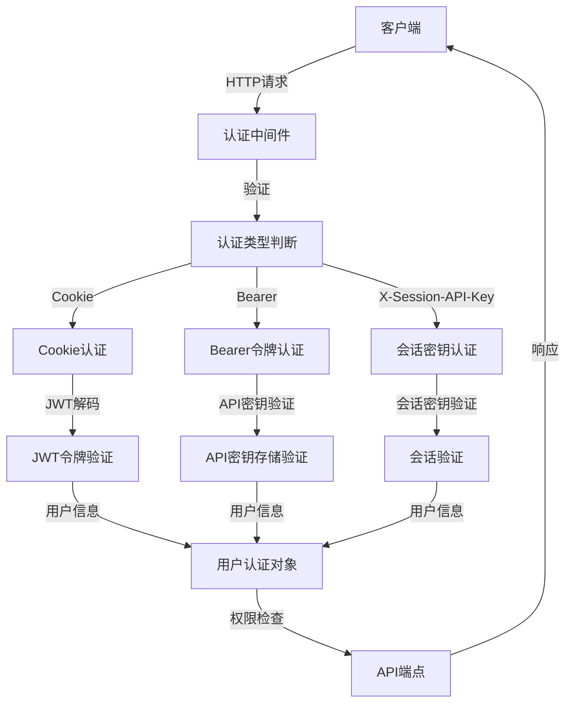
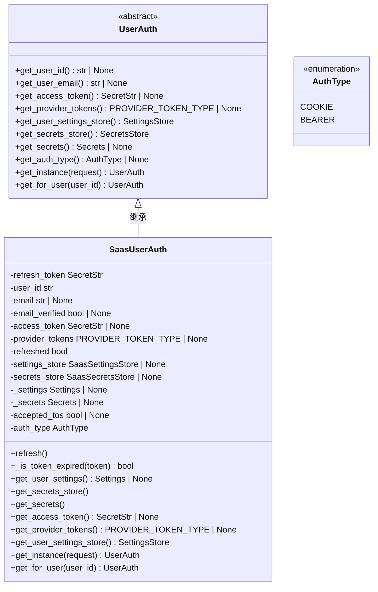
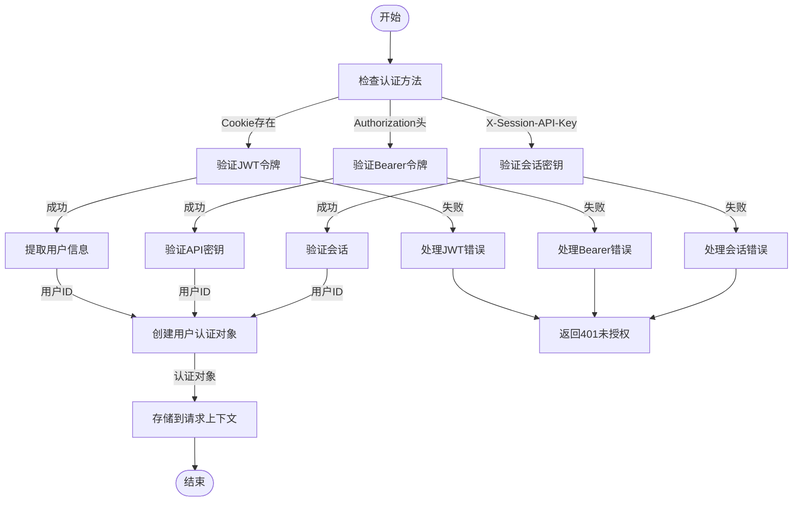
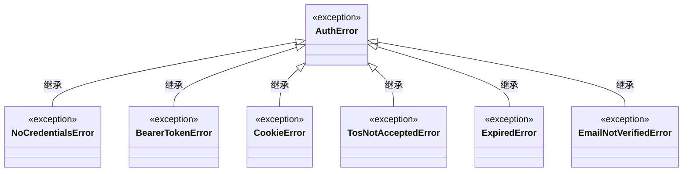
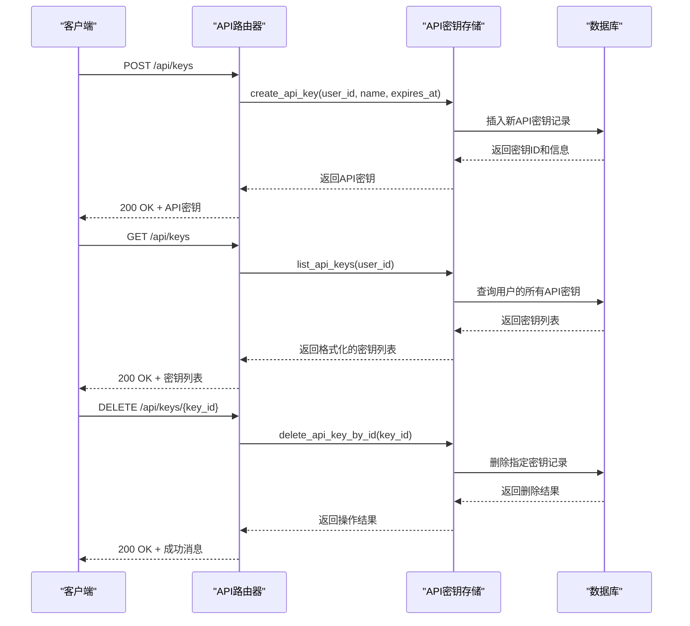
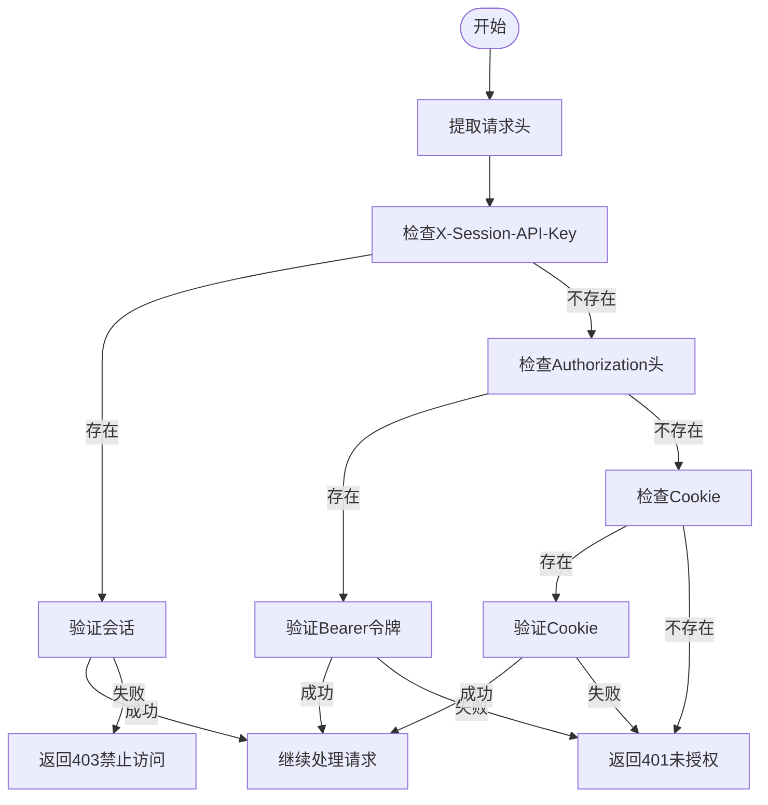
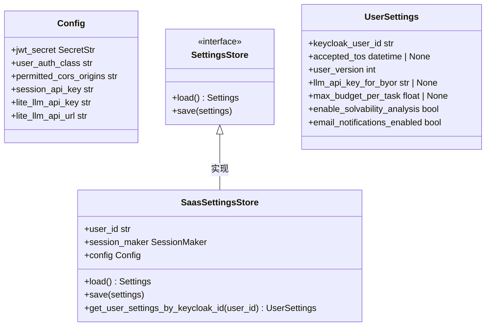
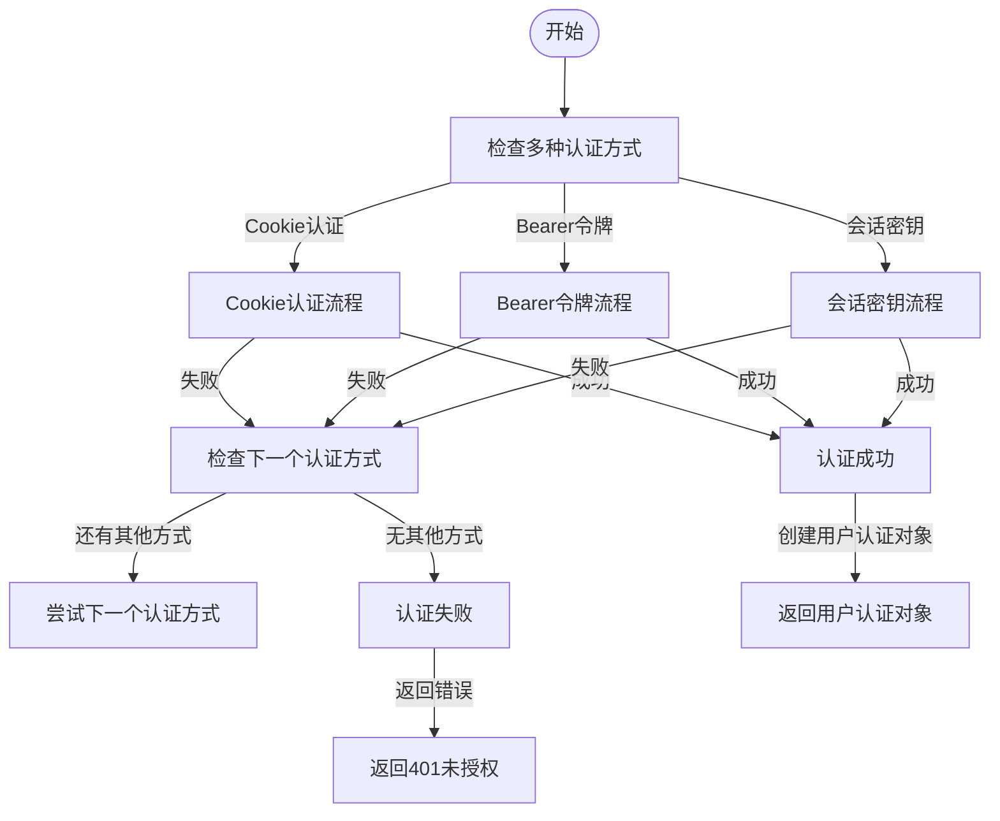

# 权限控制

<cite>
**本文档引用的文件**
- [saas_user_auth.py](file://enterprise/server/auth/saas_user_auth.py)
- [user_auth.py](file://openhands/server/user_auth/user_auth.py)
- [middleware.py](file://enterprise/server/middleware.py)
- [auth_error.py](file://enterprise/server/auth/auth_error.py)
- [api_keys.py](file://enterprise/server/routes/api_keys.py)
- [auth.py](file://enterprise/server/routes/auth.py)
- [saas_conversation_validator.py](file://enterprise/storage/saas_conversation_validator.py)
</cite>

## 目录
1. [简介](#简介)
2. [权限控制架构](#权限控制架构)
3. [核心组件分析](#核心组件分析)
4. [权限验证机制](#权限验证机制)
5. [API端点权限检查](#api端点权限检查)
6. [自定义权限策略配置](#自定义权限策略配置)
7. [权限继承与组合](#权限继承与组合)
8. [最佳实践](#最佳实践)
9. [结论](#结论)

## 简介
本文档详细描述了OpenHands平台中基于角色的访问控制（RBAC）模型的实现。系统通过多层验证机制确保用户权限的安全管理，包括JWT令牌验证、API密钥认证和会话管理。权限系统支持多种认证方式，包括Cookie认证、Bearer令牌认证和X-Session-API-Key认证，为不同场景提供灵活的访问控制。

## 权限控制架构

**Diagram sources**
- [middleware.py](file://enterprise/server/middleware.py#L99-L134)
- [saas_user_auth.py](file://enterprise/server/auth/saas_user_auth.py#L207-L218)
- [auth.py](file://enterprise/server/routes/auth.py#L43-L78)

## 核心组件分析

### 用户认证系统
系统实现了抽象的用户认证框架，允许通过插件方式扩展不同的认证机制。核心组件包括用户认证基类和具体实现。

**Diagram sources**
- [user_auth.py](file://openhands/server/user_auth/user_auth.py#L23-L87)
- [saas_user_auth.py](file://enterprise/server/auth/saas_user_auth.py#L43-L236)

**Section sources**
- [user_auth.py](file://openhands/server/user_auth/user_auth.py#L1-L107)
- [saas_user_auth.py](file://enterprise/server/auth/saas_user_auth.py#L1-L324)

## 权限验证机制

### 认证流程
系统实现了多层认证流程，确保用户身份的有效性和安全性。

**Diagram sources**
- [middleware.py](file://enterprise/server/middleware.py#L32-L98)
- [saas_user_auth.py](file://enterprise/server/auth/saas_user_auth.py#L249-L267)

### 错误处理机制
系统定义了详细的认证错误类型，便于客户端进行相应的错误处理。

**Diagram sources**
- [auth_error.py](file://enterprise/server/auth/auth_error.py#L1-L41)

**Section sources**
- [auth_error.py](file://enterprise/server/auth/auth_error.py#L1-L41)

## API端点权限检查

### API密钥管理
系统提供了完整的API密钥管理功能，包括创建、列出和删除API密钥。

**Diagram sources**
- [api_keys.py](file://enterprise/server/routes/api_keys.py#L182-L277)

### 会话验证
系统实现了会话验证机制，确保用户会话的安全性。

**Diagram sources**
- [dependencies.py](file://openhands/server/dependencies.py#L1-L24)
- [middleware.py](file://enterprise/server/middleware.py#L32-L98)

## 自定义权限策略配置

### 配置方法
系统支持通过环境变量和数据库配置自定义权限策略。

**Diagram sources**
- [config.py](file://enterprise/server/config.py)
- [saas_settings_store.py](file://enterprise/storage/saas_settings_store.py)
- [user_settings.py](file://enterprise/storage/user_settings.py)

## 权限继承与组合

### 多重认证支持
系统支持多种认证方式的组合使用，实现灵活的权限管理。

**Diagram sources**
- [saas_user_auth.py](file://enterprise/server/auth/saas_user_auth.py#L207-L218)
- [middleware.py](file://enterprise/server/middleware.py#L32-L98)

## 最佳实践

### 安全配置建议
为了确保系统的安全性，建议遵循以下最佳实践：

1. **JWT密钥管理**：使用强密钥并定期轮换
2. **API密钥有效期**：为API密钥设置合理的过期时间
3. **会话管理**：实施会话超时和自动注销机制
4. **错误处理**：避免在错误消息中泄露敏感信息
5. **日志记录**：详细记录认证相关的安全事件

### 性能优化
系统通过以下方式优化权限验证性能：

- **缓存机制**：缓存用户认证信息，减少数据库查询
- **异步处理**：使用异步操作提高响应速度
- **批量验证**：支持批量API密钥验证
- **连接池**：使用数据库连接池减少连接开销

## 结论
OpenHands平台的权限控制系统实现了基于角色的访问控制（RBAC）模型，通过多层验证机制确保用户权限的安全管理。系统支持多种认证方式，包括Cookie认证、Bearer令牌认证和会话密钥认证，为不同场景提供灵活的访问控制。通过抽象的用户认证框架，系统可以轻松扩展支持新的认证机制。建议在实际部署中遵循安全最佳实践，确保系统的安全性和性能。