# 会话管理

<cite>
**本文档中引用的文件**
- [token_manager.py](file://enterprise/server/auth/token_manager.py)
- [saas_user_auth.py](file://enterprise/server/auth/saas_user_auth.py)
- [auth_token_store.py](file://enterprise/storage/auth_token_store.py)
- [auth.py](file://enterprise/server/routes/auth.py)
- [middleware.py](file://enterprise/server/middleware.py)
- [auth_tokens.py](file://enterprise/storage/auth_tokens.py)
- [offline_token_store.py](file://enterprise/storage/offline_token_store.py)
- [clustered_conversation_manager.py](file://enterprise/server/clustered_conversation_manager.py)
- [redis.py](file://enterprise/storage/redis.py)
- [auth_error.py](file://enterprise/server/auth/auth_error.py)
- [constants.py](file://enterprise/server/auth/constants.py)
</cite>

## 目录
1. [简介](#简介)
2. [系统架构概览](#系统架构概览)
3. [JWT令牌机制](#jwt令牌机制)
4. [会话生命周期管理](#会话生命周期管理)
5. [令牌刷新机制](#令牌刷新机制)
6. [分布式会话同步](#分布式会话同步)
7. [安全退出流程](#安全退出流程)
8. [最佳实践与优化](#最佳实践与优化)
9. [故障排除指南](#故障排除指南)
10. [总结](#总结)

## 简介

OpenHands采用了一套完整的会话管理系统，支持多种身份验证提供商（GitHub、GitLab、Bitbucket等），实现了基于JWT的令牌机制，并在分布式环境中提供了会话同步能力。该系统的核心特性包括：

- **多提供商支持**：统一的身份验证接口，支持GitHub、GitLab、Bitbucket等多种提供商
- **JWT令牌管理**：完整的JWT令牌生成、验证和刷新机制
- **分布式会话同步**：基于Redis的跨服务器会话状态同步
- **自动令牌刷新**：智能的令牌过期检测和自动刷新
- **安全的会话持久化**：加密存储和安全的会话数据管理

## 系统架构概览

OpenHands的会话管理系统采用分层架构设计，包含以下核心组件：

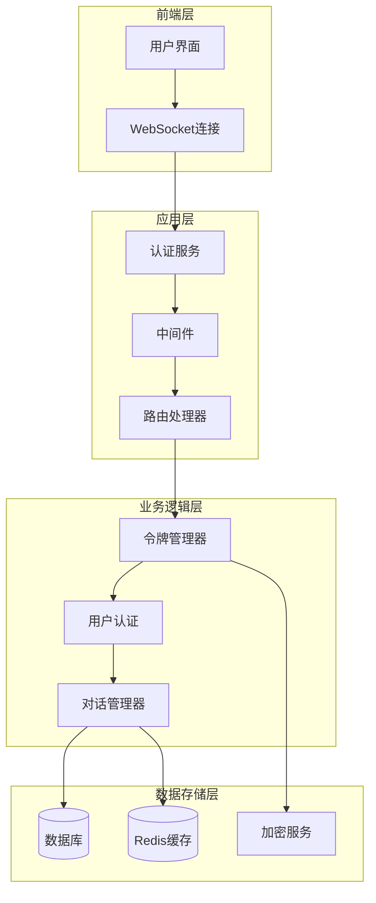

**图表来源**
- [token_manager.py](file://enterprise/server/auth/token_manager.py#L78-L100)
- [saas_user_auth.py](file://enterprise/server/auth/saas_user_auth.py#L43-L80)
- [clustered_conversation_manager.py](file://enterprise/server/clustered_conversation_manager.py#L60-L90)

## JWT令牌机制

### 令牌结构与组成

系统使用JWT（JSON Web Token）作为主要的身份验证机制，令牌包含以下关键部分：

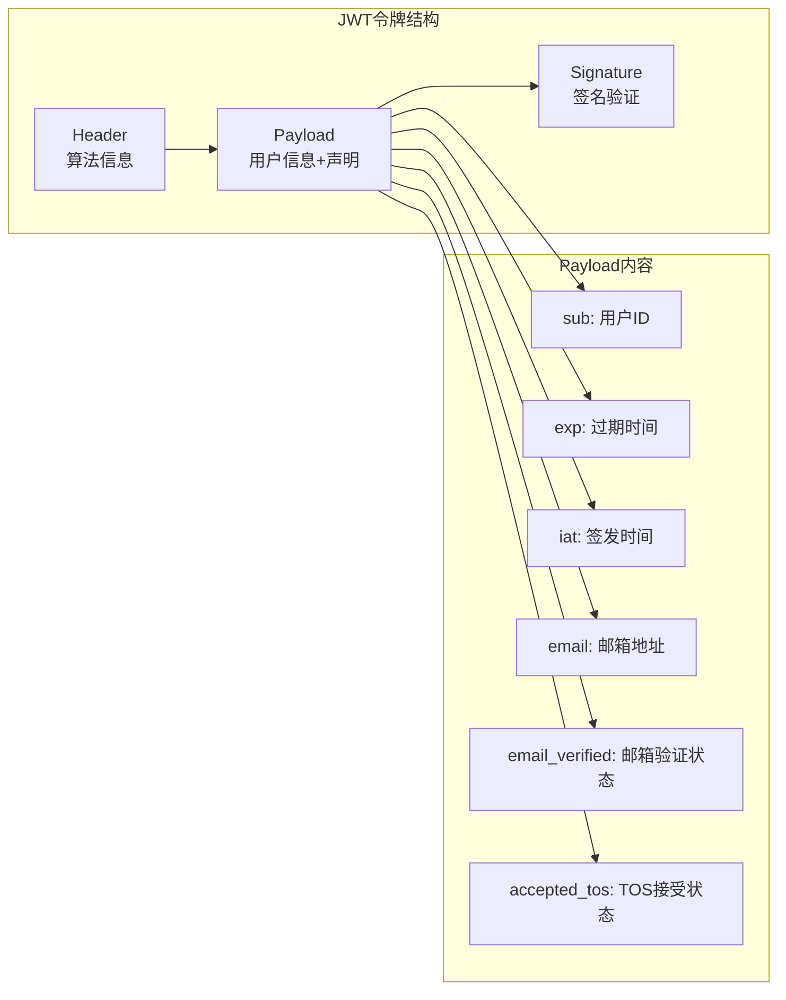

**图表来源**
- [saas_user_auth.py](file://enterprise/server/auth/saas_user_auth.py#L280-L310)
- [middleware.py](file://enterprise/server/middleware.py#L115-L130)

### 令牌生成流程

令牌生成过程包含多个安全检查和验证步骤：

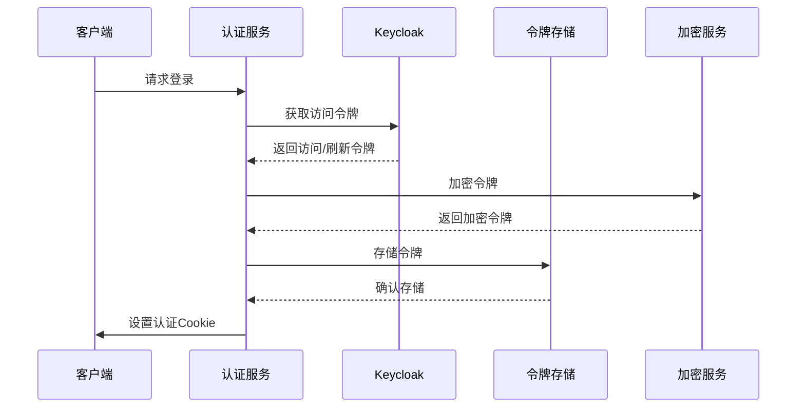

**图表来源**
- [auth.py](file://enterprise/server/routes/auth.py#L99-L248)
- [token_manager.py](file://enterprise/server/auth/token_manager.py#L89-L111)

### 签名验证机制

系统采用HS256算法进行令牌签名验证，确保令牌的完整性和真实性：

| 验证步骤 | 描述 | 安全考虑 |
|---------|------|----------|
| 签名验证 | 使用预共享密钥验证JWT签名 | 密钥必须安全存储，定期轮换 |
| 过期检查 | 验证令牌是否已过期 | 设置合理的过期时间窗口 |
| 声明验证 | 检查必需的JWT声明 | 确保关键信息如用户ID存在 |
| 主题验证 | 验证令牌主题与当前用户匹配 | 防止令牌被恶意使用 |

**段落来源**
- [middleware.py](file://enterprise/server/middleware.py#L115-L130)
- [saas_user_auth.py](file://enterprise/server/auth/saas_user_auth.py#L280-L310)

## 会话生命周期管理

### 会话创建流程

会话创建是一个多阶段的过程，涉及身份验证、令牌获取和状态初始化：

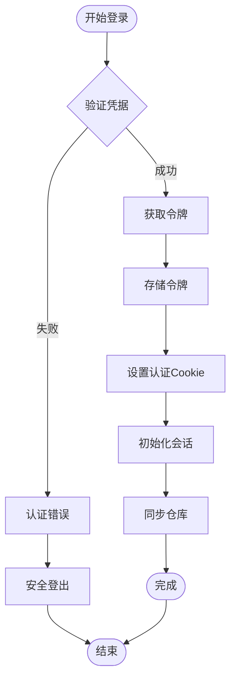

**图表来源**
- [auth.py](file://enterprise/server/routes/auth.py#L99-L248)
- [saas_user_auth.py](file://enterprise/server/auth/saas_user_auth.py#L207-L225)

### 会话状态管理

系统维护会话的多种状态信息，包括用户信息、权限状态和配置数据：

| 状态类型 | 描述 | 存储位置 | 更新频率 |
|---------|------|----------|----------|
| 用户身份 | 用户基本信息和权限 | 内存缓存 | 实时更新 |
| 令牌状态 | 访问令牌和刷新令牌的有效性 | 数据库 | 自动刷新 |
| 会话配置 | 用户偏好设置和系统配置 | 数据库 | 按需加载 |
| 连接状态 | WebSocket连接和事件流状态 | Redis | 心跳更新 |

**段落来源**
- [saas_user_auth.py](file://enterprise/server/auth/saas_user_auth.py#L43-L80)
- [auth_token_store.py](file://enterprise/storage/auth_token_store.py#L69-L156)

### 会话销毁机制

会话销毁采用多层次的安全措施，确保用户数据的安全：

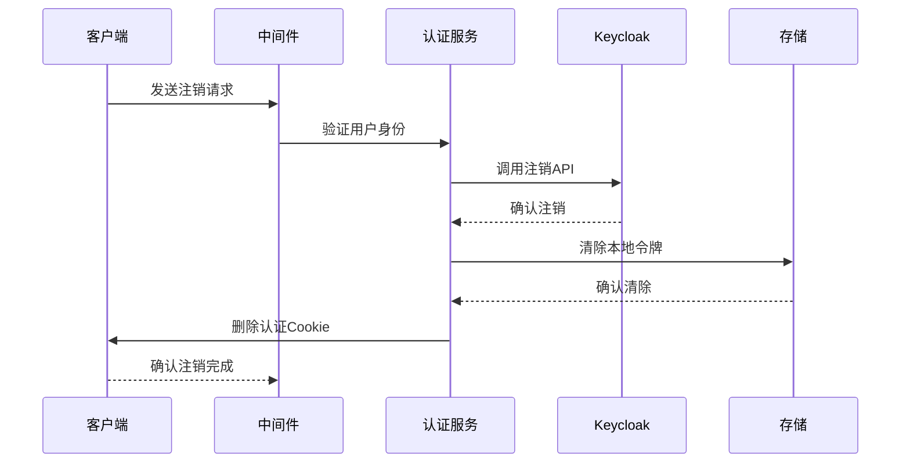

**图表来源**
- [auth.py](file://enterprise/server/routes/auth.py#L380-L406)
- [middleware.py](file://enterprise/server/middleware.py#L167-L174)

## 令牌刷新机制

### 自动刷新策略

系统实现了智能的令牌自动刷新机制，确保用户体验的连续性：

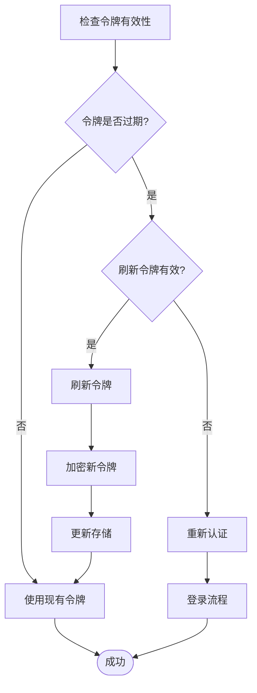

**图表来源**
- [token_manager.py](file://enterprise/server/auth/token_manager.py#L289-L322)
- [auth_token_store.py](file://enterprise/storage/auth_token_store.py#L116-L145)

### 刷新触发条件

系统根据多种条件触发令牌刷新操作：

| 触发条件 | 检查时机 | 处理方式 | 优先级 |
|---------|----------|----------|--------|
| 访问令牌过期 | 每次API调用前 | 自动刷新 | 最高 |
| 刷新令牌即将过期 | 后台定时检查 | 提前刷新 | 高 |
| 手动刷新请求 | 用户操作 | 立即执行 | 中 |
| 会话恢复 | 重新连接时 | 检查并刷新 | 中 |

**段落来源**
- [token_manager.py](file://enterprise/server/auth/token_manager.py#L289-L322)
- [saas_user_auth.py](file://enterprise/server/auth/saas_user_auth.py#L131-L140)

### 分布式刷新协调

在分布式环境中，系统需要协调多个实例间的令牌刷新操作：

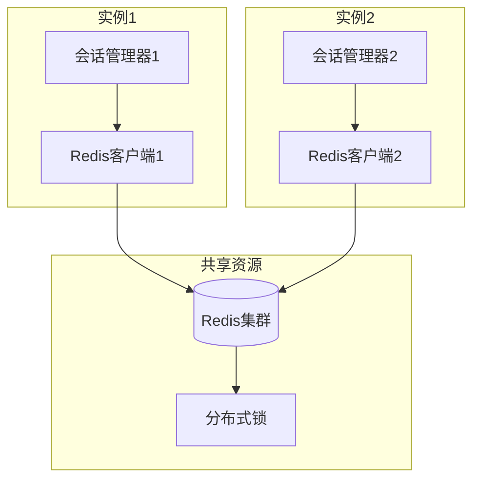

**图表来源**
- [clustered_conversation_manager.py](file://enterprise/server/clustered_conversation_manager.py#L422-L447)
- [redis.py](file://enterprise/storage/redis.py#L12-L23)

## 分布式会话同步

### Redis通信模式

系统使用Redis作为分布式会话同步的核心组件，采用发布/订阅模式进行跨服务器通信：

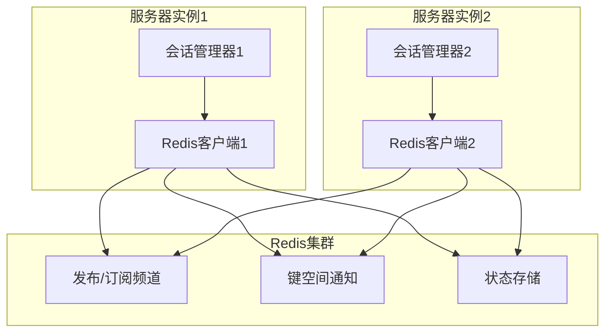

**图表来源**
- [clustered_conversation_manager.py](file://enterprise/server/clustered_conversation_manager.py#L108-L135)
- [redis.py](file://enterprise/storage/redis.py#L12-L23)

### 会话状态同步

系统通过Redis键值对维护会话状态，确保所有实例都能访问最新的会话信息：

| Redis键格式 | 描述 | 过期时间 | 用途 |
|------------|------|----------|------|
| `ohcnv:{user_id}:{conversation_id}` | 标记活跃对话 | 15秒 | 会话存在性确认 |
| `ohcnct:{user_id}:{conversation_id}:{connection_id}` | 跟踪连接到对话 | 15秒 | 连接状态管理 |
| `session:{session_id}` | 会话元数据 | 30分钟 | 会话配置信息 |

**段落来源**
- [clustered_conversation_manager.py](file://enterprise/server/clustered_conversation_manager.py#L75-L76)
- [clustered_conversation_manager.py](file://enterprise/server/clustered_conversation_manager.py#L437-L447)

### 故障恢复机制

系统具备完善的故障恢复能力，能够处理节点崩溃和网络分区情况：

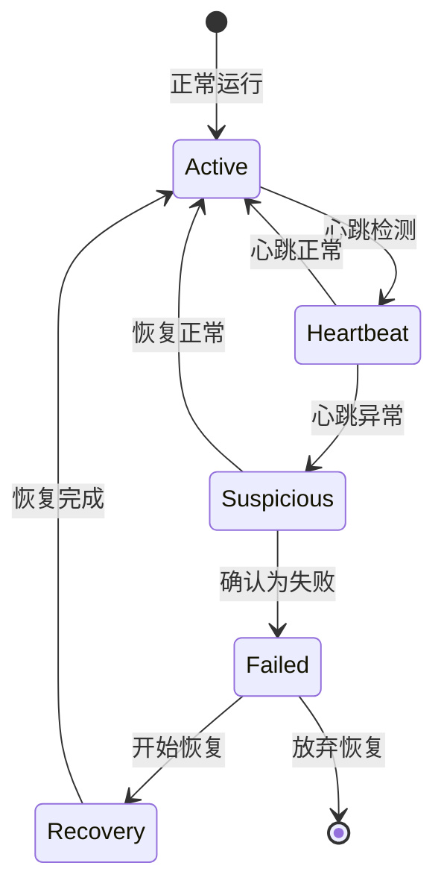

**图表来源**
- [clustered_conversation_manager.py](file://enterprise/server/clustered_conversation_manager.py#L108-L135)
- [clustered_conversation_manager.py](file://enterprise/server/clustered_conversation_manager.py#L422-L447)

## 安全退出流程

### 多层次安全措施

系统实现了多层次的安全退出机制，确保用户数据的安全：

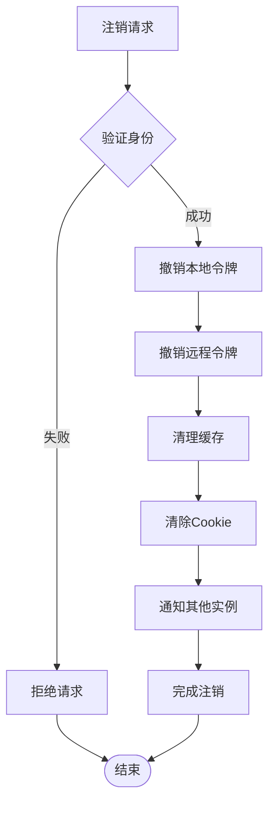

**图表来源**
- [auth.py](file://enterprise/server/routes/auth.py#L380-L406)
- [middleware.py](file://enterprise/server/middleware.py#L167-L174)

### 令牌撤销机制

系统支持主动撤销令牌，即使令牌尚未过期也能立即失效：

| 撤销类型 | 触发条件 | 影响范围 | 恢复方式 |
|---------|----------|----------|----------|
| 单个令牌撤销 | 用户主动操作 | 当前会话 | 需要重新认证 |
| 用户级撤销 | 管理员操作 | 用户所有会话 | 需要重新认证 |
| 全局撤销 | 安全事件 | 所有用户 | 需要重新认证 |
| 临时撤销 | 异常检测 | 特定会话 | 可能自动恢复 |

**段落来源**
- [token_manager.py](file://enterprise/server/auth/token_manager.py#L664-L671)
- [auth.py](file://enterprise/server/routes/auth.py#L380-L406)

### 会话清理策略

系统采用渐进式的会话清理策略，平衡性能和安全性：

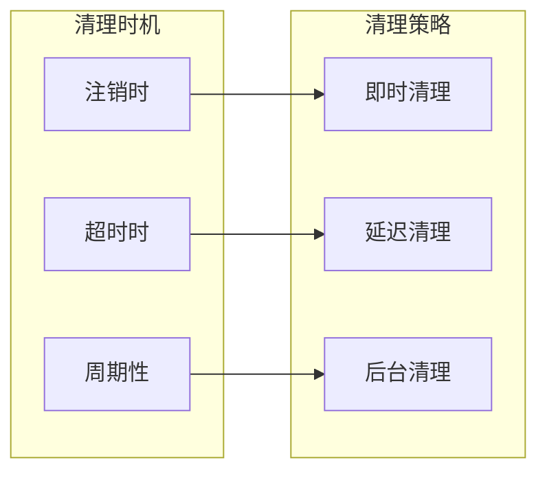

**图表来源**
- [clustered_conversation_manager.py](file://enterprise/server/clustered_conversation_manager.py#L614-L670)
- [auth.py](file://enterprise/server/routes/auth.py#L380-L406)

## 最佳实践与优化

### 性能优化策略

为了确保系统的高性能，系统采用了多种优化策略：

| 优化技术 | 应用场景 | 性能提升 | 实现复杂度 |
|---------|----------|----------|------------|
| 连接池管理 | 数据库连接 | 30-50% | 中 |
| 缓存策略 | 频繁访问数据 | 60-80% | 中 |
| 异步处理 | I/O密集操作 | 40-60% | 高 |
| 批量操作 | 大量数据处理 | 70-90% | 高 |

### 安全最佳实践

系统遵循多项安全最佳实践，确保用户数据的安全：

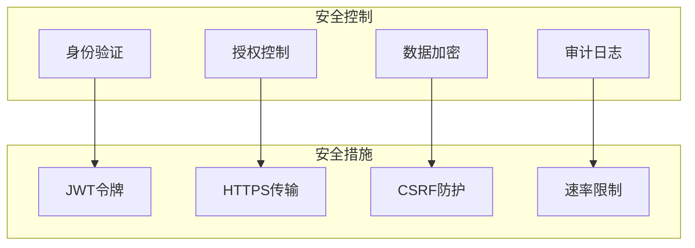

**图表来源**
- [middleware.py](file://enterprise/server/middleware.py#L26-L97)
- [auth.py](file://enterprise/server/routes/auth.py#L43-L77)

### 监控与告警

系统集成了完善的监控和告警机制，及时发现和处理异常情况：

| 监控指标 | 告警阈值 | 处理策略 | 通知方式 |
|---------|----------|----------|----------|
| 登录失败率 | >5% | 暂停账户 | 邮件+短信 |
| 令牌刷新频率 | >10次/小时 | 安全审查 | 管理员通知 |
| 会话并发数 | >最大值的80% | 扩容预警 | 系统告警 |
| Redis连接数 | >90% | 连接池扩容 | 自动处理 |

**段落来源**
- [clustered_conversation_manager.py](file://enterprise/server/clustered_conversation_manager.py#L422-L447)
- [middleware.py](file://enterprise/server/middleware.py#L26-L97)

## 故障排除指南

### 常见问题诊断

以下是系统中常见问题的诊断和解决方案：

| 问题类型 | 症状描述 | 可能原因 | 解决方案 |
|---------|----------|----------|----------|
| 令牌过期 | 401未授权错误 | 访问令牌过期 | 自动刷新或重新登录 |
| 登录失败 | 无法获取令牌 | Keycloak配置错误 | 检查客户端配置 |
| 会话丢失 | 断线重连失败 | Redis连接问题 | 检查Redis服务状态 |
| 分布式冲突 | 会话状态不一致 | 网络分区 | 重启相关服务 |

### 调试工具与方法

系统提供了多种调试工具帮助开发者快速定位问题：

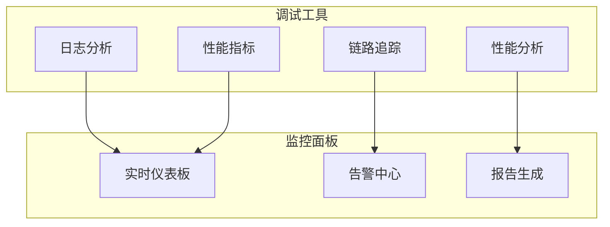

**图表来源**
- [clustered_conversation_manager.py](file://enterprise/server/clustered_conversation_manager.py#L108-L135)
- [middleware.py](file://enterprise/server/middleware.py#L26-L97)

### 故障恢复程序

当系统出现严重故障时，可以按照以下程序进行恢复：

1. **故障检测**：通过监控系统识别故障类型和影响范围
2. **隔离影响**：暂停受影响的服务实例，防止故障扩散
3. **数据一致性检查**：验证数据库和缓存的一致性
4. **逐步恢复**：按优先级顺序恢复服务功能
5. **性能验证**：确认系统性能恢复到正常水平

**段落来源**
- [clustered_conversation_manager.py](file://enterprise/server/clustered_conversation_manager.py#L108-L135)
- [auth.py](file://enterprise/server/routes/auth.py#L380-L406)

## 总结

OpenHands的会话管理系统是一个功能完整、安全可靠的解决方案，具有以下核心优势：

### 技术特点
- **多提供商支持**：统一的接口支持多种身份验证提供商
- **智能令牌管理**：自动化的令牌刷新和过期处理
- **分布式架构**：基于Redis的跨服务器会话同步
- **安全保障**：多层次的安全措施和审计功能

### 架构优势
- **可扩展性**：支持水平扩展和负载均衡
- **高可用性**：完善的故障恢复和容错机制
- **性能优化**：多种优化策略确保系统高效运行
- **易于维护**：清晰的模块化设计和完善的监控体系

### 应用价值
该系统为OpenHands平台提供了坚实的会话管理基础，支持大规模用户的并发访问，同时确保了数据的安全性和系统的稳定性。通过持续的优化和改进，该系统将继续为用户提供优质的体验。