# 用户同步

<cite>
**本文档中引用的文件**
- [keycloak_manager.py](file://enterprise/server/auth/keycloak_manager.py)
- [token_manager.py](file://enterprise/server/auth/token_manager.py)
- [saas_user_auth.py](file://enterprise/server/auth/saas_user_auth.py)
- [gitlab_sync.py](file://enterprise/server/auth/gitlab_sync.py)
- [common_room_sync.py](file://enterprise/sync/common_room_sync.py)
- [resend_keycloak.py](file://enterprise/sync/resend_keycloak.py)
- [user_version_upgrade_processor.py](file://enterprise/server/maintenance_task_processor/user_version_upgrade_processor.py)
- [run_maintenance_tasks.py](file://enterprise/run_maintenance_tasks.py)
- [maintenance_task.py](file://enterprise/storage/maintenance_task.py)
- [user_settings.py](file://enterprise/storage/user_settings.py)
- [linear_user.py](file://enterprise/storage/linear_user.py)
- [user_repo_map.py](file://enterprise/storage/user_repo_map.py)
- [batched_web_hook.py](file://openhands/storage/batched_web_hook.py)
</cite>

## 目录
1. [概述](#概述)
2. [系统架构](#系统架构)
3. [身份提供商集成](#身份提供商集成)
4. [用户属性映射](#用户属性映射)
5. [定时同步机制](#定时同步机制)
6. [事件驱动同步](#事件驱动同步)
7. [数据一致性保障](#数据一致性保障)
8. [冲突解决策略](#冲突解决策略)
9. [审计日志系统](#审计日志系统)
10. [用户状态管理](#用户状态管理)
11. [故障排除指南](#故障排除指南)
12. [总结](#总结)

## 概述

OpenHands Enterprise 提供了一套完整的用户同步机制，用于在第三方身份提供商（如 Keycloak）与本地系统之间保持用户信息的一致性。该系统支持多种同步模式，包括定时同步和事件驱动同步，并提供了完善的数据一致性保障措施。

### 核心特性

- **多身份提供商支持**：支持 GitHub、GitLab、Bitbucket 等主流开发平台
- **双向同步能力**：支持从外部系统向本地同步以及反向同步
- **灵活的同步策略**：支持定时批量同步和实时事件驱动同步
- **数据一致性保障**：提供冲突检测和自动解决机制
- **审计追踪**：完整的操作日志和变更记录

## 系统架构

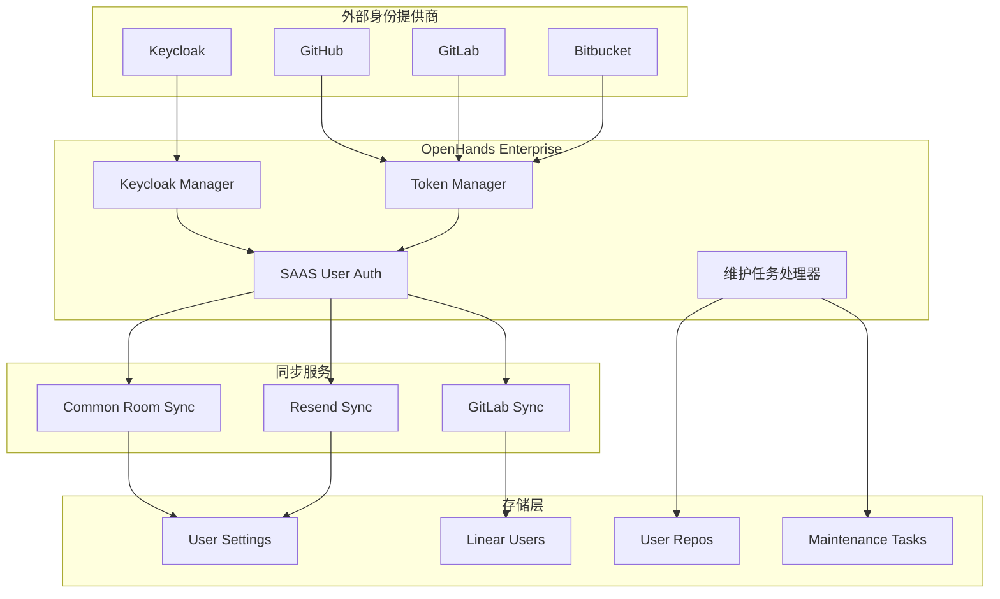

**图表来源**
- [keycloak_manager.py](file://enterprise/server/auth/keycloak_manager.py#L1-L51)
- [token_manager.py](file://enterprise/server/auth/token_manager.py#L1-L100)
- [saas_user_auth.py](file://enterprise/server/auth/saas_user_auth.py#L43-L200)

## 身份提供商集成

### Keycloak 集成

系统通过 Keycloak Manager 实现对 Keycloak 身份提供商的统一管理：

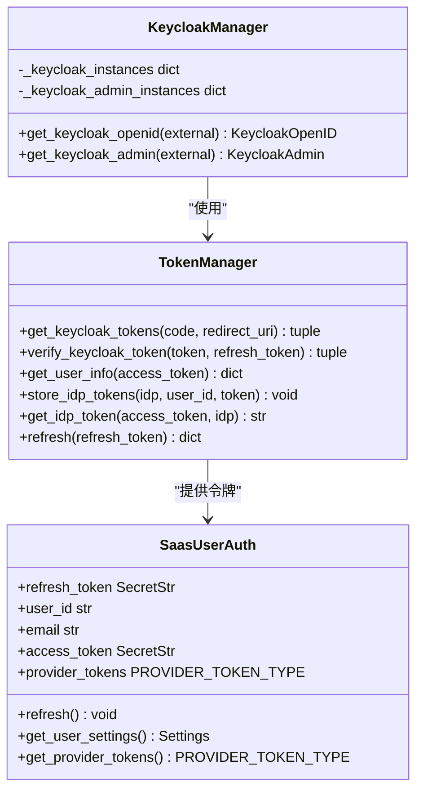

**图表来源**
- [keycloak_manager.py](file://enterprise/server/auth/keycloak_manager.py#L21-L51)
- [token_manager.py](file://enterprise/server/auth/token_manager.py#L78-L200)
- [saas_user_auth.py](file://enterprise/server/auth/saas_user_auth.py#L43-L150)

### 第三方平台集成

系统支持多种第三方开发平台的身份验证和数据同步：

| 平台 | 支持功能 | 同步类型 | 数据映射 |
|------|----------|----------|----------|
| GitHub | OAuth 认证、仓库访问 | 双向同步 | 用户信息、仓库权限 |
| GitLab | OAuth 认证、项目访问 | 双向同步 | 用户信息、项目成员 |
| Bitbucket | OAuth 认证、团队访问 | 单向同步 | 用户信息、团队成员 |
| Linear | API 密钥认证 | 单向同步 | 用户信息、工单权限 |

**章节来源**
- [token_manager.py](file://enterprise/server/auth/token_manager.py#L190-L400)
- [gitlab_sync.py](file://enterprise/server/auth/gitlab_sync.py#L1-L31)

## 用户属性映射

### 基础属性映射

系统定义了标准的用户属性映射规则，确保来自不同身份提供商的用户信息能够正确转换：

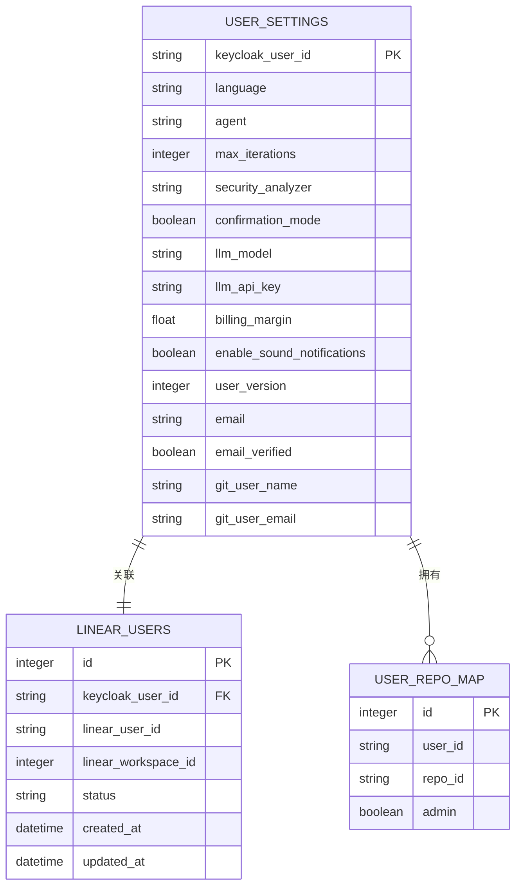

**图表来源**
- [user_settings.py](file://enterprise/storage/user_settings.py#L6-L41)
- [linear_user.py](file://enterprise/storage/linear_user.py#L5-L22)
- [user_repo_map.py](file://enterprise/storage/user_repo_map.py#L5-L14)

### 角色分配机制

系统根据用户在各个平台上的权限自动分配本地角色：

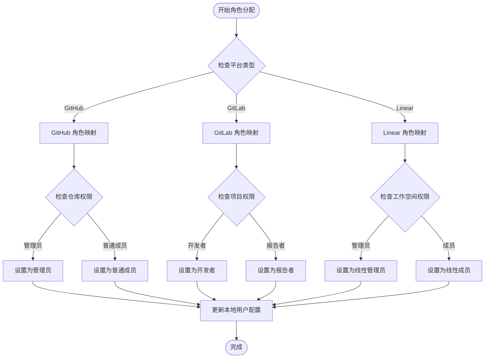

**图表来源**
- [user_repo_map.py](file://enterprise/storage/user_repo_map.py#L1-L14)
- [linear_user.py](file://enterprise/storage/linear_user.py#L1-L22)

**章节来源**
- [user_settings.py](file://enterprise/storage/user_settings.py#L1-L41)

## 定时同步机制

### 维护任务调度

系统通过维护任务处理器实现定时同步功能：

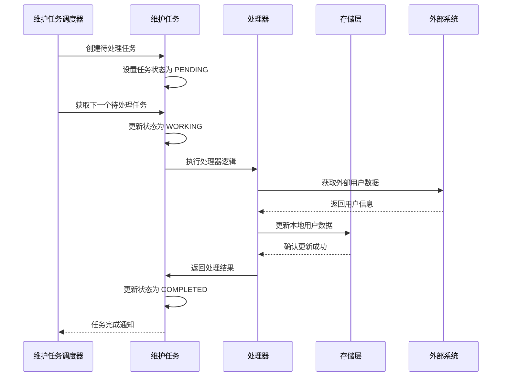

**图表来源**
- [run_maintenance_tasks.py](file://enterprise/run_maintenance_tasks.py#L33-L79)
- [maintenance_task.py](file://enterprise/storage/maintenance_task.py#L54-L110)

### 用户版本升级同步

系统定期执行用户设置版本升级任务，确保用户配置的一致性：

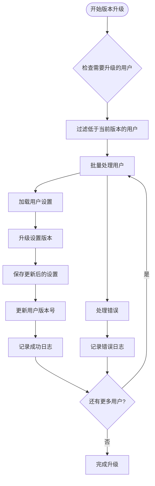

**图表来源**
- [user_version_upgrade_processor.py](file://enterprise/server/maintenance_task_processor/user_version_upgrade_processor.py#L25-L156)

**章节来源**
- [run_maintenance_tasks.py](file://enterprise/run_maintenance_tasks.py#L1-L79)
- [user_version_upgrade_processor.py](file://enterprise/server/maintenance_task_processor/user_version_upgrade_processor.py#L1-L156)

## 事件驱动同步

### Webhook 事件处理

系统通过批处理 Webhook 服务实现实时事件驱动同步：

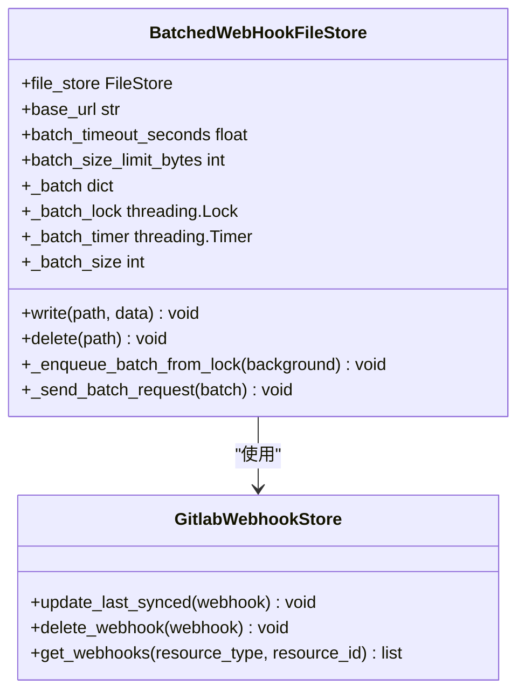

**图表来源**
- [batched_web_hook.py](file://openhands/storage/batched_web_hook.py#L17-L223)

### 实时同步流程

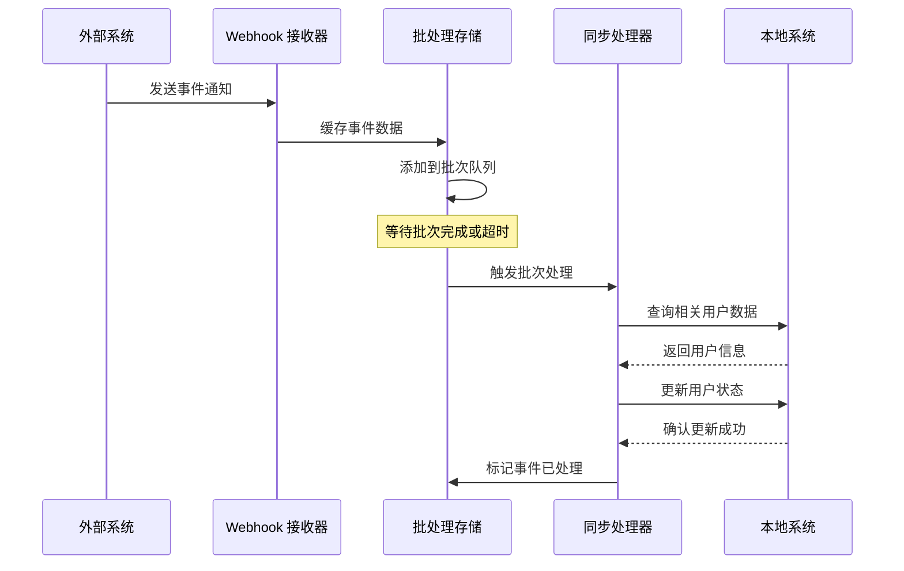

**图表来源**
- [batched_web_hook.py](file://openhands/storage/batched_web_hook.py#L186-L223)

**章节来源**
- [batched_web_hook.py](file://openhands/storage/batched_web_hook.py#L1-L223)

## 数据一致性保障

### 冲突检测机制

系统实现了多层次的冲突检测和解决机制：

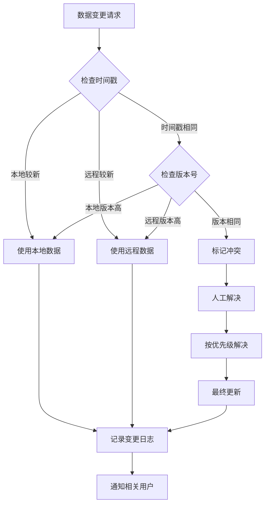

### 数据验证规则

系统定义了严格的数据验证规则以确保数据完整性：

| 验证类型 | 检查内容 | 处理策略 |
|----------|----------|----------|
| 必填字段验证 | 用户邮箱、用户名等关键字段 | 拒绝更新，返回错误 |
| 格式验证 | 邮箱地址、URL格式等 | 自动修正或拒绝 |
| 唯一性验证 | 用户ID、邮箱地址等唯一标识 | 冲突解决或拒绝 |
| 权限验证 | 用户操作权限检查 | 拒绝无权限操作 |
| 业务规则验证 | 用户状态、角色等业务约束 | 智能提示或拒绝 |

**章节来源**
- [token_manager.py](file://enterprise/server/auth/token_manager.py#L289-L330)

## 冲突解决策略

### 自动解决策略

系统提供了多种自动冲突解决策略：

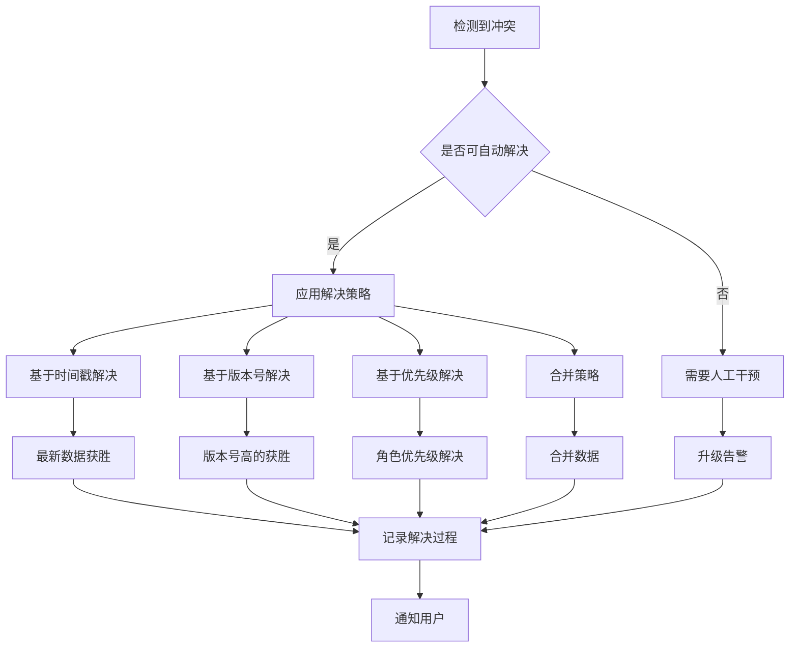

### 冲突解决示例

以下是一些常见的冲突解决场景：

1. **用户信息冲突**：
   - 场景：GitHub 和 Keycloak 中的用户邮箱不一致
   - 解决：优先使用 Keycloak 的官方邮箱地址

2. **权限冲突**：
   - 场景：GitLab 项目权限与本地权限不匹配
   - 解决：采用最严格的权限设置

3. **状态冲突**：
   - 场景：用户在多个平台上的激活状态不一致
   - 解决：以主要平台的状态为准

**章节来源**
- [token_manager.py](file://enterprise/server/auth/token_manager.py#L289-L330)

## 审计日志系统

### 日志记录策略

系统实现了全面的审计日志记录机制：

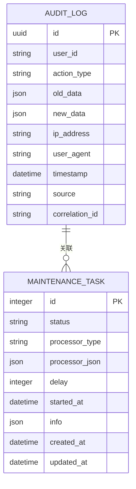

### 关键操作审计

系统记录以下关键操作的审计日志：

| 操作类型 | 记录内容 | 保留期限 |
|----------|----------|----------|
| 用户登录 | IP地址、设备信息、时间戳 | 1年 |
| 权限变更 | 新旧权限对比、变更原因 | 永久 |
| 数据同步 | 同步前后数据、失败原因 | 6个月 |
| 配置修改 | 修改前后的配置项 | 1年 |
| 错误事件 | 错误详情、处理结果 | 3个月 |

### 日志查询接口

系统提供了灵活的日志查询接口：

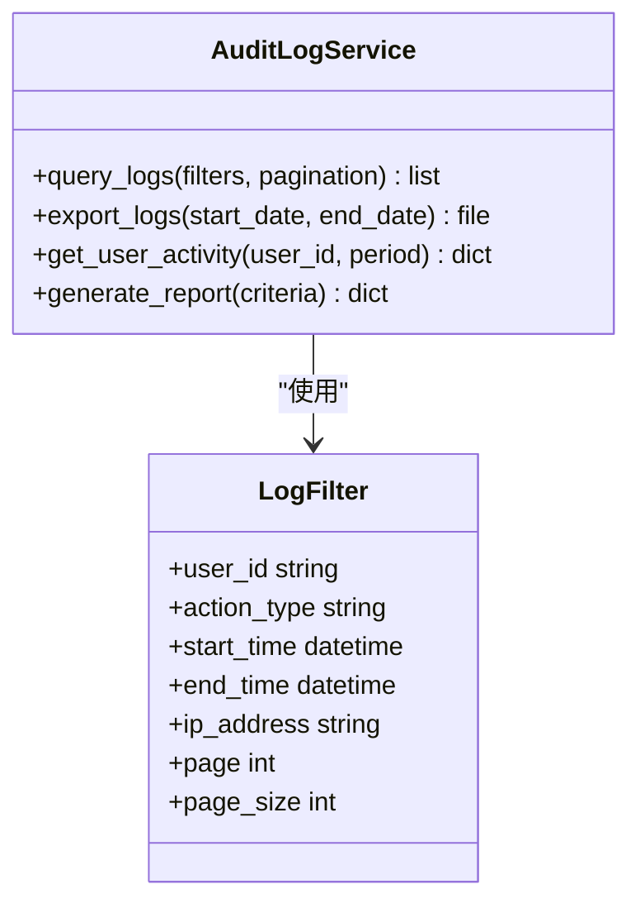

**章节来源**
- [maintenance_task.py](file://enterprise/storage/maintenance_task.py#L54-L110)

## 用户状态管理

### 账户生命周期管理

系统完整跟踪用户的整个生命周期状态：

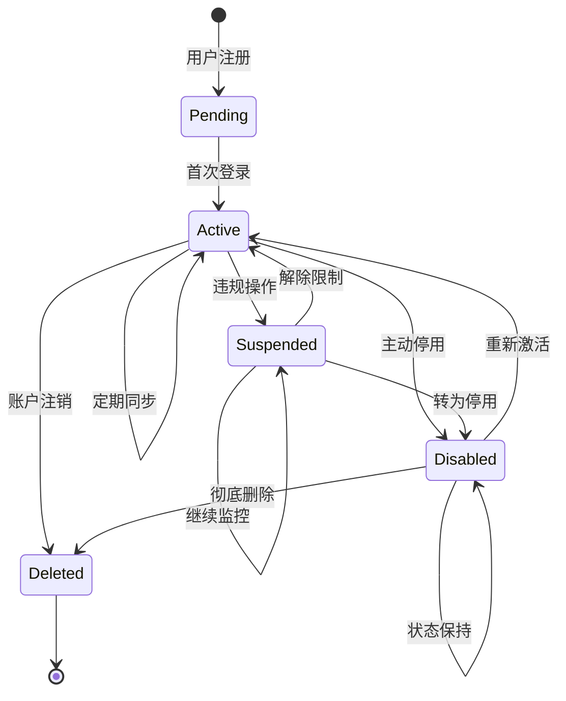

### 状态同步策略

不同状态下的同步策略：

1. **活跃用户**：实时同步，高频更新
2. **暂停用户**：延迟同步，降低频率
3. **停用用户**：只读同步，仅更新必要信息
4. **已删除用户**：停止同步，清理缓存

**章节来源**
- [saas_user_auth.py](file://enterprise/server/auth/saas_user_auth.py#L60-L110)

## 故障排除指南

### 常见问题及解决方案

#### 同步失败问题

**问题现象**：用户信息无法同步到本地系统

**排查步骤**：
1. 检查外部身份提供商的连接状态
2. 验证 Token 是否有效且未过期
3. 检查网络连接和防火墙设置
4. 查看同步任务的错误日志

**解决方案**：
- 重新获取访问令牌
- 检查 API 限流设置
- 调整同步间隔参数

#### 数据不一致问题

**问题现象**：本地用户数据与外部系统不一致

**排查步骤**：
1. 检查最后同步时间戳
2. 对比同步前后的数据差异
3. 验证冲突解决策略是否生效

**解决方案**：
- 执行强制全量同步
- 手动触发冲突解决
- 清理缓存数据重新同步

#### 性能问题

**问题现象**：同步过程耗时过长

**优化方案**：
- 调整批次大小参数
- 增加并发处理数量
- 优化数据库索引
- 使用增量同步策略

### 监控指标

系统提供了以下关键监控指标：

| 指标名称 | 监控内容 | 告警阈值 |
|----------|----------|----------|
| 同步成功率 | 成功/总同步次数比例 | < 95% |
| 同步延迟 | 最后同步时间差 | > 24小时 |
| 错误率 | 错误/总同步次数比例 | > 5% |
| 并发数 | 同时进行的同步任务数 | > 10个 |
| 响应时间 | 同步请求平均响应时间 | > 30秒 |

**章节来源**
- [common_room_sync.py](file://enterprise/sync/common_room_sync.py#L370-L436)
- [resend_keycloak.py](file://enterprise/sync/resend_keycloak.py#L188-L230)

## 总结

OpenHands Enterprise 的用户同步机制提供了一个完整、可靠、高效的解决方案，能够满足企业级应用对用户数据同步的各种需求。该系统的主要优势包括：

### 技术优势

1. **多平台支持**：统一管理多个身份提供商，简化集成复杂度
2. **灵活的同步策略**：支持定时和事件驱动两种同步模式
3. **强大的一致性保障**：多层次的冲突检测和解决机制
4. **完善的审计追踪**：全面的操作日志和变更记录
5. **高可用性设计**：具备重试机制和故障恢复能力

### 应用价值

1. **提升用户体验**：确保用户信息在各平台间的一致性
2. **降低运维成本**：自动化处理复杂的同步逻辑
3. **增强安全性**：实时监控和审计用户操作
4. **支持业务扩展**：灵活的角色和权限管理系统

该用户同步机制为企业数字化转型提供了坚实的技术基础，能够有效支撑企业的业务发展和合规要求。