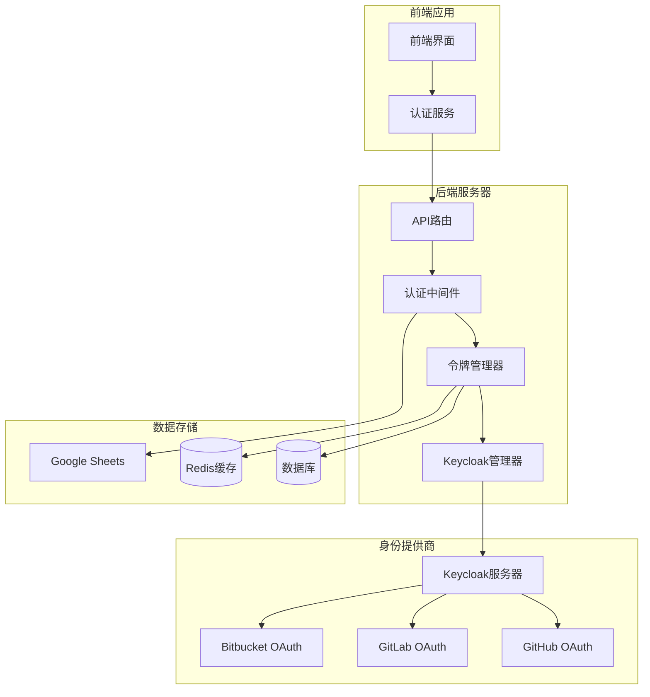
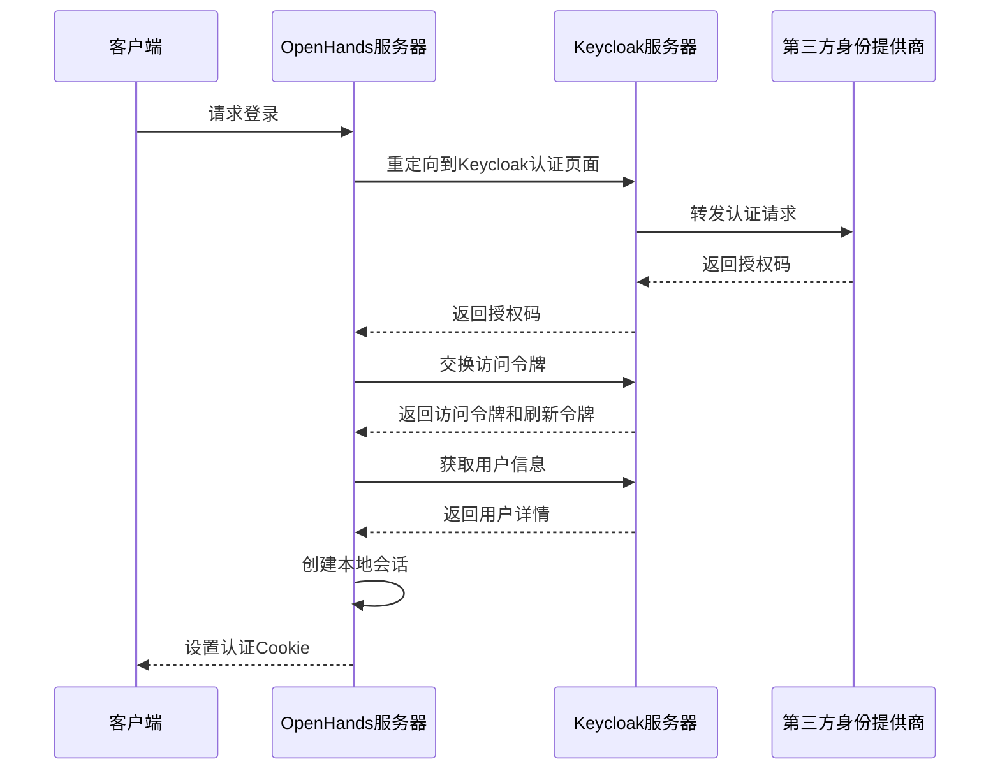
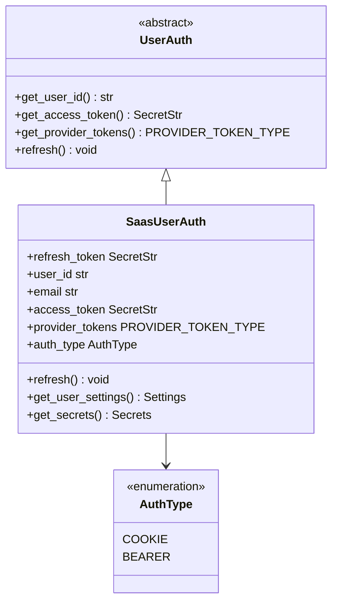
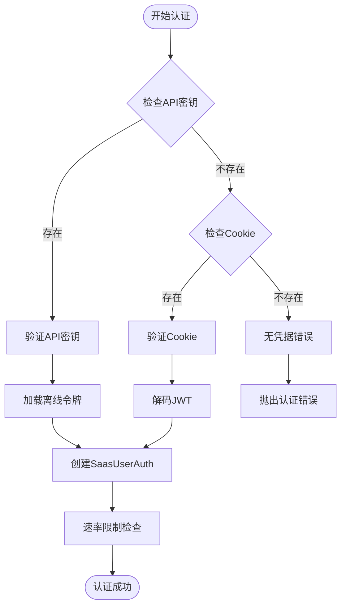
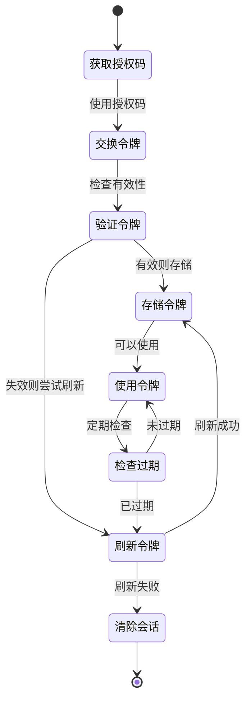
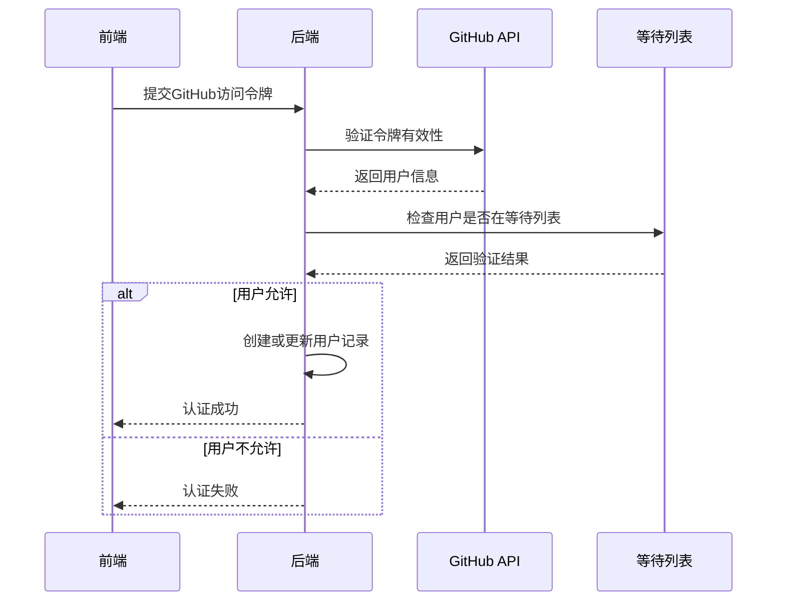
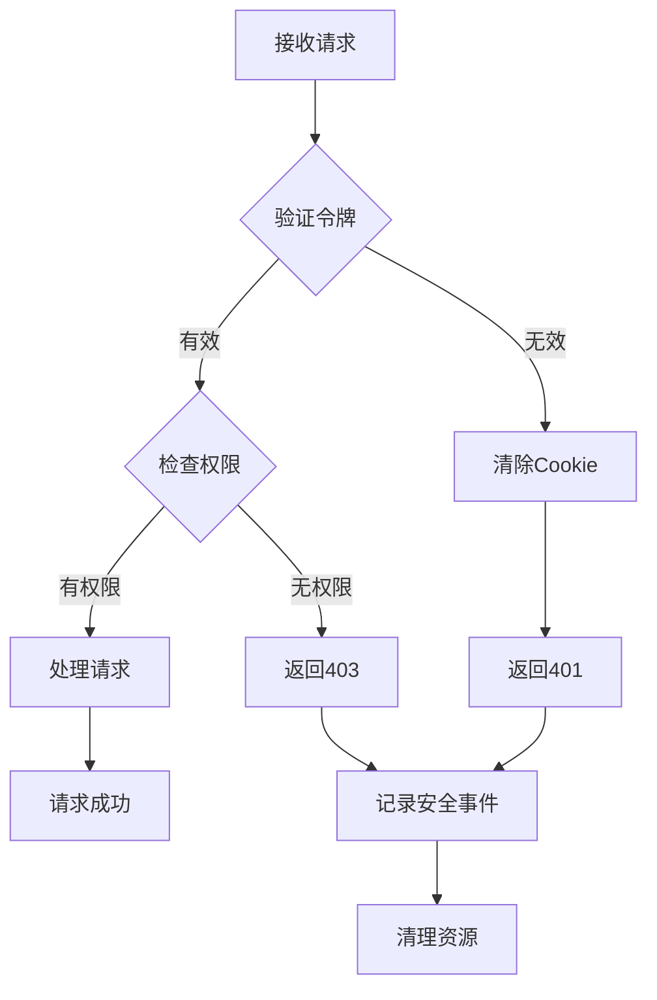

# 用户认证

<cite>
**本文档中引用的文件**
- [auth_utils.py](file://enterprise/server/auth/auth_utils.py)
- [github_utils.py](file://enterprise/server/auth/github_utils.py)
- [gitlab_sync.py](file://enterprise/server/auth/gitlab_sync.py)
- [keycloak_manager.py](file://enterprise/server/auth/keycloak_manager.py)
- [saas_user_auth.py](file://enterprise/server/auth/saas_user_auth.py)
- [token_manager.py](file://enterprise/server/auth/token_manager.py)
- [auth.py](file://enterprise/server/routes/auth.py)
- [constants.py](file://enterprise/server/auth/constants.py)
- [sheets_client.py](file://enterprise/server/auth/sheets_client.py)
- [auth_error.py](file://enterprise/server/auth/auth_error.py)
- [auth-service.api.ts](file://frontend/src/api/auth-service/auth-service.api.ts)
- [generate-auth-url.ts](file://frontend/src/utils/generate-auth-url.ts)
</cite>

## 目录
1. [简介](#简介)
2. [系统架构概览](#系统架构概览)
3. [第三方身份提供商集成](#第三方身份提供商集成)
4. [OAuth2认证流程](#oauth2认证流程)
5. [用户认证机制](#用户认证机制)
6. [会话管理与令牌处理](#会话管理与令牌处理)
7. [用户信息同步](#用户信息同步)
8. [错误处理与安全验证](#错误处理与安全验证)
9. [前端认证接口](#前端认证接口)
10. [最佳实践与安全考虑](#最佳实践与安全考虑)

## 简介

OpenHands采用基于Keycloak的身份管理系统，支持GitHub、GitLab和Bitbucket等第三方身份提供商的OAuth2认证。该认证系统为SaaS模式提供了完整的用户身份验证、授权和会话管理功能，同时保持了与开源版本的兼容性。

## 系统架构概览



**图表来源**
- [auth.py](file://enterprise/server/routes/auth.py#L37-L41)
- [token_manager.py](file://enterprise/server/auth/token_manager.py#L78-L88)
- [keycloak_manager.py](file://enterprise/server/auth/keycloak_manager.py#L21-L51)

## 第三方身份提供商集成

### 支持的身份提供商

系统支持以下第三方身份提供商：

| 身份提供商 | 类型 | 配置变量 | 功能 |
|-----------|------|----------|------|
| GitHub | OAuth2 | GITHUB_APP_* | 代码仓库访问、PR管理 |
| GitLab | OAuth2 | GITLAB_APP_* | 项目管理、CI/CD集成 |
| Bitbucket | OAuth2 | BITBUCKET_APP_* | 代码托管、团队协作 |
| Keycloak | OIDC | KEYCLOAK_* | 统一身份管理 |

### Keycloak集成架构



**图表来源**
- [auth.py](file://enterprise/server/routes/auth.py#L99-L248)
- [token_manager.py](file://enterprise/server/auth/token_manager.py#L89-L111)

**章节来源**
- [constants.py](file://enterprise/server/auth/constants.py#L1-L33)
- [keycloak_manager.py](file://enterprise/server/auth/keycloak_manager.py#L1-L51)

## OAuth2认证流程

### 标准OAuth2流程

系统实现了标准的OAuth2授权码流程：

1. **初始化认证请求**
   - 前端生成认证URL并重定向用户
   - 包含客户端ID、重定向URI、作用域和状态参数

2. **用户授权**
   - 用户在第三方身份提供商处登录
   - 授权后返回授权码给OpenHands

3. **令牌交换**
   - 使用授权码向Keycloak交换访问令牌和刷新令牌
   - 验证令牌有效性并提取用户信息

4. **会话建立**
   - 创建本地会话并设置认证Cookie
   - 存储用户令牌用于后续API调用

### 认证端点调用示例

```typescript
// 前端生成认证URL
const authUrl = generateAuthUrl('github', currentUrl);

// 后端处理回调
async function handleKeycloakCallback(code: string, state: string) {
  // 1. 验证授权码
  const [accessToken, refreshToken] = await tokenManager.getKeycloakTokens(code, redirectUri);
  
  // 2. 获取用户信息
  const userInfo = await tokenManager.getUserInfo(accessToken);
  
  // 3. 存储IDP令牌
  await tokenManager.storeIdpTokens(providerType, userId, accessToken);
  
  // 4. 创建会话Cookie
  setResponseCookie(request, response, accessToken, refreshToken);
}
```

**章节来源**
- [auth.py](file://enterprise/server/routes/auth.py#L99-L248)
- [generate-auth-url.ts](file://frontend/src/utils/generate-auth-url.ts#L1-L45)

## 用户认证机制

### 认证类型

系统支持多种认证方式：



**图表来源**
- [saas_user_auth.py](file://enterprise/server/auth/saas_user_auth.py#L43-L57)

### 认证实例获取流程



**图表来源**
- [saas_user_auth.py](file://enterprise/server/auth/saas_user_auth.py#L206-L225)

**章节来源**
- [saas_user_auth.py](file://enterprise/server/auth/saas_user_auth.py#L43-L324)

## 会话管理与令牌处理

### 令牌生命周期管理



### 令牌刷新机制

系统实现了智能的令牌刷新策略：

1. **访问令牌刷新**
   - 在访问令牌过期前4小时自动刷新
   - 使用刷新令牌获取新的访问令牌
   - 更新本地令牌存储

2. **刷新令牌验证**
   - 定期验证刷新令牌的有效性
   - 检测令牌被撤销的情况
   - 自动重新认证

3. **离线令牌管理**
   - 存储长期有效的离线令牌
   - 用于长时间会话维持
   - 支持跨浏览器会话

**章节来源**
- [token_manager.py](file://enterprise/server/auth/token_manager.py#L289-L329)

## 用户信息同步

### GitHub用户认证流程



**图表来源**
- [github_utils.py](file://enterprise/server/auth/github_utils.py#L93-L126)

### Google Sheets用户验证

系统支持通过Google Sheets进行用户白名单验证：

```python
# 配置Google Sheets客户端
sheets_client = GoogleSheetsClient()

# 获取用户列表
usernames = sheets_client.get_usernames(spreadsheet_id)

# 缓存机制（15秒TTL）
cached_usernames = self._get_from_cache(spreadsheet_id, range_name)
```

**章节来源**
- [github_utils.py](file://enterprise/server/auth/github_utils.py#L82-L126)
- [sheets_client.py](file://enterprise/server/auth/sheets_client.py#L1-L112)

## 错误处理与安全验证

### 认证错误类型

系统定义了完整的认证错误层次结构：

| 错误类型 | 描述 | 处理方式 |
|---------|------|----------|
| AuthError | 通用认证错误 | 基类，所有认证相关错误的基类 |
| NoCredentialsError | 无凭据错误 | 用户未提供认证信息 |
| BearerTokenError | Bearer令牌错误 | 解码Bearer令牌失败 |
| CookieError | Cookie错误 | 解码认证Cookie失败 |
| ExpiredError | 过期错误 | 令牌已过期 |
| TosNotAcceptedError | 服务条款未接受 | 用户未接受服务条款 |

### 安全验证措施



### 安全最佳实践

1. **令牌安全**
   - 使用HTTPS传输所有认证数据
   - 实施严格的Cookie安全属性
   - 定期轮换加密密钥

2. **输入验证**
   - 验证所有外部输入
   - 防止SQL注入和XSS攻击
   - 实施速率限制

3. **审计日志**
   - 记录所有认证事件
   - 跟踪异常访问行为
   - 支持合规性审计

**章节来源**
- [auth_error.py](file://enterprise/server/auth/auth_error.py#L1-L41)
- [middleware.py](file://enterprise/server/middleware.py#L69-L100)

## 前端认证接口

### 认证服务API

前端通过专门的认证服务处理所有认证相关操作：

```typescript
class AuthService {
  // 认证检查
  static async authenticate(appMode: string): Promise<boolean>
  
  // 获取GitHub访问令牌
  static async getGitHubAccessToken(code: string): Promise<GitHubAccessTokenResponse>
  
  // 登出
  static async logout(appMode: string): Promise<void>
}
```

### 认证URL生成

前端负责生成正确的认证URL：

```typescript
function generateAuthUrl(identityProvider: string, requestUrl: URL, authUrl?: string): string {
  const protocol = requestUrl.hostname === "localhost" ? requestUrl.protocol : "https:";
  const redirectUri = `${protocol}//${requestUrl.host}/oauth/keycloak/callback`;
  
  const finalAuthUrl = authUrl ? 
    `https://${authUrl.replace(/^https?:\/\//, "")}` :
    `https://auth.${requestUrl.hostname}`;
    
  return `${finalAuthUrl}/realms/allhands/protocol/openid-connect/auth?...`;
}
```

**章节来源**
- [auth-service.api.ts](file://frontend/src/api/auth-service/auth-service.api.ts#L1-L53)
- [generate-auth-url.ts](file://frontend/src/utils/generate-auth-url.ts#L1-L45)

## 最佳实践与安全考虑

### 部署配置建议

1. **环境变量配置**
   ```bash
   # Keycloak配置
   KEYCLOAK_SERVER_URL=https://auth.example.com
   KEYCLOAK_REALM_NAME=allhands
   KEYCLOAK_CLIENT_ID=allhands
   
   # GitHub集成
   GITHUB_APP_CLIENT_ID=your_client_id
   GITHUB_APP_CLIENT_SECRET=your_client_secret
   
   # Google Sheets等待列表
   GITHUB_USERS_SHEET_ID=spreadsheet_id
   ```

2. **安全配置**
   - 启用HTTPS强制重定向
   - 配置适当的CORS策略
   - 实施CSRF保护

3. **监控与告警**
   - 监控认证成功率
   - 跟踪异常认证尝试
   - 设置令牌过期提醒

### 性能优化

1. **缓存策略**
   - 缓存用户信息（15秒TTL）
   - 缓存Google Sheets数据
   - 实施令牌预取机制

2. **并发控制**
   - 实施请求速率限制
   - 使用连接池管理外部API调用
   - 异步处理耗时操作

3. **故障恢复**
   - 实施降级策略
   - 提供备用认证路径
   - 自动重试机制

该认证系统为OpenHands提供了强大而灵活的身份验证解决方案，支持多种身份提供商，具备完善的错误处理和安全机制，能够满足企业级应用的安全需求。