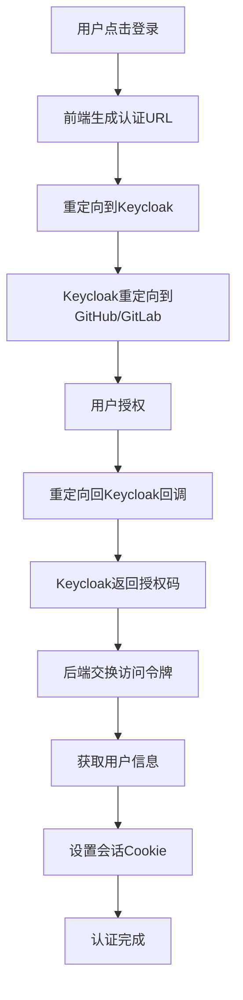
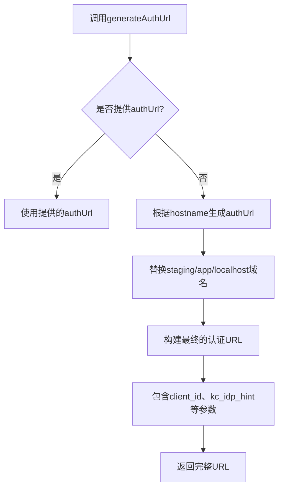
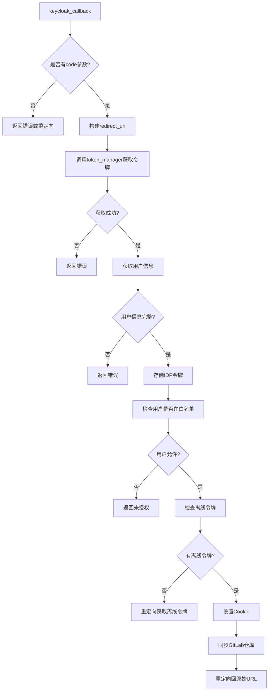
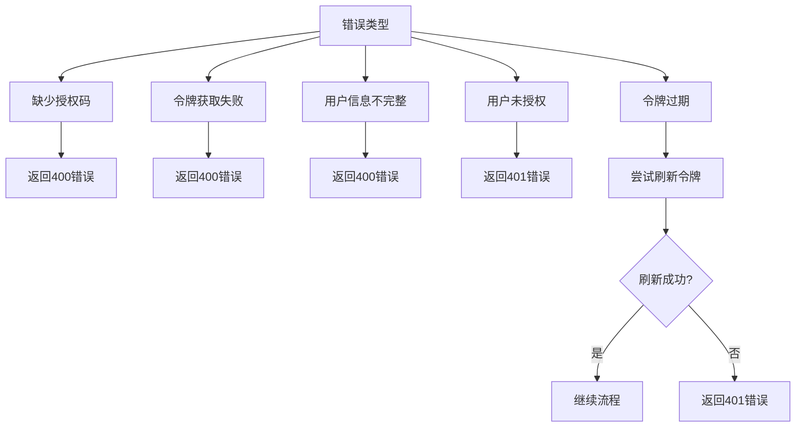
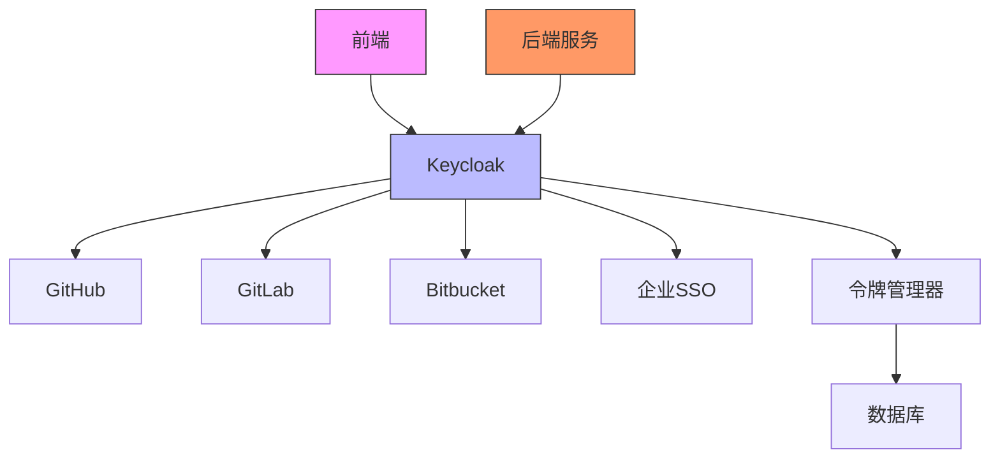
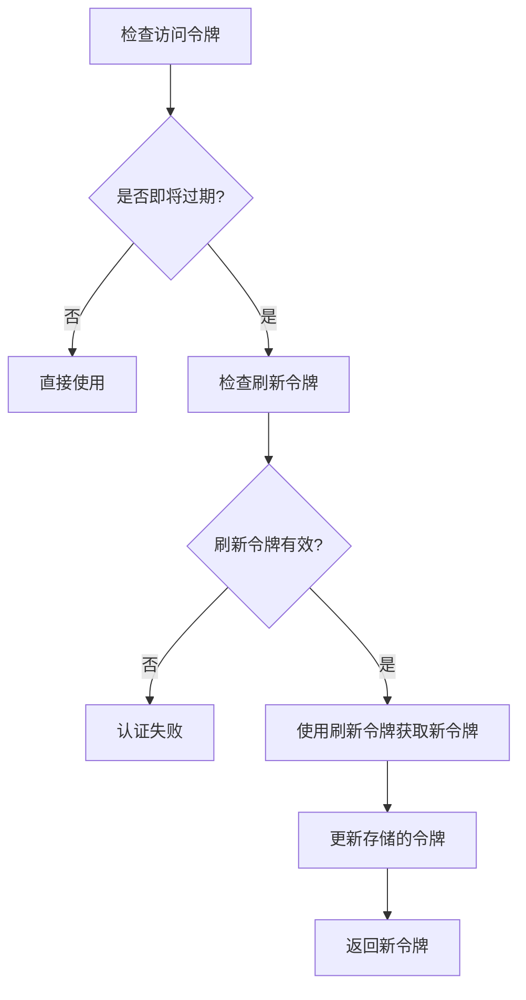

# 第三方登录

<cite>
**本文档引用的文件**
- [generate-auth-url.ts](file://frontend/src/utils/generate-auth-url.ts)
- [auth-service.api.ts](file://frontend/src/api/auth-service/auth-service.api.ts)
- [auth.py](file://enterprise/server/routes/auth.py)
- [token_manager.py](file://enterprise/server/auth/token_manager.py)
- [saas_user_auth.py](file://enterprise/server/auth/saas_user_auth.py)
- [keycloak_manager.py](file://enterprise/server/auth/keycloak_manager.py)
- [github_utils.py](file://enterprise/server/auth/github_utils.py)
- [gitlab_sync.py](file://enterprise/server/auth/gitlab_sync.py)
- [constants.py](file://enterprise/server/auth/constants.py)
- [use-auth-url.ts](file://frontend/src/hooks/use-auth-url.ts)
- [use-auth-callback.ts](file://frontend/src/hooks/use-auth-callback.ts)
- [auth-modal.tsx](file://frontend/src/components/features/waitlist/auth-modal.tsx)
- [github_proxy.py](file://enterprise/server/routes/github_proxy.py)
</cite>

## 目录
1. [简介](#简介)
2. [认证流程概述](#认证流程概述)
3. [前端认证实现](#前端认证实现)
4. [后端认证流程](#后端认证流程)
5. [OAuth2认证流程详解](#oauth2认证流程详解)
6. [错误处理与安全验证](#错误处理与安全验证)
7. [GitHub、GitLab和Keycloak集成](#github、gitlab和keycloak集成)
8. [令牌管理与刷新机制](#令牌管理与刷新机制)
9. [结论](#结论)

## 简介
本文档详细说明了OpenHands项目中GitHub、GitLab和Keycloak等第三方身份提供商的集成实现。文档涵盖了OAuth2认证流程的具体步骤，包括授权码获取、令牌交换和用户信息拉取。同时，文档还描述了认证过程中的错误处理机制和安全验证措施，如CSRF保护和重定向URI验证。

**Section sources**
- [auth.py](file://enterprise/server/routes/auth.py#L1-L435)
- [token_manager.py](file://enterprise/server/auth/token_manager.py#L1-L672)

## 认证流程概述
OpenHands项目使用Keycloak作为统一的身份认证中心，通过OAuth2协议集成GitHub、GitLab等第三方身份提供商。整个认证流程分为前端发起认证请求、后端处理OAuth2回调、令牌交换和用户信息获取等步骤。

认证流程的核心组件包括：
- 前端：生成认证URL并重定向用户
- 后端：处理OAuth2回调，与Keycloak交互获取令牌
- Keycloak：作为身份代理，与GitHub、GitLab等提供商进行令牌交换
- 令牌管理器：负责存储、刷新和验证各类令牌



**Diagram sources**
- [generate-auth-url.ts](file://frontend/src/utils/generate-auth-url.ts#L1-L45)
- [auth.py](file://enterprise/server/routes/auth.py#L99-L249)

## 前端认证实现
前端通过`generateAuthUrl`函数生成认证URL，该函数根据当前环境和身份提供商生成正确的重定向URL。



**Diagram sources**
- [generate-auth-url.ts](file://frontend/src/utils/generate-auth-url.ts#L1-L45)
- [use-auth-url.ts](file://frontend/src/hooks/use-auth-url.ts#L1-L20)

### 认证URL生成逻辑
前端认证URL的生成遵循以下规则：
1. 确定协议：localhost使用http，其他环境使用https
2. 构建重定向URI：指向`/oauth/keycloak/callback`
3. 确定认证服务器URL：通过环境变量或域名替换规则确定
4. 构建完整的OAuth2授权URL，包含必要的参数

关键参数包括：
- `client_id`: Keycloak客户端ID
- `kc_idp_hint`: 指示使用哪个身份提供商（github、gitlab等）
- `response_type`: 设置为code，表示使用授权码流程
- `redirect_uri`: 回调地址
- `scope`: 请求的权限范围
- `state`: 包含原始请求URL，用于防止CSRF攻击

**Section sources**
- [generate-auth-url.ts](file://frontend/src/utils/generate-auth-url.ts#L1-L45)
- [use-auth-url.ts](file://frontend/src/hooks/use-auth-url.ts#L1-L20)

## 后端认证流程
后端认证流程由`keycloak_callback`函数处理，该函数接收授权码并完成后续的令牌交换和用户验证。



**Diagram sources**
- [auth.py](file://enterprise/server/routes/auth.py#L99-L249)
- [token_manager.py](file://enterprise/server/auth/token_manager.py#L89-L153)

## OAuth2认证流程详解
OAuth2认证流程包含多个关键步骤，从授权码获取到最终的令牌交换。

### 授权码获取阶段
当用户点击GitHub或GitLab登录按钮时，前端生成相应的认证URL并重定向用户。认证URL包含以下重要参数：

| 参数 | 说明 |
|------|------|
| client_id | Keycloak客户端ID |
| kc_idp_hint | 身份提供商提示（github、gitlab） |
| response_type | 响应类型，固定为code |
| redirect_uri | 回调地址，指向keycloak/callback |
| scope | 请求的权限范围（openid email profile） |
| state | 状态参数，包含原始请求URL |

**Section sources**
- [generate-auth-url.ts](file://frontend/src/utils/generate-auth-url.ts#L1-L45)
- [auth.py](file://enterprise/server/routes/auth.py#L99-L121)

### 令牌交换阶段
在用户授权后，Keycloak会重定向回应用的回调地址，携带授权码。后端服务接收到授权码后，通过`token_manager.get_keycloak_tokens`方法与Keycloak服务器交换访问令牌和刷新令牌。

```python
(
    keycloak_access_token,
    keycloak_refresh_token,
) = await token_manager.get_keycloak_tokens(code, redirect_uri)
```

如果令牌获取成功，系统会进一步获取用户信息：

```python
user_info = await token_manager.get_user_info(keycloak_access_token)
```

用户信息包含关键字段：
- `sub`: 用户唯一标识
- `preferred_username`: 用户名
- `identity_provider`: 身份提供商
- `email`: 用户邮箱

**Section sources**
- [auth.py](file://enterprise/server/routes/auth.py#L123-L153)
- [token_manager.py](file://enterprise/server/auth/token_manager.py#L89-L112)

### 用户信息验证阶段
获取用户信息后，系统会进行多项验证：

1. **必填字段检查**：确保`sub`和`preferred_username`存在
2. **身份提供商确定**：从`identity_provider`字段获取或默认为GitHub
3. **白名单检查**：通过`UserVerifier`检查用户是否在允许列表中
4. **离线令牌检查**：验证用户是否有有效的离线令牌

如果用户没有离线令牌，系统会重定向到Keycloak的离线访问授权页面：

```python
redirect_url = (
    f'{KEYCLOAK_SERVER_URL_EXT}/realms/{KEYCLOAK_REALM_NAME}/protocol/openid-connect/auth'
    f'?client_id={KEYCLOAK_CLIENT_ID}&response_type=code'
    f'&kc_idp_hint={idp}'
    f'&redirect_uri={scheme}%3A%2F%2F{request.url.netloc}%2Foauth%2Fkeycloak%2Foffline%2Fcallback'
    f'&scope=openid%20email%20profile%20offline_access'
    f'&state={state}'
)
```

**Section sources**
- [auth.py](file://enterprise/server/routes/auth.py#L133-L215)
- [github_utils.py](file://enterprise/server/auth/github_utils.py#L11-L80)

## 错误处理与安全验证
系统实现了全面的错误处理和安全验证机制，确保认证过程的安全性和可靠性。

### 错误处理机制
系统处理多种可能的错误情况：



**Diagram sources**
- [auth.py](file://enterprise/server/routes/auth.py#L116-L118)
- [token_manager.py](file://enterprise/server/auth/token_manager.py#L109-L111)

### 安全验证措施
系统实施了多项安全措施：

1. **CSRF保护**：使用state参数验证请求来源
2. **重定向URI验证**：确保重定向URI的合法性
3. **令牌加密存储**：使用Fernet加密存储敏感令牌
4. **速率限制**：防止暴力破解攻击
5. **Cookie安全设置**：HttpOnly、Secure、SameSite属性

Cookie设置示例：
```python
response.set_cookie(
    key='keycloak_auth',
    value=signed_token,
    domain=domain,
    httponly=True,
    secure=secure,
    samesite=get_cookie_samesite(request),
)
```

**Section sources**
- [auth.py](file://enterprise/server/routes/auth.py#L59-L77)
- [token_manager.py](file://enterprise/server/auth/token_manager.py#L47-L75)

## GitHub、GitLab和Keycloak集成
系统通过统一的架构集成多个身份提供商，其中Keycloak作为中心枢纽。

### 集成架构


**Diagram sources**
- [auth.py](file://enterprise/server/routes/auth.py#L1-L435)
- [token_manager.py](file://enterprise/server/auth/token_manager.py#L1-L672)

### GitHub集成
GitHub集成通过以下步骤实现：

1. **配置环境变量**：
   - `GITHUB_APP_CLIENT_ID`
   - `GITHUB_APP_CLIENT_SECRET`

2. **令牌刷新**：
```python
async def _refresh_github_token(self, refresh_token: str) -> dict[str, str | int]:
    url = 'https://github.com/login/oauth/access_token'
    payload = {
        'client_id': GITHUB_APP_CLIENT_ID,
        'client_secret': GITHUB_APP_CLIENT_SECRET,
        'refresh_token': refresh_token,
        'grant_type': 'refresh_token',
    }
```

3. **用户验证**：
通过`UserVerifier`类检查用户是否在白名单中，支持从文件或Google Sheets加载允许的用户列表。

**Section sources**
- [github_utils.py](file://enterprise/server/auth/github_utils.py#L1-L127)
- [constants.py](file://enterprise/server/auth/constants.py#L1-L33)

### GitLab集成
GitLab集成与GitHub类似，但有以下特点：

1. **配置环境变量**：
   - `GITLAB_APP_CLIENT_ID`
   - `GITLAB_APP_CLIENT_SECRET`

2. **令牌刷新**：
```python
async def _refresh_gitlab_token(self, refresh_token: str) -> dict[str, str | int]:
    url = 'https://gitlab.com/oauth/token'
    payload = {
        'client_id': GITLAB_APP_CLIENT_ID,
        'client_secret': GITLAB_APP_CLIENT_SECRET,
        'refresh_token': refresh_token,
        'grant_type': 'refresh_token',
    }
```

3. **仓库同步**：
首次登录时，系统会自动同步用户的GitLab仓库：
```python
schedule_gitlab_repo_sync(user_id, SecretStr(keycloak_access_token))
```

**Section sources**
- [gitlab_sync.py](file://enterprise/server/auth/gitlab_sync.py#L1-L32)
- [constants.py](file://enterprise/server/auth/constants.py#L1-L33)

### Keycloak集成
Keycloak作为身份代理的核心，其集成包括：

1. **客户端配置**：
   - `KEYCLOAK_SERVER_URL`: Keycloak服务器地址
   - `KEYCLOAK_REALM_NAME`: 领域名称
   - `KEYCLOAK_CLIENT_ID`: 客户端ID
   - `KEYCLOAK_CLIENT_SECRET`: 客户端密钥

2. **管理员API**：
```python
def get_keycloak_admin(external=False) -> KeycloakAdmin:
    if external not in _keycloak_admin_instances:
        keycloak_admin = KeycloakAdmin(
            server_url=KEYCLOAK_SERVER_URL_EXT if external else KEYCLOAK_SERVER_URL,
            username='admin',
            password=KEYCLOAK_ADMIN_PASSWORD,
            realm_name='master',
            client_id='admin-cli',
            verify=True,
        )
```

3. **OpenID Connect**：
```python
def get_keycloak_openid(external=False) -> KeycloakOpenID:
    if external not in _keycloak_instances:
        _keycloak_instances[external] = KeycloakOpenID(
            server_url=KEYCLOAK_SERVER_URL_EXT if external else KEYCLOAK_SERVER_URL,
            realm_name=KEYCLOAK_REALM_NAME,
            client_id=KEYCLOAK_CLIENT_ID,
            client_secret_key=KEYCLOAK_CLIENT_SECRET,
        )
```

**Section sources**
- [keycloak_manager.py](file://enterprise/server/auth/keycloak_manager.py#L1-L51)
- [constants.py](file://enterprise/server/auth/constants.py#L1-L33)

## 令牌管理与刷新机制
系统实现了复杂的令牌管理机制，确保令牌的安全性和可用性。

### 令牌存储
令牌使用加密方式存储：

```python
def create_encryption_utility(secret_key: bytes):
    fernet_key = b64encode(hashlib.sha256(secret_key).digest())
    f = Fernet(fernet_key)
    
    def encrypt_text(text: str) -> str:
        return f.encrypt(text.encode()).decode()
    
    def decrypt_text(encrypted_text: str) -> str:
        return f.decrypt(encrypted_text.encode()).decode()
```

**Section sources**
- [token_manager.py](file://enterprise/server/auth/token_manager.py#L47-L75)

### 令牌刷新策略
系统实现了智能的令牌刷新策略：



访问令牌在过期前4小时就会被刷新，确保令牌在恢复会话时至少有4小时的有效期。

**Section sources**
- [token_manager.py](file://enterprise/server/auth/token_manager.py#L289-L329)
- [saas_user_auth.py](file://enterprise/server/auth/saas_user_auth.py#L65-L79)

## 结论
OpenHands项目通过Keycloak实现了对GitHub、GitLab等第三方身份提供商的安全集成。系统采用OAuth2授权码流程，确保了认证过程的安全性。通过前端URL生成、后端令牌交换、用户验证和安全措施的完整流程，为用户提供了一致且安全的登录体验。

关键特点包括：
- 统一的认证架构，支持多种身份提供商
- 完善的错误处理和安全验证机制
- 智能的令牌管理和刷新策略
- 用户白名单控制和TOS同意机制
- 自动化的GitLab仓库同步

该实现为SaaS应用提供了可靠的身份认证解决方案，同时保持了良好的用户体验。