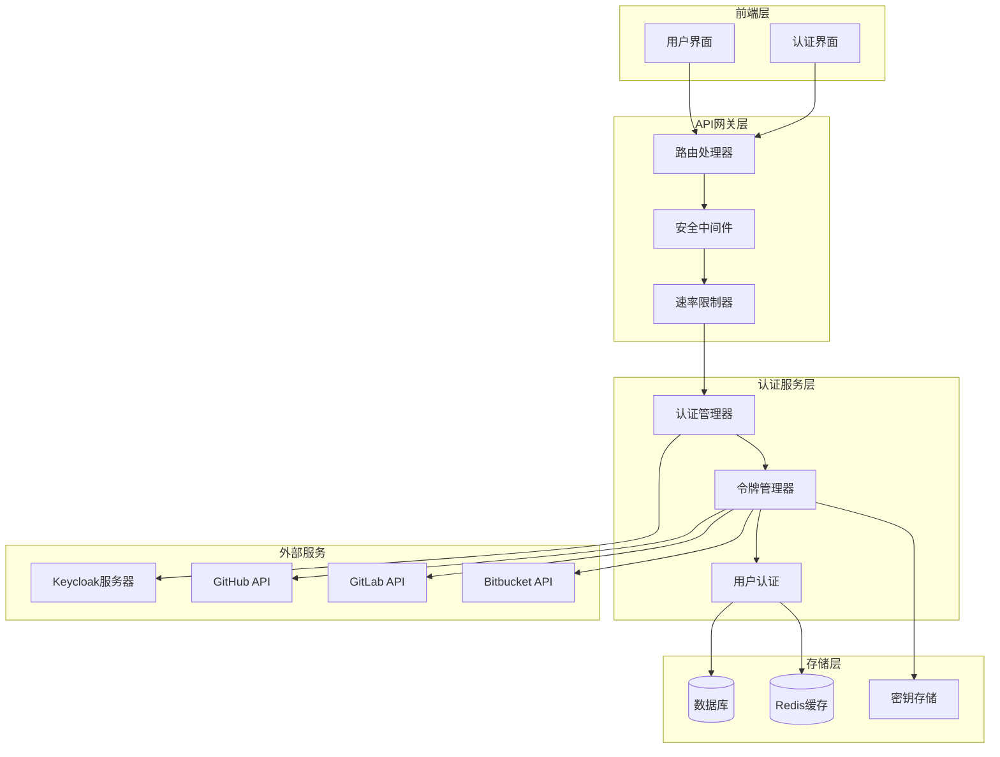
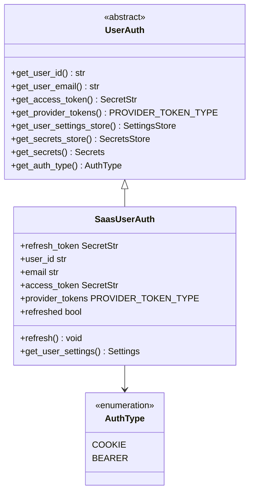
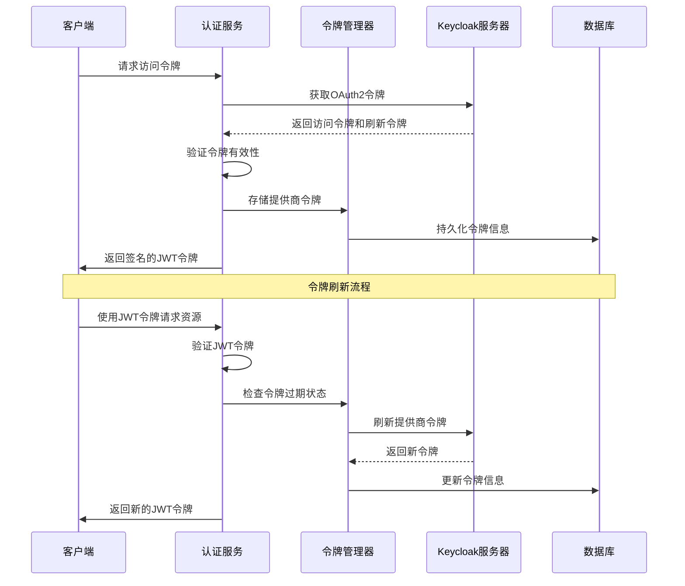
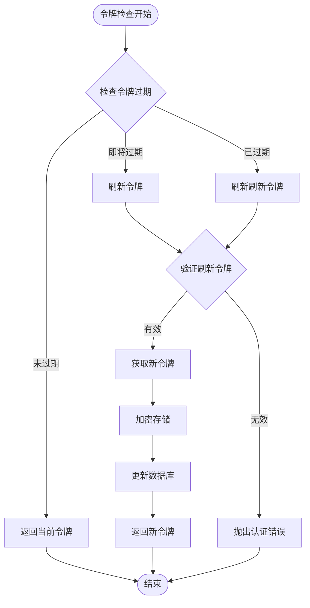
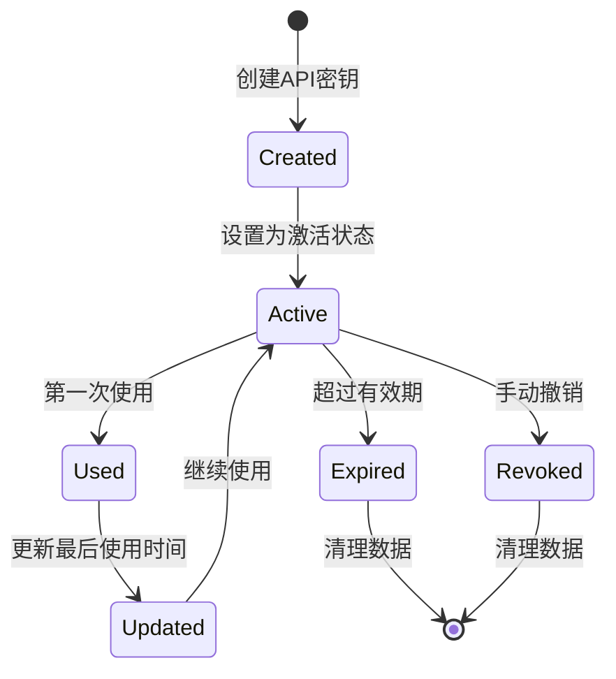
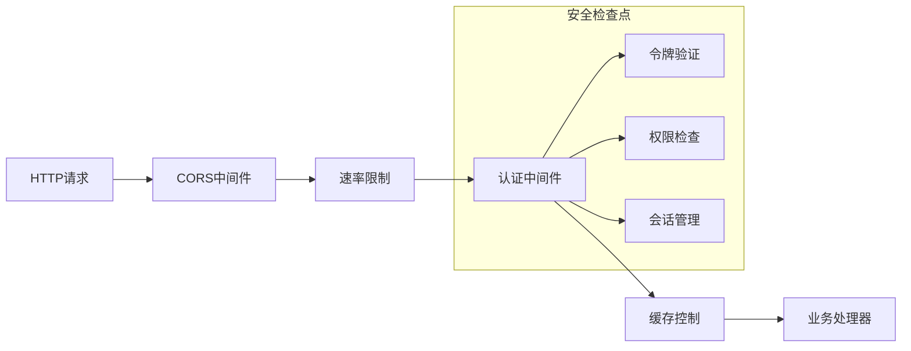
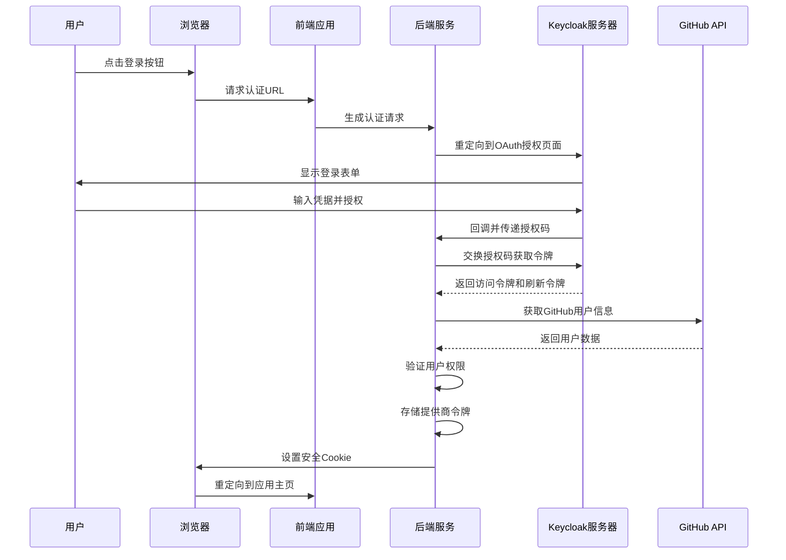
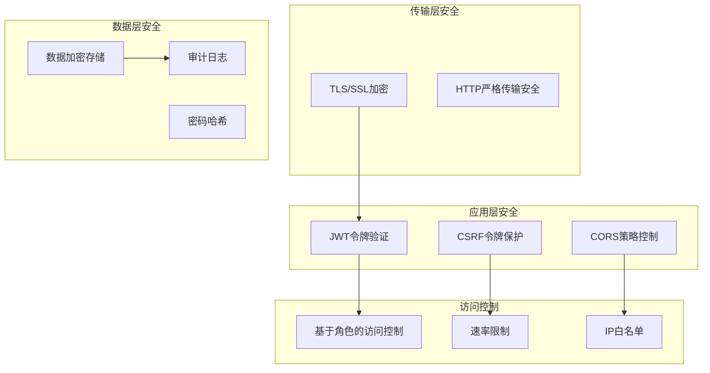
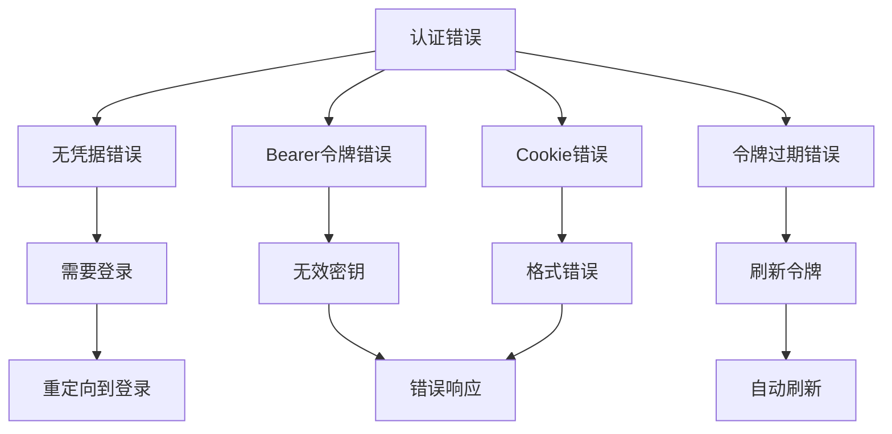

# 认证与授权

<cite>
**本文档中引用的文件**
- [auth_utils.py](file://enterprise/server/auth/auth_utils.py)
- [auth.py](file://enterprise/server/routes/auth.py)
- [token_manager.py](file://enterprise/server/auth/token_manager.py)
- [saas_user_auth.py](file://enterprise/server/auth/saas_user_auth.py)
- [api_key_store.py](file://enterprise/storage/api_key_store.py)
- [user_auth.py](file://openhands/server/user_auth/user_auth.py)
- [middleware.py](file://openhands/server/middleware.py)
- [config.py](file://enterprise/server/config.py)
- [rate_limit.py](file://enterprise/server/rate_limit.py)
- [jwt_service.py](file://openhands/app_server/services/jwt_service.py)
</cite>

## 目录
1. [简介](#简介)
2. [系统架构概览](#系统架构概览)
3. [核心认证机制](#核心认证机制)
4. [令牌管理系统](#令牌管理系统)
5. [API密钥管理](#api密钥管理)
6. [中间件与安全层](#中间件与安全层)
7. [OAuth2认证流程](#oauth2认证流程)
8. [安全最佳实践](#安全最佳实践)
9. [错误处理与监控](#错误处理与监控)
10. [故障排除指南](#故障排除指南)
11. [总结](#总结)

## 简介

OpenHands采用了一套完整的认证与授权系统，支持多种身份提供商（Identity Providers）和认证方式。该系统基于现代安全标准设计，提供了JWT令牌管理、OAuth2认证流程、API密钥管理和细粒度权限控制等功能。

### 主要特性

- **多身份提供商支持**：GitHub、GitLab、Bitbucket和企业SSO
- **JWT令牌管理**：支持JWS和JWE加密令牌
- **OAuth2认证流程**：完整的授权码流程支持
- **API密钥管理**：用户级API密钥生成和验证
- **令牌刷新机制**：自动令牌轮换和刷新
- **速率限制**：防止滥用的安全机制
- **安全中间件**：多层安全防护

## 系统架构概览

**图表来源**
- [auth.py](file://enterprise/server/routes/auth.py#L1-L50)
- [token_manager.py](file://enterprise/server/auth/token_manager.py#L78-L100)
- [saas_user_auth.py](file://enterprise/server/auth/saas_user_auth.py#L43-L80)

## 核心认证机制

### 用户认证抽象层

系统定义了统一的用户认证接口，支持多种认证方式：

**图表来源**
- [user_auth.py](file://openhands/server/user_auth/user_auth.py#L23-L107)
- [saas_user_auth.py](file://enterprise/server/auth/saas_user_auth.py#L43-L324)

### 认证类型支持

系统支持两种主要的认证方式：

1. **Cookie认证**：基于浏览器的会话认证
2. **Bearer Token认证**：API密钥认证

**章节来源**
- [saas_user_auth.py](file://enterprise/server/auth/saas_user_auth.py#L238-L267)
- [user_auth.py](file://openhands/server/user_auth/user_auth.py#L18-L21)

## 令牌管理系统

### JWT令牌架构

**图表来源**
- [token_manager.py](file://enterprise/server/auth/token_manager.py#L89-L112)
- [saas_user_auth.py](file://enterprise/server/auth/saas_user_auth.py#L65-L80)

### 令牌刷新机制

系统实现了智能的令牌刷新机制，确保用户会话的连续性：

**图表来源**
- [token_manager.py](file://enterprise/server/auth/token_manager.py#L289-L322)
- [saas_user_auth.py](file://enterprise/server/auth/saas_user_auth.py#L65-L80)

**章节来源**
- [token_manager.py](file://enterprise/server/auth/token_manager.py#L289-L322)
- [saas_user_auth.py](file://enterprise/server/auth/saas_user_auth.py#L65-L80)

## API密钥管理

### API密钥生命周期

### API密钥存储结构

| 字段名 | 类型 | 描述 | 必填 |
|--------|------|------|------|
| id | Integer | 主键标识符 | 是 |
| key | String | API密钥值（哈希存储） | 是 |
| user_id | String | 关联用户ID | 是 |
| name | String | 密钥名称（可选） | 否 |
| created_at | DateTime | 创建时间 | 是 |
| last_used_at | DateTime | 最后使用时间 | 否 |
| expires_at | DateTime | 过期时间 | 否 |

**章节来源**
- [api_key_store.py](file://enterprise/storage/api_key_store.py#L16-L133)

## 中间件与安全层

### 安全中间件栈

**图表来源**
- [middleware.py](file://openhands/server/middleware.py#L1-L132)

### Cookie安全配置

系统实现了严格的Cookie安全策略：

| 安全属性 | 开发环境 | 生产环境 | 说明 |
|----------|----------|----------|------|
| HttpOnly | true | true | 防止XSS攻击 |
| Secure | false | true | 仅HTTPS传输 |
| SameSite | lax | strict | CSRF保护 |
| Domain | localhost | 自动检测 | 域名匹配 |

**章节来源**
- [auth.py](file://enterprise/server/routes/auth.py#L43-L97)
- [middleware.py](file://openhands/server/middleware.py#L16-L49)

## OAuth2认证流程

### 完整的OAuth2流程

**图表来源**
- [auth.py](file://enterprise/server/routes/auth.py#L99-L287)

### OAuth2配置参数

| 参数名 | 描述 | 示例值 |
|--------|------|--------|
| client_id | 应用客户端ID | allhands |
| redirect_uri | 回调地址 | https://app.all-hands.dev/oauth/keycloak/callback |
| response_type | 响应类型 | code |
| scope | 权限范围 | openid email profile |
| kc_idp_hint | 身份提供商提示 | github/gitlab/bitbucket |

**章节来源**
- [auth.py](file://enterprise/server/routes/auth.py#L99-L287)
- [config.py](file://enterprise/server/config.py#L62-L191)

## 安全最佳实践

### 多层安全防护

### 密钥管理策略

1. **JWT密钥管理**
   - 支持多密钥轮换
   - 自动密钥验证
   - 密钥版本控制

2. **加密密钥管理**
   - Fernet对称加密
   - SHA256密钥派生
   - 密钥长度32字节

**章节来源**
- [token_manager.py](file://enterprise/server/auth/token_manager.py#L47-L87)
- [jwt_service.py](file://openhands/app_server/services/jwt_service.py#L120-L248)

## 错误处理与监控

### 认证错误分类

### 监控指标

| 指标类别 | 具体指标 | 监控目的 |
|----------|----------|----------|
| 认证成功率 | 登录成功/总请求数 | 评估系统可用性 |
| 令牌刷新频率 | 刷新次数/活跃用户 | 监控令牌健康度 |
| 错误分布 | 各类错误占比 | 识别问题热点 |
| 响应时间 | 认证平均响应时间 | 性能监控 |

**章节来源**
- [auth.py](file://enterprise/server/routes/auth.py#L295-L318)
- [rate_limit.py](file://enterprise/server/rate_limit.py#L1-L137)

## 故障排除指南

### 常见认证问题

1. **令牌过期问题**
   - 检查令牌刷新机制
   - 验证刷新令牌有效性
   - 确认网络连接状态

2. **Cookie设置失败**
   - 检查SameSite设置
   - 验证域名配置
   - 确认HTTPS要求

3. **API密钥验证失败**
   - 检查密钥格式
   - 验证过期时间
   - 确认用户权限

### 调试工具

- **日志级别配置**：启用详细认证日志
- **令牌解码工具**：验证JWT令牌内容
- **网络抓包分析**：检查OAuth2流程
- **数据库查询**：验证令牌存储状态

**章节来源**
- [auth_utils.py](file://enterprise/server/auth/auth_utils.py#L1-L80)
- [token_manager.py](file://enterprise/server/auth/token_manager.py#L623-L672)

## 总结

OpenHands的认证与授权系统是一个功能完整、安全可靠的解决方案，具备以下特点：

### 核心优势

1. **安全性**：多层防护机制，符合现代安全标准
2. **灵活性**：支持多种认证方式和身份提供商
3. **可扩展性**：模块化设计，易于扩展新功能
4. **可靠性**：完善的错误处理和监控机制
5. **性能**：高效的令牌管理和缓存策略

### 技术亮点

- **JWT令牌系统**：支持JWS/JWE加密，多密钥轮换
- **OAuth2完整实现**：标准授权码流程，支持多种IDP
- **智能令牌刷新**：自动检测过期，无缝用户体验
- **API密钥管理**：用户级密钥，灵活的权限控制
- **速率限制**：防止滥用，保障系统稳定

该系统为企业级应用提供了坚实的安全基础，同时保持了良好的开发体验和运维便利性。